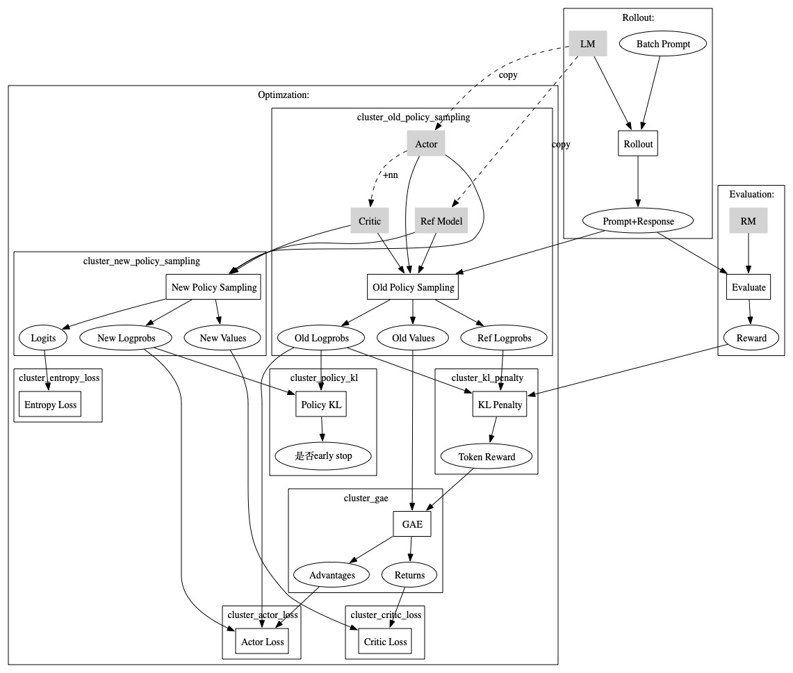
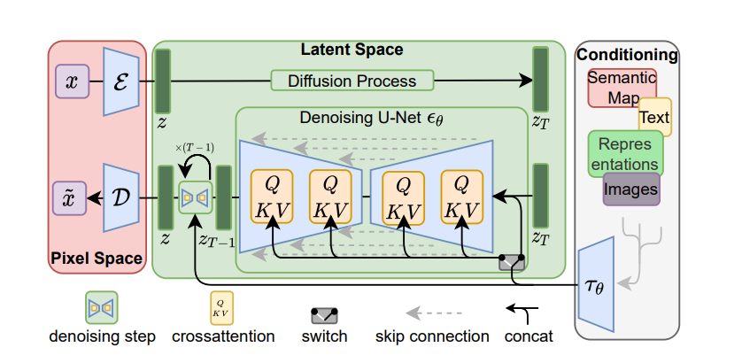

# 大模型与AIGC

下载本文pdf：[https://github.com/daiwk/collections/blob/master/pdfs/llm_aigc.pdf](https://github.com/daiwk/collections/blob/master/pdfs/llm_aigc.pdf)

各种学习相关代码

[https://github.com/daiwk/llms](https://github.com/daiwk/llms)


## 小结

decoder的并行化： [https://zhuanlan.zhihu.com/p/368592551](https://zhuanlan.zhihu.com/p/368592551)

+ gpt1：transformer的decoder，参数量117m（0.1b）
+ gpt2：模型结构小改，增加数据，参数量变大（1.5b）
+ gpt3：175b（1750亿）参数，当参数量到达千亿时出现了『涌现』现象，发现可以in-context learning
+ Instructgpt：RLHF（sft-->rm-->ppo）
+ gpt3.5：据说基本上等于instructgpt
+ gpt4：没公开细节，但听说效果很好，用起来也确实比3.5要好

## llm应用合辑

+ ChatGPT聚合站：[https://hokex.com](https://hokex.com)
+ 游戏生成站：[https://latitude.io/](https://latitude.io/)
+ 家庭作业辅助站：[https://ontimeai.com/](https://ontimeai.com/)
+ 文字转语音站：[https://www.resemble.ai/](https://www.resemble.ai/)
+ 艺术作画站：[https://starryai.com/](https://starryai.com/)
+ logo制作站：[https://www.logoai.com/](https://www.logoai.com/)
+ ai写作站：[https://www.getconch.ai/](https://www.getconch.ai/)
+ 音乐制作站：[https://soundraw.io/](https://soundraw.io/)
+ 声音模拟站：[https://fakeyou.com/](https://fakeyou.com/)
+ 一句话生成一段视频：[https://runwayml.com/](https://runwayml.com/)
+ 文字转语音：[https://murf.ai/](https://runwayml.com/)

## RLHF

[https://huggingface.co/blog/zh/rlhf](https://huggingface.co/blog/zh/rlhf)

+ 预训练一个语言模型 (LM) ；
+ 聚合问答数据并训练一个奖励模型 (Reward Model，RM)，也叫偏好模型；
+ 用强化学习 (RL) 方式微调 LM。


### sft


{ height=40% }

+ openai：instructGPT使用小版本的GPT-3，并对“更可取”（preferable）的人工生成文本微调
+ Anthropic：1000w-520亿参数的transformer，并按“有用、诚实和无害”的标准在上下文线索上蒸馏原始LM
+ DeepMind：2800亿的模型Gopher

### rm

{ height=40% }

接收一系列文本并返回一个标量奖励，数值上对应人的偏好。我们可以用端到端的方式用 LM 建模，或者用模块化的系统建模 (比如对输出进行排名，再将排名转换为奖励) 。

+ **模型选择**：RM 可以是另一个经过微调的 LM，也可以是根据偏好数据从头开始训练的 LM。Anthropic 提出了一种特殊的预训练方式，即用偏好模型预训练 (Preference Model Pretraining，PMP) 来替换一般预训练后的微调过程。因为前者被认为对样本数据的利用率更高。
+ **训练文本**：RM 的提示 - 生成对文本是从预定义数据集中采样生成的，并用初始的 LM 给这些提示生成文本。Anthropic 的数据主要是通过 Amazon Mechanical Turk 上的聊天工具生成的，并在 [Hub](https://huggingface.co/datasets/Anthropic/hh-rlhf) 上 可用，而 OpenAI 使用了用户提交给 GPT API 的 prompt。
+ **训练奖励数值**：人工对 LM 生成的回答进行排名。起初我们可能会认为应该直接对文本标注分数来训练 RM，但是由于标注者的价值观不同导致这些分数未经过校准并且充满噪音，通过排名可以比较多个模型的输出并构建更好的规范数据集，这些不同的排名结果将被归一化为用于训练的标量奖励值。

目前成功的 RLHF 系统使用了和生成模型具有 不同 大小的 LM，OpenAI 使用了 175B 的 LM 和 6B 的 RM，Anthropic 使用的 LM 和 RM 从 10B 到 52B 大小不等，DeepMind 使用了 70B 的 Chinchilla 模型分别作为 LM 和 RM


### rl

{ height=40% }

直接微调整个 10B～100B+ 参数的成本过高 ，参考低秩自适应[LoRA](https://arxiv.org/abs/2106.09685)和DeepMind的[Sparrow LM](https://arxiv.org/abs/2209.14375)。目前多个组织找到的可行方案是使用策略梯度强化学习 (Policy Gradient RL) 算法、近端策略优化 (Proximal Policy Optimization，PPO) **微调初始 LM 的部分或全部参数**。

+ 策略 (policy)：一个接受提示并返回一系列文本 (或文本的概率分布) 的 LM
+ 行动空间（action space）： LM 的词表对应的所有词元 (一般在 50k 数量级) 
+ 观察空间 (observation space)： 是可能的输入词元序列，也比较大 (词汇量^输入标记的数量) 
+ 奖励函数：偏好模型和策略转变约束 (Policy shift constraint) 的结合。

ppo确定的奖励函数如下：

+ 提示$x$输入初始LM和当前微调的LM，分别得到输出文本$y_1$和$y_2$
+ 将来自当前策略的文本传给RM得到标量奖励$r_{\theta}$
+ 将两个模型的生成文本进行比较计算差异的惩罚项，一般是输出词分布间的KL散度的缩放，即$r=r_{\theta}-\lambda r_{KL}$，

惩罚项的好处：
+ 用于惩罚策略在每个训练batch中生成大幅偏离初始模型，以确保模型输出合理连贯的文本。
+ 如果没有这一项，可能导致模型在优化中生成乱码文本，以愚弄奖励模型提供高奖励值。

根据PPO，按当前batch的奖励进行优化。PPO是置信域优化（TRO，Trust Region Optimization）算法，用梯度约束确保更新步骤不会破坏学习过程的稳定性。

DeepMind对Gopher用了类似的奖励设置，但用的是A2C来优化梯度。


#### 概述

[https://zhuanlan.zhihu.com/p/635757674](https://zhuanlan.zhihu.com/p/635757674)

[Fine-Tuning Language Models from Human Preferences](https://arxiv.org/pdf/1909.08593.pdf)

[Secrets of RLHF in Large Language Models Part I: PPO](https://arxiv.org/pdf/2307.04964.pdf)


{ height=40% }

+ Rollout and Evaluation：从prompt库里抽样，使用语言模型生成response，然后使用奖励模型（Reward Model, RM）给出奖励得分。这个得分反映了生成的response的质量，比如它是否符合人类的偏好，是否符合任务的要求等。
+ Make experience：收集了一系列的“经验”，即模型的行为和对应的奖励。这些经验包括了模型生成的response以及对应的奖励得分。这些经验将被用于下一步的优化过程。
+ Optimization：使用收集到的经验来更新模型的参数。具体来说，我们使用PPO算法来调整模型的参数，使得模型生成的response的奖励得分能够增加。PPO算法的一个关键特性是它尝试保持模型的行为不会发生太大的改变，这有助于保证模型的稳定性。

官方代码example

```python
from tqdm import tqdm

for epoch, batch in tqdm(enumerate(ppo_trainer.dataloader)):
    query_tensors = batch["input_ids"]

    #### Get response from SFTModel
    response_tensors = ppo_trainer.generate(query_tensors, **generation_kwargs)
    batch["response"] = [tokenizer.decode(r.squeeze()) for r in response_tensors]

    #### Compute reward score
    texts = [q + r for q, r in zip(batch["query"], batch["response"])]
    pipe_outputs = reward_model(texts)
    rewards = [torch.tensor(output[1]["score"]) for output in pipe_outputs]

    #### Run PPO step
    stats = ppo_trainer.step(query_tensors, response_tensors, rewards)
    ppo_trainer.log_stats(stats, batch, rewards)

#### Save model
ppo_trainer.save_model("my_ppo_model")
```

{ height=40% }


+ Rollout：根据策略（LM）生成轨迹（文本）。
    + 输入：Batch Prompt、LM
    + 输出：Prompt+Response
+ Evaluate：对生成的轨迹进行评估（RM）。
    + 输入：Prompt+Response、RM
    + 输出：Reward
+ Old Policy Sampling：计算并存储旧策略的概率、价值等值，
    + 输入：Ref_model、Actor、Critic、Prompt+Response
    + 输出：Ref Logprobs、Old Logprobs、Old Values
+ KL Penalty：计算**当前策略**和**原始LM**之间的KL散度，用作对策略改变过快的惩罚项。
    + 输入：Ref Logprobs、Old Logprobs、Reward
    + 输出：Token Reward
+ Generalized Advantage Estimation (GAE)：G。基于old value(shape是(`batch_size`, `response_length`))和reward估计优势函数A，它结合了所有可能的n-step 进行advantage估计
    + 输入：Token Reward、Old Values
    + 输出：Advantages、Returns
+ New Policy Sampling：
    + 输入ref_model、actor、critic，从新的策略中采样概率等信息，
    + 输出new logprobs、new values和logits，供actor loss、critic loss以及entropy loss用。
+ Critic Loss：Critic的目标是估计状态的价值函数，Critic loss就是价值函数预测值和实际回报之间的差距。
    + 输入：New Values、Returns
    + 输出：critic梯度更新
+ Actor Loss：Actor的目标是优化策略，Actor loss就是基于优势函数的策略梯度。
    + 输入：Old Logprobs，New Logprobs、Advantages
    + 输出：actor梯度更新
+ Entropy Loss：为了增加探索性，通常会添加一个基于策略熵的正则项，它鼓励策略保持多样性。
    + 输入：Logits
    + 输出：entropy loss
+ Policykl：这是对策略迭代过程的一个度量，它度量**新策略**和**旧策略**之间的差距。
    + 输入：Old Logprobs、New Logprobs
    + 输出：是否early stop

在PPO中，策略优化的过程涉及到两个策略：一个是"旧的"策略，这是我们在开始每次优化迭代时使用的策略，另一个是"新的"策略，这是我们在优化过程中**不断更新**的策略。

自己整理重画的

{ height=40% }


#### actor & actor loss

Actor 是**策略**，它决定文本会被怎么样生成，是从**策略网络**拷贝来的模拟整个智能体在环境中行动的网络。

优势函数表示在给定的状态下采取某个行动比遵循当前策略的期望回报要好多少。

Actor Loss如下，用重要性采样比较在**旧策略**和**新策略**下行动的概率（Old Logprobs，New Logprobs），然后将这个比值（也就是 Importance Sampling 的权重）与**优势函数Advantages**相乘，得到了对 Actor Loss 的一个估计。

$$L=\pi_{new}/\pi_{old} * A$$

```python
# 计算新旧策略下概率的比值
ratio = torch.exp(logprobs - old_logprobs)

# 计算未截断的策略梯度损失
pg_losses = -advantages * ratio

# 计算截断的策略梯度损失
pg_losses2 = -advantages * torch.clamp(ratio, 1.0 - self.config.cliprange,
     1.0 + self.config.cliprange)

# 选择两者中较大的作为最终的策略梯度损失
pg_loss = masked_mean(torch.max(pg_losses, pg_losses2), mask)

# 计算因为截断导致策略梯度损失改变的比例
pg_clipfrac = masked_mean(torch.gt(pg_losses2, pg_losses).double(), mask)
```


#### critic & critic loss

critic是专门用来预测actor轨迹**每一步价值**的网络，actor上加几个线性层能够给每个token预测一个值。任务是估计状态的价值函数，也就是预测从当前状态开始，通过遵循某个策略，期望能得到的总回报。

Critic Loss是最小化它的预测价值与实际回报之间的差距，常用mse

通过最小化Critic Loss，Critic的预测能力会逐渐提升。因为Critic的预测结果会被用来**估计每个行动的优势（Advantage）**，这个优势值又会被用来计算策略的更新（Actor Loss）。

```python
# 将价值函数的预测值裁剪到一个范围内
vpredclipped = clip_by_value(
            vpreds, values - self.config.cliprange_value, values + self.config.cliprange_value
        )

# 计算裁剪前和裁剪后的价值函数损失
vf_losses1 = (vpreds - returns) ** 2
vf_losses2 = (vpredclipped - returns) ** 2

# 最终的价值函数损失是裁剪前和裁剪后损失的最大值的平均值的一半
vf_loss = 0.5 * masked_mean(torch.max(vf_losses1, vf_losses2), mask)

# 计算裁剪操作实际发生的频率
vf_clipfrac = masked_mean(torch.gt(vf_losses2, vf_losses1).double(), mask)
```

#### Old Policy Sampling（无bp）

是**make experience**的过程，计算并**存储**旧策略的概率、价值等值，来为后面更新的过程服务。

+ Old Logprobs：从“旧的”策略[即在这个batch数据中初始的LM（initial actor）]中计算每个token在旧的策略下的概率Old Logprobs。
+ Old Values：旧策略中每个**时间步**（每个token的预测结果）的价值，这个值由critic网络进行预测，critic网络就是需要这个值的原因是advantage的计算依赖于Old Values。
+ Ref Logprobs：最最原始的LM对于每个时间步的概率预测，一般就是**固定不变的gpt3**，计算这个值的目的是限制actor的更新，防止其偏离原始gpt3太远，他的实现在下一个步骤中。

```python
all_logprobs, _, values, masks = self.batched_forward_pass(self.model, queries, 
    responses, model_inputs)
ref_logprobs, _, _, _ = self.batched_forward_pass(self.ref_model, queries, 
    responses, model_inputs)
```

#### KL Penalty

用于保证经过强化学习后的模型（新策略actor）不会过于偏离原始预训练模型（ref model）。

```python
# 初始化两个列表来分别存储奖励和非得分奖励
rewards, non_score_rewards = [], []

# 使用 zip 函数并行遍历输入的得分、对数概率、参考模型的对数概率以及mask
for score, logprob, ref_logprob, mask in zip(scores, logprobs, 
        ref_logprobs, masks):
    # 计算 KL 散度，即模型的对数概率与参考模型的对数概率之间的差值
    kl = logprob - ref_logprob

    # 计算非得分奖励，即 KL 散度乘以 KL 控制器值的负值
    non_score_reward = -self.kl_ctl.value * kl
    non_score_rewards.append(non_score_reward)

    # 复制非得分奖励为新的奖励
    reward = non_score_reward.clone()

    # 找到mask中最后一个非零元素的索引，这表示输入序列的实际长度
    last_non_masked_index = mask.nonzero()[-1]

    # 对于最后一个非mask部分的token，其奖励是偏好模型的得分加上 KL 散度
    reward[last_non_masked_index] += score

    # 将计算的奖励添加到奖励列表中
    rewards.append(reward)

# 返回包含所有奖励的张量以及包含所有非得分奖励的张量
return torch.stack(rewards), torch.stack(non_score_rewards)
```

#### GAE

GAE是一种多步优势估计方法。它通过引入一个权衡参数λ，在**单步TD误差**和**多步TD误差**之间进行权衡，从而**减小估计的方差**，提高学习的稳定性。其中$\sigma _{t+l}$是时间步$t+l$的TD误差。

$$A_t=\sum ^{k-1}_{l=0}(\lambda \eta )^{l}\sigma _{t+l}$$

$$\sigma _{t+l}=r_{t+l+1}+\eta V(s_{t+l+1})-V(s_{t+l})$$

```python
# 从后往前遍历整个生成的序列
for t in reversed(range(gen_len)):
    # 计算下一个状态的价值，如果当前状态已经是最后一个状态，则下一个状态的价值为0
    nextvalues = values[:, t + 1] if t < gen_len - 1 else 0.0

    # 计算 δ，它是奖励加上衰减后的下一个状态的价值，然后减去当前状态的价值
    delta = rewards[:, t] + self.config.gamma * nextvalues - values[:, t]

    # 使用 δ 更新 lastgaelam，这是 GAE 公式的一部分
    lastgaelam = delta + self.config.gamma * self.config.lam * lastgaelam

    # 将计算的优势值添加到优势值列表中
    advantages_reversed.append(lastgaelam)

# 将优势值列表反向并转换为张量
advantages = torch.stack(advantages_reversed[::-1]).transpose(0, 1)

# 计算回报值，它是优势值加上状态值
returns = advantages + values
```


#### New Policy Sampling（有bp）

在**新的策略**（更新后的actor）下对轨迹（文本）计算概率的过程，计算Actor Loss，即策略梯度的损失。

Old Logprobs是一次性一个batch的数据计算的，这是因为在一个batch中旧策略都是不变的；而New Logprobs是一个mini batch计算一次，这是因为新策略每个mini batch变一次。

#### entropy loss

一个策略的熵越大，意味着这个策略选择各个动作的概率更加“平均”。在actor的loss里加熵，使得策略的熵尽可能大，从而有更多机会探索可能带来更好奖励的文本轨迹。

```python
entropy = -torch.sum(logits* torch.log(logits + 1e-9), dim=-1).mean()
```

新实现：

```python
    pd = torch.nn.functional.softmax(logits, dim=-1)
    entropy = torch.logsumexp(logits, axis=-1) - torch.sum(pd * logits, axis=-1)
```


#### Policy kl


### 开源库

#### openai的lm-human-preferences(gpt2的finetune)

[https://github.com/openai/lm-human-preferences](https://github.com/openai/lm-human-preferences)

#### huggingface的TRL

[https://github.com/huggingface/trl](https://github.com/huggingface/trl)
 

#### CarperAI的trlx

[https://github.com/CarperAI/trlx](https://github.com/CarperAI/trlx)

#### allenai的RL4LMs

[https://github.com/allenai/RL4LMs](https://github.com/allenai/RL4LMs)


## LLM+推荐

[推荐系统范式之争，LLM vs. ID？](https://mp.weixin.qq.com/s/7pQ891pnp_BM7qH7ROiWwg)


## NLP大模型

### nanogpt

简化版的gpt，
tiktoken：gpt2中使用的开源分词工具，比huggingface的tokenizer快得多

```python
import tiktoken
enc = tiktoken.get_encoding("gpt2")

# 字节对编码过程，我的输出是[31373, 995]
encoding_res = enc.encode("hello world")
print(encoding_res)

# 字节对解码过程，解码结果：hello world
raw_text = enc.decode(encoding_res)
print(raw_text)
```

### InstructGPT

[OpenAI魔改大模型，参数减少100倍！13亿参数InstructGPT碾压GPT-3](https://mp.weixin.qq.com/s/_lsTzx-NbiSmI7KrRXyYZg)

[https://openai.com/blog/deep-reinforcement-learning-from-human-preferences/](https://openai.com/blog/deep-reinforcement-learning-from-human-preferences/)

[Training language models to follow instructions with human feedback](https://cdn.openai.com/papers/Training_language_models_to_follow_instructions_with_human_feedback.pdf)

### Anthropic

[Training a Helpful and Harmless Assistant with Reinforcement Learning from Human Feedback](https://arxiv.org/pdf/2204.05862.pdf)

[Studying Large Language Model Generalization with Influence Functions](https://arxiv.org/pdf/2308.03296.pdf)

[Measuring Faithfulness in Chain-of-Thought Reasoning](https://www-files.anthropic.com/production/files/measuring-faithfulness-in-chain-of-thought-reasoning.pdf)


### llama

[LLaMA: Open and Efficient Foundation Language Models](https://arxiv.org/abs/2302.13971)


参考代码：
[https://github.com/huggingface/transformers/blob/main/src/transformers/models/llama/modeling_llama.py](https://github.com/huggingface/transformers/blob/main/src/transformers/models/llama/modeling_llama.py)

之前的工作考虑的是在训练预算有限的前提下，如何提升模型性能（2022年deepmind的[Training Compute-Optimal Large Language Models](https://arxiv.org/pdf/2203.15556.pdf)的Chinchilla）,llama考虑在预测时的预算。例如chinchilla是一个10b的模型在200b的token上训练，但其实一个7b的模型当用了1T的token后，性能仍在提升。LLama-13b比gpt3在大多数benchmark上好，但size只有1/10，在一个GPU上就能跑。

llama只用公开数据训练，而Chinchilla、PaLM、GPT-3都有自己的未公开数据集。其他的OPT、GPT-NeoX、BLOOM、GLM虽然也只用公开数据集，但打不过PaLM-62B或者Chinchilla

#### 预训练数据

+ English CommonCrawl(67%)：使用CCNet pipeline，去重、用fasttext把非英文的页面删了，用n-gram把低质内容删了。此外，还训了一个线性模型，对页面进行分类：作为维基百科的引用 vs 随机采样的页面，最后把不属于引用这个类别的页面删了
+ C4(15%)：与CCNet类似，主要区别在质量过滤是基于启发式的规则，如标点符号的存在，或者词数和句子数
+ github(4.5%)：使用Google BigQuery里的公开github数据集，只用Apache、BSD和MIT证书的。低质判断是启发式规则，如字母数字占比、行的长度等，用正则删掉head等样式，最终以文件粒度进行去重。
+ wikipedia(4.5%)：2022年6-8月的数据，包括20种语言
+ Gutenberg and Books3(4.5%)：两个书籍数据集，对有90%以上内容重复的书籍做去重。
+ Arxiv(2.5%)：拿原始的tex文件，删掉first section之前的东西，还有一些注释、宏
+ Stack Exchange(2%)：高质量的问答网站，按答案的分数排序

{ height=40% }

tokenizer：BPE，使用sentencepiece的实现。将所有numbers切成单个数字，回退到字节去处理未知的utf8字符（fallback to bytes to decompose unknown UTF-8 characters）

总共有1.4T的token，对大部分训练数据，每个token在训练时只用了一次，除了维基和book大概用了两次。

附：gpt4说：当我们说"一个token只训练一次"，我们其实是在说在一个epoch（一个完整遍历训练集的过程）中，我们只遍历一次完整的数据集。如果一个特定的token在数据集中出现多次，那么在一个epoch中，这个token就会被用来训练模型多次。

{ height=40% }

#### 网络结构

+ pre-normalization(gpt3)：提升训练**稳定性**，对每个子层的输入做norm，而非输出。此外，使用的是RMSNorm函数([Root mean square layer normalization](https://arxiv.org/abs/1910.07467))
+ SwiGLU激活函数(PaLM)：[Glu variants improve trans- former](https://arxiv.org/abs/2002.05202)，把PaLM里的$4d$改了$2/34d$
+ Rotary embeddings(GPTNeo)：删掉原来的绝对位置编码，加上rotary positional embedding(RoPE)，网络的每一层都加，参考[Roformer: En- hanced transformer with rotary position embedding](https://arxiv.org/pdf/2104.09864.pdf)

优化器：AdamW，cosine学习率schedule，最终学习率是最大学习率的10%。0.1的weight decay和1.0的gradient cliping，使用2000steps的warmup

#### 训练加速

+ 对causal multi-head attention加速：实现在[http://github.com/facebookresearch/xformers](http://github.com/facebookresearch/xformers)中，降低内存使用和运行时间，参考[self-attention does not need $o(n^2)$ memory](https://arxiv.org/pdf/2112.05682.pdf)，以及[Flashattention: Fast and memory-efficient exact attention with io-awareness](https://arxiv.org/abs/2205.14135)。思想是
    + 不存储attention weights
    + 不计算被mask的key/query得分
+ 减少xxx：


### llama2

[Llama 2: Open Foundation and Fine-Tuned Chat Models](https://arxiv.org/abs/2307.09288)


[https://zhuanlan.zhihu.com/p/636784644](https://zhuanlan.zhihu.com/p/636784644)


### ChatGLM

ACL22 [GLM: General Language Model Pretraining with Autoregressive Blank Infilling](https://arxiv.org/abs/2103.10360)

iclr23 [GLM-130B: An Open Bilingual Pre-trained Model](https://arxiv.org/abs/2210.02414)

### PALM-E

[PaLM-E: An Embodied Multimodal Language Model](https://arxiv.org/abs/2303.03378)


### 达摩院大模型技术交流

[https://developer.aliyun.com/live/248332](https://developer.aliyun.com/live/248332)

ppt：[链接](https://pan.baidu.com/s/1tbckFpa8W8qJ5yRw9yvJ9A#list/path=%2F) 密码：5yyf

### Google的大规模稀疏模型设计

[DESIGNING EFFECTIVE SPARSE EXPERT MODELS](https://arxiv.org/pdf/2202.08906.pdf)

代码：[https://github.com/tensorflow/mesh/blob/master/mesh_tensorflow/transformer/moe.py](https://github.com/tensorflow/mesh/blob/master/mesh_tensorflow/transformer/moe.py)


### RETRO Transformer

[参数量仅为4%，性能媲美GPT-3：开发者图解DeepMind的RETRO](https://baijiahao.baidu.com/s?id=1721015293574115195&wfr=spider&for=pc)

[http://jalammar.github.io/illustrated-retrieval-transformer/](http://jalammar.github.io/illustrated-retrieval-transformer/)

[Improving language models by retrieving from trillions of tokens](https://arxiv.org/abs/2112.04426)

### WebGPT

[WebGPT: Browser-assisted question-answering with human feedback](https://arxiv.org/abs/2112.09332)

[https://openai.com/blog/webgpt/](https://openai.com/blog/webgpt/)

### prompt

[Fine-tune之后的NLP新范式：Prompt越来越火，CMU华人博士后出了篇综述文章](https://zhuanlan.zhihu.com/p/395795968)

### ray-llm

[https://github.com/ray-project/ray/releases/tag/ray-2.4.0](https://github.com/ray-project/ray/releases/tag/ray-2.4.0)


### llm相关汇总

llm中文数据集

[https://juejin.cn/post/7238921093553438779](https://juejin.cn/post/7238921093553438779)

简单综述

[https://juejin.cn/post/7240022931078004797](https://juejin.cn/post/7240022931078004797)

### llm for rec

[Recommendation as Language Processing (RLP):A Unified Pretrain, Personalized Prompt & Predict Paradigm (P5)](https://arxiv.org/pdf/2203.13366.pdf)

[https://github.com/nancheng58/Awesome-LLM4RS-Papers](https://github.com/nancheng58/Awesome-LLM4RS-Papers)

### 大模型的一些现象 

#### 重复生成

[https://www.zhihu.com/question/616130636](https://www.zhihu.com/question/616130636)

[https://mp.weixin.qq.com/s/cSwWapqFhxu9zafzPUeVEw](https://mp.weixin.qq.com/s/cSwWapqFhxu9zafzPUeVEw)

## CV大模型

### stable diffusion

[High-Resolution Image Synthesis with Latent Diffusion Models](https://arxiv.org/abs/2112.10752)

{ height=40% }

输入图像，经过编码器得到z，z通过前向扩散不断加噪声得到$z_T$（正向扩散）

输入条件，经过条件编码器(原文是BERT，到了DALL-E2就改成CLIP了)得到$\tau_\theta$

$z_T$在$\tau_\theta$的指导下不断去噪（反向扩散），得到新的z，再通过解码器得到最终生成的图像

## 多模态

[【IEEE Fellow何晓东&邓力】多模态智能论文综述：表示学习，信息融合与应用，259篇文献带你了解AI热点技](https://mp.weixin.qq.com/s/EMWpBP5iB1Qrleo3XNjbuQ)

[Multimodal Intelligence: Representation  Learning, Information Fusion, and Applications](https://arxiv.org/abs/1911.03977)

[BERT在多模态领域中的应用](https://mp.weixin.qq.com/s/THxlQX2MPXua0_N0Ug0EWA)

CV领域：VisualBert, Unicoder-VL, VL-Bert, ViLBERT, LXMERT。

CLIP

## 其他

torch里的categorical分布(类别分布)
[https://blog.csdn.net/qq_37388085/article/details/127251550](https://blog.csdn.net/qq_37388085/article/details/127251550)

[https://zhuanlan.zhihu.com/p/59550457](https://zhuanlan.zhihu.com/p/59550457)

