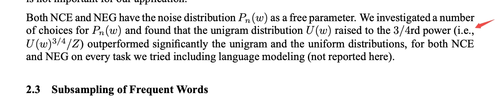
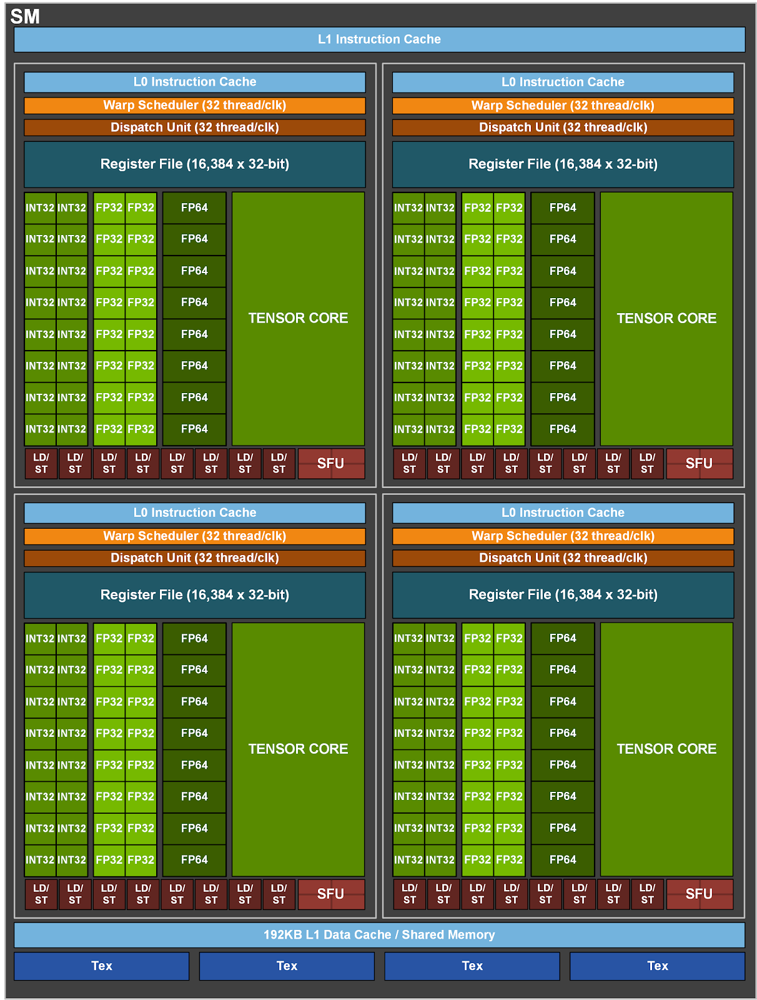
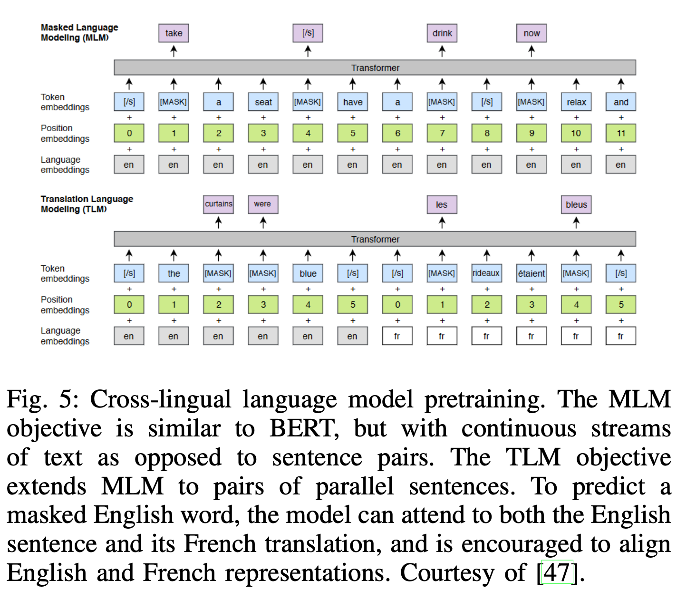
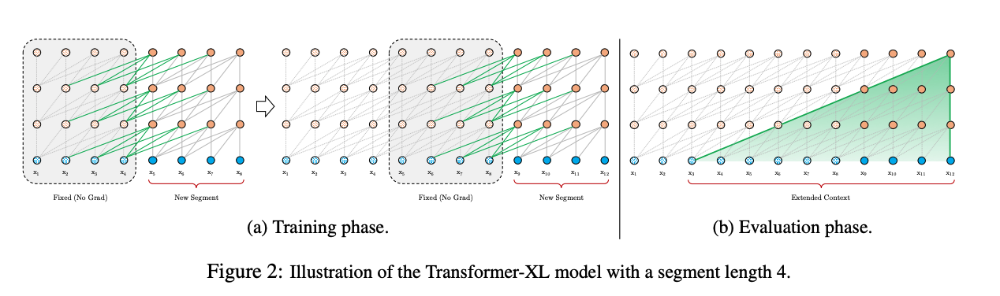
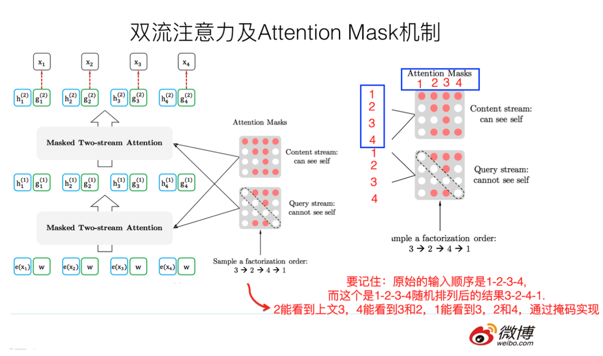
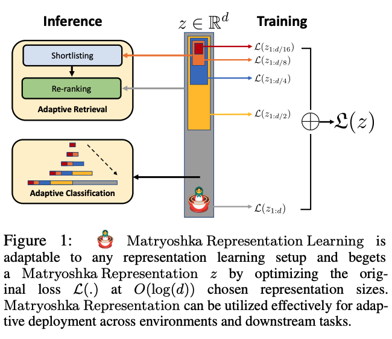

# 从word2v到Transformer

## LSTM

[超生动图解LSTM和GRU，一文读懂循环神经网络！](https://mp.weixin.qq.com/s/vVDAB2U7478yOXUT9ByjFw)


## fasttext&word2vec

注：w2v训练时的内积不是2个emb-in的内积，而是emb-in和emb-out的内积

[fasttext源码解析](https://my.oschina.net/u/3800567/blog/2877570)

+ ```Dictionary::readWord```：空格分割，一次读出来一个word
+ ```Dictionary::add```：每个word求个hash，加进词典时，id就是从0开始的序号，同时记录一下词频
+ ```Dictionary::threshold```：按词频排序，扔掉低频词
+ ```Dictionary::initNgrams```：每个词，加上前缀BOW（<）和后缀（>），然后先扔进这个词的subwords里，然后再调用``` Dictionary::computeSubwords```把这个词的ngrams也扔进它的subwords里

整个词表，是word数+bucket这么大，其中bucket表示可容纳的subwords和wordNgrams的数量，默认200w


[为什么Word2Vec训练中, 需要对负采样权重开3/4次幂？](https://zhuanlan.zhihu.com/p/144563199?utm_id=0)

[Distributed Representations of Words and Phrases and their Compositionality](https://arxiv.org/pdf/1310.4546.pdf)里提到



通过对权重开3/4次幂，可以提升低频词被抽到的概率。在保证高频词容易被抽到的大方向下，通过权重3/4次幂的方式，适当提升低频词、罕见词被抽到的概率。如果不这么做，低频词，罕见词很难被抽到，以至于不被更新到对应的Embedding。

## BPE/WordPiece分词

[【Subword】深入理解NLP Subword算法：BPE、WordPiece、ULM](https://mp.weixin.qq.com/s/U9F8G-OUCb9kunTk_tZYFw)


## Transformer原理

[从三大顶会论文看百变Self-Attention](https://mp.weixin.qq.com/s/R9FoceRsPB3ceqKpnYPvbQ)

[包学包会，这些动图和代码让你一次读懂「自注意力」](https://mp.weixin.qq.com/s/Z0--eLLiFwfSuMvnddKGPQ)

[http://jalammar.github.io/illustrated-transformer/](http://jalammar.github.io/illustrated-transformer/)

[从熵不变性看Attention的Scale操作](https://kexue.fm/archives/8823)

[Transformers Assemble（PART I）](https://mp.weixin.qq.com/s/NZM05zyUkldOwpNIbsOtDQ) 讲了3篇

[Transformers Assemble（PART II）](https://mp.weixin.qq.com/s/JdUVaQ3IyrflHvxIk5jYbQ) 又讲了三篇

### 为什么层次化softmax没人用了

[Transformer 结构中最后一层 softmax 为什么不再使用 层次化softmax了呢？](https://www.zhihu.com/question/310845030/answer/595573391?hb_wx_block=0&utm_source=wechat_session&utm_medium=social&utm_oi=632586637935251456)

主要还是计算资源的问题。

Mikolov发明word2vec的几个版本大概在13-14年前后。那个时候GPU非常少见，印象里面CMU的NLP组没有GPU，Stanford NLP lab只有6块K40。

大规模直接算softmax是在google的14年那篇seq2seq做MT的文章。为了快，把一个softmax并行在4块GPU上，每个GPU负责四分之一。那个年代，大多数NLP组全组都不会有4块GPU。

hierarchical softmax是softmax的近似，suboptimal的。当如今计算资源足够大的时候，当然包括时间和显存 (BERT 和 Elmo 都没有用hierarchical)，hierarchical softmax就逐渐退出了历史舞台。

### Transformer会不会规划未来

[Transformer本可以深谋远虑，但就是不做](https://mp.weixin.qq.com/s/1kolCWSsFAp4e9MGG089vQ)

[Do Language Models Plan for Future Tokens?](https://arxiv.org/pdf/2404.00859.pdf)

在训练期间的梯度既会为**当前token位置**的损失优化权重，也会为该序列**后面的token**进行优化，那么这二者会以怎样的比例分配资源？

+ 预缓存假设（pre-caching hypothesis）：在时间步$$t$$计算与**当前时间步的推理任务无关**但**可能对未来时间步$$t + \tau$$有用**的特征
+ 面包屑假设（breadcrumbs hypothesis）：与时间步$$t$$**最相关的特征**已经**等同**于将在**时间步$$t + \tau$$最有用**的特征。

设计了一种合成场景，其中**只能通过显式的预缓存完成任务**，即模型必须为下一token预先计算信息，**否则就无法在一次单向通过中准确计算出正确答案。**发现明显的证据说明transformer可以学习预缓存，即当必须预计算信息来最小化损失时，它们就会这样做。

但在真实语言数据上，语言模型并不会显著地准备用于未来的信息。相反，它们是计算对预测**下一个token有用的特征**——事实证明**这对未来的步骤也很有用**。


## Transformer的FLOPS和访存带宽

[https://zhuanlan.zhihu.com/p/624740065](https://zhuanlan.zhihu.com/p/624740065)

$$A$$的shape是$$m\times k$$，$$B$$的shape是$$k\times n$$，那么矩阵乘法$$AB$$需要$$m\times k\times n$$次的乘法，也需要同样多次的加法，所以FLOPS是$$2\times m\times k\times n$$

假设batchsize是$$b$$，序列长度$$s$$，原来的emb是$$d$$，即输入的是$$[b,s,d]$$，一般$$d=d_k=d_v=d_q$$，$$W_Q$$、$$W_K$$、$$W_V$$都是$$d_v\times d_v$$，对应的Q、K、V矩阵都是$$s\times d_v$$，有$$head\_num$$个头，每个头的维度$$per\_head\_d=\frac{d}{head\_num}$$

### attention的FLOPS

attention的公式：

$$
\begin{aligned}
&Q=x W_Q, K=x W_K, V=x W_V\\
&x_{\text {out }}=\operatorname{softmax}\left(\frac{Q K^T}{\sqrt{h}}\right) \cdot V \cdot W_o+x
\end{aligned}
$$


+ 计算3个Q、K、V：要算三次$$s\times d$$和$$d\times d_v$$的矩阵乘法，所以是：$$3\times 2\times b\times s\times d\times d_v$$
    + 输入：$$[b, s, d]$$和3个$$[b, d, d_v]$$
    + 输出：$$[b, s, d_v]$$，再把最后一维$$d_v$$拆成$$head\_num$$份，再把中间两维互换一下，得到$$[b, head\_num, s, per\_head\_d]$$
+ 计算Q和K的相似度：要算一次$$s\times d_v$$和$$d_v\times s$$的矩阵乘法，$$2\times b\times s^2\times d_k$$
    + 输入：$$[b, head\_num, s, per\_head\_d]$$和$$[b, head\_num, per\_head\_d, s]$$
    + 输出：$$[b, head\_num, s, s]$$
+ 把相似度用到V上：要算一次$$s\times s$$和$$s\times d_v$$的矩阵乘法，，$$2\times b\times s^2 \times d_v$$
    + 输入：$$[b, head\_num, s, s]$$和$$[b, head\_num, s, per\_head\_d]$$
    + 输出：$$[b, head\_num, s, per\_head\_d]$$
+ 最后过一个线性映射：要算一次$$s\times d_v$$的和$$d_v\times d_v$$的矩阵乘法，$$2\times b\times s\times d_v\times d_v$$
    + 输入：$$[b, s, d_v]$$和$$[d_v, d_v]$$
    + 输出：$$[b, s, d_v]$$

因为$$d_k=d_v=d_q=d$$，单纯计算attention总共就是$$8bsd^2 + 4bs^2d$$

### FFN的FLOPS

FFN的公式：

$$
x=f_{\text {gelu }}\left(x_{\text {out }} W_1\right) W_2+x_{\text {out }}
$$

在原始Transformer中，$$W_1$$的shape是$$[d,4d]$$，$$W_2$$的shape是$$[4d,d]$$，

+ 第一个线性层：$$2\times b\times s\times\ d\times 4d=8\times b\times s\times\ d^2$$
    + 输入：$$[b, s, d]$$和$$[d,4d]$$
    + 输出：$$[b, s, 4d]$$
+ 第二个线性层：$$2\times b\times s\times\ 4d\times d=8\times b\times s\times\ d^2$$
    + 输入：$$[b, s, 4d]$$和$$[4d,d]$$
    + 输出：$$[b, s, d]$$

所以一层Transformer，即attention+FFN的计算量为$$(8bsd^2 + 4bs^2d)+16bsd^2=24bsd^2+4bs^2d$$

有两点需要注意的：

+ 对NLP任务来讲，一般$$d$$是个比较固定的值，如512，而$$s$$变大，效果会更好，所以一般是$$s>d$$，所以复杂度取决于$$s$$的大小。
+ 但有些模型的初始设置不是这样的，例如GPT3的175B模型里，$$s=2048,d=12288$$，当然，算力够的话也可以把$$s$$变大

自己感觉：既然是$$24bsd^2+4bs^2d$$，其实就是$$6sd^2$$和$$s^2d$$的大小，即$$6d$$和$$s$$的大小，如果$$6d>s$$，则$$d^2$$起主导，反之$$s^2$$起主导

### DIN的FLOPS

特殊地，对于推荐中的DIN那种，看当前item和历史s个item的相关性，即q的序列长度只有1，不考虑多头，而这其实也是decoder预测下一个词时过一层Transformer的复杂度

已经有3个序列长度为$$s-1$$的QKV的cache，要算第$$s$$个词和这$$s-1$$个词的attention

+ 计算第$$s$$个词的3个Q、K、V：要算三次$1\times d$和$$d\times d_v$$的矩阵乘法，所以是：$$3\times 2\times b\times 1\times d\times d_v$$
    + 输入：$$[b, 1, d]$$和3个$$[b, d, d_v]$$
    + 输出：$$[b, 1, d_v]$$
+ 计算Q和K的相似度：要算一次$$1\times d_v$$和$$d_v\times s$$的矩阵乘法，$$2\times b\times 1\times d_k\times s$$【这里的K是历史$$s-1$$长度的序列拼上当前词，当然对DIN来讲要去掉当前词，这里先忽略这个】
    + 输入：$$[b, 1, d_v]$$和$$[b, d_v, s]$$
    + 输出：$$[b, 1, s]$$
+ 把相似度用到V上：要算一次$$1\times s$$和$$s\times d_v$$的矩阵乘法，，$$2\times b\times 1 \times d_v \times s$$【同样地，这里的V是历史$$s-1$$长度的序列拼上当前词，当然对DIN来讲要去掉当前词，这里先忽略这个】
    + 输入：$$[b, 1, s]$$和$$[b, s, d_v]$$
    + 输出：$$[b, 1, d_v]$$
+ 最后过一个线性映射：要算一次$$1\times d_v$$的和$$d_v\times d_v$$的矩阵乘法，$$2\times b\times 1\times d_v\times d_v$$
    + 输入：$$[b, 1, d_v]$$和$$[d_v, d_v]$$
    + 输出：$$[b, 1, d_v]$$
+ 第一个线性层：$$2\times b\times 1\times\ d\times 4d=8\times b\times 1\times\ d^2$$
    + 输入：$$[b, 1, d]$$和$$[d,4d]$$
    + 输出：$$[b, 1, 4d]$$
+ 第二个线性层：$$2\times b\times 1\times\ 4d\times d=8\times b\times 1\times\ d^2$$
    + 输入：$$[b, 1, 4d]$$和$$[4d,d]$$
    + 输出：$$[b, 1, d]$$

总共是$$6bd^2+2bds+2bds+2bd^2+8bd^2+8bd^2=24bd^2+4bds$$

### Transformer的访存

GPU架构的介绍参考[https://developer.nvidia.com/blog/nvidia-ampere-architecture-in-depth/](https://developer.nvidia.com/blog/nvidia-ampere-architecture-in-depth/)和[https://www.zhihu.com/question/319355296/answer/2193938981](https://www.zhihu.com/question/319355296/answer/2193938981)，GPU对比CPU如下：

+ 任务模式
    + CPU由专为顺序串行处理而优化的几个核心组成
    + GPU则拥有一个由数以千计的更小、更高效的核心（专为同时处理多重任务而设计）组成的大规模并行计算架构。同时CPU相当的一部分时间在执行外设的中断、进程的切换等任务，而GPU有更多的时间并行计算。
+ 功能定位
    + CPU不但要承担计算任务还有承担逻辑控制等任务。
    + GPU在渲染画面时需要同时渲染数以百万记的顶点或三角形，故GPU的设计是可以充分支持并行计算。
+ 系统集成
    + GPU作为一类外插设备，在尺寸、功率、散热、兼容性等方面的限制远远小于CPU，这样可以让GPU有较大的显存和带宽。

以A100为例，整体架构如下


1. PCIE层：通过PCIE接口以外设的方式集成到服务器上。
2. 中间一坨绿色的部分是GPU的计算核心**SM(Streaming Multiprocessor)**，在A100中，一个SM有64个用于计算的Core，共108个SM(图里是GA100,有128个SM)，故共6192个Core。
3. 中间蓝色部分是L2缓存
4. NVLink：**多个GPU间进行通信**的组件，会优化GPU间的通信，提升传输效率。
5. 两侧的HBM2是显存，目前的A100的显存有两种40G and 80G

A100的SM如图所示，



GPU的显存分成两部分：

+ Global Memory：整体架构图中的**两侧HBM2**部分，例如A100 80G就有80G的global memory，**2TB/s带宽**，访问速度比较慢
+ Shared Memory：SM图中**浅蓝色**的L1 Data Cache，例如A100中每个SM中有**192KB**，访问速度比较快

从图中可见，A100的**FP16**有**312T的FLOPS**


以矩阵乘法为例，$$[M, K] \times [K, N] -> [M,N]$$，

+ 计算时间：$$2MKN/FLOPS$$
+ 访存时间为：$$(MN+MK+KN)/memory\_bandwidth$$，因为首先要**读取**$$MK$$和$$NK$$这两个矩阵，然后结果还要**写入**$$MN$$这个矩阵里。假设是fp16，占2bytes，那就还要乘以2

假设$$b=1,s=4096,d=d_k=2048$$，以计算Q和K的相似度为例，对比一下训练和预测时的**计算耗时**和**访存耗时**

+ **训练时**：$$M=4096,N=2048,K=4096$$==>**计算是瓶颈**
    + FLOPS：$$2\times b\times s^2\times d_k=2\times 1\times 4096^2\times 2048=68719476736$$
    + 计算耗时：$$FLOPS/max\_FLOPS=68719476736/(312\times 10^{12})=0.00022s=220\times 10^{-6}s=220us$$
    + 访存耗时：$$(MN+MK+KN)/memory\_bandwidth=2\times (4096\times 2048+4096\times 4096+4096\times 2048)/(2\times 10^{12})=3.35544\times 10^{-5}s=33.544\times 10^{-6}=33.5544us$$

+ **预测时**：$$M=1,N=2048,K=4096$$==>**访存是瓶颈**
    + FLOPS：$$2\times b\times 1\times d_k\times s=2\times 1\times 2048\times 4096=16777216$$ 
    + 计算耗时：$$FLOPS/max\_FLOPS=16777216/(312\times 10^{12})=5.38\times 10^{-8}s=0.0538\times 10^{-6}s=0.0538us$$
    + 访存耗时：$$(MN+MK+KN)/memory\_bandwidth=2\times (1\times 2048+1\times 4096+4096\times 2048)/(2\times 10^{12})=8.3948\times 10^{-6}s=8.3948us$$

一些常见的名词：

+ H2D：host to device，从cpu拷贝到gpu
+ D2H：device to host，从gpu拷贝到cpu

## Transformer加速

### lightseq

&nbsp;

[LightSeq: A High Performance Inference Library for Transformers](https://arxiv.org/pdf/2010.13887.pdf)

[LightSeq2: Accelerated Training for Transformer-based Models on GPUs](https://arxiv.org/pdf/2110.05722.pdf)

[https://github.com/bytedance/lightseq](https://github.com/bytedance/lightseq)


# PLM：仅编码器/仅解码器/编码器+解码器

## 仅编码器的BERT

[BERT小学生级上手教程，从原理到上手全有图示，还能直接在线运行](https://mp.weixin.qq.com/s/ltVuXZ4nJh8Cb5X2UhB6tQ)

[BERT源码分析（PART I）](https://mp.weixin.qq.com/s/sSmTQ_cOLyAUV0aV0FkDvw)

[BERT源码分析（PART II）](https://mp.weixin.qq.com/s/1NDxWfBu_csu8qHV2tmmVQ)

[Dive into BERT：语言模型与知识](https://mp.weixin.qq.com/s/NjQtSKY85Np5IodRiKsrvg)

[关于BERT，面试官们都怎么问](https://mp.weixin.qq.com/s/c2PktKruzq_teXm3GAwe1Q)

主要讲了下面3篇：

[Language Models as Knowledge Bases?](https://arxiv.org/abs/1909.01066)

[Linguistic Knowledge and Transferability of Contextual Representations](https://arxiv.org/abs/1903.08855)

[What does BERT learn about the structure of language?](https://hal.inria.fr/hal-02131630/document)


[A Primer in BERTology: What we know about how BERT works](https://arxiv.org/pdf/2002.12327.pdf)

摘要：目前，基于 Transformer 的模型已经广泛应用于自然语言处理中，但我们依然对这些模型的内部工作机制知之甚少。在本文中，来自麻省大学洛威尔分校的研究者对流行的 BERT 模型进行综述，并综合分析了 40 多项分析研究。他们还概览了对模型和训练机制提出的改进，然后描画了未来的研究方向。

[Pre-trained Models for Natural Language Processing: A Survey](https://arxiv.org/abs/2003.08271)


[BERT系列文章汇总导读](https://mp.weixin.qq.com/s/oT2dtmfEQKyrpDTOrpzhWw)

[ALBERT、XLNet，NLP技术发展太快，如何才能跟得上节奏？](https://mp.weixin.qq.com/s/Toth-XKn2WKYkyDw6j5F3A)

[绝对干货！NLP预训练模型：从transformer到albert](https://mp.weixin.qq.com/s/Jgx9eHk9xiSOWEy0Ty3LoA)

[ALBERT一作蓝振忠：预训练模型应用已成熟，ChineseGLUE要对标GLUE基准](https://mp.weixin.qq.com/s/mvkFDy09BdKJC4Cja11PAA)

[有哪些令你印象深刻的魔改Transformer？](https://mp.weixin.qq.com/s/HS2tlT7t18cFytZVIsOXUg)

[BERT模型超酷炫，上手又太难？请查收这份BERT快速入门指南！](https://mp.weixin.qq.com/s/jVSW0KDhaXuaIeOzoPmCJA)


### multi-head att 实现

输入原始的query(即from_tensor)之后, 把```[batch, from_seq, emb]```变成```[?, emb]```，其中```?=batch*from_seq```

```python
from_tensor_2d = reshape_to_matrix(from_tensor)

def reshape_to_matrix(input_tensor):
    """Reshapes a >= rank 2 tensor to a rank 2 tensor (i.e., a matrix)."""
    ndims = input_tensor.shape.ndims
    if ndims < 2:
        raise ValueError("Input tensor must have at least rank 2. Shape = %s" %
            (input_tensor.shape))
    if ndims == 2:
        return input_tensor
    width = input_tensor.shape[-1]
output_tensor = tf.reshape(input_tensor, [-1, width])
    return output_tensor
```

然后再接一个fc，把```[?, emb]```变成```[?, head_num * per_head]```，一般```head_num * per_head=emb```。

```python
query_layer = tf.layers.dense(
        from_tensor_2d,
        num_attention_heads * size_per_head,
        activation=query_act,
        name="query",
        kernel_initializer=create_initializer(initializer_range))
```

因为```?=batch*from_seq```，所以可以直接做如下变换

```python
query_layer = transpose_for_scores(query_layer, batch_size,
        num_attention_heads, from_seq_length,
        size_per_head)
```

实际就是把```?```拆开成```batch, from_seq```，整个变成```[batch, from_seq, head_num, per_head]```，然后做了个 transpose，把1和2互换了下，得到```[batch, head_num, from_seq, per_head]```

```python
def transpose_for_scores(input_tensor, batch_size, num_attention_heads,
        seq_length, width):
    output_tensor = tf.reshape(
            input_tensor, [batch_size, seq_length, num_attention_heads, width])

    output_tensor = tf.transpose(output_tensor, [0, 2, 1, 3])
    return output_tensor
```

然后key也做完全一样的操作(不过处理的是to_tensor，如果是self-attention，那to_tensor=from_tensor), 得到```[batch, head_num, to_seq, per_head]```：

```python
to_tensor_2d = reshape_to_matrix(to_tensor)
key_layer = tf.layers.dense(
        to_tensor_2d,
        num_attention_heads * size_per_head,
        activation=key_act,
        name="key",
        kernel_initializer=create_initializer(initializer_range))

key_layer = transpose_for_scores(key_layer, batch_size, num_attention_heads,
        to_seq_length, size_per_head)
```

然后就算$$QK^T$$了，注意这里对key取了转置，也就是```[batch, head_num, from_seq, per_head]```乘以```[batch, head_num, per_head, to_seq]```，得到的结果是```[batch, head_num, from_seq, to_seq]```：

```python
attention_scores = tf.matmul(query_layer, key_layer, transpose_b=True)
attention_scores = tf.multiply(attention_scores,
    1.0 / math.sqrt(float(size_per_head)))

if attention_mask is not None:
    # `attention_mask` = [B, 1, F, T]
    attention_mask = tf.expand_dims(attention_mask, axis=[1])

    # Since attention_mask is 1.0 for positions we want to attend and 0.0 for
    # masked positions, this operation will create a tensor which is 0.0 for
    # positions we want to attend and -10000.0 for masked positions.
    adder = (1.0 - tf.cast(attention_mask, tf.float32)) * -10000.0

    # Since we are adding it to the raw scores before the softmax, this is
    # effectively the same as removing these entirely.
    attention_scores += adder
attention_probs = tf.nn.softmax(attention_scores)
attention_probs = dropout(attention_probs, attention_probs_dropout_prob)
```

然后看下value的操作：

```python
value_layer = tf.layers.dense(
        to_tensor_2d,
        num_attention_heads * size_per_head,
        activation=value_act,
        name="value",
        kernel_initializer=create_initializer(initializer_range))

# `value_layer` = [batch, to_seq, head_num, per_head]
value_layer = tf.reshape(
            value_layer,
            [batch_size, to_seq_length, num_attention_heads, size_per_head])

# `value_layer` = [batch, head_num, to_seq, per_head]
value_layer = tf.transpose(value_layer, [0, 2, 1, 3])

# `context_layer` = [batch, head_num, from_seq, per_head]
context_layer = tf.matmul(attention_probs, value_layer)

# `context_layer` = [batch, from_seq, head_num, per_head]
context_layer = tf.transpose(context_layer, [0, 2, 1, 3])
```

再确认一点，$$softmax(QK^T)$$是```[batch, head_num, from_seq, to_seq]```，而$$V$$是```[batch, head_num, to_seq, per_head]```，所以context_layer是```[batch, head_num, from_seq, per_head]```

最后，再搞一下，变回```[batch, from_seq, head_num * per_head]```：

```python
if do_return_2d_tensor:
# `context_layer` = [B*F, N*H]
    context_layer = tf.reshape(
        context_layer,
        [batch_size * from_seq_length, num_attention_heads * size_per_head])
else:
# `context_layer` = [B, F, N*H]
    context_layer = tf.reshape(
        context_layer,
        [batch_size, from_seq_length, num_attention_heads * size_per_head])
```

如上过程是$$Concat(head_1, ..., head_h)$$，其中$$head_i = Attention(QW_i^Q, KW_i^K, VW_i^V)$$。包装在了函数```attention_layer```之中，我们注意到原文还有一个大小为$$hd_v \times d_{model}$$的$$W^O$$，也就是大小为$$d_{model}\times d_{model}$$，再看看源码。。也就是说，正常的bert里，```attention_heads```就只有一个元素，然后接了个```hidden_size```的fc，而前面的代码里也提到了```hidden_size```正好就是$$d_{model}$$，所以这就是$$W^O$$。

```python
attention_heads = []
with tf.variable_scope("self"):
    attention_head = attention_layer(xxxxx)
    attention_heads.append(attention_head)
    attention_output = None
    if len(attention_heads) == 1:
        attention_output = attention_heads[0]
    else:
        # In the case where we have other sequences, we just concatenate
        # them to the self-attention head before the projection.
        attention_output = tf.concat(attention_heads, axis=-1)
    # Run a linear projection of `hidden_size` then add a residual
    # with `layer_input`.
    with tf.variable_scope("output"):
        attention_output = tf.layers.dense(
            attention_output,
            hidden_size,
            kernel_initializer=create_initializer(initializer_range))
        attention_output = dropout(attention_output, hidden_dropout_prob)
        attention_output = layer_norm(attention_output + layer_input)

```

关于 mask，可以看看这个[https://juejin.im/post/5b9f1af0e51d450e425eb32d](https://juejin.im/post/5b9f1af0e51d450e425eb32d)

摘抄一下：

什么是padding mask呢？回想一下，我们的每个批次输入序列长度是不一样的！也就是说，我们要对输入序列进行对齐！具体来说，就是给在较短的序列后面填充0。因为这些填充的位置，其实是没什么意义的，所以我们的attention机制不应该把注意力放在这些位置上，所以我们需要进行一些处理。
具体的做法是，把这些位置的值加上一个非常大的负数(可以是负无穷)，这样的话，经过softmax，这些位置的概率就会接近0！

而sequence mask是为了使得decoder不能看见未来的信息。也就是对于一个序列，在time_step为t的时刻，我们的解码输出应该只能依赖于t时刻之前的输出，而不能依赖t之后的输出。因此我们需要想一个办法，把t之后的信息给隐藏起来。
那么具体怎么做呢？也很简单：产生一个上三角矩阵，上三角的值全为1，下三角的值权威0，对角线也是0。把这个矩阵作用在每一个序列上，就可以达到我们的目的啦。

### masked-language-model的实现

[https://github.com/google-research/bert/blob/eedf5716ce1268e56f0a50264a88cafad334ac61/run_pretraining.py#L240](https://github.com/google-research/bert/blob/eedf5716ce1268e56f0a50264a88cafad334ac61/run_pretraining.py#L240)


如下，其中```hidden_size```就是是$$d_{model}$$：

```python
def get_masked_lm_output(bert_config, input_tensor, output_weights, positions,
                         label_ids, label_weights):
  """Get loss and log probs for the masked LM."""
  input_tensor = gather_indexes(input_tensor, positions)

  with tf.variable_scope("cls/predictions"):
    # We apply one more non-linear transformation before the output layer.
    # This matrix is not used after pre-training.
    with tf.variable_scope("transform"):
      input_tensor = tf.layers.dense(
          input_tensor,
          units=bert_config.hidden_size,
          activation=modeling.get_activation(bert_config.hidden_act),
          kernel_initializer=modeling.create_initializer(
              bert_config.initializer_range))
      input_tensor = modeling.layer_norm(input_tensor)

    # The output weights are the same as the input embeddings, but there is
    # an output-only bias for each token.
    output_bias = tf.get_variable(
        "output_bias",
        shape=[bert_config.vocab_size],
        initializer=tf.zeros_initializer())
    logits = tf.matmul(input_tensor, output_weights, transpose_b=True)
    logits = tf.nn.bias_add(logits, output_bias)
    log_probs = tf.nn.log_softmax(logits, axis=-1)

    label_ids = tf.reshape(label_ids, [-1])
    label_weights = tf.reshape(label_weights, [-1])

    one_hot_labels = tf.one_hot(
        label_ids, depth=bert_config.vocab_size, dtype=tf.float32)

    # The `positions` tensor might be zero-padded (if the sequence is too
    # short to have the maximum number of predictions). The `label_weights`
    # tensor has a value of 1.0 for every real prediction and 0.0 for the
    # padding predictions.
    per_example_loss = -tf.reduce_sum(log_probs * one_hot_labels, axis=[-1])
    numerator = tf.reduce_sum(label_weights * per_example_loss)
    denominator = tf.reduce_sum(label_weights) + 1e-5
    loss = numerator / denominator

  return (loss, per_example_loss, log_probs)
```

其中的gather如下：

```python
def gather_indexes(sequence_tensor, positions):
  """Gathers the vectors at the specific positions over a minibatch."""
  sequence_shape = modeling.get_shape_list(sequence_tensor, expected_rank=3)
  batch_size = sequence_shape[0]
  seq_length = sequence_shape[1]
  width = sequence_shape[2]

  flat_offsets = tf.reshape(
      tf.range(0, batch_size, dtype=tf.int32) * seq_length, [-1, 1])
  flat_positions = tf.reshape(positions + flat_offsets, [-1])
  flat_sequence_tensor = tf.reshape(sequence_tensor,
                                    [batch_size * seq_length, width])
  output_tensor = tf.gather(flat_sequence_tensor, flat_positions)
  return output_tensor
```

注意调用时传的是如下参数

```python
    (masked_lm_loss,
     masked_lm_example_loss, masked_lm_log_probs) = get_masked_lm_output(
         bert_config, model.get_sequence_output(), model.get_embedding_table(),
         masked_lm_positions, masked_lm_ids, masked_lm_weights)
```

### BERT的可解释性

[ACL 2019 \| 理解 BERT 每一层都学到了什么](https://mp.weixin.qq.com/s/w2Cwo--GTKp5o8YKRtbl7g)

[What does BERT learn about the structure of language?](https://hal.inria.fr/hal-02131630/document)

探索BERT深层次的表征学习是一个非常有必要的事情，一是这可以帮助我们更加清晰地认识BERT的局限性，从而改进BERT或者搞清楚它的应用范围；二是这有助于探索BERT的可解释性

## 更复杂的BERT

[站在BERT肩膀上的NLP新秀们（PART III）](https://mp.weixin.qq.com/s/CxcyX5V9kBQDW8A4g0uGNA)

[BERT时代与后时代的NLP](https://mp.weixin.qq.com/s/U_pYc5roODcs_VENDoTbiQ)

[美团BERT的探索和实践](https://mp.weixin.qq.com/s/qfluRDWfL40E5Lrp5BdhFw)

[Bert时代的创新（应用篇）：Bert在NLP各领域的应用进展](https://mp.weixin.qq.com/s/dF3PtiISVXadbgaG1rCjnA)

### 中文BERT

#### WWM

[哈工大讯飞联合实验室发布基于全词覆盖的中文BERT预训练模型](https://mp.weixin.qq.com/s?__biz=MzIxMjAzNDY5Mg==&mid=2650794872&idx=1&sn=dccd856283bdd4edcdad08cf75506697&chksm=8f477e93b830f7850e6c0ffe684264f704c6fcc4e126a6300b5ae33916aa676a279206e1e4ce&mpshare=1&scene=1&srcid=0701DAFsQt28gF1hGzH4llaM&pass_ticket=8wChBZeeRNV5mWLFKMXfVyWjwTb94XookbbSJiYpmEClqUrpybiGPpfilXkL5UQN#rd)

[https://github.com/ymcui/Chinese-BERT-wwm](https://github.com/ymcui/Chinese-BERT-wwm)

论文：[Pre-Training with Whole Word Masking for Chinese BERT](https://arxiv.org/abs/1906.08101)

#### ERNIE

参考[中文任务全面超越BERT：百度正式发布NLP预训练模型ERNIE](https://mp.weixin.qq.com/s?__biz=MzA3MzI4MjgzMw==&mid=2650758722&idx=1&sn=6742b0f86982890d78cb3ec3be9865b3&scene=0#wechat_redirect)

[ERNIE: Enhanced Representation through Knowledge Integration](https://arxiv.org/pdf/1904.09223.pdf)

使用entity-level masking和phrase-level masking两种mask方法

输入的每个样本由5个 ';' 分隔的字段组成，数据格式：

+ token_ids
+ sentence_type_ids：两句话，第一句都是0，第二句都是1
+ position_ids
+ seg_labels：分词边界信息: 0表示词首、1表示非词首、-1为占位符, 其对应的词为 CLS 或者 SEP；
+ next_sentence_label

例如：

```shell
1 1048 492 1333 1361 1051 326 2508 5 1803 1827 98 164 133 2777 2696 983 121 4 19 9 634 551 844 85 14 2476 1895 33 13 983 121 23 7 1093 24 46 660 12043 2 1263 6 328 33 121 126 398 276 315 5 63 44 35 25 12043 2;0 0 0 0 0 0 0 0 0 0 0 0 0 0 0 0 0 0 0 0 0 0 0 0 0 0 0 0 0 0 0 0 0 0 0 0 0 0 0 0 1 1 1 1 1 1 1 1 1 1 1 1 1 1 1 1;0 1 2 3 4 5 6 7 8 9 10 11 12 13 14 15 16 17 18 19 20 21 22 23 24 25 26 27 28 29 30 31 32 33 34 35 36 37 38 39 40 41 42 43 44 45 46 47 48 49 50 51 52 53 54 55;-1 0 0 0 0 1 0 1 0 0 1 0 0 1 0 1 0 0 0 0 0 0 1 0 1 0 0 1 0 1 0 0 0 0 1 0 0 0 0 -1 0 0 0 1 0 0 1 0 1 0 0 1 0 1 0 -1;0
```

和bert在mask上的区别：


一个句子的不同level的mask方式：


[ERNIE 2.0: A CONTINUAL PRE-TRAINING FRAMEWORK FOR LANGUAGE UNDERSTANDING](https://arxiv.org/pdf/1907.12412v1.pdf)


### 跨语言

#### XLM

[Massively Multilingual Sentence Embeddings for Zero-Shot Cross-Lingual Transfer and Beyond](https://arxiv.org/abs/1812.10464)，XLM的主要思想还是来自于这篇文章，借用了BERT的框架最后成了XLM。本文提出了LASER（Language-Agnostic SEntence Representations）

XLM：facebook提出[Cross-lingual Language Model Pretraining](https://arxiv.org/abs/1901.07291)，加了language emb

+ 无监督的方法：只依赖单语种数据（monolingual data）
+ 有监督的方法：对平行语料使用新的跨语言loss




[Facebook最新语言模型XLM-R：多项任务刷新SOTA，超越单语BERT](https://mp.weixin.qq.com/s/6oK-gevKLWDwdOy4aI7U7g)

XLM-R

[Unsupervised Cross-lingual Representation Learning at Scale](https://arxiv.org/abs/1911.02116)

来自facebook。针对多种跨语言的传输任务，大规模地对多语言语言模型进行预训练可以显著提高性能。在使用超过 2TB 的已过滤 CommonCrawl 数据的基础上，研究者在 100 种语言上训练了基于 Transformer 的掩模语言模型。该模型被称为 XLM-R，在各种跨语言基准测试中，其性能显著优于多语言 BERT（mBERT），其中 XNLI 的平均准确度为+ 13.8％，MLQA 的平均 F1 得分为+ 12.3％，而 FQ 的平均 F1 得分为+ 2.1％ NER。XLM-R 在低资源语言上表现特别出色，与以前的 XLM 模型相比，斯瓦希里语（Swahili）的 XNLI 准确性提升了 11.8％，乌尔都语（Urdu）的准确性提升了 9.2％。研究者还对获得这些提升所需的关键因素进行了详细的实证评估，包括（1）积极转移和能力稀释；（2）大规模资源资源的高低性能之间的权衡。最后，他们首次展示了在不牺牲每种语言性能的情况下进行多语言建模的可能性。XLM-Ris 在 GLUE 和 XNLI 基准测试中具有强大的单语言模型，因此非常具有竞争力。

### 更长序列

#### transformer-xl

[Transformer-XL: Attentive Language Models Beyond a Fixed-Length Context](https://arxiv.org/pdf/1901.02860.pdf)


最简单的处理长文本方法：对长文本直接切成多个segment，每个segment独立过transformer，**segment间是没有信息流动的**



transformer-xl的处理方法：参考RNN的**隐藏记忆单元**，对**上一个segment**计算的隐藏状态序列进行**fixed和cached**，并在模型处理下一个新的segment时将其缓存为**可重用的扩展上下文**。

如图，第k+1层的第i个元素，用到了第k层的第i-1, i-2, ...,i - segment_len+1这几个元素，所以**对于最顶层的来讲，实际看到的窗口就更长了**。为此还提出了**相对位置编码**，即使用两个token的**相对距离**代替之前的绝对位置。

此外，[Stabilizing Transformers for Reinforcement Learning](https://arxiv.org/abs/1910.06764)说明了为什么标准的transformer架构很难在强化学习中优化。研究者同时提出了一种架构Gated Transformer-XL(GTrXL)，可以很好地提升transformer架构和变体的稳定性，并加速学习，可以超过LSTM，在多任务学习 DMLab-30 基准上达到 SOTA 的水平。

#### XLNet

[XLNet : 运行机制及和 Bert 的异同比较](https://mp.weixin.qq.com/s/VCCZOKJOhCEjxfnoLSuRKA)

[Transformer-XL与XLNet笔记](https://mp.weixin.qq.com/s/g7I_V5a3Puy9uK11A--Xqw)

[什么是XLNet中的双流自注意力](https://mp.weixin.qq.com/s/9QmhN4KfukCtAxzprKDbAQ)

[20项任务全面碾压BERT，CMU全新XLNet预训练模型屠榜（已开源）](https://mp.weixin.qq.com/s?__biz=MzA3MzI4MjgzMw==&mid=2650764408&idx=1&sn=92196097be1a5f993ef02de0bac8128d&chksm=871ab006b06d3910ec88e57598d6c8b1a38dead073b3f417b793ba71ac4750ae2a8263537fa2&mpshare=1&scene=1&srcid=&pass_ticket=%2BD9Ask8qPVeDCkEHTF8NEBVBQX9YmDDkPy9VdMIfOYJ2VtpyHOOhIYdS3wUnvPjn#rd)

参考[拆解XLNet模型设计，回顾语言表征学习的思想演进](https://mp.weixin.qq.com/s?__biz=MzA3MzI4MjgzMw==&mid=2650765039&idx=3&sn=5f21b702a06b2b3c12c1e5f327c0b744&chksm=871ab291b06d3b87a7b35ff2e69bbaa6863e7737510783f0d7913bc575e759a6662242e6b97a&scene=0&xtrack=1&pass_ticket=6OQo9SLhUprzhz9WVqt5LanZi%2Bu5pLbXWpLouCtQ6gkfTHAGY5Li3M%2BDR0n3drA2#rd)

[他们创造了横扫NLP的XLNet：专访CMU博士杨植麟](https://mp.weixin.qq.com/s?__biz=MzA3MzI4MjgzMw==&mid=2650767073&idx=1&sn=3a1014852f0ba8caaee9fdfadd344503&chksm=871aba9fb06d33891731e38d7ca2010516a73cff72c1569c89962160d0fc15ef0b747f9ff7f5&scene=0&xtrack=1&pass_ticket=Kz97uXi0CH4ceADUC3ocCNkjZjy%2B0DTtVYOM7n%2FmWttTt5YKTC2DQT9lqCel7dDR#rd)

[XLNet: Generalized Autoregressive Pretraining for Language Understanding](https://arxiv.org/pdf/1906.08237.pdf)

代码：[https://github.com/zihangdai/xlnet](https://github.com/zihangdai/xlnet)

+ 自回归（autoregressive, AR）：主要的论文有这几篇：[Semi-supervised sequence learning](https://arxiv.org/abs/1511.01432)、[Deep contextualized word representations](https://arxiv.org/abs/1802.05365)、[Improving language understanding by generative pre-training](https://s3-us-west-2.amazonaws.com/openai-assets/research-covers/language-unsupervised/language_understanding_paper.pdf)。通过一个autoregressive的模型来估计文本语料库的概率分布。也就是给定一个文本序列$$\mathbf{x}=\left(x_{1}, \cdots, x_{T}\right)$$，AR将likelihood因式分解(factorize)成一个前向的乘积$$p(\mathbf{x})=\prod_{t=1}^{T} p\left(x_{t} | \mathbf{x}_{<t}\right)$$，或者是一个后向的乘积$$p(\mathbf{x})=\prod_{t=T}^{1} p\left(x_{t} | \mathbf{x}_{>t}\right)$$。由于 AR 语言模型仅被训练用于编码**单向(uni-directional)语境（前向或后向）**，因而在深度双向语境建模中效果不佳。而下游语言理解任务通常需要双向语境信息，导致 AR 语言建模无法实现有效预训练。
+ 自编码（autoencoding, AE）：相关的预训练模型不会进行明确的密度估计(explicit density estimation)，而是从残缺的(corrupted)输入中**重建原始数据**。例如bert，使用一定比例的```[MASK]```，然后预测被mask掉的是什么东西。由于目标并不是密度估计，所以在重建的时候，可以考虑双向的上下文信息。但存在如下两个问题：
    + **finetune**时的真实数据**缺少**预训练期间使用的```[MASK]```这些**mask信息**，这导致**预训练和微调效果的差异（pretrain-finetune discrepancy）**。
    + 输入中要预测的token是被mask掉的，所以无法像AR那样使用乘积rule来建立联合概率分布。也就是说，给定未mask的 token，BERT**假设预测的token**之间**彼此独立**，这其实是对自然语言中普遍存在的**高阶、长期依赖关系**的一种**过度简化**。

基于这些优缺点，提出了一种泛化的自回归预训练模型XLNet：

+ Permutation Language Model(PLM)：在自回归LM模式下，最大化所有可能的**因式分解顺序**的对数似然，学习双向语境信息；
    + 把原来的```[MASK]```这个token干掉了，转而用attention mask来搞
    + 引入了排列：即原来是1234，可以输入3241，这个时候改一下mask就行
+ 引入了Transformer-XL的主要思路：**相对位置编码**以及**分段RNN机制**，实践已经证明这两点对于长文档任务是很有帮助的



### 更多的任务

#### MT-DNN

[Multi-Task Deep Neural Networks for Natural Language Understanding](https://arxiv.org/abs/1901.11504)

### 其他改进

#### RoBERTa

参考[重回榜首的BERT改进版开源了，千块V100、160GB纯文本的大模型](https://mp.weixin.qq.com/s?__biz=MzA3MzI4MjgzMw==&mid=2650766934&idx=2&sn=54c479dd8e8e69cd9617b9a1962443e1&chksm=871aba28b06d333e0d5dc64754b7280776ba5c17577831077dc5cd2caa4c2335beec3afd8d34&scene=0&xtrack=1&pass_ticket=zAXdHORK5tTx549e9RwAgNcm7bjJrH4ENwbbTYVrAZDqpsE%2Fu1hY63b%2FoRfnZQdM#rd)

[RoBERTa: A Robustly Optimized BERT Pretraining Approach](https://arxiv.org/pdf/1907.11692.pdf)

+ 修改了一些超参
+ 删掉nsp任务
+ 更大的batchsize和学习率


[RoBERTa中文预训练模型，你离中文任务的「SOTA」只差个它](https://mp.weixin.qq.com/s/EKFa40rLQlnEVuu9V7GDmg)

[https://github.com/brightmart/roberta_zh](https://github.com/brightmart/roberta_zh)


#### DeBERTa

[Deberta: Decoding-enhanced bert with disentangled attention](https://arxiv.org/pdf/2006.03654.pdf)

+ disentangled attention mechanism：每个词使用2个向量，$$H$$编码内容，$$P$$编码相对位置，i和j间的attention如下：

$$
\begin{array}{r}
\mathrm{A}_{\mathrm{i}, \mathrm{j}}=\left\{\mathrm{H}_{\mathrm{i}}, \mathrm{P}_{\mathrm{i} \mid \mathrm{j}}\right\} \times\left\{\mathrm{H}_{\mathrm{j}}, \mathrm{P}_{\mathrm{j} \mid \mathrm{i}}\right\}^{\mathrm{T}} \\
=\mathrm{H}_{\mathrm{i}} \mathrm{H}_{\mathrm{j}}^{\mathrm{T}}+\mathrm{H}_{\mathrm{i}} \mathrm{P}_{\mathrm{j} \mid \mathrm{i}}^{\mathrm{T}}+\mathrm{P}_{\mathrm{i} \mid \mathrm{j}} \mathrm{H}_{\mathrm{j}}^{\mathrm{T}}+\mathrm{P}_{\mathrm{i} \mid \mathrm{j}} \mathrm{P}_{\mathrm{j} \mid \mathrm{i}}^{\mathrm{T}}
\end{array}
$$

+ 预训练：使用enhanced mask decoder，把绝对位置信息引入解码层，来预估被mask掉的token
+ finetune：virtual adversarial training

#### ELECTRA

[2019最佳预训练模型：非暴力美学，1/4算力超越RoBERTa](https://mp.weixin.qq.com/s/_R-Bp5lLov-QIoPRl6fFMA)

[ELECTRA: 超越BERT, 19年最佳NLP预训练模型](https://mp.weixin.qq.com/s/fR5OrqxCv0udKdyh6CHOjA)

[ELECTRA: pre-training text encoders as discriminators rather than generators](https://openreview.net/pdf?id=r1xmh1btvb)

使用新的预训练task：RTD(replaced token detection)：

+ 使用一个**生成网络**采样出token，替换一些原有的token
+ 训练一个**判别模型**，预估一个token**是否是被替换的**

RTD比MLM**更sample-efficient**，因为RTD只做二分类，而MLM需要做全词表的softmax

#### Matryoshka

[俄罗斯套娃 (Matryoshka) 嵌入模型概述](https://mp.weixin.qq.com/s/H3LWIs4hBQ-b_XLxICw7Dg)

[Matryoshka representation learning](https://arxiv.org/pdf/2205.13147.pdf)

俄罗斯套娃嵌入模型旨在将**更重要的信息存储在早期的维度中**，将不太重要的信息存储在后面的维度中。俄罗斯套娃嵌入模型的这一特点允许我们截断模型产生的原始 (大) 嵌入，同时仍保留足够的信息以在下游任务上表现良好。



[https://sbert.net/examples/training/matryoshka/README.html](https://sbert.net/examples/training/matryoshka/README.html)

训练时：

```python
from sentence_transformers import SentenceTransformer
from sentence_transformers.losses import CoSENTLoss, MatryoshkaLoss

model = SentenceTransformer("microsoft/mpnet-base")

base_loss = CoSENTLoss(model=model)
loss = MatryoshkaLoss(
    model=model,
    loss=base_loss,
    matryoshka_dims=[768, 512, 256, 128, 64],
    matryoshka_weight=[1, 1, 1, 1, 1],
)

model.fit(
    train_objectives=[(train_dataset, loss)],
    ...,
)
```

预测时

```python
from sentence_transformers import SentenceTransformer
from sentence_transformers.util import cos_sim

model = SentenceTransformer("tomaarsen/mpnet-base-nli-matryoshka")

matryoshka_dim = 64
embeddings = model.encode(
    [
        "The weather is so nice!",
        "It's so sunny outside!",
        "He drove to the stadium.",
    ]
)
embeddings = embeddings[..., :matryoshka_dim] # Shrink the embedding dimensions
print(embeddings.shape)
# => (3, 64)

# Similarity of the first sentence to the other two:
similarities = cos_sim(embeddings[0], embeddings[1:])
print(similarities)
# => tensor([[0.8910, 0.1337]])
```

注意，如果嵌入已经归一化，那么在截断后它们将不再归一化，因此你**可能需要重新归一化**。

```python
from sentence_transformers import SentenceTransformer
from sentence_transformers.util import cos_sim
import torch.nn.functional as F

model = SentenceTransformer("nomic-ai/nomic-embed-text-v1.5", trust_remote_code=True)

matryoshka_dim = 64
embeddings = model.encode(
    [
        "search_query: What is TSNE?",
        "search_document: t-distributed stochastic xxx.",
        "search_document: Amelia Mary Earhart was xxx.",
    ],
    convert_to_tensor=True,
)
# The Nomic team uses a custom architecture, 
# making them recommend Layer Normalization before truncation
embeddings = F.layer_norm(embeddings, normalized_shape=(embeddings.shape[1],))
embeddings[..., :matryoshka_dim] # Shrink the embedding dimensions

similarities = cos_sim(embeddings[0], embeddings[1:])
# => tensor([[0.7154, 0.4468]])
```

#### Piccolo2

[拿下SOTA！最强中文Embedding模型对标OpenAI，技术路线公开](https://mp.weixin.qq.com/s/G9izxyzyIHtGDb6kAYD-qg)

[Piccolo2: General Text Embedding with Multi-task Hybrid Loss Training](https://arxiv.org/pdf/2405.06932)

[https://huggingface.co/sensenova/piccolo-large-zh-v2](https://huggingface.co/sensenova/piccolo-large-zh-v2)

#### Conan-Embedding

[通过负样本挖掘炼出更强Embedding模型](https://mp.weixin.qq.com/s/z0jgPnvaPO6RTzgFzB8TFQ)

[Conan-embedding: General Text Embedding with More and Better Negative Samples](https://arxiv.org/pdf/2408.15710)

#### MEXMA

[MEXMA: Token-level objectives improve sentence representations](https://arxiv.org/abs/2409.12737)

[https://huggingface.co/facebook/MEXMA](https://huggingface.co/facebook/MEXMA)

[https://github.com/facebookresearch/mexma](https://github.com/facebookresearch/mexma)

#### ModernBert

[时隔6年，谷歌BERT终于有替代品了！更快更准更长，还不炒作GenAI](https://mp.weixin.qq.com/s/QDtl2Q_BHdL1PZw5wCUBaw)

[Smarter, Better, Faster, Longer: A Modern Bidirectional Encoder for Fast, Memory Efficient, and Long Context Finetuning and Inference](https://arxiv.org/pdf/2412.13663)

## 更小的BERT

[BERT 瘦身之路：Distillation，Quantization，Pruning](https://mp.weixin.qq.com/s/ir3pLRtIaywsD94wf9npcA)

### albert

[刚刚，Google发布24个小型BERT模型，直接通过MLM损失进行预训练](https://mp.weixin.qq.com/s/s0ysFH4CRvsHY1Gp3b4DPQ)

[ALBERT：用于语言表征自监督学习的轻量级 BERT](https://mp.weixin.qq.com/s/0V-051qkTk9EYiuEWYE3jQ)

[谷歌ALBERT模型V2+中文版来了：之前刷新NLP各大基准，现在GitHub热榜第二](https://mp.weixin.qq.com/s/nusSlw28h4bOlw5hDsc-Iw)

[超小型BERT中文版横空出世！模型只有16M，训练速度提升10倍](https://mp.weixin.qq.com/s/eVlNpejrxdE4ctDTBM-fiA)

[https://github.com/brightmart/albert_zh](https://github.com/brightmart/albert_zh)


[预训练小模型也能拿下13项NLP任务，谷歌ALBERT三大改造登顶GLUE基准](https://mp.weixin.qq.com/s/kvSoDr0E_mvsc7lcLNKmgg)

ALBERT 模型在 GLUE、RACE 和 SQuAD 基准测试上都取得了新的 SOTA 效果，并且参数量还少于 BERT-large。

[ALBERT: a lite bert for self-supervised learning of language representations](https://openreview.net/pdf?id=H1eA7AEtvS)

通过对词嵌入矩阵进行因式分解，再为下游任务共享不同层的所有参数，这样可以大大降低 BERT 的参数量。

还提出了一种新型句间连贯性损失函数，它可以强迫模型学习句间的连贯性表达，从而有利于各种下游 NLP 任务。

ALBERT 通过两个参数削减技术克服了扩展预训练模型面临的主要障碍。

+ 对嵌入参数化进行因式分解：将大的嵌入矩阵分解为两个小的矩阵，从而将隐藏层的大小与词汇嵌入的大小分离开来。这种分离使得隐藏层的增加更加容易，同时不显著增加词汇嵌入的参数量。
+ 跨层参数共享：避免参数量随着网络深度的增加而增加。

两种技术都显著降低了 BERT 的参数量，同时不对其性能造成明显影响，从而提升了参数效率。ALBERT 的配置类似于 BERT-large，但参数量仅为后者的 1/18，训练速度却是后者的 1.7 倍。这些参数削减技术还可以充当某种形式的正则化，可以使训练更加稳定，而且有利于泛化。

为了进一步提升 ALBERT 的性能，还引入了一个自监督损失函数，用于句子级别的预测（SOP）。SOP 主要聚焦于**句间连贯**，用于解决原版 BERT 中下一句预测（NSP）损失低效的问题。

albert_tiny：

input_ids先查word_embeddings(`\(V\times E=21118*128)`)，得到dim=128的表示，再查word_embeddings_2(`\(E\times M =128*312\)`)，得到dim=312的表示。

搞positionembedding时，并不用输入0 1 2...，只需要做一些slice的变换就行了

```python
    with tf.control_dependencies([assert_op]):
      full_position_embeddings = tf.get_variable(
          name=position_embedding_name,
          shape=[max_position_embeddings, width],
          initializer=create_initializer(initializer_range))
      # Since the position embedding table is a learned variable, we create it
      # using a (long) sequence length `max_position_embeddings`. The actual
      # sequence length might be shorter than this, for faster training of
      # tasks that do not have long sequences.
      #    
      # So `full_position_embeddings` is effectively an embedding table
      # for position [0, 1, 2, ..., max_position_embeddings-1], and the current
      # sequence has positions [0, 1, 2, ... seq_length-1], so we can just
      # perform a slice.
      position_embeddings = tf.slice(full_position_embeddings, [0, 0],
                                     [seq_length, -1]) 
      num_dims = len(output.shape.as_list())

      # Only the last two dimensions are relevant (`seq_length` and `width`), so
      # we broadcast among the first dimensions, which is typically just
      # the batch size.
      position_broadcast_shape = [] 
      for _ in range(num_dims - 2):
        position_broadcast_shape.append(1)
      position_broadcast_shape.extend([seq_length, width])
      position_embeddings = tf.reshape(position_embeddings,
                                       position_broadcast_shape)
      output += position_embeddings
```

然后会通过create_attention_mask_from_input_mask把input_ids和input_mask搞一下，得到attention_mask去和attention做mask，主要是算loss啥的，把后面的mask掉不算

### distillbert

参考[小版BERT也能出奇迹：最火的预训练语言库探索小巧之路](https://mp.weixin.qq.com/s/a0d0b1jSm5HxHso9Lz8MSQ)

1.4w个stars。。

[https://huggingface.co/transformers](https://huggingface.co/transformers)

[DistilBERT, a distilled version of BERT: smaller, faster, cheaper and lighter](https://arxiv.org/abs/1910.01108)


### tinybert

[TinyBERT：模型小7倍，速度快8倍，华中科大、华为出品](https://mp.weixin.qq.com/s/VL7TSHmZPKD-xGdOxNmnHw)

[TinyBERT: Distilling BERT for Natural Language Understanding](https://arxiv.org/abs/1909.10351)

提出了一个two-stage learning framework，在pre-training阶段和task-specific阶段都进行distill。

相比baseline，只有28% parameters和31%的inference时间

在glue上，7.5x小，infer上有9.4x快。

[哪吒”出世！华为开源中文版BERT模型](https://mp.weixin.qq.com/s/He6Xujoe5Ieo95Tshx7PnA)

[NEZHA: Neural Contextualized Representation for Chinese Language Understanding](https://arxiv.org/abs/1909.00204)

[https://github.com/huawei-noah/Pretrained-Language-Model](https://github.com/huawei-noah/Pretrained-Language-Model)

[华为诺亚方舟开源哪吒、TinyBERT模型，可直接下载使用](https://mp.weixin.qq.com/s/cqYWllVCgWwGfAL-yX7Dww)


### reformer

[哈希革新Transformer：这篇ICLR高分论文让一块GPU处理64K长度序列](https://mp.weixin.qq.com/s/QklCVuukfElVDBFNxLXNKQ)

[Reformer: The Efficient Transformer](https://openreview.net/forum?id=rkgNKkHtvB)

[https://github.com/google/trax/blob/master/trax/models/research/reformer.py](https://github.com/google/trax/blob/master/trax/models/research/reformer.py)

大型的 Transformer 往往可以在许多任务上实现 sota，但训练这些模型的成本很高，尤其是在序列较长的时候。在 ICLR 的入选论文中，我们发现了一篇由谷歌和伯克利研究者发表的优质论文。文章介绍了两种提高 Transformer 效率的技术，最终的 Reformer 模型和 Transformer 模型在性能上表现相似，并且在长序列中拥有更高的存储效率和更快的速度。论文最终获得了「8，8，6」的高分。在最开始，文章提出了将点乘注意力（dot-product attention）替换为一个使用局部敏感哈希（locality-sensitive hashing）的点乘注意力，将复杂度从 O(L2 ) 变为 O(L log L)，此处 L 指序列的长度。此外，研究者使用可逆残差（reversible residual layers）代替标准残差（standard residuals），这使得存储在训练过程中仅激活一次，而不是 n 次（此处 n 指层数）。最终的 Reformer 模型和 Transformer 模型在性能上表现相同，同时在长序列中拥有更高的存储效率和更快的速度。

[大幅减少GPU显存占用：可逆残差网络(The Reversible Residual Network)](https://mp.weixin.qq.com/s/j6-x9ANF9b3Q1I_os_LJSw)

### LTD-bert

[内存用量1/20，速度加快80倍，腾讯QQ提出全新BERT蒸馏框架，未来将开源](https://mp.weixin.qq.com/s/W668zeWuNsBKV23cVR0zZQ)

### Q-bert

[AAAI 2020 \| 超低精度量化BERT，UC伯克利提出用二阶信息压缩神经网络](https://mp.weixin.qq.com/s/0qBlnsUqI2I-h-pFSgcQig)

[Q-BERT: Hessian Based Ultra Low Precision Quantization of BERT](https://arxiv.org/pdf/1909.05840.pdf)

### Adabert

[推理速度提升29倍，参数少1/10，阿里提出AdaBERT压缩方法](https://mp.weixin.qq.com/s/mObuD4ijUCjnebYIrjvVdw)

[AdaBERT: Task-Adaptive BERT Compression with Differentiable Neural Architecture Search](https://arxiv.org/pdf/2001.04246v1.pdf)


## 仅解码器的GPT 

[AI也能精彩表达：几种经典文本生成模型一览](https://mp.weixin.qq.com/s/GfP76I-BzzQcyLqQJoeXxw)

### GPT

2018年的[Improving language understanding by generative pre-training](https://s3-us-west-2.amazonaws.com/openai-assets/research-covers/language-unsupervised/language_understanding_paper.pdf)，生成式预训练（Generative pre-training, gpt），用transformer的decoder，参数量117m（0.1b），无监督预训练和有监督微调。


微调阶段为每种下游任务专门设计：

+ 分类：输入一段文本，经过transformer，最后接一个Linear
+ entailment(蕴含)：输入2段文本，premise(假设)和hypothesis(假说)，经过transformer，最后接一个Linear
+ 相似度：输入2段文本a和b，a+b过transformer，b+a过transformer，再合起来接一个Linear
+ 多选题：输入context+答案1过transformer+Linear，答案2、答案3同样操作，将3个输出合在一起求softmax

### GPT2

2019年的[Language models are unsupervised multitask learners](https://d4mucfpksywv.cloudfront.net/better-language-models/language_models_are_unsupervised_multitask_learners.pdf)模型结构小改，增加数据，参数量变大为15亿（1.5b），无监督语言建模。

+ layernorm前移到每个sub-block之前
+ additional layernorm在最后的self-attention block才加上
+ 修改初始化方法，以考虑残差路径上的累积并缩放残差层的权重


[15亿参数最强通用NLP模型面世！Open AI GPT-2可信度高于所有小模型](https://mp.weixin.qq.com/s/nu2egJuG_yxIVfW9GfdlCw)

中文GPT2

[只需单击三次，让中文GPT-2为你生成定制故事](https://mp.weixin.qq.com/s/FpoSNNKZSQOE2diPvJDHog)

[https://github.com/imcaspar/gpt2-ml](https://github.com/imcaspar/gpt2-ml)

[https://colab.research.google.com/github/imcaspar/gpt2-ml/blob/master/pretrained_model_demo.ipynb](https://colab.research.google.com/github/imcaspar/gpt2-ml/blob/master/pretrained_model_demo.ipynb)


[语言模型秒变API，一文了解如何部署DistilGPT-2](https://mp.weixin.qq.com/s/5B8bN2kplB4t1ctYJjN1zw)

huggingface的distill gpt-2：[https://github.com/huggingface/transformers](https://github.com/huggingface/transformers)

### nanogpt代码解读

简化版的gpt，
tiktoken：gpt2中使用的开源分词工具，比huggingface的tokenizer快得多

```python
import tiktoken
enc = tiktoken.get_encoding("gpt2")

# 字节对编码过程，我的输出是[31373, 995]
encoding_res = enc.encode("hello world")
print(encoding_res)

# 字节对解码过程，解码结果：hello world
raw_text = enc.decode(encoding_res)
print(raw_text)
```

类似的：[https://github.com/karpathy/llm.c](https://github.com/karpathy/llm.c)

[https://github.com/karpathy/build-nanogpt/tree/master](https://github.com/karpathy/build-nanogpt/tree/master)

fork了一个：[https://github.com/daiwk/build-nanogpt](https://github.com/daiwk/build-nanogpt)

GPT的整体结构：

```python
class GPT(nn.Module):

    def __init__(self, config):
        super().__init__()
        self.config = config

        self.transformer = nn.ModuleDict(dict(
            wte = nn.Embedding(config.vocab_size, config.n_embd),
            wpe = nn.Embedding(config.block_size, config.n_embd),
            # 这里有n层，每层是一个Block
            h = nn.ModuleList([Block(config) for _ in range(config.n_layer)]),
            # 最后一层需要加一个layer norm
            ln_f = nn.LayerNorm(config.n_embd),
        ))
        # 最后一层的linear
        self.lm_head = nn.Linear(config.n_embd, config.vocab_size, bias=False)

        # weight sharing scheme
        self.transformer.wte.weight = self.lm_head.weight

        # init params
        self.apply(self._init_weights)
```

```python
class Block(nn.Module):

    def __init__(self, config):
        super().__init__()
        self.ln_1 = nn.LayerNorm(config.n_embd)
        self.attn = CausalSelfAttention(config)
        self.ln_2 = nn.LayerNorm(config.n_embd)
        self.mlp = MLP(config)

    def forward(self, x):
        # 这里对原来的add&norm进行了改造，保留一个从始至终的+x的操作，让梯度能够直通输入
        x = x + self.attn(self.ln_1(x))
        x = x + self.mlp(self.ln_2(x))
        return x
```

```python
class MLP(nn.Module):

    def __init__(self, config):
        super().__init__()
        self.c_fc    = nn.Linear(config.n_embd, 4 * config.n_embd)
        self.gelu    = nn.GELU(approximate='tanh')
        self.c_proj  = nn.Linear(4 * config.n_embd, config.n_embd)
        self.c_proj.NANOGPT_SCALE_INIT = 1

    def forward(self, x):
        x = self.c_fc(x)
        x = self.gelu(x)
        x = self.c_proj(x)
        return x
```

```python
class CausalSelfAttention(nn.Module):

    def __init__(self, config):
        super().__init__()
        assert config.n_embd % config.n_head == 0
        # key, query, value projections for all heads, but in a batch
        self.c_attn = nn.Linear(config.n_embd, 3 * config.n_embd)
        # output projection
        self.c_proj = nn.Linear(config.n_embd, config.n_embd)
        self.c_proj.NANOGPT_SCALE_INIT = 1
        # regularization
        self.n_head = config.n_head
        self.n_embd = config.n_embd
        # not really a 'bias', more of a mask, but following the OpenAI/HF naming though
        self.register_buffer("bias", torch.tril(torch.ones(config.block_size, config.block_size))
                                     .view(1, 1, config.block_size, config.block_size))

    def forward(self, x):
        B, T, C = x.size() # batch size, sequence length, embedding dimensionality (n_embd)
        # calculate query, key, values for all heads in batch and move head forward to be the batch dim
        # nh is "number of heads", hs is "head size", and C (number of channels) = nh * hs
        # e.g. in GPT-2 (124M), n_head=12, hs=64, so nh*hs=C=768 channels in the Transformer
        qkv = self.c_attn(x)
        q, k, v = qkv.split(self.n_embd, dim=2)
        k = k.view(B, T, self.n_head, C // self.n_head).transpose(1, 2) # (B, nh, T, hs)
        q = q.view(B, T, self.n_head, C // self.n_head).transpose(1, 2) # (B, nh, T, hs)
        v = v.view(B, T, self.n_head, C // self.n_head).transpose(1, 2) # (B, nh, T, hs)
        y = F.scaled_dot_product_attention(q, k, v, is_causal=True) # flash attention
        y = y.transpose(1, 2).contiguous().view(B, T, C) # re-assemble all head outputs side by side
        # output projection
        y = self.c_proj(y)
        return y
```


## 编码器+解码器

### T5

[谷歌T5模型刷新GLUE榜单，110亿参数量，17项NLP任务新SOTA](https://mp.weixin.qq.com/s/YOMWNV5BMI9hbB6Nr_Qj8w)

[谷歌最新T5模型17项NLP任务霸榜SuperGLUE，110亿参数量！](https://mp.weixin.qq.com/s/rFT37D7p0MiS8XGZM35bYA)

[Exploring the limits of transfer learning with a unified text-to-text transformer](https://arxiv.org/pdf/1910.10683.pdf)

将所有NLP任务都建模成text-to-text的生成任务，

mT5（[mt5: A massively multilingual pre-trained text-to-text transformer](https://arxiv.org/pdf/2010.11934.pdf)）是T5的变种，基于新的Common Crawl的数据集（包括101种语言）上预训练

### MASS

[MASS: Masked Sequence to Sequence Pre-training for Language Generation](https://arxiv.org/abs/1905.02450v5)

bert只使用了Transformer的encoder部分，其下游任务也主要是适用于自然语言理解（NLU），对于类似文本摘要、机器翻译、对话应答生成等自然语言生成（NLG）任务显然是不太合适的。MASS 采用了编码器-解码器框架，并尝试在**给定部分句子**的情况下**修复整个句子**。MASS输入句子包含了一些连续的 Token，并且中间会带有一些**连续的Mask**，模型的任务是**预测出被Mask掉的词**是什么。相比 BERT 只有编码器，MASS 联合训练编码器与解码器，能获得更适合机器翻译的表征能力。

训练步骤主要分为两步：

+ Encoder： 输入为被随机mask掉连续部分token的句子，使用Transformer对其进行编码；这样处理的目的是可以使得encoder可以更好地捕获没有被mask掉词语信息用于后续decoder的预测；
+ Decoder： 输入为与encoder同样的句子，但是mask掉的正好和encoder相反，和翻译一样，使用attention机制去训练，但只预测encoder端被mask掉的词。该操作可以迫使decoder预测的时候更依赖于source端的输入而不是前面预测出的token，防止误差传递。


### BART

[多项NLP任务新SOTA，Facebook提出预训练模型BART​](https://mp.weixin.qq.com/s/1-EJ36-lY9YZSLBG5c2aaQ)

[BART: Denoising Sequence-to-Sequence Pre-training for Natural Language Generation, Translation, and Comprehension](https://arxiv.org/pdf/1910.13461.pdf)

BART是一个适用于seq2seq模型的去噪自编码器。预训练包括两个阶段：

+ 使用**任意噪声**函数**破坏文本**
+ 用seq2seq模型来**重建原始文本**


