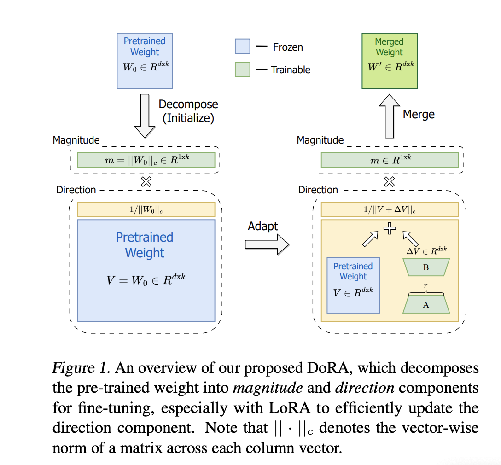

# 微调

+ 指令微调（instruct tuning）：增强/解锁LLM的能力，
+ 对齐微调（alignment tuning）：将LLM的行为与为类的价值观或偏好对齐。
+ 高效微调方法：用于模型快速适配

## 指令微调

+ 收集或构建指令格式(instruction-formatted)的实例
+ 使用这些示例进行**有监督微调**

详见综述[Is prompt all you need? no. A comprehensive and broader view of instruction learning](https://arxiv.org/pdf/2303.10475.pdf)

数据集：[https://huggingface.co/collections/davanstrien/top-10-instruction-tuning-datasets-650d91e11427d12e8542a21a](https://huggingface.co/collections/davanstrien/top-10-instruction-tuning-datasets-650d91e11427d12e8542a21a)

### 构建格式化实例

&nbsp;

指令格式的实例包括一个任务描述（即**指令**）、一对输入输出和少量示例（可选）


#### 格式化已有数据集

&nbsp;

+ **收集来自不同领域（文本摘要、文本分类、翻译等）的实例**来创建有监督的多任务训练数据集。用自然语言的任务描述来格式化这些数据集是很方便的。
+ 使用**人类撰写的任务描述**来增广带标的数据集，通过**解释任务目标**来指导LLM理解任务。
+ 众包平台（如PromptSource）有效地创建、共享和难不同数据集的任务描述
+ 通过指令微调特殊设计的任务描述，**反转**已有实例的输入-输出对，例如“请基于以下答案生成一个问题”，如
+ 利用**启发式任务模板**将大量**无标注的文本**转换为**带标注的实例**。如[Learning instructions with unlabeled data for zero-shot cross-task generalization](https://arxiv.org/pdf/2210.09175.pdf)

#### 格式化人类需求

&nbsp;

来自公共NLP数据集的训练实例虽然进行了格式化，但**任务描述缺乏多样性**或**与人类真实需求不匹配**，故InstructGPT采用真实用户提交给其API的查询作为任务描述。此外，为了丰富任务多样性，通常

+ 标注者为**真实生活中的任务**编写指令，如开放式生成、开放式问答、头脑风暴、聊天等
+ 另一组**标注人员**直接对这些指令进行**回答**
+ 将**指令（采集的用户查询）**和**期望输出（人工编写的答案）**pair对作为一个训练实例

还有一些**半自动化**的方法将**现有实例**输入到LLM中生成多样的任务描述和实例来构建实例，如
+ [Self-instruct: Aligning language model with self generated instructions](https://arxiv.org/pdf/2212.10560.pdf)，引用数好几百
+ [Unnatural instructions: Tuning language models with (almost) no human labor](https://aclanthology.org/2023.acl-long.806.pdf)，meta的论文
+ [Stanford alpaca: An instruction-following llama model](https://crfm.stanford.edu/2023/03/13/alpaca.html)


#### 构建实例的关键

&nbsp;

+ 增加指令：
    + **扩大任务数量**：可以极大提高LLM的泛化能力。但随着任务增加，模型性能最初是连续增长，但**任务数量达到一定水平时，性能基本不提升了**。[Scaling instruction-finetuned language models](https://arxiv.org/pdf/2210.11416.pdf)猜测，一定数量的代表性性任务就能够提供足够充足的知识了。
    + 增强**任务描述的多样性**：从如长度、结构、创造力等方面入手，如[Multitask prompted training enables zero-shot task generalization](https://arxiv.org/pdf/2110.08207.pdf)
    + **每个任务的实例数量**：通常**少量实例**就可以让模型有不错的泛化能力，当某些任务的实例数量进一步增加（至数百个）时可能会**过拟合**。如[Super-NaturalInstructions: Generalization via Declarative Instructions on 1600+ NLP Tasks](https://arxiv.org/pdf/2204.07705.pdf)
+ 设计格式：
    + **任务描述**：LLM理解任务的**最关键部分**
    + **适当数量的示例**：能产生**实质性的改进**，也减轻对指令工程的敏感性。如[Scaling instruction-finetuned language models](https://arxiv.org/pdf/2210.11416.pdf)
    + 指令中的其他部分：如避免事项、原因、建议，**影响很小，甚至有负面影响**，如[Cross-task generalization via natural language crowd- sourcing instructions](https://arxiv.org/pdf/2104.08773.pdf)
    + 包含**推理数据集**的**CoT实例**：[Scaling instruction-finetuned language models](https://arxiv.org/pdf/2210.11416.pdf)和[OPT-IML: scaling language model instruction meta learning through the lens of generalization](https://arxiv.org/pdf/2212.12017.pdf)提到同时用包含和不包含CoT的样本微调，能在各种下游任务取得好的效果，包括需要多级推理能力的任务（常识问答、算术推理）和不需要多级推理的任务（如情感分析和抽取式问答）。

### 指令微调策略

&nbsp;

相比预训练而言，指令微调有多个不同：

+ 训练目标函数：如seq2seq的loss
+ 优化参数设置：更小的batchsize和学习率
+ 平衡数据分布：平衡不同任务间的比例：
    + **实例比例混合策略**（[Exploring the limits of transfer learning with a unified text-to-text transformer](https://arxiv.org/pdf/1910.10683.pdf)），把所有数据集合并，然后从混合数据集中**按比例采样**每种实例。
    + **提高高质量数据集的采样比例**能提升效果，如[Finetuned language models are zero-shot learners](https://arxiv.org/pdf/2109.01652.pdf)的FLAN和[Promptsource: An integrated development environ- ment and repository for natural language prompts](https://arxiv.org/pdf/2202.01279.pdf)的P3。
    + 设置**最大容量**：限制**数据集中能包含的最大实例数**，防止较大数据集挤占整个采样集合，通常设置为几千或几万，如[Exploring the limits of transfer learning with a unified text-to-text transformer](https://arxiv.org/pdf/1910.10683.pdf)和[OPT-IML: scaling language model instruction meta learning through the lens of generalization](https://arxiv.org/pdf/2212.12017.pdf)。
+ 结合指令微调和预训练：
    + 在**指令微调时加入预训练数据**：，如OPT-IML， 可以看成是**对模型的正则化**。
    + **混合预训练数据（纯文本）和指令微调（指令格式）数据**，用多任务方式**从头训练**：[Exploring the limits of transfer learning with a unified text-to-text transformer](https://arxiv.org/pdf/1910.10683.pdf)和[Ext5: Towards extreme multi-task scaling for transfer learning](https://arxiv.org/pdf/2111.10952.pdf)。将指令格式数据集作为预训练语料库的一小部分来预训练，同时获得预训练和指令微调的优势，如GLM-130B和Galactica。

### 指令微调效果

#### 性能改进

&nbsp;

+ 不同规模的模型都能从指令微调中受益，**随着参数规模增加，性能也有提升**。[Multitask prompted training enables zero-shot task generalization](https://arxiv.org/pdf/2110.08207.pdf)发现，**指令微调后的小模型**甚至能比**未经微调的大模型效果更好**
+ 指令微调在**不同模型架构**、**预训练目标**和**模型适配方法**上都有稳定改进效果，由[Scaling instruction-finetuned language models](https://arxiv.org/pdf/2210.11416.pdf)发现
+ 指令微调是**提升现有LM（包括小型PLM）能力**的一个通用方法，同样由[Scaling instruction-finetuned language models](https://arxiv.org/pdf/2210.11416.pdf)发现
+ LLM所需的**指令数据数量明显少于预训练数据**，故指令微调的**成本较低**。

#### 任务泛化性

&nbsp;

+ 赋予LLM**遵循人类指令执行特定任务的能力**（通常被视为一种涌现能力）：[Scaling instruction-finetuned language models](https://arxiv.org/pdf/2210.11416.pdf)发现，指令微调鼓励LLM**理解**用于完成任务的**自然语言指令**，，即**在未见过的任务上也能执行**。
+ 使LLM具有更强的**解决现实世界任务**的能力：指令微调能帮助LLM**缓解一些弱点**（如**生成重复内容**或**补全输入但完不成成相应任务**），由[Scaling instruction-finetuned language models](https://arxiv.org/pdf/2210.11416.pdf)和[Training language models to follow instructions with human feedback](https://cdn.openai.com/papers/Training_language_models_to_follow_instructions_with_human_feedback.pdf)发现。
+ 指令微调后的LLM能**泛化**到**其他语言**的相关任务上：[Crosslingual generalization through multitask finetuning](https://arxiv.org/pdf/2211.01786.pdf)提出的BLOOMZ-P3基于BLOOM在**纯英文**的P3任务集合上进行微调，在多语言的句子实例任务中，相比BLOOM有超过50%的性能提升，同时仅用英文指令就能产生不错效果，**减少针对特定语言的指令工程的工作量**。


## 对齐微调

[Training language models to follow instructions with human feedback](https://cdn.openai.com/papers/Training_language_models_to_follow_instructions_with_human_feedback.pdf)和[Alignment of language agents](https://arxiv.org/pdf/2103.14659.pdf)提出，LLM可能**编造虚假信息**、产生**有害**的、**误导性**的和**有偏见**的表达，因为LLM在预训练时没有考虑人类的价值观或偏好。

[Improving alignment of dialogue agents via targeted human judgements](https://arxiv.org/pdf/2209.14375.pdf)和[Training language models to follow instructions with human feedback](https://cdn.openai.com/papers/Training_language_models_to_follow_instructions_with_human_feedback.pdf)提出了人类对齐，使LLM的行为能够符合人类期望。

[Training language models to follow instructions with human feedback](https://cdn.openai.com/papers/Training_language_models_to_follow_instructions_with_human_feedback.pdf)、[A general language assistant as a laboratory for alignment](https://arxiv.org/pdf/2112.00861.pdf)和[Training a Helpful and Harmless Assistant with Reinforcement Learning from Human Feedback](https://arxiv.org/pdf/2204.05862.pdf)发现，和适配微调（如指令微调）相比，对齐微调要考虑的标准并不同，这可能会在某种程度上**损害LLM的通用能力**，即**对齐税**。

### 对齐的标准

+ **有用性**：以**简洁**且**高效**的方式帮助用户解决任务或回答问题。需要进一步阐明问题时，应该有通过**提出恰当的问题**来**获取额外信息**的能力，并有合适的**敏感**度、**洞察**力和**审慎**度（from [A general language assistant as a laboratory for alignment](https://arxiv.org/pdf/2112.00861.pdf)）。
+ **诚实性**：又称为**正确性**，提供准确内容，传达**适当的不确定性**很重要，**避免任何形式的欺骗或信息误传**。LLM了解其能力和知识水平（**知道自己不知道什么**）。[A general language assistant as a laboratory for alignment](https://arxiv.org/pdf/2112.00861.pdf)）认为，与有用性和无害性相比，诚实性是一个**更客观**的标准，故诚实性对齐**依赖的人力可能更少**。
+ **无害性**：生成的语言不得是冒犯性或者歧视性的，能**检测**到**隐蔽的出于恶意目的的请求**。当**被诱导去执行危险行为**（如犯罪）时，应该**礼貌拒绝**。[Training a Helpful and Harmless Assistant with Reinforcement Learning from Human Feedback](https://arxiv.org/pdf/2204.05862.pdf)提出，某个行为**是否有害**及**有害程度**因**个人**和**社会**而异。

对齐的标准**很主观**，难以直接作为LLM的优化目标。比较有前景的方法是[Red teaming language models to reduce harms: Methods, scaling behaviors, and lessons learned](https://arxiv.org/pdf/2209.07858.pdf)和[Red teaming language models with language models](https://arxiv.org/pdf/2202.03286.pdf)提出的**红队攻防**，用**对抗**的方式**手动**或**自动**地**探测LLM**，使其**生成有害输出**，再**更新模型防止此类输出**。

### 收集人类反馈

#### 选择标注人员

&nbsp;

+ **教育水平要求高**：Sparrow要求本科学历的英国人，[Training a Helpful and Harmless Assistant with Reinforcement Learning from Human Feedback](https://arxiv.org/pdf/2204.05862.pdf)中的高优任务有一半是美国硕士
+ **意图一致性筛选**：InstructGPT通过**标注人员和研究人员**意图一致性来选择标人员。研究者先自己标少量数据，然后衡量自己和标注人员间标的一致性，选择一致性最高的标注人员来进行后续标注。
+ **选择优秀标注者**：[Teaching language models to support answers with verified quotes](https://arxiv.org/pdf/2203.11147.pdf)中，研究人员评估标注人员的表现，选出如高一致性之类的一组优秀标注人员继续合作，[Learning to summarize from human feedback](https://arxiv.org/pdf/2009.01325.pdf)发现，在标注时提供**详细的标注指令**和**实时的指导**是有帮助的。

#### 收集反馈

&nbsp;

+ 基于排序的方法：
    + **只选最佳候选**：[Fine-tuning language models from human preferences](https://arxiv.org/pdf/1909.08593.pdf)和[Recursively summarizing books with human feedback](https://arxiv.org/pdf/2109.10862.pdf)在这种早期工作中，标注人员用比较粗略的方式评估模型生成的结果，如只选择最佳候选。一方面不同人意见不同，另一方面这种方法忽略了没被选中的样本。
    + **elo评分系统**：[Improving alignment of dialogue agents via targeted human judgements](https://arxiv.org/pdf/2209.14375.pdf)和[Training a Helpful and Harmless Assistant with Reinforcement Learning from Human Feedback](https://arxiv.org/pdf/2204.05862.pdf)提出了elo评分系统，两两比较所有候选输出结果，生成一个偏好排序。
+ 基于问题的方法：回答**研究人员设计的特定问题**，这些问题覆盖**不同的对齐标准**以及其他**对LLM的约束**条件。例如WebGPT中，标注人员要回答关于检索到的文档**对回答给定输入是否有帮助**的选择题。
+ 基于规则的方法：
    + Sparrow不仅选择**标注人员挑选的最佳回复**，还设计**一系列规则**来**测试模型生成的回复**是否符合**有用**、**正确**、**无害**的标准，让**标注者**对模型生成的回复**违反规则的程度进行打分**。
    + GPT-4用一组基于GPT-4的**zero-shot分类器**作为**基于规则的奖励模型**，**自动**确定模型生成的**输出是否违反一组人类编写的规则**。

### RLHF

详见RLHF章节

## 高效微调

全量参数都微调成本很大，有更高效的方法，称为**参数高效微调**（**parameter-efficient fine-tuning**）。

### 适配器微调（adapter tuning）

&nbsp;

[Parameter-efficient transfer learning for NLP](https://arxiv.org/pdf/1902.00751.pdf)提出，在Transformer中引入一个**小型神经网络模块**（**适配器**），[LLM-Adapters: An Adapter Family for Parameter-Efficient Fine-Tuning of Large Language Models](https://arxiv.org/pdf/2304.01933.pdf)也提出了瓶颈架构：

+ 将原始特征压缩到**较小维度**（然后进行非线性变换）
+ 恢复到**原始维度**

一般是**串行插入**的方式，集成到**每个Transformer层里**，分别放到**注意力层**和**前馈层之后**。[Towards a unified view of parameter- efficient transfer learning](https://arxiv.org/pdf/2110.04366.pdf)提出了**并行适配器**，即与**注意力层和前馈层并行**。

微调时，**原参数不变**，**仅更新适配器模块参数**。


### 前缀微调（prefix tuning）

&nbsp;

[Prefix-tuning: Optimizing continuous prompts for generation](https://arxiv.org/pdf/2101.00190.pdf)。

+ 在每个**Transformer层前**添加一系列前缀，即一组**可训练的连续向量**。前缀向量具有**任务的特异性**，可以看作**虚拟的token emb**。
+ **重参数化**技巧：
    + 学习一个将**较小矩阵映射到前缀参数矩阵**的**MLP函数**，而不是直接优化前缀，有助于**稳定训练**。
    + 优化后，**舍弃映射函数**，只保留派生的前缀向量以增强与特定任务相关的性能。
    + 由于只训练前缀参数，故能实现参数高效的模型优化

[P-tuning v2: Prompt tuning can be comparable to fine- tuning universally across scales and tasks](https://arxiv.org/pdf/2110.07602.pdf)提出了p-tuning v2，为了自然语言理解在Transformer中引入**逐层提示向量**，还利用**多任务学习**来**联合优化共享的提示**。


### 提示微调（prompt tuning）

&nbsp;

在**输入层**加入**可训练**的**提示向量**，基于离散提示方法（[How can we know what language models know?](https://arxiv.org/pdf/1911.12543.pdf)和[Autoprompt: Eliciting knowledge from lan- guage models with automatically generated prompts](https://arxiv.org/pdf/2010.15980.pdf)），通过包含一组**软提示token**来扩充输入文本，再用扩充后的输入来解决特定的下游任务。将**任务特定的提示emb**与**输入文本的emb**相结合，输入模型中。

+ [GPT understands, too](https://arxiv.org/pdf/2103.10385.pdf)：提出了P-tuning，用**自由形式**来组合**上下文**、**提示**和**目标token**，用**双向LSTM**学习**软提示token的表示**，适用于自然语言理解和生成的架构。
+ [The power of scale for parameter-efficient prompt tuning](https://arxiv.org/pdf/2104.08691.pdf)：提示微调，直接在**输入前**加入**前缀提示**。训练时**只有提示emb**会根据特定任务进行监督学习。这种方法在**输入层**只包含**少量可训练参数**，故其效果**高度依赖底层语言模型的能力**。

### 低秩适配（LoRA）

&nbsp;

[Lora: Low-rank adaptation of large language models](https://arxiv.org/pdf/2106.09685.pdf)通过增加低秩约束来近似每层的更新矩阵，假设参数矩阵$$\mathbf{W} \in \mathbb{R}^{m \times n}$$，一般是

$$
\mathbf{W}=\mathbf{W}+\Delta \mathbf{W}
$$

冻结$$\mathbf{W}$$，通过低秩分解矩阵来近似更新

$$
\Delta \mathbf{W}=\mathbf{A} \cdot \mathbf{B}^{\top}
$$

其中$$\mathbf{A} \in \mathbb{R}^{m \times k}$$和$$\mathbf{B} \in \mathbb{R}^{n \times k}$$是用于任务适配的可训练参数，$$r \ll \min (m, n)$$是**降低后的秩**。

LoRA的优点：

+ 大大**节省内存和存储**（如VRAM，Video Random Access Memory）
+ 可以只**保留一个大型模型副本**，同时**保留多个**用于**适配不同下游任务**的**特定低秩分解矩阵**。

用更有原则的方法设置秩：

+ 基于**重要性分数**的分配：[Adaptive budget allocation for parameter-efficient fine-tuning](https://arxiv.org/pdf/2303.10512.pdf)提出的AdaLoRA
+ **无需搜索**的**最优秩选择**：[Dylora: Parameter efficient tuning of pre-trained models using dynamic search-free low- rank adaptation](https://arxiv.org/pdf/2210.07558.pdf)

### 小结

LoRA已经有广泛的应用，如LLaMA和BLOOM，

+ Alpaca-LoRA：[Instruct-tune llama on consumer hardware](https://github.com/tloen/alpaca-lora)，通过LoRA训练的Alpaca的轻量级微调版本。
+ LLaMA-Adapter：[Llama-adapter: Efficient fine-tuning of language models with zero-init attention](https://arxiv.org/pdf/2303.16199.pdf)将**可学习的提示向量**插入每个Transformer层中，提出**零初始化的注意力**，通过**减轻欠拟合提示向量的影响**以改善训练，还能扩展到**多模态设置**，如视觉问答。

[LLM-Adapters: An Adapter Family for Parameter-Efficient Fine-Tuning of Large Language Models](https://arxiv.org/pdf/2304.01933.pdf)比较了串行适配器微调、并行适配器微调和LoRA，在GPT-J(6B)、BLOOM(7.1B)和LLaMA(7B)上评估：这些方法在**困难任务上效果不如GPT-3.5**，但**在简单任务上表现相当**，**LoRA**表现相对较好且使用的可训练参数明显较少。

huggingface开源了[Peft: State-of-the-art parameter-efficient fine-tuning methods](https://github.com/huggingface/peft)，包括LoRA/AdaLoRA、前缀微调、P-Tuning、提示微调，支持GPT-2和LLaMA，还支持视觉Transformer如ViT和Swin Transformer。

[让大模型不再「巨无霸」，这是一份最新的大模型参数高效微调综述](https://mp.weixin.qq.com/s/b16EPZ3z-LpGapGy2Q7ZUg)

[Parameter-Efficient Fine-Tuning for Large Models: A Comprehensive Survey](https://arxiv.org/pdf/2403.14608.pdf)

## lora变种

### DoRA

[DoRA: Weight-Decomposed Low-Rank Adaptation](https://arxiv.org/pdf/2402.09353.pdf)

[https://github.com/catid/dora](https://github.com/catid/dora)

LoRA可以认为是对Finetune微调的一种低秩近似，通过增加Rank，LoRA可以达到类似Finetune的微调效果。因此之前多数研究都把LoRA和Finetune在微调准确性上的差异归结为二者的优化参数量不同。

但经过分析发现，lora的学习模式和FT很不一样，更偏向于大开大合，即**方向**和**幅度**呈很**强的正相关**，可能对**更精细的学习有害**



dora通过同时关注权重更新时的**大小**和**方向变化**，实现了比LoRA**更加接近finetune**微调效果：

+ w拆成magnitude($$norm$$)乘以direction($$1/norm \times w$$)
+ magnitude不变，direction里的$$1/norm$$用lora更新

注意，这里的norm是column-wise的norm，即输入$$d\times k$$的矩阵，**每一列**的元素算一个norm（平方和开根号）得到一个数，最终就是$$1\times k$$的矩阵

```python
# This layer is dropped into your pre-trained PyTorch model where nn.Linear is used
class DoRALayer(nn.Module):
    def __init__(self, d_in, d_out, rank=4, weight=None, bias=None):
        super().__init__()

        if weight is not None:
            self.weight = nn.Parameter(weight, requires_grad=False)
        else:
            self.weight = nn.Parameter(torch.Tensor(d_out, d_in), requires_grad=False)

        if bias is not None:
            self.bias = nn.Parameter(bias, requires_grad=False)
        else:
            self.bias = nn.Parameter(torch.Tensor(d_out), requires_grad=False)

        # m = Magnitude column-wise across output dimension
        self.m = nn.Parameter(self.weight.norm(p=2, dim=0, keepdim=True))
        
        std_dev = 1 / torch.sqrt(torch.tensor(rank).float())
        self.lora_A = nn.Parameter(torch.randn(d_out, rank)*std_dev)
        self.lora_B = nn.Parameter(torch.zeros(rank, d_in))

    def forward(self, x):
        lora = torch.matmul(self.lora_A, self.lora_B)
        adapted = self.weight + lora
        column_norm = adapted.norm(p=2, dim=0, keepdim=True)
        norm_adapted = adapted / column_norm
        calc_weights = self.m * norm_adapted
        return F.linear(x, calc_weights, self.bias)

## 使用
def replace_linear_with_dora(model):
    for name, module in model.named_children():
        if isinstance(module, nn.Linear):
            # Get the input and output dimensions of the current nn.Linear layer
            d_in = module.in_features
            d_out = module.out_features

            # Create a new DoRALayer with the same dimensions
            setattr(model, name, DoRALayer(d_out=d_out, d_in=d_in, weight=module.weight.data.clone(), bias=module.bias.data.clone()))
        else:
            # Recursively apply this function to submodules
            replace_linear_with_dora(module)

```

### fourierft

[ICML 2024 | 脱离LoRA架构，训练参数大幅减少，新型傅立叶微调来了](https://mp.weixin.qq.com/s/jaYeIfByJaWU5-4jBmnrzQ)

[](https://arxiv.org/abs/2405.03003)

[https://github.com/Chaos96/fourierft](https://github.com/Chaos96/fourierft)

## SFT技巧

[全是细节｜大模型SFT的100个关键点](https://mp.weixin.qq.com/s/LxERqJU7mP40onJQP-6UHQ)

[LLM预训练与SFT数据配比调研](https://mp.weixin.qq.com/s/-J-5oHB4T4taQd0vCHhYUA)

# 使用

## 上下文学习

GPT-3提出ICL，将**任务描述**和（或）**示范（demonstration）**以**自然语言文本形式**表达。

### 上下文学习形式

+ 以**任务描述**作为开始，从任务数据集中**选择一些样例**作为**示范**。
+ 以特别设计的**模板形式**将它们按照**特定的顺序**组合成**自然语言提示**。
+ 将**测试样例**添加到LLM的输入中以生成输出。

形式化地看，$$D_k=\left\{f\left(x_1, y_1\right), \ldots, f\left(x_k, y_k\right)\right\}$$表示由$$k$$个样例组成的一组示范，$$f\left(x_k, y_k\right)$$表示把第$$k$$个**任务样例转换为自然语言提示**的函数。给定任务描述$$I$$、示范$$D_k$$和新的输入查询$$x_{k+1}$$，LLM生成的输出$$\hat{y}_{k+1}$$如下：

$$
\operatorname{LLM}(I, \underbrace{f\left(x_1, y_1\right), \ldots, f\left(x_k, y_k\right)}_{\text {示范 }}, f(\underbrace{x_{k+1}}_{\text {输入 }}, \underbrace{\_\_\_}_{\text {答案 }})) \rightarrow \hat{y}_{k+1} \text {. }
$$

真实答案$$y_{k+1}$$留白，由LLM预测。

更多的可以参考综述[A survey for in-context learning](https://arxiv.org/pdf/2301.00234.pdf)

**指令微调**可以**提高LLM执行目标任务的ICL能力**，尤其是**零样本场景**（仅使用任务描述）。


### 示范设计

&nbsp;

#### 示范选择

&nbsp;

+ 启发式方法：
    + 基于**knn的检索器**来选择与**查询**语义相关的样例：如[What makes good in-context examples for gpt-3?](https://arxiv.org/pdf/2101.06804.pdf)和[Does GPT-3 generate empathetic dialogues? A novel in-context example selection method and automatic evaluation metric for empathetic dialogue generation](https://aclanthology.org/2022.coling-1.56.pdf)。但只是**针对每个样例单独选择**，而**不是对整个样例集合**进行评估。
    + 基于**多样性**的选择策略：[Diverse demonstrations improve in-context compositional generalization](https://arxiv.org/pdf/2212.06800.pdf)和[Selective annotation makes language mod- els better few-shot learners](https://arxiv.org/pdf/2209.01975.pdf)
    + 同时考虑**相关性**和**多样性**的选择策略：[Complementary Explanations for Effective In-Context Learning](https://arxiv.org/pdf/2211.13892.pdf)
+ 基于LLM的方法：
    + **直接用LLM**来**选择**：[Finding supporting examples for in-context learning](https://arxiv.org/pdf/2302.13539.pdf)：LLM可以直接根据**添加样例后**的**性能提升**评估**每个样例的信息量**，以进行选择。
    + **两阶段检索**：[Learning to retrieve prompts for in-context learning](https://arxiv.org/pdf/2112.08633.pdf)：提出EPR，先用无监督方法召回相似样例，再用密集检索器（用LLM标记的正负样例训练）进行排序。
    + **RL方法**：[Active example selection for in-context learning](https://arxiv.org/pdf/2211.04486.pdf)，将示范选择任务建模为RL问题，**LLM是奖励函数**，为训练策略模型提供反馈。
    + 用**LLM**来**生成**示范：[Chatgpt outperforms crowd-workers for text-annotation tasks](https://arxiv.org/pdf/2303.15056.pdf)发现LLM在文本标方面表现很好，故可以直接将LLM作为**无人工干预**的**示范生成器**，如[Self-generated in-context learning: Leveraging auto-regressive language models as a demonstration generator](https://arxiv.org/pdf/2206.08082.pdf)和[Selective in-context data augmentation for intent detection using pointwise v-information](https://arxiv.org/pdf/2302.05096.pdf)

[An explanation of in-context learning as implicit bayesian inference](https://arxiv.org/pdf/2111.02080.pdf)提到，ICL中选择的示范样例应该包含**足够的有关待解决任务的信息**，并**与测试查询相关**。

#### 示范格式

&nbsp;

将选择的示范进行**整合**以及**格式化**：

+ 用相应的**输入输出对**来**实例化预定义的模板**：[Pre-train, prompt, and predict: A systematic survey of prompting methods in natural language processing](https://arxiv.org/pdf/2107.13586.pdf)
+ 增强LLM的**推理能力**
    + **添加任务描述**：[Scaling instruction-finetuned language models](https://arxiv.org/pdf/2210.11416.pdf) 
    + 通过**CoT提示**：[Chain of thought prompting elicits reasoning in large language models](https://arxiv.org/pdf/2201.11903.pdf)
+ 收集**包含人工编写的任务描述**的**大规模数据集**：[Cross-task generalization via natural language crowd- sourcing instructions](https://arxiv.org/pdf/2104.08773.pdf)，能够提升**已见任务**的性能，也能在一定程度泛化到**未见任务**。
+ **半自动化**方法：[Self-instruct: Aligning language model with self generated instructions](https://arxiv.org/pdf/2212.10560.pdf)使用由**人工编写的任务描述**组成的**种子集合**来指导LLM**为新任务生成任务描述**。
+ **自动生成**高质量的示范格式：
    + **Auto-CoT**：[Automatic chain of thought prompting in large language models](https://arxiv.org/pdf/2210.03493.pdf)使用零样本提示（**let's think step by step**）以生成中间推理步骤
    + **least-to-most提示**：[Least-to-most prompting enables complex reasoning in large language models](https://arxiv.org/pdf/2205.10625.pdf)先询问LLM来**执行问题分解**，再利用LLM**根据已解决的中间答案**依次**解决子问题**。


#### 示范顺序

&nbsp;

LLM有时会被**顺序偏差**影响，例如[Calibrate before use: Improving few-shot performance of language models](https://arxiv.org/pdf/2102.09690.pdf)提出LLM会倾向于**重复示范结尾附近的答案**===>**结尾很重要！！**

+ **启发式**方法：[What makes good in-context examples for gpt-3?](https://arxiv.org/pdf/2101.06804.pdf)根据在emb空间中**示范**与**查询**的**相似度**来排列，相似度越高，**距离结尾越近**。
+ **基于信息论**的方法：
    + [Self-adaptive in-context learning](https://arxiv.org/pdf/2212.10375.pdf)使用**最小化压缩和传输任务标签所需的码长**来整合更多任务信息，需要**额外的标记数据**作为用来**评估**特定示范**顺序性能**的**验证集**。
    + [Fantastically ordered prompts and where to find them: Overcoming few-shot prompt order sensitivity](https://arxiv.org/pdf/2104.08786.pdf)使用**全局**和**局部熵度量**来为不同的示范顺序打分，且为了消除对额外标注数据的需要，这篇文章**从LLM本身采样**来获取验证集。


### 底层机制

#### 预训练如何影响ICL

&nbsp;

+ ICL与**预训练任务设计**：GPT-3发现ICL能力随模型增大而增强，但[Metaicl: Learning to learn in context](https://arxiv.org/pdf/2110.15943.pdf)发现**小规模的PLM**也能通过**特别设计的训练任务**从而表现出强大的ICL能力（例如输入是**任务实例+查询**，**预测标签**），甚至能超越规模更大的模型。
+ ICL与**预训练语料**：
    + [On the effect of pretraining corpora on in-context learning by a large-scale language model](https://arxiv.org/pdf/2204.13509.pdf)发现ICL的性能主要取决于**预训练语料的来源**而非规模
    + [Data Distributional Properties Drive Emergent In-Context Learning in Transformers](https://arxiv.org/pdf/2205.05055.pdf)分析训练数据分布的影响，发现当训练数据可以**被聚类成多个不常见的类**，而**不是均匀分布**时，模型会有ICL能力
    + [An explanation of in-context learning as implicit bayesian inference](https://arxiv.org/pdf/2111.02080.pdf)从理论上解释，认为ICL是在具备**长程连贯性的文档**上进行预训练的产物。


#### LLM如何实现ICL

&nbsp;

+ 将ICL视为**隐式微调**：[Why can GPT learn in-context? language models secretly perform gradient descent as meta-optimizers](https://arxiv.org/pdf/2212.10559.pdf)和[Transformers learn in-context by gradient descent](https://arxiv.org/pdf/2212.07677.pdf)
    + ICL可以看成是通过**前向计算**，LLM生成**关于示范**的**元梯度**，并通过**注意力**机制**隐式**地**梯度下降**。
    + LLM的**某些注意力头**能执行**与ICL能力密切相关**的**任务无关**的**原子操作**（如**复制**、**前缀匹配**等）
+ 将ICL视为**算法学习过程**：[Transformers as algorithms: Generalization and implicit model selection in in-context learning](https://arxiv.org/pdf/2301.07067.pdf)、[What learning algorithm is in-context learning? investigations with linear models](https://arxiv.org/pdf/2211.15661.pdf)，基于这个解释框架，LLM能通过ICL有效地学习简单的线性函数，甚至是如决策树的复杂函数
    + 预训练阶段：LLM本质上通过其参数**对隐式模型进行编码**
    + 前向计算阶段：通过ICL中提供的示例，LLM可以**实现如sgd的学习算法**，或者**直接计算出闭式解**以更新这些模型


## 思维链提示（CoT）

CoT是一种改进的提示策略，旨在提高LLM在**复杂推理任务**中的性能，如算术推理（[Training verifiers to solve math word problems]()、[Are NLP models really able to solve simple math word problems?](https://arxiv.org/pdf/2110.14168.pdf)和[A diverse corpus for evaluating and developing english math word problem solvers](https://arxiv.org/pdf/2106.15772.pdf)）、常识推理（[Commonsenseqa: A question answering challenge targeting commonsense knowledge](https://arxiv.org/pdf/1811.00937.pdf)和[Did aristotle use a laptop? A question answering benchmark with implicit reasoning strategies](https://arxiv.org/pdf/2101.02235.pdf)）、符号推理（[Chain of thought prompting elicits reasoning in large language models](https://arxiv.org/pdf/2201.11903.pdf)）。

ICL**只使用输入输出对**来构造提示，而CoT将最终输出的**中间推理步骤**加入提示。

### 使用CoT的ICL

&nbsp;

一般在小样本和零样本这两种设置下和ICL一起用

#### 小样本思维链

&nbsp;

将每个示范```<输入，输出>```替换为```<输入，CoT，输出>```。小样本CoT可以看成ICL的一种特殊提示，但相比ICL的标准提示，**示范的顺序**对性能**影响相对较小**。

+ **思维链提示设计**：
    + 使用**多样的CoT推理路径**：[Making Large Language Models Better Reasoners with Step-Aware Verifier](https://arxiv.org/pdf/2206.02336.pdf)，对**每个问题**给出**多个推理路径**。
    + 使用具有**复杂推理路径**的提示：[Complexity-based prompting for multi-step reasoning](https://arxiv.org/pdf/2210.00720.pdf)
    + Auto-CoT：上述方法都需要标注CoT，[Automatic chain of thought prompting in large language models](https://arxiv.org/pdf/2210.03493.pdf)利用[Large language models are zero-shot reasoners](https://arxiv.org/pdf/2205.11916.pdf)提出的zero-shot-CoT
        + 通过**特别提示**LLM来生成CoT推理路径（例如“**Let’s think step by step**”）
        + 将训练集里的问题**分成不同簇**，选择**最接近每个簇质心的问题**，就可以代表整个训练集里的问题。

+ **增强的思维链策略**：如何生成多个推理路径，并在得到的答案中寻找一致性
    + **self-consistency**：[Self-consistency improves chain of thought reasoning in language models](https://arxiv.org/pdf/2203.11171.pdf)，在生成CoT和最终答案时新的**解码策略**。先**用LLM生成多个推理路径**，再对所有答案进行**集成**(例如投票)。
    + **更通用的集成框架**：[Rationale-Augmented Ensembles in Language Models](https://arxiv.org/pdf/2207.00747.pdf)发现多样化的推理路径是COT推理性能提高的关键，因此将self-consistency延伸至**提示的集成**。
    + 通过**训练打分模型**来**衡量生成的推理路径的可靠性**，如[On the advance of making language models better reasoners](https://arxiv.org/pdf/2206.02336.pdf)
    + **持续**地**利用LLM自己生成的推理路径**进行训练，如[Star: Self-taught reasoner bootstrapping reasoning with reasoning](https://arxiv.org/pdf/2203.14465.pdf)和[Large language models can self-improve](https://arxiv.org/pdf/2210.11610.pdf)


#### 零样本思维链

&nbsp;

不在提示中加入人工标注的示范，而是直接生成推理步骤，再利用生成的CoT来得出答案。[Large language models are zero-shot reasoners](https://arxiv.org/pdf/2205.11916.pdf)。

+ 先通过“**Let’s think step by step**”来提示LLM生成步骤
+ 再通过“**Therefore, the answer is**”来提示得到最终答案

这种方法在**模型规模超过一定大小**时可以**显著提高性能**，但在**小规模的模型**中**效果不佳**，即涌现能力。

Flan-T5和Flan-PaLM（[Scaling instruction-finetuned language models](https://arxiv.org/pdf/2210.11416.pdf)）进一步地使用CoT进行指令调整，有效增强了在**未见任务**上的零样本性能。

### 进一步讨论CoT

+ 思维链何时适用于LLM：
+ LLM为何能进行思维链推理：
    + 思维链能力的来源：
    + 提示中组成部分的影响：

# 能力评测

[史上最严“中文真实性评估”：OpenAI o1第1豆包第2，其它全部不及格](https://mp.weixin.qq.com/s/T8OmSsR-PLkmOfhniGnfdQ)

[Chinese SimpleQA: A Chinese Factuality Evaluation for Large Language Models](https://arxiv.org/abs/2411.07140)

