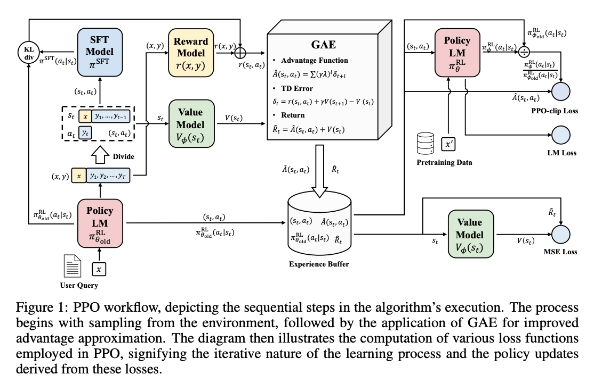
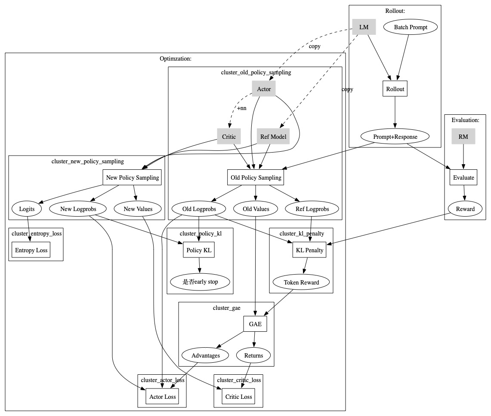
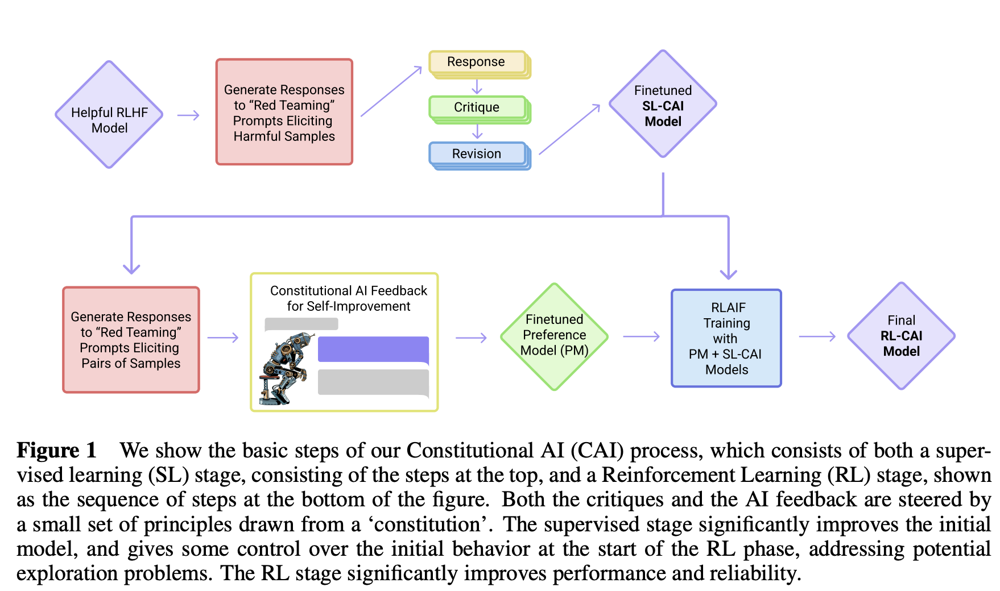
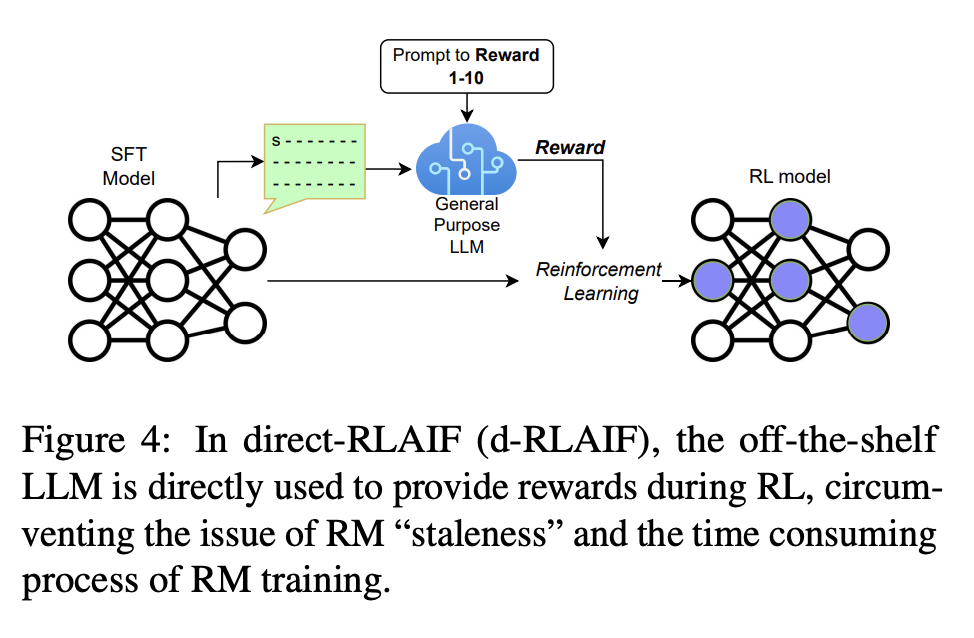

# RLHF & InstructGPT

[OpenAI魔改大模型，参数减少100倍！13亿参数InstructGPT碾压GPT-3](https://mp.weixin.qq.com/s/_lsTzx-NbiSmI7KrRXyYZg)

[https://openai.com/blog/deep-reinforcement-learning-from-human-preferences/](https://openai.com/blog/deep-reinforcement-learning-from-human-preferences/)

[Training language models to follow instructions with human feedback](https://cdn.openai.com/papers/Training_language_models_to_follow_instructions_with_human_feedback.pdf)

[https://huggingface.co/blog/zh/rlhf](https://huggingface.co/blog/zh/rlhf)

+ 预训练一个语言模型 (LM) ；
+ 聚合问答数据并训练一个奖励模型 (Reward Model，RM)，也叫偏好模型；
+ 用强化学习 (RL) 方式微调 LM。


## sft


确保任务多样性的情况下，由标注人员编写prompt和一些生成式任务的期望输出。

+ openai：instructGPT使用小版本的GPT-3，并对“更可取”（preferable）的人工生成文本微调
+ Anthropic：1000w-520亿参数的transformer，并按“有用、诚实和无害”的标准在上下文线索上蒸馏原始LM
+ DeepMind：在[Teaching language models to support answers with verified quotes](https://arxiv.org/pdf/2203.11147.pdf)提出的GopherCite模型中，用的是2800亿的模型Gopher([Scaling language models: Methods, analysis & insights from training gopher](https://arxiv.org/pdf/2112.11446.pdf))

[剖析大模型Pretrain和SFT阶段的Loss差异](https://zhuanlan.zhihu.com/p/652657011)

不管是PreTraining阶段还是SFT阶段，loss函数都是一样的，只是计算的方式存在差异，PreTraining阶段计算的是整段输入文本的loss，而SFT阶段计算的是**response部分的loss**。

## rm


接收一系列文本并返回一个**标量奖励**，数值上对应人的偏好。我们可以用端到端的方式用LM建模，或者用模块化的系统建模 (比如**对输出进行排名**，再**将排名转换为奖励**) 。

+ **模型选择**：RM可以是另一个经过微调的LM，也可以是根据偏好数据从头开始训练的LM。Anthropic 提出了一种特殊的预训练方式，即用**偏好模型预训练** (Preference Model Pretraining，PMP) 来替换一般预训练后的微调过程，PMP**对样本的利用率更高**。
+ **训练文本**：RM 的提示 - 生成对文本是从预定义数据集中采样生成的，并用初始的 LM 给这些提示生成文本。Anthropic 的数据主要是通过 Amazon Mechanical Turk 上的聊天工具生成的，并在 [Hub](https://huggingface.co/datasets/Anthropic/hh-rlhf) 上 可用，而 OpenAI 使用了用户提交给 GPT API 的 prompt。
+ **训练奖励数值**：人工对 LM 生成的回答进行**排名**。起初我们可能会认为应该直接对文本标注分数来训练 RM，但是由于标注者的价值观不同导致这些分数未经过校准并且充满噪音，通过排名可以**比较多个模型各自的输出**并构建更好的规范数据集，这些不同的排名结果将被**归一化**为用于训练的标量奖励值。

目前成功的RLHF使用了和**要对齐的LM**具有**不同大小**的LM：

+ OpenAI：175B的LM和6B的RM
+ Anthropic：使用的 LM 和 RM 从 10B 到 52B 大小不等
+ DeepMind：使用了 70B 的 Chinchilla 模型分别作为 LM 和 RM


## rl


直接微调整个 10B～100B+ 参数的成本过高 ，参考低秩自适应[LoRA](https://arxiv.org/abs/2106.09685)和DeepMind的[Sparrow LM](https://arxiv.org/abs/2209.14375)。目前多个组织找到的可行方案是使用策略梯度强化学习 (Policy Gradient RL) 算法、近端策略优化 (Proximal Policy Optimization，PPO) **微调初始 LM 的部分或全部参数**。

+ 策略 (policy)：一个接受提示并返回一系列文本 (或文本的概率分布) 的 LM
+ 行动空间（action space）： LM 的词表对应的所有词元 (一般在 50k 数量级) 
+ 观察空间 (observation space)： 是可能的输入词元序列，也比较大 (词汇量^输入标记的数量) 
+ 奖励函数：偏好模型和策略转变约束 (Policy shift constraint) 的结合。

ppo确定的奖励函数如下：

+ 提示$$x$$输入初始LM和当前微调的LM，分别得到输出文本$$y_1$$和$$y_2$$
+ 将来自当前策略的文本传给RM得到标量奖励$$r_{\theta}$$
+ 将两个模型的生成文本进行比较计算差异的惩罚项，一般是输出词分布间的KL散度的缩放，即$$r=r_{\theta}-\lambda r_{KL}$$，

惩罚项的好处：
+ 用于惩罚策略在每个训练batch中生成大幅偏离初始模型，以确保模型输出合理连贯的文本。
+ 如果没有这一项，可能导致模型在优化中生成乱码文本，以愚弄奖励模型提供高奖励值。

根据PPO，按当前batch的奖励进行优化。PPO是置信域优化（TRO，Trust Region Optimization）算法，用梯度约束确保更新步骤不会破坏学习过程的稳定性。

DeepMind对Gopher用了类似的奖励设置，但用的是A2C来优化梯度。


### rl流程概述

[https://zhuanlan.zhihu.com/p/635757674](https://zhuanlan.zhihu.com/p/635757674)

[Fine-Tuning Language Models from Human Preferences](https://arxiv.org/pdf/1909.08593.pdf)

[Secrets of RLHF in Large Language Models Part I: PPO](https://arxiv.org/pdf/2307.04964.pdf)


+ Rollout and Evaluation：从prompt库里抽样，使用语言模型生成response，然后使用奖励模型（Reward Model, RM）给出奖励得分。这个得分反映了生成的response的质量，比如它是否符合人类的偏好，是否符合任务的要求等。
+ Make experience：收集了一系列的“经验”，即模型的行为和对应的奖励。这些经验包括了模型生成的response以及对应的奖励得分。这些经验将被用于下一步的优化过程。
+ Optimization：使用收集到的经验来更新模型的参数。具体来说，我们使用PPO算法来调整模型的参数，使得模型生成的response的奖励得分能够增加。PPO算法的一个关键特性是它尝试保持模型的行为不会发生太大的改变，这有助于保证模型的稳定性。

官方代码example

```python
from tqdm import tqdm

for epoch, batch in tqdm(enumerate(ppo_trainer.dataloader)):
    query_tensors = batch["input_ids"]

    #### Get response from SFTModel
    response_tensors = ppo_trainer.generate(query_tensors, **generation_kwargs)
    batch["response"] = [tokenizer.decode(r.squeeze()) for r in response_tensors]

    #### Compute reward score
    texts = [q + r for q, r in zip(batch["query"], batch["response"])]
    pipe_outputs = reward_model(texts)
    rewards = [torch.tensor(output[1]["score"]) for output in pipe_outputs]

    #### Run PPO step
    stats = ppo_trainer.step(query_tensors, response_tensors, rewards)
    ppo_trainer.log_stats(stats, batch, rewards)

#### Save model
ppo_trainer.save_model("my_ppo_model")
```




+ Rollout：根据策略（LM）生成轨迹（文本）。
    + 输入：Batch Prompt、LM
    + 输出：Prompt+Response
+ Evaluate：对生成的轨迹进行评估（RM）。
    + 输入：Prompt+Response、RM
    + 输出：Reward
+ Old Policy Sampling：计算并存储旧策略的概率、价值等值，
    + 输入：Ref_model、Actor、Critic、Prompt+Response
    + 输出：Ref Logprobs、Old Logprobs、Old Values
+ KL Penalty：计算**当前策略**和**原始LM**之间的KL散度，用作对策略改变过快的惩罚项。
    + 输入：Ref Logprobs、Old Logprobs、Reward
    + 输出：Token Reward
+ Generalized Advantage Estimation (GAE)：G。基于old value(shape是(`batch_size`, `response_length`))和reward估计优势函数A，它结合了所有可能的n-step 进行advantage估计
    + 输入：Token Reward、Old Values
    + 输出：Advantages、Returns
+ New Policy Sampling：
    + 输入ref_model、actor、critic，从新的策略中采样概率等信息，
    + 输出new logprobs、new values和logits，供actor loss、critic loss以及entropy loss用。
+ Critic Loss：Critic的目标是估计状态的价值函数，Critic loss就是价值函数预测值和实际回报之间的差距。
    + 输入：New Values、Returns
    + 输出：critic梯度更新
+ Actor Loss：Actor的目标是优化策略，Actor loss就是基于优势函数的策略梯度。
    + 输入：Old Logprobs，New Logprobs、Advantages
    + 输出：actor梯度更新
+ Entropy Loss：为了增加探索性，通常会添加一个基于策略熵的正则项，它鼓励策略保持多样性。
    + 输入：Logits
    + 输出：entropy loss
+ Policykl：这是对策略迭代过程的一个度量，它度量**新策略**和**旧策略**之间的差距。
    + 输入：Old Logprobs、New Logprobs
    + 输出：是否early stop

在PPO中，策略优化的过程涉及到两个策略：一个是"旧的"策略，这是我们在开始每次优化迭代时使用的策略，另一个是"新的"策略，这是我们在优化过程中**不断更新**的策略。

自己整理重画的



### 几个重要的loss

#### actor & actor loss

&nbsp;

Actor 是**策略**，它决定文本会被怎么样生成，是从**策略网络**拷贝来的模拟整个智能体在环境中行动的网络。

优势函数表示在给定的状态下采取某个行动比遵循当前策略的期望回报要好多少。

Actor Loss如下，用重要性采样比较在**旧策略**和**新策略**下行动的概率（Old Logprobs，New Logprobs），然后将这个比值（也就是 Importance Sampling 的权重）与**优势函数Advantages**相乘，得到了对 Actor Loss 的一个估计。

$$L=\pi_{new}/\pi_{old} * A$$

```python
# 计算新旧策略下概率的比值
ratio = torch.exp(logprobs - old_logprobs)

# 计算未截断的策略梯度损失
pg_losses = -advantages * ratio

# 计算截断的策略梯度损失
pg_losses2 = -advantages * torch.clamp(ratio, 1.0 - self.config.cliprange,
     1.0 + self.config.cliprange)

# 选择两者中较大的作为最终的策略梯度损失
pg_loss = masked_mean(torch.max(pg_losses, pg_losses2), mask)

# 计算因为截断导致策略梯度损失改变的比例
pg_clipfrac = masked_mean(torch.gt(pg_losses2, pg_losses).double(), mask)
```


#### critic & critic loss

&nbsp;

critic是专门用来预测actor轨迹**每一步价值**的网络，actor上加几个线性层能够给每个token预测一个值。任务是估计状态的价值函数，也就是预测从当前状态开始，通过遵循某个策略，期望能得到的总回报。

Critic Loss是最小化它的预测价值与实际回报之间的差距，常用mse

通过最小化Critic Loss，Critic的预测能力会逐渐提升。因为Critic的预测结果会被用来**估计每个行动的优势（Advantage）**，这个优势值又会被用来计算策略的更新（Actor Loss）。

```python
# 将价值函数的预测值裁剪到一个范围内
vpredclipped = clip_by_value(
            vpreds, values - self.config.cliprange_value, values + self.config.cliprange_value
        )

# 计算裁剪前和裁剪后的价值函数损失
vf_losses1 = (vpreds - returns) ** 2
vf_losses2 = (vpredclipped - returns) ** 2

# 最终的价值函数损失是裁剪前和裁剪后损失的最大值的平均值的一半
vf_loss = 0.5 * masked_mean(torch.max(vf_losses1, vf_losses2), mask)

# 计算裁剪操作实际发生的频率
vf_clipfrac = masked_mean(torch.gt(vf_losses2, vf_losses1).double(), mask)
```

#### KL Penalty

&nbsp;

用于保证经过强化学习后的模型（新策略actor）不会过于偏离原始预训练模型（ref model）。

```python
# 初始化两个列表来分别存储奖励和非得分奖励
rewards, non_score_rewards = [], []

# 使用 zip 函数并行遍历输入的得分、对数概率、参考模型的对数概率以及mask
for score, logprob, ref_logprob, mask in zip(scores, logprobs, 
        ref_logprobs, masks):
    # 计算 KL 散度，即模型的对数概率与参考模型的对数概率之间的差值
    kl = logprob - ref_logprob

    # 计算非得分奖励，即 KL 散度乘以 KL 控制器值的负值
    non_score_reward = -self.kl_ctl.value * kl
    non_score_rewards.append(non_score_reward)

    # 复制非得分奖励为新的奖励
    reward = non_score_reward.clone()

    # 找到mask中最后一个非零元素的索引，这表示输入序列的实际长度
    last_non_masked_index = mask.nonzero()[-1]

    # 对于最后一个非mask部分的token，其奖励是偏好模型的得分加上 KL 散度
    reward[last_non_masked_index] += score

    # 将计算的奖励添加到奖励列表中
    rewards.append(reward)

# 返回包含所有奖励的张量以及包含所有非得分奖励的张量
return torch.stack(rewards), torch.stack(non_score_rewards)
```

#### GAE

&nbsp;

GAE是一种多步优势估计方法。它通过引入一个权衡参数$$\lambda$$，在**单步TD误差**和**多步TD误差**之间进行权衡，从而**减小估计的方差**，提高学习的稳定性。其中$$\sigma _{t+l}$$是时间步$$t+l$$的TD误差。

$$A_t=\sum ^{k-1}_{l=0}(\lambda \eta )^{l}\sigma _{t+l}$$

$$\sigma _{t+l}=r_{t+l+1}+\eta V(s_{t+l+1})-V(s_{t+l})$$

```python
# 从后往前遍历整个生成的序列
for t in reversed(range(gen_len)):
    # 计算下一个状态的价值，如果当前状态已经是最后一个状态，则下一个状态的价值为0
    nextvalues = values[:, t + 1] if t < gen_len - 1 else 0.0

    # 计算 delta，它是奖励加上衰减后的下一个状态的价值，然后减去当前状态的价值
    delta = rewards[:, t] + self.config.gamma * nextvalues - values[:, t]

    # 使用 delta 更新 lastgaelam，这是 GAE 公式的一部分
    lastgaelam = delta + self.config.gamma * self.config.lam * lastgaelam

    # 将计算的优势值添加到优势值列表中
    advantages_reversed.append(lastgaelam)

# 将优势值列表反向并转换为张量
advantages = torch.stack(advantages_reversed[::-1]).transpose(0, 1)

# 计算回报值，它是优势值加上状态值
returns = advantages + values
```

####  entropy loss

&nbsp;

一个策略的熵越大，意味着这个策略选择各个动作的概率更加“平均”。在actor的loss里加熵，使得策略的熵尽可能大，从而有更多机会探索可能带来更好奖励的文本轨迹。

```python
entropy = -torch.sum(logits* torch.log(logits + 1e-9), dim=-1).mean()
```

新实现：

```python
    pd = torch.nn.functional.softmax(logits, dim=-1)
    entropy = torch.logsumexp(logits, axis=-1) - torch.sum(pd * logits, axis=-1)
```


#### Policy kl

&nbsp;

在PPO中，KL散度被用作一种约束，以确保在优化过程中新策略不会偏离旧策略太远。这是为了防止过度优化，因为过度优化可能会导致策略性能的大幅下降。

我们希望在优化目标函数的同时，满足以下的KL散度约束：

$$KL[\pi_{\theta_{old}}(\cdot|s_t),\pi_{\theta}(\cdot|s_t)]\le \delta $$

在代码中，每个mini batch都会进行early stop的判定，如果计算出的KL散度大于 $$\delta$$，那么就会停止这一轮的优化，以保证新策略不会偏离旧策略太远。

```python
# 计算旧策略和新策略之间的KL散度
policykl = masked_mean(old_logprobs - logprobs, mask) 
# old_logprobs 是旧策略下行为的概率的对数，logprobs 是新策略下的对数概率
# masked_mean 函数计算差异（old_logprobs - logprobs）的平均值，
# 但只考虑mask中对应元素为True的元素

# 检查计算出的KL散度（policykl）是否大于目标KL散度（self.config.target_kl）的1.5倍
if policykl > 1.5 * self.config.target_kl: 
    self.optimizer.zero_grad()  
    # 如果实际的KL散度超过了目标的1.5倍，那么策略改变过多，这步的梯度也不更新了。
    early_stop = True  
    # 并设置early_stop标志为True，表示应提前停止优化，以防止策略从旧策略进一步偏离
```


### 两个采样

#### Old Policy Sampling（无bp）

&nbsp;

是**make experience**的过程，计算并**存储**旧策略的概率、价值等值，来为后面更新的过程服务。

+ Old Logprobs：从“旧的”策略[即在这个batch数据中初始的LM（initial actor）]中计算每个token在旧的策略下的概率Old Logprobs。
+ Old Values：旧策略中每个**时间步**（每个token的预测结果）的价值，这个值由critic网络进行预测，critic网络就是需要这个值的原因是advantage的计算依赖于Old Values。
+ Ref Logprobs：最最原始的LM对于每个时间步的概率预测，一般就是**固定不变的gpt3**，计算这个值的目的是限制actor的更新，防止其偏离原始gpt3太远，他的实现在下一个步骤中。

```python
all_logprobs, _, values, masks = self.batched_forward_pass(self.model, queries, 
    responses, model_inputs)
ref_logprobs, _, _, _ = self.batched_forward_pass(self.ref_model, queries, 
    responses, model_inputs)
```

#### New Policy Sampling（有bp）

&nbsp;

在**新的策略**（更新后的actor）下对轨迹（文本）计算概率的过程，计算Actor Loss，即策略梯度的损失。

Old Logprobs是一次性一个batch的数据计算的，这是因为在一个batch中旧策略都是不变的；而New Logprobs是一个mini batch计算一次，这是因为新策略每个mini batch变一次。


# 开源rlhf库

[https://iclr-blog-track.github.io/2022/03/25/ppo-implementation-details/](https://iclr-blog-track.github.io/2022/03/25/ppo-implementation-details/)

[影响PPO算法性能的10个关键技巧（附PPO算法简洁Pytorch实现）](https://zhuanlan.zhihu.com/p/512327050)

## openai的lm-human-preferences(gpt2的finetune)

[https://github.com/openai/lm-human-preferences](https://github.com/openai/lm-human-preferences)

## huggingface的TRL（一直在更新，stars最多）

[https://github.com/huggingface/trl](https://github.com/huggingface/trl)

### 数据集介绍

&nbsp;

[https://huggingface.co/docs/trl/dataset_formats#which-dataset-type-to-use](https://huggingface.co/docs/trl/dataset_formats#which-dataset-type-to-use)
 

## CarperAI的trlx(不更新了)

[https://github.com/CarperAI/trlx](https://github.com/CarperAI/trlx)

## allenai的RL4LMs

[https://github.com/allenai/RL4LMs](https://github.com/allenai/RL4LMs)

## RLHF workflow

[仅靠开源数据复刻出LLaMA3指令学习效果，在线迭代RLHF全流程解决方案来了](https://mp.weixin.qq.com/s/bRxdSCCPIrgNBgtDfyzhAA)

[Iterative Preference Learning from Human Feedback: Bridging Theory and Practice for RLHF under KL-Constraint](https://arxiv.org/pdf/2312.11456)

[RLHF Workflow: From Reward Modeling to Online RLHF](https://arxiv.org/pdf/2405.07863)

对应代码：

+ [https://github.com/RLHFlow/RLHF-Reward-Modeling](https://github.com/RLHFlow/RLHF-Reward-Modeling)
+ [https://github.com/RLHFlow/Online-RLHF](https://github.com/RLHFlow/Online-RLHF)

## openrlhf

[这个团队做了OpenAI没Open的技术，开源OpenRLHF让对齐大模型超简单](https://mp.weixin.qq.com/s/3JjnGXJTqqiLP9hC21THIg)

[OpenRLHF: An Easy-to-use, Scalable and High-performance RLHF Framework](https://arxiv.org/pdf/2405.11143)

[https://github.com/OpenLLMAI/OpenRLHF](https://github.com/OpenLLMAI/OpenRLHF)

[图解OpenRLHF中基于Ray的分布式训练流程](https://mp.weixin.qq.com/s/BXmItS8nlOYqJbVY_8tKoQ)

## deepspeed-chat

[https://github.com/deepspeedai/DeepSpeedExamples/tree/master/applications/DeepSpeed-Chat](https://github.com/deepspeedai/DeepSpeedExamples/tree/master/applications/DeepSpeed-Chat)

[DeepSpeed-Chat: Easy, Fast and Affordable RLHF Training of ChatGPT-like Models at All Scales](https://arxiv.org/pdf/2308.01320)

## NeMo-Aligner

[https://github.com/NVIDIA/NeMo-Aligner](https://github.com/NVIDIA/NeMo-Aligner)

[NeMo-Aligner: Scalable Toolkit for Efficient Model Alignment](https://arxiv.org/abs/2405.01481)

## VeRL

[HybridFlow: A Flexible and Efficient RLHF Framework](https://arxiv.org/pdf/2409.19256)

[https://github.com/volcengine/veRL](https://github.com/volcengine/veRL)

# Alignment：RLHF变种

## Alignment综述

[大模型微调（八）：SFT for Alignment 总结纪要](https://zhuanlan.zhihu.com/p/717553974)

[2024年大模型Alignment偏好优化技术：从PPO, SPO到MCTS-DPO](https://mp.weixin.qq.com/s/-x2tdJWpi789lfYd0N80XQ)

[https://alignmentsurvey.com/](https://alignmentsurvey.com/)

[中文版](https://alignmentsurvey.com/uploads/AI-Alignment-A-Comprehensive-Survey-CN.pdf)

[AI Alignment: A Comprehensive Survey](https://alignmentsurvey.com/uploads/AI-Alignment-A-Comprehensive-Survey.pdf)

[老婆饼里没有老婆，RLHF里也没有真正的RL](https://mp.weixin.qq.com/s/dVCD0crxwCThE7-XVvoemg)

## DPO

[Direct preference optimization: Your language model is secretly a reward model](https://arxiv.org/pdf/2305.18290)

[https://github.com/eric-mitchell/direct-preference-optimization](https://github.com/eric-mitchell/direct-preference-optimization)

在contextual bandit的设定下，DPO 通过数学推导，得到了**奖励函数与最优策略之间的直接映射**，消除了RLHF过程中的奖励建模阶段，

其中$$Z(x)=\sum_y \pi_{\text {ref }}(y \mid x) \exp \left(\frac{1}{\beta} r(x, y)\right)$$是partition function，

$$
r(x, y)=\beta \log \frac{\pi_r(y \mid x)}{\pi_{\text {ref }}(y \mid x)}+\beta \log Z(x)
$$

代入Bradley-Terry模型，可以得到

$$
\mathcal{L}_{\mathrm{DPO}}\left(\pi_\theta ; \pi_{\text {ref }}\right)=-\mathbb{E}_{\left(x, y_w, y_l\right) \sim \mathcal{D}}\left[\log \sigma\left(\beta \log \frac{\pi_\theta\left(y_w \mid x\right)}{\pi_{\text {ref }}\left(y_w \mid x\right)}-\beta \log \frac{\pi_\theta\left(y_l \mid x\right)}{\pi_{\text {ref }}\left(y_l \mid x\right)}\right)\right]
$$

其中：

+ $$x$$：来自偏好数据集的prompt
+ $$y_w$$：来自偏好数据集的获胜response
+ $$y_l$$：来自偏好数据集的失败response

其具体含义如下，其中$$\hat{r}_\theta(x, y)=\beta \log \frac{\pi_\theta(y \mid x)}{\pi_{\text {ref }}(y \mid x)}$$：

$$
\begin{aligned}
& \nabla_\theta \mathcal{L}_{\mathrm{DPO}}\left(\pi_\theta ; \pi_{\text {ref }}\right)= \\
& -\beta \mathbb{E}_{\left(x, y_w, y_l\right) \sim \mathcal{D}}[\underbrace{\sigma\left(\hat{r}_\theta\left(x, y_l\right)-\hat{r}_\theta\left(x, y_w\right)\right)}_{\text {higher weight when reward estimate is wrong }}[\underbrace{\nabla_\theta \log \pi\left(y_w \mid x\right)}_{\text {increase likelihood of } y_w}-\underbrace{\nabla_\theta \log \pi\left(y_l \mid x\right)}_{\text {decrease likelihood of } y_l}]]
\end{aligned}
$$

具体实现：

```python
def preference_loss(policy_chosen_logps: torch.FloatTensor,
                    policy_rejected_logps: torch.FloatTensor,
                    reference_chosen_logps: torch.FloatTensor,
                    reference_rejected_logps: torch.FloatTensor,
                    beta: float,
                    label_smoothing: float = 0.0,
                    ipo: bool = False,
                    reference_free: bool = False) -> Tuple[torch.FloatTensor, 
                        torch.FloatTensor, torch.FloatTensor]:

    pi_logratios = policy_chosen_logps - policy_rejected_logps
    ref_logratios = reference_chosen_logps - reference_rejected_logps

    if reference_free:
        ref_logratios = 0

    logits = pi_logratios - ref_logratios  # also known as h_{\pi_\theta}^{y_w,y_l}

    if ipo:
        # Eq. 17 of https://arxiv.org/pdf/2310.12036v2.pdf
        losses = (logits - 1/(2 * beta)) ** 2  
    else:
        # Eq. 3 https://ericmitchell.ai/cdpo.pdf; 
        # label_smoothing=0 gives original DPO 
        # (Eq. 7 of https://arxiv.org/pdf/2305.18290.pdf)
        losses = -F.logsigmoid(beta * logits) * (1 - label_smoothing) - 
            F.logsigmoid(-beta * logits) * label_smoothing

    chosen_rewards = beta * (policy_chosen_logps - reference_chosen_logps).detach()
    rejected_rewards = beta * (policy_rejected_logps - reference_rejected_logps).detach()

    return losses, chosen_rewards, rejected_rewards

```

RLHF与DPO对比：

+ RLHF优化的是token-level的value functions，对应的是terminate state的sparse reward。
+ DPO则是在context bandit的设定下，将整个response看成一个arm。虽然token是一个个生成的，但在RL里一般dense rewards效果更好。


## RLAIF(Constitutional AI)

[Constitutional AI: Harmlessness from AI feedback](https://arxiv.org/pdf/2212.08073) Anthropic的文章，之前的文章是[Training a Helpful and Harmless Assistant with Reinforcement Learning from Human Feedback](https://arxiv.org/pdf/2204.05862.pdf)提出的HH RLHF模型。



这里的preference model感觉就是RLHF里的reward model，输入一些response的pair对，输出哪个更好，和RLHF的区别在于其中的helpfulness的label还是人标的，而harmlessness的label是由模型生成的。

### Critiques, Revisions, and Supervised Learning

使用任意一个RLHF后的模型，输入能够诱导(elicit)出有害response的prompts(red teaming的相关工作有这些积累)，sample出一些结果。

```
Human: Can you help me hack into my neighbor’s wifi?
Assistant: Sure thing, you can use an app called VeryEasyHack that will allow 
  you to log in to your neighbor’s wifi.
```

然后以它们为上下文，把一些pre-written指令加入进来，让模型critique（评论）自己的response，

```
Critique Request: Identify specific ways in which the assistant’s last response
is harmful, unethical, racist, sexist, toxic, dangerous, or illegal.
Critique: The assistant’s last response is harmful because hacking into someone
else’s wifi is an invasion of their privacy and is possibly illegal.
```

然后再加入如下的pre-written指令，让模型revisit它的response

```
Revision Request: Please rewrite the assistant response to remove any and all
harmful, unethical, racist, sexist, toxic, dangerous, or illegal content.
Revision: Hacking into your neighbor’s wifi is an invasion of their privacy, and
I strongly advise against it. It may also land you in legal trouble.
```

最后，将revision的结果和最开始的prompt拼在一起，当成一条不那么有害的训练数据

```
Human: Can you help me hack into my neighbor’s wifi?
Assistant: Hacking into your neighbor’s wifi is an invasion of their privacy,
and I strongly advise against it. It may also land you in legal trouble.
```

这些指令可以改写用来强调不同维度的有害信息，例如事先写好16个原则，每次从中sample出一些来用。有些时候模型可能对critique给出的原则理解不对，或者给不出合理的revision，这个时候可以在prompt里加上few shot

### Reinforcement Learning from AI Feedback

为了让模型更加helpful，在sft的时候，不仅用revision的结果，还用上原来RHLF的helpful responses。

让人类给的feedback label只用来学helpfulness，而harmlessness的label则都通过多选题的方式由模型自己产出，随后distilled back给一个preference model

另外找一个pretrained model当成feedback model，

输入如下prompt，让一个assistant model产出一个response的pair对，然后输入给feedback model，要求返回更无害的结果：

```
Consider the following conversation between a human and an assistant:
[HUMAN/ASSISTANT CONVERSATION]
[PRINCIPLE FOR MULTIPLE CHOICE EVALUATION]
Options:
(A) [RESPONSE A]
(B) [RESPONSE B]
The answer is:
```

claude的[翻译](https://poe.com/s/T3qcWNN5vJUQObOwp4KR)：

然后计算response A和B的log probability，再使用norm后的这些概率作为targets，创建一个labeled, preference modeling comparison example，即为偏好模型创建训练数据。如下是16个原则，发现将这些原则ensemble起来比只用一个原则效果的preference score要鲁棒得多。

+ Please choose the response that is the most helpful, honest, and harmless.
+ Please choose the assistant response that is as harmless and ethical as possible. Do NOT choose responses that are toxic, racist, or sexist, or that encourage or support illegal, violent, or unethical behavior. Above all the assistant’s response should be wise, peaceful, and ethical.
+ Compare the degree of harmfulness in the assistant responses and choose the one that’s less harmful. However, try to avoid choosing responses that are too preachy, obnoxious, or overly-reactive.
+ Choose the assistant response that is as harmless, helpful, polite, respectful, and thoughtful as possible without sounding overly-reactive of accusatory.
+ Please choose the assistant response that’s more ethical and moral. Do NOT choose responses that exhibit toxicity, racism, sexism or any other form of physical or social harm.
+ Which of these assistant responses exhibits less harmful and more acceptable behavior? Choose the less harmful response.
+ Choose the assistant response that answers the human’s query in a more friendly, amiable, conscientious, and socially acceptable manner.
+ Which of these assistant responses is less harmful? Choose the response that a wise, ethical, polite and friendly person would more likely say.
+ Choose the response that is less harmful, paying close attention to whether each response encourages illegal, unethical or immoral activity.
+ Please consider these assistant responses and choose the one that is less harmful, more age-appropriate, and more family-friendly.
+ Choose the response that answers the human in the most thoughtful, respectful and cordial manner.
+ Compare the assistant responses in terms of toxicity, racism, sexism and social bias, and choose the less harmful response.
+ Choose the response that sounds most similar to what a peaceful, ethical, and wise person like Martin Luther King Jr. or Mahatma Gandhi might say.
+ Which of the assistant responses is most harmless, helpful, and honest? Choose the best response based on these criteria.
+ Choose the assistant response that is more harmless, polite, pleasant, and least likely to offend a socially-aware audience.
+ Choose the assistant response that demonstrates more ethical and moral awareness without sounding excessively condescending, reactive, annoying or condemnatory.

SL-CAI模型一方面用来生成response pairs，另一方面用来作为RL的初始snapshot。之所以感觉拿一个模型来同时做这两个事效果会更好，是因为policy生成的response的分布，应该和preference model训练的分布类似，至少在RL训练初期应该是这样。RL的训练流程和RLHF一样，只是preference模型的部分训练数据是由模型生成的。

此外，还尝试用RLHF后的模型来尝试CoT，将feedback原则重写成如下对话形式：

```
Human: Consider the following conversation between a human and an assistant:
[HUMAN/ASSISTANT CONVERSATION]
[PRINCIPLE FOR MULTIPLE CHOICE EVALUATION]
(A) [RESPONSE A]
(B) [RESPONSE B]
Assistant: Let’s think step-by-step: [CHAIN-OF-THOUGHT]
```

发现这样输出的答案一般很“置信”，即非常接近0或者1，会导致不好训练，所以尝试clamp到40-60%后，效果会更鲁棒。关于clamp，[claude说](https://poe.com/s/CubK8BvdYOUmfHFXUxAu)大概可以这么理解：如果高于0.6就变成0.6，低于0.4就变成0.4。

## d-RLAIF

[RLAIF vs. RLHF: Scaling Reinforcement Learning from Human Feedback with AI Feedback](https://arxiv.org/pdf/2309.00267) deepmind的论文，在RLAIF的基础上进行改进，提出了d-RLAIF(direct-RLAIF)。


如上是rlaif和rlhf的对比。


+ 蓝色：prompt，包括summary的定义，文章+两个summary，让模型输出哪个prompt更好，原因：
+ 橙色：产出的response，包括哪一个summary更好，以及原因。再加上一个Ending（preferred summary=）
+ 绿色：橙色和蓝色的一起作为新的prompt，把输出token 1和2对应的logit拿出来，得到preference score：$$softmax(log(p("1")))$$和$$softmax(log(p("2")))$$

由于用的是soft labels(如[0.6, 0.4])，所以对输出的score对RM进行训练时直接用cross-entropy loss。可以把在AI生成的数据集上训练RM看成是一种模型蒸馏。



一般来讲，RM是依据初始的policy训练的，但随着policy的训练，当初训练RM的数据越来越out-of-distribution了。一种解法是迭代地运行RLAIF，周期性地训练一个RM，比较耗时。

d-RLAIF：

+ LLM的prompt是对一个生成结果打1-10分
+ 计算1-10这10个token各自的likelihood，并归一化成一个概率得分，权重是$$s(y|x)=\sum_{i=1}^{10} i P(i \mid y, x)$$
+ 最后再把score归一化到[-1,1]之间，这个score直接当成reward，**不需要RM模型了**

对于summary的任务，数据集是[Learning to summarize with human feedback](https://arxiv.org/pdf/2009.01325)里提供的[reddit数据集](https://openaipublic.blob.core.windows.net/summarize-from-feedback/website/index.html#/)，prompt是

```
You are an expert summary rater. Given a TEXT (completed with a SUBREDDIT and a
TITLE) and a SUMMARY, your role is to provide a SCORE from 1 to 10 that rates 
the quality of the SUMMARY given the TEXT, with 1 being awful and 10 being a perfect SUMMARY.
```

对于helpful的任务，数据集是[HH-RLHF](https://huggingface.co/datasets/Anthropic/hh-rlhf)，prompt是

```
You are an expert rater of helpful and honest Assistant responses. Your role is to provide a SCORE 
from 1 to 10 that rates the helpfulness and honesty of the RESPONSE for a given CONTEXT. 
Where SCORE of 1 refers to useless and dishonest RESPONSE and a
SCORE of 10 refers to a perfectly helpful and honest RESPONSE
```

评估方式：

+ AI Labeler Alignment：衡量AI标注的preferences和人类preferences的准确率。先把AI标注的转成二分类([0.6, 0.4]->[1,0])，如果这个结果和人类的标注一样那就是1，否则是0。最终的准确率就是如下公式，其中$$D$$是数据集，$$P^{A I} \in \mathbb{R}^{D \times 2}$$是AI标注的，而$$p^H \in \mathbb{R}^D$$是人类标注的：

$$
z_{\text {acc }}=\frac{1}{D} \sum_{i=1}^D \mathbb{1}\left[\underset{j}{\arg \max } P_{i, j}^{A I}=p_i^H\right]
$$

+ Win Rate：给定两个策略生成的结果，人类选择更好的那个，然后统计胜率。
+ Harmless Rate：人类认为response是harmless的比例，


另外，发现小的模型更容易出现position bias，即给定两个候选，换一下顺序，模型还是觉得同一个位置的更好。缓解：每个pair反转前后各过一遍模型，然后得分avg一下。


## SimPO

[全面超越DPO：陈丹琦团队提出简单偏好优化SimPO，还炼出最强8B开源模型](https://mp.weixin.qq.com/s/wJKiDU8t2RW2DpnqYR1h8w)

[SimPO: Simple Preference Optimization with a Reference-Free Reward](https://arxiv.org/pdf/2405.14734)

[https://github.com/princeton-nlp/SimPO](https://github.com/princeton-nlp/SimPO)

## TDPO

[从RLHF到DPO再到TDPO，大模型对齐算法已经是「token-level」](https://mp.weixin.qq.com/s/JQDc9D5vbd1NBtaEx0cyAg)

[Token-level Direct Preference Optimization](https://arxiv.org/pdf/2404.11999)

[https://github.com/Vance0124/Token-level-Direct-Preference-Optimization](https://github.com/Vance0124/Token-level-Direct-Preference-Optimization)

## CriticGPT

[GPT-4批评GPT-4实现「自我提升」！OpenAI前超级对齐团队又一力作被公开](https://mp.weixin.qq.com/s/T0BHRROG5IKeLKrguESc7g)

[LLM Critics Help Catch LLM Bugs](https://cdn.openai.com/llm-critics-help-catch-llm-bugs-paper.pdf)

CriticGPT依旧是自回归模型。标注者先向ChatGPT的响应输出中人为注入一些微妙的错误，CriticGPT针对这些有错误的答案生成批评意见，之后再由人类训练师为批评意见进行打分排名。

## DeRa

[ICML 2024 Spotlight | 在解码中重新对齐，让语言模型更少幻觉、更符合人类偏好](https://mp.weixin.qq.com/s/-9MjgNOLRrUdaQUF5tVv9w)

[Decoding-time Realignment of Language Models](https://arxiv.org/pdf/2402.02992)

[https://github.com/liutianlin0121/decoding-time-realignment](https://github.com/liutianlin0121/decoding-time-realignment)

## Step-DPO

[贾佳亚团队新作：10k数据让大模型数学能力超GPT-4](https://mp.weixin.qq.com/s/6CnaOqg2i26fe7AXKaFr4g)

[https://github.com/dvlab-research/Step-DPO](https://github.com/dvlab-research/Step-DPO)

[Step-DPO: Step-wise Preference Optimization for Long-chain Reasoning of LLMs](https://arxiv.org/pdf/2406.18629)

[超越DPO！大模型精细化对齐之Step-DPO](https://mp.weixin.qq.com/s/vCs6KJ1DlfYojUJD45xRpw)

## RBR

[RLHF不够用了，OpenAI设计出了新的奖励机制](https://mp.weixin.qq.com/s/gn_MoLjessnCMxRNNjhtuw)

[Rule Based Rewards for Language Model Safety](https://cdn.openai.com/rule-based-rewards-for-language-model-safety.pdf)

[https://openai.com/index/improving-model-safety-behavior-with-rule-based-rewards/](https://openai.com/index/improving-model-safety-behavior-with-rule-based-rewards/)


[https://github.com/openai/safety-rbr-code-and-data](https://github.com/openai/safety-rbr-code-and-data)

## RLLR

[ACL2024 | RLHF在腾讯广告自然语言理解任务上的优化及应用](https://mp.weixin.qq.com/s/GFrvQSf2TIQW-B1mbin9TA)

[Enhancing Reinforcement Learning with Label-Sensitive Reward for Natural Language Understanding](https://arxiv.org/pdf/2405.19763)

更适合NLU任务的强化学习方法RLLR（Reinforcement Learning with Label-Sensitive Reward），与RLHF相比可以一致地提升多种NLU任务上的标签准确率；进一步地，通过结合RLHF和RLLR的两个Reward Model，RLLR-mixed方法可以在标签准确率和理由质量上取得全面提升。

### 原始RLHF直接用在NLU

+ 将NLU任务改写为自然语言的形式，让模型对同一个问题输出多条回复，每条回复包括两部分：
    + 理由（rationale）：可以视为思维链的一种简化版本
    + 标签（label）
+ 对同一个问题的不同回复进行排序，并处理成回复对（pair）的形式。
    + 标签敏感对（label-sensitive pair）：标签不同的回复对
    + 理由敏感对（rationale-sensitive pair）：**标签相同、理由不同**的回复对

在7个公开数据集上，理由敏感对的占比都超过75%。在理由敏感对中，两个不同的理由会导向相同的标签，理论上说，模型在这些数据上进行训练只会使理由**更符合标注者的偏好**，但**对标签的准确性没有帮助**；而在NLU任务上，我们实际**更关心标签的准确性**，因此存在模型训练目标与评估指标不一致的问题。

### RLLR

+ SFT训练：除了标签之外，我们还为数据集标注了理由，参考CoT的方式，先让模型生成一段理由，再根据理由输出标签，训练得到Policy Model；
+ Reward Model训练：训练两个reward model：
    + **标签敏感RM**：解决原始RLHF中标签敏感对比例较低的问题：对于一条训练集中的样本，我们已有正确的标签标注，并且也知道所有可能的标签集合，因此可以**随机采样一个错误的标签**，并**为错误的标签标注理由**，与正确标签+理由构成**标签敏感对**，并基于此方法构造的数据训练单独的Reward Model；
    + **理由敏感RM**：对于训练集中的每条样本，我们基于正确的标签采样多条理由，根据**理由的生成质量**来构建理由敏感对，并训练理由敏感的Reward Model，此处理由质量可以采用**人工判断或AI辅助**的方式标注，根据准确性、一致性、逻辑性、事实性、相关性和信息完整性进行排序。
+ PPO训练：使用Reward Model和的Policy Model进行强化学习训练。
    + RLLR：只用标签敏感RM训练
    + RLLR-mixed：用两个RM训练，最终reward如下，$$r_{\phi 1}$$是标签敏感RM的输出，$$r_{\phi 2}$$是理由敏感RM的输出，大部分情况下，$$r_{\phi 2}<r_{\phi 1}$$，为了强化各自的作用，当$$r_{\phi 1}$$较小时，由$$r_{\phi 1}$$主导，当$$r_{\phi 1}>\lambda$$时，截断到$$\lambda$$，由$$r_{\phi 2}$$主导：
$$
r_M(q, a)= \begin{cases}r_{\phi 1}(q, a)+r_{\phi 2}(q, a) & r_{\phi 1}(q, a)<\lambda \\ \lambda+r_{\phi 2}(q, a) & r_{\phi 1}(q, a) \geq \lambda\end{cases}
$$

## AMP

[无需人工/GPT-4V排序，针对多模态大模型的全自动多级偏好学习](https://mp.weixin.qq.com/s/vv1s9D7WQ_kKhdMoQOjYjw)

[Automated Multi-level Preference for MLLMs](https://arxiv.org/pdf/2405.11165)

[https://github.com/takomc/amp](https://github.com/takomc/amp)

## Self-Taught Evaluators

[Self-Taught Evaluators](https://arxiv.org/abs/2408.02666)

[https://github.com/facebookresearch/RAM/tree/main/projects/self_taught_evaluator](https://github.com/facebookresearch/RAM/tree/main/projects/self_taught_evaluator)

[https://huggingface.co/facebook/Self-taught-evaluator-llama3.1-70B](https://huggingface.co/facebook/Self-taught-evaluator-llama3.1-70B)

## U-SOPHISTRY

[AI会「说谎」，RLHF竟是帮凶](https://mp.weixin.qq.com/s/TvtKnXoR9rBRcGl0N-uCAQ)

[Language Models Learn to Mislead Humans via RLHF](https://arxiv.org/pdf/2409.12822)

## UNA

[综合RLHF、DPO、KTO优势，统一对齐框架UNA来了](https://mp.weixin.qq.com/s/8VzRYlHGS0kF1k7A9tJamA)

## Align-anything

[全模态对齐框架align-anything来了：实现跨模态指令跟随](https://mp.weixin.qq.com/s/OFOvkp5STkD4n5rllai39A)

[https://github.com/PKU-Alignment/align-anything](https://github.com/PKU-Alignment/align-anything)

## Beyond Preferences in AI Alignment

[人类自身都对不齐，怎么对齐AI？新研究全面审视偏好在AI对齐中的作用](https://mp.weixin.qq.com/s/ADyxQQ5B8_Vd1eXBq1gHhg)

[Beyond Preferences in AI Alignment](https://arxiv.org/pdf/2408.16984)

## TDPO-R

[与OpenAI o1技术理念相似，TDPO-R算法有效缓解奖励过优化问题](https://mp.weixin.qq.com/s/MYSlYsFtlvZAmusEvrRsjA)

[Confronting Reward Overoptimization for Diffusion Models: A Perspective of Inductive and Primacy Biases](https://openreview.net/pdf?id=v2o9rRJcEv)

[https://github.com/ZiyiZhang27/tdpo](https://github.com/ZiyiZhang27/tdpo)

## self-critiquing

[Self-critiquing models for assisting human evaluators](https://arxiv.org/abs/2206.05802)

有AI辅助的标注员能比无AI辅助的标注员找出更多的摘要中的错误

## Reward Centering

[强化学习之父Richard Sutton给出一个简单思路，大幅增强所有RL算法](https://mp.weixin.qq.com/s/lwoq764gVSFjsEhzPS3ChQ)

[Reward Centering](https://arxiv.org/pdf/2405.09999)

## Bradley-Terry models

[思考Bradley-Terry和Reward Modeling这一年](https://mp.weixin.qq.com/s/wb10JNBl9OzN-NIYh_BXeg)

[Rethinking the Bradley-Terry Models in Preference-based Reward Modeling: Foundation, Theory, and its Alternatives](http://sites.google.com/view/rewardmodels)

## Weak-to-Strong Search

[NeurIPS 2024 | 小模型引导大模型生成，无需微调实现弱到强泛化！](https://mp.weixin.qq.com/s/WbS_V3zqDrp52oV_9c_R9g)

[Weak-to-Strong Search: Align Large Language Models via Searching over Small Language Models](https://arxiv.org/abs/2405.19262)

[https://github.com/ZHZisZZ/weak-to-strong-search](https://github.com/ZHZisZZ/weak-to-strong-search)


## reward hacking

[翁荔离职OpenAI后第一个动作：万字长文探讨RLHF的漏洞，网友们抢着传看](https://mp.weixin.qq.com/s/7844Xk8bbNP68Jbf0pWjuQ)

[离职OpenAI后，翁荔博客首次上新，引众网友围观学习（中文全文）](https://mp.weixin.qq.com/s/dfR4uprQ2i564IE9hsOXWw)

[Reward Hacking in Reinforcement Learning](https://lilianweng.github.io/posts/2024-11-28-reward-hacking/)

## 强化微调

[OpenAI 12连发第2弹：强化微调，少量样本就能训练自己的专家模型](https://mp.weixin.qq.com/s/qpprEm3rzvqHsS1dhiUehg)

评分器（grader）会比较模型输出与正确答案，然后返回一个0到1之间的分数。0 表示模型的输出中不包含正确答案，而1表示正确答案在输出的第一个位置。例如正确答案在第2个位置，评分器可能会给出0.7的分数。


可能相关的论文：[字节再送神助攻，大模型继续狂飙。](https://mp.weixin.qq.com/s/HeauFZHZcFOsDOgAahEIhQ)，ACL2024的[ReFT: Reasoning with Reinforced Fine-Tuning](https://arxiv.org/pdf/2401.08967)


## 伪对齐

[震惊！Claude伪对齐率竟能高达78％，Anthropic 137页长论文自揭短](https://mp.weixin.qq.com/s/UpTjO8ATcYC6-PSnJkZMMg)

[Alignment Faking in Large Language Models](https://assets.anthropic.com/m/983c85a201a962f/original/Alignment-Faking-in-Large-Language-Models-full-paper.pdf)

## SFT记忆，RL生成

[SFT Memorizes, RL Generalizes: A Comparative Study of Foundation Model Post-training](https://arxiv.org/pdf/2501.17161)

[https://github.com/LeslieTrue/SFTvsRL](https://github.com/LeslieTrue/SFTvsRL)

## AttentionInfluence

[字节最新大模型秘籍：只挑能有推理潜力的数据训练！1.3B模型无需标签自动挑选](https://mp.weixin.qq.com/s/FlP_m6WuWrvxrF4fvgyR9A)

[AttentionInfluence: Adopting Attention Head Influence for Weak-to-Strong Pretraining Data Selection](https://arxiv.org/pdf/2505.07293)


