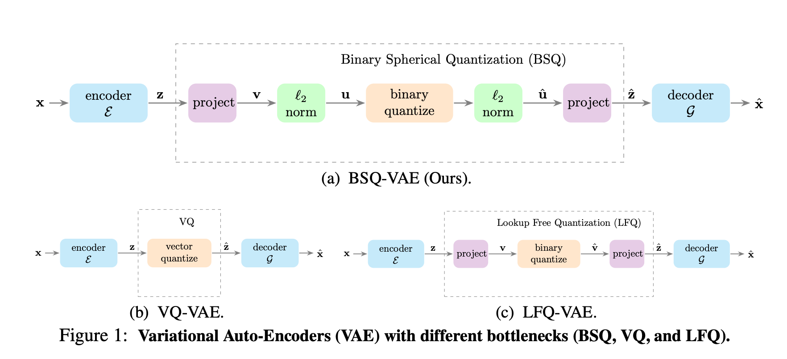
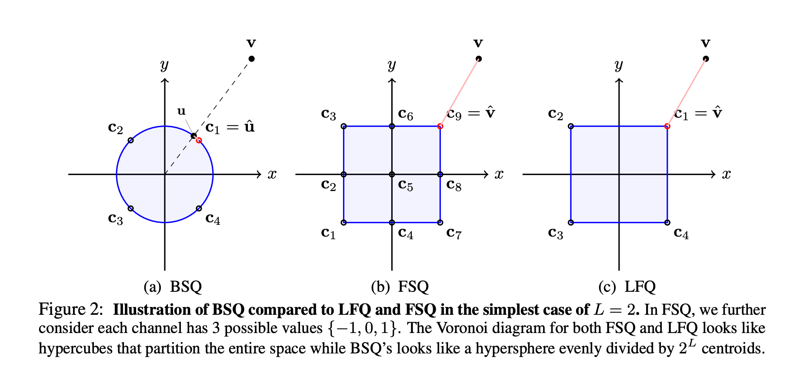
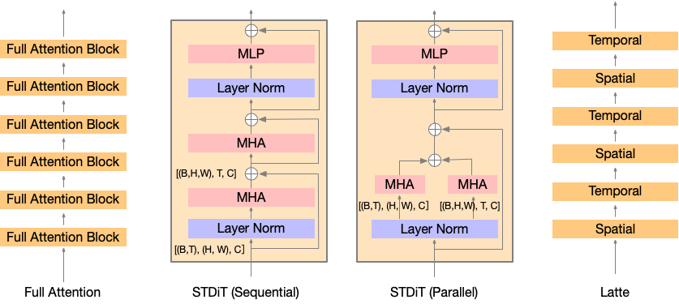
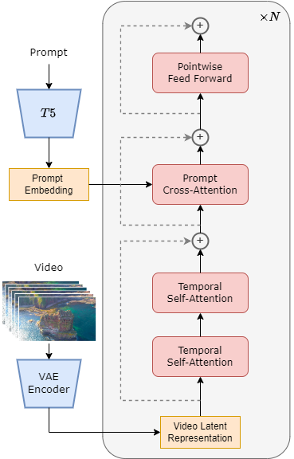
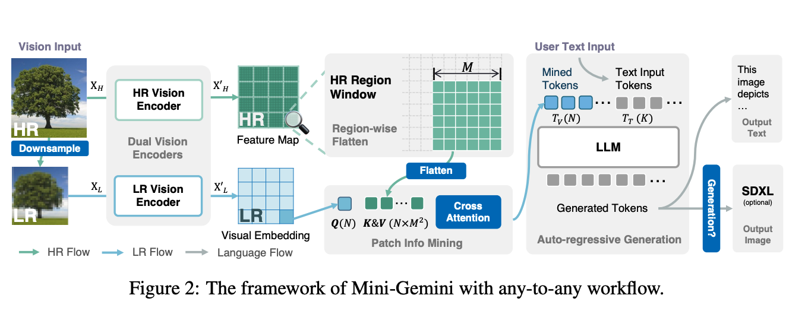

# 多模态（图像）

[【IEEE Fellow何晓东&邓力】多模态智能论文综述：表示学习，信息融合与应用，259篇文献带你了解AI热点技](https://mp.weixin.qq.com/s/EMWpBP5iB1Qrleo3XNjbuQ)

[Multimodal Intelligence: Representation  Learning, Information Fusion, and Applications](https://arxiv.org/abs/1911.03977)

[BERT在多模态领域中的应用](https://mp.weixin.qq.com/s/THxlQX2MPXua0_N0Ug0EWA)

## VLM导论

[视觉语言模型导论：这篇论文能成为你进军VLM的第一步](https://mp.weixin.qq.com/s/gdT0q5HJ9Fw5QrbBihI1vA)

[An Introduction to Vision-Language Modeling](https://arxiv.org/pdf/2405.17247)


## vilbert

[ViLBERT: Pretraining Task-Agnostic Visiolinguistic Representations for Vision-and-Language Tasks](https://arxiv.org/pdf/1908.02265.pdf)

研究人员提出了一种名为 ViLBERT（图文 BERT）模型。这是一个可以学习任务未知的、图像内容和自然语言联合表征的模型。研究人员将流行的 BERT 架构扩展成一个 multi-modal two-stream 模型上。在这个模型上，模型用两个分开的流处理图像和文本输入，但他们彼此用联合注意力层交互。研究人员在两个代理任务上，使用 Conceptual Captions 数据集（数据集很大，而且是自动收集的数据）预训练这个模型，然后将模型秦阿姨到多个建立好的图像-文本任务上。这些任务包括图像问答、图像常识推理、引述表达、指称成分，以及基于捕捉的图像提取。这些只需要在基本架构上进行微小的补充。研究人员观察到，相比现有的针对任务的特定模型，新模型在这些任务上都有了相助的性能提升——在每个任务上都取得了 SOTA。

## VLbert

Visual-Linguistic BERT，简称 VL-BERT

[微软亚研提出VL-BERT：通用的视觉-语言预训练模型](https://mp.weixin.qq.com/s/RaYwdMXT0UKN8_bni-DpWw)

此预训练过程可以显著提高下游的视觉-语言任务的效果，包含视觉常识推理、视觉问答与引用表达式理解等。值得一提的是，在视觉常识推理排行榜中，VL-BERT 取得了当前单模型的最好效果。

[VL-BERT: Pre-training of Generic Visual-Linguistic Representations](https://arxiv.org/abs/1908.08530)

之前的视觉-语言模型分别使用计算机视觉或自然语言处理领域中的预训练模型进行初始化，但如果目标任务数据量不足，模型容易过拟合从而损失性能。并且对于不同的视觉-语言任务，其网络架构一般是经过特殊设计的，由此很难通过视觉-语言联合预训练的过程帮助下游任务。

VL-BERT 的主干网络使用 TransformerAttention 模块，并将视觉与语言嵌入特征作为输入，其中输入的每个元素是来自句子中的单词、或图像中的感兴趣区域（Region of Interests，简称 RoIs）。在模型训练的过程中，每个元素均可以根据其内容、位置、类别等信息自适应地聚合来自所有其他元素的信息。在堆叠多层 TransformerAttention 模块后，其特征表示即具有更为丰富的聚合与对齐视觉和语言线索的能力。

为了更好地建模通用的视觉-语言表示，作者在大规模视觉-语言语料库中对 VL-BERT 进行了预训练。采用的预训练数据集为图像标题生成数据集，Conceptual Captions，其中包含了大约 330 万个图像标题对。

VL-BERT 的预训练主要采用三个任务：
+ 屏蔽语言模型（Masked Language Modeling），即随机屏蔽掉语句中的一些词，并预测当前位置的词是什么；
+ 屏蔽 RoI 分类（MaskedRoIClassification），即随机屏蔽掉视觉输入中的一些 RoIs，并预测此空间位置对应 RoI 的所属类别；
+ 图像标题关联预测（Sentence-Image Relationship Prediction），即预测图像与标题是否属于同一对。

在预训练结束后，使用微调来进行下游任务的训练。本文中主要在三个视觉-语言下游任务中进行微调，即视觉常识推理（VisualCommonsenseReasoning）、视觉问答（VisualQuestionAnswering）与引用表达式理解（ReferringExpressionComprehension），下面将分别介绍。

视觉常识推理任务即给定图片与相关问题，机器不仅需要回答问题，还需要提供理由来证明答案的正确性。此任务（Q->AR）被分解为两个子任务，即视觉问答（Q->A，给定图片与问题，输出正确答案），以及视觉推理（QA->R，给定图片、问题与答案，输出正确的理由）。

## CLIP系列

## cn-clip

[Chinese CLIP: Contrastive Vision-Language Pretraining in Chinese](https://arxiv.org/pdf/2211.01335)

[https://github.com/OFA-Sys/Chinese-CLIP](https://github.com/OFA-Sys/Chinese-CLIP)

## BEiT系列


### BEiT

[BEIT: BERT Pre-Training of Image Transformers](https://arxiv.org/pdf/2106.08254.pdf)

### BEiT v2

[BEIT V2: Masked Image Modeling with Vector-Quantized Visual Tokenizers](https://arxiv.org/pdf/2208.06366.pdf)

### BEiT v3

[Image as a Foreign Language: BEIT Pretraining for All Vision and Vision-Language Tasks](https://arxiv.org/pdf/2208.10442.pdf)

## ViT&Swin-Transformer

[SwinTransformer与Vit细节总结](https://blog.csdn.net/taoqick/article/details/131362590)

[An Image is Worth 16x16 Words: Transformers for Image Recognition at Scale](https://arxiv.org/pdf/2010.11929.pdf)

对于一张$$224\times 224\times 3$$的图像，假设每个patch是$$16\times 16$$，那就分成$$\frac{224\times 224}{16\times 16}=196$$个patch(即$$seq\_length=196$$)，每个patch的维度是$$16\times 16\times 3=768$$，最后加上```[CLS]```这个token，就是$$seq\_length=197$$。

## 像素tokenizer

[Meta新研究挑战CV领域基操：ViT根本不用patch，用像素做token效果更佳](https://mp.weixin.qq.com/s/o_Wb3Bt9Maipgczokeinrg)

[An Image is Worth More Than 16x16 Patches: Exploring Transformers on Individual Pixels](https://arxiv.org/pdf/2406.09415)

## stable diffusion

[High-Resolution Image Synthesis with Latent Diffusion Models](https://arxiv.org/abs/2112.10752)


+ 输入图像，经过编码器得到z，z通过前向扩散不断加噪声得到$$z_T$$（正向扩散）
+ 输入条件，经过条件编码器(原文是BERT，到了DALL-E2就改成CLIP了)得到$$\tau_\theta$$
+ $$z_T$$在$$\tau_\theta$$的指导下不断去噪（反向扩散），得到新的$$z$$，再通过解码器得到最终生成的图像

其中的正向扩散和反向扩散一般用U-Net

代码库：[https://github.com/CompVis/latent-diffusion/tree/main](https://github.com/CompVis/latent-diffusion/tree/main)

粗略看了下代码，带condition的训练原理大概是训练语料中有图+文本（例如imagenet的class_label，这里可以映射到一个classid也可以直接拿明文），然后condition和图片一起作为输入去训练auto-eocnder和ldm

在```/latent-diffusion/ldm/data/imagenet.py```这个代码里，把class_label加进来了

```python
    def _load(self):
        with open(self.txt_filelist, "r") as f:
            self.relpaths = f.read().splitlines()
            l1 = len(self.relpaths)
            self.relpaths = self._filter_relpaths(self.relpaths)
            print("Removed {} files from filelist during filtering.".format(l1 - len(self.relpaths)))

        self.synsets = [p.split("/")[0] for p in self.relpaths]
        self.abspaths = [os.path.join(self.datadir, p) for p in self.relpaths]

        unique_synsets = np.unique(self.synsets)
        class_dict = dict((synset, i) for i, synset in enumerate(unique_synsets))
        if not self.keep_orig_class_label:
            self.class_labels = [class_dict[s] for s in self.synsets]
        else:
            self.class_labels = [self.synset2idx[s] for s in self.synsets]

        with open(self.human_dict, "r") as f:
            human_dict = f.read().splitlines()
            human_dict = dict(line.split(maxsplit=1) for line in human_dict)

        self.human_labels = [human_dict[s] for s in self.synsets]

        labels = {
            "relpath": np.array(self.relpaths),
            "synsets": np.array(self.synsets),
            "class_label": np.array(self.class_labels),
            "human_label": np.array(self.human_labels),
        }

        if self.process_images:
            self.size = retrieve(self.config, "size", default=256)
            self.data = ImagePaths(self.abspaths,
                                   labels=labels,
                                   size=self.size,
                                   random_crop=self.random_crop,
                                   )
        else:
            self.data = self.abspaths
```

## stable diffusion 3

[Stable Diffusion 3论文终于发布，架构细节大揭秘，对复现Sora有帮助？](https://mp.weixin.qq.com/s/mH6IzExPPBpX8YTwxlP6dA)

## DALL-E系列

DALL-E3：

[Improving Image Generation with Better Captions](https://cdn.openai.com/papers/dall-e-3.pdf)

现有的文本->图像模型面临的一个基本问题是：训练数据集中的文本-图像pair对中的**文本质量较差**。

+ 学习一个图像文本生成器，可以生成详细、准确的图像描述
+ 将此文本生成器应用到数据集以生成更详细的文本
+ 在改进的数据集上训练文本 - 图像模型


## PALM-E

[PaLM-E: An Embodied Multimodal Language Model](https://arxiv.org/abs/2303.03378)

## InstantID

[InstantID: Zero-shot Identity-Preserving Generation in Seconds](https://arxiv.org/pdf/2401.07519.pdf)

[https://github.com/InstantID/InstantID](https://github.com/InstantID/InstantID)

[小红书开源「InstantID」效果炸裂，迅速蹿上Github热榜](https://baijiahao.baidu.com/s?id=1789680663845556585&wfr=spider&for=pc)

用户只需上传一张照片，就能轻松定制出多种风格的 AI 写真


[曾爆火的 InstantID又有了新玩法：风格化图像生成，已开源](https://mp.weixin.qq.com/s/CP6NFzzt57YZMj4Q3JNySA)

[InstantStyle: Free Lunch towards Style-Preserving in Text-to-Image Generation](https://arxiv.org/pdf/2404.02733.pdf)

[https://github.com/InstantStyle/InstantStyle](https://github.com/InstantStyle/InstantStyle)


## VAR

[GPT超越扩散、视觉生成Scaling Law时刻！北大&字节提出VAR范式](https://mp.weixin.qq.com/s/KOEdTgJX4Gga5zRbl57Yow)

[Visual Autoregressive Modeling: Scalable Image Generation via Next-Scale Prediction](https://arxiv.org/pdf/2404.02905.pdf)

[https://github.com/FoundationVision/VAR](https://github.com/FoundationVision/VAR)

## cobra

[首个基于Mamba的MLLM来了！模型权重、训练代码等已全部开源](https://mp.weixin.qq.com/s/KuuNTL_jBRsyhub5_6aXpQ)

[Cobra: Extending Mamba to Multi-Modal Large Language Model for Efficient Inference](https://arxiv.org/pdf/2403.14520.pdf)

[https://github.com/h-zhao1997/cobra](https://github.com/h-zhao1997/cobra)

## Hyper-SD

[加速扩散模型，最快1步生成SOTA级图片，字节Hyper-SD开源了](https://mp.weixin.qq.com/s/dqDqlWv1xe-8zayeJCGq8A)

[Hyper-SD: Trajectory Segmented Consistency Model for Efficient Image Synthesis](https://arxiv.org/pdf/2404.13686)

## TextSquare

[8B文字多模态大模型指标逼近GPT4V，字节、华师、华科联合提出TextSquare](https://mp.weixin.qq.com/s/zFsZsEgHtMUJMye_56j9Cw)

[TextSquare: Scaling up Text-Centric Visual Instruction Tuning](https://arxiv.org/pdf/2404.12803)

## neural network diffusion

[用扩散模型生成网络参数，LeCun点赞尤洋团队新研究](https://mp.weixin.qq.com/s/kVY0UrLrfb3_2ZmIFlGxVg)

[Neural Network Diffusion](https://arxiv.org/pdf/2402.13144.pdf)

[https://github.com/NUS-HPC-AI-Lab/Neural-Network-Diffusion](https://github.com/NUS-HPC-AI-Lab/Neural-Network-Diffusion)

## hunyuan-dit

[首个中文原生DiT架构！腾讯混元文生图大模型全面开源，免费商用](https://mp.weixin.qq.com/s/6J4Vc1faazRGXbDNG_RdPw)

## lumina-t2x

[DiT架构大一统：一个框架集成图像、视频、音频和3D生成，可编辑、能试玩](https://mp.weixin.qq.com/s/NwwbaeRujh-02V6LRs5zMg)

[Lumina-T2X: Transforming Text into Any Modality, Resolution, and Duration via Flow-based Large Diffusion Transformers](https://arxiv.org/pdf/2405.05945)

[https://github.com/Alpha-VLLM/Lumina-T2X](https://github.com/Alpha-VLLM/Lumina-T2X)

[https://huggingface.co/Alpha-VLLM/Lumina-T2I/tree/main](https://huggingface.co/Alpha-VLLM/Lumina-T2I/tree/main)

## Vision-LSTM

[原作者带队，LSTM卷土重来之Vision-LSTM出世](https://mp.weixin.qq.com/s/_9DYLbRkiXTU70nsXJLCDQ)

[Vision-LSTM: xLSTM as Generic Vision Backbone](https://arxiv.org/pdf/2406.04303)

[https://nx-ai.github.io/vision-lstm/](https://nx-ai.github.io/vision-lstm/)

## CSR

[零成本突破多模态大模型瓶颈！多所美国顶尖高校华人团队，联合推出自增强技术CSR](https://mp.weixin.qq.com/s/yrzBdDhxv5AkSZMQzuHc8g)

[Calibrated Self-Rewarding Vision Language Models](https://arxiv.org/pdf/2405.14622)

[https://github.com/YiyangZhou/CSR](https://github.com/YiyangZhou/CSR)

## ManyICL

[吴恩达团队新作：多模态多样本上下文学习，无需微调快速适应新任务](https://mp.weixin.qq.com/s/eLqMKBhgHbm36uB0s23C6A)

[Many-Shot In-Context Learning in Multimodal Foundation Models](https://arxiv.org/pdf/2405.09798)

## MAR

[何恺明新作再战AI生成：入职MIT后首次带队，奥赛双料金牌得主邓明扬参与](https://mp.weixin.qq.com/s/JxdYrYOzkM5DBMR0D49WUQ)

[Autoregressive Image Generation without Vector Quantization](https://arxiv.org/pdf/2406.11838v1)

## Cambrian-1

[寒武纪1号诞生：谢赛宁Yann LeCun团队发布最强开源多模态LLM](https://mp.weixin.qq.com/s/NFiorsNZLzVT1YXeLgNZPw)

[Cambrian-1: A Fully Open, Vision-Centric Exploration of Multimodal LLMs](https://arxiv.org/pdf/2406.16860)

[https://github.com/cambrian-mllm/cambrian](https://github.com/cambrian-mllm/cambrian)

[https://huggingface.co/nyu-visionx/](https://huggingface.co/nyu-visionx/)

[https://huggingface.co/datasets/nyu-visionx/CV-Bench](https://huggingface.co/datasets/nyu-visionx/CV-Bench)

[https://github.com/cambrian-mllm/cambrian](https://github.com/cambrian-mllm/cambrian)

当前多模态学习研究的两个潜在问题：

+ 过度且过早地依赖语言，这是一个捷径，能弥补学习有效视觉表征的不足之处
+ 现有基准可能无法为真实世界场景提供足够的指导 —— 视觉定基对于稳健的多模态理解至关重要


## VCR

[Bengio团队提出多模态新基准，直指Claude 3.5和GPT-4o弱点](https://mp.weixin.qq.com/s/Zy-kM3bvN-1oHondw1VLzw)

[VCR: Visual Caption Restoration](https://arxiv.org/pdf/2406.06462)

[https://github.com/tianyu-z/VCR](https://github.com/tianyu-z/VCR)

## EVE

[抛弃视觉编码器，这个「原生版」多模态大模型也能媲美主流方法](https://mp.weixin.qq.com/s/At2Wz9Kk2QzGEZ--4FnbZw)

[Unveiling Encoder-Free Vision-Language Models](https://arxiv.org/pdf/2406.11832)

[https://github.com/baaivision/EVE](https://github.com/baaivision/EVE)

## LC-Mis

[AI画家的「滑铁卢」：为什么冰可乐不愿意住进茶杯里？](https://mp.weixin.qq.com/s/OyLEBVJoaJDkunq15Uwj1Q)

[Lost in Translation: Latent Concept Misalignment in Text-to-Image Diffusion Models](https://arxiv.org/pdf/2408.00230)

## 多模态cot

[ACL 2024 Oral｜我们离真正的多模态思维链推理还有多远？](https://mp.weixin.qq.com/s/oCJB_Q_Kz3kTC36WoSVtEQ)

## Imagen 3

[Imagen 3](https://arxiv.org/pdf/2408.07009)

[Imagen 3支持人物生成，人人可用！谷歌Gemini AI重大升级来了](https://mp.weixin.qq.com/s/4gYFpljgF64vA5ojulEmYQ)

[https://deepmind.google/technologies/imagen-3/](https://deepmind.google/technologies/imagen-3/)

## Chameleon

下面3个工作都在这里有介绍：[生成-理解大一统：一文浅谈多模态大模型最新研究进展](https://mp.weixin.qq.com/s/Ip-IphDFF6il3rTJLxflZA)


[Meta首发「变色龙」挑战GPT-4o，34B参数引领多模态革命！10万亿token训练刷新SOTA](https://mp.weixin.qq.com/s/HQC7F64ZIb-k-K_QLzFegg)

[Chameleon: Mixed-Modal Early-Fusion Foundation Models](https://arxiv.org/pdf/2405.09818)


## Show-o

[Show-o: One Single Transformer to Unify Multimodal Understanding and Generation](https://arxiv.org/abs/2408.12528)

## Transfusion

(toread)

[统一transformer与diffusion！Meta融合新方法剑指下一代多模态王者](https://mp.weixin.qq.com/s/D0sadIZkILx8VvWcsIEYFQ)

[Transfusion: Predict the Next Token and Diffuse Images with One Multi-Modal Model](https://arxiv.org/pdf/2408.11039)

一般来说，多模态生成模型需要能够感知、处理和生成离散元素（如文本或代码）和连续元素（如图像、音频和视频数据）。

+ 离散模态领域：以预测下一个词为目标的语言模型占据主导地位
+ 连续模态方面：扩散模型及其泛化形式则是当前最先进技术

研究者一直试图将语言模型与扩散模型结合：

+ 方法一：直接扩展语言模型，使其能够利用扩散模型作为一个工具，或者将一个预训练的扩散模型嫁接到语言模型上。
+ 方法二：是对连续模态进行量化处理，然后在离散的token上训练一个标准的语言模型，虽然简化了模型架构，但也会造成信息的丢失。

本文通过训练单个模型来预测离散文本 token 和扩散连续图像，从而实现两种模态的完全集成，且不会丢失任何信息。引入了一个训练模型的新方法 Transfusion，能够无缝地生成离散和连续的模态，将语言模型损失函数与扩散相结合，在混合模态序列上训练单个transformer。

该研究还在文本和图像数据混合基础上从头开始预训练多个 Transfusion 模型，最多可达到 7B 参数量，并针对各种单模态和跨模态基准建立扩展定律。

## ControlNeXt

[视频生成控制提升几十倍，新一代轻量级ControlNeXt火了，贾佳亚团队正挑战Scaling Law](https://mp.weixin.qq.com/s/IBqOmZbSCcdRvyFRdcXMLQ)

[ControlNeXt: Powerful and Efficient Control for Image and Video Generation](https://arxiv.org/pdf/2408.06070)

[https://github.com/dvlab-research/ControlNeXt](https://github.com/dvlab-research/ControlNeXt)

## GNN+Graph Transformer综述

[TPAMI 2024 | 计算机视觉中基于图神经网络和图Transformers的方法和最新进展](https://mp.weixin.qq.com/s/-lWM4mmbCixxJxWRPuoQsw)

[Survey on Graph Neural Networks and Graph Transformers in Computer Vision: A Task-Oriented Perspective](https://arxiv.org/abs/2209.13232)

## Llip

[ICML 2024 | 直面CLIP内在缺陷，Meta提出全新latent对比预训练框架Llip](https://mp.weixin.qq.com/s/vucfBAYI_SFemwg5_PrbLA)

[Modeling Caption Diversity in Contrastive Vision-Language Pretraining](https://arxiv.org/abs/2405.00740)

基于对比视觉-语言预训练技术的大型多模态模型目前已成为人工智能领域研究的热点课题。但这一预训练技术仍然以经典的CLIP模型为基础，缺乏进一步的发展。此外，鉴于CLIP模型通过将图像及其caption映射到单个向量这样的底层机制，可以认为限制了对比预训练模型描述图像各种其他方面的能力。

提出了一种名为Llip的架构（Latent Language Image Pretraining），以图像字幕生成（Image Caption）任务作为出发点，用来模拟自然场景中与单张图像进行匹配caption的多样性。Llip仍然采用双塔特征提取模式，其视觉编码器可以对给定图像输出一组视觉特征，这些特征可以总结与当前图像匹配的多样式captions中的文本信息，来得到最终的表示。

## longllava

[首个Mamba+Transformer混合架构多模态大模型来了，实现单卡千图推理](https://mp.weixin.qq.com/s/ipfx6qaxeQlkILEVACabvA)

[LongLLaVA: Scaling Multi-modal LLMs to 1000 Images Efficiently via Hybrid Architecture](https://arxiv.org/abs/2409.02889)

[https://github.com/FreedomIntelligence/LongLLaVA](https://github.com/FreedomIntelligence/LongLLaVA)

## Molmo

[号称击败Claude 3.5 Sonnet，媲美GPT-4o，开源多模态模型Molmo挑战Scaling law](https://mp.weixin.qq.com/s/9s9sIkP-KDlUuJdlktVT9w)

[Molmo and PixMo: Open Weights and Open Data for State-of-the-Art Multimodal Models](https://molmo.allenai.org/paper.pdf)

## Playground

[文生图参数量升至240亿！Playground v3发布：深度融合LLM，图形设计能力超越人类](https://mp.weixin.qq.com/s/P8rieQj_-KoY0H-HfwN5hA)

[Playground v3: Improving Text-to-Image Alignment with Deep-Fusion Large Language Models](https://arxiv.org/abs/2409.10695)

## REPA

[扩散模型训练方法一直错了！谢赛宁：Representation matters](https://mp.weixin.qq.com/s/a725rxzvyQXqNJoL1NsMaA)

[Representation Alignment for Generation: Training Diffusion Transformers Is Easier Than You Think](https://arxiv.org/pdf/2410.06940)

[https://github.com/sihyun-yu/REPA](https://github.com/sihyun-yu/REPA)

## LLaVA-Critic

[Evaluation is All You Need！首个开源多模态大模型通用评测器LLaVA-Critic](https://mp.weixin.qq.com/s/YweRqZrHJmISVjJWamalQg)

[LLaVA-Critic: Learning to Evaluate Multimodal Models](https://arxiv.org/abs/2410.02712)

## MM1.5

[苹果多模态模型大升级！文本密集、多图理解，全能小钢炮](https://mp.weixin.qq.com/s/jIevs7L4zwWOWzXM4nx62A)

[MM1.5: Methods, Analysis & Insights from Multimodal LLM Fine-tuning](https://arxiv.org/pdf/2409.20566)

## SCMs

[OpenAI攻克扩散模型短板，清华校友路橙、宋飏合作最新论文](https://mp.weixin.qq.com/s/tDlp95HLlvYqW2gVPqzQag)

[刚刚，OpenAI发布sCM提升50倍效率，扩散模型重大技术突破！](https://mp.weixin.qq.com/s/dI9mSCDbGzZIkjol_CT6Cg)

[比扩散模型快50倍！OpenAI发布多模态模型实时生成进展，作者还是清华校友，把休假总裁Greg都炸出来了](https://mp.weixin.qq.com/s/3h_mxCij5_owicnfsHhp_Q)

[Simplifying, Stabilizing & Scaling Continuous-Time Consistency Models](https://arxiv.org/pdf/2410.11081v1)


## Janus

[DeepSeek新作Janus：解耦视觉编码，引领多模态理解与生成统一新范式](https://mp.weixin.qq.com/s/Ao5V0ICGX3X2HWfIw23YAQ)

[Janus: Decoupling Visual Encoding for Unified Multimodal Understanding and Generation](https://arxiv.org/pdf/2410.13848)

[https://github.com/deepseek-ai/Janus](https://github.com/deepseek-ai/Janus)

[https://huggingface.co/spaces/deepseek-ai/Janus-1.3B](https://huggingface.co/spaces/deepseek-ai/Janus-1.3B)

## OmniGen

[新扩散模型OmniGen一统图像生成，架构还高度简化、易用](https://mp.weixin.qq.com/s/mzs96Oav3pfj22YoYJPILQ)

[OmniGen: Unified Image Generation](https://arxiv.org/pdf/2409.11340)

[https://github.com/VectorSpaceLab/OmniGen](https://github.com/VectorSpaceLab/OmniGen)

## LLM2CLIP

[跨模态大升级！少量数据高效微调，LLM教会CLIP玩转复杂文本](https://mp.weixin.qq.com/s/2cp9umZtOQdZLYwiB3e_5g)

[LLM2CLIP: POWERFUL LANGUAGE MODEL UNLOCKS RICHER VISUAL REPRESENTATION](https://arxiv.org/pdf/2411.04997)

[https://github.com/microsoft/LLM2CLIP](https://github.com/microsoft/LLM2CLIP)

## TFG

[NeurIPS Spotlight｜从分类到生成：无训练的可控扩散生成](https://mp.weixin.qq.com/s/9COLxKc7RQaPpEmE-YIfgw)

[TFG: Unified Training-Free Guidance for Diffusion Models](https://arxiv.org/abs/2409.15761)

[https://github.com/YWolfeee/Training-Free-Guidance](https://github.com/YWolfeee/Training-Free-Guidance)

## Deepseek-VL2

[久等了，DeepSeek-VL2](https://mp.weixin.qq.com/s/rE6Dh_OzolgDTAh3ubM5KA)

[https://github.com/deepseek-ai/DeepSeek-VL2](https://github.com/deepseek-ai/DeepSeek-VL2)

[DeepSeek-VL2: Mixture-of-Experts Vision-Language Models for Advanced Multimodal Understanding](https://github.com/deepseek-ai/DeepSeek-VL2/blob/main/DeepSeek_VL2_paper.pdf)

+ 数据：比一代 DeepSeek-VL 多一倍优质训练数据，引入梗图理解、视觉定位、视觉故事生成等新能力
+ 架构：视觉部分使用切图策略支持动态分辨率图像，语言部分采用MoE架构低成本高性能
+ 训练：继承DeepSeek-VL的三阶段训练流程，同时通过负载均衡适配图像切片数量不定的困难，对图像和文本数据使用不同流水并行策略，对MoE语言模型引入专家并行，实现高效训练

## Florence-VL

[Florence-VL来了！使用生成式视觉编码器，重新定义多模态大语言模型视觉信息](https://mp.weixin.qq.com/s/sAf-FxUithvgA6noaew4sQ)

[Florence-VL: Enhancing Vision-Language Models with Generative Vision Encoder and Depth-Breadth Fusion](https://arxiv.org/pdf/2412.04424)

[https://github.com/JiuhaiChen/Florence-VL](https://github.com/JiuhaiChen/Florence-VL)

## metamorph

[统一视觉理解与生成，MetaMorph模型问世，LeCun、谢赛宁、刘壮等参与](https://mp.weixin.qq.com/s/Q0obsptFhlZ-R9xH3LCGVw)

[MetaMorph: Multimodal Understanding and Generation via Instruction Tuning](https://arxiv.org/pdf/2412.14164v1)


## 多模态推荐系统

[多模态推荐系统新突破，一文读懂前沿进展！](https://mp.weixin.qq.com/s/YDna7dvC55yWL61r8PljoQ)

[Multimodal Recommender Systems: A Survey](https://arxiv.org/pdf/2302.03883)

[https://github.com/Applied-Machine-Learning-Lab/Awesome-Multimodal-Recommender-Systems](https://github.com/Applied-Machine-Learning-Lab/Awesome-Multimodal-Recommender-Systems)

BM3：[Bootstrap Latent Representations for Multi-modal Recommendation](https://arxiv.org/pdf/2207.05969)

EM3：[End-to-end training of Multimodal Model and ranking Model](https://arxiv.org/pdf/2404.06078v1)

## 其他

(toread)

[​近期必看的多模态大模型进展：从Qwen2-VL到Pixtral](https://mp.weixin.qq.com/s/r0HipvOkZhHaDxfGsyIgOg)


# 多模态（视频）


## videobert


[通过未标记视频进行跨模态时间表征学习](https://mp.weixin.qq.com/s/5qC70NoTBQ95vjI4cGl66g)

[VideoBERT: A Joint Model for Video and Language Representation Learning](https://arxiv.org/abs/1904.01766)，VideoBert模型。


## video caption

[Tarsier: Recipes for Training and Evaluating Large Video Description Models](https://arxiv.org/pdf/2407.00634)


## 视频tokenizer方法

+ VideoGPT：[Videogpt: Video generation using vq-vae and transformers](https://arxiv.org/pdf/2104.10157.pdf)，结合了VQ-VAE，而且是自回归的transformer
+ magvit：[MAGVIT: Masked Generative Video Transformer](https://arxiv.org/pdf/2212.05199.pdf)
+ magvitv2：[Language Model Beats Diffusion -- Tokenizer is Key to Visual Generation](https://arxiv.org/pdf/2310.05737.pdf)，[语言模型战胜扩散模型！谷歌提出MAGVIT-v2：视频和图像生成上实现双SOTA！](https://blog.csdn.net/amusi1994/article/details/133917909)


先看vq的改进版：

[Finite Scalar Quantization: VQ-VAE Made Simple](https://arxiv.org/pdf/2309.15505)提出了fsq，码本大小是$$|C|=L^d$$

magvit-v2提出了LFQ，也优化了vq-vae

[BSQ：Image and Video Tokenization with Binary Spherical Quantization](https://arxiv.org/pdf/2406.07548)





claude-2-100k的回答。。

+ [MAGVIT: Masked Generative Video Transformer](https://arxiv.org/pdf/2212.05199.pdf)：使用了3D向量量化(3D VQ)自动编码器来将视频量化为离散token
  + 设视频$$V$$有$$T$$帧，其形状为$$T \times H \times W \times 3$$。
  + 3D VQ编码器$$f_T$$会把视频量化为一个token序列$$z$$,其中$$z\in Z^T$$,$$Z$$是码本,$$T$$是token序列长度。
  + 3D VQ解码器$$f^{-1}_T$$则可以从latent token $$z$$重构回视频像素。
+ [Genie: Generative Interactive Environments](https://arxiv.org/pdf/2402.15391.pdf)：使用了2D向量量化(2D VQ)方法
  + 每一帧图像I先通过一个2D VQ编码器f编码为一个token序列$$z$$,其中$$z\in Z^N$$,$$Z$$是2D码本。
  + 然后,对时间序列上的token $$z_1, z_2,..., z_T$$应用一个1D卷积网络,以捕获时间信息。
  + 再通过2D VQ解码器$$f^{-1}$$解码回每一帧图像。
+ [Vivit: A video vision transformer](https://arxiv.org/pdf/2103.15691.pdf)：使用tubelet-embedding
  + 均匀地在时间轴上抽样$$n_t$$个帧,然后把每帧处理成$$n_h \times n_w$$个patch,最终把所有patch连接起来


## SORA

[OpenAI首个AI视频模型炸裂登场，彻底端掉行业饭碗！60秒一镜到底惊人，世界模型真来了？](https://mp.weixin.qq.com/s/93z4Ta91yLv7PB1pnBM9mg)

[https://openai.com/sora](https://openai.com/sora)

[https://openai.com/research/video-generation-models-as-world-simulators](https://openai.com/research/video-generation-models-as-world-simulators)

[一锤降维！解密OpenAI超级视频模型Sora技术报告，虚拟世界涌现了](https://mp.weixin.qq.com/s/ODsebK3fEc-adRDwRVDhQA)

[Sora爆火48小时：杨立昆揭秘论文，参数量或仅30亿](https://new.qq.com/rain/a/20240217A05YVR00)

[微软37页论文逆向工程Sora，得到了哪些结论？](https://mp.weixin.qq.com/s/5-pySWU40omjBowsV2WCKA)

[攻陷短视频后，Sora将需要72万块H100 GPU](https://mp.weixin.qq.com/s/X-MNijIUU5XKYb4vfYtVZg)

[Sora: A Review on Background, Technology, Limitations, and Opportunities of Large Vision Models](https://arxiv.org/pdf/2402.17177.pdf)

[Sora之后，OpenAI Lilian Weng亲自撰文教你从头设计视频生成扩散模型](https://mp.weixin.qq.com/s/C8JoiTHwW7T-g66EBPcfDg)

[https://lilianweng.github.io/posts/2024-04-12-diffusion-video/](https://lilianweng.github.io/posts/2024-04-12-diffusion-video/)

整体感觉：

+ latent diffusion的隐空间
+ vit和swin transformer的patch

### 现有方法

现有的视频生成方法大多只能用于少数分类的视频、比较短的视频，或者固定长度的视频。

+ recurrent networks
  + 2015年的[Unsupervised learning of video representations using lstms](https://arxiv.org/pdf/1502.04681.pdf)
  + 2017年的[Recurrent environment simulators](https://arxiv.org/pdf/1704.02254.pdf)
  + 2018年的[World models](https://arxiv.org/pdf/1803.10122.pdf)
+ generative adversarial networks
  + 2016年的[Generating videos with scene dynamics](https://arxiv.org/pdf/1609.02612.pdf)
  + 2018年的[Mocogan: Decomposing motion and content for video generation](https://arxiv.org/pdf/1707.04993.pdf)
  + 2019年的[Adversarial video generation on complex datasets](https://arxiv.org/pdf/1907.06571.pdf)
  + 2022年的[Generating long videos of dynamic scenes](https://arxiv.org/pdf/2206.03429.pdf)
+ autoregressive transformers
  + 2021年的[Videogpt: Video generation using vq-vae and transformers]((https://arxiv.org/pdf/2104.10157.pdf))
  + 2022年的[Nüwa: Visual synthesis pre-training for neural visual world creation](https://arxiv.org/pdf/2111.12417.pdf)
+ diffusion models
  + 2022年的[Imagen video: High definition video generation with diffusion models](https://arxiv.org/pdf/2210.02303.pdf)
  + 2023年的[Align your latents: High-resolution video synthesis with latent diffusion models](https://arxiv.org/pdf/2304.08818.pdf)
  
前两类太古老了，sora把后面两个（autogressive transformers和diffusion models）结合在一起了，而且能同时处理不同时长、分辨率的**视频和图像**

### 将视频转成spacetime latent patches

#### Vivit

&nbsp;

[Vivit: A video vision transformer](https://arxiv.org/pdf/2103.15691.pdf)

整体受ViT的启发


先分patch，再分别过时间的transformer（temporal transformer）和空间的transformer（spatial transformer）


具体的分patch方式如上图

#### latent空间上的patch

&nbsp;


参考stable-diffusion，即[High-Resolution Image Synthesis with Latent Diffusion Models](https://arxiv.org/abs/2112.10752)，把patch切分改成在latent空间上进行

+ 将视频映射成**隐空间**(latent space)的表示
+ 把隐空间的表示切分成**spacetime patches**


预估时，可以通过在一个合适大小的grid里排列随机初始化的patches（we can control the size of generated videos by arranging randomly-initialized patches in an appropriately-sized grid.）来控制生成视频的大小。估计是参考了下面这篇：

论文参考了这个[Patch n'Pack: NaViT, a Vision Transformer for any Aspect Ratio and Resolution](https://arxiv.org/pdf/2307.06304.pdf)，可以使下面提到的DiT适应各种分辨率/持续时间/宽高比。


### Diffusion Transformer

[Scalable diffusion models with transformers](https://arxiv.org/pdf/2212.09748.pdf)提出了DiT，替换stable diffusion中的u-net


**DiT=VAE编码器+ ViT + DDPM + VAE解码器**

sora是一个扩散模型，输入加了噪声的patches，还可以加上一些如text prompt的条件，预测原本『干净』的patches。

之前的做法大多将视频全裁成相同长度和大小的，例如4s的$$256\times 256$$，sora可以直接用原始视频

### 语言理解

参考DALL-E3 ([Improving Image Generation with Better Captions](https://cdn.openai.com/papers/dall-e-3.pdf))，训练了一个highly descriptive的视频描述生成器，拿这个生成器给训练集中的所有视频重新生成描述，再拿来训练。

此外，还用上了GPT，将用户输入的短的prompt改写成更长更详细的视频描述用于生成。

### 使用图像/视频作为prompt

+ **图像转动画**：可以让静止的图像动起来
+ **扩展视频**：可以对视频进行扩展（extend），在时间轴上向前或者向后进行延展（比如同样是一个石头落地，能生成4个视频，每个视频里的石头从不同的地方飞过来，落在同一个地面上）
+ **编辑视频**：输入视频和一个文本prompt，能够对视频进行编辑，例如把场景从沙漠替换成树林，类似[Sdedit: Guided image synthesis and editing with stochastic differential equations](https://arxiv.org/pdf/2108.01073.pdf)
+ **连接视频**：输入两个看似毫不相关的视频，能通过很自然的方式把这两个视频衔接在一起

### 生成图像

 图像就是一帧的视频，可以通过在时间范围为一帧的空间grid中排列高斯噪声patches（arranging patches of Gaussian noise in a spatial grid with a temporal extent of one frame）来生成图像，同样能生成不同分辨率的图像，最多$$2048\times 2048$$

### 涌现的模拟能力

+ **3D一致性**：随着镜头的移动，视频中的人物或物体在3d空间中能在移动中保持一致
+ **Long-range coherence and object permanence（远程连贯性和物体持久性）**：sora能对短期和长期依赖关系进行建模，例如：
  + 可以保留人物体，即使它们被遮挡或离开当前帧。
  + 可以在单个样本中生成同一角色的多个镜头，并在整个视频中保持其外观的不变
+ **与世界交互**：例如画家可以在画布上留下新的笔触，并随着时间的推移而持续存在，人吃东西能留下齿痕
+ **模拟数字世界**：可以同时通过基本策略控制《我的世界》中的玩家，同时以高保真度渲染世界及其动态，只需要在prompt里提到“我的世界”的标题就可以实现。

### 存在的问题

+ 不能准确地模拟许多基本相互作用的物理过程，例如玻璃破碎。
+ 其他交互（例如吃食物）并不总是会产生对象状态的正确变化，例如长时间样本中出现的不连贯性或对象的自发出现。

## open-sora（Colossal-AI）

[没等来OpenAI，等来了Open-Sora全面开源](https://mp.weixin.qq.com/s/vdr1WBCQVr9aS6bJYcdlRA)

[Open-Sora全面开源升级：支持16s视频生成和720p分辨率](https://mp.weixin.qq.com/s/a-FULV7mSskHFar5glbSxg)

### 模型架构

v1版本：[https://github.com/hpcaitech/Open-Sora/blob/main/docs/report_v1.md](https://github.com/hpcaitech/Open-Sora/blob/main/docs/report_v1.md)

v2版本：[https://github.com/hpcaitech/Open-Sora/blob/main/docs/report_02.md](https://github.com/hpcaitech/Open-Sora/blob/main/docs/report_02.md)

#### VAE部分

&nbsp;

sora用了spatial-temporal VAE来降低temporal的维度，但并没有开源且高质量的spatial-temporal VAE：

+ [MAGVIT](https://github.com/google-research/magvit)：的$$4\times 4\times 4$$的VAE并没有开源
+ [VideoGPT](https://github.com/wilson1yan/VideoGPT)：的$$2\times 4\times 4$$的VAE在实验中效果不好

因此，使用[https://huggingface.co/stabilityai/sd-vae-ft-mse-original](https://huggingface.co/stabilityai/sd-vae-ft-mse-original)的2D VAE

对于24fps的1min视频，有$$24\times 60=1440$$帧，用4倍的VAE下采样和2倍的patch size下采样，有大约$$1440\times \approx 1.5M$$的token。对这些token算全部的attention的计算开销很大，所以参考[Latte: Latent Diffusion Transformer for Video Generation](https://arxiv.org/pdf/2401.03048v1.pdf)(代码[https://github.com/Vchitect/Latte](https://github.com/Vchitect/Latte))的方案，使用**spatial-temporal attention**来减小计算量。

以下是latte的4个变种


STDiT(sequential)和latte的变种3类似，STDiT(parallel)和latte的变种4类似，在$$16\times 256\times 256$$的视频上，发现效果如下，最终采用了STDiT(sequential)。

$$
DiT (full) > STDiT (Sequential) > STDiT (Parallel) \approx Latte
$$



#### 生成部分

&nbsp;

[PixArt-α: Fast Training of Diffusion Transformer for Photorealistic Text-to-Image Synthesis](https://arxiv.org/pdf/2310.00426.pdf)使用**T5作为条件**的**DiT**结构，能生成高质量的图像。用PixArt-α对模型初始化，并对**插入的temperal attentioin**用0初始化，能够让模型一开始就保留图片生成的能力。插入的attention让参数量从580M涨到了724M。



#### 训练

&nbsp;

参考PixArt-α和Stable Video Diffusioin([Stable Video Diffusion: Scaling Latent Video Diffusion Models to Large Datasets](https://arxiv.org/pdf/2311.15127.pdf))，采用了progressive的训练策略：

+ 大规模图像预训练：前面提到的，直接使用[https://huggingface.co/stabilityai/sd-vae-ft-mse-original](https://huggingface.co/stabilityai/sd-vae-ft-mse-original)的2D VAE
+ 大规模视频预训练：在质量相对差的366K的预训练数据集(HD-VG-130M数据集)上训练$$16\times 256\times 256$$，这里的16指的是16帧
+ 高质量视频数据微调：在高质量的20K的数据集(Pexels数据集)上训练$$16\times 256\times 256$$、$$16\times 512\times 512$$和$$64\times 512\times 512$$。

由于使用了scaled position embedding，这个策略极大地减少了训练消耗。此外，对于16帧的训练，每3帧降采样一次，对于64帧的训练每2帧降采样一次。

数据标注方法：抽取3帧，然后设计prompt，用LLaVA生成高质量的标题：


+ 学习率：1e-4太大了，改成了2e-5
+ **batchsize比较大**的时候，**fp16比bf16更不稳定**，而且可能导致生成错误，所以对于$$64\times 512\times 512$$使用**bf16**

提供了便捷的视频数据预处理脚本，可以轻松地在自己的数据集上快速生成训练所需的视频 / 文本对，包括公开视频数据集下载，长视频根据镜头连续性分割为短视频片段，使用开源LLaVA生成精细的提示词。

## open-sora(北大版)

[超10秒高分辨率，北大Open Sora视频生成更强了，还支持华为芯片](https://mp.weixin.qq.com/s/1GWxp8ENrA1YGGwrFpOAxA)

## MORA

[Sora不开源，微软给你开源！全球最接近Sora视频模型诞生，12秒生成效果逼真炸裂](https://mp.weixin.qq.com/s/GkJwyVFVwxih-ZQWWBIuNg)

[复刻Sora的通用视频生成能力，开源多智能体框架Mora来了](https://mp.weixin.qq.com/s/JbiwVtEuKvIjb8hBi0Laxg)

[Mora: Enabling Generalist Video Generation via A Multi-Agent Framework](https://arxiv.org/pdf/2403.13248.pdf)

## minigpt4-video

[AI视频理解天花板，全新MiniGPT4-Video刷爆SOTA！宝格丽宣传片配文一绝](https://mp.weixin.qq.com/s/Y8w6CqTvm7zVQMOmTuxePA)

## mini-gemini

[刷爆多模态任务榜单！贾佳亚团队Mini-Gemini登热榜，代码、模型、数据全部开源](https://mp.weixin.qq.com/s/j5CGuJ_-Sf0Pqi_-dDjABA)

模型地址：[https://huggingface.co/collections/YanweiLi/mini-gemini-6603c50b9b43d044171d0854](https://huggingface.co/collections/YanweiLi/mini-gemini-6603c50b9b43d044171d0854)
数据地址：[https://huggingface.co/collections/YanweiLi/mini-gemini-data-660463ea895a01d8f367624e](https://huggingface.co/collections/YanweiLi/mini-gemini-data-660463ea895a01d8f367624e)

[Mini-Gemini: Mining the Potential of Multi-modalityVision Language Models](https://arxiv.org/pdf/2403.18814.pdf)

VLM(vision lm)虽然有很多，但和gemini、gpt-4等的差距还是比较大，作者认为主要原因是**高分辨率视觉标记不够**、**vision推理数据质量不高**。



作者利用**额外的视觉编码器**进行**高分辨率细化**，构建了一个高质量的数据集。构建了一个Mini-Gemini架构，支持一系列从2B到34B的密集和MoE LLM，在zero-shot测试集上超过了私有模型。

[https://github.com/dvlab-research/MiniGemini](https://github.com/dvlab-research/MiniGemini)

## Vidu

[当前最强国产Sora！清华团队突破16秒长视频，懂多镜头语言，会模拟物理规律](https://mp.weixin.qq.com/s/xAEYGIoJ0EzhszfmXno3UA)

采用了和 Sora 完全一致的 Diffusion 和 Transformer 融合的架构，底层基于[All are Worth Words: A ViT Backbone for Diffusion Models](https://arxiv.org/pdf/2209.12152)的 U-ViT 架构。

基于 U-ViT 架构，2023 年 3 月，团队在开源的大规模图文数据集 LAION-5B 上训练了 10 亿参数量的多模态模型 ——UniDiffuser，并将其开源（参见[清华朱军团队开源首个基于 Transformer 的多模态扩散大模型，文图互生、改写全拿下](https://mp.weixin.qq.com/s/B68hXlFxA9L5jiWiMrEEiA)）。

UniDiffuser 主要擅长图文任务，能支持图文模态间的任意生成和转换。UniDiffuser 的实现有一项重要的价值 —— 首次验证了融合架构在大规模训练任务中的可扩展性（Scaling Law），相当于将 U-ViT 架构在大规模训练任务中的所有环节流程都跑通。

这些在图文任务中积累的工程经验为视频模型的研发打下了基础。因为视频本质上是图像的流，相当于是图像在时间轴上做了一个扩增。因此，在图文任务上取得的成果往往能够在视频任务中得到复用。Sora 就是这么做的：它采用了 DALL-E 3 的重标注技术，通过为视觉训练数据生成详细的描述，使模型能够更加准确地遵循用户的文本指令生成视频。这种效应也必然会发生在「Vidu」上面。

根据此前的消息推测，「Vidu」也复用了生数科技在图文任务的很多经验，包括训练加速、并行化训练、低显存训练等等，从而快速跑通了训练流程。据悉，他们通过视频数据压缩技术降低输入数据的序列维度，同时采用自研的分布式训练框架，在保证计算精度的同时，通信效率提升 1 倍，显存开销降低 80%，训练速度累计提升 40 倍。

## Vidu 1.5

[视觉模型学会LLM独门秘籍「上下文记忆」，迎来智能涌现的大爆发！](https://mp.weixin.qq.com/s/vXE1_Spya2BsZxWuD6LBOA)

## gen-3

[Runway版Sora发布：高保真、超强一致性，Gen-3 Alpha震撼到网友了](https://mp.weixin.qq.com/s/uuLub-ruJgYYrTOFoNJ5iw)

## 可灵

[快手「可灵」爆火：海外AI圈巨震，中国版Sora一号难求](https://mp.weixin.qq.com/s/iSAvV3PX1WYwGg7rU60Ong)


## V2A

[杀疯了！谷歌卷视频到语音，逼真音效让AI视频告别无声！](https://mp.weixin.qq.com/s/0D4QGeyZ0ZnmmWYz_x-56g)

[https://deepmind.google/discover/blog/generating-audio-for-video/](https://deepmind.google/discover/blog/generating-audio-for-video/)

## 长视频LongVA

[7B最强长视频模型！ LongVA视频理解超千帧，霸榜多个榜单](https://mp.weixin.qq.com/s/62rMYx94dbz1HwDkZclXtA)

[Long Context Transfer from Language to Vision](https://arxiv.org/pdf/2406.16852)

## LONGVILA

[支持1024帧、准确率近100％，英伟达「LongVILA」开始发力长视频](https://mp.weixin.qq.com/s/T6eMi3DPq9_291bWqcFRgw)

[LONGVILA: SCALING LONG-CONTEXT VISUAL LANGUAGE MODELS FOR LONG VIDEOS](https://arxiv.org/pdf/2408.10188)

[https://github.com/NVlabs/VILA/blob/main/LongVILA.md](https://github.com/NVlabs/VILA/blob/main/LongVILA.md)

## liveportrait

[快手开源LivePortrait，GitHub 6.6K Star，实现表情姿态极速迁移](https://mp.weixin.qq.com/s/JrKF_7To8PEggEfw7W09ew)

[LivePortrait: Efficient Portrait Animation with Stitching and Retargeting Control](https://arxiv.org/pdf/2407.03168)

[https://github.com/KwaiVGI/LivePortrait](https://github.com/KwaiVGI/LivePortrait)

## diffusion forcing

[无限生成视频，还能规划决策，扩散强制整合下一token预测与全序列扩散](https://mp.weixin.qq.com/s/kz4RvqdK6nGtA11y5nq5xQ)

[Diffusion Forcing:Next-token Prediction Meets Full-Sequence Diffusion](https://arxiv.org/pdf/2407.01392)

[https://github.com/buoyancy99/diffusion-forcing](https://github.com/buoyancy99/diffusion-forcing)

## VideoSys

[视频生成要有自己的系统！尤洋团队历时半年开源VideoSys](https://mp.weixin.qq.com/s/Q-AHzIOT0PBP6Yvdk_T3Sg)

[https://github.com/NUS-HPC-AI-Lab/VideoSys](https://github.com/NUS-HPC-AI-Lab/VideoSys)

### Pyramid Attention Broadcast (PAB)


[Real-Time Video Generation with Pyramid Attention Broadcast](https://arxiv.org/abs/2408.12588)


[https://github.com/NUS-HPC-AI-Lab/VideoSys/blob/master/docs/pab.md](https://github.com/NUS-HPC-AI-Lab/VideoSys/blob/master/docs/pab.md)


### Dyanmic Sequence Parallelism（DSP）


[DSP: Dynamic Sequence Parallelism for Multi-Dimensional Transformers](https://arxiv.org/abs/2403.10266)

[https://github.com/NUS-HPC-AI-Lab/VideoSys/blob/master/docs/dsp.md](https://github.com/NUS-HPC-AI-Lab/VideoSys/blob/master/docs/dsp.md)

## GameNGen

[扩散模型做游戏引擎，单TPU 20 FPS模拟毁灭战士，谷歌最新GameNGen太博眼球了](https://mp.weixin.qq.com/s/LvjhY9Gzd_lnE3M3MllKDA)

## Firefly

[厉害了！Adobe新出Firefly视频模型，2分钟速成高清大片](https://mp.weixin.qq.com/s/uFKQNGuoZ2bS4Ea0pye71Q)

[https://blog.adobe.com/en/publish/2024/09/11/bringing-gen-ai-to-video-adobe-firefly-video-model-coming-soon](https://blog.adobe.com/en/publish/2024/09/11/bringing-gen-ai-to-video-adobe-firefly-video-model-coming-soon)


## MovieGen

[Meta又给OpenAI一记重击，视频生成Movie Gen震撼登场，甚至可以配音、编辑](https://mp.weixin.qq.com/s/c8_sXLRkwEVvg_LKCPQHKw)

[Meta版Sora无预警来袭！抛弃扩散损失，音视频生成/画面编辑全包，92页论文无保留公开](https://mp.weixin.qq.com/s/rs7JQigqHO9yT_0wbF6cTg)

[MovieGen: A Cast of Media Foundation Models](https://ai.meta.com/static-resource/movie-gen-research-paper)

## EMOVA

[mini-GPT4o来了? 能看、能听、会说，还情感丰富的多模态全能助手EMOVA](https://mp.weixin.qq.com/s/e2KkDjqbWNy7wSv0geCNUg)

[EMOVA: Empowering Language Models to See, Hear and Speak with Vivid Emotion](https://arxiv.org/abs/2409.18042)

## LLaVA-Video

[突破视频多模态大模型瓶颈！「合成数据」立大功，项目已开源](https://mp.weixin.qq.com/s/d2jWyKsqTlk_9LSttESySw)

[VIDEO INSTRUCTION TUNING WITH SYNTHETIC DATA](https://arxiv.org/pdf/2410.02713)

## Emu3

[视频、图像、文本，只需基于下一个Token预测：智源Emu3发布，验证多模态模型新范式](https://mp.weixin.qq.com/s/csqFAkjziwx34aAxKj9-gQ)

[https://github.com/baaivision/Emu3](https://github.com/baaivision/Emu3)

[Emu3: Next-Token Prediction is All You Need](https://arxiv.org/pdf/2409.18869)

[https://huggingface.co/collections/BAAI/emu3-66f4e64f70850ff358a2e60f](https://huggingface.co/collections/BAAI/emu3-66f4e64f70850ff358a2e60f)


## hunyuan-video

[腾讯版Sora发布即开源！130亿参数，模型权重、推理代码全开放](https://mp.weixin.qq.com/s/6_ciIeZBqkFMuizUmjKV4Q)

[HunyuanVideo: A Systematic Framework For Large Video Generative Models](https://github.com/Tencent/HunyuanVideo/blob/main/assets/hunyuanvideo.pdf)

[https://github.com/Tencent/HunyuanVideo](https://github.com/Tencent/HunyuanVideo)

## STIV

(toread)

[Sora之后，苹果发布视频生成大模型STIV，87亿参数一统T2V、TI2V任务](https://mp.weixin.qq.com/s/6mbe80LmzkH-5eGgIys6PQ)

[STIV: Scalable Text and Image Conditioned Video Generation](https://arxiv.org/pdf/2412.07730)

## Veo 2

[谷歌版Sora升级4K高清！一句话控制镜头运动，跑分叫板可灵海螺](https://mp.weixin.qq.com/s/8-H286tyxbTeZrtEBDZHaA)

[https://deepmind.google/technologies/veo/veo-2/](https://deepmind.google/technologies/veo/veo-2/)


## 其他

[扩散模型与文生视频](https://mp.weixin.qq.com/s/Bh3Gg7FCDpb_AmGEFkxQ2A)

[多模态大模型不够灵活，谷歌DeepMind创新架构Zipper：分开训练再「压缩」](https://mp.weixin.qq.com/s/F8wstkJyYiNJCbSqYq3Pbw)

[Zipper: A Multi-Tower Decoder Architecture for Fusing Modalities](https://arxiv.org/pdf/2405.18669)

