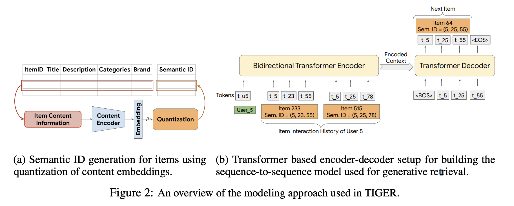
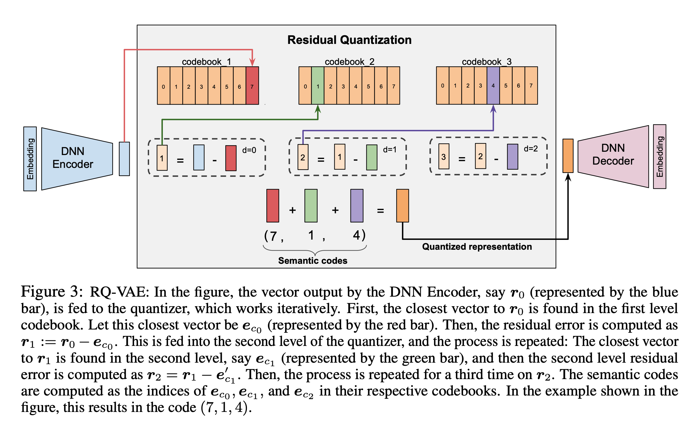
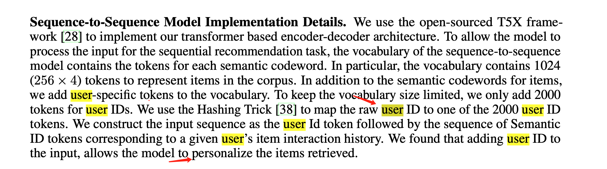
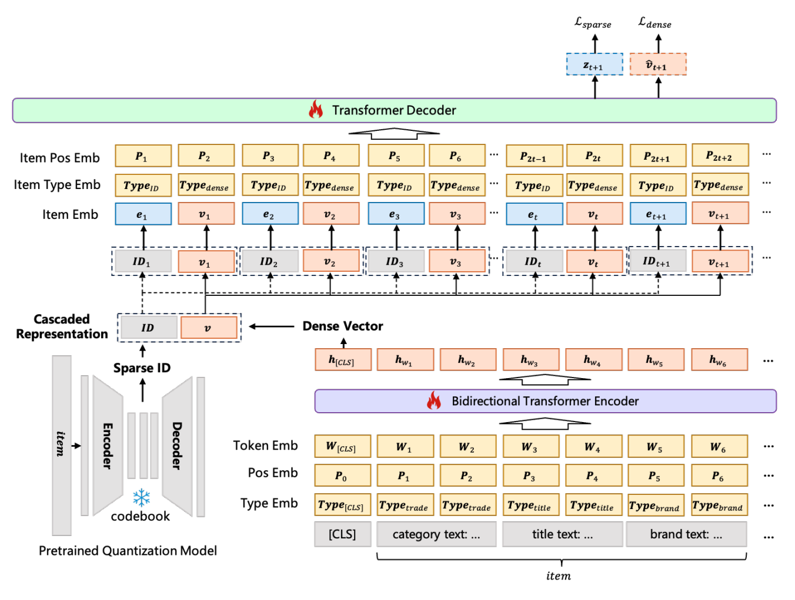
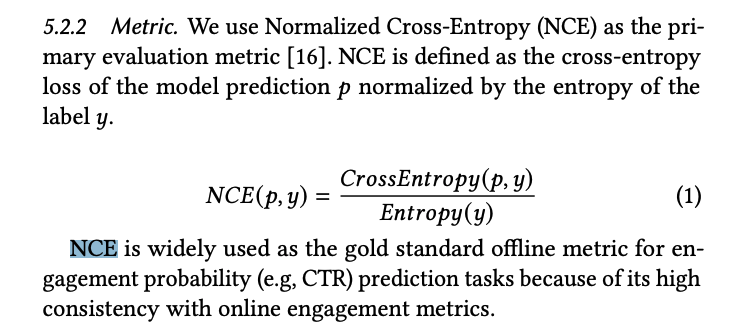
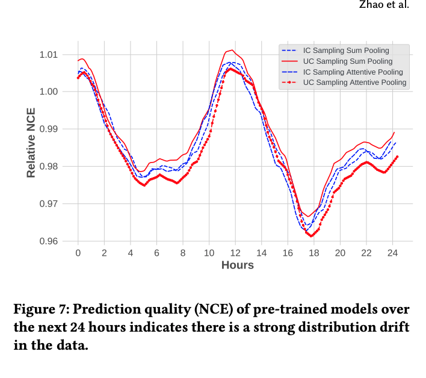
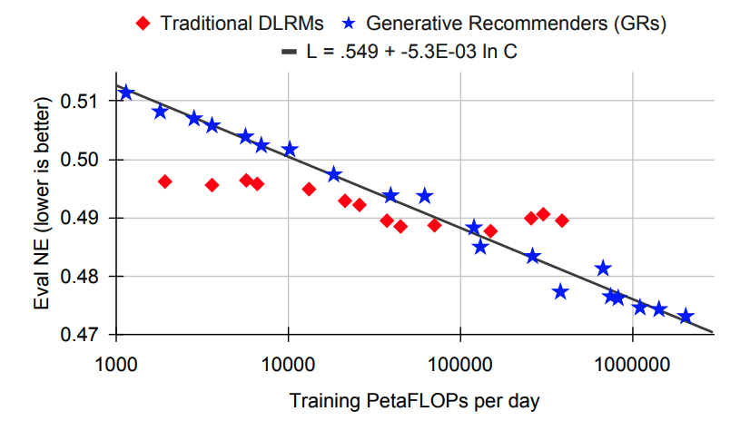
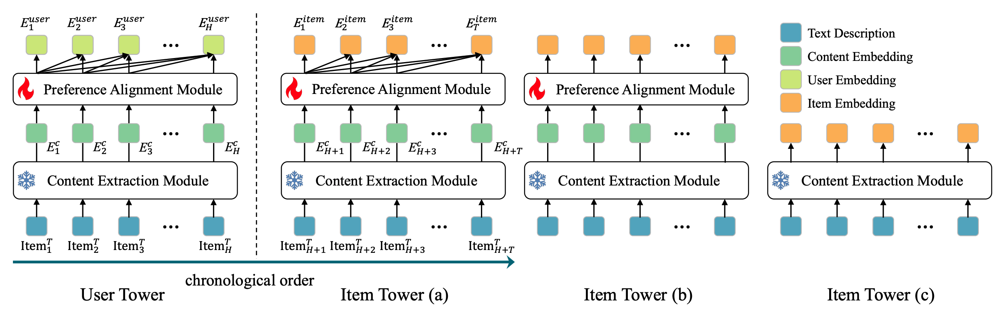
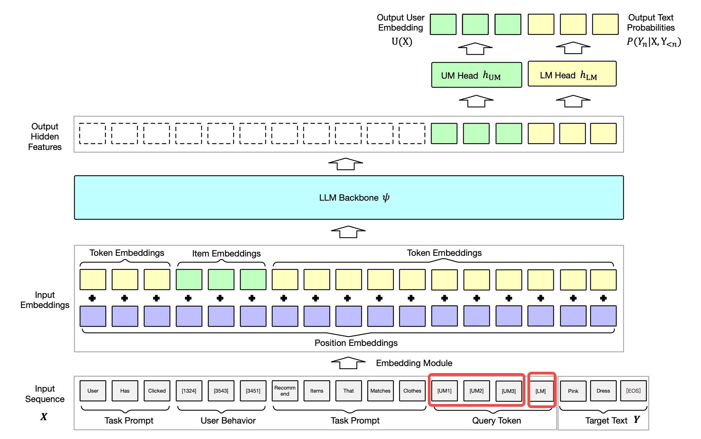
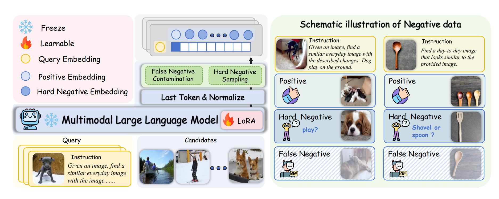

# LLM+推荐：概述


## 一些论文list

[https://github.com/nancheng58/Awesome-LLM4RS-Papers](https://github.com/nancheng58/Awesome-LLM4RS-Papers)

[A Survey on Large Language Models for Recommendation](https://arxiv.org/pdf/2305.19860.pdf)
[Recommender Systems in the Era of Large Language Models (LLMs)](https://arxiv.org/pdf/2307.02046.pdf)


中科大LDS实验室的tutorial：[XadC3O-large-language-models-for-recommendation-tutorial-slides.pdf](https://github.com/daiwk/collections/blob/master/assets/XadC3O-large-language-models-for-recommendation-tutorial-slides.pdf)

对应的datafun talk：[当"狂飙"的大模型撞上推荐系统](https://mp.weixin.qq.com/s/rBGq7rDMK5Vxad5qUmK3nw)

[大模型放进推荐系统怎么玩？微软亚研全面总结](https://mp.weixin.qq.com/s/x0qczJ8I8LZ_PyZw2HOI8A)

生成式推荐综述：

[Large Language Models for Generative Recommendation: A Survey and Visionary Discussions](https://arxiv.org/pdf/2309.01157.pdf)

[A Review of Modern Recommender Systems Using Generative Models (Gen-RecSys)](https://arxiv.org/pdf/2404.00579.pdf)

[大语言模型在推荐系统中的探索与应用](https://mp.weixin.qq.com/s/nEhynptVyx8aV8onCwozAA)

[一文梳理业界落地LLM4Rec的若干范式-数万字超长文(建议收藏)](https://mp.weixin.qq.com/s/jqFQH6ZYhZRrzilLAo9BiA)

[推荐算法月报(2025.2)：大模型的春风吹醒推荐算法，重磅大厂突破](https://mp.weixin.qq.com/s/NO2XgUBiRkjsKNo7dswa0w)

[推荐算法(2025.3.4)：速看！阿里Meta的最新研究成果](https://mp.weixin.qq.com/s/1kZCKYbuvd6qiE6-5hJquw)

[一文梳理业界落地LLM4Rec的若干范式-数万字超长文(建议收藏)](https://mp.weixin.qq.com/s/jqFQH6ZYhZRrzilLAo9BiA)

## 综述

### 概况

&nbsp;

[How Can Recommender Systems Benefit from Large Language Models: A Survey](https://arxiv.org/pdf/2306.05817v6) 基于这个组织

CRM(conventional recommendation models)


### where-LLM用于特征工程

&nbsp;

#### user-item level特征增强

&nbsp;

通过LLM的世界知识来获取更好的user/item表示

+ [Llama4rec](https://arxiv.org/pdf/2401.13870) ：prompt增强：在prompt里引入推荐模型的信息；数据增强：通过LLM给推荐模型增加样本；adaptive aggregation：llm和推荐模型各自打分并用融合公式融合
+ [KAR](https://arxiv.org/pdf/2306.10933)：让LLM总结item得到item emb；让LLM总结user历史得到user emb，两个emb过一个mmoe做融合得到新的两个emb，给推荐模型用
+ [SAGCN](https://arxiv.org/pdf/2312.16275)：通过LLM标识出用户对item的评论是属于哪些aspect的，然后u有A个emb，i也有A个emb，构建A个U-I图，然后揉在一起过GCN
+ [CUP](https://arxiv.org/pdf/2311.01314)：把用户的一堆历史评论扔给chatgpt，让它总结出128个token，然后丢给双塔bert，另一个塔是item的描述，freeze bert底层，只tune上层
+ [LLaMA-E](https://arxiv.org/pdf/2308.04913)：instruction formulating为写300个种子指令，让gpt作为teacher，对300个种子指令进行扩展，并由领域专家评估后，去重并保证质量，得到120k个指令作为训练集，再用lora去instruct tuning
+ [EcomGPT](https://arxiv.org/pdf/2308.06966v1)：设置一系列的task(100多个task)来finetune BLOOMZ，包括命名实体识别、描述生成、对话intent提取等

#### instance-level样本生成

&nbsp;

+ [GReaT](https://arxiv.org/pdf/2210.06280)：把表格化（tabular）数据转成自然语言，然后打乱顺序，自回归地finetune一个LLM，再拿tune完的LLM来合成（synthesize）逼真的（realistic）表格化数据
+ [ONCE](https://arxiv.org/pdf/2305.06566)：闭源LLM输出文本（user profiler、content summarizer、personalized content generator），给开源LLM得到user表示，item过开源LLM得到item表示，二者内积学ctr
+ [Agent4Rec](https://arxiv.org/pdf/2310.10108.pdf)：先训一个推荐模型，然后构建一个多智能体系统，模拟和这个推荐模型交互，产出新的样本给推荐模型做数据增强
+ [RecPrompt](https://arxiv.org/pdf/2312.10463)：给一个初始prompt，让LLM1得到推荐结果，拿一个monitor衡量这个结果和ground truth的mrr/ndcg，再用另一个LLM产出更好的prompt给第一个LLM用，如此迭代，得到一个best prompt
+ [PO4ISR]((https://arxiv.org/pdf/2312.07552))：给初始prompt，收集error case让模型反思原因并refine出新的prompt，再augment出另一个prompt，并UCB选出最好的prompt，如此迭代
+ [BEQUE](https://arxiv.org/pdf/2311.03758)：query重写任务，SFT得到一个LLM，将其预测的若干个候选rewrites通过offline system的feedback得到排序，再通过PRO算法再tune LLM。
+ [Agent4Ranking](https://arxiv.org/pdf/2312.15450)：query重写任务，多个人群当成多个agent，每个通过多轮对话产出一个rewrite，再合在一起经过bert+mmoe计算robust损失+accuracy损失。


### where-LLM作为特征编码器

&nbsp;

#### 表示增强

&nbsp;


#### 统一的跨域推荐

&nbsp;


### where-LLM 用于打分函数

&nbsp;

[Text Is All You Need: Learning Language Representations for Sequential Recommendation](https://arxiv.org/pdf/2305.13731) 亚马逊发的

[https://github.com/AaronHeee/RecFormer](https://github.com/AaronHeee/RecFormer)

### where-LLM用于流水线控制（pipeline controller）

&nbsp;


### how-tune LLM & infer with CRM

&nbsp;

### how-not tune LLM & infer w/o CRM

&nbsp;

### how-not tune LLM & infer with CRM

&nbsp;

### how-tune LLM & infer w/o CRM

&nbsp;


## llm vs ID

[推荐系统范式之争，LLM vs. ID？](https://mp.weixin.qq.com/s/7pQ891pnp_BM7qH7ROiWwg)

[Exploring the Upper Limits of Text-Based Collaborative Filtering Using Large Language Models: Discoveries and Insights](http://arxiv.org/abs/2305.11700)


[知乎的讨论](https://www.zhihu.com/question/630016669/answer/3380909598)

SIGIR2023 \| ID vs 模态: 推荐系统ID范式有望被颠覆？

[Where to Go Next for Recommender Systems? ID- vs. Modality-based Recommender Models Revisited](https://arxiv.org/abs/2303.13835)

[https://github.com/westlake-repl/IDvs.MoRec](https://github.com/westlake-repl/IDvs.MoRec)

[对应的ppt](https://github.com/westlake-repl/MicroLens/blob/master/MicroLens_DeepMind_Talk.pdf)


## 推荐生态系统

[Modeling Recommender Ecosystems: Research Challenges at the Intersection of Mechanism Design, Reinforcement Learning and Generative Models](https://storage.googleapis.com/gweb-research2023-media/pubtools/pdf/e00cc0ce4480c15339b7798943560ad1a0d593ce.pdf)

## 发现性

[Diversifying by Intent in Recommender Systems](https://arxiv.org/pdf/2405.12327)，涨了dau等指标


# LLM+推荐：生成索引

## DSI

参考知乎：[https://zhuanlan.zhihu.com/p/470182510](https://zhuanlan.zhihu.com/p/470182510)

[Transformer memory as a differentiable search index](https://proceedings.neurips.cc/paper_files/paper/2022/file/892840a6123b5ec99ebaab8be1530fba-Paper-Conference.pdf)，提出的可微搜索索引（differentiable search index, **DSI**），拆成两个阶段：

+ indexing：建立**文档**和**doc_id**的**一一映射**
+ retrieval：根据query生成候选doc_ids

与[Autoregressive Entity Retrieval](https://arxiv.org/pdf/2010.00904)提出的**受限beam search**的GENRE（代码[https://github.com/facebookresearch/GENRE](https://github.com/facebookresearch/GENRE)，解读[Transformer中PrefixConstrainedLogitsProcessor类的解读](https://zhuanlan.zhihu.com/p/494082642)）对比：

+ GENRE生成的目标是**有具体语义的实体名**
+ DSI生成的目标则是**无任何语义的任意doc_id**

### Indexing方法

&nbsp;

+ Inputs2Target：即doc_tokens->doc_id
+ Target2Inputs：即doc_id->doc_tokens
+ bidirectional：同时用上两面两个任务，并且在开始时加一个前缀，表明任务的方向
+ span corruption：参考T5（[Exploring the limits of transfer learning with a unified text-to-text transformer](https://arxiv.org/pdf/1910.10683.pdf)），将doc_id当做前缀和doc_tokens拼起来，2个好处：
    + 在索引时进行通用的预训练
    + 实现doc_id作为去噪目标和输入的平衡

### 文档的表示

&nbsp;

+ Direct Indexing：直接用文档的前L个单词当做文档的表示，并且保留单词的顺序。
+ Set Indexing：去掉文档中的重复的单词及停用词，然后和Direct Indexing一样的处理。
+ Inverted Index：随机对文档中的连续的k个单词（一个文档块）进行采样，并将它们与doc_id相关联

### doc_id的表示

&nbsp;

+ 非结构化的原子标识符：直接对所有的文档使用一个随机但互不相同的的整数标识。假设一共有N篇文档需要检索，假设原来解码器输出有V个单词，现在有V+N个单词。
+ 朴素的结构化字符串标识符：也使用一个随机的整数，但将这个整数当做一个字符串输出，用受限的beam search搜索前k个文档，因为需要保证**输出的是数字**。
+ 语义结构化的标识符：先用BERT产出每个doc的emb，然后**递归10-means**，第一次得到0-9作为第1个数字，第二次的0-9作为第2个数字，可以得到一个树，文档的最终标识符就是从根节点到当前结点的路径对应的编号组合。只要一个节点的文档数大于$$c=100$$，就继续分裂，当叶子的文档数小于c时，每个文档随机分配一个1到$$c-1$$的id，拼到doc_id的最后。

### 训练方法

&nbsp;

用seq2seq，即**teacher forcing+交叉熵**，有如下两种方式：

+ 先对indexing进行预训练（memorization），再进行**将query映射为docid**的微调
+ 用多任务的方式**同时进行**，两个任务用**不同的标识符**，这样做效果会好很多

后来有一篇[Bridging the Gap Between Indexing and Retrieval for Differentiable Search Index with Query Generation](https://arxiv.org/pdf/2206.10128.pdf)，对应的github：[https://github.com/ArvinZhuang/DSI-QG](https://github.com/ArvinZhuang/DSI-QG)，他也同时尝试复现DSI：[https://github.com/ArvinZhuang/DSI-transformers](https://github.com/ArvinZhuang/DSI-transformers)，主要有如下两个地方：

+ 准备数据，doc_id

```python
class IndexingTrainDataset(Dataset):
    def __init__(
            self,
            path_to_data,
            max_length: int,
            cache_dir: str,
            tokenizer: PreTrainedTokenizer,
    ):
        self.train_data = datasets.load_dataset(
            'json',
            data_files=path_to_data,
            ignore_verifications=False,
            cache_dir=cache_dir
        )['train']

        self.max_length = max_length
        self.tokenizer = tokenizer
        self.total_len = len(self.train_data)


    def __len__(self):
        return self.total_len

    def __getitem__(self, item):
        data = self.train_data[item]

        input_ids = self.tokenizer(data['text'],
                                   return_tensors="pt",
                                   truncation='only_first',
                                   max_length=self.max_length).input_ids[0]
        return input_ids, str(data['text_id'])


@dataclass
class IndexingCollator(DataCollatorWithPadding):
    def __call__(self, features):
        input_ids = [{'input_ids': x[0]} for x in features]
        docids = [x[1] for x in features]
        inputs = super().__call__(input_ids)

        # label是doc_id
        labels = self.tokenizer(
            docids, padding="longest", return_tensors="pt"
        ).input_ids

        # replace padding token id's of the labels by -100 
        # according to https://huggingface.co/docs/transformers/model_doc/t5#training
        labels[labels == self.tokenizer.pad_token_id] = -100
        inputs['labels'] = labels
        return inputs

```

+ 训练和预测

```python
class IndexingTrainer(Trainer):
    def __init__(self, restrict_decode_vocab, **kwds):
        super().__init__(**kwds)
        self.restrict_decode_vocab = restrict_decode_vocab

    def compute_loss(self, model, inputs, return_outputs=False):
        ## 输入文章，预测doc_id
        loss = model(input_ids=inputs['input_ids'], 
            attention_mask=inputs['attention_mask'], labels=inputs['labels']).loss
        if return_outputs:
            return loss, [None, None]  # fake outputs
        return loss

    def prediction_step(
            self,
            model: nn.Module,
            inputs: Dict[str, Union[torch.Tensor, Any]],
            prediction_loss_only: bool,
            ignore_keys: Optional[List[str]] = None,
    ) -> Tuple[Optional[torch.Tensor], Optional[torch.Tensor], Optional[torch.Tensor]]:
        model.eval()
        # eval_loss = super().prediction_step(model, inputs, True, ignore_keys)[0]
        with torch.no_grad():
            # greedy search
            doc_ids = model.generate(
                inputs['input_ids'].to(self.args.device),
                max_length=20,
                prefix_allowed_tokens_fn=self.restrict_decode_vocab,
                early_stopping=True,)
        return (None, doc_ids, inputs['labels'])
```

+ 对解码空间的限制：

```python
    # docid generation constrain, we only generate integer docids.
    SPIECE_UNDERLINE = "_"
    INT_TOKEN_IDS = []
    for token, id in tokenizer.get_vocab().items():
        if token[0] == SPIECE_UNDERLINE:
            if token[1:].isdigit():
                INT_TOKEN_IDS.append(id)
        if token == SPIECE_UNDERLINE:
            INT_TOKEN_IDS.append(id)
        elif token.isdigit():
            INT_TOKEN_IDS.append(id)
    INT_TOKEN_IDS.append(tokenizer.eos_token_id)

    def restrict_decode_vocab(batch_idx, prefix_beam):
        return INT_TOKEN_IDS
```

## vq-vae & rq-vae

### vq-vae

&nbsp;

[Neural discrete representation learning](https://proceedings.neurips.cc/paper_files/paper/2017/file/7a98af17e63a0ac09ce2e96d03992fbc-Paper.pdf)

[https://github.com/zalandoresearch/pytorch-vq-vae](https://github.com/zalandoresearch/pytorch-vq-vae)

用在推荐：

[Learning Vector-Quantized Item Representation for Transferable Sequential Recommenders](https://arxiv.org/pdf/2210.12316.pdf)

[https://github.com/RUCAIBox/VQ-Rec](https://github.com/RUCAIBox/VQ-Rec)

### rq-vae

&nbsp;

[Autoregressive Image Generation using Residual Quantization](https://arxiv.org/pdf/2203.01941.pdf)


## TIGER

[Recommender Systems with Generative Retrieval](https://arxiv.org/pdf/2305.05065.pdf)

序列推荐的一些paper：

+ [Session-based recommendations with recurrent neural networks](https://arxiv.org/pdf/1511.06939.pdf)：GRU4Rec首先把RNN用到推荐里
+ [Neural attentive session-based recommendation](https://arxiv.org/pdf/1711.04725.pdf)：提出NARM(Neural Attentive Session-based Recommendation)，在GRU里加了attention
+ [Next item recommendation with self-attention](https://arxiv.org/pdf/1808.06414.pdf)：AttRec在metric learning里引入了self-attention
+ [Self-attentive sequential recommendation](https://arxiv.org/pdf/1808.09781.pdf)：SASRec用了类似decoder-only的self-attention
+ [Bert4rec: Sequential recommendation with bidirectional encoder representations from transformer](https://arxiv.org/pdf/1904.06690.pdf)和[Transformers4rec: Bridging the gap between nlp and sequential/session-based recommendation](https://scontent-sjc3-1.xx.fbcdn.net/v/t39.8562-6/246721374_422204999475172_9039387325224382577_n.pdf?_nc_cat=104&ccb=1-7&_nc_sid=e280be&_nc_ohc=pSC1QwlGTzIAX-yb9Ax&_nc_ht=scontent-sjc3-1.xx&oh=00_AfApZwRSd9KDBf4b-uGHf3bSS_SsZoRqhYS-lJRZltT97A&oe=6606DDFA)用了Transformer以及相关的mask策略
+ [S3-rec: Self-supervised learning for sequential recommendation with mutual information maximization](https://arxiv.org/pdf/2008.07873.pdf)：在预训练阶段引入了4个自监督的task，4个MIMM(mutual information maximization)
  + item-attribute MIM
  + sequence-item MIM：sequence和被mask掉的一个item间
  + sequence-attribute MIM
  + sequence-sequence MIM：sequence和被mask掉的连续item构成的片段间


这些方法都是学习item的向量，然后用MIPS去ANN，而TIGER(Transformer Index for GEnerative Recommenders)则是生成式地直接预测item的语义id







rq-vae的介绍：[](https://arxiv.org/pdf/2306.08121)


原图里的下标有一些问题

+ $$x$$经过encoder得到的$$z$$（可以看成就是$$r_1$$），$$l=1$$，在第一个码本里ann找到最近的$$c_1=1$$，$$z-\boldsymbol{e}_{c_1}$$得到$$r_2$$
+ $$l=2$$，$$r_2$$在第2个码本里ann找到最近的$$c_2=4$$，$$r_2-\boldsymbol{e}_{c_2}$$得到$$r_3$$
+ $$l=3$$，$$r_3$$在第3个码本里ann找到最近的$$c_3=6$$，$$r_3-\boldsymbol{e}_{c_3}$$得到$$r_4$$
+ $$l=4$$，$$r_4$$在第4个码本里ann找到最近的$$c_4=2$$，$$r_4-\boldsymbol{e}_{c_4}$$得到$$r_5$$，
+ 对应的semantic id就是(1,4,6,2)，拿$$\hat {z} = 1+4+6+2$$再去过decoder得到$$\hat {x}$$

最终的loss：$$\mathcal{L}_{\text {recon }} + \mathcal{L}_{\text {rqvae }}$$：

+ $$\mathcal{L}_{\text {recon }}=\|\boldsymbol{x}-\hat{\boldsymbol{x}}\|^2$$
+ $$\mathcal{L}_{\text {rqvae }}=\sum_{l=1}^L \beta\left\|\boldsymbol{r}_l-\operatorname{sg}\left[\boldsymbol{e}_{c_l}\right]\right\|^2+\left\|\operatorname{sg}\left[\boldsymbol{r}_l\right]-\boldsymbol{e}_{c_l}\right\|^2$$，sg是stop gradient，这里原始的rq-vae是算的$$\mathcal{L}_{\text {commit }}=\sum_{d=1}^D\left\|\mathbf{Z}-\operatorname{sg}\left[\hat{\mathbf{Z}}^{(d)}\right]\right\|_2^2$$看来有点diff
+ 码本的emb通过moving average更新


rqvae的代码：[https://github.com/kakaobrain/rq-vae-transformer/blob/main/rqvae/models/rqvae/quantizations.py#L237](https://github.com/kakaobrain/rq-vae-transformer/blob/main/rqvae/models/rqvae/quantizations.py#L237)

+ VQ部分：

```python
class VQEmbedding(nn.Embedding):
    def compute_distances(self, inputs):
        codebook_t = self.weight[:-1, :].t()

        (embed_dim, _) = codebook_t.shape
        inputs_shape = inputs.shape
        assert inputs_shape[-1] == embed_dim

        inputs_flat = inputs.reshape(-1, embed_dim)
        # a^2
        inputs_norm_sq = inputs_flat.pow(2.).sum(dim=1, keepdim=True)
        # b^2
        codebook_t_norm_sq = codebook_t.pow(2.).sum(dim=0, keepdim=True)
        # (a-b)^2 = a^2 + b^2 - 2ab
        distances = torch.addmm(
            inputs_norm_sq + codebook_t_norm_sq,
            inputs_flat,
            codebook_t,
            alpha=-2.0,
        )
        distances = distances.reshape(*inputs_shape[:-1], -1)  # [B, h, w, n_embed or n_embed+1]
        return distances

    @torch.no_grad()
    def find_nearest_embedding(self, inputs):
        distances = self.compute_distances(inputs)  # [B, h, w, n_embed or n_embed+1]
        embed_idxs = distances.argmin(dim=-1)  # use padding index or not

        return embed_idxs

    @torch.no_grad()
    def _update_embedding(self):

        n_embed = self.weight.shape[0] - 1
        n = self.cluster_size_ema.sum()
        normalized_cluster_size = (
            n * (self.cluster_size_ema + self.eps) / (n + n_embed * self.eps)
        )
        self.weight[:-1, :] = self.embed_ema / normalized_cluster_size.reshape(-1, 1)

    def forward(self, inputs):
        embed_idxs = self.find_nearest_embedding(inputs)
        if self.training:
            if self.ema:
                self._update_buffers(inputs, embed_idxs)
        
        embeds = self.embed(embed_idxs)

        if self.ema and self.training:
            self._update_embedding()

        return embeds, embed_idxs
```

+ RQ部分

```python
class RQBottleneck(nn.Module):
    def __init__(...):
        codebooks = [VQEmbedding(self.n_embed[idx], 
                                    embed_dim, 
                                    decay=self.decay[idx], 
                                    restart_unused_codes=restart_unused_codes,
                                    ) for idx in range(self.code_shape[-1])]
        self.codebooks = nn.ModuleList(codebooks)
    def quantize(self, x):
        r"""
        Return list of quantized features and the selected codewords by the residual quantization.
        The code is selected by the residuals between x and quantized features by the previous codebooks.

        Arguments:
            x (Tensor): bottleneck feature maps to quantize.

        Returns:
            quant_list (list): list of sequentially aggregated and quantized feature maps by codebooks.
            codes (LongTensor): codewords index, corresponding to quants.

        Shape:
            - x: (B, h, w, embed_dim)
            - quant_list[i]: (B, h, w, embed_dim)
            - codes: (B, h, w, d)
        """
        B, h, w, embed_dim = x.shape

        residual_feature = x.detach().clone()

        quant_list = []
        code_list = []
        aggregated_quants = torch.zeros_like(x)
        for i in range(self.code_shape[-1]):
            quant, code = self.codebooks[i](residual_feature)
            # 就地操作，从residual_feature中减去quant的值，覆盖原来的值
            residual_feature.sub_(quant)
            aggregated_quants.add_(quant)

            quant_list.append(aggregated_quants.clone())
            code_list.append(code.unsqueeze(-1))
        
        codes = torch.cat(code_list, dim=-1)
        return quant_list, codes
    def forward(self, x):
        x_reshaped = self.to_code_shape(x)
        quant_list, codes = self.quantize(x_reshaped)

        commitment_loss = self.compute_commitment_loss(x_reshaped, quant_list)
        quants_trunc = self.to_latent_shape(quant_list[-1])
        quants_trunc = x + (quants_trunc - x).detach()

        return quants_trunc, commitment_loss, codes
    
    def compute_commitment_loss(self, x, quant_list):
        r"""
        Compute the commitment loss for the residual quantization.
        The loss is iteratively computed by aggregating quantized features.
        """
        loss_list = []
        
        for idx, quant in enumerate(quant_list):
            partial_loss = (x-quant.detach()).pow(2.0).mean()
            loss_list.append(partial_loss)
        
        commitment_loss = torch.mean(torch.stack(loss_list))
        return commitment_loss
```

## Tiger应用在排序

[Better Generalization with Semantic IDs: A Case Study in Ranking for Recommendations](https://arxiv.org/pdf/2306.08121)

[RecSys'24 | 谷歌:使用语义ID提升推荐系统ID Embed泛化性](https://mp.weixin.qq.com/s/PR8NuRWkK_4vuCrE9xD6Jg)

## meta提升id emb稳定性

[Meta广告:提出使用语义ID提升推荐系统ID Embed稳定性](https://mp.weixin.qq.com/s/DIF8ClTyN1y4ah98VR6asw)

[Enhancing Embedding Representation Stability in Recommendation Systems with Semantic ID](https://arxiv.org/pdf/2504.02137)


## 受限beam search相关

[Diverse Beam Search: Decoding Diverse Solutions from Neural Sequence Models](https://arxiv.org/abs/1610.02424)

[Autoregressive entity retrieval](https://arxiv.org/pdf/2010.00904)：代码：[https://github.com/facebookresearch/GENRE](https://github.com/facebookresearch/GENRE)

[Autoregressive Search Engines: Generating Substrings as Document Identifiers](https://arxiv.org/pdf/2204.10628)：例如一个item可以写成```<IDS> 1023 <IDE> Urban Decay Eyeshadow Palette Naked Heat <AS> Makeup <AE> <AS> Eyes <AE>```，并通过wavelet tree存储，给定开始token（如```<IDS>```或者```<AS>```），可以在$$O(Vlog(V))$$里找出所有可能的后续tokens。代码：[https://github.com/facebookresearch/SEAL](https://github.com/facebookresearch/SEAL)

## 百度的COBRA

[Sparse Meets Dense: Unified Generative Recommendations with Cascaded Sparse-Dense Representations](https://arxiv.org/abs/2503.02453)


和tiger很像，主要区别是除了原来rq的code，还加了个dense emb进去


rq部分freeze，dense是拿item的明文特征过一个bert得到的cls emb，bert是训练的

decode出来有两个东西，rq的code和dense


+ 先beam search出m个rq的code出来
+ 然后每一个code和原来的seq一起输入decoder，得到的pred就是dense，再拿这个dense去ann找n个item
+ 最后对这m*n个item拿两个相似度融合出一个得分，取topk出来

# LLM+推荐：输入ID

## 快手的RecGPT

[RecGPT: Generative Personalized Prompts for Sequential Recommendation via ChatGPT Training Paradigm](https://arxiv.org/pdf/2404.08675)

[https://zhuanlan.zhihu.com/p/699985083](https://zhuanlan.zhihu.com/p/699985083)

## Meta的HSTU（落地）

[如何评价Meta最新推荐论文: 生成式推荐打败深度分层架构推荐？](https://mp.weixin.qq.com/s/MeH2drBIBML5OSfCujIJ0Q)

[Actions Speak Louder than Words: Trillion-Parameter Sequential Transducers for Generative Recommendations](https://arxiv.org/pdf/2402.17152.pdf)

### 背景

&nbsp;

大规模推荐系统依赖高基数(high cardinality)、异质特性(heterogeneous features)，每天要处理上百亿用户行为数据。将推荐系统重新定义为生成模型框架内的序列转化任务，提出HSTU(Hierarchical Sequential Transduction Unit)，专为高基数、非稳态的流式推荐数据设计。

+ 在公开数据集比基线NDCG+65.8%
+ 在8192的序列长度上的处理速度比基于flash attention2的transformer快5.3-15.2倍。
+ 1.5万亿（1.5 trillion）参数，线上ab测试指标+12.4%

在[Breaking the curse of quality saturation with user-centric ranking](https://arxiv.org/pdf/2305.15333.pdf)中提到了NCE（normalized cross-entropy）指标：

$$
\operatorname{NCE}(p, y)=\frac{\operatorname{CrossEntropy}(p, y)}{\operatorname{Entropy}(y)}
$$



可以发现，对于一个预训练好的模型来说，随着时间的变化，NCE的变化是很剧烈的，即数据分布是会漂移的，并不像nlp/cv一样有ground truth，所以传统推荐模型其实很难达到比较好的scaling能力。



需要克服的3个挑战：

+ 推荐系统中的特征**缺少显式的结构**。序列建模（bert4rec、S3-rec等）在小规模数据集上效果不错，但工业界则需要**异构特征**（高基数的id、交叉特征、统计特征、历史点击率等）。
+ 推荐系统使用**十亿规模的动态词表**，而nlp用的是10w的静态词表，要对上万候选进行target-aware操作（din、Cold等），训练和推理的代价很高。
+ 大规模序列模型的计算成本是瓶颈。GPT-3在300B token的数据集上用上千个GPU训练1-2个月，而在推荐场景一天就有十亿级的活跃用户和十亿级的候选进行交互，用户序列在极端情况下有近10w（[Twin: Two- stage interest network for lifelong user behavior modeling in ctr prediction at kuaishou](https://arxiv.org/pdf/2302.02352.pdf)），所以推荐系统每天要处理的tokens数量甚至比语言模型1-2个月处理的数量要大几个数量级

本文将**用户action**看成一个新的模态，2个主要的insights：

+ 给定一个新的特征空间，核心的召回排序任务能被直接转换成生成式模型问题(序列直推任务，sequential transduction tasks)
+ 这种范式能够系统性地解决传统推荐中的特征冗余、计算冗余、推理冗余，提升效率

### Sequential Transduction Tasks

&nbsp;

transductive learning（直推式学习） vs inductive learning（归纳式学习）[https://www.zhihu.com/question/68275921/answer/529156908](https://www.zhihu.com/question/68275921/answer/529156908)：

+ 归纳式学习：训练只使用训练集，不使用测试集，训出的模型对测试集做预测，如监督学习。
+ 直推式学习：训练时使用训练集，还使用测试集的特征，但不使用测试集的label，

#### 异构特征的统一表示

&nbsp;

+ 稀疏特征：itemid、类目、城市、语言、社区等
    + 先选出**最长**的时间序列作为**主时间序列**，例如用户的交互序列。
    + 剩下的特征随时间变化较慢，如关注作者的属性。对于连续出现的片段（consecutive segment），**只保留最开始的入口**，这样对于主时间序列而言，并不会增加太多的序列长度。
+ 数值型特征：这里指的是序列特征里**每个item的统计特征**，比如用户在时刻t对某个item的ctr。直接删了，因为DIN里提到随着序列长度增加，**target-aware**的序列建模方式能够捕捉到这种数值性特征


假设用户消费了9个item，

+ 绿色的有7个时间步，全保留，作为主序列；
+ 蓝色的有7个时间步，但只有G0和G1两种取值，所以对于连续的G0只保留第0个(出现在t1)，扔到主序列的最前面去，连续的G1也只保留第0个（出现在t8），插到主序列最后一个的前面
+ 黄色的全是H0，第0个出现在t7，所以保留t7，往主序列t8前面插入
+ 将数值型特征替换为target-aware的cross attention得到causal-masked的特征
+ 通过t0、t1、t2（**包括t2**）的特征生成t2的样本，以此类推

#### 召回和排序的重定义

&nbsp;

输入token序列$$x_0, x_1, \ldots, x_{n-1}$$，输出的token序列$$y_0, y_1, \ldots, y_{n-1}$$是通过mask序列$$m_0, m_1, \ldots, m_{n-1}\left(m_i \in\{0,1\}\right)$$得到的。

token对应的动态、非稳态词表是$$\mathbb{X}$$，用户交互的内容是$$\mathbb{X}_c \subseteq \mathbb{X}$$

+ 召回：预估$$p\left(x_{i+1} \mid u_i\right)$$，通过时间步i的用户特征预估$$x_{i+1} \in \mathbb{X}_c$$，一般是直接选择$$\arg \max _{x \in \mathbb{X}_c} p\left(x \mid u_i\right)$$来最大化**特定的reward**，和标准的自回归有两个不同：
    + $$x_i,y_i$$的label并不一定是$$x_{i+1}$$，因为用户可以对$$x_{i+1}$$是负反馈
    + $$y_i$$可能是比如人口属性等（因为是merge的序列，可能把城市之类的merge进来当做一个时间步），这个时候$$y_i$$未定义的，要把它mask掉，即$$m_i=0$$
+ 排序：推荐中的排序需要在尽量早的阶段进行target-aware的交互，而标准的自回归这种交互往往比较迟，例如在encoder的输出才用上了softmax。因此，设计了一种**target-aware的cross-attention**
    + 把action和x穿插起来得到新序列$$x_0, a_0, x_1, a_1, \ldots, x_{n-1}, a_{n-1}$$
        + 对于action的位置，$$m_i=0$$
        + 对于content位置，使用一个小的nn将预估值转换成多任务的预估值（**感觉是输入0-n，第n项保留$$x_n$$，mask掉$$a_n$$，拿$$x_n$$去多目标地预估用户会用哪个action**）

#### 生成式训练

&nbsp;

假设用户$$i$$有$$n_i$$个token，那么训练的复杂度就是$$\sum_i n_i\left(n_i^2 d+n_i d_{f f} d\right)$$，其中：

+ $$n_i^2 d$$是self-attention的复杂度，通过flash attention可以达到$$O(n^2)$$
+ $$n_i d_{f f} d$$是FFN的复杂度
+ 因为要自回归地算，可以理解为batch_size也是$$n_i$$，加一个下三角的mask，所以在$$\sum$$里还要乘一个$$n_i$$

假设$$N=\max _i n_i$$，那复杂度就是$$O\left(N^3 d+N^2 d^2\right)$$，太巨大了

但其实可以发现（这段是自己的理解），假设序列长度9，要预测第4个的时候，4-9的输入是mask掉的，但他们还是要进行后面的attention+ffn计算，其实是很浪费资源的，所以如上面“**异构特征的统一表示**”小节的那个图（生成主序列和辅助序列）所示，该模型直接只吐出x=x1-x3,y=x4作为训练样本就行了，这样既省掉了4-9的无用计算，也更便于并行（相比不拆batch的自回归）

假设采样第$$i$$个用户的概率是$$s_u\left(n_i\right)$$，那么总的训练消耗就是

$$
\sum_i s_u\left(n_i\right) n_i\left(n_i^2 d+n_i d^2\right)
$$

如果设置$$s_u\left(n_i\right)=1/n_i$$，那消耗就降到了$$O\left(N^2 d+N d^2\right)$$。而在工业界中要实现这种采样其实很简单，在用户请求或者session结束的时候吐出训练样本就有$$\hat{s_u}\left(n_i\right) \propto 1 / n_i$$了

### 生成式推荐中的高性能自注意力编码器

&nbsp;


HSTU的单层包括3个部分：

$$
\text{pointwise\ projection:} U(X), V(X), Q(X), K(X)=\operatorname{Split}\left(\phi_1\left(f_1(X)\right)\right)
$$

$$
\text{spatial\ aggregation:} A(X) V(X)=\phi_2\left(Q(X) K(X)^T+\operatorname{rab}^{p, t}\right) V(X)
$$

$$
\text{pointwise\ transformation:} Y(X)=f_2(\operatorname{Norm}(A(X) V(X)) \odot U(X))
$$

其中，

+ $$f_i(x)$$是MLP，$$f_i(X)=W_i(X)+b_i$$
+ $$\phi_1$$和$$\phi_2$$是激活函数，都是SiLU([Sigmoid-weighted linear units for neural network function approximation in reinforcement learning](https://arxiv.org/pdf/1702.03118.pdf))，其实就是Swish，即$$f(x)=x \cdot sigmoid(x)$$
+ $${rab}^{p, t}$$是relative attention bias，考虑了位置$$p$$和时间$$t$$(参考T5论文，[Exploring the limits of transfer learning with a unified text-to-text transformer](https://arxiv.org/pdf/1910.10683.pdf))，其实是在[Self-attention with relative position representations](https://arxiv.org/pdf/1803.02155.pdf)一文提出的

对应到代码([https://github.com/facebookresearch/generative-recommenders/blob/main/modeling/sequential/hstu.py](https://github.com/facebookresearch/generative-recommenders/blob/main/modeling/sequential/hstu.py))里：

```python
self._linear_dim: int = linear_hidden_dim
self._uvqk = torch.nn.Parameter(
    torch.empty((embedding_dim, linear_hidden_dim * 2 * num_heads + 
        attention_dim * num_heads * 2)).normal_(mean=0, std=0.02),
)

##...

batched_mm_output = torch.mm(normed_x, self._uvqk)
if self._linear_activation == "silu":
    batched_mm_output = F.silu(batched_mm_output)
elif self._linear_activation == "none":
    batched_mm_output = batched_mm_output
# 其实就是先乘一个大矩阵，再拆成4份，等价于乘4个小矩阵
u, v, q, k = torch.split(
    batched_mm_output,
    [self._linear_dim * self._num_heads, self._linear_dim * self._num_heads, 
    self._attention_dim * self._num_heads, self._attention_dim * self._num_heads],
    dim=1,
)

if self._normalization == "rel_bias" or self._normalization == "hstu_rel_bias":
    if delta_x_offsets is not None:
        padded_q, padded_k = cached_q, cached_k
        flattened_offsets = delta_x_offsets[1] + torch.arange(start=0, end=B * n, 
            step=n, device=delta_x_offsets[1].device, dtype=delta_x_offsets[1].dtype)
        padded_q = padded_q.view(B * n, -1).index_copy_(
            dim=0, index=flattened_offsets, source=q,
        ).view(B, n, -1)
        padded_k = padded_k.view(B * n, -1).index_copy_(
            dim=0, index=flattened_offsets, source=k,
        ).view(B, n, -1)
    else:
        padded_q = torch.ops.fbgemm.jagged_to_padded_dense(
            values=q, offsets=[x_offsets], max_lengths=[n], padding_value=0.0
        )
        padded_k = torch.ops.fbgemm.jagged_to_padded_dense(
            values=k, offsets=[x_offsets], max_lengths=[n], padding_value=0.0
        )

    qk_attn = torch.einsum(
        "bnhd,bmhd->bhnm",
        padded_q.view(B, n, self._num_heads, self._attention_dim),
        padded_k.view(B, n, self._num_heads, self._attention_dim),
    )
    if all_timestamps is not None:
        qk_attn = qk_attn + self._rel_attn_bias(all_timestamps).unsqueeze(1)
    qk_attn = F.silu(qk_attn) / n
    qk_attn = qk_attn * invalid_attn_mask.unsqueeze(0).unsqueeze(0)
    attn_output = torch.ops.fbgemm.dense_to_jagged(
        torch.einsum(
            "bhnm,bmhd->bnhd",
            qk_attn,
            torch.ops.fbgemm.jagged_to_padded_dense(v, [x_offsets], [n]).\
                reshape(B, n, self._num_heads, self._linear_dim)
        ).reshape(B, n, self._num_heads * self._linear_dim),
        [x_offsets],
    )[0]

```

DLRM的3部分：

+ 特征抽取：常见的基础版本是离散特征pooling，高级版本是din。HSTU本来就能做这种target-aware的attention
+ 特征交互：常见的使用FMs、DCNv2、DHEN([DHEN: A Deep and Hierarchical Ensemble Network for Large-Scale Click-Through Rate Prediction](https://arxiv.org/pdf/2203.11014.pdf)，引入残差连接)。HSTU通过$$\operatorname{Norm}(A(X) V(X)) \odot U(X)$$来实现，将attention pooled后的结果直接和其他特征算element-wise product。
    + 这个做法受[Neural collaborative filtering vs. matrix factorization revisited](https://arxiv.org/pdf/2005.09683.pdf)和[Revisiting neural retrieval on accelerators](https://arxiv.org/pdf/2306.04039.pdf)的启发，用MLP来近似点积是很困难的。原因大概是nn需要调超参和足够的训练数据，在线算得又慢，而且本来内积效果就不错了，nn能带来的边际收益其实不明确。
    + 因为$$U(X)$$已经用过SiLU了，所以$$\operatorname{Norm}(A(X) V(X)) \odot U(X)$$可以看成是SwiGLU的变种（参考[Glu variants improve transformer](https://arxiv.org/pdf/2002.05202.pdf)），因为前面在对比LLM激活函数时讲了，$$\operatorname{SwiGLU}\left(\mathbf{x}_1, \mathbf{x}_2\right)=\operatorname{Swish}\left(\mathbf{x}_1\right) \odot \mathbf{x}_2$$
+ 表示转换：常见的如MoE、PLE等，主要思想就是对不同人群用特定的子网络。HSTU里的element-wise product也能达到MoE中的门控操作，只是可能有一个正则化因子的区别。

其实就是原来一般会拆成attention+ffn，而它这3个公式，前两个是attention，第3个就是attention求个norm，然后过一个swiglu的ffn，还有一点，这里的$$U(x)$$是过attention之前的，感觉起到了类似resnet的作用


#### pointwise聚合的注意力

&nbsp;

用的是pointwise聚合的注意力，而不是transformer里的softmax，主要有如下两点考虑：

+ 推荐中item的**强度**信息很重要，softmax会让这种强度失真，导致在预估（如时长）不准；如果只需要预估序，那其实softmax也可以，但推荐要**同时预估序和值**，所以要删掉softmax。
+ 虽然softmax对噪声有鲁棒性，但不太适用于流式setting下的非稳态词表。做了一个模拟流式数据的实验，发现只去掉relative attention bias比relative attention bias并加上softmax会好得多

| Architecture              | HR @10 | HR @50 |
|---------------------------|--------|--------|
| Transformers              | .0442  | .2025  |
| HSTU ($$-rab^{p,t}$$, Softmax) | .0617  | .2496  |
| HSTU ($$-rab^{p,t}$$)          | .0893  | .3170  |

#### 增加稀疏性

&nbsp;

使用了一种高效的attention kernel的GPU算子，类似FlashAttention，能够将**融合连续的矩阵操作**（fuse back-to-back GEMMs），但能够
进行fully raggified（可能是不规则，即序列长度可变的？？）的attention计算，本质是将attention计算转换为**不同大小的分组GEMMs**。因此，HSTU变成了memory-bound，并且能够以$$\Theta\left(\sum_i n_i^2 d_{q k}^2 R^{-1}\right)$$进行scale，其中，$$n_i$$是样本$$i$$的序列长度，$$d_{qk}$$是attention的维度，$$R$$是寄存器的大小。

受[Deep networks with stochastic depth]()启发，提出了SL(stochastic length)来增加用户历史序列的稀疏性，推荐系统中的用户行为往往有周期性，并且以不同形式呈现，因此引入稀疏性可以在效果不怎么损失的情况下显著减少encoder的代价，可以scale为$$\Theta\left(\sum_i n_i^2\right)$$

定义$$\Gamma(n, L)$$为一个函数，从原序列$$x_0, \ldots, x_{n-1}$$中选出长度为$$L$$的子序列，具体方案如下：

$$
\begin{aligned}
& x_0, \ldots, x_{n_i-1} \text { if } n_i \leq N^{\alpha / 2} \\
& \Gamma\left(n_i, N^{\alpha / 2}\right) \text { if } n_i>N^{\alpha / 2}, \text { w/ probability } 1-N^\alpha / n_i^2 \\
& x_0, \ldots, x_{n_i-1} \text { if } n_i>N^{\alpha / 2}, \text { w/ probability } N^\alpha / n_i^2 \\
&
\end{aligned}
$$

即：

+ $$n_i \leq N^{\alpha / 2}$$时，保留原始序列
+ $$n_i>N^{\alpha / 2}$$时，有$$N^\alpha / n_i^2 < 1$$：
    + 以$$1-N^\alpha / n_i^2$$的概率只保留$$N^{\alpha / 2}$$长度的子序列
    + 以$$N^\alpha / n_i^2$$的概率保留原始序列

对于$$\alpha \in(1,2]$$，原来的attention相关的复杂度是$$O\left(N^2 d\right)$$，现在可以降低到$$O\left({N^{\alpha /2}}^2 d\right)=O\left(N^\alpha d\right)$$。

其中的$$\Gamma(n, L)$$经过离线实验（原文附录D里），采用了feature-weighted sampler，即以$$1-f_{n, i} /\left(\sum_{j=1}^L f_{j, i}\right)$$的概率进行采样，其中$$f_i=t_n-t_i$$表示用户和item $$x_i$$交互的时间和当前的时间差。

对稀疏性的改善如下，其中稀疏性指的是$$1-avg\_seq\_len/max\_seq\_len$$，越大表示短序列越多，即越稀疏($$\alpha=2$$表示不SL，即直接使用原序列)：

| Alpha ($$\alpha$$) | seq_len=1,024 | seq_len=2,048 | seq_len=4,096 | seq_len=8,192 |
|-----------|-------|-------|-------|-------|
| 1.6       | 71.5% | 76.1% | 80.5% | 84.4% |
| 1.7       | 56.1% | 63.6% | 69.8% | 75.6% |
| 1.8       | 40.2% | 45.3% | 54.1% | 66.4% |
| 1.9       | 17.2% | 21.0% | 36.3% | 64.1% |
| 2.0       | 3.1%  | 6.6%  | 29.1% | 64.1% |

#### 最小化激活值的内存使用

&nbsp;

在推荐系统中，**大的batchsize**很重要：

+ 训练吞吐：[Software-hardware co-design for fast and scalable training of deep learning recommendation model](https://arxiv.org/pdf/2104.05158.pdf)一文说的
+ 模型质量：[Mixed negative sampling for learning two-tower neural networks in recommendations](https://storage.googleapis.com/gweb-research2023-media/pubtools/pdf/b9f4e78a8830fe5afcf2f0452862fb3c0d6584ea.pdf)、[A simple framework for contrastive learning of visual representations](https://proceedings.mlr.press/v119/chen20j/chen20j.pdf)和[Revisiting neural retrieval on accelerators](https://arxiv.org/pdf/2306.04039.pdf)

因此激活函数的内存占用就成为了主要的scaling瓶颈，这一点和llm不一样，llm一般是用小batchsize，并且内存主要由网络参数占据。HSTU设计了如下方式来减少激活函数的内存占用：

+ 把attention外的linear layers从6减小到2，同时使用elementwise gating来降低MLP的计算（[Transformer Quality in Linear Time](https://arxiv.org/pdf/2202.10447.pdf)和[Efficiently modeling long sequences with structured state spaces](https://arxiv.org/pdf/2111.00396.pdf)）。第一篇对应的结构如下：


假设$$d$$是embed size，$$h$$是head数，$$d_{q k}$$是attention的dim，$$d_{ff}$$是ffn的hidden size，

+ 将一些计算融合成一个op，包括$$\phi_1\left(f_1(\cdot)\right)$$、layer_norm、optional dropout和输出MLP，将每一层的激活的内存占用减小到了$$2 d+2 d+4 h d_{q k}+4 h d_v+2 h d_v=14 d$$（以bf16计算，一个参数2字节）---没懂

自己的理解：layer_norm要存均值+方差，所以要$$2d\times 2bytes$$，所以上面式子就是，U($$2d$$)，V($$2d$$)，Q和K($$4hd_{qk}$$)，QKV的norm(因为有均值和方差，所以是$$4hd_v$$)，QKV($$2hd_v$$)

对比transformer，在attention后用了ffn和dropout，假设中间状态是$$3hd_v$$，那么ffn包括layer_norm、linear、激活、linear、dropout，中间状态占用的就是$$2 d+4 d_{f f}+2 d+1 d=4 d+4 d_{f f}$$，一般来说，$$h d_v \geq d$$，$$d_{f f}=4 d$$，

自己的理解：输入x($$2d$$)，linear($$2d_{ff}$$)，linear($$2d$$)，dropout(约等于$$1d$$)，layernorm一般是发生在最开始吧，所以应该是第一个$$2d$$改成$$4d$$吧，感觉不是在linear那里变成$$4d_{ff}$$。。

然后，加上输入的input和input的layer_norm($$4d$$)，和qkv的映射，总的激活状态是$$33d$$---没懂

所以HSTU的设计能够让scaling达到大于两倍的更深的layers(14d vs 33d)

此外，词表中的id占用了极大的内存，对于10b的词表，512维的emb，Adam优化器，用fp32来存储emb和优化器状态要60TB的内存，因此，

+ 使用**row-wise的AdamW**优化器（[Training highly multiclass classifiers](https://www.jmlr.org/papers/volume15/gupta14a/gupta14a.pdf)和[FBGEMM: Enabling High-Performance Low-Precision Deep Learning Inference](https://arxiv.org/pdf/2101.05615.pdf)）
+ 将优化器状态存在DRAM里，从而每一个float在HBM的占用从12bytes降低到2bytes

#### cost-amortization(摊销)的预估scale up 

&nbsp;

对于召回来说，已经有很多加速方法了，例如MIPS的ANN加速，或者OTM等的beam search方法。

对于排序而言，提出了M-FALCON(Microbatched-Fast Attention Leveraging Cacheable OperatioNs)，用于对$$m$$个候选，序列长度为$$n$$的输入进行预估

+ 并行计算$$b_m$$个候选，修改attention masks和$$rab^{p,t}$$ bias，使得这$$b_m$$个候选的attention操作是完全一样的。从而将cross-attention的计算从$$O\left(b_m n^2 d\right)$$缩减到了$$O\left(\left(n+b_m\right)^2 d\right)=O(n^2d)$$，因为$$b_m$$相比$$n$$要小得多
+ (可选)将$$m$$个候选分成$$\left\lceil m / b_m\right\rceil$$个microbatches，每个batch有$$b_m$$个候选，从而在如下两个场合利用KV caching([Efficiently scaling transformer inference](https://arxiv.org/pdf/2211.05102.pdf))：
    + 前向pass中，用于降低消耗
    + requests之间，降低长尾耗时

#### 其他

&nbsp;

发现了scaling-law：



## 快手的OneRec（听说比较扯淡）

[OneRec: Unifying Retrieve and Rank with Generative Recommender and Preference Alignment](https://arxiv.org/pdf/2502.18965)

[「快手」全链路统一建模｜OneRec: Unifying Retrieve and Rank with Generative](https://mp.weixin.qq.com/s/wTEWnSe8aFaPiLsnoIeOSA)

召回排序合为一体的生成式推荐——根据历史session序列，预测下一个session。

## 阿里的HeteroRec（落地）

[Hierarchical Causal Transformer with Heterogeneous Information for Expandable Sequential Recommendation](https://arxiv.org/pdf/2503.01469)

item有各种特征，如title、img、id等

+ 左边：异构信息分解（HTFL）把1-T个item的各种特征（每个特征当成一个token）flatten成一个长序列，然后过一个causal transformer得到token粒度的输出list，再过一个item粒度的causal transformer得到item粒度的输出list
+ 右边：$$2 \sim T+1$$个item，每一种特征把$$2 \sim T+1$$拼到一起过各自的tower，每个tower得到的感觉还是$$2 \sim T+1$$个输出，这个输出和左边的token粒度的输出List算个LMP，然后过一个item cross tower，我猜输出的是$$2 \sim T+1$$个item表示，和左边的item粒度输出List再算一个LMP
+ LMP：左边是$$1 \sim T$$，右边是$$2 \sim T+1$$，t1过个mlp预测t3，t1过另一个MLP预测t2，即multi-step预估


## Meta的DTI（没落地）

[Towards An Efficient LLM Training Paradigm for CTR Prediction](https://arxiv.org/pdf/2503.01001)


。。好像没啥，就是预测未来k个，并且设计了滑动窗口的mask（右下角）

## 华为的UniGRF（没落地）

[Killing Two Birds with One Stone: Unifying Retrieval and Ranking with a Single Generative Recommendation Model](https://arxiv.org/pdf/2504.16454)

[sigir‘25「华为」统一召回+排序框架](https://mp.weixin.qq.com/s/eKU_AlffGR1Lx_wQspuLpQ?poc_token=HEPlGGijUUqAuU1VTCkeSPkWDfZG99B1eN5xtLkh)

## 美团的MTGR（落地）

[MTGR：美团外卖生成式推荐Scaling Law落地实践](https://mp.weixin.qq.com/s/JiDOqD-ThU0Upp6xnNg3Nw)

[推荐算法(2025.5.29)：美团的生成式推荐落地方案](https://mp.weixin.qq.com/s/hQrLSInDnrO5kgCW8I6gCQ)

[MTGR: Industrial-Scale Generative Recommendation Framework in Meituan](https://www.arxiv.org/pdf/2505.18654v2)

听说是替换了精排

## 阿里的SORT-Gen（落地）

[sigir'25「淘宝」多目标重排｜A Generative Re-ranking Model for List-level](https://mp.weixin.qq.com/s/b0PdyR4bFUXhLj9dToBK5A)

[A Generative Re-ranking Model for List-level Multi-objective Optimization at Taobao](https://arxiv.org/pdf/2505.07197)

将用户的所有行为聚合成一条样本。每个行为包括四个方面：用户侧、位置、商品侧、精排打分，将行为序列送入tansformer中。

保序回归损失

生成方法：先设计不同的rankscore得到多路序列候选，再比较每一路的top1，决定召回哪一路。

纯价值驱动的列表生成可能有同质化的风险，导致多样性降低。引入相似度惩罚：

## 小红书的RankGPT（落地）

[小红书RankGPT:推荐系统生成式精排的落地实践](https://mp.weixin.qq.com/s/2D31iyO07DNdTBPdHp-3Qw)

[Towards Large-scale Generative Ranking](https://arxiv.org/abs/2505.04180)

## 美团的UniROM（落地）

[美团UniROM:广告End2End全链路生成式建模范式](https://mp.weixin.qq.com/s/GfuxMwprP5TVSUTBl7Wc6w)

[One Model to Rank Them All: Unifying Online Advertising with End-to-End Learning](https://arxiv.org/abs/2505.19755)


# LLM+推荐：输入文本

## 华为的KAR（落地）

[Towards Open-World Recommendation with Knowledge Augmentation from Large Language Models](https://arxiv.org/pdf/2306.10933)


+ LLM生成user侧的preference reasoning知识
+ LLM生成item侧的factual知识
+ 这两部分知识输入一个encoder得到两个表示，然后再过个mmoe产出merge后reasoning augmented vec和fact augmented vec，一起作为CRM的输入特征。

对应的prompt如下：


看实验应该是用在召回，每个user和vec去找最像的k个item，但没法ann，只能暴力算

代码：[https://github.com/YunjiaXi/Open-World-Knowledge-Augmented-Recommendation/blob/main/knowledge_encoding/utils.py](https://github.com/YunjiaXi/Open-World-Knowledge-Augmented-Recommendation/blob/main/knowledge_encoding/utils.py)，其实就是把模型输出的hidden states处理一下：

```python

x = tokenizer(x, padding=True, truncation=True, max_length=512, return_tensors="pt",
                return_attention_mask=True).to(device)
mask = x['attention_mask']
outputs = model(**x, output_hidden_states=True, return_dict=True)
pred = get_paragraph_representation(outputs, mask, aggregate_type)
def get_paragraph_representation(outputs, mask, pooler='cls', dim=1):
    last_hidden = outputs.last_hidden_state
    hidden_states = outputs.hidden_states

    # Apply different poolers

    if pooler == 'cls':
        # There is a linear+activation layer after CLS representation
        return outputs.pooler_output.cpu()  # chatglm不能用，用于bert
    elif pooler == 'cls_before_pooler':
        return last_hidden[:, 0].cpu()
    elif pooler == "avg":
        return ((last_hidden * mask.unsqueeze(-1)).sum(dim) / mask.sum(dim).unsqueeze(-1)).cpu()
    elif pooler == "avg_first_last":
        first_hidden = hidden_states[1]
        last_hidden = hidden_states[-1]
        pooled_result = ((first_hidden + last_hidden) / 2.0 * mask.unsqueeze(-1)).sum(dim) / mask.sum(dim).unsqueeze(-1)
        return pooled_result.cpu()
    elif pooler == "avg_top2":
        second_last_hidden = hidden_states[-2]
        last_hidden = hidden_states[-1]
        pooled_result = ((last_hidden + second_last_hidden) / 2.0 * mask.unsqueeze(-1)).sum(dim) / mask.sum(dim).unsqueeze(-1)
        return pooled_result.cpu()
    elif pooler == 'len_last':  # 根据padding方式last方式也不一样
        lens = mask.unsqueeze(-1).sum(dim)
        # index = torch.arange(last_hidden.shape[0])
        # print(index)
        pooled_result = [last_hidden[i, lens[i] - 1, :] for i in range(last_hidden.shape[0])]
        pooled_result = torch.concat(pooled_result, dim=0)
        return pooled_result.cpu()
    elif pooler == 'last':
        if dim == 0:
            return last_hidden[-1, :, :]
        else:
            return last_hidden[:, -1, :]
    elif pooler == 'wavg':
        # Get weights of shape [bs, seq_len, hid_dim]
        weights = (
            torch.arange(start=1, end=last_hidden.shape[1] + 1)
            .unsqueeze(0)
            .unsqueeze(-1)
            .expand(last_hidden.size())
            .float().to(last_hidden.device)
        )

        # Get attn mask of shape [bs, seq_len, hid_dim]
        input_mask_expanded = (
            mask
            .unsqueeze(-1)
            .expand(last_hidden.size())
            .float()
        )

        # Perform weighted mean pooling across seq_len: bs, seq_len, hidden_dim -> bs, hidden_dim
        sum_embeddings = torch.sum(last_hidden * input_mask_expanded * weights, dim=dim)
        sum_mask = torch.sum(input_mask_expanded * weights, dim=dim)

        pooled_result = sum_embeddings / sum_mask
        return pooled_result.cpu()
    else:
        raise NotImplementedError
```

## 蚂蚁的BAHE（落地）

[SIGIR'24 \| 打破长度障碍：LLM增强的长文本用户行为CTR预测](https://mp.weixin.qq.com/s/h0p1QrapTGxOonccxNVNuQ)

[Breaking the Length Barrier: LLM-Enhanced CTR Prediction in Long Textual User Behaviors](https://arxiv.org/pdf/2403.19347)


+ 防止由于重复编码相同用户行为而产生的计算冗余：利用LLMs的预训练浅层提取来自用户序列的最细粒度的原子用户行为(例如购买星巴克、订酒店)的emb，并将它们存储在离线数据库中
+ 从db里查出来，和item一起过LLMs的更深层可训练层


## 快手的LEARN（落地）

[快手广告领域的大模型技术探索与实践](https://mp.weixin.qq.com/s/9VmOb3q4enWhqqJ_f7jnFA)

[https://zhuanlan.zhihu.com/p/705497209](https://zhuanlan.zhihu.com/p/705497209)

[Knowledge Adaptation from Large Language Model to Recommendation for Practical Industrial Application](https://arxiv.org/pdf/2405.03988)

过往的llm+推荐的两种思路：

+ freeze LLM参数并适应推荐领域数据：将用户行为历史改写成文本prompt，直接丢给LLM生成top-k推荐结果，例如：
  + [Chat-rec: Towards interactive and explainable llms-augmented recommender system](https://arxiv.org/pdf/2303.14524)
  + [Large Language Models are Zero-Shot Rankers for Recommender Systems](https://arxiv.org/pdf/2305.08845v2)
  + [Is ChatGPT a Good Recommender? A Preliminary Study](https://arxiv.org/pdf/2304.10149)
  + [LLM-Rec: Personalized Recommendation via Prompting Large Language Models](https://arxiv.org/pdf/2307.15780)
  + [Large Language Models are Competitive Near Cold-start Recommenders for Language- and Item-based Preferences](https://arxiv.org/pdf/2307.14225)
  + [Is ChatGPT Fair for Recommendation? Evaluating Fairness in Large Language Model Recommendation](https://arxiv.org/pdf/2305.07609)
+ 在推荐领域的特定文本数据集上微调LLM：利用LLM捕捉用户行为序列，通过设计提示prompt，使LLM学习用户和物品之间的潜在关系，在预测任务中理解用户的偏好变化和行为模式，从而更好地预测用户可能感兴趣的物品，例如：
  + [A Bi-Step Grounding Paradigm for Large Language Models in Recommendation Systems](https://arxiv.org/pdf/2308.08434)
  + [Tallrec: An effective and efficient tuning framework to align large language model with recommendation](https://arxiv.org/pdf/2305.00447)
  + [Llara: Aligning large language models with sequential recommenders](https://arxiv.org/pdf/2312.02445)
  + [ReLLa: Retrieval-enhanced Large Language Models for Lifelong Sequential Behavior Comprehension in Recommendation](https://arxiv.org/pdf/2308.11131)
  + [Where to Go Next for Recommender Systems? ID- vs. Modality-based Recommender Models Revisited](https://arxiv.org/abs/2303.13835)

上面两种方法可以看成是Rec-to-LLM，即将推荐这个target domain适配到LLM这个source domain上去，有如下缺点：

+ 将用户历史全丢给LLM不现实：一方面开源的LLM目前只支持1k(baichuan)-4k(llama)，不支持这么长的序列，另一方面复杂度和序列长度呈二次关系
+ 微调的方案可能会出现灾难性遗忘(catastrophic forgetting)：全参数微调，会让模型**丢失在预训练过程中学到的开放世界的知识**，而LoRA的效果也不好。原因：
  + domain gap：两个领域有巨大的差别(profound gap)，[Continual Learning of Large Language Models: A Comprehensive Survey](https://arxiv.org/pdf/2404.16789)发现了全量参数微调会导致LLM对原有知识domain的严重的灾难性遗忘。
  + 训练目标不对齐（misalignment）：LLM是next token prediction，学习大语料的general知识；finetune则主要是检索类的任务，强依赖用户-item的交互行为

其实有rec-to-llm和llm-to-rec两类想法


快手商业化把llm用到推荐的思路变化：


本文提出了LEARN(Llm-driven knowlEdge Adaptive RecommeNdation)，实现了LLM-to-Rec，让LLM作为content extractor，推荐任务是训练目标。


+ Content EXtraction(CEX)：输入item描述，过预训练的LLM（参数freeze）得到的每个token的输出pooling得到item的emb $$E^c$$
+ Preference ALignment(PAL)：把$$H$$个$$E^c$$输入一个content adapter(就是一个MLP)，然后过12层的可训练的transformer得到$$H$$个输出emb，最后再过一个online projection(也是一个MLP)降维到64，得到$$E^{user}$$



假设用户点击了H+T个item，拆成1~H和H+1~H+T这两部分，

+ user tower：1~H的item输入CEX+PAL，得到H个输出
+ item tower：有3个，结构都是输入H+1~H+T的item，网络参数和user tower共享；infer时只输入一个item
    + item tower a：经过CEX得到$$E^c$$，再经过PAL得到$$E^{item}$$，和user tower一样用causal attention
    + item tower b：经过CEX得到$$E^c$$，再经过PAL得到$$E^{item}$$，使用self-attention，每个item只关注自己
    + item tower c：只经过CEX，直接得到$$E^{item}$$

消融后发现item tower a效果最好，所以用了a

loss用的是pinnerformer的dense all action loss（[PinnerFormer: Sequence Modeling for User Representation at Pinterest](https://arxiv.org/pdf/2205.04507)），即从```1~H```里随机挑m个出来，每一个去预估```H+1~H+T```里的随机一个正样本


在线使用时如下图，其中user emb和item emb就是两个tower的输出，会先concat并过个小fusion module得到fusion emb，然后一方面过个mlp算个cvr loss，另一方面和user emb、item emb还有其他特征concat再送给后面的模块正常算ranking loss


## 阿里的BEQUE（落地）

[LLM落地淘宝电商搜索场景，显著提升长尾query改写效果](https://mp.weixin.qq.com/s/GmogjAHt0Hrwd8RmtOqS7A)

[Large Language Model based Long-tail Query Rewriting in Taobao Search](https://arxiv.org/pdf/2311.03758) WWW24


+ multi-instructions的sft：基于在线日志，通过拒绝采样得到multi-instrunctions的SFT数据集，任务是重写query，还混合了质量分类、query改正、CoT任务

其中的3个task如下：

| Task | Prompt Example |
|---------------------|---------------------|
| Quality Classification | Is this a good e-commerce query rewrite? <br> Query: {query} <br> Rewrite: {rewrite} <br> System: {Yes or No}  |
| Title Prediction | Please generate product titles that match input query <br> Query: {query} <br> System: {product title}  |
| Chain of Thought | Your task is to rewrite the input query into a query that makes it easier to search for related products, and you are required to give the thought process and then the query rewriting result. The thought process and the query rewriting result are separated by a semicolon. <br> Query: {query} <br> System: {CoT}; {Rewrite} |

+ offline feedback：用训好的LLM生成多个候选rewrites，构建了一个离线的淘宝系统，对这些候选rewrites进行搜索得到结果，并用结果的quality scores来对候选rewrites进行排序
+ objective alignment：基于候选的rewrites的排序，使用PRO方法（[Preference ranking optimization for human alignment](https://arxiv.org/pdf/2306.17492)）来逼近这个排序。

给定顺序$$y_1>y_2$$，preference probability如下，其中$$r(\cdot)$$是reward函数：

$$
P_{B T}=\frac{\exp \left(r\left(y_1, x\right)\right)}{\exp \left(r\left(y_1, x\right)\right)+\exp \left(r\left(y_2, x\right)\right)}
$$

对应的PRO loss如下，$$\mathcal{T}_k^i=1 /\left(r\left(y_k\right)-r\left(y_i\right)\right)$$，$$\mathcal{T}_k^k=\min _{i>k}\left(\mathcal{T}_k^i\right)$$：

$$
\mathcal{L}_{P R O}(\theta)=-\mathrm{E}_{(x, y) \sim \mathcal{D}_{P R O}} \sum_{k=1}^{n-1} \log \frac{\exp \left(\frac{\pi_{P R O}\left(y_k \mid x ; \theta\right)}{\mathcal{T}_k^k}\right)}{\sum_{i=k}^n \exp \left(\frac{\pi_{P R O}\left(y_i \mid x ; \theta\right)}{\mathcal{T}_k^i}\right)}
$$

应用：离线刷库，实验的gmv、单量都有收益，长尾query效果更好

## 小红书的NoteLLM（落地）

[WWW'24 | 小红书NoteLLM: 大语言模型用于I2I笔记推荐](https://mp.weixin.qq.com/s/jcj4jKaEIg-L264uZgYuAw)

[NoteLLM: A Retrievable Large Language Model for Note Recommendation](https://arxiv.org/pdf/2403.01744)

3个任务：

+ I2I笔记推荐任务: 给定目标笔记，基于LLM从内容池中找出top-k个相似笔记
+ 主题标签生成任务：基于笔记的标题和内容, 用LLM生成对应的k个主题标签。
+ 类目生成任务：基于笔记的标题、内容、主题标签，用LLM生成对应的类目。

笔记压缩prompt：

```
[bos]<instruction><input notes>The compression word is:"[EMB]".<output guidance><output>[eos]
```

其中的[EMB]是一个特殊token，类比bert里的[CLS]


### 生成式对比学习

&nbsp;

生成式对比学习(Generative-Contrastive Learning,GCL)

+ 通过统计共现信息，同时打压热门，得到item pair对
+ 由于LLMs的自回归特性, 将[EMB]的**前一个token**对应的**最后一个隐层输出**经过一个linear layer得到一个d维向量

对于batchsize=B的batch来说，有B个pair对，即2B个item，那么对它们算一个对比学习的loss，其中的sim是cos相似度：

$$
L_{c l}=-\frac{1}{2 B} \sum_{i=1}^{2 B} \log \frac{e^{\operatorname{sim}\left(\boldsymbol{n}_i, \boldsymbol{n}_i^{+}\right) \cdot e^\tau}}{\sum_{j \in[2 B] \backslash\{i\}} e^{\operatorname{sim}\left(\boldsymbol{n}_i, \boldsymbol{n}_j\right) \cdot e^\tau}}
$$

### 协同监督微调

&nbsp;

协同监督微调(Collaborative Supervised Fine-Tuning,CSFT)将主题标签生成任务和类目生成任务联合训练，一个batch里40%的样本执行主题标签生成任务，剩下的60%做类目预测任务，然后走正常的语言模型自回归任务：

$$
L_{g e n}=-\frac{1}{T} \sum_{i=1}^T \log \left(p\left(o_i \mid o_{<i}, input\right)\right)
$$

然后将这两个loss加权求和($$\alpha = 0.01$$)：

$$
L=\frac{L_{c l}+\alpha L_{g e n}}{1+\alpha},
$$

## 小红书的NoteLLM-2（落地）

[小红书 NoteLLM-2：用于推荐的多模态表征](https://mp.weixin.qq.com/s/kVLHdFdHXGVsDbLQJrDTXQ)


## Google的2个LLM（落地）

[谷歌短视频推荐:用户反馈对齐的LLM用于新颖推荐](https://mp.weixin.qq.com/s/ff34lzbbTVREQG6FSpdgeg)

### novelty LLM

[Llms for user interest exploration in large-scale recommendation systems](https://arxiv.org/abs/2405.16363)

对llm进行sft，输入用户喜欢的K个cluster，预测下一个cluster。


cluster包括了一系列短语，如(猫，狗，动物，宠物，小动物)可能是一个cluster，(船，轮船，皮划艇，独木舟)可能又是另一个cluster。使用的2级cluster，共761个取值。

基于gemini进行sft，拿7000多个样本（每个$$C_1$$,$$C_2$$组合，找到最高频共现的10个$$C_L$$出来），bs=16，训了3000个step

线上生效：然后K=2，即只需要batch跑$$761\times 761=579121$$个组合的infer就行了。来一个用户，拿出他的2个cluster的组合，去存储里找到对应的预估的下一个cluster


### 2个LLM

[User Feedback Alignment for LLM-powered Exploration in Large-scale Recommendation Systems](https://arxiv.org/pdf/2504.05522)


先拿novelty-llm开实验(也可以直接拿线上这路召回的结果)，收集用户对推荐出来的这些类目的正负反馈，然后组织成pointwise或pairwise的语料，训练一个类似reward model的alignment-llm。


纯离线infer：用novelty llm采用比较高的temperature预测多次，然后用alignment llm打分选挑出topk的cluster，存起来给线上用。

实验对比线上基线的novelty-llm，pointwise和pairwise在多样性、正反馈动作率、完成率均有提升，鈤pointise训练得更快，所以最终推全pointwise

## 快手的LARM（落地）

[LLM-Alignment Live-Streaming Recommendation](https://arxiv.org/pdf/2504.05217)


结合直播的特点：同一个直播间在不同时间段的内容不同，不同用户由于进房时间不同，看到同一个直播间的内容也不同。

整体思路还是比较简单的

+ 输入直播间和主播的基础信息，拿100B的llm标出来一些数据（生成如下的问答pair对、以及对直播内容的总结与理解），去finetune一个7B的llm
+ 用这个7B LLM产出emb（pooling）结合主播侧特征通过gating融合得到直播间emb，和user去双塔inbatch softmax
+ 【这一步的时效性比较高，每30秒更新一次】拿上面融合过的emb，通过rq-vae进行聚类，把对应的code扔给线上推荐模型

qa类prompt：

```shell
Live-streaming information: #time, #images, #speeches, #comments, #author_information;
You need to pay attention to the fact that the person in the
live-streaming may not be the author himself, but someone else.
Please generate ten instruction questions as diverse as possible
based on the provided live-streaming information. These
questions are about facts or an understanding and evaluation
of relevant content. Do not ask any questions that cannot be
answered confidently.
Finally, you need to return the result in the following form:
1. {"Question":..., "Answer":...}
2. {"Question":..., "Answer":...}
```

总结类prompt：

```shell
Live-streaming information: #time, #images, #speeches, #comments, #author_information;
You need to pay attention to the fact that the person in the
live-streaming may not be the author himself, but someone else.
Complete the following tasks:
1. Describe the current events and content in the live broadcast
room in detail in one paragraph, including but not limited to:
Content: including detailed visual information, such as whether
there is text, the look and feel of the picture, the tone, etc.
#other_tasks,
Finally, you need to return the result in the form of json:
{ "Event and content": {
"Content": ...,
"Character": ...,
"Scene": ...,
"Event": ...,
"Atmosphere": ...,
"Highlights": ...,
"Target user group": ... },}
```

实验部分列了两个主场景的收益，但没有说实验流量

## 阿里的URM（落地？）

[当购物用上大模型！阿里妈妈首发世界知识大模型，破解两大推荐难题](https://mp.weixin.qq.com/s/eJewql0mZk199HyzkjkiuA)

[Large Language Models Are Universal Recommendation Learners](https://arxiv.org/pdf/2502.03041)



2个特殊token：

+ ```[UM]```对应的输出通过用户建模头$$h_{UM}$$映射到用户表示空间，用于候选商品的生成。如图，每个item对应一个```[UM]```；
+ ```[LM]```及其后续符号对应的输出通过语言模型头$$h_{LM}$$映射到文本空间，用于文本token的生成。


item emb的获取：

+ 融合id emb，文本emb和图像emb
+ 底层的文本encoder和图像encoder freeze，上层的mlp可训练
+ sft训练（应该就是下面那个模型）

Sequence-In-Set-Out：其实就是把```[UM]```的输出拆成H个，每个去和item向量算相似度，再merge到u和i的相似度

最终sft的时候计算UM的loss和LM的loss，即图中的item和文本的loss


## Spotify的LLM Preview生成

[Transforming Podcast Preview Generation: From Expert Models to LLM-Based Systems](https://arxiv.org/pdf/2505.23908)

[推荐算法(2025.6.3)：Spotify的LLM应用，效果明显](https://mp.weixin.qq.com/s/2SJ5IdXa5Hmygx8VxGlDcQ)


## 蚂蚁的SLIM（没落地）

[蚂蚁集团在大模型推荐上的算法和应用](https://mp.weixin.qq.com/s/z4Q3Imuqoxw52TteaPbveQ?from=groupmessage&isappinstalled=0&scene=1&clicktime=1720679311&enterid=1720679311)

[Can Small Language Models be Good Reasoners for Sequential Recommendation?](https://arxiv.org/pdf/2403.04260)


+ 第一阶段：蒸馏大型GPT模型到较小的模型（如LLAMA2/3），来增强推理能力。
  + 通过预设的 prompt，大模型生成推荐理由，这些理由基于预定义的模板。接着，
  + 使用简化的推理模板请求小模型进行推荐和理由生成。
+ 第二阶段：利用生成式Loss来微调小模型，使其具备推理能力。
  + 模型训练完成，将通过prompt为用户行为提供T+1推理。
  + 推理结果通过文本编码器（Text Encoder）转化为表征，这些表征将直接应用于线上模型。

## OPPO的DLLM2REC（没落地）

在蚂蚁的SLIM的基础上，希望将LLAMA进一步压缩至更小的序列模型。在实验中遇到几个挑战：

+ 蒸馏过程中教师模型的知识可靠性存疑
+ 从语言模型到序列模型的蒸馏跨越了不同的模型类型，带来两个主要问题：
  + 参数差距大，学生模型难以容纳教师模型的知识
  + 语义不一致，因为序列模型与原始语言模型之间存在天然差异

[Distillation Matters: Empowering Sequential Recommenders to Match the Performance of Large Language Models](https://arxiv.org/pdf/2405.00338v1)


包含两个关键部分：基于Ranking的蒸馏策略(Importance-aware Ranking Distillation)和Embedding对齐(Collaborative Embedding Distillation)

核心在于排名蒸馏，采取了如下三个策略

+ 选择LLAMA2作为教师模型，认为其排名靠前的分值更高；
+ 考虑LLM生成的描述与目标物品（Target Item）的接近程度，增加其排名；
+ 若教师模型（Teacher Model）认为某物品是优质且排名靠前的，学生模型（Student Model）也会给予其更高排名。

通过这些策略，设计了Ranking Loss，用于蒸馏小型序列模型

$$
\mathcal{L}_d=-\sum_{s \in \Gamma} \sum_{i \in O^T} w_{s i} \log \sigma\left(\hat{y}_{s i}\right)
$$

其中，$$O^T$$是teacher返回的topk结果，$$\Gamma$$是训练集的序列数，$$w_{\mathrm{s} i}=\gamma_p \cdot w_{\mathrm{s} i}^p+\gamma_c \cdot w_{\mathrm{s} i}^c+\gamma_o \cdot w_{\mathrm{s} i}^o$$，包括如下3部分：

+ position-aware weight：$$w_{\mathrm{s} i}^p \propto \exp \left(-r_i / \beta\right)$$，$$r_i$$是item $$i$$在teacher返回结果里的排名，$$\beta$$是一个超参
+ confidence-aware weight：$$w_{\mathrm{s} i}^c \propto \exp \left(-d_{\mathrm{s} i^*} / \beta\right)$$，且$$d_{\mathbf{s} i^*}=\left\|\mathbf{z}_{d_{\mathrm{s}}}-\mathrm{z}_{i^*}\right\|^2$$，$$\mathbf{z}_{d_{\mathrm{s}}}$$是生成的item描述，$$\mathrm{z}_{i^*}$$是ground truth的item描述，分别通过一个llm encoder得到向量
+ consistency-aware weight：同时被teacher和student推荐的item更有可能是一个强正例
$$
w_{\mathrm{s} i}^o= \begin{cases}1, & i \in O^T \cap O^S \\ 0, & i \notin O^T \cap O^S\end{cases}
$$

## 快手的LLM-CF（没落地）

[2024'快手提出LLM-CF框架，借助LLM的链式思维（COT）推理提升推荐系统性能](https://mp.weixin.qq.com/s/-NJPxj-1JknKl0JdVYIB5g)

CIKM24，[Large Language Models Enhanced Collaborative Filtering](https://arxiv.org/pdf/2403.17688)

[https://anonymous.4open.science/r/LLM-CF-AD78/readme.md](https://anonymous.4open.science/r/LLM-CF-AD78/readme.md)

简单总结：

拿推荐数据对llama2做sft，再用CoT的prompt让llama2对user+item+label产出一个推理过程，并通过bge得到emb，构建一个CoT数据集。在线拿当前用户+item的特征从这个数据集里ann出k个cot example的emb，和其他特征一起输入一个decoder，输出给推荐模型的sharebottom，额外加了一个CoT emb的重建loss。

文中用到的instruction prompt参考（Recsys23的[TALLRec: An Effective and Efficient Tuning Framework to Align Large Language Model with Recommendation](https://arxiv.org/pdf/2305.00447)和WWW24的[ReLLa: Retrieval-enhanced Large Language Models for Lifelong Sequential Behavior Comprehension in Recommendation](https://arxiv.org/pdf/2308.11131)），把推荐变成了一个让模型输出yes/no的2分类任务。这里的$$x_i$$是包括用户特征和当前item特征的文本描述，$$y_i$$是点击的label(0/1)。


整体的框架如下：


+ 离线：
  + finetune LLM使其具有推荐能力
  + 使用CF的信息生成CoT Reasoning
  + 构造一个in-context CoT数据集
+ 在线：
  + 检索和用户相似的in-context CoT examples，学习世界知识和Reasoning指导的CF特征，拿来给推荐系统用


### 离线部分

#### recgen-llama

&nbsp;

如果直接用TALLRec的方法，会有灾难性遗忘，模型在原来的LLM benchmark上效果会下降很多，提出了一种简洁高效的全量参数微调方法，在general data和推荐能力上找到平衡，可能的做法

+ base：不微调，原始llama2
+ half：用一半的推荐数据全量参数微调
+ full：用全量推荐数据全量参数微调
+ LoRA：对Q和V矩阵加LoRA，设置rank=8
+ 加噪声：[NEFTune: Noisy Embeddings Improve Instruction Finetuning](https://arxiv.org/pdf/2310.05914)和[HyPe: Better Pre-trained Language Model Fine-tuning with Hidden Representation Perturbation](https://arxiv.org/pdf/2212.08853)，用推荐数据finetune的时候，在input的embedding层加噪声
+ R3F：[Better Fine-Tuning by Reducing Representational Collapse](https://arxiv.org/pdf/2008.03156)基于置信域的逼近
+ Wise-FT：[Robust Fine-Tuning of Zero-Shot Models](https://arxiv.org/pdf/2109.01903)，这个引用量挺高的，[https://github.com/mlfoundations/wise-ft](https://github.com/mlfoundations/wise-ft)，将pretrained和finetuned的权重加权融合：$$W_{\text {ensemble }}=\alpha \cdot W_{\text {fine-tuned }}+(1-\alpha) \cdot W_{\text {pre-trained }}$$
+ RecGen：[How Abilities in Large Language Models are Affected by Supervised Fine-tuning Data Composition](https://arxiv.org/pdf/2310.05492)发现通过mixed-data finetuning能够保持通用能力的情况下，提升数学和代码能力

对比下来发现，R3F在推荐和MMLU上都最差，full在推荐上效果最好但在MMLU上不太行，RecGen在推荐的效果还不错在MMLU也没降多少，所以将推荐数据和通用数据(如LIMA([Lima: Less is more for alignment](https://arxiv.org/pdf/2305.11206))和alpaca-gpt4([Instruction tuning with gpt-4](https://arxiv.org/pdf/2304.03277)))混合。


#### CoT Reasoning生成

&nbsp;

通过如下的CoT prompt $$\mathcal{P}$$，可以实现如下过程：

+ 用RecGen-llama系统性地分析用户的交互历史和反馈，建立一个详细的用户profile。
+ RecGen-llama对目标的新商品进行特征的详细描述。
+ RecGen-llama考虑用户画像与目标商品特性之间的契合度。
+ RecGen-llama反思用户在购买中可能对多样化的需求。

即RecGen-llama的输出是

$$
c_i=\operatorname{RecGen}-\operatorname{LLaMA}\left(\mathbf{x}_{\mathbf{i}}, y_i, \mathcal{P}\right)
$$

其中的CoT prompt $$\mathcal{P}$$是：

```
<<SYS>> As an AI model developed for analyzing consumer behavior, your task is to
generate a chain of thought that considers the following points:
1. Utilize the user's interaction history and review comments to summarize their profiles.
2. Introduce the target new item and detail its features precisely. In addition, integrate
information about items related to the current target new item ...
1. Contemplate the alignment between the user's profile and the features of the target item.
2. Reflect on the user's potential desire for diversity in their purchases.
Your output should be a clear and logical chain of thought... Ensure your analysis is
impartial... Focus should be on understanding factors that influence the user‘s decisionmaking regarding the target item. <</SYS>>
Please generate a chain of thought based on the user‘s … considering how these might
relate to their interest in the target new item.
{Recommendation Features}
User's decision-making: The user {Ground-Truth Label} the target new item.
Let's think step by step and develop the chain of thought for the above considerations.
Commence with the chain of thought immediately: 

---------------

<<SYS>> 作为一个用于分析消费者行为的AI模型，您的任务是生成一条思维链，考虑以下几点：
1. 利用用户的互动历史和评论总结他们的个人画像。
2. 介绍目标新商品并详细说明其特点。此外，整合与当前目标新商品相关的其他商品信息。
3. 思考用户画像与目标商品特性之间的契合度。
4. 反思用户在购买中可能对多样化的需求。
您的输出应当是一个清晰且逻辑严谨的思维链，确保您的分析公正无偏，重点应放在理解影响用户决策的因素。<</SYS>>
请生成一个思维链，基于用户的……考虑这些因素可能如何影响他们对目标新商品的决策。
{Recommendation Features}
用户的决策：用户 {Ground-Truth Label} 目标新商品。
让我们一步一步地开发上述考虑因素的思维链。
立即开始思维链：
```

从原始的推荐数据集随机sample出M个$$(x_i, y_i)$$，生成对应的$$c_i$$，可以得到CoT数据集：$$C=\left\{\left(\mathbf{x}_m, c_m, y_m\right)\right\}_{m=1}^M$$

#### 性能分析

&nbsp;

+ 训练：发现相比用全量数据训练，用一半的数据训出来的模型在MMLU上效果更好，在推荐上的效果差不多，所以可以用小数据集来finetune
+ 生成：对比[Towards Open-World Recom- mendation with Knowledge Augmentation from Large Language Model](https://arxiv.org/pdf/2306.10933)提出的KAR(用户特征和item特征相对固定，可以提前存生成结果)，LLM-CF应用的场景有很多新用户和新item，但并不需要流式更新

### 在线部分


#### In-context CoT Examples Retrieval

&nbsp;

对于上面的CoT数据集，拿$$x_i$$对应的文本$$x_i^t$$作为query，而数据集$$C$$里的$$M$$个examples对应的key是$$\mathcal{K}=\left[\mathbf{x}_1^t, \ldots, \mathbf{x}_m^t, \ldots, \mathbf{x}_M^t\right]$$。

先通过BGE embedding([C-Pack: Packed Resources For General Chinese Embeddings](https://arxiv.org/pdf/2309.07597))作为encoder把query $$x_i^t$$和keys $$\mathcal{K}$$转成向量$$\mathbf{e}\left(\mathbf{x}_i^t\right), \mathbf{e}(\mathcal{K})=\operatorname{encoder}\left(\mathbf{x}_i^t\right), \text { encoder }(\mathcal{K})$$

然后通过ANN找出top K个examples $$\mathcal{I}_i=\left\{\mathcal{E}_1, \ldots, \mathcal{E}_k, \ldots, \mathcal{E}_K\right\},\ \mathcal{E}_k=\left(\mathbf{x}_k, c_k, y_k\right)$$

做了2个trick：

+ 避免穿越，保证$$\mathcal{I}_i$$不包括$$x_i$$未来的steps的交互信息
+ 为了让正负例比例对下游任务不造成影响，保证$$\mathcal{I}_i$$中的正例和负例比例是1:1

#### In-context Chain of Thought Module

&nbsp;

ICT模块将$$\mathcal{I}_i$$当成in-context examples，并把$$x_i$$当成query，对应的ICT tokens就是

$$
\mathbf{T}=\left[\mathbf{x}_1, c_1, y_1, \ldots, \mathbf{x}_K, c_K, y_K, \mathbf{x}_i\right]
$$

然后得到这些token对应的embs：

$$
\mathbf{E}=\left[\mathbf{r}_1, \mathbf{c}_1, \mathbf{l}_1, \ldots, \mathbf{r}_K, \mathbf{c}_K, \mathbf{l}_K, \mathbf{r}_i\right] 
$$

其中，（图中右上角橙色部分）

+ 文本特征同样经过BGE encoder，
+ $$x_i$$里的推荐特征则经过推荐模型的feature encoder得到$$r_i$$，
+ CoT reasoning $$c$$则是通过text encoder和MLP映射
+ label $$l$$也是一个0/1的id对应的embedding

然后把$$\mathbf{E}$$经过若干层transformer decoder，得到输出的表示:

$$
\left.\mathbf{H}=\left[\mathbf{h}\left(\mathbf{r}_1\right), \mathbf{h}\left(\mathbf{c}_1\right), \mathbf{h}\left(\mathbf{l}_1\right), \cdots, \mathbf{h}\left(\mathbf{r}_i\right)\right)\right]=\operatorname{Decoder}(\mathbf{E}) 
$$

最终得到的表示可以是这个输出的last hidden state：$$\mathbf{w}=\mathbf{h}\left(\mathbf{r}_i\right)$$

在各数据集上评估时，发现CoT examples的个数K=4效果就不错了，对应的ICT tokens $$T$$的长度也只有12左右。

#### Model Training

&nbsp;

原来推荐的loss是$$\mathcal{L}_o^i$$，这里加上一个对CoT examples的emb的重建loss：

$$
\mathcal{L}_r^i=\frac{1}{K} \sum_{i=1}^K\left(1-\frac{\mathbf{c}_i \cdot \mathbf{h}\left(\mathbf{r}_i\right)}{\left\|\mathbf{c}_i\right\|\left\|\mathbf{h}\left(\mathbf{r}_i\right)\right\|}\right)
$$

最终的loss如下

$$
\mathcal{L}=\frac{1}{N} \sum_{i=1}^N\left(\alpha \mathcal{L}_r^i+\mathcal{L}_o^i\right)
$$

#### Efficiency Analysis of Online Service

&nbsp;

图中的蓝色火焰部分需要在线计算，而因为$$K=4$$，所以很轻量


## Google的ILM（没落地）

[Item-Language Model for Conversational Recommendation](https://arxiv.org/pdf/2406.02844)

适用场景如下，{user}可以看成一种特殊的{item}，{history}是若干个item


参考BLIP-2（[Blip-2: bootstrapping language-image pre-training with frozen image encoders and large language models](https://arxiv.org/pdf/2301.12597)）提出的Q-former：


引入了Q-former


+ phase1：表示学习，交替训练如下两类表示学习
    + item-text表示学习:
        + query的tokens和item的cf emb过cross attn后，拿cls的输出得到v1
        + text过attn得到v2
        + v1和v2算item-text对比学习
        + v2走一个自回归的任务(item grounded text generation)
    + item-item表示学习
        + query的tokens和item1的cf emb过cross attn后，拿cls的输出得到v1
        + query的tokens和item2的cf emb过cross attn后，拿cls的输出得到v2
        + v1和v2算item-item的对比学习
+ phase2：item-language model训练
    + Q-former的item encoder经过一个linear输入到LLM中
    + LLM参数freeze，只tune Q-former的参数和linear


## Meta的EmbSum（没落地）

[EmbSum: Leveraging the Summarization Capabilities of Large Language Models for Content-Based Recommendations](https://www.arxiv.org/pdf/2405.11441)

[RecSys'24 | Meta:使用LLM的摘要能力提升内容推荐](https://mp.weixin.qq.com/s/gDOo5qjcZgy5fRQJtd2GLw)


+ user session encoding：先将用户k个行为序列化分成$$g$$个session，每个session里有$$p$$个content，这p个content的文本单独过transformer encoder（T5 small），拿开始的token（```[SOS]```）对应的输出当成文本表示
+ user engagement summarization：将用户的历史丢到一个prompt里去，让llm总结出一段话，然后参考[Leveraging Passage Retrieval with Generative Models for Open Domain Question Answering](https://arxiv.org/abs/2007.01282)，把llm输出的所有tokens的hidden states concat在一起，再丢给T5 decoder，并加一个自回归的loss，其中$$y_j^{u_i}$$表示生成的用户$$u_i$$的summary，而$$|y_j^{u_i}|$$是summary的长度

$$
\mathcal{L}_{\text {sum }}=-\sum_{j=1}^{\left|y_j^{u_i}\right|} \log \left(p\left(y_j^{u_i} \mid E, y_{<j}^{u_i}\right)\right)
$$


+ user poly embedding（upe）：把decoder最后一个token（```[EOS]```）拿出来，和前面的k个session encoding一起得到一个$$Z \in \mathrm{R}^{(k+1) \times d}$$，然后过一个poly-attention layer，得到用户的$$m$$个兴趣表示$$A \in \mathrm{R}^{m \times d}$$，其中每个向量是$$\alpha_a=\operatorname{softmax}\left[c_a \tanh \left(Z W^f\right)^{\top}\right] Z$$，其中$$c_a \in \mathrm{R}^{1 \times p}$$和$$W^f \in \mathrm{R}^{d \times p}$$是可训练的参数

+ content poly embedding（cpe）：和upe类似，k个session encoding换成当前item的encoder输出，UPE里的```[EOS]```换成当前content的下一个token即```[SOS]```，然后得到$$n$$个$$d$$维表示$$B$$
+ 融合：$$A^TB$$可以算出一个$$m\times n$$的相似矩阵，然后flatten，得到一个$$mn$$维的向量，同理算一下，得到的$$s^i_j$$就是两个向量的内积，即相似度的得分了

$$
\begin{aligned}
W^p & =\operatorname{softmax}\left(\operatorname{flatten}\left(A \cdot \operatorname{gelu}\left(B W^s\right)^{\top}\right)\right), \\
s_j^i & =W^p \cdot K_j^i,
\end{aligned}
$$

## 百度的Agent4Ranking（没落地）

[Agent4Ranking: Semantic Robust Ranking via Personalized Query Rewriting Using Multi-agent LLM](https://arxiv.org/pdf/2312.15450)


其中的rewrite模块如下，搞4个agent，模拟4个人群的人与LLM对话，最终得到符合人群特点的rewrite


其中的rank模块如下，是一个bert，输入原始query和4个rewrites，加上target item，MMOE，算5个query间的js散度(robust loss)，以及综合输出和label的accuracy loss


## 丰田的SimUSER(没落地)

[SimUSER: Simulating User Behavior with Large Language Models for Recommender System Evaluation](https://arxiv.org/pdf/2504.12722)

两阶段方法：

+ 自一致的用户画像匹配，利用LLM从历史数据中抽取个性特征；
+ 推荐系统评估，模拟具有个性、记忆、感知和决策模块的用户与推荐系统进行互动。

## CUP（学术界）没中

[Recommendations by Concise User Profiles from Review Text](https://arxiv.org/pdf/2311.01314)

把用户的一堆历史评论扔给chatgpt，让它总结出128个token，然后丢给双塔bert，另一个塔是item的描述，freeze bert底层，只tune上层

## LLaMA-E（学术界）没中

[LLaMA-E: Empowering E-commerce Authoring with Object-Interleaved Instruction Following](https://arxiv.org/pdf/2308.04913)

[https://huggingface.co/DSMI/LLaMA-E#/](https://huggingface.co/DSMI/LLaMA-E#/)

整体流程


+ instruction formulating: 为图中的任务写300个种子指令
    + seller $$<S>$$：商家，包括商品名、风格、品牌等
    + customer $$<C>$$：
        + explicit feature $$<C_0>$$：用户的历史交互商品
        + implicit feature $$<C_1>$$：根据历史交互推断出来的潜在兴趣
    + platform $$<P>$$：为商家和用户建立链接
        + product correlation $$<P_0>$$：不同商品间的差异和联系
        + platform background $$<P_1>$$：不同电商平台的背景知识
+ instruction expansion: 让gpt作为teacher，对300个种子指令进行扩展，并由领域专家评估后，去重并保证质量，得到120k个指令作为训练集
    + 针对结果是严格预定义好的，只重写instruction
    ```
    [INST] Rewrite the following instruction
     while maintaining semantic consistency:
    [/INST] <seed instructions>
    ```
    + 针对鼓励生成结果有多样性的，
        + 结果生成：用上面重写过的instruction给LLM来获取结果
        ```
        [INST] <expanded instructions> [/INST]
        <seed inputs>
        ```
        + 结果重写：拿生成的结果给LLM生成更多样的表达
        ```
        [INST] Rewrite the following generated
        response to diversify its expression:
        [/INST] <responses>
        ```
+ instruction tuning: 对self-attention的q、k、v、o参数进行lora

设计的任务


示例：

| Task                          | Expanded Instructions                                                                 |
|-------------------------------|---------------------------------------------------------------------------------------|
| **Ads Generation**            | Produce an advertisement for the specified product.                                   |
|                               | Create an advertisement for the specified product.                                   |
|                               | Produce an advertisement for the product mentioned below.                            |
|                               | Generate an ad designated for the following product.                                 |
|                               | Prepare an advertisement for the product provided below.                             |
| **Query-enhanced Title Rewriting** | Rephrase the subsequent product title along with the query.                      |
|                               | Revise the subsequent product title alongside the query.                             |
|                               | Revise the product title below, incorporating the given query.                       |
|                               | Revise the given product title in combination with the query.                        |
|                               | Incorporate the following query to rewrite the product title.                        |
| **Product Classification**    | To which category does the subsequent product belong?                                |
|                               | Which category of this product belongs?                                              |
|                               | Identify the category to which the following product belongs.                        |
|                               | What category does the listed product belong to?                                     |
|                               | Identify the category of the listed product.                                         |
| **Purchase Intent Speculation** | Which category does the provided query imply the customer is interested in?         |
|                               | Based on the following query, which category does it indicate the customer is interested in? |
|                               | What category is suggested by the following customer query’s apparent interest?      |
|                               | What category does the given query indicate the customer’s interest in?              |
|                               | Identify the category that the following query suggests the customer is interested in. |
| **General E-commerce Q&A**    | How are my orders attributed to Offsite Ads?                                         |
|                               | Describe the process of attributing my orders to Offsite Ads.                        |
|                               | Can you explain how my orders are attributed to Offsite Ads?                         |
|                               | Please elaborate on the process of attributing my orders to Offsite Ads.             |
|                               | How are my orders linked to Offsite Ads?                                             |

对应的中文：

| 任务                         | 扩展说明                                                                             |
|------------------------------|-------------------------------------------------------------------------------------|
| **广告生成**                 | 为指定的产品制作一则广告。                                                           |
|                              | 为指定的产品创建一则广告。                                                           |
|                              | 为以下提到的产品制作一则广告。                                                       |
|                              | 为以下产品生成一则广告。                                                             |
|                              | 为提供的产品准备一则广告。                                                           |
| **查询增强的标题重写**        | 根据查询改写后续的产品标题。                                                         |
|                              | 根据查询修改后续的产品标题。                                                         |
|                              | 根据提供的查询修改以下的产品标题。                                                   |
|                              | 将给定的查询与产品标题结合进行修改。                                                 |
|                              | 使用以下查询重写产品标题。                                                           |
| **产品分类**                 | 以下产品属于哪个类别？                                                               |
|                              | 这个产品属于哪个类别？                                                               |
|                              | 确定以下产品属于哪个类别。                                                           |
|                              | 列出的产品属于哪个类别？                                                             |
|                              | 确定列出产品的类别。                                                                 |
| **购买意图推测**             | 提供的查询暗示用户感兴趣的类别是哪个？                                               |
|                              | 根据以下查询，用户可能感兴趣的类别是什么？                                           |
|                              | 以下用户查询暗示的兴趣类别是什么？                                                   |
|                              | 给定的查询表明用户感兴趣的类别是什么？                                               |
|                              | 确定以下查询暗示用户感兴趣的类别。                                                   |
| **通用电商问答**             | 我的订单是如何归因到站外广告的？                                                     |
|                              | 描述我的订单归因到站外广告的过程。                                                   |
|                              | 你能解释一下我的订单是如何归因到站外广告的吗？                                       |
|                              | 请详细说明我的订单归因到站外广告的过程。                                             |
|                              | 我的订单是如何与站外广告关联的？                                                     |


## EcomGPT（学术界）AAAI24

[EcomGPT: Instruction-tuning Large Language Model with Chain-of-Task Tasks for E-commerce](https://arxiv.org/pdf/2308.06966v1)

清华，AAAI 24


设置一系列的task(100多个task)来finetune BLOOMZ(OPT+BLOOM的instruction-following模型)

+ 命名实体识别：输入描述，输出brand、attr、component、product等
+ 描述生成：输入query和候选doc list，选出最match的k个
+ 对话intent提取：输入对话和候选intents（使用咨询、恢复订单、退款异常等），选出对应intent


## Llama4Rec（学术界）SIGIR24

[Integrating Large Language Models into Recommendation via Mutual Augmentation and Adaptive Aggregation](https://arxiv.org/pdf/2401.13870) SIGIR 24


+ prompt增强：在prompt里引入推荐模型的信息
    + 相似用户也喜欢item4、item5
    + 另一个推荐模型给出的预估是xxx
+ 数据增强：通过LLM给推荐模型增加样本
    + 直接推荐：给定2个候选item，LLM判断哪个更好
    + 序列推荐：给定候选list，LLM给出topk
    + 评分预测：给定候选item，LLM给出打分
+ adaptive aggregation：llm和推荐模型都给出排序，然后自定义融合公式算出融合分，得到最终排序

示例prompt如下


通过如上prompt构建一个instruct-tuning数据集，然后finetune一个llama2

## SAGCN（学术界）ACM TOIS

[Understanding Before Recommendation: Semantic Aspect-Aware Review Exploitation via Large Language Models](https://arxiv.org/pdf/2312.16275)

[https://github.com/HuilinChenJN/LLMSAGCN](https://github.com/HuilinChenJN/LLMSAGCN)

通过LLM标识出用户对item的评论是属于哪些aspect的，然后u有A个emb，i也有A个emb，构建A个U-I图，然后揉在一起过GCN


+ 拿一些数据先用prompt1让LLM粗略标出用户评论所属的aspects，然后merge并去重得到候选的aspects列表
+ 把这个候选aspects列表（图中的蓝色文字）丢给prompt2，让LLM对所有用户的评论打标

然后为每个aspect构建一个graph，过GCN


## GReaT（学术界）ICLR23

[Language Models are Realistic Tabular Data Generators](https://arxiv.org/pdf/2210.06280)

ICLR2023，[https://github.com/kathrinse/be_great](https://github.com/kathrinse/be_great)

通过自回归的LLM合成（synthesize）逼真的（realistic）表格化（tabular）数据


finetune：

+ 把表格转化为逗号分隔的自然语言
+ 随机交换几个属性的位置得到训练语料
+ 基于交换后的语料进行自回归的finetune


sample：

+ 基于如下3种方式产出precondition：
  + 只输入属性名，例如“年龄”
  + 输入name-value pair，例如“年龄=26岁”
  + 输入多个name-value pair：例如“年龄=59岁，教育程度是硕士”
+ 然后调用LLM输出其他属性
+ 再转化为表格格式

## ONCE（学术界）WSDM24

[ONCE: Boosting Content-based Recommendation with Both Open- and Closed-source Large Language Models](https://arxiv.org/pdf/2305.06566)

WSDM24


+ GENRE(generative recommendation)：闭源LLM产出数据
    + user profiler: 输入用户行为历史得到的user profile，例如topics有哪些，地区是哪里，过完content encoder后，把对应的topics和地区的emb pooling一下，得到用户的profile表示
    + content summarizer: 输入item的文本content得到的总结
    + personalized content generator：输入新用户（readlist<5）比较短的历史，合成这个用户可能比较感兴趣的内容
+ DIRE(discriminative recommendation)：对开源LLM进行改造
    + 最后一层降维，并过一个attention得到一个表示
    + 对32层的llama-7b，只用lora训练最上面的2层
+ ONCE：
    + GENRE产出的文本经过DIRE得到输出，其中user profiler用上面的方法处理一下，再和历史items的content summarizer的输出、personalized content generator的输出concat并过mlp得到user vec
    + item content的文本经过DIRE得到item vec
    + u和i算内积，学ctr

其中GENRE的3种数据如下：


## Agent4Rec（学术界）SIGIR24

[On Generative Agents in Recommendation](https://arxiv.org/pdf/2310.10108.pdf) SIGIR24

[https://github.com/LehengTHU/Agent4Rec](https://github.com/LehengTHU/Agent4Rec)

核心代码是[https://github.com/LehengTHU/Agent4Rec/blob/master/simulation/avatar.py](https://github.com/LehengTHU/Agent4Rec/blob/master/simulation/avatar.py)，可以发现是用了langchain，包括其中的memory(请求openai的emb接口，本地faiss存)。

1000个真实用户，初始化1000个agent，3个数据集，搞了3000个agent，Agent模拟人的行为，点击、翻页、退出、打分、评价，评价标准：是否真的拟人

整体流程：

+ 先在公开数据集上训一个推荐模型（mf/lightgcn等）
+ 构建1000个agent，模拟和这个推荐模型交互，生成一些新的样本（假设推荐了xxx，你是不是会点？点了，正样本，没点负样本之类的）
+ 加上这些新的样本再去重训推荐模型，发现效果有提升


3个module：

+ Profile module:
    + 电影profile（流行度等+电影信息丢给gpt4产出的summary）
    + 用户profile（社交属性、活跃度、从众心理（conformity）、diversity(更喜欢探索还是利用)、用户喜好tastes（用户历史行为丢给gpt4，让它总结用户喜欢什么不喜欢什么，会在用户有新行为后再update一下））
+ memory module:
    + factual memory: 过去看了哪些电影、动作是什么
        + emotional memory: 看完后的情绪表达
+ action module:
    + 看/打分/反馈
    + 满意度
    + 翻页/退出

图中的推荐系统是一个现成的系统/算法，例如MF、lightgcn等

word版的笔记：[https://github.com/daiwk/collections/blob/master/assets/multi-agents.docx](https://github.com/daiwk/collections/blob/master/assets/multi-agents.docx)


## RecPrompt（学术界）CIKM24

[RecPrompt: A Self-tuning Prompting Framework for News Recommendation Using Large Language Models](https://arxiv.org/pdf/2312.10463) CIKM24

[https://github.com/Ruixinhua/rec-prompt](https://github.com/Ruixinhua/rec-prompt)


如图的loop，所有LLM都是调接口的，没有tune

+ news recommender：一个LLM，输入prompt如下，结果包括排序的list $$\boldsymbol{R}_u$$以及解释$$TP_u$$(用户点击历史总结出来的topic list和对应的新闻list)

```
You serve as a personalized news recommendation system.
# Input Format
## User's History News
${history}
## Candidate News
${candidate}
# Output Format
Rank candidate news based on the user’s history news in
the format: "Ranked news: <START>C#, C#,..., C#<END>".
```

+  prompt optimizer：另一个LLM，用于生成更好的prompt。包括：
    + refinement instruction
    + 推荐prompt
    + recommender的回答：$$\boldsymbol{R}_u$$、$$T P_u$$
    + ground truth $$y_u$$，
    + monitor给出的最佳template
    + observation instruction。

其中，refinement instruction形如：

```
You should generate an improved
template instruction based on the provided information.
```

observation instruction形如：

```
You should focus on how well the recommender’s response
aligns with the user’s click behavior by examining if
the topics from the user’s news history and candidate
news are accurately summarized and matched to the user’s
interests. Specifically, evaluate the clarity of topics
in the recommender’s answer, review the task description
for adequacy, and check the detail in the recommendation
process to ensure it reflects an analysis and summary
of user-interest topics.
```

+ monitor：对推荐list和ground truth计算MRR、ndcg，判断当前template是否比之前的有提升

+ 衡量效果：看解释$$TP_u$$提取的topic的准确性和完整性：
    + 准确性：分母是预测出来的n个topic，分子是有多少个和对应的文章topic是match的
    + 完整性：分母是用户历史点过的topic数，分子是用户历史点过的文章数

## PO4ISR（学术界）没中

[Large Language Models for Intent-Driven Session Recommendations](https://arxiv.org/pdf/2312.07552)

[https://github.com/llm4sr/PO4ISR](https://github.com/llm4sr/PO4ISR)


+ PromptInit：初始化prompt1，输入的数据填充prompt2
+ PromptOpt：通过self-reflection来优化初始prompt：
    + 收集error cases并用prompt3来让LLM想出可能原因
    + LLM想出的原因+prompt4来refine出一个prompt5
    + 基于prompt5+prompt6来改写/增强出一个prompt7
    + 基于prompt5和prompt7通过UCB选出一个最优的prompt8
+ PromptSel：在3个domain上进行上述迭代，分别得到对应domain的最优prompt，也看了下这3个prompt在其他数据集上的表现，最终选出一个泛化性比较好的

## Transrec（学术界）KDD24

[Bridging Items and Language: A Transition Paradigm for Large Language Model-Based Recommendation](https://arxiv.org/pdf/2310.06491) KDD24

核心思想如下：


将一个item表示成3部分：id+title+attr，设计三种对应的instruct-tuning任务，其中```||xx||+```是一个特殊标记，类似于标识任务类型，对应的[代码](https://github.com/Linxyhaha/TransRec/blob/main/scripts/training/reconstruct.py)：

```python
if args.target == "id":
    source = "Given the following purchase history of a user: " 
        + "; ".join(titles) + ". "
    source += "What is the next possible item to be purchased by the user?"
    source += " || ID"

elif args.target == "attribute":
    source = "Given the following categories of purchase history of a user: "
         + "; ".join(titles) + ". "
    source += "What is the category of the next possible item to be purchased by the user?"
    source += " || attribute"


if "\n" in source:
    source = "".join(source.split('\n'))
if args.query_mode == "attribute":
    targets = ["".join(t.split('\n')) for t in target]
if "\n" in target:
    target = "".join(target.split('\n'))
    
if args.target == "id":
    target = "|| " + target.strip() + " ##"
    yield source + " || +", target
    
if args.target == "attribute":
    for target in targets:
        target = "## " + target.strip() + " @@" 
        yield source + " || +", target
```

然后是generation grounding，即引入一个特殊的数据结构（FM-index），并进行constrained beam search，让模型能生成候选集中的id/title/attr，然后再遍历全库候选，看不同facet的相似度（会考虑高热打压），加权融合出一个排序


+ FM-index：参考[Autoregressive Search Engines: Generating Substrings as Document Identifiers](https://arxiv.org/pdf/2204.10628)：例如一个item可以写成```<IDS> 1023 <IDE> Urban Decay Eyeshadow Palette Naked Heat <AS> Makeup <AE> <AS> Eyes <AE>```，并通过wavelet tree存储，给定开始token（如```<IDS>```或者```<AS>```），可以在$$O(Vlog(V))$$里找出所有可能的后续tokens。代码：[https://github.com/facebookresearch/SEAL](https://github.com/facebookresearch/SEAL)
+ constrained beam search：参考[Autoregressive entity retrieval](https://arxiv.org/pdf/2010.00904)：代码：[https://github.com/facebookresearch/GENRE](https://github.com/facebookresearch/GENRE)，另外，可以发现title是没有bos和eos的，这样在检索/生成title的时候，是可以检索/生成子串的，也就是论文提到的position-free，同样的方法也可以用在instruct tuning阶段。

## E4SRec（学术界）没中

[E4SRec: An Elegant Effective Efficient Extensible Solution of Large Language Models for Sequential Recommendation](https://arxiv.org/pdf/2312.02443)

代码：[https://github.com/HestiaSky/E4SRec/](https://github.com/HestiaSky/E4SRec/)


+ 把id引进来：先通过现有的推荐模型（如SASRec）得到id embed，然后通过一个linear得到和原始LLM的emb一样长的dim，再嵌入到llm里去，只有这个linear是可学习的
+ LLM的输出：看代码取的是最后一个词的hidden state，再过Linear映射回推荐模型的dim，再过一个softmax映射到id空间（当然，如果要用到工业界可以正常的召回采样方法，如sampled softmax之类的）
+ infer：和召回一样，ann

finetune部分代码的大概逻辑如下：

+ 输入：把预训练好的item id emb当成一个nn.Embedding搞到模型里去，然后样本里的item id（每个id都是1-n的数）去查出对应的emb，和instruct的emb、response的emb(```### Response：\n```这种文字对应的emb)这3个emb一起concat起来作为模型输入
+ label：假设有n个item，因为最后过了个softmax映射到n，所以label就是一个1-n之间的数

infer照理说应该是得到emb，然后去ann，但代码里偷懒了直接拿softmax后的1-n的结果

## GPLR（学术界）SIGIR25

[You Are What You Bought: Generating Customer Personas for E-commerce Applications](https://arxiv.org/abs/2504.17304)

[https://github.com/Hanc1999/YouAreWhatYouBought](https://github.com/Hanc1999/YouAreWhatYouBought)

[NUS-LLM小样本学习助力用户画像建模](https://www.xiaohongshu.com/explore/683b343f0000000022006648?app_platform=ios&app_version=8.87&share_from_user_hidden=true&xsec_source=app_share&type=normal&xsec_token=CBjpcluHYwI6-nyp1gVu04fpW4voj7bMwSu2oY88K0f-c=&author_share=1&xhsshare=WeixinSession&shareRedId=ODY2NUg4NE82NzUyOTgwNjY0OTc1STdO&apptime=1750064425&share_id=c4b8d3de4af6496692a900106b0640f1)

只对5%-20%的用户用LLM标注，再结合随机游走算法推断全量用户角色，大幅降低标注成本（如1,000万用户年成本由240万降至50万美元）。

+ 用户画像的定义与生成:
    + 多维度可解释表示: 自然语言角色标签，如Bargain Hunters, Health Enthusiasts, Tech Savvy, and Busy Parents。
    + LLM驱动的角色生成: 
        + 原型用户标注：利用LLM分析部分原型用户的购买历史，自动生成如“健康生活倡导者”等标签。
        + Prompt工程：通过多阶段提示优化(初步生成、去重筛选和用户反馈校验)，最终形成平台专属的角色标签集。
+ 小样本LLM标注DUSample(Diversity-Uncertainty，多样性-不确定性): 
    + 从用户中筛选**稀有角色**用户和**高不确定性**用户(如购买行为难以归类的用户), 确保LLM标注的标签具有多样性，避免主流角色主导。
    + 通过KL散度和熵计算用户的DU Score，优先标注多样得分高的用户，提升标签覆盖范围。
+ 随机游走传播: 用户-商品二分图建模，角色亲和力矩阵: 
    + 通过随机游走概率矩阵计算用户间的行为相似性，结合原型用户的角色标签矩阵，得到所有用户与角色的亲和力; 
    + 假设相似购买行为的用户具有相同角色, 通过加权聚合原型用户的标签推断未标注用户的角色。
+ 反向近似算法RevAff：
    + 反向传播：从原型用户出发，反向计算其他用户的角色亲和力，避免全图矩阵运算。
    + 误差控制：通过设定绝对误差阈值，仅保留影响大于阈值的传播路径
+ 用户画像与推荐模型集成：将角色表示作为输入特征融入GCN


## guided embedding

[Improving LLM Interpretability and Performance via Guided Embedding Refinement for Sequential Recommendation](https://arxiv.org/pdf/2504.11658)


## 下面这些还没看。。


## P5（学术界）RecSys22

[Recommendation as Language Processing (RLP):A Unified Pretrain, Personalized Prompt & Predict Paradigm (P5)](https://arxiv.org/pdf/2203.13366.pdf)

## 微软的RecExplainer

[RecExplainer: Aligning Large Language Models for Explaining Recommendation Models](https://arxiv.org/pdf/2311.10947)

[https://github.com/microsoft/RecAI](https://github.com/microsoft/RecAI)

新的一篇

[Avoid Recommending Out-of-Domain Items: Constrained Generative Recommendation with LLMs](https://arxiv.org/pdf/2505.03336)

+ RecLM-ret通过检索机制，从域数据集中找到最相关的item
+ RecLM-cgen则使用约束生成策略，限制模型仅生成域内的item标题。


## Google的STAR

[谷歌用大模型搞推荐，拿到收益了](https://mp.weixin.qq.com/s/IuPLKwPnDwWgke4SFy2Bnw)

[STAR: A Simple Training-free Approach for Recommendations using Large Language Models](https://arxiv.org/pdf/2410.16458)

## 腾讯的ECR Recsys24

[RecSys'24最佳长论文|腾讯ECR:富有情感的对话式推荐系统](https://mp.weixin.qq.com/s/K9LUSywox6IeAb4XIhe_qA)

[Towards Empathetic Conversational Recommender Systems](https://arxiv.org/pdf/2409.10527)

## 微信的PRECISE Recsys24

[微信PRECISE:多场景落地基于协同信号和语义信息的生成式序列推荐](https://mp.weixin.qq.com/s/pld010curqUv_NsqdvSEDA)

[PRECISE: Pre-training Sequential Recommenders with Collaborative and Semantic Information](https://arxiv.org/pdf/2412.06308)

## MACRec（学术界）SIGIR24

把推荐系统拆成多个agent

[MACRec: a Multi-Agent Collaboration Framework for Recommendation](https://arxiv.org/pdf/2402.15235)

## 其他

ACL2024的recgpt 这个好像没啥用，[RecGPT: Generative Pre-training for Text-based Recommendation](https://arxiv.org/pdf/2405.12715)

[WWW 2024 | 工业界大模型在搜广推场景应用](https://zhuanlan.zhihu.com/p/686259205)

[LLM+Recommendation大模型推荐近期进展|含WWW, SIGIR, AAAI等顶会文章](https://mp.weixin.qq.com/s/m8DMgSt_r-HVNHHzA8ceVw)

+ baidu：[Representation Learning with Large Language Models for Recommendation](https://arxiv.org/pdf/2310.15950.pdf)
+ huawei：[ReLLa: Retrieval-enhanced Large Language Models for Lifelong Sequential Behavior Comprehension in Recommendation](https://arxiv.org/pdf/2308.11131.pdf)
+ microsoft：[Knowledge-Augmented Large Language Models for Personalized Contextual Query Suggestion](https://arxiv.org/pdf/2311.06318.pdf)
+ 阿里：[Modeling User Viewing Flow using Large Language Models for Article Recommendation](https://arxiv.org/pdf/2311.07619.pdf)
+ linkedin：[Collaborative Large Language Model for Recommender Systems](https://arxiv.org/pdf/2311.01343.pdf)

[ClickPrompt: CTR Models are Strong Prompt Generators for Adapting Language Models to CTR Prediction](https://arxiv.org/pdf/2310.09234.pdf)

recsys23的[Leveraging Large Language Models for Sequential Recommendation](https://arxiv.org/pdf/2309.09261) 还有一篇[Improving Sequential Recommendations with LLMs](https://arxiv.org/pdf/2402.01339)，对应的代码：[https://github.com/dh-r/LLM-Sequential-Recommendation/tree/RecSys23](https://github.com/dh-r/LLM-Sequential-Recommendation/tree/RecSys23)


meta发的[LLM-Rec: Personalized Recommendation via Prompting Large Language Models](https://arxiv.org/pdf/2307.15780)

[生成式推荐系统近期研究工作梳理](https://mp.weixin.qq.com/s/u2kVzgv8ntUIkyCZZXIYWg)

[腾讯广告基于混元大模型的生成式召回落地实践](https://mp.weixin.qq.com/s/ClmjgRzpNIVjX0PrikS3qg)


[CIKM 2024 | 大语言模型推荐中的协同过滤信号和语义信息的深度融合](https://mp.weixin.qq.com/s/Qd0ZgBqMCJAEjlZYAoy9jQ)

[Collaborative Cross-modal Fusion with Large Language Model for Recommendation](https://arxiv.org/pdf/2408.08564)

(toread)

[生成式推荐最新进展](https://mp.weixin.qq.com/s/IXXMl74ZYpZMINNzFYC8Bg) 25年1月8号写的


[谷歌: 利用推荐知识对齐大语言模型](https://mp.weixin.qq.com/s/62SaQofe9qi2LCApjIzLFA)

[Aligning Large Language Models with Recommendation Knowledge](https://arxiv.org/pdf/2404.00245.pdf)


# LLM+推荐：其他套路

## ExFM

[GPT4规模大模型落地，Meta提ExFM框架：万亿参数基础大模型的工业级落地成为可能](https://mp.weixin.qq.com/s/Y9rlMxg4EMl_bzi9N_s7GA)

[External Large Foundation Model: How to Efficiently Serve Trillions of Parameters for Online Ads Recommendation](https://arxiv.org/abs/2502.17494)


图中的$$\Theta^F(t)$$是FM(teacher，foudation model)在$$t$$时刻的参数，$$D^F(t)$$是FM在$$t$$时刻的数据集，V是VM（student, vertical model）的对应参数/数据集

+ co-distillation vs external distillation：
    + co-distillation：联合训练teacher和student，只拿student去serving。
        + 缺点：训练成本很高，而且线上链路有多阶段的ranking，为每个ranking模型保留一个大的teacher是低效的
    + external distillation：单独训练teacher模型，是1-to-N的模式，一个teacher可以像foudation model一样指导多个student
+ 流式训练：t时刻的数据训出对应的模型，t+1加载t时刻的数据训练出t+1时刻的模型
+ ExFM：
    + t-1的各VM数据聚合成t-1的FM数据，训练得到t-2的FM模型
    + t的各VM数据聚合成的t的FM数据，训练得到t-1的FM模型
    + DAS, data augmentation service：FM对每个VM数据进行预估，再加上对应的VM数据，产出VM的训练数据
    + Auxiliary Head和Student Adapter：使用DAS产出的数据，基于t-1的VM模型利用AH和SA训练得到t的VM模型


+ 数据集生产：
    + 将所有VM的特征和真实label聚合成一个shared dataset，
    + 有很长的时间窗口等待feadback(例如ctr有5-90min，cvr有一天)，在这个窗口中，FM可以使用VM的特征给出预估结果
    + 然后从这个shared dataset中取出各VM对应的子数据集用于训练
+ FM ckpt的维护和更新：
    + FM有新的ckpt时，会通过SPD（一个db）发布
    + updater从SPD读到最新的ckpt版本，再写到zeus（一个基于zookeeper的分布式metadata存储）里去
    + DAS任务从zeus读取最新模型


真实label是$$y$$，FM预估出来的label(pseudo-label)是$$\hat{y}^F$$，student包括两部分，backbone $$\mathbf{x}$$和serving head $$\hat{y}^S=\phi(\mathbf{x})$$，其中$$\phi$$是MLP，loss是交叉熵：

$$
h(\hat{y}, y)=y \cdot \log (\sigma(\hat{y}))+(1-y) \cdot \log (1-\sigma(\hat{y}))
$$

VM的loss是：

$$
\mathcal{L}_{\mathrm{kd}}\left(\hat{y}^S, \hat{y}^F, y\right)=h\left(\hat{y}^S, y\right)+h\left(\hat{y}^S, \hat{y}^F\right)
$$

但用一个head来预估2个label会引入bias，所以引入AH(Auxiliary Head)来预估pseudo-label，即$$\hat{y}^D=\psi(\mathbf{x})$$，其中$$\psi$$是另一个MLP，这样就可以拆成2部分：

+ 真实label的loss：$$\mathcal{L}_{\mathrm{s}}\left(\hat{y}^S, y\right)=h\left(\hat{y}^S, y\right)$$
+ pseudo-label的loss：$$\mathcal{L}_{\mathrm{d}}\left(\hat{y}^D, \hat{y}^F\right)=h\left(\hat{y}^D, \hat{y}^F\right)$$

引入以下3个方法强化FM的蒸馏效果：

+ gradient scaling(gs)：AH对backbone的梯度乘一个$$\beta$$
+ label scaling(ls)：下式中的$$\alpha$$，同时要保证scale完的label不越界，即$$\alpha \cdot \hat{y}^{F M}$$不超过1
+ loss weighting(lw)：下式中的$$w$$

$$
\mathcal{L}_{\mathrm{ah}}=\mathcal{L}_{\mathrm{s}}\left(\hat{y}^S, y\right)+w * \mathcal{L}_{\mathrm{d}}\left(\hat{y}^D, \alpha \cdot \hat{y}^F\right)
$$

进一步地，在$$\hat{y}^F$$的基础上再过个MLP，得到SA（student adapter）$$\hat{y}^{S A}=\operatorname{MLP}\left(\hat{y}^F\right)$$，相应地，加上一个SA与真实label的loss：$$\mathcal{L}_{\text {sta }}\left(\hat{y}^{S A}, y\right)=h\left(\hat{y}^{S A}, y\right)$$

然后，为了不让VM的梯度回传给SA，需要加一个stop-gradient，即$$\mathcal{L}_{\mathrm{sa}}\left(\hat{y}^D, \mathrm{SG}\left(\hat{y}^{S A}\right)\right)=h\left(\hat{y}^D, \mathrm{SG}\left(\hat{y}^{S A}\right)\right)$$

整体过程：

+ 优化SA的参数$$\Theta^{S A}$$：用$$$$\mathcal{L}_{\text {sta }}\left(\hat{y}^{S A}, y\right)$$
+ 计算$$\operatorname{SG}\left(\hat{y}^{S A}\right)$$
+ 优化VM的参数$$\Theta^{V}$$：用$$\mathcal{L}_{\mathrm{ah}}+\mathcal{L}_{\mathrm{sa}}$$

按自己的理解重新画了下：


## SLMRec

[ICLR2025 | SLMRec: 重新思考大语言模型在推荐系统中的价值](https://mp.weixin.qq.com/s/E6SGGKy6-D1h3zGro7KW0w)

[SLMRec: Distilling Large Language Models into Small for Sequential Recommendation](https://openreview.net/pdf?id=G4wARwjF8M)

提出了一种知识蒸馏的方法，使得小语言模型仅用13%的模型参数，取得了比现有大模型推荐方法略好的效果，并取得了在训练/推理阶段6.6x/8.0x的加速。

[https://github.com/WujiangXu/SLMRec](https://github.com/WujiangXu/SLMRec)


+ teacher每m层分成一个block，共分为B个block；student每n层分为一个block，也是B个block
+ 每个block里，算3个loss：
  + teacher和student间算2个loss：衡量方向的cos相似度，衡量模长的L2距离
  + student和真实label（target item）算loss
+ teacher frozen，只通过lora来训练student

## KuaiMod

[KuaiMod来了！快手用大模型重构短视频生态格局](https://mp.weixin.qq.com/s/HO7I_9E1iwteSRHLukz81A)

[VLM as Policy: Common-Law Content Moderation Framework for Short Video Platform](https://arxiv.org/pdf/2504.14904v1)

+ 首个短视频平台劣质内容判别基准测试：面向快手生态构建了短视频劣质内容分类体系，形式化定义了短视频内容判别任务，并基于真实场景中的用户反馈构建了首个短视频劣质内容判别基准测试。KuaiMod劣质内容分类体系包含4种主要的劣质类别以及15种细粒度劣质类别。基准测试包含1000条短视频样本，涵盖 15种细粒度劣质类别，完全由人工标注，并经过多轮数据清洗以保证正确性。
+ 首个工业级自动化内容判别解决方案：KuaiMod是首个在工业场景下验证了部署价值的自动化内容质量判别解决方案，在快手平台多个场景下的部署结果表明，KuaiMod方案具有能够与人工判别相媲美的准确率。
+ 基于用户反馈的强化学习训练+更新策略：区别于静态的规则或内容判别API，基于判例的劣质内容建模使得KuaiMod可以通过迭代训练数据完成判别策略的更新。为了保证实时性和准确率，我们设计了基于用户反馈的强化学习范式，利用用户的线上反馈构造新的训练数据，实现线上判别服务的天级更新。

## GPSD

[Scaling Transformers for Discriminative Recommendation via Generative Pretraining](https://arxiv.org/pdf/2506.03699)

+ 生成式预训练：使用Transformer架构，基于用户行为序列进行自回归生成训练，预测下一项。
+ 判别式训练：使用上面训练的Transformer，输入除了用户行为序列、候选项，还包括其他特征，输出分类概率。

提出五种参数转移策略：

+ 无转移（NT）：从头训练，作为基线。
+ 全转移（FT）：转移所有参数（稀疏+密集）。
+ 稀疏转移（ST）：仅转移稀疏参数（如嵌入表）。
+ 全转移+稀疏冻结（FT&SF）：转移所有参数并冻结稀疏参数。
+ 稀疏转移+稀疏冻结（ST&SF）：转移稀疏参数并冻结。


## GAVE

[sigir'25「快手」生成式出价-冠军方案｜Generative Auto-Bidding with Value-Guided](https://mp.weixin.qq.com/s/fttTPY6Q30gWaSwcoIpUsA)

[Generative Auto-Bidding with Value-Guided Explorations](https://arxiv.org/pdf/2504.14587)

用序列（Decision Transformer）代替RL，再利用离线强化的方法去弥补没有模拟环境的缺点。DT的一些其他应用：

+ RAG：[Retrieval-Augmented Decision Transformer: External Memory for In-context RL](https://arxiv.org/pdf/2410.07071)
+ 序列推荐：[Sequential Recommend for Optimizing Both ImmediateFeedback and Long-term Retention](https://arxiv.org/pdf/2404.03637)
+ 重排：[PISDR: Page and Item Sequential Decision for Re-ranking Based on Offline Reinforcement Learning](https://raw.githubusercontent.com/mlresearch/v260/main/assets/yuan25a/yuan25a.pdf)

MDP假设是状态独立的，本质上忽略了竞价序列中的**时序依赖**关系。

自动出价：一般广告主会设置一个最低ROI（即价值/成本）作为约束，或者说是最大平均成本（CPA，即成本/价值），广告主给定的约束假设是$$C$$。

### DT

DT的输入(reward, state, action)三元组的序列，输出是预测的action，

**注意：对于t时刻来讲，输入的是0到t-1时刻的r+s+a，但只输入了t时刻的r和s**

+ $$s_t$$：历史出价策略、剩余预算、广告的在线时间等
+ $$a_t$$：出价因子，在广告的value上乘以a，$$b_t=a_tv_t$$
+ $$rw_t$$：**t到t+1**所有候选impression的总value，$$r w_t=\sum_{n=0}^{N_t} x_{n_t} v_{n_t}$$
+ RTG（return to go） $$r_t$$：现在**到未来**的总收益，$$r_t=\sum_{t^{\prime}=t}^T r w_{t^{\prime}}$$

### GAVE


预测如下4个值：

+ 当前时刻的action：$$\hat{a}_t$$
+ 当前时刻的探索系数：$$\hat{\beta}_{t}$$，其实是就是在$$a_t$$前面乘一个$$\beta$$得到$$\tilde{a}_t=\hat{\beta}_t a_t$$，然后约束一下$$\beta$$的范围在0.5到1.5之间（sigmoid(x)+0.5就行）可以减轻OOD(Out-of-Distribution)问题。

假设$$\tilde{r}_{t+1}$$是$$\tilde{a}_{t+1}$$的RTG，而$$\hat{r}_{t+1}$$是$$a_t$$的RTG，定义了如下的w（即$$\tilde{r}_{t+1}$$比$$\hat{r}_{t+1}$$大的概率）

$$
\left\{\begin{array}{l}
\left.\left.\tilde{r}_{t+1}=\operatorname{GAVE}\left(r_{t-M}, s_{t-M}, a_{t-M}, \ldots, r_t, s_t, \tilde{a}_t\right)\right)\right) \\
w_t=\operatorname{Sigmoid}\left(\alpha_r \cdot\left(\tilde{r}_{t+1}-\hat{r}_{t+1}\right)\right)
\end{array}\right.
$$

此外，还加了如下的辅助损失，其中$$w'$$和$$\tilde{a}'$$表示的是不更新梯度的$$w$$和$$\tilde{a}$$。第一个$$L_r$$让$$\hat{r}_{t+1}$$接近真实值，第二个$$L_a$$表示如果$$w_t>0.5$$，即$$\tilde{r}_{t+1}$$比$$\hat{r}_{t+1}$$大得比较多，第二项占主导，即让预测的action去你和探索的action $$\tilde{a}_t'$$，反之让预测的action去你和实际的action $$a_t$$

$$
\left\{\begin{array}{l}
L_r=\frac{1}{M+1} \sum_{t-M}^t\left(\hat{r}_{t+1}-r_{t+1}\right)^2 \\
L_a=\frac{1}{M+1} \sum_{t-M}^t\left(\left(1-w_t^{\prime}\right) \cdot\left(\hat{a}_t-a_t\right)^2+w_t^{\prime} \cdot\left(\hat{a}_t-\tilde{a}_t^{\prime}\right)^2\right)
\end{array}\right.
$$

+ 下一时刻的RTG值：$$\hat{r}_{t+1}$$，其实就是把CPA的约束加到RTG的计算里来：

$$
\left\{\begin{array}{l}
C P A_t=\frac{\sum_i^{I_t} x_i c_i}{\sum_i^{I_t} x_i v_i} \\
\mathbb{P}\left(C P A_t ; C\right)=\min \left\{\left(\frac{C}{C P A_t}\right)^\gamma, 1\right\} \\
S_t=\mathbb{P}\left(C P A_t ; C\right) \cdot \sum_i^{I_t} x_i v_i \\
r_t=S_T-S_{t-1}
\end{array}\right.
$$

+ 下一时刻的价值分：$$\hat{V}_{t+1}$$

目标是如何高效探索，用了一个expectile regression(IQL里的思想，[Offline Reinforcement Learning with Implicit Q-Learning](https://arxiv.org/abs/2110.06169))，如下，其中$$L_2^\tau(y-m(x))$$是一个loss函数，用模型$$m(x)$$来预测$$y$$的分位数$$\tau \in (0,1)$$，$$\tau=0.85$$就是让预估价值$$\hat{V}_{t+1}$$去预测top百分之85的reward $$r_{t+1}$$

$$
\begin{aligned}
L_e & =\frac{1}{M+1} \sum_{t-M}^t\left(L_2^\tau\left(r_{t+1}-\hat{V}_{t+1}\right)\right) \\
& =\frac{1}{M+1} \sum_{t-M}^t\left(\left|\tau-\mathbb{1}\left(\left(r_{t+1}-\hat{V}_{t+1}\right)<0\right)\right|\left(r_{t+1}-\hat{V}_{t+1}\right)^2\right)
\end{aligned}
$$

而对于探索的reward $$\tilde{r}_{t+1}$$来讲，则不更新价值的梯度，即$$\hat{V}_{t+1}^{\prime}$$，只需要约束reward在价值附近就行

$$
L_v=\frac{1}{M+1} \sum_{t-M}^t\left(\tilde{r}_{t+1}-\hat{V}_{t+1}^{\prime}\right)^2
$$


## 一些tokenizer方法

vq/rq codebook容易坍塌，即马太效应
lfq的熵损失函数能优化codebook利用率，即所有样本的$$-\sum plogp$$，让xx更尖锐？
然后有个batch内的熵，让xx更平均？
两个相减可以提升表示能力的同时提升利用率

alit([Adaptive Length Image Tokenization via Recurrent Allocation](https://arxiv.org/pdf/2411.02393))：简单的图片不用那么多token，复杂的多一点

# LLM+推荐小结

## 参考LLM建模方式

| 论文 | 公司 | 关键词 | 做法 |
|------|-----|------|----------------| 
|[TIGER](https://arxiv.org/pdf/2305.05065.pdf) | google | semantic_id粒度的生成式 | - 基于RQ-VAE聚类 <br> - 输入semantic_id list，预测下一个semantic_id <br> |
|[HSTU](https://arxiv.org/pdf/2402.17152.pdf) | meta | item_id粒度的生成式 | - 性别年龄等profile特征、action type也可以作为特殊的item_id <br> - 输入item_id list，预测下一个item_id <br> - 一种范式可以同时支持召回和排序 |
|[COBRA](https://arxiv.org/abs/2503.02453) | 百度 | semantic_id粒度的生成式 | - 和TIGER类似，只是给RQ-VAE再加一个由bert的CLS得到的emb <br> - 在线infer更复杂 <br> |
|[HeteroRec](https://arxiv.org/pdf/2503.01469) | 阿里 | 多模态+id生成 | - img/txt/id一起输入 <br> - listwise multi-step prediction <br> |

## 基于开源LLM

+ FFT：full finetuning
+ PT：prompt tuning
+ LAT：layerwise adapter tuning
+ OT：option tuning
+ T-FEW：few-shot peft

看着落地的

| 论文 | 公司 | 关键词 | 做法 | ab收益| tune方式|
|------|-----|------|----------------| -----|------|
|[KAR](https://arxiv.org/pdf/2306.10933) | 华为 | item llm+user llm | - 让LLM总结item得到item emb；<br> - 让LLM总结user历史得到user emb <br> - 两个emb过一个mmoe做融合得到新的两个emb，给推荐模型用 | 音乐推荐 涨了播放量 | frozen|
|[BAHE](https://arxiv.org/pdf/2403.19347) | 蚂蚁 | 预先计算原子用户行为 | - LLMs的预训练浅层提取来原子用户行为的emb，并存进离线db <br> - 从db里查出来，和item一起过LLMs的更深层可训练层  | 广告ctr+cpm | FFT上层LLM|
|[LEARN](https://arxiv.org/pdf/2405.03988) | 快手 | ItemLLM+user decoder| - item LLM固定，输入item特征得到item emb；<br> - 输入item emb过user的12层trans算dense all-action loss，<br> - 线上推荐模型里加user emb和item emb | 广告cvr+收入 | frozen|
|[BEQUE](https://arxiv.org/pdf/2311.03758)|阿里|SFT+离线模拟+PRO|query重写任务，SFT得到一个LLM，将其预测的若干个候选rewrites通过offline system的feedback得到排序，再通过PRO算法再tune LLM|电商搜索，gmv+单量|FFT|


看着没落地的


| 论文 | 公司 | 关键词 | 做法 | tune方式|
|------|-----|------|---------------------|------|
|[SLIM](https://arxiv.org/pdf/2403.04260) | 蚂蚁 | 蒸馏推荐理由| - 输入用户行为历史，大LLM(gpt)产出的推荐理由；<br> - 小llm(llama2)去蒸馏这个理由拿小llm去给出全量user的推荐理由， <br> - 通过BERT得到emb，给推荐模型用 | FFT |
|[DLLM2Rec](https://arxiv.org/pdf/2405.00338v1) | OPPO | 蒸馏推荐理由| 在SLMI的基础上设计了ranking蒸馏和embed蒸馏 | FFT |
|[LLM-CF](https://arxiv.org/pdf/2403.17688) | 快手 | 基于CoT数据集做RAG| - 拿推荐数据对llama2做sft，再用CoT的prompt让llama2对user+item+label产出一个推理过程，并通过bge得到emb，构建一个CoT数据集。 <br>- 在线拿当前用户+item的特征从这个数据集里ann出k个cot example的emb，和其他特征一起输入一个decoder，输出给推荐模型的sharebottom，额外加了一个CoT emb的重建loss | FFT|
|[ILM](https://arxiv.org/pdf/2406.02844)| google | 2阶段训练+q-former | - phase1：表示学习，交替训练两类表示学习（item-text表示学习，item-item表示学习）<br> - phase2：item-language model训练 | frozen|
|[EmbSum](https://www.arxiv.org/pdf/2405.11441)| meta | LLM摘要+t5 encoder | - 行为历史丢给LLM产出摘要，对应的hidden states给decoder自回归;<br> - 历史item过t5 encoder并concat过poly；<br>- item过t5 encoder过poly；| frozen|
|[Agent4Ranking](https://arxiv.org/pdf/2312.15450)|百度|agent rewrite+ bert ranking|query重写任务，多个人群当成多个agent，每个通过多轮对话产出一个rewrite，再合在一起经过bert+mmoe计算robust损失+accuracy损失。|frozen|

纯学术界

| 论文 | 关键词 | 做法 |tune方式 |
|------|------|---------------------|------|
|[CUP](https://arxiv.org/pdf/2311.01314)| LLM总结+bert双塔| 把用户的一堆历史评论扔给chatgpt，让它总结出128个token，然后丢给双塔bert，另一个塔是item的描述，freeze bert底层，只tune上层|last layer FT |
|[LLaMA-E](https://arxiv.org/pdf/2308.04913)| gpt扩展instruct| instruction formulating为写300个种子指令，让gpt作为teacher，对300个种子指令进行扩展，并由领域专家评估后，去重并保证质量，得到120k个指令作为训练集，再用lora去instruct tuning|lora|
|[EcomGPT](https://arxiv.org/pdf/2308.06966v1)| 一系列电商任务FFT BLOOMZ | 设置一系列的task(100多个task)来finetune BLOOMZ，包括命名实体识别、描述生成、对话intent提取等|FFT|
|[Llama4rec](https://arxiv.org/pdf/2401.13870) | prompt增强+数据增强，finetune | - prompt增强：在prompt里引入推荐模型的信息；<br> - 数据增强：通过LLM给推荐模型增加样本 <br> - adaptive aggregation：llm和推荐模型各自打分并用融合公式融合| FFT |
|[SAGCN](https://arxiv.org/pdf/2312.16275) | 分aspect打标、构图+gcn | - LLM为用户评论打标，确定aspect；<br> - 分aspect构建u-i图，并gcn| frozen|
|[GReaT](https://arxiv.org/pdf/2210.06280) | 表格型数据+LLM | 随机交换属性生成数据，finetune LLM预测属性 | FFT|
|[ONCE](https://arxiv.org/pdf/2305.06566)| 闭源LLM总结、开源LLM做encoder，u-i学ctr |闭源LLM输出文本（user profiler、content summarizer、personalized content generator），给开源LLM得到user表示，item过开源LLM得到item表示，二者内积学ctr| lora训开源，frozen闭源|
|[Agent4Rec](https://arxiv.org/pdf/2310.10108.pdf)|多智能体系统模拟交互，产出推荐样本| 先训一个推荐模型，然后构建一个多智能体系统，模拟和这个推荐模型交互，产出新的样本给推荐模型做数据增强 |仅训推荐模型，LLM frozen|
|[RecPrompt](https://arxiv.org/pdf/2312.10463)|两个LLM迭代出最佳prompt|给一个初始prompt，让LLM1得到推荐结果，拿一个monitor衡量这个结果和ground truth的mrr/ndcg，再用另一个LLM产出更好的prompt给第一个LLM用，如此迭代，得到一个best prompt|frozen|
|[PO4ISR](https://arxiv.org/pdf/2312.07552)|反思原因并refine/augment地迭代出最优的prompt|给初始prompt，收集error case让模型反思原因并refine出新的prompt，再augment出另一个prompt，并UCB选出最好的prompt，如此迭代|frozen|
|[TransRec](https://arxiv.org/pdf/2310.06491) | 受限生成 | - 将一个item表示成3部分：id+title+attr，设计三种对应的instruct-tuning任务；<br> - 引入一个特殊的数据结构（FM-index），并进行constrained beam search，让模型能生成候选集中的id/title/attr，<br> 再遍历全库候选，看不同facet的相似度（会考虑高热打压），加权融合出一个排序| lora|
|[E4SRec](https://arxiv.org/pdf/2312.02443)| 推荐id emb输入LLM | 推荐的id emb、prompt的emb一起输入LLM，最后一个词映射回推荐id emb的dim，去softmax | lora |


## 其他套路

工业界

| 论文 | 公司 | 关键词 | 做法 |
|------|-----|------|----------------| 
|[ExFM](https://arxiv.org/abs/2502.17494) | Meta | 两阶段蒸馏 | - 先训好teacher，并利用等待时间窗口为student数据集进行预估  <br> - 加了一些蒸馏loss |


学术界

| 论文 | 关键词 | 做法 |
|------|------|---------------------|
|[SLMRec](https://openreview.net/pdf?id=G4wARwjF8M) | 一阶段蒸馏 | teacher和student都拆成多个block，每个block间蒸馏 |


## 讨论

我想输入用户历史行为，通过llm产出用户向量（64维的向量），这个向量可以是历史的总结，也可以是预测未来的一些什么东西，最终用在推荐系统的精排模型里，业界有什么好的方法吗

让gpt帮忙深度研究了一下：[版本1](https://chatgpt.com/s/dr_6821e54479dc81918c5e4bd61d645894)，[版本2](https://chatgpt.com/s/dr_6821fecfde088191b56c1ed19a3ee999)，

导出了对应的[pdf1](https://github.com/daiwk/collections/blob/master/assets/llm-gen-user-emb.pdf)，[pdf2](https://github.com/daiwk/collections/blob/master/assets/llm-gen-user-emb-64dim.pdf)


# LLM for 检索

## Gecko

[谷歌DeepMind发布Gecko：专攻检索，与大7倍模型相抗衡](https://mp.weixin.qq.com/s/5e_Py_Xm0RsmP1YMcikpaQ)

[Gecko: Versatile Text Embeddings Distilled from Large Language Models](https://arxiv.org/pdf/2403.20327.pdf)


主要包括两阶段：

+ pre-finetuning：类似[Large dual encoders are generalizable retrievers](https://arxiv.org/pdf/2112.07899)，自监督
+ finetuning：2-step llm distillation，提出了一个FRet数据集（Few-shot Prompted Retrieval dataset）

### Pre-finetuning

&nbsp;

2个数据集：

+ 大型社区qa数据集：[Large dual encoders are generalizable retrievers](https://arxiv.org/pdf/2112.07899)中的来自网上论坛和qa网站的问答pair对
+ 去各种网站上爬了title-body的pair对，因为[Text Embeddings by Weakly-Supervised Contrastive Pre-training](https://arxiv.org/pdf/2212.03533)发现这种自然出现的pair对对于pre-finetuning embedding模型很有用

pre-finetuning的目标是让模型看到大量的多样性语料，对于一个预训练的语言模型$$\mathcal{M}$$，长度为$$n$$的句子对应的contextual向量$$\mathbf{W} \in \mathbb{R}^{n \times d}$$，对于任务特征$$t$$，数据集$$\mathcal{D}_{\text {pre }}=\left\{\left(q_i, p_i\right)\right\}_{i=1}^N$$，得到的向量如下：

$$
\begin{aligned}
\mathbf{q}_i & =\text { mean\_pool }_{|t|+\left|q_i\right|}\left[\mathcal{M}\left(t \oplus q_i\right) \in \mathbb{R}^{\left(|t|+\left|q_i\right|\right) \times d}\right] \in \mathbb{R}^d \\
\mathbf{p}_i & =\text { mean\_pool }_{\left|p_i\right|}\left[\mathcal{M}\left(p_i\right) \in \mathbb{R}^{\left|p_i\right| \times d}\right] \in \mathbb{R}^d
\end{aligned}
$$

对于batchsize为$$B$$的样本来说，inbatch负例，$$\operatorname{sim}(\mathbf{x}, \mathbf{y})=\frac{\mathbf{x}^{\top} \mathbf{y}}{\|\mathbf{x}\| \cdot \cdot\|\mathbf{y}\|}$$，其loss如下：

$$
\mathcal{L}_{\text {pre }}=\frac{1}{B} \sum_{i=1}^B\left[-\log \frac{e^{\operatorname{sim}\left(\mathbf{q}_i, \mathbf{p}_i\right) / \tau}}{\sum_{j=1}^B e^{\operatorname{sim}\left(\mathbf{q}_i, \mathbf{p}_j\right) / \tau}}\right]
$$

在这个阶段没有用hard负例，用了能适配设备的最大batchsize，这是[Towards General Text Embeddings with Multi-stage Contrastive Learning](https://arxiv.org/pdf/2308.03281)和[Text embeddings by weakly-supervised contrastive pre-training](https://arxiv.org/pdf/2212.03533)里的经验。


### FRet


#### LLM-based Diverse Query Generation 

&nbsp;

从web语料$$\text { C }$$中抽出一个段落$$p_{\text {seed }}$$，$$\mathbb{P}_{\mathrm{QG}}$$是一个固定的few-shot的prompt，让LLM生成任务描述和这个task的query

$$
\operatorname{LLM}\left(\mathbb{P}_{\mathrm{QG}}, p_{\text {seed }}\right) \rightarrow(t, q)
$$

生成的任务t例如：

+ question answering：```Given a query, find a passage that has the answer to the query```
+ fact checking：```Given a query, find a passage that allows you to check whether the query is true or not```

为了保证多样性：

+ 网页库本身就有很多的topic和很多的写作风格
+ 在prompt里加多样的任务描述，来让模型生成的query保证多样性。

#### LLM-based Positive and Negative Mining

&nbsp;

对于某个query $$q$$，之前的工作一般会直接把输入的段落$$p_{\text {seed }}$$当成正样本，但实践中发现$$p_{\text {seed }}$$一般比较长，而生成的query一般只关注其中一小部分，所以可能在整个语料库中有比$$p_{\text {seed }}$$更准确的答案。因此，通过如下方法构造了一个FRet数据集：

+ 先把$$p_{\text {seed }}$$当成正样本，in-batch负例训一个embedding模型。
+ 用这个模型从文档库中检索出top N的相似段落$$P=\left\{p^{(1)}, \ldots, p^{(N)}\right\}$$
+ 用生成query的LLM给这N个文档排序，有两种排序方法：
    + query likelihood：参考[Improving passage retrieval with zero-shot question generation](https://arxiv.org/pdf/2204.07496)，给定段落$$p$$，衡量query $$q$$的likelihood，$$\mathrm{QL}(q, p)=\operatorname{LLM}\left(q \mid p, \mathbb{P}_{\mathrm{QL}}\right)$$，其中的prompt参考[PaRaDe: Passage Ranking using Demonstrations with Large Language Models](https://arxiv.org/pdf/2310.14408)包括了判断query likelihood的指令，以及一些相关query+段落的few-shot。基本思想是：**如果q和p高度相关，那么从p生成q的概率应该很高**。
    + relevance classification：参考[Beyond yes and no: Improving zero-shot llm rankers via scoring fine-grained relevance labels](https://arxiv.org/pdf/2310.14122)，给定query $$q$$和段落$$p$$后，衡量特定相关性label的log likelihood：$$\operatorname{RC}(q, p)=\operatorname{LLM}\left(\text { label } \mid q, p, \mathbb{P}_{\mathrm{RC}}\right)$$。基本思想是：**让LLM直接判断q和p的相关程度,并输出一个相关性标签**。
+ 通过标准的Reciprocal Rank Fusion（RRF，倒数融合，[Reciprocal rank fusion outperforms condorcet and individual rank learning methods](https://plg.uwaterloo.ca/~gvcormac/cormacksigir09-rrf.pdf)）方法得到rank函数，对上面两个方法的排序结果merge：$$R(q, p)=1 / r_{\mathrm{QL}}(q, p)+1 / r_{\mathrm{RC}}(q, p)$$...其实就是rankindex
+ 基于得分筛选样本：
    + 正样本：$$p^{+}=\underset{p \in P}{\arg \max } R(q, p)=p_1$$
    + hard负例：排名第$$N$$位的样本$$p_N$$，也可以从除了第1个外的N-1个里随机sample

### Unified Fine-tuning Mixture

&nbsp;

除了FRet，还融合了多个公开数据集：

+ Natural Questions：[Natural Questions: A Benchmark for Question Answering Research](https://aclanthology.org/Q19-1026.pdf)
+ HotpotQA：[Hotpotqa: A dataset for diverse, explainable multi-hop question answering](https://arxiv.org/pdf/1809.09600)
+ FEVER：[Fever: a large-scale dataset for fact extraction and verification](https://arxiv.org/pdf/1803.05355)
+ MedMCQA：[Medmcqa: A large-scale multi-subject multi-choice dataset for medical domain question answering](https://arxiv.org/pdf/2203.14371)
+ SNLI：[A large annotated corpus for learning natural language inference](https://arxiv.org/pdf/1508.05326)
+ MNLI：[A broad-coverage challenge corpus for sentence understanding through inference](https://arxiv.org/pdf/1704.05426)
+ MIRACL：多语言的数据集[Miracl: A multilingual retrieval dataset covering 18 diverse languages](https://direct.mit.edu/tacl/article/doi/10.1162/tacl_a_00595/117438/MIRACL-A-Multilingual-Retrieval-Dataset-Covering)
+ huggingface上的一些分类数据集

将这些数据集处理成一个统一的格式，发现不同的任务对prompt的格式敏感程度不同，，非对称任务（如BEIR）对格式更敏感，而对称任务的性能相对稳定。

+ 对称格式（Symmetric Formatting）：输入和目标使用相同的格式。
    + 输入：task: {task} | query: {input}
    + 目标：task: {task} | query: {target}
+ 非对称格式（Asymmetric Formatting）：输入和目标使用不同的格式。
    + 输入：task: {task} | query: {input}
    + 目标：title: {title} | text: {target}

参考[One Embedder, Any Task: Instruction-Finetuned Text Embeddings](https://aclanthology.org/2023.findings-acl.71.pdf)，对于每个文本$$x$$，找到另一个同样label是$$y$$的样本当成正样本$$x^{+}$$，随机找一个label不是$$y$$的当作负样本$$x^{-}$$。

实践中，在一个batch中，同一个$$x^+$$可能出现overlap，会造成in-batch negatives中的false negative问题。参考[poe的回复](https://poe.com/s/XHJyRAAOc9ZAuQu5yz2p)，即同一个mini-batch中假设有(x1, x1+, x1-) 和 (x2, x2+, x2-)，可能出现x1+ 与 x2 或 x2+ 相同或非常相似的情况。那么：

+ 对于x1来说，x1+是正例。
+ 但是如果x1+ 与 x2 相同或非常相似，模型可能会错误地认为x1+应该与x2区分开来，因为x2是另一个样本的输入。
+ 或者如果x1+ 与 x2+ 相同或非常相似，模型可能会混淆应该如何处理这个重叠的样本。

因为在理想情况下，x1+应该只是x1的正例，而不应该被视为任何其他样本的负例。但由于重叠，模型可能错误地将x1+视为x2或其他样本的负例。解决方法，给每个三元组分配唯一的id，让模型专注于在给定x的情况下，区分x+和x-。

有$$M$$个数据集$$\left[\mathcal{D}^{(1)}, \ldots, \mathcal{D}^{(M)}\right]$$，每个数据集是$$\mathcal{D}^{(m)}=\left\{\left(t_i, q_i, p_i^{+}, p_i^{-}\right)\right\}_{i=1}^N$$，$$t$$是任务描述，给定一个batch_size=B的batch，同batch里的其他query可以看成[SamToNe: Improving Contrastive Loss for Dual Encoder Retrieval Models with Same Tower Negatives](https://arxiv.org/pdf/2306.02516)中说的same-tower negative（对同模态的效果比较好，例如这边都是query）：

$$
\mathcal{L}_{\text {main }}=\frac{1}{B} \sum_{i=1}^B\left[-\log \frac{e^{\operatorname{sim}\left(\mathbf{q}_i \mathbf{p}_i^{+}\right) / \tau}}{\sum_{j=1}^B\left(e^{\operatorname{sim}\left(\mathbf{q}_i \mathbf{p}_j^{+}\right) / \tau}+\mathbb{1}_{[j \neq i]} e^{\operatorname{sim}\left(\mathbf{q}_i, \mathbf{q}_j\right) / \tau}\right)+e^{\operatorname{sim}\left(\mathbf{q}_i \mathbf{P}_i^{-}\right) / \tau}}\right]
$$

同时还参考[Matryoshka representation learning](https://arxiv.org/pdf/2205.13147)的俄罗斯套娃加了一个MRL的loss，让模型适配不同的dim，gecko是768和256的dim


## ChatRetriever

[ChatRetriever: Adapting Large Language Models for Generalized and Robust Conversational Dense Retrieval](https://arxiv.org/pdf/2404.13556v1)

思想：原来输入的prompt是x，输出的response是y，添加t个特殊的```[emb_i]``` token，输入

$$
s=[x_1, \ldots, x_N,\left[\mathrm{EMB}_1\right], \ldots,\left[\mathrm{EMB}_t\right], y_1^{+}\ldots, y_M^{+},\left[\mathrm{EMB}_1\right], \ldots,\left[\mathrm{EMB}_t\right]]
$$

然后训练的时候，每个生成的$$y_i$$只看得到它前面的y，还有x后面的那t个特殊token：

$$
\mathcal{L}_{\mathrm{S}}=-\frac{1}{M} \sum_{i=1}^M \log p\left(y_i^{+} \mid y_1^{+}, \ldots, y_{i-1}^{+}, \mathbf{x}_{1: t}\right)
$$


对应的[代码](https://github.com/kyriemao/ChatRetriever/blob/cbcd9b10f7d0e1dc27ae299f463a5d27e423fca7/src/kindred/models/model_utils.py#L247)

```python
def unified_model_forward(model, model_type: str, inputs: dict, normalize_emb: bool):
    inputs.pop("sample_ids", None)
    inputs.pop("input_texts", None)
    
    if model_type in ['bge', 'llm_embedder']:
        output = model(**inputs)
        embs = output.last_hidden_state[:, 0]
    elif model_type in set(['qwen', 'qwen_chat', 'qwen_chat_cot', 'qwen_chat_lora', 
        'qwen_chat_lora_eval', 'qwen_chat_cot_lora', 'qwen_chat_cot_lora_eval', 
        'qwen15_chat_cot_lora_eval', 'repllama', 'llama', 
        'repllama-train', 'repllama_v2', 'repllama_v2-train', 
        'repllama_v2-continue_train', 'repllama_chat', 
        'repllama_chat-train', 'repllama_chat_cot', 'repllama_chat_cot-train', 
        'mistrial_cot-train', 
        'mistrial_chat_cot-train', 'mistrial_cot', 'mistrial_chat_cot', 
        'qwen15', 'qwen15_chat', 
        'qwen15_chat_lora', 'qwen15_chat_cot_lora', 'qwen15_chat_cot']):        
        inputs['output_hidden_states'] = True
        output = model(**inputs)
        hidden_states = output.hidden_states[-1]
        last_token_indices = inputs['attention_mask'].sum(dim=1) - 1
        embs = hidden_states[torch.arange(hidden_states.size(0)), last_token_indices]
    elif model_type in ['e5_mistrial', 'e5_mistrial-train']:
        outputs = model(**inputs)
        embs = last_token_pool(outputs.last_hidden_state, inputs['attention_mask'])
    elif model_type in ['ance', 'gtr', 'splade']:
        embs = model(**inputs)
    elif model_type in ['bert']:
        output = model(**inputs)
        embs = output.pooler_output
    else:
        raise NotImplementedError("Model type {} is not supported now.".format(model_type))    
    
    if normalize_emb:
        embs = torch.nn.functional.normalize(embs, p=2, dim=-1)
    return embs
```

## Instructor

[One Embedder, Any Task: Instruction-Finetuned Text Embeddings](https://aclanthology.org/2023.findings-acl.71.pdf)

基于google的GTR(Generalizable T5-based dense Retrievers)模型（[Large Dual Encoders Are Generalizable Retrievers](https://arxiv.org/pdf/2112.07899)）加了task instruction，用对比学习loss训练

## LLM-Embedder(BGE)

[Retrieve Anything To Augment Large Language Models](https://arxiv.org/pdf/2310.07554)和[C-Pack: Packed Resources For General Chinese Embeddings](https://arxiv.org/pdf/2309.07597)这两个对应的是一样的代码

[https://github.com/FlagOpen/FlagEmbedding](https://github.com/FlagOpen/FlagEmbedding)

## RepLLaMA

[Fine-Tuning LLaMA for Multi-Stage Text Retrieval](https://arxiv.org/pdf/2310.08319)

## E5_mistral-7b

[Improving Text Embeddings with Large Language Models](https://arxiv.org/pdf/2401.00368)

## GRIT

[Generative Representational Instruction Tuning](https://arxiv.org/pdf/2402.09906)

[https://github.com/ContextualAI/gritlm](https://github.com/ContextualAI/gritlm)


## LLM2Vec

[LLM2Vec: Large Language Models Are Secretly Powerful Text Encoders](https://arxiv.org/pdf/2404.05961)

[https://github.com/McGill-NLP/llm2vec](https://github.com/McGill-NLP/llm2vec)

由3步组成：

+ Bi-directional：把causal mask干掉，改成全1mask
+ 引入masked next token predtion任务：类似mlm，mask掉中间的词，拿周围的词预测
+ 对比学习simcse：前两步让模型有了bi-directional的能力，把所有词的emb通过pooling（实验表明mean pooling最有效）得到句子表示，同一句话里mask掉几个词的为正例，不同句子为负例，对比学习

## GDR

[小红书搜索：生成式检索的探索与实践](https://mp.weixin.qq.com/s/yApGxCGxjWnZQu8PoO9Qeg)

[Generative Dense Retrieval: Memory Can Be a Burden](https://arxiv.org/abs/2401.10487)

## 阿里搜索广告

[阿里妈妈搜索广告2024大模型思考与实践](https://mp.weixin.qq.com/s/hgs_BzFZdjrDSbf9d74ilA)

## SyCL

[Beyond Contrastive Learning: Synthetic Data Enables List-wise Training with Multiple Levels of Relevance](https://arxiv.org/pdf/2503.23239)

用LLM生成具有多个相关性级别的**合成**文档，结合列表式损失函数（Wasserstein距离），提升检索器的排名性能。

传统的密集检索器训练依赖对比学习和二元相关性标签（InfoNCE损失），即将文档分为正样本和负样本。这种方法存在两个主要局限：

+ 忽略细微相关性差异：除了明确标注为相关的文档外，所有其他文档被同等视为负样本，无法反映实际的相关性程度。
+ 对噪声敏感：二元标签无法充分利用数据的排名信息，且易受标注错误影响。

具体方法：

+ 多级排名上下文生成：使用 MS MARCO 数据集的查询，提示LLM生成四篇不同相关性级别的合成文档。通过顺序生成确保相关性逐步降低，并使用随机采样（如句子长度和难度）增加多样性。分配标签：{3, 2, 1, 0}，分别对应完美相关到无关。
+ Wasserstein 距离损失：不同于InfoNCE的逐对比较，Wasserstein 距离考虑整个文档集合的相关性分布。通过比较真实标签分布与预测得分分布，优化模型以更准确地排名文档。

## RARE

[腾讯搜索广告生成式检索](https://mp.weixin.qq.com/s/zRGuttbqKkTFasg9AY4fGA)

[Real-time Ad retrieval via LLM-generative Commercial Intention for Sponsored Search Advertising](https://arxiv.org/pdf/2504.01304)

## gemini embedding

[Gemini Embedding: Generalizable Embeddings from Gemini](https://arxiv.org/pdf/2503.07891)

## BGE-code/VL

[代码、多模态检索全面登顶SOTA！智源BGE向量模型三连击，并全面开放](https://mp.weixin.qq.com/s/DYGix_6Zf7M50aC8TtpQKg)

+ BGE-code：[Towards A Generalist Code Embedding Model Based On Massive Data Synthesis](https://arxiv.org/abs/2505.12697)
+ BGE-VL：[MegaPairs: Massive Data Synthesis For Universal Multimodal Retrieval](https://arxiv.org/abs/2412.14475)
+ BGE-VL-screenshot：[Any Information Is Just Worth One Single Screenshot: Unifying Search With Visualized Information Retrieval](https://arxiv.org/abs/2502.11431)

## UniME

[Breaking the Modality Barrier: Universal Embedding Learning with Multimodal LLMs](https://arxiv.org/pdf/2504.17432)

### 阶段一：文本判别知识蒸馏


用纯文本数据来增强MLLM中LLM的嵌入能力，用了273k个句子对。

+ teacher：基于LLM的嵌入模型NV-Embed V2（对比训练中移除了causal mask）离线批量产出文本的emb
+ student：MLLM中把LLM部分剥离出来，输入prompt ```Summary the above sentences in one word: \n”```，最后一个token的emb当成输出
+ 蒸馏：teacher和student间算KL散度，LoRA训练

推理时：

+ 单模态输入：通过prompt的设置，决定只走对应的vision/text encoder
+ 图片+文字输入：通过prompt，各自过模型，然后把输出的2个emb进行融合 

### 阶段二：困难负样本增强指令微调



拿多模态的样本对来提升图文之间的对齐，用了662k个pair对：

+ query: img+prompt
+ doc: img

样本处理：

+ 干掉false negative：有些负样本和query的相似度太高了，干掉
+ 增加hard negative：除了正例和前面的false negative外，在负样本里找出k个和query最像的，当成hard negative

loss是infoNCE，然后用QLoRA来微调

代码：

```python
import torch
from PIL import Image
from torch.nn import functional as F
from self_evaluate.utils.utils import init_model_and_transform

model_name = "phi35V"
base_model_path="DeepGlint-AI/UniME-Phi3.5-V-4.2B"
# model_name = "llava_16"
# base_model_path="DeepGlint-AI/UniME-LLaVA-1.6-7B"

if model_name == "phi35V":
    img_prompt = '<|user|>\n<|image_1|>\nSummary above image in one word: <|end|>\n<|assistant|>\n'
    text_prompt = '<|user|>\n<sent>\nSummary above sentence in one word: <|end|>\n<|assistant|>\n'
elif model_name == "llava_16":
    img_prompt = "[INST] <image>\nSummary above image in one word: [/INST]"
    text_prompt = "[INST] <sent>\nSummary above sentence in one word: [/INST]"

text = "A man is crossing the street with a red car parked nearby."
image_path = "figures/demo.png"
input_texts = text_prompt.replace('<sent>', text)
input_image_prompt = img_prompt
input_image = [Image.open(image_path)]

model, transform = init_model_and_transform(model_name, base_model_path)
inputs_text = transform(text=input_texts,
                    images=None,
                    return_tensors="pt", 
                    padding=True)
for key in inputs_text: inputs_text[key] = inputs_text[key].to("cuda")
inputs_image = transform(text=input_image_prompt,
                    images=input_image, 
                    return_tensors="pt", 
                    padding=True).to("cuda")

with torch.no_grad():
  emb_text = model(**inputs_text, output_hidden_states=True, return_dict=True).hidden_states[-1][:, -1, :]
  emb_image = model(**inputs_image, output_hidden_states=True, return_dict=True).hidden_states[-1][:, -1, :]
  emb_text = F.normalize(emb_text, dim=-1)
  emb_image = F.normalize(emb_image, dim=-1)
  Score = emb_image @ emb_text.T
print("Score: ", Score) # Score: 0.59
```

其中：

```python
def init_model_and_transform(model_name, base_model_path): 
    if model_name == 'phi35V':
        transform = AutoProcessor.from_pretrained("microsoft/Phi-3.5-vision-instruct", 
        trust_remote_code=True)
        model = AutoModelForCausalLM.from_pretrained(base_model_path,
                            device_map="cuda", trust_remote_code=True,
                            torch_dtype=torch.float16, 
                            _attn_implementation='flash_attention_2')
    elif model_name == "llava_16": 
        transform = LlavaNextProcessor.from_pretrained("llava-hf/llava-v1.6-mistral-7b-hf")
        model = LlavaNextForConditionalGeneration.\
          from_pretrained(base_model_path, device_map="cuda", 
            torch_dtype=torch.float16, low_cpu_mem_usage=True) 
    transform.tokenizer.padding_side = "left"
    transform.tokenizer.padding = True
    return model, transform
```


## 百度召回

[搜索广告召回的生成式革新](https://mp.weixin.qq.com/s/q4-KJvmroyIAlDtjtRMKIw)

## Qwen3-emb

[Qwen3 Embedding: Advancing Text Embedding and Reranking Through Foundation Models](https://arxiv.org/pdf/2506.05176)

### 架构


+ emb模型：
    + query：输入instruction+query，拿eos对应的emb作为输出
    + doc：不用instrunction，直接输入doc，拿eos对应的emb作为输出
+ rerank模型：输入instruction+query和doc，拿如下prompt的输出经过lm head输出yes/no的概率（是否匹配）

```
<|im_start|>system
Judge whether the Document meets the requirements 
based on the Query and the Instruct provided. 
Note that the answer can only be "yes" or "no".<|im_end|>
<|im_start|>user
<Instruct>: {Instruction}
<Query>: {Query}
<Document>: {Document}<|im_end|>
<|im_start|>assistant
<think>\n\n</think>\n\n
```

### 合成数据

数据：多样性，包括多语言、跨语言、多领域、多任务、长/短文本、代码检索

数据来源：

 + 人工标注数据：搜索(MS MARCO)、qa、MNLI、SNLI等，大概10M
 + 公开领域的弱监督数据：维基百科、redit、arxiv等，大概10亿，放弃了
 + 大模型合成数据：用Qwen3为每个doc生成相关问题，理论上可以构建无限数据


+ 根据文档，从一个比较大的角色库（比如大学生、小学生、公务员、商人等）里检索出若干个角色，用llm判断哪些角色适合这个文档，以及他们会问什么类型的问题（keyword/summary/逻辑推理），难度（大学/小学）、长度、语言，生成一个config
+ 拿角色+文档+config再给llm，生成真实的用户问题
+ 再用一个预训练好的emb模型先进行检索，过滤掉那些比较低质的数据（例如相似度太低或者根本检索不到相关文档）

### 训练


多阶段训练

+ stage1：Large-Scale Synthetic Data-Driven Weak Supervision Training：
+ stage2：High-Quality Synthetic Data Utilization in Supervised Fine Tuning: 从合成数据中筛选出高质量数据，以及人工标注的高质量数据
+ stage3：Model Merging: 对stage2中的多个ckpt进行merge

rerank模型里stage1没啥用，直接用stage2和3，loss是sft的loss，即对yes/no去算交叉熵

embedding模型是3阶段，用一个改进的对比学习来训：

$$
L_{\text {embedding }}=-\frac{1}{N} \sum_i^N \log \frac{e^{\left(s\left(q_i, d_i^{+}\right) / \tau\right)}}{Z_i}
$$

+ 负例：$$K$$个hard neg $$d^{-}_{i,k}$$、batch内的其他query $$q_j$$、batch内的除了正负例的其他doc $$d_j$$
+ 计算负样本与query的相似度s1，正样本与query的相似度s2，如果s1比s2大超过一个阈值那就是false negative，即下面的$$m_{ij}$$

$$
Z_i=e^{\left(s\left(q_i, d_i^{+}\right) / \tau\right)}+\sum_k^K m_{i k} e^{\left(s\left(q_i, d_{i, k}^{-}\right) / \tau\right)}+\sum_{j \neq i} m_{i j} e^{\left(s\left(q_i, q_j\right) / \tau\right)}+\sum_{j \neq i} m_{i j} e^{\left(s\left(d_i^{+}, d_j\right) / \tau\right)}
$$

其中，

$$
m_{i j}= \begin{cases}0 & \text { if } s_{i j}>s\left(q_i, d_i^{+}\right)+0.1 \text { or } d_j==d_i^{+} \\ 1 & \text { otherwise, }\end{cases}
$$

训练时的策略：

+ 动态batchsize：训练数据长度不同，能接收的最大batchsize不同，所以对于不同长度用的bs不一样
+ gradient checkpointing：将大的bs切成小的sub-bs，先计算每个sub-bs的emb，因为gradient checkpointing不保存梯度，所以这个时候可以merge，merge完后再计算梯度
+ 训练的时候带了MRL loss

模型融合原理：多个ckpt，可能分别擅长不同的task，通过对模型参数的线性/球面插值，可以merge出一个对各任务都不错的模型。

参考[Improving general text embedding model: Tackling task conflict and data imbalance through model merging](https://arxiv.org/abs/2410.15035)的slerp，基于球面插值的融合方法，给定2个ckpt，分别算一下和训练前ckpt的差值，称为任务向量。然后拿这2个任务向量和原来ckpt的点构成的平面，使得少量训练数据和一个loss，算出合适的夹角和模长得到新向量，再去和其他ckpt重复这个步骤进行merge。

训练的时候用的lora，emb和rerank的hard negative设计不一样


# 传统推荐模型

## Meta的MTMH

[Optimizing Recall or Relevance? A Multi-Task Multi-Head Approach for Item-to-Item Retrieval in Recommendation](https://arxiv.org/pdf/2506.06239) KDD25


同时考虑target item与trigger item的相关性和个性化。

多目标loss包括如下两部分：

+ 互动loss：正样本是trigger和target的共现，负样本是这个用户没交互过的item，用infoNCE loss
+ 内容相似loss：label是预训练的content encoder的输出向量的内积，和MTMH输出的item内积算一个kl距离

输入item特征，经过MTMH后有2个head：

+ head1：只学互动loss，保证模型对高热的召回能力
+ head2：学多目标loss，即同时学互动和内容相似loss


content encoder的训练：对比学习

+ 左边是text encoder（XLM-R-Large-550M）+vision encoder（VIT-H14-632M），只训练上面的mlp，输出是128dim
+ 右边是text encoder，输入concept(感觉是类似类目、tag之类的东西)，同样经过mlp输出128dim

serving：2个head分别建索引，在线同一个trigger分别从这2个索引召回，再merge


## 
