# O1

## CoT开山之作

[Chain of thought prompting elicits reasoning in large language models](https://arxiv.org/pdf/2201.11903.pdf)

## from r to Q*

[这就是OpenAI神秘的Q*？斯坦福：语言模型就是Q函数](https://mp.weixin.qq.com/s/Mz_k5ensgiuXu-3cFQ1Dkw)

[From r to Q*: Your Language Model is Secretly a Q-Function](https://arxiv.org/pdf/2404.12358.pdf)

在DPO的基础上，引入LLM里的token-level的MDP，用二分类的preference feedback。发现了3个点：

+ 尽管 DPO 是作为上下文多臂赌博机而派生出来的，但DPO模型的隐含奖励可在每个 token 层面上进行解释。
+ DPO模型的likelihood search类似在decoding阶段寻找一个reward function。即在token层面的阐述方式下，经典的基于搜索的算法（比如 MCTS）等价于在 DPO策略上的基于似然的搜索。
+ 初始策略和参考分布的选择对于确定训练期间隐性奖励的轨迹非常重要。

[OpenAI秘密武器「草莓」计划曝光！Q*推理能力大爆发，逼近AGI L2里程碑](https://mp.weixin.qq.com/s/qq_E05Tab-ptRqGDjrAt0A)

5级路线图：

+ L1：聊天机器人，具有对话能力的AI。
+ L2：推理者，像人类一样能够解决问题的AI。
+ L3：智能体，不仅能思考，还可以采取行动的AI系统。
+ L4：创新者，能够协助发明创造的AI。
+ L5：组织者，可以完成组织工作的AI。

Strawberry模型的目的是为了使公司的AI不仅能生成查询答案，还能提前计划，足够自主且可靠地浏览互联网，进行OpenAI所称的「深度研究」。

类似[Star: Self-taught reasoner bootstrapping reasoning with reasoning](https://arxiv.org/pdf/2203.14465.pdf)能够通过迭代创建自己的训练数据，来「自我提升」到更高的智能水平。


[Nature封面：AI训练AI，越训越离谱](https://mp.weixin.qq.com/s/l9ka81Cj2LFzNbXXsaEbmA)

[AI models collapse when trained on recursively generated data](https://www.nature.com/articles/s41586-024-07566-y)，对应下载的[pdf](https://github.com/daiwk/collections/blob/master/assets/nature-ai-train-ai.pdf)


## 自我奖励

[Self-Rewarding Language Models](https://arxiv.org/pdf/2401.10020)

[「用 AI 训 AI」这事靠谱吗？](https://mp.weixin.qq.com/s/bLLoYDTpq8q7ExfwyDekOQ)


## self-play

[清华、北大等发布Self-Play强化学习最新综述](https://mp.weixin.qq.com/s/oMY0O0OIVYJc04zkoMzgcQ)

[OpenAI o1 强化学习背后的自博弈（Self-play）方法介绍](https://mp.weixin.qq.com/s/zyAHcigtI2fEFN3TKQBb6A)

[万字长文推演OpenAI o1 self-play RL 技术路线](https://mp.weixin.qq.com/s/_kt0SPuWWiiu7XwqNZKZAw)

[有想入坑RL-LLM的同学吗？这个开源项目一个GPU够了，完成后欢迎来月之暗面~](https://mp.weixin.qq.com/s/e-SHFE6UxXY4y5W-W2fYZw)

[https://github.com/inspirai/TimeChamber](https://github.com/inspirai/TimeChamber)

## Cursor

[Scaling Law瓶颈，Cursor编程为什么这么强？团队参与新研究掏出秘密武器](https://mp.weixin.qq.com/s/xhV9HoeEP22RjuWTjgbPqg)

[Planning In Natural Language Improves LLM Search For Code Generation](https://arxiv.org/pdf/2409.03733)

## Let's verify step by step

[o1基石论文火爆传阅，Ilya仍是关键先生！核心项目清北校友闪光](https://mp.weixin.qq.com/s/woElE_YfQni7bwe4UCCK4g)

[Let's Verify Step by Step](https://arxiv.org/pdf/2305.20050)

[OpenAI使用过程监督提升数学推理能力](https://mp.weixin.qq.com/s/E8GtQOT6tPoScj5nMjkSjQ)

[https://openai.com/index/improving-mathematical-reasoning-with-process-supervision/](https://openai.com/index/improving-mathematical-reasoning-with-process-supervision/)

## O1相关汇总

(toread)

[OpenAI o1要跟，怎么跟？这个GitHub项目把解读、博客、相关论文一网打尽](https://mp.weixin.qq.com/s/sPYeM5LbfAwyHUxbQ78Vsg)

[刚刚，OpenAI震撼发布o1大模型！强化学习突破LLM推理极限](https://mp.weixin.qq.com/s/sGcx90Q_uI8se-DKosj9dw)

[张俊林：OpenAI o1的价值意义及强化学习的Scaling Law](https://mp.weixin.qq.com/s/my7XiRtpb8IY3Z0b471NJA)


[北大对齐团队独家解读：OpenAI o1开启「后训练」时代强化学习新范式](https://mp.weixin.qq.com/s/FXGdJA8OyZvLl89rXJiyAQ)


[Noam Brown早已预示o1强大推理能力，演讲深度解析AI推理研究脉络](https://mp.weixin.qq.com/s/KRttVeMN4tPw9yb6f4LQgA)

[OpenAI o1模型的前世今生](https://mp.weixin.qq.com/s/OCgbffOPrZ5kzFKisSUC9Q) --toread

## CoT能让Transformer更强

[谷歌再次痛失好局！OpenAI o1 证实谷歌 ICLR 2024 论文价值「四位华人贡献」](https://mp.weixin.qq.com/s/7FsVPFUb4-fkeaOtcRrgsw)

[Chain of Thought Empowers Transformers to Solve Inherently Serial Problems](https://arxiv.org/pdf/2402.12875)

### CoT：打破 Transformer 的“并行诅咒”

传统的 Transformer 模型虽然在自然语言处理领域取得了巨大成功，但它有一个致命弱点：擅长并行计算，但不擅长串行推理。这就像一个超级聪明的孩子，能快速完成大量的计算题，但却无法理解简单的逻辑推理。

而CoT (Chain of Thought，思维链)技术的灵感来源于人类的思维过程，它可以让 Transformer 模拟人类的思考方式，通过生成一系列中间推理步骤，来解决那些需要逻辑推理的复杂问题。

### CoT 的理论基础：从电路复杂度到 Transformer 表达能力

作者用电路复杂性理论来解释 CoT 的强大之处，将Transformer的计算过程与电路模型进行类比，并将Transformer能够解决的问题类别定义为“CoT 复杂性类”

他们证明了传统的Transformer模型（没有 CoT）只能解决AC0电路能够解决的问题，而AC0电路是一种计算能力非常有限的电路模型。但是，如果加入 CoT，Transformer 的表达能力将得到质的飞跃！作者用数学严格证明了：

只要CoT步骤足够多，Transformer 就能模拟任意大小的布尔电路，从而解决P/poly问题，这是一个包含了P问题的更大的问题类别，相当于证明了CoT可以让 Transformer 解决几乎所有可以用计算机解决的问题。

### CoT 的实验验证：从模加到电路值问题，CoT 全面胜出！

为了进一步验证CoT的有效性，论文作者设计了四个核心问题：

+ 模加： 计算两个数的和，并对某个整数取模 
+ 排列组合： 计算一组排列的组合
+ 迭代平方： 对一个数进行多次平方运算 
+ 电路值问题： 计算一个布尔电路的输出值 

其中，模加问题可以用并行计算高效地解决，而其他三个问题则需要串行计算。

实验结果表明：

+ 对于模加问题，即使不使用 CoT，Transformer 也能取得不错的效果
+ 但对于其他三个问题，使用 CoT 可以显著提高 Transformer 的准确率，尤其是在模型深度较浅的情况下

### 讨论

[CoT能让模型推理能力无上限？田渊栋、LeCun下场反对：两层MLP还能模拟全世界呢](https://mp.weixin.qq.com/s/wi1jvQg47O078Xk83UpYmA)

[Transformer推理天花板被谷歌打破？DeepMind首席科学家亮出84页PPT，却遭LeCun反对](https://mp.weixin.qq.com/s/_z3ITDGRWXjbh8aVUBdUsg)

## CoT or not

[o1带火的CoT到底行不行？新论文引发了论战](https://mp.weixin.qq.com/s/_v15-UYpv300XIlhQ-54Vg)

[To CoT or not to CoT? Chain-of-thought helps mainly on math and symbolic reasoning](https://arxiv.org/pdf/2409.12183)


## test-time scaling

[小模型越级挑战14倍参数大模型，谷歌开启Test-Time端新的Scaling Law](https://mp.weixin.qq.com/s/tfi7VOpSdKIXVb--k6NCSg)

[Scaling LLM Test-Time Compute Optimally can be More Effective than Scaling Model Parameters](https://arxiv.org/pdf/2408.03314)

一句话：根据给定的prompt难度，动态地分配测试时（Test-Time）的计算资源。在预训练阶段花费更少的计算资源，而**在推理阶段花费更多，这种策略可能更好**。
+ 针对（Process Reward Model, PRM，[Let's Verify Step by Step](https://arxiv.org/abs/2305.20050)里提出的）进行搜索。
  + PRM可以在模型生成答案过程中的每个步骤都提供评分，用于引导搜索算法，动态调整搜索策略，通过在生成过程中识别错误或低效的路径，帮助避免在这些路径上浪费计算资源。
+ 在测试时根据prompt自适应地更新模型的响应分布。
  + 模型不是一次性生成最终答案，而是逐步修改和改进它之前生成的答案，按顺序进行修订（revision）。
  + 并行采样：独立生成N个答案，
  + 顺序修订：每个答案依赖于前一次生成的结果，逐步修订。

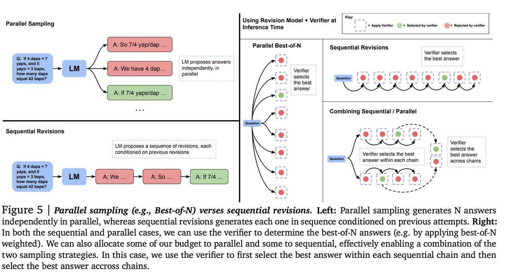


[OpenAI o1 技术初探1：整体框架，利用Test-Time Scaling Law提升逻辑推理能力](https://mp.weixin.qq.com/s/MNwS1PQX2XOhVfN0rKykUQ)---(写得比较细)

[Scaling LLM Test-Time：谁说类o1推理一定要用RL???](https://mp.weixin.qq.com/s/3ABXCv6PG6asRfD0Vc5Iig)

[3B模型长思考后击败70B！HuggingFace逆向出o1背后技术细节并开源](https://mp.weixin.qq.com/s/E1FaaOurAb-QlCX3BASi9Q)

## inference scaling

[LLM Inference Scaling：姚班/OpenAI/CMU 8月论文提前揭示o1核心原理](https://mp.weixin.qq.com/s/p84S9r7Qbuo_yjAWhhqoVQ)

[An Empirical Analysis of Compute-Optimal Inference for Problem-Solving with Language Models](https://arxiv.org/abs/2408.00724)

## 扩散模型的inference scaling

[扩散模型也能推理时Scaling，谢赛宁团队重磅研究可能带来文生图新范式](https://mp.weixin.qq.com/s/wtSzBr6Gs1nF9zz4c5r7Ag)

[Inference-Time Scaling for Diffusion Models beyond Scaling Denoising Steps](https://arxiv.org/pdf/2501.09732)


## O1的评估

[280页PDF，全方位评估OpenAI o1，Leetcode刷题准确率竟这么高](https://mp.weixin.qq.com/s/WxmqCcvvXropIfVCxIJ7bA)

[Evaluation of OpenAI o1: Opportunities and Challenges of AGI](https://arxiv.org/pdf/2409.18486)

## LLM Reasoning

[一文看懂LLM推理，UCL汪军教授解读OpenAI ο1的相关方法](https://mp.weixin.qq.com/s/TCWs5TKKXiRbmt-XUd0wfg)

[首个o1复现开源RL框架OpenR来了，UCL、上交等高校联合团队发布](https://mp.weixin.qq.com/s/Dr9IzbUjiWtZT7bgr58T2g)

[OpenR: An Open Source Framework for Advanced Reasoning with Large Language Models](https://arxiv.org/abs/2410.09671)

[A Tutorial on LLM Reasoning: Relevant methods behind ChatGPT o1](https://github.com/openreasoner/openr/blob/main/reports/Tutorial-LLM-Reasoning-Wang.pdf)

[大模型不会推理，为什么也能有思路？有人把原理搞明白了](https://mp.weixin.qq.com/s/2_ccqg23n05iGK3zUH5KMg)

[Procedural Knowledge in Pretraining Drives Reasoning in Large Language Models](https://arxiv.org/abs/2411.12580)

## 开源模型+O1

[OpenAI o1式思维链，开源模型也可以有，成功案例来了](https://mp.weixin.qq.com/s/W28qb8ZaJkcyDP69eGw8MA)

## 复现O1

[技术上，如何复现 o1?](https://mp.weixin.qq.com/s/_fNioAkD--nI9WSH64O-_A?poc_token=HH6r-2ajxUVBKhJS6btRQEAl85tnczRGWRIAES19)

[17岁高中生写了个神级Prompt，直接把Claude强化成了满血o1](https://mp.weixin.qq.com/s/IAKD0FfcYehs5FsDkLbTJQ)

[https://github.com/richards199999/Thinking-Claude/tree/main](https://github.com/richards199999/Thinking-Claude/tree/main)

[OpenAI最大秘密，竟被中国研究者破解？复旦等惊人揭秘o1路线图](https://mp.weixin.qq.com/s/IOKFBgoWyietVe3NNNw9Hg)

[Scaling of Search and Learning: A Roadmap to Reproduce o1 from Reinforcement Learning Perspective](https://arxiv.org/abs/2412.14135)

## O1 Replication Journey

[上交大发布首个OpenAI o1复现项目进展报告，满满的经验洞察](https://mp.weixin.qq.com/s/ZO_Rv98OakPuBaZl9Tw5VA)

[上交大o1复现新突破：蒸馏超越原版，警示AI研发"捷径陷阱"](https://mp.weixin.qq.com/s/bJc_hSrXsUgrzAfSxAoYoA)

[O1 Replication Journey: A Strategic Progress Report](https://github.com/GAIR-NLP/O1-Journey/blob/main/resource/report.pdf)

[https://github.com/GAIR-NLP/O1-Journey/blob/main/resource/report-part2.pdf](https://github.com/GAIR-NLP/O1-Journey/blob/main/resource/report-part2.pdf)

[https://github.com/GAIR-NLP/O1-Journey](https://github.com/GAIR-NLP/O1-Journey)


## ScoRe

[强化学习让大模型自动纠错，数学、编程性能暴涨，DeepMind新作](https://mp.weixin.qq.com/s/CqxEoL50_FQTGtLYgh6omw)

[OpenAI o1技术初探3：如何让模型拥有自我纠错的能力](https://mp.weixin.qq.com/s/VHZ_BT27Dh2s5hVQSb33WA)


## LeCo

[COLM 24 | 从正确中学习？大模型的自我纠正新视角](https://mp.weixin.qq.com/s/F8KpJuiDE9DfSVb1ciLUSQ)

[Learning From Correctness Without Prompting Makes LLM Efficient Reasoner](https://arxiv.org/pdf/2403.19094)

[https://github.com/starrYYxuan/LeCo](https://github.com/starrYYxuan/LeCo)

## Marco-O1

[阿里推理模型来了！Marco-o1 发布即开源](https://mp.weixin.qq.com/s/taWAZsK_ITJYKM3q_Ssqwg)

[阿里国际版o1来了，Marco-o1：聚焦开放式问题推理](https://mp.weixin.qq.com/s/k1gwBWNYIn_tfviWxbj8fw)

[Marco-o1: Towards Open Reasoning Models for Open-Ended Solutions](https://arxiv.org/abs/2411.14405)

[https://github.com/AIDC-AI/Marco-o1](https://github.com/AIDC-AI/Marco-o1)

## OmniSearch

[阿里多模态检索智能体，自带o1式思考过程！复杂问题逐步拆解，动态调整下一步检索策略](https://mp.weixin.qq.com/s/IU1SokQC5RwRNL2sr7qQLg)

[Benchmarking Multimodal Retrieval Augmented Generation with Dynamic VQA Dataset and Self-adaptive Planning Agent](https://arxiv.org/abs/2411.02937)

[https://github.com/Alibaba-NLP/OmniSearch](https://github.com/Alibaba-NLP/OmniSearch)

## Coconut

[田渊栋团队论文火了！连续思维链优于CoT，打开LLM推理新范式](https://mp.weixin.qq.com/s/cqh3pCLMFJgSVpF0nNgt6w)

(toread)

[Training Large Language Models to Reason in a Continuous Latent Space](https://arxiv.org/pdf/2412.06769)

一般而言，LLM 被限制在语言空间（language space）内进行推理，并通过思维链（CoT）来表达推理过程，从而解决复杂的推理问题。然而，语言空间可能并不总是最适合推理的。例如，很多单词token主要用于文本连贯性，而不是推理本身，而一些关键token则需要复杂的规划。

Coconut（连续思维链，Chain of Continuous Thought）不再通过语言模型头（language model head）和嵌入层将隐藏状态与语言 token 进行映射，而是直接将最后的隐藏状态（即连续思维）作为下一个token的输入嵌入。 

## O1的安全机制

[OpenAI发布49页长文，讲述o1的安全机制](https://mp.weixin.qq.com/s/-zPVmr6_dA35j-YZAIqGJg)

[OpenAI o1 System Card](https://cdn.openai.com/o1-system-card-20241205.pdf)

## O1架构

[「七万字长文」从认知架构到实践部署：o1与o1 Pro的系统性分析与内涵洞察 · 上篇](https://mp.weixin.qq.com/s/ioqtgG2nOr3fT5sNqLNZdg)

## 小模型的O1

(toread)

[让7B千问模型超越o1，微软rStar-Math惊艳登场，网友盛赞](https://mp.weixin.qq.com/s/d2aDtT9KRyZJ9Ac12v8AHA)

[rStar-Math: Small LLMs Can Master Math Reasoning with Self-Evolved Deep Thinking](https://arxiv.org/pdf/2501.04519)

[https://github.com/microsoft/rStar](https://github.com/microsoft/rStar)

## meta-cot

[迈向System 2推理，100页论文硬核讲述Meta-CoT](https://mp.weixin.qq.com/s/L_tErITBzUZ75GVGtbtdDQ)

[Towards System 2 Reasoning in LLMs: Learning How to Think With Meta Chain-of-Thought](https://arxiv.org/pdf/2501.04682)

## sky-T1

(toread)

[450美元训练一个「o1-preview」？UC伯克利开源32B推理模型Sky-T1，AI社区沸腾了](https://mp.weixin.qq.com/s/aRUHeDheE4nwncbCLakgIQ)

[https://novasky-ai.github.io/posts/sky-t1/](https://novasky-ai.github.io/posts/sky-t1/)

[https://huggingface.co/NovaSky-AI/Sky-T1-32B-Preview](https://huggingface.co/NovaSky-AI/Sky-T1-32B-Preview)

## Monkey

[o3并非独门秘技，谷歌已发背后关键机制，方法更简单、成本更低](https://mp.weixin.qq.com/s/qdxC_QyJW17gyRfN66D59A)

[Large Language Monkeys: Scaling Inference Compute with Repeated Sampling](https://arxiv.org/abs/2407.21787)

## 其他的一些讨论

[OpenAI o1模型超全指南来了！](https://mp.weixin.qq.com/s/Wp8y-2q_05UFIMGyyY6DQQ) (使用技巧)

[耗资1.3万，ASU团队揭秘o1推理王者！碾压所有LLM成本超高，关键还会PUA](https://mp.weixin.qq.com/s/pSNC6tdhXcxqB9ofQKU3JQ)

[LLMs Still Can't Plan; Can LRMs? A Preliminary Evaluation of OpenAI's o1 on PlanBench](https://arxiv.org/abs/2409.13373)

[大模型是否有推理能力？DeepMind数月前的论文让AI社区吵起来了](https://mp.weixin.qq.com/s/NdRBGFT6systLwn7p2ER7Q)

[Amortized Planning with Large-Scale Transformers: A Case Study on Chess](https://arxiv.org/pdf/2402.04494)

[联手OpenAI，吴恩达推出一门o1推理新课程，还免费](https://mp.weixin.qq.com/s/J4uQWL_zccyW7PKsb8eSlw)

[https://www.deeplearning.ai/short-courses/reasoning-with-o1/](https://www.deeplearning.ai/short-courses/reasoning-with-o1/)

[4o-mini只有8B，o1也才300B！微软论文意外曝光GPT核心机密](https://mp.weixin.qq.com/s/bT_w-T9ElmPUXbYA1f7kCg)

+ o1-preview约300B；o1-mini约100B
+ GPT-4o约200B；GPT-4o-mini约8B
+ Claude 3.5 Sonnet 2024-10-22版本约175B


# DeepSeek R1

[DeepSeek-R1 发布，性能对标 OpenAI o1 正式版](https://mp.weixin.qq.com/s/atKyfC5l-BaStje8-F3FGQ)

[DeepSeek-R1: Incentivizing Reasoning Capability in LLMs via Reinforcement Learning](https://github.com/deepseek-ai/DeepSeek-R1/blob/main/DeepSeek_R1.pdf)，自己转存了一份：[pdf](https://github.com/daiwk/collections/blob/master/assets/DeepSeek_R1.pdf)

arxiv上：[https://arxiv.org/pdf/2501.12948](https://arxiv.org/pdf/2501.12948)

[https://huggingface.co/deepseek-ai/DeepSeek-R1](https://huggingface.co/deepseek-ai/DeepSeek-R1)，还有不少distill的，LM-studio已经有了。。[https://hf-mirror.com/lmstudio-community/DeepSeek-R1-Distill-Qwen-32B-GGUF](https://hf-mirror.com/lmstudio-community/DeepSeek-R1-Distill-Qwen-32B-GGUF)

[Jay Alammar：图解DeepSeek-R1](https://mp.weixin.qq.com/s/N9N7R-r_l6sBL2fsRXRGAw)

[https://newsletter.languagemodels.co/p/the-illustrated-deepseek-r1](https://newsletter.languagemodels.co/p/the-illustrated-deepseek-r1)

[https://levelup.gitconnected.com/drawing-deepseek-r1-architecture-and-training-process-from-scratch-72043da33955](https://levelup.gitconnected.com/drawing-deepseek-r1-architecture-and-training-process-from-scratch-72043da33955)

## 背景

o1提出了可以通过增加cot reasoning process的长度来进行inference time scaling，尝试复现的方法有：

+ process-based reward models：
  + [Let's Verify Step by Step](https://arxiv.org/pdf/2305.20050)
  + [Solving math word problems with process-and outcome-based feedback](https://arxiv.org/pdf/2211.14275)
  + [Math-Shepherd: Verify and Reinforce LLMs Step-by-step without Human Annotations](https://arxiv.org/pdf/2312.08935)
+ reinforcement learning：
  + [Training language models to self-correct via reinforcement learning](https://arxiv.org/pdf/2409.12917)
+ MCTS/beam search的搜索方法：
  + [Alphazero-like tree-search can guide large language model decoding and training](https://arxiv.org/pdf/2309.17179)
  + [Solving olympiad geometry without human demonstrations](https://www.nature.com/articles/s41586-023-06747-5)
  + [Deepseek-prover-v1.5: Harnessing proof assistant feedback for reinforcement learning and monte-carlo tree search](https://arxiv.org/pdf/2408.08152)

但这些方法都没有o1效果好，因此R1不借助监督数据，使用纯RL(没有SFT)来完成self-evolution，从而探索LLM在reasoning上的潜能。使用DeepSeekV3作为base model，并使用[Deepseekmath: Pushing the limits of mathematical reasoning in open language models](https://arxiv.org/pdf/2402.03300)的GRPO作为RL框架。

几k个step后，DeepSeek-R1-Zero在一些reasoning的benchmark上取得了不错的效果，但仍然有可读性差、语言混合等问题，因此搞了DeepSeek-R1，包括少量的冷启数据和一个多阶段的训练pipeline。

+ 收集数千的cold-start数据来finetune DeepSeek-V3-Base模型
+ 执行类似DeepSeek-R1-Zero的面向reasoning的RL任务
+ 在RL快收敛的时候，在RL的checkpoint上通过拒绝采样构建新的SFT数据，并和DeepSeek-V3的数据集（只选一些领域，如writing、factual QA和self-cognition,自我认知）进行结合，**重训**DeepSeek-V3-Base
+ 用新数据finetune完后，再经过一个RL的过程，并考虑所有场景的prompts==>最终的模型

还搞了一些蒸馏模型，例如Qwen2.5-32B作为base模型，蒸馏DeepSeek-R1的效果比对它进行RL效果要好，说明大的base model发现的reasoning patterns对提升reasoning能力很关键。此外，发现14B的蒸馏模型比QWQ-32B-preview效果好很多，32B和70B的蒸馏模型效果更好

## DeepSeek-R1-Zero

### RL算法

&nbsp;

GRPO（Group Relative Policy Optimization）：放弃了Critic model，用group scores来替换。即对每个问题$$q$$，从老的策略$$\pi_{\theta_{\text {old }}}$$采样出一个group的输出$$\left\{o_1, o_2, \cdots, o_G\right\}$$，再通过最大化如下目标来优化policy model $$\pi_\theta$$：

$$
\begin{aligned}
\mathcal{J}_{G R P O}(\theta) & =\mathbb{E}\left[q \sim P(Q),\left\{o_i\right\}_{i=1}^G \sim \pi_{\theta_{\text {old }}}(O \mid q)\right] \\
& \frac{1}{G} \sum_{i=1}^G\left(\min \left(\frac{\pi_\theta\left(o_i \mid q\right)}{\pi_{\theta_{o l d}}\left(o_i \mid q\right)} A_i, \operatorname{clip}\left(\frac{\pi_\theta\left(o_i \mid q\right)}{\pi_{\theta_{o l d}}\left(o_i \mid q\right)}, 1-\varepsilon, 1+\varepsilon\right) A_i\right)-\beta \mathbb{D}_{K L}\left(\pi_\theta| | \pi_{r e f}\right)\right),
\end{aligned}
$$

其中：

+ $$\mathbb{D}_{K L}\left(\pi_\theta \| \pi_{r e f}\right)=\frac{\pi_{r e f}\left(o_i \mid q\right)}{\pi_\theta\left(o_i \mid q\right)}-\log \frac{\pi_{r e f}\left(o_i \mid q\right)}{\pi_\theta\left(o_i \mid q\right)}-1$$用于限制新策略不要离ref model太远
+ $$\operatorname{clip}\left(\frac{\pi_\theta\left(o_i \mid q\right)}{\pi_{\theta_{o l d}}\left(o_i \mid q\right)}, 1-\varepsilon, 1+\varepsilon\right)$$用于限制新旧策略的概率比例在1附近，即二者不要偏离太远
+ $$\varepsilon$$和$$\beta$$是超参
+ $$A_i$$是advantage，通过每个group的reward计算得来，不像ppo需要借助value model：

$$
A_i=\frac{r_i-\operatorname{mean}\left(\left\{r_1, r_2, \cdots, r_G\right\}\right)}{\operatorname{std}\left(\left\{r_1, r_2, \cdots, r_G\right\}\right)}
$$

整句话的advantage如何分配到token上？参考deepseekmath论文：各token共享

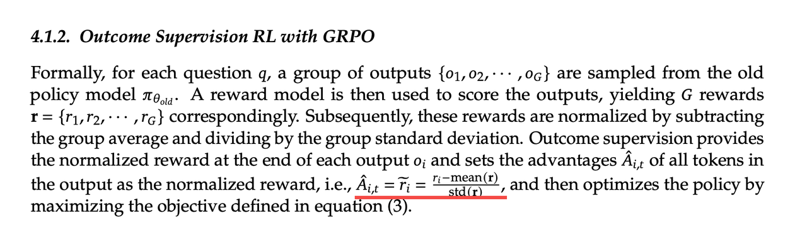

+ 大基座是出现reasoning涌现能力的关键（qwen 32bb用同样r1-zero的数据训练，没法出现aha moment）
+ GRPO可并行，可加速

对比PPO & GRPO

+ PPO：
  + Reference Model（Ref model）：原始LLM，不训练
  + Policy Model（Actor）：原始LLM，需要训练
    + policy：LLM产出的一条response；
    + action：LLM生成的每一个token
  + Reward Model（RM）：对一条response的打分。在RLHF的RM阶段更新，RL阶段不训练
  + Value Model（Critic）：类似RM，需要训练
  + GAE：从Reward Model对**整个句子**的打分，拆解到**每个token**应该怎么改进（图中的A，advantage），会考虑Value Model、Ref Model和Reward Model，还会有一个KL的约束，确保新的policy model不会离ref model太远
  + Importance Sampling：对比新advantage和原始policy的比值，只对advantage进行小比例更新，保证训练稳定
  + 缺点：
    + 需要Ref Model再算一遍，有计算量&耗时
    + 需要拆解到每个token，又有计算量&耗时
+ GRPO：（Group Relative Policy Optimization）：来自[DeepSeekMath: Pushing the Limits of Mathematical Reasoning in Open Language Models](https://arxiv.org/pdf/2402.03300)，放弃了Critic model（图中的value model），用group scores来替换。
  + policy model/ref model/reward model都和ppo一样
  + 不需要value model
  + 并行执行更多的policy（即GRPO的group），产出的结果一起打分，减均值除以标准差，把每个policy和标准差的差距平均到每个token上，再用KL散度计算和ref model的差距

原始DeepSeekMath论文中的图：

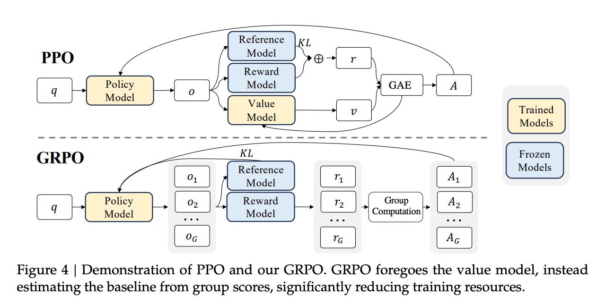

形象的理解：

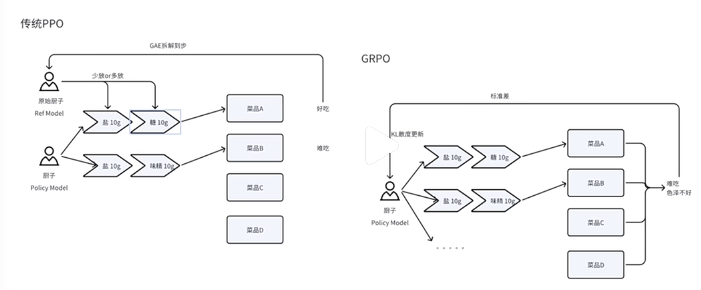

从头开始实现：[DeepSeek关键RL算法GRPO，有人从头跑通了，贡献完整代码](https://mp.weixin.qq.com/s/e0-tVsaIgNajBTOl117ctg)


### Reward modeling

&nbsp;

用的是rule-based reward，包括如下两部分

+ accuracy rewards：response是否正确，例如对于一个数学问题，需要判断最终答案是否为给定的格式（specified format），并且能基于规则验证结果的正确性；leetcode问题则可以用编译器来生成预先定好的测试用例的结果。
+ format rewards：设计了一个format reward model，来强制模型将其思考过程输出在```<think>```和```</think>```之间。

没有设计neural reward model，因为：

+ 发现在大规模的RL过程中，neural reward model会受reward hacking的影响
+ 重新训练reward model需要额外的训练资源，并且会让训练pipeline过于复杂

### Training template

&nbsp;

```html
A conversation between User and Assistant. The user asks a question, and the Assistant solves it.
The assistant first thinks about the reasoning process in the mind and then provides the user
with the answer. The reasoning process and answer are enclosed within <think> </think> and
<answer> </answer> tags, respectively, i.e., <think> reasoning process here </think>
<answer> answer here </answer>. User: prompt. Assistant:
```

训练时使用如上的template，故意将约束限制在这种结构格式上，避免任何特定内容的偏见（例如强制反射推理或促进特定的解决问题的策略），以确保能够在RL过程中准确观察模型的自然进展。

### 效果

&nbsp;

指标含义：

+ pass@1：**首次**生成答案时的成功率
+ cons@64：majority vote (consensus) with 64 samples，模型在给出**64次生成尝试**中，是否能够**多次生成相同的正确答案**。(在[这里](https://openai.com/index/learning-to-reason-with-llms/)提到了，来自文章：[Self-consistency improves chain of thought reasoning in language model](https://arxiv.org/pdf/2203.11171))

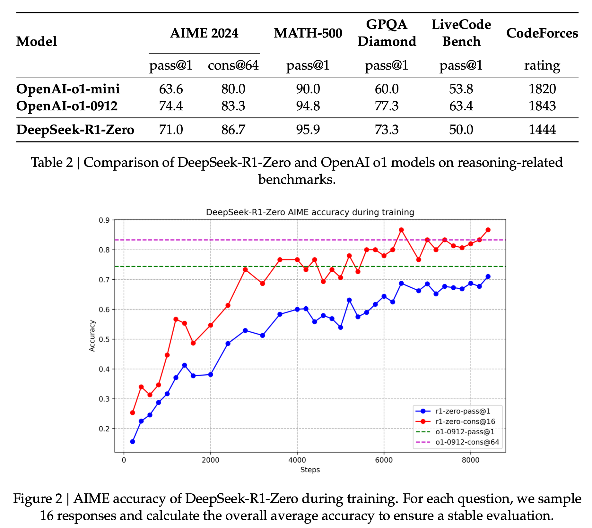

+ 数学(美国数学邀请赛)：
  + AIME2024：pass@1上接近o1-0912，cons@64超了，均超越o1-mini
  + MATH-500：pass@1超越o1-mini和o1-0912
+ GPQA-Diamond（phd级别的科学问题，包括化学、物理、生物）：pass@1超越o1-mini，不如o1-0912
+ 代码：
  + LiveCode Bench：不如o1-0912和o1-mini
  + codeforces的rating：不如o1-0912和o1-mini
  
另外，在AIME2024上，随着训练，pass@1能从十几涨到70几。

### Self-evolution Process

&nbsp;

[](../assets/r1-zero-thinking-length.png)

+ 随着训练的进行，生成的response长度也在变长，说明思考时间也变长了，其中的reasoning tokens从数百涨到了数千。
+ 随着测试时间的增加，**涌现出了复杂的行为**，即不由自主地(spontaneously)出现了（这些行为并非预先在代码里设计的）：
  + 反思：重新看并且评估(revist and reevaluate)之前的steps
  + 探索：尝试其他方法来解决问题

### Aha Moment

&nbsp;

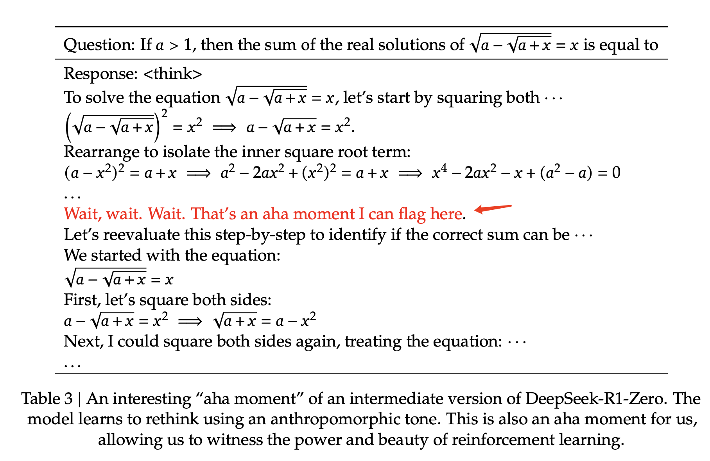

在某一个中间版本，模型突然输出上面的aha-moment，可以看到不需要显式地教模型如何解决，只要给予正确的激励（incentives），模型会自己开发出进阶的问题解决策略，这也是RL的power and beauty。

## DeepSeek-R1

2个目标：

+ 用一小部分高质量数据来做冷启能否提升推理效果，或者加速收敛？
+ 如何训练一个user-friendly的模型，既能提供准确和连贯的CoT，又有很强的通用能力？

### 阶段1：Cold Start

&nbsp;

从base model开始RL训练时，为了防止冷启阶段训练的不稳定，构建了少量（数千）的长CoT数据来finetune模型，作为初始的RL actor。试了几种方法

+ few shot prompting，用一个long CoT作为例子
+ 直接在prompt里要求模型生成详细的答案，并加上反思和验证
+ 收集deepseek-r1-zero的输出，并找人类标注员后处理进行修改

相比zero，冷启数据有如下好处：

+ 可读性：zero的可读性不太好，例如语言混合、缺少markdown高亮。因此设计了一个可读性比较好的pattern，即```|special_token|<reasoning_process>|special_token|<summary>```，并把没有summary的结果扔掉
+ 潜力：依据人类先验精心设计的pattern产出的冷启数据，取得了比zero更好的效果，故迭代地训练对于reasoning models应该是一种更好的方式

### 阶段2：Reasoning-oriented Reinforcement Learning

&nbsp;

在冷启数据上tune完之后，和r1-zero一样，进行大规模的RL训练（在reasoning-intensive任务的数据集上训的？）。此外，为了解决CoT里语言混合的问题，加了一个**language consistency reward**（计算目标语言在CoT中的比例），直接和原来的reward相加。虽然消融实验显示这种alignment会让效果略微下降，但这更符合人类偏好，可读性更强。

### 阶段3：Rejection Sampling and Supervised Fine-Tuning

&nbsp;

用阶段2的ckpt，然后在writing, role-playing, and other general-purpose这类任务上构建SFT数据集，在约80w的样本上对DeepSeek-V3-Base SFT了2个epoch。

+ reasoning data：在前一个RL阶段，只用那些能用rule-based rewards来衡量的数据。
  + 这个阶段加入了更多的数据，有一些是使用**生成式的reward model**，即把ground truth和模型预测结果输入给DeepSeek-V3做judgement。
  + 因为模型输出有时会很混乱或者无可读性，所以删掉一些满足这些条件的CoT：混合语言、长的段落、代码段
  + 对每个prompt，采样多个response，并只保留一个正确的。最终收集了大概60w的reasoning相关的训练样本
+ non-reasoning data：
  + 采用DeepSeek-V3的pipeline，并复用部分DeepSeek-V3的SFT数据集。
  + 使用DeepSeek-V3时，在prompt里提到在回答答案前要生成潜在的CoT；对于简单的如hello的问题，就不用输出CoT。
  + 最终收集了大概20w的non-reasoning训练样本


### 阶段4：Reinforcement Learning for all Scenarios

&nbsp;

将reward信号和多样化的数据分布相结合，提升helpfulness and harmlessness，同时refine reasoning能力，

+ reasoning数据：用R1-Zero的RL，使用rule-based reward
+ 通用数据：用V3的pipeline，还是用reward model，用以学习复杂和细分领域的人类偏好

另外，提升如下两方面的能力：

+ helpfulness：仅关注最终的summary，保证评估强调的是response的有用性和相关性，而尽量少地干涉潜在的reasoning过程
+ harmlessness：同时评估reasoning过程和summary，尽量缓解在生成的过程中出现的风险、偏见和有害内容

### 效果

+ 大部分都接近或者超过新版o1（r1-zero只能和早期o1相当），很多任务都比v3要好
+ 代码和o1差不太多，比v3提升很多，其中SWE  Verified这个工程类的不太行，因为目前训练语料里这类数据还比较少，下一版会优化
+ c-simpleQA（最后一行）上效果不如V3，因为有R1有safety的限制，导致模型会拒绝回答一些问题，如果去掉这个限制，准确率能达到70%
+ 在AlpacaEval2.0（写作）和ArenaHard(开放领域问答)上效果很好，产出的summary也很长，说明可能reasoning能力能产出长cot，对这类任务也有用
+ 数学上超越o1，大幅领先v3


## 蒸馏

基于Qwen2.5-Math-1.5B、Qwen2.5-Math-7B、Qwen2.5-14B、Qwen2.5-32B、Llama-3.1-8B、Llama-3.3-70B-Instruct蒸馏，用的数据集是deepseek-R1的第二阶段RL使用的80w数据，只进行了SFT，没有RL。理论上RL应该会效果更好，留给其他研究者去搞了。

[https://medium.com/@prabhudev.guntur/how-to-distill-deepseek-r1-a-comprehensive-guide-c8ba04e2c28c](https://medium.com/@prabhudev.guntur/how-to-distill-deepseek-r1-a-comprehensive-guide-c8ba04e2c28c)可以参考这个自己蒸馏一个

### 效果

+ 仅sft蒸馏的效果：模型越大效果越好，32b和70b的已经在大部分任务上超越o1-mini了
+ 直接拿qwen-32b做RL（第二行）：和QwQ-32b-preview（第一行）差不太多，但明显不如sft蒸馏（第3行）的模型效果

最终结论：

+ 把大模型蒸馏到小模型可以有很好的效果，但对小模型做RL性价比不高
+ 有更强大的模型和更大规模的RL，才能更好地发挥蒸馏的作用，让小模型变得更强


## 失败的尝试

### PRM

&nbsp;

PRM（Process-supervised Reward Model）是 OpenAI 在[Let's Verify Step by Step](https://arxiv.org/pdf/2305.20050)中首次提出的概念。与之相对应的是ORM（Outcome-supervised Reward Model）。区别：

+ PRM：过程奖励模型，在生成过程中，对每一个**步骤**打分，是更细粒度的奖励模型。 
+ ORM：结果奖励模型，不管推理有多少步，对**完整的生成结果**进行**一次**打分，是一个反馈更稀疏的奖励模型。 

PRM可以在两个阶段生效：

+ Post-Training阶段：在RL过程中增加PRM，对采样的结果**按步骤**输出奖励值，为模型提供更精细的监督信号，来指导策略模型优化，提升模型按步推理的能力。 
+ Inference阶段：对generator模型做N次采样（如Beam Search等），并通过PRM对每个采样的每步推理进行打分，最终拟合一个整体过程打分，并选取打分最高的结果作为最终的答案。

问题：

+ 难以定义细粒度的步骤
+ 评估中间步骤是否正确很困难，用LLM自动评估结果不太行，手动标注又难以规模化应用
+ 基于模型的PRM就会有reward hacking问题， 重新训练奖励模型需要额外的训练资源

### MCTS

&nbsp;

MCTS（Monte Carlo Tree Search）是强化学习领域，详见AlphaGo论文[Mastering the game of Go without human knowledge](https://www.nature.com/articles/nature24270)

具体操作步骤：使用已有的策略与环境做仿真交互，进行多次 rollout 采样，最终构成了一个从当前节点出发的一颗 Tree（每个 rollout 表示从当前节点到最终结束状态的多次与环境仿真交互的过程）。

这棵树的所有叶子节点都是结束状态，结束状态是可以量化收益的（比如方法1：答案错误收益-1，答案正确收益+3；再比如方法2：叶子节点的收益是到达叶子节点路径数/总路径数的概率，这是一种根据投票机制预估的价值，越多路径到达叶子节点，说明这个叶子节点越置信，那么这个叶子节点就有更高的奖励）。

一棵树的叶子节点有了奖励值，就可通过反向传播，计算每个中间节点的奖励值，最终计算出整个树所有节点的奖励值。MCTS一次rollout包括四个步骤：

+ select
+ expand
+ simulate
+ backprop 

MCTS也可以用在两阶段：

+ Post-Traing阶段：对于**每个problem构造一个搜索树**，然后进行树的游走遍历采样，再用采样的样本SFT或RL训练模型。
+ Inference阶段：在推理阶段，也是对一个problem探索多节点构造一棵搜索树，对于到达正确答案的路径，根据节点路径的置信度打分，**贪心选取最优路径**作为最终的推理结果。 

问题：
+ 搜索空间巨大，虽然设置最大扩展限制使得不会无限搜索，但是容易陷入局部最优
+ value model直接影响生成的质量，而训练一个细粒度的value model本质上是困难的

## 小结

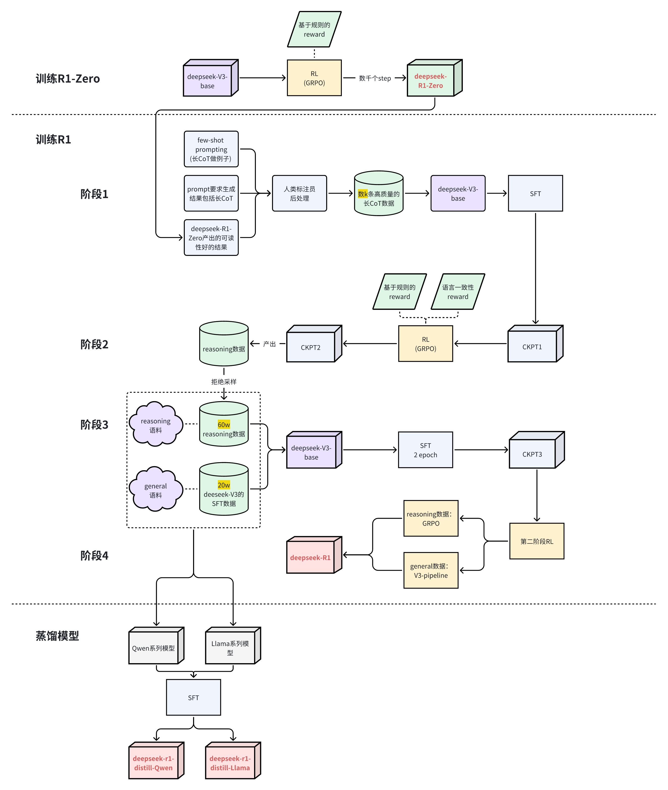

对应的流程图[文档](https://s6alnvgc88.feishu.cn/wiki/JOutwfyGwiEAflkKImvcfpwgnQd)

## 使用注意

### deepseek-r1使用指南

[刚刚，DeepSeek官方发布R1模型推荐设置，这才是正确用法](https://mp.weixin.qq.com/s/RA1mhAyQOoXD5XOULAGgbQ)

+ temperature设置在0.5-0.7之间，推荐0.6，以防止无休止的重复或不连贯的输出。
+ 不要system prompt，直接放到user prompt里
+ 数学问题，建议prompt里直接```Please reason step by step, and put your final answer within \boxed{}.```
+ 有些时候模型会自己跳过think的过程，如果要强制输出，可以强制模型在output前输出```<think>\n```

上传文件的prompt：

```shell
file_template = \
"""[file name]: {file_name}
[file content begin]
{file_content}
[file content end]
{question}"""
```

联网的prompt：

```shell
search_answer_zh_template = \
'''# 以下内容是基于用户发送的消息的搜索结果:
{search_results}
在我给你的搜索结果中，每个结果都是[webpage X begin]...[webpage X end]格式的，X代表每篇文章的数字索引。请在适当的情况下在句子末尾引用上下文。请按照引用编号[citation:X]的格式在答案中对应部分引用上下文。如果一句话源自多个上下文，请列出所有相关的引用编号，例如[citation:3][citation:5]，切记不要将引用集中在最后返回引用编号，而是在答案对应部分列出。
在回答时，请注意以下几点：
- 今天是{cur_date}。
- 并非搜索结果的所有内容都与用户的问题密切相关，你需要结合问题，对搜索结果进行甄别、筛选。
- 对于列举类的问题（如列举所有航班信息），尽量将答案控制在10个要点以内，并告诉用户可以查看搜索来源、获得完整信息。优先提供信息完整、最相关的列举项；如非必要，不要主动告诉用户搜索结果未提供的内容。
- 对于创作类的问题（如写论文），请务必在正文的段落中引用对应的参考编号，例如[citation:3][citation:5]，不能只在文章末尾引用。你需要解读并概括用户的题目要求，选择合适的格式，充分利用搜索结果并抽取重要信息，生成符合用户要求、极具思想深度、富有创造力与专业性的答案。你的创作篇幅需要尽可能延长，对于每一个要点的论述要推测用户的意图，给出尽可能多角度的回答要点，且务必信息量大、论述详尽。
- 如果回答很长，请尽量结构化、分段落总结。如果需要分点作答，尽量控制在5个点以内，并合并相关的内容。
- 对于客观类的问答，如果问题的答案非常简短，可以适当补充一到两句相关信息，以丰富内容。
- 你需要根据用户要求和回答内容选择合适、美观的回答格式，确保可读性强。
- 你的回答应该综合多个相关网页来回答，不能重复引用一个网页。
- 除非用户要求，否则你回答的语言需要和用户提问的语言保持一致。

# 用户消息为：
{question}'''
```

### openai推理使用指南

[刚刚，DeepSeek揭秘R1官方同款部署设置，温度=0.6！OpenAI推理指南同时上线](https://mp.weixin.qq.com/s/M7DOriZntI5RjxCliUVyug)

[https://platform.openai.com/docs/guides/reasoning-best-practices](https://platform.openai.com/docs/guides/reasoning-best-practices)

简单理解：

+ 推理模型就像一位经验丰富的高级同事——你只需告诉他们最终目标，就能相信他们自主完成所有细节工作。
+ GPT模型则更像一位新手同事——你需要提供明确详细的指示，才能让他们准确完成特定的输出任务。

各自特点：

+ 速度和成本：选择GPT模型，因为它们处理速度更快，成本更低
+ 执行明确任务：选择GPT模型，它们在处理界定清晰的任务时表现出色
+ 准确性和可靠性：选择o系列模型，它们是可靠的决策专家
+ 复杂问题解决：选择o系列模型，它们善于处理模糊和复杂的问题

推理模型的优势：

+ 处理模糊任务：推理模型特别擅长处理信息有限或零散的情况，只需通过简单的提示词就能理解用户意图并妥善处理指令中的信息缺口。
值得注意的是，推理模型通常会在做出未经验证的猜测或填补信息空缺之前，主动提出澄清性问题。
+ 大海捞针：当需要处理大量非结构化信息时，推理模型特别擅长理解内容并精准提取出回答问题所需的关键信息。
+ 在大型数据集中发现关系和细微差别：
  + 推理模型特别擅长分析包含数百页密集、非结构化信息的复杂文档，如法律合同、财务报表和保险索赔等。这些模型在识别文档之间的关联性，并基于数据中隐含的事实做出决策方面，表现尤为突出。
  + 推理模型还特别擅长理解细微的政策和规则，并将其准确应用于具体任务中以得出合理结论。
+ 多步骤AI智能体规划：推理模型在AI智能体规划和策略制定中发挥着关键作用。将推理模型作为「计划者」时效果显著：它能为问题制定详细的多步骤解决方案，并根据具体需求（高智能或低延迟）选择和分配合适的GPT模型（执行者）来完成各个步骤。
+ 视觉推理能力：截至目前，o1是唯一一个具备视觉处理能力的推理模型。与GPT-4o相比，o1的独特优势在于它能够准确理解最具挑战性的视觉内容，包括结构不规则的图表和表格，以及质量欠佳的图片。
+ 代码审查、调试和质量改进：推理模型在审查和改进大规模代码方面表现突出。考虑到这类模型的较高延迟特性，通常将代码审查任务安排在后台运行。虽然GPT-4o和GPT-4o mini凭借较低的延迟可能更适合直接编写代码，但在那些对延迟要求相对不那么严格的代码生成场景中，o3-mini表现同样出色。
+ 评估和基准测试其他模型的响应：推理模型在对其他模型的输出进行基准测试和评估方面表现优异。数据验证对确保数据集的质量和可靠性至关重要，这一点在医疗保健等敏感领域尤其重要。

prompt注意点：

+ 用开发者消息取代系统消息：自o1-2024-12-17版本起，推理模型开始支持开发者消息（developer message）而非系统消息（system message）。
+ 保持提示词简洁明确：推理模型最擅长理解和响应简短、清晰的指令。
+ 避免使用CoT提示：由于模型内置推理能力，因此无需特别提示它们「一步一步思考」或「解释推理过程」。
+ 善用分隔符增强清晰度：使用Markdown、XML标签和章节标题等分隔符来明确区分输入的不同部分，这有助于模型准确理解各个章节的内容。
+ 优先尝试零样本学习：推理模型通常无需少样本示例即可产出优质结果，因此建议先尝试不含示例的提示词。如果对输出结果有更复杂的要求，再考虑在提示词中添加输入和期望输出的示例。请注意确保示例与提示词指令严格匹配，因为不一致可能导致性能下降。
+ 提供明确约束条件：如果需要对模型的响应施加具体限制（例如「提供预算控制在500美元以内的解决方案」），请在提示词中明确列出这些约束条件。
+ 明确定义目标：在指令中，请详细说明判定响应成功的具体参数，并引导模型持续优化推理过程，直到达成设定的成功标准。
+ Markdown格式说明：从o1-2024-12-17版本开始，API中的推理模型默认不会生成带有Markdown格式的响应。如果确实需要在响应中包含Markdown格式，请在开发者消息的首行添加「Formatting re-enabled」字符串。


# R1的部署

[完整的671B MoE DeepSeek R1怎么塞进本地化部署？详尽教程大放送！](https://mp.weixin.qq.com/s/GnHzsgvW90DGChENqTBsRw)

[https://github.com/kvcache-ai/ktransformers](https://github.com/kvcache-ai/ktransformers)

# R1的讨论

[华人研究团队揭秘：DeepSeek-R1-Zero或许并不存在「顿悟时刻」](https://mp.weixin.qq.com/s/_VK7fm8p3mpfhPh_zBdagA)

[为什么说DeepSeek的R1-Zero比R1更值得关注？](https://mp.weixin.qq.com/s/yhZR4PainDLR5-gWKiiDjg)

[LeCun痛批硅谷傲慢病！圈内爆火长文：DeepSeek R1-Zero比R1更重要，成AGI破局关键](https://mp.weixin.qq.com/s/mSAATPeW_FM9xadf1veLDA)

[DeepSeek用的GRPO占用大量内存？有人给出了些破解方法](https://mp.weixin.qq.com/s/28GRpZwqv4gMnrmItMQchQ)，对应：[https://github.com/huggingface/trl/issues/2709](https://github.com/huggingface/trl/issues/2709)

[刘知远硬核解读 DeepSeek：大模型强化学习技术原理与大模型技术发展研判](https://mp.weixin.qq.com/s/pAn87hbT3GkfMvbcdzEGCw)

[大神卡帕西拿DeepSeek R1讲强化学习！最新大模型内部机制视频爆火，“没有技术背景也能看懂”](https://mp.weixin.qq.com/s/lBc0-8ByRxJ3JBJpMcfzkQ)

对应代码：[https://github.com/EurekaLabsAI](https://github.com/EurekaLabsAI)

[陈巍：DeepSeek是否有国运级的创新？2万字解读与硬核分析DeepSeek V3/R1的架构](https://mp.weixin.qq.com/s/-yAjdqEn62Sz0bnzp9NEKA)

[Sebastian Raschka：关于DeepSeek R1和推理模型，我有几点看法](https://mp.weixin.qq.com/s/LT22OjbJWKDzTuQeO4yvlg)

[4500美元复刻DeepSeek神话，1.5B战胜o1-preview只用RL！训练细节全公开](https://mp.weixin.qq.com/s/82i7njl4j7nOoLm-igNHtw)

[从想太多到想不透？DeepSeek-R1等长推理模型也存在「思考不足」问题](https://mp.weixin.qq.com/s/LbyHxCbtyYsOelwu6bzs2w)

[r1技术分享](https://www.xiaohongshu.com/explore/67b061460000000029030e00?app_platform=ios&app_version=8.69.4&share_from_user_hidden=true&xsec_source=app_share&type=video&xsec_token=CBH6gEmgPsHp8CWDHlT5DUV9ifTEHPhC9nbQ8RonxCok0=&author_share=1&xhsshare=WeixinSession&shareRedId=ODY2NUg4NE82NzUyOTgwNjY0OTc1STdO&apptime=1739938712&share_id=4d27eb3ad43e4f7b9d9a7b12eb6526f2)

一些观点：

+ 打破LLM训练从Generalist到Reasoner的常规思路，使用RL先得到Reasoner，再经过SFT成为Generalist;
+ GRPO算法的高效性，让RL大规模训练取得了效果;
+ SFT with CoT数据的训练结果在原文中并未给出，但从最近一些复现工作和R1 distiled Qwen结果来看，SFT的作用可能比RL还大。
+ 好的Base模型本身就有Aha Moment，但是是Superfacial（表面）的reflection，不具有提升Accuracy的能力，RL可以增强该能力。

r1的解读（很长，142页）

[DeepSeek-R1 Thoughtology: Let’s <think> about LLM reasoning](https://arxiv.org/pdf/2504.07128)

模型思考过程分四步走：

+ 问题定义：先把问题说清楚
+ 开花期：拆解问题，给出初步方案
+ 重构期：反复验证和修正想法
+ 最终决策：确认并输出答案
	
有趣的发现：

+ 思考链长度有"最佳区间"，太长反而会答错
+ 模型会"死磕"用户给的信息，即使信息是错的也坚持跟着走
+ 中英文环境下性格迥异：中文更重视集体，英文更个人主义
+ 还会画ASCII艺术，虽然不太完美~
	
缺陷：

+ 上下文太长容易"走神"
+ 有时会生成有害内容
+ 在某些视觉任务上还不够连贯


# R1前后的一些工作

## S1

[s1: Simple test-time scaling](https://arxiv.org/pdf/2501.19393)

[https://github.com/simplescaling/s1](https://github.com/simplescaling/s1)

[训练1000样本就能超越o1，李飞飞等人画出AI扩展新曲线](https://mp.weixin.qq.com/s/ax_CCrqpgrp5j2mLOssY4w)

（从xhs上抄的）有几点思维误区：

- s1超过的是o1-preview，没有超过o1甚至o1-mini，有很大区别
- s1的效果不敌deepseek-r1 800k数据蒸馏的32B模型，差了不少，不是媲美
- s1即使使用全量59k数据的效果也没有提高很多，甚至在math上还有下降，所以核心是数据质量
- 1k数据是从59K数据中筛选出来的，不是直接有1K数据就可以
- s1使用1k数据是节省了训练时间，但蒸馏的难点在蒸馏数据的构造上

## LIMO

[817样本激发7倍推理性能：上交大「少即是多」定律挑战RL Scaling范式](https://mp.weixin.qq.com/s/c62TWyepruRYf_1xHFKw4g)

[LIMO: Less is More for Reasoning](https://arxiv.org/pdf/2502.03387)

[https://github.com/GAIR-NLP/LIMO](https://github.com/GAIR-NLP/LIMO)

## PRIME

[挑战DeepSeek-R1-Zero！PRIME：仅10%数据刷新数学推理SOTA，隐式奖励技术颠覆RL训练](https://mp.weixin.qq.com/s/JXGCZxcluvc4YkBVq2mXSA)

[Process Reinforcement through Implicit Rewards](https://arxiv.org/pdf/2502.01456v1)

## TPO

[推理时也能做偏好优化，无需额外重训练，来自上海AI Lab港中文等](https://mp.weixin.qq.com/s/OzAHrVUK57kY9kwVQql4eg)

[Test-Time Preference Optimization: On-the-Fly Alignment via Iterative Textual Feedback](https://arxiv.org/abs/2501.12895)

[https://github.com/yafuly/TPO](https://github.com/yafuly/TPO)

## Huginn

[推理模型新路线开源！与DeepSeek截然不同，抛弃思维链不用人类语言思考](https://mp.weixin.qq.com/s/HK6fjolKDcHG6MD_cVgifg)

[Scaling up Test-Time Compute with Latent Reasoning: A Recurrent Depth Approach](https://arxiv.org/abs/2502.05171)

[https://github.com/seal-rg/recurrent-pretraining](https://github.com/seal-rg/recurrent-pretraining)

抛弃长思维链和人类的语言，直接在连续的高维潜空间用隐藏状态推理，可自适应地花费更多计算来思考更长时间。

## Goedel-Prover

[哥德尔-Prover超过DeepSeek-Prover，金驰、陈丹琦团队造出当前最强形式化推理模型](https://mp.weixin.qq.com/s/IfYQdMyZ7FBEJCXNCTpZtQ)

[Goedel-Prover: A Frontier Model for Open-Source Automated Theorem Proving](https://arxiv.org/abs/2502.07640v1)

[https://github.com/Goedel-LM/Goedel-Prover](https://github.com/Goedel-LM/Goedel-Prover)


## Kimi K1.5

[追平满血版o1的国产多模态模型终于来了！训练细节全部公开](https://mp.weixin.qq.com/s/FOAcS2jsTwNoZA2t1BJ66Q)

[https://github.com/MoonshotAI/kimi-k1.5](https://github.com/MoonshotAI/kimi-k1.5)

[Kimi k1.5: Scaling Reinforcement Learning with LLMs](https://github.com/MoonshotAI/Kimi-k1.5/blob/main/Kimi_k1.5.pdf)，自己转存了一份：[pdf](https://github.com/daiwk/collections/blob/master/assets/Kimi_k1.5.pdf)

## O1 Embedder

[O1 Embedder: Let Retrievers Think Before Action](https://arxiv.org/abs/2502.07555)

生成关于输入查询的thought，然后和question一起拼接，然后分别独自生成嵌入，然后池化聚合。也就是说，这个Embedding模型比之前的模型多了个thought的输出。

微调，两个并行任务，一个是thought生成，一个是对比学习。

微调数据怎么来，那就是生成后进行打分评价。首先，使用LLM生成初始思想，然后使用检索评分器来根据初始思想和目标文档之间的相关性评分，最终通过多数投票选择最佳thought。

## bridge

[From Few to Many: Self-Improving Many-Shot Reasoners Through Iterative Optimization and Generation](https://arxiv.org/pdf/2502.00330)

问题背景：传统的LLM在处理长文本时效率低下，尤其是在需要进行多步推理的任务中。近年来，随着长上下文LLM的发展，出现了多示例学习（many-shot ICL）的范式，即通过更多的示例来提升模型性能。然而，这种范式的效果和影响因素仍需进一步研究。

研究动机：为了提升多示例学习的效率，分析了影响多示例学习效果的关键因素，并发现**仅少数关键示例**就能显著提升性能。基于这一发现，团队提出了一种新的算法，通过**优化选择关键示例**和**生成新的示例**来进一步提升模型的推理能力。

bridge算法结合了优化和生成两个步骤：

+ 在优化步骤中，使用贝叶斯优化（Bayesian optimization）来发现关键示例；
+ 在生成步骤中，利用这些关键示例作为示范，重新生成更多的示例，从而在多示例学习中提高模型性能。

## BFS-Prover

[超越DeepSeek-ProverV1.5！豆包首个形式化数学推理模型BFS-Prover来了，直接开源](https://mp.weixin.qq.com/s/OneF2OtnYbDxeZhDzXPM4A)

[BFS-Prover: Scalable Best-First Tree Search for LLM-based Automatic Theorem Proving](https://arxiv.org/abs/2502.03438)

[https://huggingface.co/bytedance-research/BFS-Prover/tree/main](https://huggingface.co/bytedance-research/BFS-Prover/tree/main)

## CoE

[为DeepSeek MoE模型带来「免费午餐」加速，专家链可大幅提升LLM的信息处理能力](https://mp.weixin.qq.com/s/qTD96rcSY1cKNmH8B30V-w)

## 显式CoT

[揭示显式CoT训练机制：思维链如何增强推理泛化能力](https://mp.weixin.qq.com/s/sE2ckVDJPdMPrC9dfcvSKA)

[Unveiling the Mechanisms of Explicit CoT Training: How Chain-of-Thought Enhances Reasoning Generalization](https://arxiv.org/abs/2502.04667)

## 认知行为

[为什么Qwen能自我改进推理，Llama却不行？斯坦福找到了原理](https://mp.weixin.qq.com/s/OvS61OrDp6rB-R5ELg48Aw)

[Cognitive Behaviors that Enable Self-Improving Reasoners, or, Four Habits of Highly Effective STaRs](https://arxiv.org/abs/2503.01307)


## DR, GRPO

[揭秘DeepSeek R1-Zero训练方式，GRPO还有极简改进方案](https://mp.weixin.qq.com/s/SBGO_1JXnI9CGcLL8eANBA)

[Understanding R1-Zero-Like Training: A Critical Perspective](https://github.com/sail-sg/understand-r1-zero/blob/main/understand-r1-zero.pdf)

[https://github.com/sail-sg/understand-r1-zero](https://github.com/sail-sg/understand-r1-zero)

## AReaL

[200美金，人人可手搓QwQ，清华、蚂蚁开源极速RL框架AReaL-boba](https://mp.weixin.qq.com/s/Cx8QHv2TVl-0mIJzKT7BDA)

[https://github.com/inclusionAI/AReaL](https://github.com/inclusionAI/AReaL)

## TAO

[模型调优无需标注数据！将Llama 3.3 70B直接提升到GPT-4o水平](https://mp.weixin.qq.com/s/WfJtfEN1gHg5NvgCYwefsw)

[https://www.databricks.com/blog/tao-using-test-time-compute-train-efficient-llms-without-labeled-data](https://www.databricks.com/blog/tao-using-test-time-compute-train-efficient-llms-without-labeled-data)

TAO 的核心创新在于摒弃了人工标注数据，转而利用测试时计算引导模型探索任务的可能响应，再通过强化学习根据响应评估结果更新模型参数。

该流程通过可扩展的测试时计算（而非昂贵的人工标注）实现质量提升，并能灵活融入领域知识（如定制规则）。令人惊讶的是，在高质量开源模型上应用该方法时，其效果往往优于依赖人工标注的传统方案。

TAO 包含四个核心阶段：

+ 响应生成：该阶段首先收集任务相关的输入提示或查询样本。在Databricks平台上，这些提示可通过AI Gateway自动采集；
+ 响应评分：系统化评估生成响应的阶段。评分方法包含多种策略，例如基于奖励模型、偏好评分，或利用LLM评判器及定制规则进行任务特异性验证，确保每个响应都做到最优；
+ 强化学习（RL）训练：最终阶段采用基于强化学习的方法更新大语言模型，引导模型生成与高分响应高度契合的输出。通过这一自适应学习过程，模型持续优化预测能力以提升质量；
+ 持续改进：TAO仅需LLM输入样本作为数据源。用户与LLM的日常交互自然形成该数据（一旦模型部署使用，即可自动生成下一轮TAO训练数据）。在 Databricks平台上，借助TAO机制，模型会随着使用频次增加而持续进化。

虽然TAO在训练阶段使用了测试时计算，但最终产出的模型在**执行任务时仍保持低推理成本**。这意味着经过TAO调优的模型在推理阶段（与原版模型相比）具有完全相同的计算开销和响应速度，显著优于 o1、o3 和 R1 等依赖测试时计算的模型。实验表明：采用 TAO 训练的高效开源模型，在质量上足以比肩顶尖的商业闭源模型。

TAO为AI模型调优提供了一种突破性方法：

+ 不同于耗时且易出错的提示工程；
+ 也区别于需要昂贵人工标注数据的传统微调；
+ TAO 仅需工程师提供任务相关的典型输入样本，即可实现卓越性能。

## deepcoder

DeepCoder-14B-Preview

[UC伯克利华人开源14B「o3-mini」，代码版R1突袭OpenAI王座！](https://mp.weixin.qq.com/s/VxGofHl_KeuQa9MBD4AaTg)

## Think twice

[Think Twice: Enhancing LLM Reasoning by Scaling Multi-round Test-time Thinking](https://arxiv.org/pdf/2503.19855)

多轮思考（Multi-round Thinking）：通过迭代地利用之前的答案作为提示，对模型的推理过程进行逐步优化。允许模型在多个推理轮次中重新考虑之前的答案，每次迭代只保留上一轮的最终答案，摒弃中间推理步骤。这一过程类似于人类的认知模式，有助于模型纠正常见的推理错误。

[https://github.com/a-m-team/a-m-models](https://github.com/a-m-team/a-m-models)

## glm-z1

[智谱深夜开源新一代GLM模型，推理速度快DeepSeek-R1八倍，还启用了全新域名Z.ai](https://mp.weixin.qq.com/s/kPAIeYwIAqyIPf1585jR-w)

[https://github.com/THUDM/GLM-4/blob/main/README_zh.md](https://github.com/THUDM/GLM-4/blob/main/README_zh.md)

[https://huggingface.co/collections/THUDM/glm-4-0414-67f3cbcb34dd9d252707cb2e](https://huggingface.co/collections/THUDM/glm-4-0414-67f3cbcb34dd9d252707cb2e)

## d1

[扩散LLM推理用上类GRPO强化学习！优于单独SFT，UCLA、Meta新框架d1开源](https://mp.weixin.qq.com/s/57onGdSBuiQfvEJpOdU_eg)

[d1: Scaling Reasoning in Diffusion Large Language Models via Reinforcement Learning](https://arxiv.org/pdf/2504.12216)

[https://github.com/dllm-reasoning/d1](https://github.com/dllm-reasoning/d1)

## regtool

[ReTool: Reinforcement Learning for Strategic Tool Use in LLMs](https://arxiv.org/abs/2504.11536)

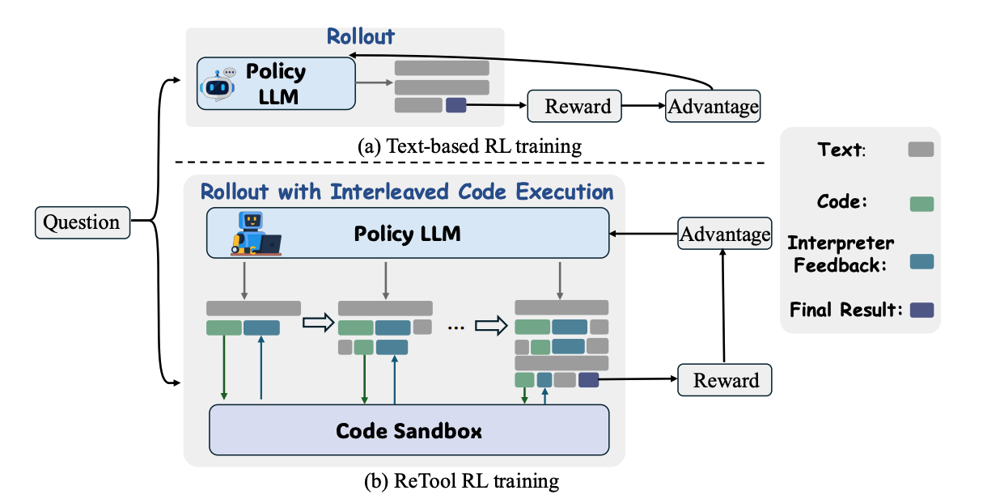

两阶段训练，先冷启注入pattern，再RL进一步泛化

+ 阶段1：收集纯文本数学推理数据->人工专家和Deepseek-R1双重验证过滤无效数据->直接prompt模型将手动计算步骤替换为代码片段，生成代码增强的推理数据->格式/答案验证->得到的数据集用来SFT冷启模型
+ 阶段2：RL rollout时候当检测到```\code```时停止生成，代码片段在sandbox中执行，并将解释器反馈拼接到原来生成序列中，使用是否做对（+1/-1）作为奖励信号进行PPO训练

## RLVR的局限

[RL真让大模型更会推理？清华新研究：其能力边界或仍被基座「锁死」](https://mp.weixin.qq.com/s/2-GDxs8j1QYh1VnW9iBnXw)

[Does Reinforcement Learning Really Incentivize Reasoning Capacity in LLMs Beyond the Base Model?](https://arxiv.org/abs/2504.13837)

RLVR（可验证奖励的强化学习）只是将采样做得更有效率，而其输出的正确答案，早已藏在基座模型的「基因」里。  

## RLFT

[谷歌DeepMind：大模型也很任性，知道最优路径偏要撞南墙](https://mp.weixin.qq.com/s/8wxEyYNYr5L9k0Kb64_O4g)

[LLMs are Greedy Agents: Effects of RL Fine-tuning on Decision-Making Abilities](https://arxiv.org/pdf/2504.16078)

## CoRT

[强迫模型自我争论，递归思考版CoT热度飙升！网友：这不就是大多数推理模型的套路吗？](https://mp.weixin.qq.com/s/lkQEy395JPnlntV1j6EfTQ)

[https://github.com/PhialsBasement/Chain-of-Recursive-Thoughts](https://github.com/PhialsBasement/Chain-of-Recursive-Thoughts)

## R1-Reward

[RL训练总崩溃？R1-Reward稳定解锁奖励模型Long-Cot推理能力](https://mp.weixin.qq.com/s/PHGC6lQt5mXuieK6-8DiYw)

[R1-Reward: Training Multimodal Reward Model Through Stable Reinforcement Learning](https://arxiv.org/abs/2505.02835)

[https://github.com/yfzhang114/r1_reward](https://github.com/yfzhang114/r1_reward)

## CTM

[连续思维机器来了！Transformer八子之一创企推出，让AI不再「一步到位」拍脑袋做决定](https://mp.weixin.qq.com/s/L6Tlpf6xlL6VblTnV0MEfg)

[https://github.com/SakanaAI/continuous-thought-machines/](https://github.com/SakanaAI/continuous-thought-machines/)

[https://sakana.ai/ctm/](https://sakana.ai/ctm/)

[Continuous Thought Machines](https://arxiv.org/abs/2505.05522)

## INTELLECT-2

[全球闲置算力训个模型，性能媲美R1，老黄天塌了！Karpathy曾投资它](https://mp.weixin.qq.com/s/NjQi_KAE18YkIBEqttnUuQ)

## AM-Thinking-v1

[纯蒸馏模型 SOTA 出现！直接 SFT 成本直降 50 倍，数据已全部开源](https://mp.weixin.qq.com/s/OlVQzw_WwziQTi0QnyWuOw)

[Not All Correct Answers Are Equal: Why Your Distillation Source Matters](https://arxiv.org/abs/2505.14464)

2个数据集：[a-m-team/AM-Thinking-v1-Distilled](https://huggingface.co/datasets/a-m-team/AM-Thinking-v1-Distilled)和[a-m-team/AM-Qwen3-Distilled](https://huggingface.co/datasets/a-m-team/AM-Qwen3-Distilled)

## STILL系列

[https://github.com/RUCAIBox/Slow_Thinking_with_LLMs](https://github.com/RUCAIBox/Slow_Thinking_with_LLMs)

## Embedded

[大模型推理的“左右脑”革命！华为盘古Embedded凭昇腾之力，让快慢思考合二为一](https://mp.weixin.qq.com/s/Eem1OYzEE1sM1-MWqsfcpA)

[Pangu Embedded: An Efficient Dual-system LLM Reasoner with Metacognition](https://arxiv.org/abs/2505.22375)

## 小结

[从ReFT, Kimi K1.5到DeepSeek R1，聊聊Reasoning Model的精巧实现](https://mp.weixin.qq.com/s/yaBMe-XOlINOBg6_CL0vEw)

[张俊林：MCST树搜索会是复刻OpenAI O1/O3的有效方法吗](https://mp.weixin.qq.com/s/_Uobawe6yf1eNzScNkySHA)


# R1的复现与部署

## open-r1

[https://github.com/huggingface/open-r1/](https://github.com/huggingface/open-r1/)

[开源22万条DeepSeek R1的高质量数据！你也能复现DeepSeek了](https://mp.weixin.qq.com/s/yIEisGrfguRkpjRnHmNYCg)

[https://huggingface.co/datasets/open-r1/OpenR1-Math-220k](https://huggingface.co/datasets/open-r1/OpenR1-Math-220k)

## unlock-deepseek

[DeepSeek R1 Zero中文复现教程来了！](https://mp.weixin.qq.com/s/Z7P61IV3n4XYeC0Et_fvwg)

## open-reasoner-zero

[1/30训练步骤复刻DeepSeek-R1-Zero，沈向洋姜大昕张祥雨等开源推理模型RL训练方法](https://mp.weixin.qq.com/s/vkEr6oa1JQ_ntzEYJ115yg)

[https://github.com/Open-Reasoner-Zero/Open-Reasoner-Zero/](https://github.com/Open-Reasoner-Zero/Open-Reasoner-Zero/)


## vllm跑gguf的r1

[https://github.com/vllm-project/vllm/pull/13167](https://github.com/vllm-project/vllm/pull/13167)

从源码安装参考[https://docs.vllm.ai/en/latest/getting_started/installation/gpu/index.html#build-wheel-from-source](https://docs.vllm.ai/en/latest/getting_started/installation/gpu/index.html#build-wheel-from-source)

```shell
export https_proxy=xxxxxx
pip3 install setuptools_scm ## 不知道是不是需要的
git clone https://github.com/vllm-project/vllm.git
cd vllm
VLLM_USE_PRECOMPILED=1 pip3 install --editable .

# 如果网络有问题，可以直接pip3 install .
# 下面这3步还是比较必要的
cp -r /usr/local/lib/python3.10/dist-packages/vllm /usr/local/lib/python3.10/dist-packages/vllm.bk
rm -rf /usr/local/lib/python3.10/dist-packages/vllm
cp -r ./vllm /usr/local/lib/python3.10/dist-packages
```

+ 去[https://huggingface.co/deepseek-ai/DeepSeek-R1/tree/main](https://huggingface.co/deepseek-ai/DeepSeek-R1/tree/main)把各个非model的小文件下载下来（可以直接```GIT_LFS_SKIP_SMUDGE=1 git clone https://huggingface.co/deepseek-ai/DeepSeek-R1```）也要下载，
+ 去[https://huggingface.co/unsloth/DeepSeek-R1-GGUF/tree/main](https://huggingface.co/unsloth/DeepSeek-R1-GGUF/tree/main)把config.json下载下来，把json里的torch_dtype里的bfloat16改成float16，覆盖掉上面那个目录里的config.json

上面的那些文件都放到```./unsloth_dir```目录下，注意，目前只能用Q2 Q4那种量化，1.58bit那种动态量化不支持

```shell
cd ./unsloth_dir/
# merge成一个gguf
llama.cpp/llama-gguf-split --merge ./DeepSeek-R1-Q2_K/DeepSeek-R1-Q2_K-00001-of-00005.gguf ./unsloth_dir/merge.gguf 
```

代码：

```python
from vllm import LLM, SamplingParams

import multiprocessing

if __name__ == "__main__":
    # 这坨要放main里，deepseek教我的
    multiprocessing.set_start_method('spawn', force=True)
    
    llm = LLM(model="./unsloth_dir/merge.gguf",
              tokenizer="./unsloth_dir/DeepSeek-R1",
              hf_config_path="./unsloth_dir/DeepSeek-R1",
              enforce_eager=True, 
              tensor_parallel_size=8, #
              trust_remote_code=True, 
              distributed_executor_backend="mp",
              max_model_len=2000)
    sampling_params = SamplingParams(temperature=0.5, max_tokens=2000)
    
    def print_outputs(outputs):
        for output in outputs:
            prompt = output.prompt
            generated_text = output.outputs[0].text
            print(f"Prompt: {prompt!r}, Generated text\n: {generated_text}")
        print("-" * 80)
    conversation = [
        {
            "role": "user",
            "content": "中国的首都是哪里",
        },
    ]
    outputs = llm.chat(conversation,
                       sampling_params=sampling_params,
                       use_tqdm=False)
    print_outputs(outputs)
```

运行：

```shell
VLLM_MLA_DISABLE=1 VLLM_WORKER_MULTIPROC_METHOD=spawn python3 vllm_deepseek.py 
```


## unsloth

### 跑满血版1.58bit infer

[https://unsloth.ai/blog/deepseekr1-dynamic](https://unsloth.ai/blog/deepseekr1-dynamic)

### 让小模型有reasoning能力

[https://unsloth.ai/blog/r1-reasoning](https://unsloth.ai/blog/r1-reasoning)


## Logic-RL与reinforce-lite

[10美元成功复现DeepSeek顿悟时刻，3B模型爆发超强推理！微软论文反驳涌现](https://mp.weixin.qq.com/s/xH86_m71lZnSVMM7q_jzXw)

### reinforce-lite

[https://medium.com/@rjusnba/overnight-end-to-end-rl-training-a-3b-model-on-a-grade-school-math-dataset-leads-to-reasoning-df61410c04c6](https://medium.com/@rjusnba/overnight-end-to-end-rl-training-a-3b-model-on-a-grade-school-math-dataset-leads-to-reasoning-df61410c04c6)

### Logic-RL

[Logic-RL: Unleashing LLM Reasoning with Rule-Based Reinforcement Learning](https://arxiv.org/pdf/2502.14768)

## SGLang对R1的加速

[全球首个，最接近原版DeepSeek开源复现来了！R1四个月狂飙26倍](https://mp.weixin.qq.com/s/O8_qnIsxVoc98y3RVR9sYw)

[https://lmsys.org/blog/2025-05-05-large-scale-ep/](https://lmsys.org/blog/2025-05-05-large-scale-ep/)

[https://docs.sglang.ai/references/deepseek.html](https://docs.sglang.ai/references/deepseek.html)

# R1的微调

## ColossalAI

[DeepSeek V3+R1满血微调工具上线！一键启动，硬件要求降10倍](https://mp.weixin.qq.com/s/ywJAbcjXPef1RazHj1HIjg)

[https://github.com/hpcaitech/ColossalAI](https://github.com/hpcaitech/ColossalAI)

### lora sft满血deepseek V3/R1

+ 数据：[https://github.com/hpcaitech/ColossalAI/blob/main/applications/ColossalChat/examples/training_scripts/lora_sft_data.jsonl](https://github.com/hpcaitech/ColossalAI/blob/main/applications/ColossalChat/examples/training_scripts/lora_sft_data.jsonl)
+ fp8权重转bf16：[https://github.com/deepseek-ai/DeepSeek-V3/blob/main/inference/fp8_cast_bf16.py](https://github.com/deepseek-ai/DeepSeek-V3/blob/main/inference/fp8_cast_bf16.py)
+ 脚本：[https://github.com/hpcaitech/ColossalAI/blob/main/applications/ColossalChat/examples/training_scripts/lora_finetune.py](https://github.com/hpcaitech/ColossalAI/blob/main/applications/ColossalChat/examples/training_scripts/lora_finetune.py)

通过使用 LoRA 等优化，示例命令已将 SFT DeepSeek V3/R1 671B 最低硬件要求降低近 10 倍，可使用 32 个 Ascend 910B NPU 64GB（使用 ep=8,pp=4）或 24 个 H100/H800 GPU（使用 ep=8,pp=3）。如果你通过 --zero_cpu_offload 启用 CPU offload，硬件要求可以进一步降低，但会损失一定的训练速度。

```shell
colossalai run --hostfile path-to-host-file --nprocpernode 8 \
  lorafinetune.py --pretrained path-to-DeepSeek-R1-bf16 \
  --dataset path-to-dataset.jsonl --plugin moe \
  --lr 2e-5 --maxlength 256 -g --ep 8 --pp 3 \
  --batchsize 24 --lorarank 8 --loraalpha 16 \
  --numepochs 2 --warmupsteps 8 \
  --tensorboarddir logs --save_dir DeepSeek-R1-bf16-lora
```

也可以使用上述脚本，将并行度高效扩展至数百及数千卡，快速完成 DeepSeek V3/R1 671B 全参微调或并行加速。

### 用强化学习微调蒸馏版DeepSeek

奖励设计：

1. 奖励 = 0，如果格式是错误的；
2. 奖励 = 1， 如果格式是正确的但是结果是错误的；
3. 奖励 = 10，如果格式与结果都是正确的。

+ 模板和设定：[https://github.com/hpcaitech/ColossalAI/blob/main/applications/ColossalChat/conversation_template/Qwen_Qwen2.5-3B.json](https://github.com/hpcaitech/ColossalAI/blob/main/applications/ColossalChat/conversation_template/Qwen_Qwen2.5-3B.json)
+ 启动脚本：[https://github.com/hpcaitech/ColossalAI/blob/main/applications/ColossalChat/examples/training_scripts/train_grpo.sh](https://github.com/hpcaitech/ColossalAI/blob/main/applications/ColossalChat/examples/training_scripts/train_grpo.sh)


# OpenAI

## O3

[OpenAI：强化学习确实可显著提高LLM性能，DeepSeek R1、Kimi k1.5发现o1的秘密](https://mp.weixin.qq.com/s/jh5L5MV6jU8W6coFH7jsAg)

[Competitive Programming with Large Reasoning Models](https://arxiv.org/pdf/2502.06807)

[刚刚，OpenAI放出最后大惊喜o3，高计算模式每任务花费数千美元](https://mp.weixin.qq.com/s/KmxARRFsjXiLTF8HScsmOQ)

## O3与隐私

[一张照片、一句简单提示词，就被ChatGPT人肉开盒，深度解析o3隐私漏洞](https://mp.weixin.qq.com/s/_pDsKWz9f9rjXFHWN2UJ_A)

[Doxing via the Lens: Revealing Privacy Leakage in Image Geolocation for Agentic Multi-Modal Large Reasoning Model](https://arxiv.org/abs/2504.19373)

# Claude

## Claude 3.7 Sonnet

[全球首个混合推理模型：Claude 3.7 Sonnet来袭，真实编码力压一切对手](https://mp.weixin.qq.com/s/RzdrxKbHKKqtN-FvbOQsZw)

+ 既是普通的 LLM，又是推理模型。你可以选择何时希望模型正常回答，何时希望它在回答之前思考更长时间。在标准模式下，Claude 3.7 Sonnet 是前代 Claude 3.5 Sonnet 的升级版。在扩展思维模式下，它会在回答之前进行自我反思，从而提高其在数学、物理、指令遵循、编码和许多其他任务上的表现。Anthropic 发现，两种模式下，模型的提示词工作方式类似。
+ 当通过 API 使用 Claude 3.7 Sonnet 时，用户还可以控制思考预算。你可以告诉 Claude 思考不超过 N 个 token。对于任何 N 值，其输出限制为 128K 个 token。这允许用户在速度（和成本）和答案质量之间进行权衡。
+ 第三，在开发自家的推理模型时，Anthropic 对数学和计算机科学竞赛问题的优化较少，而是将重点转向更能反映企业实际使用 LLM 方式的现实任务。

[Claude 3.7 Sonnet System Card](https://assets.anthropic.com/m/785e231869ea8b3b/original/claude-3-7-sonnet-system-card.pdf)

# seed-thinking

[200B参数击败满血DeepSeek-R1，字节豆包推理模型Seed-Thinking-v1.5要来了](https://mp.weixin.qq.com/s/wUzb58pUnZ1s7fO9aYs1vQ)

[Seed-Thinking-v1.5: Advancing Superb Reasoning Models with Reinforcement Learning](https://github.com/ByteDance-Seed/Seed-Thinking-v1.5/blob/main/seed-thinking-v1.5.pdf)

## DAPO

[超越DeepSeek GRPO的关键RL算法，字节、清华AIR开源DAPO](https://mp.weixin.qq.com/s/_w_HtjNQiG-yP5LEN85o0Q)

[DAPO: An Open-Source LLM Reinforcement Learning System at Scale](https://dapo-sia.github.io/static/pdf/dapo_paper.pdf)

[https://github.com/volcengine/verl/tree/gm-tyx/puffin/main/recipe/dapo](https://github.com/volcengine/verl/tree/gm-tyx/puffin/main/recipe/dapo)

数据：[https://huggingface.co/datasets/BytedTsinghua-SIA/DAPO-Math-17k](https://huggingface.co/datasets/BytedTsinghua-SIA/DAPO-Math-17k)

## VAPO

[字节新作 VAPO：使用基于价值的强化学习框架进行长思维链推理](https://mp.weixin.qq.com/s/oFyW439e8B1rkogu5rjH_g)

[VAPO: Efficient and Reliable Reinforcement Learning for Advanced Reasoning Tasks](https://arxiv.org/abs/2504.05118)

# 多模态推理

## 综述

[Rule-based强化学习≠古早逻辑规则！万字拆解o1多模态推理最新进展](https://mp.weixin.qq.com/s/8pwCPuXzXoMJsDmdL9tPGA)

[Aligning Multimodal LLM with Human Preference: A Survey](https://arxiv.org/abs/2503.14504)


## 视觉推理

[视觉强化微调！DeepSeek R1技术成功迁移到多模态领域，全面开源](http://mp.weixin.qq.com/s/VCSUQXV7yv9MdIWQlxh7dQ)

[Visual-RFT: Visual Reinforcement Fine-Tuning](https://arxiv.org/abs/2503.01785)

[https://github.com/Liuziyu77/Visual-RFT](https://github.com/Liuziyu77/Visual-RFT)

## R1V

[全球首个工业界多模态推理模型开源！38B硬刚DeepSeek-R1，训练秘籍全公开](https://mp.weixin.qq.com/s/CYNce3oHoDrsOJSv5Pj6Nw)

[https://github.com/SkyworkAI/Skywork-R1V](https://github.com/SkyworkAI/Skywork-R1V)

[Skywork R1V: Pioneering Multimodal Reasoning withChain-of-Thought](https://github.com/SkyworkAI/Skywork-R1V/blob/main/Skywork_R1V.pdf)


## Video-T1

[视频生成的测试时Scaling时刻！清华开源Video-T1，无需重新训练让性能飙升](https://mp.weixin.qq.com/s/HtJHXGgTAhi-uBWSsgqOKQ)

[Video-T1: Test-Time Scaling for Video Generation](https://arxiv.org/pdf/2503.18942)

[https://github.com/liuff19/Video-T1](https://github.com/liuff19/Video-T1)

## mureka o1(音乐)

[音乐界迎来自己的DeepSeek！全球首个音乐推理大模型Mureka O1上线，超越Suno](https://mp.weixin.qq.com/s/XF9HQr-qlXfWGaQlesCaHQ)

[MusiCoT: Analyzable Chain-of-Musical-Thought Prompting for High-Fidelity Music Generation](https://musicot.github.io/MusiCoT_paper.pdf)

[https://musicot.github.io/](https://musicot.github.io/)

## visual planning

[只用图像也能思考，强化学习造就推理模型新范式！复杂场景规划能力Max](https://mp.weixin.qq.com/s/KXx1t3jIlhLWu0rlVoQWNA)

[Visual Planning: Let’s Think Only with Images](https://arxiv.org/pdf/2505.11409)

[https://github.com/yix8/VisualPlanning](https://github.com/yix8/VisualPlanning)

## DeepEyes

[OpenAI未公开的o3「用图思考」技术，被小红书、西安交大尝试实现了](https://mp.weixin.qq.com/s/yyfeEmxmIaA7Qu5raGVHyA)

[DeepEyes: Incentivizing "Thinking with Images" via Reinforcement Learning](https://arxiv.org/abs/2505.14362)

[https://github.com/Visual-Agent/DeepEyes](https://github.com/Visual-Agent/DeepEyes)

# deep research

## local-deep-research

[本地也能运行Deep Research！支持arXiv平台，兼容PDF、Markdown等](https://mp.weixin.qq.com/s/U5lXj0lhMR6x_Wy3GHpNfQ)

[https://github.com/LearningCircuit/local-deep-research](https://github.com/LearningCircuit/local-deep-research)

## CycleResearcher

[ICLR 2025 \| 真正「Deep」的「Research」，通过强化学习实现可自主进化的科研智能体来了！](https://mp.weixin.qq.com/s/-n3bo-mNklCIVFZV6splmw)

[CycleResearcher: Improving Automated Research via Automated Review](https://openreview.net/forum?id=bjcsVLoHYs)

[https://ai-researcher.net/](https://ai-researcher.net/)

[https://github.com/zhu-minjun/Researcher](https://github.com/zhu-minjun/Researcher)

# 高效reasoning

## reasoning economy

[港中文发布全新视角高效Reasoning综述！idea已充满大脑...](https://mp.weixin.qq.com/s/rgoJlXinM-NtAjnuXr4Kfw)

[Harnessing the Reasoning Economy A Survey of Efficient Reasoning for Large Language Models](https://arxiv.org/pdf/2503.24377)

[https://github.com/DevoAllen/Awesome-Reasoning-Economy-Papers](https://github.com/DevoAllen/Awesome-Reasoning-Economy-Papers)

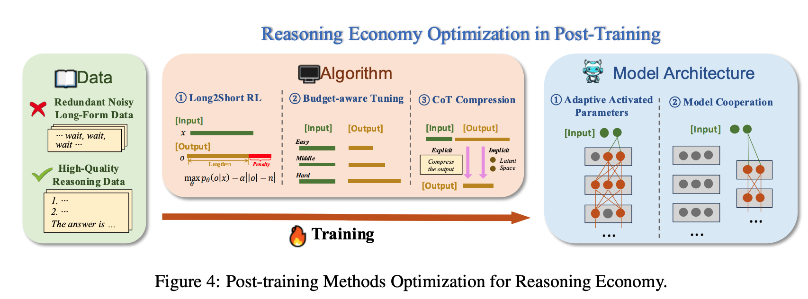

+ 数据：
  + 干掉冗余、噪声、太长的数据
  + 保留高质量数据
+ 算法：
  + Long2Short RL：惩罚过长的输出
  + budget-aware tuning：简单问题输出短，复杂问题输出长
  + CoT Compression：显式/隐式压缩CoT
+ 模型：
  + adaptive Activated Parameters：类似稀疏激活
  + Model Cooperation：搞2个模型，简单问题走简单模型，复杂问题走复杂模型

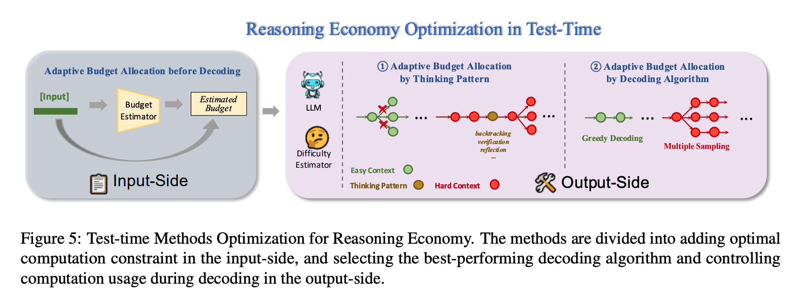

+ 输入侧：解码之前进行自适应预算分配
  + 对输入进行成本预估
+ 输出侧：
  + thinking pattern的自适应预算分配：简单问题直接剪枝，复杂问题需要回溯+验证+反思
  + 解码算法的自适应预算分配：简单问题贪心解码，复杂问题多一些采样

## stop overthinking

[大模型还有哪些值得研究的方向？ || 大模型高效推理(Efficient Reasoning)研究综述](https://mp.weixin.qq.com/s/vUcmlaJ4zMmTtDolJLqJrA)

[Stop Overthinking: A Survey on Efficient Reasoning for Large Language Models](https://arxiv.org/pdf/2503.16419)

[https://github.com/Eclipsess/Awesome-Efficient-Reasoning-LLMs](https://github.com/Eclipsess/Awesome-Efficient-Reasoning-LLMs)

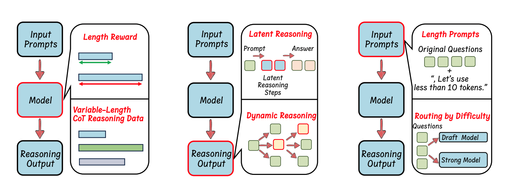

+ model：
  + length reward：RL时加上新的reward，鼓励答案正确且cot短的
  + variable-length cot reasoning data：构造不同长度cot的数据集，然后sft
+ reasoning-output：
  + latent reasoning：将reasoning steps压缩成latent表示
  + dynamic reasoning：reasoning的过程改成投机采样、拒绝采样、tree-of-thoughts等方式
+ input prompt：
  + length prompts：let's use less than k tokens
  + routing by difficulty：训一个小模型，决定简单问题不思考，困难问题再思考


# 推理模型总结

[从自我进化视角出发，全面解析LLM的推理能力技术演进路径](https://mp.weixin.qq.com/s/hkYW0c26eLEHE9WgIQxwHw)

[A Survey on LLM Complex Reasoning through the Lens of Self-Evolution](https://github.com/daiwk/collections/blob/master/assets/Survey_of_LLM_Reaoning_by_Self_Evolution.pdf)

[https://github.com/cs-holder/Reasoning-Self-Evolution-Survey](https://github.com/cs-holder/Reasoning-Self-Evolution-Survey)

(toread)

更新的：

[DeepSeek-R1之后推理模型发展如何？Raschka长文梳理后R1时代14篇重要论文](https://mp.weixin.qq.com/s/OMblIwzOJg9POx2hDtjekg)


[从o1-mini到DeepSeek-R1，万字长文带你读懂推理模型的历史与技术](https://mp.weixin.qq.com/s/t19D5_2nsbIVI_eemLtx-Q)

[https://cameronrwolfe.substack.com/p/demystifying-reasoning-models](https://cameronrwolfe.substack.com/p/demystifying-reasoning-models)


[https://openai.com/index/learning-to-reason-with-llms/](https://openai.com/index/learning-to-reason-with-llms/)这里的图：说明openai发现了在训练时用大规模的强化学习（train-time compute）以及在测试时花更多的时间思考（test-time computing）都能提升数学任务上的效果

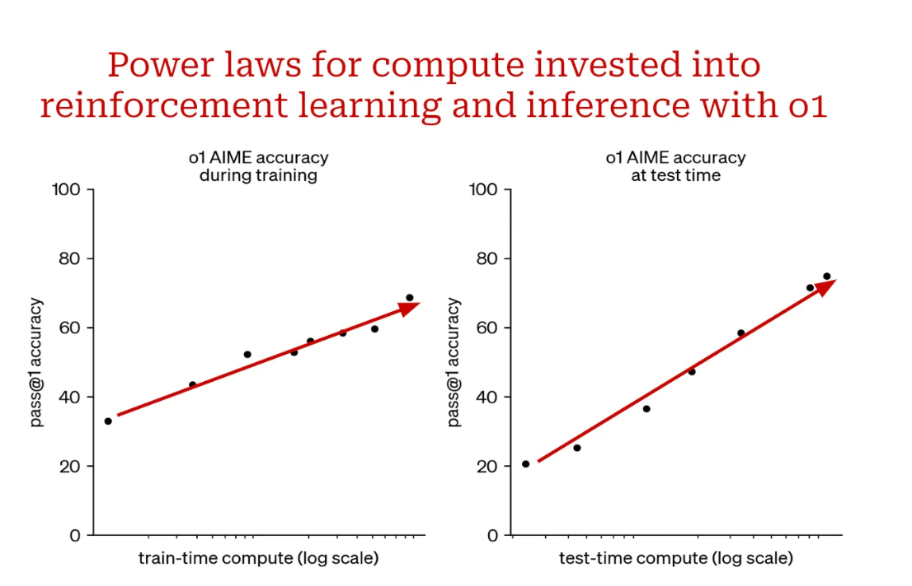

