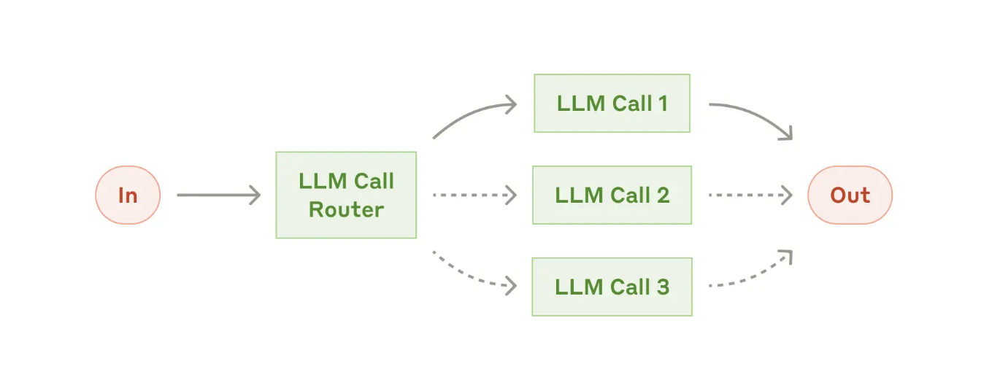
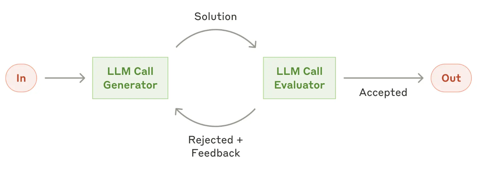
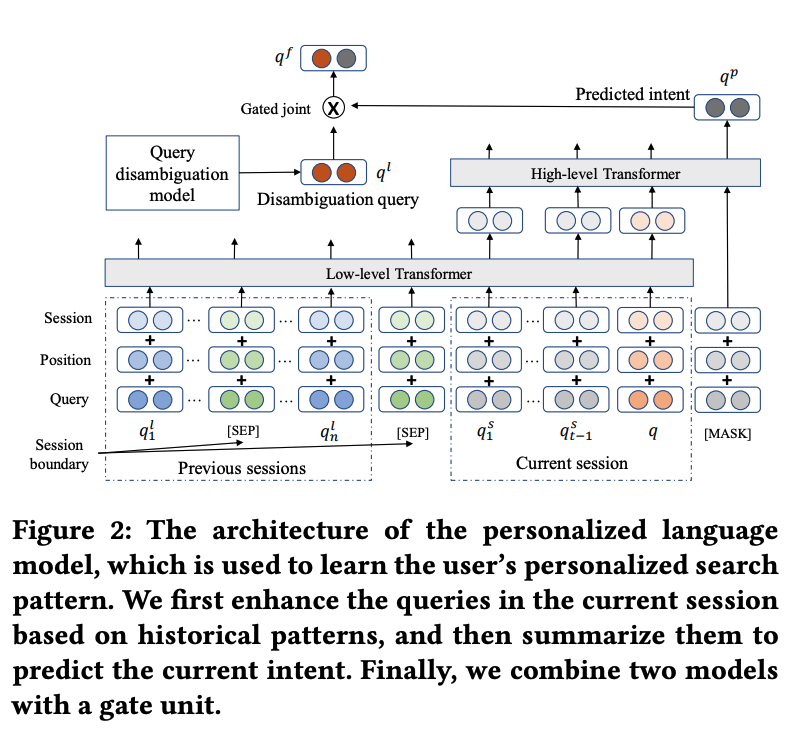
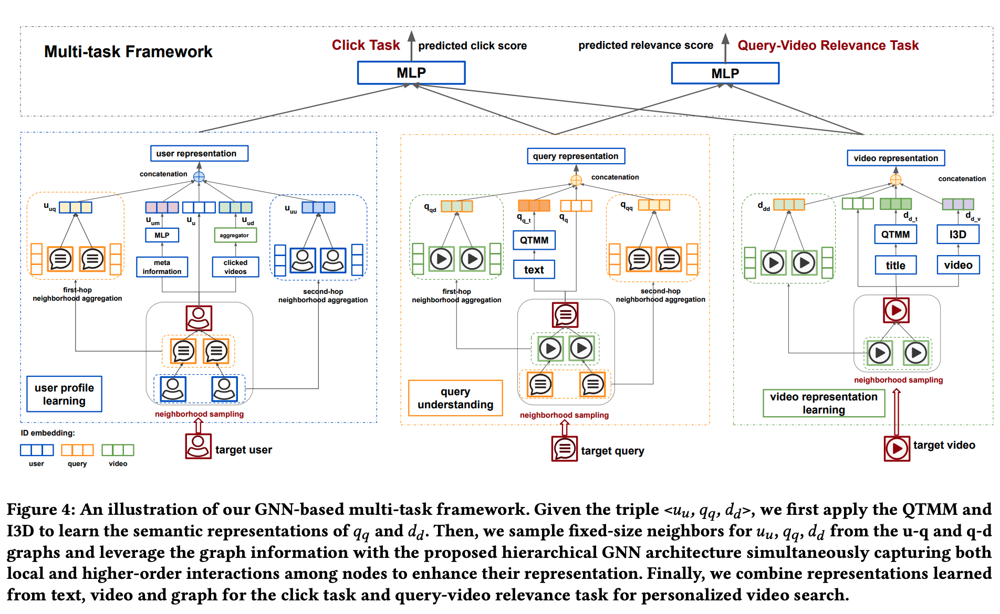
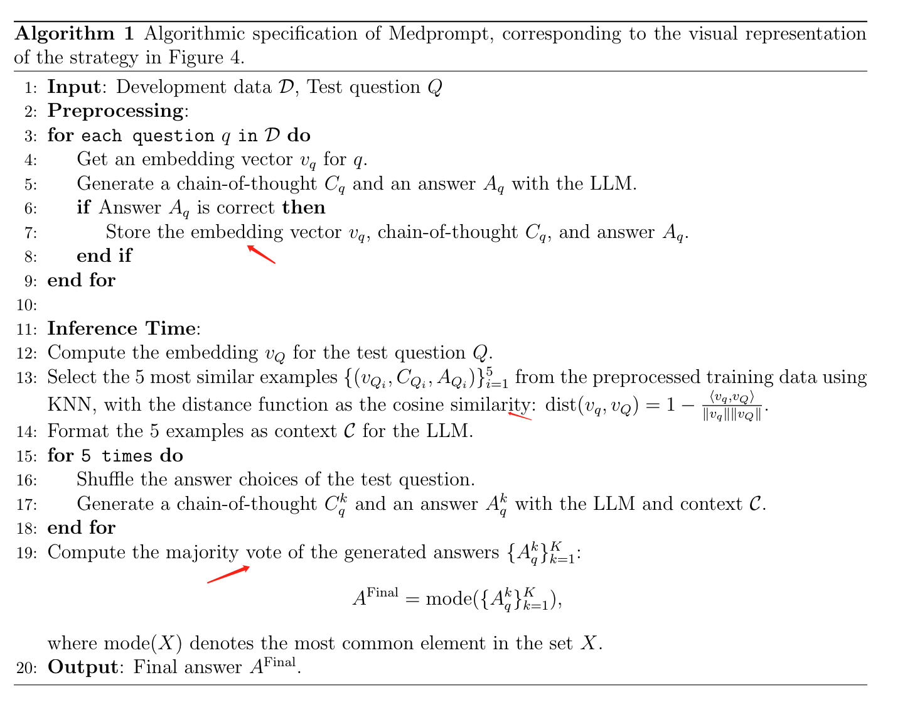

# 世界模型

[怒斥Sora之后，LeCun放出「视觉世界模型」论文，揭示AI学习物理世界的关键​](https://mp.weixin.qq.com/s/KY-bTD-bxdB3Q-q97Gv7fg)

[100万token，一次能分析1小时YouTube视频，「大世界模型」火了](https://mp.weixin.qq.com/s/8ONe7_ejQQIT1UwqDGK-vg)

[WORLD MODEL ON MILLION-LENGTH VIDEO AND LANGUAGE WITH RINGATTENTION](https://arxiv.org/pdf/2402.08268.pdf)

[https://github.com/LargeWorldModel/LWM](https://github.com/LargeWorldModel/LWM)

[Sora是世界模拟器吗？全球首篇综述全面解析通用世界模型](https://mp.weixin.qq.com/s/rkq7NXGvB0O1Kstd_mTNJQ)

[Is Sora a World Simulator? A Comprehensive Survey on General World Models and Beyond](https://arxiv.org/pdf/2405.03520)

[世界模型也扩散！训练出的智能体竟然不错](https://mp.weixin.qq.com/s/AWt1Jgvr2aj6sjkGRV9-hg)

[Diffusion for World Modeling: Visual Details Matter in Atari](https://arxiv.org/pdf/2405.12399)

[https://github.com/eloialonso/diamond](https://github.com/eloialonso/diamond)


## pandora

[通用世界模型问世：不学习就能生成新领域视频，可实时控制](https://mp.weixin.qq.com/s/Vj2W3BtKITV4mxwVhDJHzg)

[Pandora : Towards General World Model with Natural Language Actions and Video States](https://world-model.maitrix.org/assets/pandora.pdf)

[https://github.com/maitrix-org/Pandora](https://github.com/maitrix-org/Pandora)


[ACL 2024论文盖棺定论：大语言模型≠世界模拟器，Yann LeCun：太对了](https://mp.weixin.qq.com/s/FBqYb_gcBr5D204mDtmCOA)

[Can Language Models Serve as Text-Based World Simulators?](https://arxiv.org/pdf/2406.06485)

## WHALE

[WHALE来了，南大周志华团队做出更强泛化的世界模型](https://mp.weixin.qq.com/s/9vk__IpfMdYj57VjtV1HvQ)

[WHALE: TOWARDS GENERALIZABLE AND SCALABLE WORLD MODELS FOR EMBODIED DECISION-MAKING](https://arxiv.org/pdf/2411.05619)

## genie 2

[谷歌世界模型爆发：单张图生成可玩3D世界，还要和马斯克一起做AI游戏](https://mp.weixin.qq.com/s/PaUScHrclUwYABwT8LL5zg)

[https://deepmind.google/discover/blog/genie-2-a-large-scale-foundation-world-model/](https://deepmind.google/discover/blog/genie-2-a-large-scale-foundation-world-model/)

## NWM

[LeCun团队新作：在世界模型中导航](https://mp.weixin.qq.com/s/V5rXxbLYmR8UuiVq-gsi9A)

[Navigation World Models](https://arxiv.org/pdf/2412.03572v1)

[https://www.amirbar.net/nwm/](https://www.amirbar.net/nwm/)

## V-JEPA 2

[刚刚，LeCun亲自出镜，Meta推出新世界模型！](https://mp.weixin.qq.com/s/i2lMeFX6VWWxqL_ZKmznfw)

[V-JEPA 2: Self-Supervised Video Models Enable Understanding, Prediction and Planning](https://ai.meta.com/research/publications/v-jepa-2-self-supervised-video-models-enable-understanding-prediction-and-planning/)

[https://github.com/facebookresearch/vjepa2](https://github.com/facebookresearch/vjepa2)

[https://huggingface.co/collections/facebook/v-jepa-2-6841bad8413014e185b497a6](https://huggingface.co/collections/facebook/v-jepa-2-6841bad8413014e185b497a6)

## Agents-world-model

[AGI真方向？谷歌证明：智能体在自研世界模型，世界模型is all You Need](https://mp.weixin.qq.com/s/k-hd-M1XK7fsH2LI80r5AA)

[General agents need world models](https://arxiv.org/abs/2506.01622)

# 语言物理学

(toread)

[大模型边推理边纠错，有可能做到吗？这是ICML爆火的演讲](https://mp.weixin.qq.com/s/NOVFYmXiHUJ7x1SU7yH0CA)

[https://www.bilibili.com/video/BV1Yw4m1k7nH](https://www.bilibili.com/video/BV1Yw4m1k7nH)

# 蒸馏

## ABKD


[ICML Spotlight 2025丨追求概率质量的帕累托最优：基于广义α-β散度引导的知识蒸馏框架ABKD](https://mp.weixin.qq.com/s/UwRwDJJxWrS-9mVoHSUPDQ)

[ABKD: Pursuing a Proper Allocation of the Probability Massin Knowledge Distillation via α-β-Divergence](https://arxiv.org/pdf/2505.04560)

[https://github.com/ghwang-s/abkd](https://github.com/ghwang-s/abkd)

现有问题：

+ 前向KL：概率分配过于“佛系”，学生“雨露均沾”，难专注目标类
+ 反向KL：概率分配过于“内卷”，学生“死磕”高置信度类，忽略教师全局信息

ABKD引入α-β散度，统一前向/反向KL，并推广到此前未探索的海灵格距离和β-散度等。


# LLM+math

## mathscale

[【LLM-数学】MathScale 用于数学推理的指令调优扩展方法](https://mp.weixin.qq.com/s/tQUIGdViMZTb_9NNh3b3RQ)

[MathScale: Scaling Instruction Tuning for Mathematical Reasoning](https://arxiv.org/pdf/2403.02884.pdf)


## AlphaGeometry

[奥数能力金牌级：DeepMind几何推理模型登上Nature，代码开源，菲尔兹奖得主点赞](https://mp.weixin.qq.com/s?__biz=MzA3MzI4MjgzMw==&mid=2650904746&idx=1&sn=d39a3d92078cecbd29bd0fc82560d1da&chksm=84e45cd4b393d5c24747f163fa0338761690447904a1a654aacf2344d7a16d36dfa2ac3ccdb0&scene=21#wechat_redirect)提出了AlphaGeometry

## AlphaProof & AlphaGeometry 2

[谷歌AI拿下IMO奥数银牌，数学推理模型AlphaProof面世，强化学习 is so back](https://mp.weixin.qq.com/s/LNzbyf0w412BIz71sROyzw)提出AlphaProof和AlphaGeometry 2

## WE-Math基准

[真相了！大模型解数学题和人类真不一样：死记硬背、知识欠缺明显，GPT-4o表现最佳](https://mp.weixin.qq.com/s/uU1lZV0Ymj31cmZryhffyQ)

[WE-MATH: Does Your Large Multimodal Model Achieve Human-like Mathematical Reasoning?](https://arxiv.org/pdf/2407.01284)

[https://github.com/We-Math/We-Math](https://github.com/We-Math/We-Math)

[https://huggingface.co/datasets/We-Math/We-Math](https://huggingface.co/datasets/We-Math/We-Math)

## case-based or rule-based

[ICML 2024｜Transformer究竟如何推理？基于样例还是基于规则](https://mp.weixin.qq.com/s/aVRiGW3xU_LpvxZzjDpwzQ)

[Case-Based or Rule-Based: How Do Transformers Do the Math?](https://arxiv.org/pdf/2402.17709)

[https://github.com/GraphPKU/Case_or_Rule](https://github.com/GraphPKU/Case_or_Rule)


# LLM常见难题

## LLM as a judge

[A Survey on LLM-as-a-Judge](https://arxiv.org/pdf/2411.15594)

[Learning to Plan & Reason for Evaluation with Thinking-LLM-as-a-Judge](https://arxiv.org/pdf/2501.18099)，meta的2025年1月的

## 重复生成

[https://www.zhihu.com/question/616130636](https://www.zhihu.com/question/616130636)

[https://mp.weixin.qq.com/s/cSwWapqFhxu9zafzPUeVEw](https://mp.weixin.qq.com/s/cSwWapqFhxu9zafzPUeVEw)

[Interpreting the Repeated Token Phenomenon in Large Language Models](https://arxiv.org/pdf/2503.08908)

deepmind的文章，发现和attention sink（初始token会有很高的attn score）有关，初始注意力层负责标记序列中的第一个单词，而后期的一些特定神经元则会放大这些标记单词的隐藏状态值。当处理重复单词时，这一机制会失效，导致模型行为异常。

[https://github.com/yossigandelsman/attn_sinkhole](https://github.com/yossigandelsman/attn_sinkhole)

## 幻觉

### 综述

[OpenAI Lilian Weng万字长文解读LLM幻觉：从理解到克服](https://mp.weixin.qq.com/s/UGcui0rLW2Vz7y2Mt4atqA)

[https://lilianweng.github.io/posts/2024-07-07-hallucination/](https://lilianweng.github.io/posts/2024-07-07-hallucination/)


### 语义熵

[语义熵识破LLM幻觉！牛津大学新研究登Nature](https://mp.weixin.qq.com/s/fdLZ9DDqG9C_uxAAlKgQbw)

[Detecting hallucinations in large language models using semantic entropy](https://www.nature.com/articles/s41586-024-07421-0)

## Zilliz

[向量数据库的中场战事：长期主义者Zilliz如何全球突围](https://mp.weixin.qq.com/s/lRryjRiUGKdT11qfi62pUg)

## 记忆能力

[Localizing Paragraph Memorization in Language Models](https://arxiv.org/pdf/2403.19851v1.pdf)

对应代码：[https://github.com/googleinterns/localizing-paragraph-memorization](https://github.com/googleinterns/localizing-paragraph-memorization)

我们能否定位出语言模型中用于记忆其训练数据中整段文字的权重和机制？

+ 尽管记忆现象分布在模型的多个层级和组件中，但记忆段落的梯度在空间上有可辨别的模式，即**在较低模型层级的梯度比非记忆example的梯度大**。
+ 通过**仅微调高梯度的权重**，可以使模型**遗忘记忆的example**。
+ 定位了一个特别参与段落记忆的**低层注意力头**，它**主要关注**在语料库级单词频率分布中**最不频繁出现的独特、罕见的token**。
+ 总的来说，相较非记忆的续写，记忆续写不仅**更难以遗忘**，也**更难以损坏**。

### reasoning

[Reasoning or Reciting? Exploring the Capabilities and Limitations of Language Models Through Counterfactual Tasks](https://arxiv.org/pdf/2307.02477) MIT的

[Do Large Language Models Latently Perform Multi-Hop Reasoning?](https://arxiv.org/pdf/2402.16837) deepmind的

[How do Language Models Bind Entities in Context?](https://arxiv.org/pdf/2310.17191) UC berkeley的，ICLR2024

### memorizing

[Knowledge Neurons in Pretrained Transformers](https://arxiv.org/pdf/2104.08696) ACL 2022
 
[Language Modeling Is Compression](https://arxiv.org/pdf/2309.10668) ICLR 2024 deepmind

[Memorization Without Overfitting: Analyzing the Training Dynamics of Large Language Models](https://arxiv.org/pdf/2205.10770) meta NeurIPS 2022

## 越狱

[长文本之罪：Claude团队新越狱技术，Llama 2到GPT-4无一幸免](https://mp.weixin.qq.com/s/C0opoIzLCFojfmoa6poM8A)

## LLM compiler

[开发者狂喜！Meta最新发布的LLM Compiler，实现77%自动调优效率](https://mp.weixin.qq.com/s/Js0lUS_5ZPspVLazthkEOg)

[Meta Large Language Model Compiler: Foundation Models of Compiler Optimization](https://ai.meta.com/research/publications/meta-large-language-model-compiler-foundation-models-of-compiler-optimization/)


## ProLong

[2024 年了，你的长文本训练数据真的够长吗？](https://mp.weixin.qq.com/s/5dVm-VWiZG09ixMMegKCbw)

[Long Context is Not Long at All: A Prospector of Long-Dependency Data for Large Language Models](https://arxiv.org/pdf/2405.17915)

[https://github.com/October2001/ProLong](https://github.com/October2001/ProLong)


## 白化

在 transformer 领域里，“白化”（whitening）主要是指一种对句子嵌入进行后处理的方法，通过将句子向量的均值变为0，并将协方差矩阵变为单位矩阵，从而解决句子嵌入中的各向异性问题。这种技术能够提高句子嵌入在语义相似性任务中的表现，并且加快检索速度。

[Whitening Sentence Representations for Better Semantics and Faster Retrieval](https://ar5iv.labs.arxiv.org/html/2103.15316)

代码：[https://github.com/bojone/BERT-whitening](https://github.com/bojone/BERT-whitening)


[Transformer Scale Gate for Semantic Segmentation](https://arxiv.org/pdf/2205.07056v1)

## 蒸馏

[Revisiting Knowledge Distillation for Autoregressive Language Models](https://arxiv.org/pdf/2402.11890)

[Meta开发System 2蒸馏技术，Llama 2对话模型任务准确率接近100%](https://mp.weixin.qq.com/s/QycbrMXsR0nUsvHBx0_GBw)

[Distilling System 2 into System 1](https://arxiv.org/pdf/2407.06023v2)

## 证明者-验证者博弈

[OpenAI超级对齐团队遗作：两个大模型博弈一番，输出更好懂了](https://mp.weixin.qq.com/s/MiLYbYcYUPO9rdQjijF_tQ)

[Prover-Verifier Games improve legibility of LLM outputs](https://arxiv.org/pdf/2407.13692)

参考：[Learning to Give Checkable Answers with Prover-Verifier Games](https://arxiv.org/pdf/2108.12099)

## 道德风险

[GPT-4o模仿人类声音，诡异尖叫引OpenAI研究员恐慌！32页技术报告出炉](https://mp.weixin.qq.com/s/XSTNHTILAOkINg7mxssb6g)

openai的报告：[GPT-4o System Card](https://cdn.openai.com/gpt-4o-system-card.pdf)

之前deepmind也有一个报告[The Ethics of Advanced AI Assistants](https://arxiv.org/pdf/2404.16244)

## 选择性偏差

[ACL2024|大模型选择偏差在腾讯广告特征评测上的优化及应用](https://mp.weixin.qq.com/s/0P1D1H1HoXMwZg2nBiM07Q)

[Strengthened Symbol Binding Makes Large Language Models Reliable Multiple-Choice Selectors](https://arxiv.org/pdf/2406.01026)

给定一个问题(question)及其对应的选项内容(options)，大模型无法把选项内容(option content)和对应的选项标识符(symbol，特指选项标识A/B/C/D)关联到一起。例如，当把正确答案"the president"放到选项B时，模型能够正确选择出答案；当我们把正确答案放到C时，模型依然选择"B"，即模型偏向于选"B"或者第二个答案，而忽略了正确答案的内容。

## lost in the middle

[Lost in the Middle: How Language Models Use Long Contexts](https://arxiv.org/pdf/2307.03172)

## reasoning boundary

[NeurIPS 2024 (Oral) | 如何量化与提升思维链的推理能力边界？](https://mp.weixin.qq.com/s/BwuGacSHKY4RTdvYNMa66Q)

[Unlocking the Capabilities of Thought: A Reasoning Boundary Framework to Quantify and Optimize Chain-of-Thought](https://arxiv.org/abs/2410.05695)

[https://github.com/LightChen233/reasoning-boundary](https://github.com/LightChen233/reasoning-boundary)

## 语言≠思维

[语言≠思维，大模型学不了推理：一篇Nature让AI社区炸锅了](https://mp.weixin.qq.com/s/BgMNITn5e1RGUOHQLKv7yg)

[https://www.nature.com/articles/s41586-024-07522-w](https://www.nature.com/articles/s41586-024-07522-w)

# 多智能体

[《综述：全新大语言模型驱动的Agent》——4.5万字详细解读复旦NLP和米哈游最新Agent Survey](https://zhuanlan.zhihu.com/p/656676717)

[Agent > GPT5？吴恩达最新演讲：四种 Agent 设计范式（通俗易懂版）](https://mp.weixin.qq.com/s/6sh39yEO4YGZI-BGPjJnCg)

## JAT

[告别偏科，能玩转多模态、多任务、多领域的强化智能体终于来了](https://mp.weixin.qq.com/s/2GBB-w7hBf6equtqD8V0Lg)

[Jack of All Trades, Master of Some, a Multi-Purpose Transformer Agent](https://arxiv.org/pdf/2402.09844)

[https://github.com/huggingface/jat](https://github.com/huggingface/jat)

[https://huggingface.co/datasets/jat-project/jat-dataset](https://huggingface.co/datasets/jat-project/jat-dataset)


输入的序列元素是observations, actions, 和rewards的交替组合：

$$
\left[\phi\left(s_0, 0.0\right), \phi\left(a_0\right), \phi\left(s_1, r_1\right), \phi\left(a_1\right), \ldots\right]
$$

依据不同输入的数据类型，使用不同网络处理：

+ 图像：用CNN。
+ 连续向量：用线性层
+ 离散值：用线性投影层

预测任务：根据所有先前的观察和动作嵌入来预测下一个动作嵌入。

序列的构造方法：

+ 和文本相关的任务：用 GPT-2 的分词策略，将文本转换为一个整数序列，然后emb lookup映射到一个嵌入向量序列。
+ 和图像有关的任务：用ViT，将图像切割成小块后，通过线性层转换为嵌入向量序列。
+ 最终再将图像和文本的向量序列拼接在一起，形成一个统一的序列，输入到 Transformer 中。

## ReadAgent

[「有效上下文」提升20倍！DeepMind发布ReadAgent框架](https://mp.weixin.qq.com/s/xXJqJeqf8mzP9VW9kLIdgQ)

## 多模态agent

[一文详解多模态智能体（LMAs）最新进展（核心组件/分类/评估/应用）](https://mp.weixin.qq.com/s/lucGhu5-IPjIKbZ2o1q-PQ)

[Large Multimodal Agents: A Survey](https://arxiv.org/pdf/2402.15116)

[https://github.com/jun0wanan/awesome-large-multimodal-agents](https://github.com/jun0wanan/awesome-large-multimodal-agents)

## OpenDevin

[OpenDevin出技术报告了，大模型Agent开发者必读](https://mp.weixin.qq.com/s/tfREoiwjfCZauisCE3PpvQ)

[OpenDevin: An Open Platform for AI Software Developers as Generalist Agents](https://arxiv.org/pdf/2407.16741)

## autogpt

[GitHub星标超16万，爆火AutoGPT进阶版来了：定制节点、多智能体协同](https://mp.weixin.qq.com/s/dBL47yYoVNkyPoPG8pcLLA)

[https://github.com/Significant-Gravitas/AutoGPT](https://github.com/Significant-Gravitas/AutoGPT)

## DAAG

[三「模」联盟，谷歌DeepMind缔造终身学习智能体！](https://mp.weixin.qq.com/s/P-x8EDrfd1ydCnPP8MYu6g)

[Diffusion Augmented Agents: A Framework for Efficient Exploration and Transfer Learning](https://arxiv.org/pdf/2407.20798)

## VARP

[GPT-4o能玩《黑神话》！精英怪胜率超人类，无强化学习纯大模型方案](https://mp.weixin.qq.com/s/veHSbBxPIqRexG0OWtg4pw)

[Can VLMs Play Action Role-Playing Games? Take Black Myth Wukong as a Study Case](https://arxiv.org/abs/2409.12889)

## MARL

[北大领衔，多智能体强化学习研究登上Nature子刊](https://mp.weixin.qq.com/s/_67dbIMDjktMEw4QYiIAUA)

[Efficient and scalable reinforcement learning for large-scale network control](https://www.nature.com/articles/s42256-024-00879-7)

## MMRole

[与「李白」赏图赋诗，同「猴哥」直面天命，人大高瓴提出MMRole多模态角色扮演](https://mp.weixin.qq.com/s/I8gyDv9K8uhB3EXF_2_zVw)

[MMRole: A Comprehensive Framework for Developing and Evaluating Multimodal Role-Playing Agents](https://arxiv.org/abs/2408.04203)

[https://github.com/YanqiDai/MMRole](https://github.com/YanqiDai/MMRole)

## Swarm

[OpenAI今天Open了一下：开源多智能体框架Swarm](https://mp.weixin.qq.com/s/3-iKztrTuRURUGtles4-xA)

[https://github.com/openai/swarm](https://github.com/openai/swarm)

## agent-as-a-judge

[卷起来！让智能体评估智能体，Meta发布Agent-as-a-Judge](https://mp.weixin.qq.com/s/YX1cmIMDonUiosSg24boUQ)

[Agent-as-a-Judge: Evaluate Agents with Agents](https://arxiv.org/pdf/2410.10934)

[https://github.com/metauto-ai/agent-as-a-judge](https://github.com/metauto-ai/agent-as-a-judge)

## Hammer

[哪个模型擅长调用工具？这个7B模型跻身工具调用综合榜单第一](https://mp.weixin.qq.com/s/YsjjaTdDNWsoLXhr7mGOpQ)

[Hammer: Robust Function-Calling for On-Device Language Models via Function Masking](https://arxiv.org/abs/2410.04587)

[https://huggingface.co/MadeAgents](https://huggingface.co/MadeAgents)

[https://github.com/MadeAgents/Hammer](https://github.com/MadeAgents/Hammer)

## AgentOccam

[不靠更复杂的策略，仅凭和大模型训练对齐，零样本零经验单LLM调用，成为网络任务智能体新SOTA](https://mp.weixin.qq.com/s/UvNCUVBbH9TqfbEdoB7mTA)

[AgentOccam: A Simple Yet Strong Baseline for LLM-Based Web Agents](https://arxiv.org/abs/2410.13825)

## 苏格拉底学习

[DeepMind用语言游戏让大模型学AlphaGo自我博弈，数据限制不存在了](https://mp.weixin.qq.com/s/EC5QdHcasev8JpTp-OKLKQ)

[Boundless Socratic Learning with Language Games](https://arxiv.org/abs/2411.16905)

## 从个人模拟到社会模拟

[智能体模拟《西部世界》一样的社会，复旦大学等出了篇系统综述](https://mp.weixin.qq.com/s/Uy_NYkDGp9CqmO2j9XOfCA)

[From Individual to Society: A Survey on Social Simulation Driven by Large Language Model-based Agents](https://arxiv.org/abs/2412.03563)


## MetaGPT

ICLR2024

+ [MetaGPT: Meta Programming for A Multi-Agent Collaborative Framework](https://arxiv.org/pdf/2308.00352)
+ [Data Interpreter: An LLM Agent For Data Science](https://arxiv.org/abs/2402.18679)
+ [AFlow: Automating Agentic Workflow Generation](https://arxiv.org/abs/2410.10762)

4w+的stars了

[https://github.com/geekan/MetaGPT](https://github.com/geekan/MetaGPT)

## insight-V

[多智能体架构Insight-V来了！突破长链视觉推理瓶颈](https://mp.weixin.qq.com/s/-8TvvTDa7zeEUlzcbtuPWg)

[Insight-V: Exploring Long-Chain Visual Reasoning with Multimodal Large Language Models](https://arxiv.org/abs/2411.14432)

[https://github.com/dongyh20/Insight-V](https://github.com/dongyh20/Insight-V)

## 世界经济论坛的agent报告

[Navigating the AI Frontier: A Primer on the Evolution and Impact of AI Agents](https://reports.weforum.org/docs/WEF_Navigating_the_AI_Frontier_2024.pdf)

## Claude: building effective agents(MCP)

[Claude 官方发布《Agent 构建指南》，附 PDF 下载](https://mp.weixin.qq.com/s/hqNcLv3pKgZdqpGxAPlt2A)

[https://www.anthropic.com/research/building-effective-agents](https://www.anthropic.com/research/building-effective-agents)

Agent 系统分为两大类：

+ 工作流 (Workflows) ：
    + 特点：通过预定义的代码路径来编排 LLM 和工具的系统。更像是一个精心设计的流程，每一步都清晰可控。
    + 场景：当任务非常明确，而且可以分解成一系列固定的步骤时，就像流水线上的工作一样，用“工作流程”就足够了。
+ 智能体 (Agents)：
    + 特点：由 LLM 动态地指导自身流程和工具使用的系统。更像是一个自主的决策者，能够根据环境反馈灵活调整行动。
    + 场景：当任务需要很大的灵活性，而且需要模型自己做决策时，就像一个需要随机应变的指挥官，这时候“智能体”就更适合。

现有的框架：
+ LangGraph（LangChain 的工具）：就像一套功能强大的乐高套件，可以用来搭建各种复杂的 Agent 系统。[https://langchain-ai.github.io/langgraph/](https://langchain-ai.github.io/langgraph/)
+ Amazon Bedrock 的 AI Agent 框架：就像一个专业的工具箱，提供了各种构建 Agent 系统的工具和组件。[https://aws.amazon.com/cn/bedrock/agents/](https://aws.amazon.com/cn/bedrock/agents/)
+ Rivet（拖放式 GUI LLM 工作流构建器）：就像一个可视化编辑器，可以通过拖拽的方式来构建 LLM 的工作流程，非常方便。[https://rivet.ironcladapp.com/](https://rivet.ironcladapp.com/)
+ Vellum（复杂工作流的构建和测试工具）：就像一个高级的实验室，可以用来构建和测试复杂的工作流程。[https://www.vellum.ai/](https://www.vellum.ai/)

### 基石：augmented LLM


通过**检索、工具和记忆**等机制扩展大语言模型的能力，这样大语言模型能够主动运用这些能力来生成自己的搜索查询、选择合适的工具，并决定保留哪些信息。

Anthropic有一个上下文协议（Model Context Protocol，MCP），允许开发者通过简单的客户端实现与不断增长的第三方工具生态系统集成，参考[https://www.anthropic.com/news/model-context-protocol](https://www.anthropic.com/news/model-context-protocol)

[openai也妥协了，全面拥抱MCP!](https://mp.weixin.qq.com/s/R8kp1WiegAgIXM2ufLf0ZQ)

### workflow

+ prompt chaining：将一个任务分解成一系列步骤，其中的每个LLM的调用都会处理前一个调用的输出，可以在任何中间步骤中添加程序化的检查（见图中的“门控 Gate”），以确保流程仍在正轨上，即有一个失败就exit


+ Routing：将不同类型的客户服务查询（一般问题、退款请求、技术支持）导向不同的下游流程、提示和工具，例如将简单/常见的问题路由到较小的模型（如Claude 3.5 Haiku），将困难/不常见的问题路由到功能更强大的模型（如Claude 3.5 Sonnet），以优化成本和速度。



+ Parallelization：同时执行多个任务，并通过程序化方式整合结果。适用：
    + 分段处理：
        + 构建安全防护机制，一个模型实例负责处理用户查询，而另一个模型实例负责筛选不当内容或请求。
        + 自动化评估模型性能，每个模型调用负责评估模型在给定提示下的不同性能指标。
    + 多重投票：
        + 对代码进行漏洞审查，多个不同的提示分别审查代码，并在发现问题时进行标记。
        + 评估内容是否不当，多个提示从不同角度进行评估，或采用不同的投票阈值来平衡误报和漏报。


+ Orchestrator-workers（协调者-工作者模式）：一个中央LLM会**动态地分解任务**，并将这些子任务分配给不同的工作者模型，最后再整合所有工作者的结果。适用：
    + 需要对**多个文件**进行复杂修改的编码产品。
    + 需要从**多个来源**收集并分析信息以寻找相关内容的搜索任务。


+ Evaluator-optimizer：一个LLM负责调用**生成**响应，而另一个LLM调用则在一个**循环**中提供**评估和反馈**。适用：
    + 文学翻译，比如翻译模型**最初**可能无法捕捉到的细微差别，但评估器模型可以提供有用的评审意见。
    + 需要进行**多轮**搜索和分析以收集全面信息的复杂搜索任务，评估器可以用来决定是否需要进一步搜索。



### Agents
**
当LLM在理解复杂输入、推理规划、可靠使用工具和从错误中恢复等关键能力上成熟时，智能体可以处理开放式问题，无需预先定义步骤，并能根据环境反馈**自主决策**。在特定节点或遇到困难时暂停的功能，以便引入人工干预或反馈。


## google ai agents白皮书

[https://github.com/daiwk/collections/blob/master/assets/google-ai-agents-whitepaper.pdf](https://github.com/daiwk/collections/blob/master/assets/google-ai-agents-whitepaper.pdf)

## stanford的agent综述

[Agent AI: Surveying the Horizons of Multimodal Interaction](https://arxiv.org/pdf/2401.03568)

## 李宏毅的agent课

[台大李宏毅2025 AI Agent新课来了！](https://mp.weixin.qq.com/s/d5FnSATz3tPfCOu2a53uKQ)

[https://www.youtube.com/watch?v=M2Yg1kwPpts](https://www.youtube.com/watch?v=M2Yg1kwPpts)

[ppt](https://docs.google.com/presentation/d/1kTxukwlmx2Sc9H7aGPTiNiPdk4zN_NoH)

## google的A2A

[最新：Google 牵头搞了个 A2A，以后不同家的 AI 都能“加好友”了](https://mp.weixin.qq.com/s/fha3Yf-yK5D3JZ0bIX1tyw)

[5000字长文带你看懂，Agent世界里的A2A、MCP协议到底是个啥。](https://mp.weixin.qq.com/s/hr7wvpz-KRllwQkiKYf0Tg)

A2A协议是对 Anthropic 公司模型上下文协议 (MCP) 的补充，后者为智能体提供了有用的工具和上下文。A2A则更侧重于智能体之间的交互与协作

A2A促进了客户端 (client)智能体和远程 (remote)智能体之间的通信。客户端智能体负责制定和传达任务，远程智能体则负责执行这些任务以提供信息或采取行动。

这个交互过程包含几个关键能力：

+ 能力发现 (Capability discovery): 智能体可以通过JSON格式的Agent Card来宣告自身能力。这使得客户端智能体能找到最适合执行某项任务的远程智能体，并发起A2A通信。
+ 任务管理 (Task management): 通信围绕任务完成进行。协议定义了具有生命周期的任务 (task)对象。任务可以是即时完成的，也可以是长时运行的。任务的输出被称为工件 (artifact)
+ 协作 (Collaboration): 智能体之间可以发送消息，以沟通上下文、回复、工件或用户指令
+ 用户体验协商 (User experience negotiation): 每条消息包含parts，即完整的内容片段（如生成的图像）。每个部分都有指定的内容类型，允许客户端和远程智能体协商所需格式，并明确协商用户的UI能力（例如是否支持iframe、视频、Web表单等）。

## 字节的DeerFlow

[字节跳动开源了一款 Deep Research 项目](https://mp.weixin.qq.com/s/Le7Ic9FgcwAkQeHDuorXMw)

[https://github.com/bytedance/deer-flow](https://github.com/bytedance/deer-flow)

## MASLab

[统一20+多智能体方法，MASLab震撼发布](https://mp.weixin.qq.com/s/4LzUYNyuHZhcsTd0RN-fwQ)

[MASLab: A Unified and Comprehensive Codebase for LLM-based Multi-Agent Systems](https://arxiv.org/pdf/2505.16988)

[https://github.com/MASWorks/MASLab](https://github.com/MASWorks/MASLab)

## WebSailor

[开源Agent新标杆：通义WebSailor多榜夺魁，挑战OpenAI高难度Agent基准BrowseComp](https://mp.weixin.qq.com/s/duSIfK2vAbGowdrwEQCFaQ)

[WebSailor: Navigating Super-human Reasoning for Web Agent](https://arxiv.org/abs/2507.02592)

[https://github.com/Alibaba-NLP/WebAgent](https://github.com/Alibaba-NLP/WebAgent)

# 一些其他比较重要的工作

## 几篇出现频率比较高的论文

[Scaling instruction-finetuned language models](https://arxiv.org/pdf/2210.11416.pdf) 引用数800+

[How can we know what language models know?](https://arxiv.org/pdf/1911.12543.pdf) 引用数800+

[Chain of thought prompting elicits reasoning in large language models](https://arxiv.org/pdf/2201.11903.pdf)引用1800+

## Anthropic的一些工作

[Training a Helpful and Harmless Assistant with Reinforcement Learning from Human Feedback](https://arxiv.org/pdf/2204.05862.pdf)

[Studying Large Language Model Generalization with Influence Functions](https://arxiv.org/pdf/2308.03296.pdf)

[Measuring Faithfulness in Chain-of-Thought Reasoning](https://www-files.anthropic.com/production/files/measuring-faithfulness-in-chain-of-thought-reasoning.pdf)

[从Claude 3中提取数百万特征，首次详细理解大模型的「思维」](https://mp.weixin.qq.com/s/cZhmvAva6NDLG84kD819Ww)

[Scaling Dictionary Learning to Claude 3 Sonnet](https://transformer-circuits.pub/2024/scaling-monosemanticity/index.html)

[LLM惊现篡改代码获得奖励，欺骗人类无法根除逆转！Anthropic新作揭露惊人真相](https://mp.weixin.qq.com/s/Fgkkc3p7zIW8OrCvSU-2lA)


[SYCOPHANCY TO SUBTERFUGE: INVESTIGATING REWARD TAMPERING IN LANGUAGE MODELS](https://arxiv.org/pdf/2406.10162)


# 个性化搜索

随便找一篇[Denoising Attention for Query-aware User Modeling in Personalized Search](https://arxiv.org/pdf/2308.15968.pdf)，来看看它的参考文献：

学术界：

+ [A Transformer-based Embedding Model for Personalized Product Search](https://arxiv.org/pdf/2005.08936.pdf)，sigir20
+ [Learning a Fine-Grained Review-based Transformer Model for Personalized Product Search](https://arxiv.org/pdf/2004.09424.pdf)，sigir21
+ [RLPer: A Reinforcement Learning Model for Personalized Search](http://playbigdata.ruc.edu.cn/dou/publication/2020_WWW_RLPer.pdf)，www20


工业界：

+ [A Zero Attention Model for Personalized Product Search](https://arxiv.org/pdf/1908.11322.pdf)，CIKM19，亚马逊
+ [Real-time Personalization using Embeddings for Search Ranking at Airbnb](https://github.com/daiwk/collections/blob/master/assets/airbnb-kdd18.pdf)，KDD18，airbnb
+ [End-to-End Deep Attentive Personalized Item Retrieval for Online Content-sharing Platforms](https://dl.acm.org/doi/pdf/10.1145/3366423.3380051)，www20，Google
+ [Towards Personalized and Semantic Retrieval: An End-to-End Solution for E-commerce Search via Embedding Learning](https://arxiv.org/pdf/2006.02282.pdf)，sigir20，京东
+ [Personalized Query Suggestions](https://guoweiwei.github.io/files/personalized-query-suggestion.pdf)，sigir20，LinkedIn
+ [A GNN-based Multi-task Learning Framework for Personalized Video Search](https://eprints.whiterose.ac.uk/181816/1/GNNVideoSearch_WSDM2022.pdf)，WSDM22，百度


## q-i双塔的改进

### 引入location+social

[Embedding-based Retrieval in Facebook Search](https://arxiv.org/pdf/2006.11632.pdf)，KDD20

q-d双塔结构，在两个塔的最底层均加入：

+ location：用户所处地理位置，如城市
+ social：facebook是社交网络，通过另一个基于graph的模型训练得到的user和item emb，直接加进来

### 引入用户行为序列

[Encoding History with Context-aware Representation Learning for Personalized Search](http://playbigdata.ruc.edu.cn/dou/publication/2020_sigir_context_ps.pdf)，sigir20，人大，提出HTPS


把用户历史的q-d pair对和当前query一起，过短期transformer和长期transformer得到输出$$q^l$$。



把$$q^l$$加上[mask]，过transoformer得到预估的intent $$q^p$$

然后将$$q^l$$和$$q^p$$通过gate nn融合得到最终的context-aware的query表示$$q^f$$

最终doc和query的打分包括两部分，通过$$\phi$$（一个MLP，激活是tanh）进行融合：

$$
p(d \mid q, H)=\phi\left(p(d, q), p\left(d, q^H\right)\right)
$$

+ $$p(d, q)$$：q和d的语义相似度，可以用正常的nlp模型得到
+ $$p\left(d, q^H\right)$$：q和d的个性化得分，公式如下，其中$$s^R$$是cos：

$$
p\left(d, q^H\right)=\phi\left(s^R\left(q^s, d^w\right), s^R\left(q^l, d^w\right), s^R\left(q^p, d^w\right), s^R\left(q^f, d^w\right)\right)
$$

有两个loss：

+ pred loss：预估intent，即下一个query，拿$$q^p$$与下一个query中各个词向量的avg算cos
+ rank loss：依据$$p(d \mid q, H)$$算lambda rank的pairwise loss

### 三塔+gnn邻居+mtl

[A GNN-based Multi-task Learning Framework for Personalized Video Search](https://eprints.whiterose.ac.uk/181816/1/GNNVideoSearch_WSDM2022.pdf)，WSDM22，百度，提出MGNN-PVS

现有的PSM(g personalized search methods)大多使用用户反馈（如点击）进行训练，缺点：

+ 反馈信号大部分表达的是吸引力而非相关性
+ 用户的历史信号比较稀疏，很难学好PSM

两张二部图：u-q和q-d



3个塔：

+ user：
    + user自己
    + 一跳邻居（u->q）的q
    + 二跳邻居（u->q->u）的u
+ query：
    + query自己
    + 一跳邻居（q->d）的doc
    + 二跳邻居（q->d->q）的query
+ doc：
    + doc自己的title向量（训练query-正title-负title的triplet loss）和video向量（训练video-正query-负query的triplet loss）
    + 二跳邻居（d->q->d）的doc

两个task：

+ ctr预估：u和q拼一起过nn得到个性化的q，再和d过nn得到的向量算内积，得到预估值，用交叉熵
+ 相关性预估：q过另一个nn，d过另一个nn，内积，用mse

# RAG

[Retrieval-Augmented Generation for Large Language Models: A Survey](https://arxiv.org/pdf/2312.10997.pdf)

[RAG全链路的关键模块解析](https://mp.weixin.qq.com/s/kNjOgfQs6yErNtRg6wFA3g)

[Retrieval-Augmented Generation for Knowledge-Intensive NLP Tasks](https://proceedings.neurips.cc/paper/2020/file/6b493230205f780e1bc26945df7481e5-Paper.pdf)

[Meta提出全新文档级嵌入框架，利用LLM来增强信息检索能力](https://mp.weixin.qq.com/s/RCRHjrW6jF167HG169aFwg)

[LLM-Augmented Retrieval: Enhancing Retrieval Models Through Language Models and Doc-Level Embedding](https://arxiv.org/pdf/2404.05825.pdf)

## RankRAG

[RAG微调Llama 3竟超越GPT-4！英伟达GaTech华人学者提出RankRAG框架](https://mp.weixin.qq.com/s/87qeqDSwtitYsruH_2Jdww)

[RankRAG: Unifying Context Ranking with Retrieval-Augmented Generation in LLMs](https://arxiv.org/pdf/2407.02485)

## graphRAG

[微软开源的GraphRAG爆火，Github Star量破万，生成式AI进入知识图谱时代？](https://mp.weixin.qq.com/s/BX93FvDzW7WVLK66V2usBw)

[https://github.com/microsoft/graphrag](https://github.com/microsoft/graphrag)

[From Local to Global: A Graph RAG Approach to Query-Focused Summarization](https://arxiv.org/pdf/2404.16130)

## RAGChecker

[给RAG系统做一次全面「体检」，亚马逊开源RAGChecker诊断工具](https://mp.weixin.qq.com/s/x4o7BinnwvTsOa2_hegcrQ)

[RAGCHECKER: A Fine-grained Framework for Diagnosing Retrieval-Augmented Generation](https://arxiv.org/pdf/2408.08067)

[https://github.com/amazon-science/RAGChecker](https://github.com/amazon-science/RAGChecker)

## TAG

[表格增强生成TAG登场：解锁AI自然语言与数据库的完美结合](https://mp.weixin.qq.com/s/6gkPA-xc7GsltM1Ywui_XQ)

## Storm

[斯坦福开源学术研究神器STORM再进化，AI智能体像人一样进行圆桌讨论](https://mp.weixin.qq.com/s/-NY8Xw8ihIFgUwy4LFLMgA)

[Into the Unknown Unknowns: Engaged Human Learning through Participation in Language Model Agent Conversations](https://www.arxiv.org/pdf/2408.15232)

[https://github.com/stanford-oval/storm](https://github.com/stanford-oval/storm)

[https://storm.genie.stanford.edu/](https://storm.genie.stanford.edu/)

## Block-atttention RAG

[RAG新突破：块状注意力机制实现超低延迟检索增强](https://mp.weixin.qq.com/s/yv2iIpaJTi4g4nhZG1WLZw)

[Block-Attention for Efficient RAG](https://arxiv.org/pdf/2409.15355)

## 2024 rags

[RAG七十二式：2024年度RAG清单](https://mp.weixin.qq.com/s/icIduUFsJxOka4orKM2pCw)


## RAG的知识冲突

[深度解析RAG大模型知识冲突，清华西湖大学港中文联合发布](https://mp.weixin.qq.com/s/y9-DwgNb3Yftgf_Ulf6yDQ)

[Knowledge Conflicts for LLMs: A Survey](https://arxiv.org/pdf/2403.08319)

## myscaledb

[长文本杀不死RAG：SQL+向量驱动大模型和大数据新范式，MyScale AI数据库正式开源](https://mp.weixin.qq.com/s/JvyKnEbdOSb1fTwhiQTO5A)

[https://github.com/myscale/myscaledb](https://github.com/myscale/myscaledb)

## 多模态RAG

[多模态RAG技术：从语义抽取到VLM](https://mp.weixin.qq.com/s/VyW6xXHt39o5FTD6JkpcuA)


# LLM模型融合

[https://github.com/arcee-ai/mergekit](https://github.com/arcee-ai/mergekit)

[SOLAR 10.7B: Scaling Large Language Models with Simple yet Effective Depth Up-Scaling](https://arxiv.org/pdf/2312.15166)

[LLM 合并新思路：进化算法+零训练->新任务](https://mp.weixin.qq.com/s/eSWdLT0p5uyd32OOod5lKQ)

[Evolutionary Optimization of Model Merging Recipes](https://arxiv.org/pdf/2403.13187)

[https://github.com/SakanaAI/evolutionary-model-merge](https://github.com/SakanaAI/evolutionary-model-merge)

# LLM auto-ml

## LLaMA-NAS

[用神经架构搜索给LLM瘦身，模型变小，准确度有时反而更高](https://mp.weixin.qq.com/s/_cKq4a3uM4r6s5P5s9mWaA)

[LLaMA-NAS: Efficient Neural Architecture Search for Large Language Models](https://arxiv.org/pdf/2405.18377)

## SELA

[MetaGPT开源SELA，用AI设计AI，效果超越OpenAI使用的AIDE](https://mp.weixin.qq.com/s/9m933xV95uU-cX3qOQLC6Q)

[SELA: Tree-Search Enhanced LLM Agents for Automated Machine Learning](https://arxiv.org/abs/2410.17238)

[https://github.com/geekan/MetaGPT/tree/main/metagpt/ext/sela](https://github.com/geekan/MetaGPT/tree/main/metagpt/ext/sela)

# prompt engineering

[万字长文总结提示词技巧！新加坡首届GPT-4提示工程大赛冠军最新分享](https://mp.weixin.qq.com/s/AWnQL3forAP-gB7e2ZEXdQ) 提出了CO-STAR框架

[高能干货分享，有关提示词工程的一切都在这份教程里](https://mp.weixin.qq.com/s/RaIzHtRIShIcpXydRE6kQg)

[https://github.com/NirDiamant/Prompt_Engineering](https://github.com/NirDiamant/Prompt_Engineering)

[吴恩达：四个步骤，让大模型变得更好](https://mp.weixin.qq.com/s/ackyt5d2kqdzMy0-Ma_ElA)

[Can Generalist Foundation Models Outcompete Special-Purpose Tuning? Case Study in Medicine](https://arxiv.org/pdf/2311.16452)

让gpt4生成cot和答案的模板




看着是借助GPT4+COT+RAG+投票

+ 拿一坨question得到他们的向量，并按照上图的模板让gpt生成COT和答案，人工判断，对的存进知识库里
+ 预测阶段：
    + 拿测试question的向量从知识库里查出5个最像(cos距离)的(q, cot, answer)作为context
    + 循环5次：
        shuffle测试question的答案选项，让LLM回答
    + 对生成的答案投票，选票数最多的

## APE

[还在人工炼丹？自动提示工程指南来了，还带从头实现](https://mp.weixin.qq.com/s/TxzkRUPhsiqtLhCyrIsQrQ)

[https://github.com/marshmellow77/automated-prompt-engineering-from-scratch](https://github.com/marshmellow77/automated-prompt-engineering-from-scratch)

## PAS

[还在死磕AI咒语？北大-百川搞了个自动提示工程系统PAS](https://mp.weixin.qq.com/s/2etnB3hbRtOCth1notqyBQ)

[PAS: Data-Efficient Plug-and-Play Prompt Augmentation System](https://arxiv.org/abs/2407.06027)

## ell

[OpenAI前研究者发布提示词工程框架ell，升级版LangChain，支持版本控制和多模态](https://mp.weixin.qq.com/s/LaNbu4bVrWLG3ueopFTj5g)

[https://github.com/MadcowD/ell](https://github.com/MadcowD/ell)

## 一些实践

[gpt-4.1官方](https://www.xiaohongshu.com/explore/67fe98c1000000001d01477b?app_platform=ios&app_version=8.79&share_from_user_hidden=true&xsec_source=app_share&type=normal&xsec_token=CBD6_QqRzI70CObFc2ZlGE4OyHkXfEAyuQpTgGllA2rLs=&author_share=1&xhsshare=WeixinSession&shareRedId=ODY2NUg4NE82NzUyOTgwNjY0OTc1STdO&apptime=1744847767&share_id=c452a695f467408c903e213ccf9f8d41)

# 可解释AI

[XAI有什么用？探索LLM时代利用可解释性的10种策略](https://mp.weixin.qq.com/s/V35k4UJZPtJkAHqYlZiO1A)

[Usable XAI: 10 Strategies Towards Exploiting Explainability in the LLM Era](https://arxiv.org/pdf/2403.08946.pdf)

[https://github.com/JacksonWuxs/UsableXAI_LLM](https://github.com/JacksonWuxs/UsableXAI_LLM)

## 综述

[可解释性终极追问，什么才是第一性解释？20篇CCF-A+ICLR论文给你答案](https://mp.weixin.qq.com/s/vCAw0d2uZ_MnLrl5MT9OKA)


## TransformerLens

Neel Nanda（deepmind）的项目

[https://transformerlensorg.github.io/TransformerLens/](https://transformerlensorg.github.io/TransformerLens/)

## ecco

[https://www.eccox.io/](https://www.eccox.io/)

[https://jalammar.github.io/explaining-transformers/](https://jalammar.github.io/explaining-transformers/)

[https://jalammar.github.io/hidden-states/](https://jalammar.github.io/hidden-states/)

## interpretability in the wild

[Interpretability in the Wild: a Circuit for Indirect Object Identification in GPT-2 small](https://arxiv.org/pdf/2211.00593)

[https://github.com/redwoodresearch/Easy-Transformer](https://github.com/redwoodresearch/Easy-Transformer)

## activation engineering

[Activation Addition: Steering Language Models Without Optimization](https://arxiv.org/pdf/2308.10248)

## representation engineering

[Representation Engineering: A Top-Down Approach to AI Transparency](https://arxiv.org/pdf/2310.01405)


## transformer-debugger

[https://github.com/openai/transformer-debugger/tree/main](https://github.com/openai/transformer-debugger/tree/main)

## painter

[八问八答搞懂Transformer内部运作原理](https://mp.weixin.qq.com/s/5qhpfHfzOIdKsG_wtgTR4A)

[Transformer Layers as Painters](https://arxiv.org/pdf/2407.09298v1)

## transformer explainer

[黑匣子被打开了！能玩的Transformer可视化解释工具，本地运行GPT-2、还可实时推理](https://mp.weixin.qq.com/s/vLyIrRyoWYjhMN4gTRgA6g)

[TRANSFORMER EXPLAINER: Interactive Learning of Text-Generative Models](https://arxiv.org/pdf/2408.04619)

[http://poloclub.github.io/transformer-explainer/](http://poloclub.github.io/transformer-explainer/)

[https://bbycroft.net/llm](https://bbycroft.net/llm)

## superposition

[Scaling Monosemanticity: Extracting Interpretable Features from Claude 3 Sonnet](https://transformer-circuits.pub/2024/scaling-monosemanticity/index.html)

## 3Blue1Brown

[用最直观的动画，讲解LLM如何存储事实，3Blue1Brown的这个视频又火了](https://mp.weixin.qq.com/s/PSMfQLBBQZyG2GwgzatqvA)

[https://www.youtube.com/watch?v=9-Jl0dxWQs8](https://www.youtube.com/watch?v=9-Jl0dxWQs8)

## Monitor

[他们掰开神经元，终于让大模型9.8大于9.11了：神秘创业公司，开源AI「洗脑」工具](https://mp.weixin.qq.com/s/pOOBY6cBZUn86xRtO12FtQ)

[https://transluce.org/observability-interface](https://transluce.org/observability-interface)

[https://monitor.transluce.org/dashboard/chat](https://monitor.transluce.org/dashboard/chat)

## llm反思

[ACL 2025｜自我怀疑还是自我纠正？清华团队揭示LLMs反思技术的暗面](https://mp.weixin.qq.com/s/Y8AOILcmnwoW68YrCR3LAQ)

[Understanding the Dark Side of LLMs’ Intrinsic Self-Correction](https://arxiv.org/abs/2412.14959)

反思失败的原因：

+ 内部答案波动：在多轮问答任务上，「你确定吗？请思考后再回答」的提示语会让LLMs反复更改答案。说明反思技术会造成LLMs内部答案的波动，表现出「自我怀疑」的倾向，最终可能导致回答出错
+ prompt偏差：LLMs在反思失败时会过度关注提示语「你确定吗？想一想再回答。」，而忽略问题本身；当反思失败时，LLMs在76.1%的情况下会更关注反思指令，而当坚持正确答案时，**LLMs对反思指令和问题本身的关注度非常相近**，分别为50.8%和49.2%。
+ 认知偏差：
    + 过度思考：过度制定策略而不采取行动
    + 认知过载：在长文本的反思中忽略关键信息
    + 完美主义偏差：为了追求高效性而忽略环境限制

反思失败的缓解方法：

+ 问题重复：在反思prompt的最后附上初始问题以引导LLMs维持对初始问题的关注。
+ 少样本微调：不引入知识的少样本（4-10 个样本）微调可纠正反思失败的异常行为。

# Lifelong learning of LLM

(toread)

[Towards Lifelong Learning of Large Language Models: A Survey](https://arxiv.org/abs/2406.06391)

[https://github.com/qianlima-lab/awesome-lifelong-learning-methods-for-llm](https://github.com/qianlima-lab/awesome-lifelong-learning-methods-for-llm)


# 自省

[LLM 比之前预想的更像人类，竟也能「三省吾身」](https://mp.weixin.qq.com/s/Ri-Wdl_Xk5OxWF5IIJmrxg)

[Looking Inward: Language Models Can Learn About Themselves by Introspection](https://arxiv.org/pdf/2410.13787)

# 具身智能

[大模型走向物理世界，TeleAI 发布大模型驱动的具身智能综述，覆盖300篇文献](https://mp.weixin.qq.com/s/vzDhVsPmBqNT1iuZDnPjRw)

[Embodied-AI with large models: research and challenges](https://www.sciengine.com/SSI/doi/10.1360/SSI-2024-0076)

## ReKep

[李飞飞团队提出ReKep，让机器人具备空间智能，还能整合GPT-4o](https://mp.weixin.qq.com/s/AdyOPA6RhFIu5sjra5cW2Q)

[ReKep: Spatio-Temporal Reasoning of Relational Keypoint Constraints for Robotic Manipulation](https://rekep-robot.github.io/rekep.pdf)

[https://github.com/huangwl18/ReKep](https://github.com/huangwl18/ReKep)

## GR-2

[GR-2登场！ByteDance Research提出机器人大模型，具备世界建模和强大泛化能力](https://mp.weixin.qq.com/s/h-69PKoCkPtj4_sq9589Tw)

[GR-2: A Generative Video-Language-Action Model with Web-Scale Knowledge for Robot Manipulation](https://arxiv.org/pdf/2410.06158)

[https://gr2-manipulation.github.io/](https://gr2-manipulation.github.io/)

## RDT-1B

[清华开源全球最大双臂机器人扩散大模型RDT，懂调酒能遛狗，登顶HF具身热榜](https://mp.weixin.qq.com/s/LtuK9bN45Bkm2uDCi3cCvA)

[RDT-1B: a Diffusion Foundation Model for Bimanual Manipulation](https://arxiv.org/pdf/2410.07864)

## HIL-SERL

[强化学习训练一两个小时，100%自主完成任务：机器人ChatGPT时刻真来了？](https://mp.weixin.qq.com/s/5pVajhtp8KSFz4AnV8PVTQ)

[Precise and Dexterous Robotic Manipulation via Human-in-the-Loop Reinforcement Learning](https://hil-serl.github.io/static/hil-serl-paper.pdf)

## Genesis

[历时2年，华人团队力作，震撼开源生成式物理引擎Genesis，可模拟世界万物](https://mp.weixin.qq.com/s/ioYK3YV07f9m0Iu-l6tLsg)

[https://github.com/Genesis-Embodied-AI/Genesis](https://github.com/Genesis-Embodied-AI/Genesis)

## language of motion

[李飞飞团队统一动作与语言，新的多模态模型不仅超懂指令，还能读懂隐含情绪](https://mp.weixin.qq.com/s/W8wS87YlW_z9rsDfnmtDLQ)

[The Language of Motion: Unifying Verbal and Non-verbal Language of 3D Human Motion](https://arxiv.org/abs/2412.10523v1)

## 视觉空间智能

[李飞飞、谢赛宁等探索MLLM「视觉空间智能」，网友：2025有盼头了](https://mp.weixin.qq.com/s/Z4Kv92fukfNTyE1tSpJslA)

[Thinking in Space: How Multimodal Large Language Models See, Remember, and Recall Spaces](https://arxiv.org/pdf/2412.14171v1)

## 具身多模态推理

[统一框架下的具身多模态推理：自变量机器人让AI放下海德格尔的锤子](https://mp.weixin.qq.com/s/PAMxpArVFwyAEVOhcq_UAw)

## PEVA

[伯克利&Meta面向具身智能的世界模型：让AI通过全身动作「看见」未来](https://mp.weixin.qq.com/s/id_ISbf7wVvk3pl2GCIgWA)

[Whole-Body Conditioned Egocentric Video Prediction](https://arxiv.org/pdf/2506.21552)

[https://dannytran123.github.io/PEVA/](https://dannytran123.github.io/PEVA/)

## MTU3D

[ICCV 2025满分论文：一个模型实现空间理解与主动探索大统一](https://mp.weixin.qq.com/s/EpPhCVDtCZE90GsRflvrWw)

[Move to Understand a 3D Scene: Bridging Visual Grounding and Exploration for Efficient and Versatile Embodied Navigation](https://arxiv.org/abs/2507.04047)

[https://github.com/MTU3D/MTU3D](https://github.com/MTU3D/MTU3D)


## CoA

[模仿学习新范式，Chain-of-Action：轨迹自回归实现动作推理](https://mp.weixin.qq.com/s/fJXWvpC1s_2FkoUYhnmTCg)

[Chain-of-Action: Trajectory Autoregressive Modeling for Robotic Manipulation](https://arxiv.org/pdf/2506.09990)

[https://github.com/ByteDance-Seed/Chain-of-Action](https://github.com/ByteDance-Seed/Chain-of-Action)


# LLM+芯片设计

[登上Nature的AI芯片设计屡遭质疑，谷歌发文反击，Jeff Dean：质疑者连预训练都没做](https://mp.weixin.qq.com/s/u1NNmulcykGkgZjJb_A-UA)

[That Chip Has Sailed: A Critique of Unfounded Skepticism Around AI for Chip Design](https://arxiv.org/pdf/2411.10053)


# 其他

## 安全性

[Anthropic安全负责人：在超级AI「毁灭」人类之前，我们可以做这些准备](https://mp.weixin.qq.com/s/nxD8qeCfG1tjfpvlJ6uacg)

[OpenAI最新53页论文：ChatGPT看人下菜碟，对“小美”比“小帅”更友好](https://mp.weixin.qq.com/s/NnLAjHuBPHa-aBoT6IV4Pg)

[First-Person Fairness in Chatbots](https://cdn.openai.com/papers/first-person-fairness-in-chatbots.pdf)

[翁荔B站分享原文：AI安全与“培养”之道](https://mp.weixin.qq.com/s/92QyZcwteFXaKfJk3GdTcQ)

## time-LLM

[谁说大象不能起舞! 重编程大语言模型实现跨模态交互的时序预测 | ICLR 2024](https://mp.weixin.qq.com/s/K04haPMcbKiS6OkCihXAqQ)

[Time-LLM: Time Series Forecasting by Reprogramming Large Language Models](https://arxiv.org/pdf/2310.01728.pdf)

[https://github.com/KimMeen/Time-LLM](https://github.com/KimMeen/Time-LLM)

将**时序预测任务**转换成一个可以由 LLMs 有效解决的**语言任务**，成功激活了llm做**高精度时序推理**的能力。

+ 时序输入重编程
+ 提示做前缀


## 长尾

[A Systematic Review on Long-Tailed Learning](https://arxiv.org/pdf/2408.00483)

## 文本匹配效果还行的模型

大多是基于sentence-bert的，m3e-base在电商语料上试过，效果不错

[https://huggingface.co/moka-ai/m3e-base](https://huggingface.co/moka-ai/m3e-base)

[https://huggingface.co/shibing624/text2vec-base-chinese](https://huggingface.co/shibing624/text2vec-base-chinese)


## 本地知识库

[https://github.com/chatchat-space/Langchain-Chatchat](https://github.com/chatchat-space/Langchain-Chatchat)

## llm应用合辑

+ ChatGPT聚合站：[https://hokex.com](https://hokex.com)
+ 游戏生成站：[https://latitude.io/](https://latitude.io/)
+ 家庭作业辅助站：[https://ontimeai.com/](https://ontimeai.com/)
+ 文字转语音站：[https://www.resemble.ai/](https://www.resemble.ai/)
+ 艺术作画站：[https://starryai.com/](https://starryai.com/)
+ logo制作站：[https://www.logoai.com/](https://www.logoai.com/)
+ ai写作站：[https://www.getconch.ai/](https://www.getconch.ai/)
+ 音乐制作站：[https://soundraw.io/](https://soundraw.io/)
+ 声音模拟站：[https://fakeyou.com/](https://fakeyou.com/)
+ 一句话生成一段视频：[https://runwayml.com/](https://runwayml.com/)
+ 文字转语音：[https://murf.ai/](https://runwayml.com/)

## swiftsage

[大语言模型在开放世界中的推理能力探索实践](https://mp.weixin.qq.com/s/LZ6lkTTOom-mbqV9IJ-OZg)

[SwiftSage: A Generative Agent with Fast and Slow Thinking for Complex Interactive Tasks](https://arxiv.org/pdf/2305.17390.pdf)


## 达摩院大模型技术交流

[https://developer.aliyun.com/live/248332](https://developer.aliyun.com/live/248332)

ppt：[链接](https://pan.baidu.com/s/1tbckFpa8W8qJ5yRw9yvJ9A#list/path=%2F) 密码：5yyf


## 回译

通过单语数据提升 NMT 模型最高效的方法之一是回译（back-translation）。如果我们的目标是训练一个英语到德语的翻译模型，那么可以首先训练一个从德语到英语的翻译模型，并利用该模型翻译所有的单语德语数据。然后基于原始的英语到德语数据，再加上新生成的数据，我们就能训练一个英语到德语的最终模型。

[Understanding Back-Translation at Scale](https://arxiv.org/pdf/1808.09381v2.pdf)

## nan问题

[解决pytorch半精度amp训练nan问题](https://zhuanlan.zhihu.com/p/443166496)

## 时间序列

[LLM用于时序预测真的不行，连推理能力都没用到](https://mp.weixin.qq.com/s/C-N0tyQrEOoNoADtH_thTA)

[Are Language Models Actually Useful for Time Series Forecasting?](https://arxiv.org/pdf/2406.16964)

## 人脑

[MIT大牛新作震惊学界！AI「长脑子」了？LLM惊现「人类脑叶」结构并有数学代码分区](https://mp.weixin.qq.com/s/6lRAS8m4XqEfFFEP1Qa43A)

[The Geometry of Concepts: Sparse Autoencoder Feature Structure](https://arxiv.org/abs/2410.19750)

## LLM for 算法设计

[调研180多篇论文，这篇综述终于把大模型做算法设计理清了](https://mp.weixin.qq.com/s/hfDzIBcw5HTxtSzpS_694g)

[A Systematic Survey on Large Language Models for Algorithm Design](https://arxiv.org/abs/2410.14716)

## 深度生成模型课程

[教授何恺明在MIT的第二门课——《深度生成模型》，讲座PPT陆续已出](https://mp.weixin.qq.com/s/t8S7cXVAXDWhS0ypzMXiCg)

[https://mit-6s978.github.io/schedule.html](https://mit-6s978.github.io/schedule.html)

[https://mit-6s978.github.io/assets/pdfs/lec1_intro.pdf](https://mit-6s978.github.io/assets/pdfs/lec1_intro.pdf)

[https://mit-6s978.github.io/assets/pdfs/lec2_vae.pdf](https://mit-6s978.github.io/assets/pdfs/lec2_vae.pdf)

[https://mit-6s978.github.io/assets/pdfs/lec3_ar.pdf](https://mit-6s978.github.io/assets/pdfs/lec3_ar.pdf)

[https://mit-6s978.github.io/assets/pdfs/lec4_gan.pdf](https://mit-6s978.github.io/assets/pdfs/lec4_gan.pdf)

[https://mit-6s978.github.io/assets/pdfs/lec5_diffusion.pdf](https://mit-6s978.github.io/assets/pdfs/lec5_diffusion.pdf)

## 时序db

influxdb

[https://github.com/influxdata/influxdb](https://github.com/influxdata/influxdb)

[https://jasper-zhang1.gitbooks.io/influxdb/content/Introduction/getting_start.html](https://jasper-zhang1.gitbooks.io/influxdb/content/Introduction/getting_start.html)


## 其他

[原来，这些顶级大模型都是蒸馏的](https://mp.weixin.qq.com/s/GdwH7jxK2T_Vhus2ZvwQbw)

[Distillation Quantification for Large Language Models](https://arxiv.org/abs/2501.12619)

[小模型性能饱和、表现不佳，根源是因为Softmax?](https://mp.weixin.qq.com/s/bvv-frM8bKhkZiqOa9nqDA)

[Why do small language models underperform? Studying LM Saturation via the Softmax Bottleneck](https://arxiv.org/pdf/2404.07647.pdf)


[Ilya Sutskever的推荐清单](https://arc.net/folder/D0472A20-9C20-4D3F-B145-D2865C0A9FEE)

[传说中Ilya Sutskever精选论文清单：AI领域40大论文完整版「破解」完成](https://mp.weixin.qq.com/s/7Bj_K1Vjp2FtfklfJsAMbQ)

[2024年大模型LLM还有哪些可研究的方向？](https://www.zhihu.com/question/637595961)

[Hinton万字访谈：用更大模型「预测下一个词」值得全力以赴](https://mp.weixin.qq.com/s/OydltjpVwsQ7hNBH6hq_Og)

[ChatGPT如何「思考」？心理学和神经科学破解AI大模型，Nature发文](https://mp.weixin.qq.com/s/4nO4DQE6Llfo3fiFSPSMhQ)

[适应多形态多任务，最强开源机器人学习系统「八爪鱼」诞生](https://mp.weixin.qq.com/s/HPTfOlw25F5JcvlY-Vy9Tw)

[Octo: An Open-Source Generalist Robot Policy](https://arxiv.org/pdf/2405.12213)

[LeCun新作：神经网络在实践中的灵活性到底有多大？](https://mp.weixin.qq.com/s/PjlXwwG3t5Fqp5MfrBVvBQ)

[Just How Flexible are Neural Networks in Practice?](https://arxiv.org/pdf/2406.11463)

[清华包揽最佳论文+时间检验奖，山大获荣誉提名，SIGIR 2024奖项出炉](https://mp.weixin.qq.com/s/Z2Mj7etx6KvYrSn8LhrJwg)

[https://zhuanlan.zhihu.com/p/654910335](https://zhuanlan.zhihu.com/p/654910335)

# 一些记录

## 打印模型参数量

[https://stackoverflow.com/questions/49201236/check-the-total-number-of-parameters-in-a-pytorch-model](https://stackoverflow.com/questions/49201236/check-the-total-number-of-parameters-in-a-pytorch-model)

```python

pytorch_total_params = sum(p.numel() for p in model.parameters())

pytorch_total_trainable_params = sum(p.numel() for p in model.parameters() if p.requires_grad)

# Load the model
from transformers import BartForConditionalGeneration
from transformers import T5ForConditionalGeneration
def cal(model):
  pytorch_total_trainable_params = sum(p.numel() for p in model.parameters() if p.requires_grad)
  return pytorch_total_trainable_params

model = BartForConditionalGeneration.from_pretrained("facebook/bart-base")
print("bart-base")
print(cal(model)) # 6L 139420416 139M

model = BartForConditionalGeneration.from_pretrained("facebook/bart-base")
print("bart-base")
print(cal(model)) # 12L 406291456 406M

model = T5ForConditionalGeneration.from_pretrained("t5-small")
print("t5-small")
print(cal(model)) # 6L 60506624 65M

model = T5ForConditionalGeneration.from_pretrained("t5-base")
print("t5-base")
print(cal(model)) # 12L 222903552 223M


model = T5ForConditionalGeneration.from_pretrained("t5-large")
print("t5-large")
print(cal(model)) # 24L 737668096 738M

```

## 往现有tokenizer里加一些特殊token

[https://stackoverflow.com/questions/69191305/how-to-add-new-special-token-to-the-tokenizer](https://stackoverflow.com/questions/69191305/how-to-add-new-special-token-to-the-tokenizer)

```python
num_added_toks = tokenizer.add_tokens(['[EOT]'], special_tokens=True) ##This line is updated
model.resize_token_embeddings(len(tokenizer))

###The tokenizer has to be saved if it has to be reused
tokenizer.save_pretrained(<output_dir>)
```

示例

```python
from transformers import AutoTokenizer, AutoModelForSequenceClassification
tokenizer = AutoTokenizer.from_pretrained("bert-base-uncased")

print("Before")
print(tokenizer.all_special_tokens) # --> ['[UNK]', '[SEP]', '[PAD]', '[CLS]', '[MASK]']
print(tokenizer.all_special_ids)    # --> [100, 102, 0, 101, 103]


special_tokens_dict = {'additional_special_tokens': ['[EOT]']}
num_added_toks = tokenizer.add_special_tokens(special_tokens_dict)
# model.resize_token_embeddings(len(tokenizer))  # --> Embedding(30523, 768)

tok_id = tokenizer.convert_tokens_to_ids('[EOT]')  # --> 30522

print("After")
print(tokenizer.all_special_tokens) # --> ['[UNK]', '[SEP]', '[PAD]', '[CLS]', '[MASK]']
print(tokenizer.all_special_ids)    # --> [100, 102, 0, 101, 103]
```

## python的读写锁

一个写，多个并行读：[https://pypi.org/project/readerwriterlock/](https://pypi.org/project/readerwriterlock/)

## pytorch的显存泄露

[https://github.com/pytorch/pytorch/issues/13246#issuecomment-445770039](https://github.com/pytorch/pytorch/issues/13246#issuecomment-445770039)

## torch profiling

[https://pytorch.org/tutorials/recipes/recipes/profiler_recipe.html](https://pytorch.org/tutorials/recipes/recipes/profiler_recipe.html)

可以拿这个来可视化：[https://ui.perfetto.dev/](https://ui.perfetto.dev/)

- 点击open trace file上传json文件
- timeline中有两个python进程，点击cuda kernel会出现箭头，方便找到是**哪个op调用了该kernel**
  - 靠上的python进程是host侧进程（主要是用户代码中调用的一些**API/pytorch op**，能比较方便能和训练代码对应上）
  - 靠下的python进程是device（gpu）侧进程（记录实际cuda kernel 的执行和一些性能相关的数据）

device timeline比较稀疏的情况下训练性能较差，GPU利用率较低，可能需要排查下训练代码是否有问题

## 显存泄露排查

[https://pytorch.ac.cn/docs/stable/torch_cuda_memory.html](https://pytorch.ac.cn/docs/stable/torch_cuda_memory.html)

[https://pytorch.org/blog/understanding-gpu-memory-1/](https://pytorch.org/blog/understanding-gpu-memory-1/)

[https://pytorch.org/blog/understanding-gpu-memory-2/](https://pytorch.org/blog/understanding-gpu-memory-2/)

检查显存

```python
# (c) Meta Platforms, Inc. and affiliates. 
# https://pytorch.org/blog/understanding-gpu-memory-1/
import logging
import socket
from datetime import datetime, timedelta

import torch

from torchvision import models

logging.basicConfig(
   format="%(levelname)s:%(asctime)s %(message)s",
   level=logging.INFO,
   datefmt="%Y-%m-%d %H:%M:%S",
)
logger: logging.Logger = logging.getLogger(__name__)
logger.setLevel(level=logging.INFO)

TIME_FORMAT_STR: str = "%b_%d_%H_%M_%S"

# Keep a max of 100,000 alloc/free events in the recorded history
# leading up to the snapshot.
MAX_NUM_OF_MEM_EVENTS_PER_SNAPSHOT: int = 100000

def start_record_memory_history() -> None:
   if not torch.cuda.is_available():
       logger.info("CUDA unavailable. Not recording memory history")
       return

   logger.info("Starting snapshot record_memory_history")
   torch.cuda.memory._record_memory_history(
       max_entries=MAX_NUM_OF_MEM_EVENTS_PER_SNAPSHOT
   )

def stop_record_memory_history() -> None:
   if not torch.cuda.is_available():
       logger.info("CUDA unavailable. Not recording memory history")
       return

   logger.info("Stopping snapshot record_memory_history")
   torch.cuda.memory._record_memory_history(enabled=None)

def export_memory_snapshot() -> None:
   if not torch.cuda.is_available():
       logger.info("CUDA unavailable. Not exporting memory snapshot")
       return

   # Prefix for file names.
   host_name = socket.gethostname()
   timestamp = datetime.now().strftime(TIME_FORMAT_STR)
   file_prefix = f"{host_name}_{timestamp}"

   try:
       logger.info(f"Saving snapshot to local file: {file_prefix}.pickle")
       torch.cuda.memory._dump_snapshot(f"{file_prefix}.pickle")
   except Exception as e:
       logger.error(f"Failed to capture memory snapshot {e}")
       return

# Simple Resnet50 example to demonstrate how to capture memory visuals.
def run_resnet50(num_iters=5, device="cuda:0"):
   model = models.resnet50().to(device=device)
   inputs = torch.randn(1, 3, 224, 224, device=device)
   labels = torch.rand_like(model(inputs))
   optimizer = torch.optim.SGD(model.parameters(), lr=1e-2, momentum=0.9)
   loss_fn = torch.nn.CrossEntropyLoss()

   # Start recording memory snapshot history
   start_record_memory_history()

   for _ in range(num_iters):
       pred = model(inputs)
       loss_fn(pred, labels).backward()
       optimizer.step()
       optimizer.zero_grad(set_to_none=True)

   # Create the memory snapshot file
   export_memory_snapshot()

   # Stop recording memory snapshot history
   stop_record_memory_history()

if __name__ == "__main__":
    # Run the resnet50 model
    run_resnet50()
```

同时profile cpu和显存

```python
# (c) Meta Platforms, Inc. and affiliates. 
# https://pytorch.org/blog/understanding-gpu-memory-1/
import logging
import socket
from datetime import datetime, timedelta

import torch

from torch.autograd.profiler import record_function
from torchvision import models

logging.basicConfig(
   format="%(levelname)s:%(asctime)s %(message)s",
   level=logging.INFO,
   datefmt="%Y-%m-%d %H:%M:%S",
)
logger: logging.Logger = logging.getLogger(__name__)
logger.setLevel(level=logging.INFO)

TIME_FORMAT_STR: str = "%b_%d_%H_%M_%S"

def trace_handler(prof: torch.profiler.profile):
   # Prefix for file names.
   host_name = socket.gethostname()
   timestamp = datetime.now().strftime(TIME_FORMAT_STR)
   file_prefix = f"{host_name}_{timestamp}"

   # Construct the trace file.
   prof.export_chrome_trace(f"{file_prefix}.json.gz")

   # Construct the memory timeline file.
   prof.export_memory_timeline(f"{file_prefix}.html", device="cuda:0")

def run_resnet50(num_iters=5, device="cuda:0"):
   model = models.resnet50().to(device=device)
   inputs = torch.randn(1, 3, 224, 224, device=device)
   labels = torch.rand_like(model(inputs))
   optimizer = torch.optim.SGD(model.parameters(), lr=1e-2, momentum=0.9)
   loss_fn = torch.nn.CrossEntropyLoss()

   with torch.profiler.profile(
       activities=[
           torch.profiler.ProfilerActivity.CPU,
           torch.profiler.ProfilerActivity.CUDA,
       ],
       schedule=torch.profiler.schedule(wait=0, warmup=0, active=6, repeat=1),
       record_shapes=True,
       profile_memory=True,
       with_stack=True,
       on_trace_ready=trace_handler,
   ) as prof:
       for _ in range(num_iters):
           prof.step()
           with record_function("## forward ##"):
               pred = model(inputs)

           with record_function("## backward ##"):
               loss_fn(pred, labels).backward()

           with record_function("## optimizer ##"):
               optimizer.step()
               optimizer.zero_grad(set_to_none=True)

if __name__ == "__main__":
    # Warm up
    run_resnet50()
    # Run the resnet50 model
    run_resnet50()
```


## 各型号gpu对比

[https://zhuanlan.zhihu.com/p/441153412](https://zhuanlan.zhihu.com/p/441153412)

## 查看python的栈

```shell
pip install py-spy
py-spy dump --pid 1199

```

打出来：

```
Process 1199: /usr/bin/python3.10 -u torch_main.py
Python v3.10.14 (/usr/bin/python3.10)

Thread 0x7F62A2C43740 (active): "MainThread"
    _wait_for_tstate_lock (threading.py:1116)
    join (threading.py:1096)
    main (torch_main.py:776)
    <module> (torch_main.py:785)
Thread 0xAABBBCC (idle): "Thread-1"
    wait (threading.py:324)
    wait (threading.py:607)
    run (threading.py:1376)
    _bootstrap_inner (threading.py:1016)
    _bootstrap (threading.py:973)
Thread 0xAAAAA (idle): "Thread-3 (process)"
    wait (threading.py:320)
    get (queue.py:171)
    process (abase_writer.py:73)
    run (threading.py:953)
    _bootstrap_inner (threading.py:1016)
    _bootstrap (threading.py:973)
Thread 0xA992ACDA (idle): "Thread-4 (process)"
    wait (threading.py:320)
    get (queue.py:171)
    process (abase_writer.py:73)
    run (threading.py:953)
    _bootstrap_inner (threading.py:1016)
    _bootstrap (threading.py:973)
Thread 0xAFF11AA (active): "Thread-5 (read_file)"
    get_seq (ecom_seq_reader.py:200)
    read_file (torch_main.py:494)
    run (threading.py:953)
    _bootstrap_inner (threading.py:1016)
    _bootstrap (threading.py:973)
Thread 0x9922BCDA (idle): "Thread-6"
    wait (threading.py:324)
    wait (threading.py:607)
    run (tqdm/_monitor.py:60)
    _bootstrap_inner (threading.py:1016)
    _bootstrap (threading.py:973)
```


## 国内的huggingface模型下载地址

[https://hf-mirror.com/](https://hf-mirror.com/)

## 一些报错的解法

### flash-attention2

[https://github.com/Dao-AILab/flash-attention/issues/451](https://github.com/Dao-AILab/flash-attention/issues/451)

```shell
FLASH_ATTENTION_FORCE_BUILD=TRUE pip install flash-attn
```


# GPU机型对比

+ L20：[https://www.techpowerup.com/gpu-specs/l20.c4206](https://www.techpowerup.com/gpu-specs/l20.c4206)
  + T flops：
    + tf32：59.8
    + fp32：59.8 
    + bf16：119.5
    + fp16：119.5
+ A800-40G：[https://www.techpowerup.com/gpu-specs/a800-pcie-40-gb.c3964](https://www.techpowerup.com/gpu-specs/a800-pcie-40-gb.c3964)
  + T flops：
    + tf32：156
    + fp32：19.5
    + bf16：312
    + fp16：77.97


# 一些问题和经验

坍缩（稳定召回那k个item），attention score太集中了，低秩特征（泛化特征）容易导致这个问题

看attention score的分布，如果第一层偏向target item，但第二层可能就很平均了，这种可能就释放不出收益，应该是没学好

auc离线有收益，在线没收益：

+ reload正确性，warmup有没有报错
+ nn的分发效率，20min降到x min，压缩、解压耗时
+ 学习充分性：发现ab开得更久的时候，就看到收益了。。
  + 累积梯度太小的 不充分
  + 历史样本变多
  + 多epoch(参考快手 阿里的一些做法，例如reset emb等)
  + 加一些辅助loss，例如生成式、蒸馏
+ 出nan：bf16转化等问题，加一些grad clip，norm等
