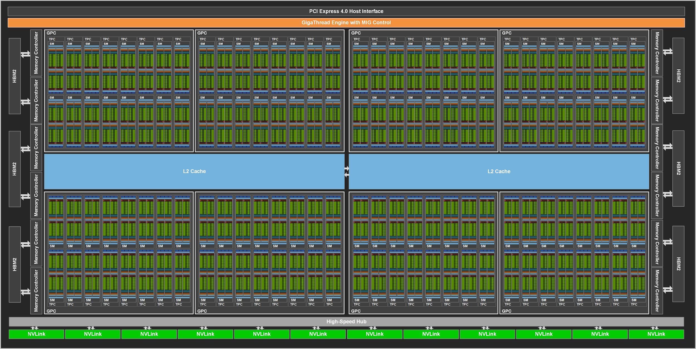
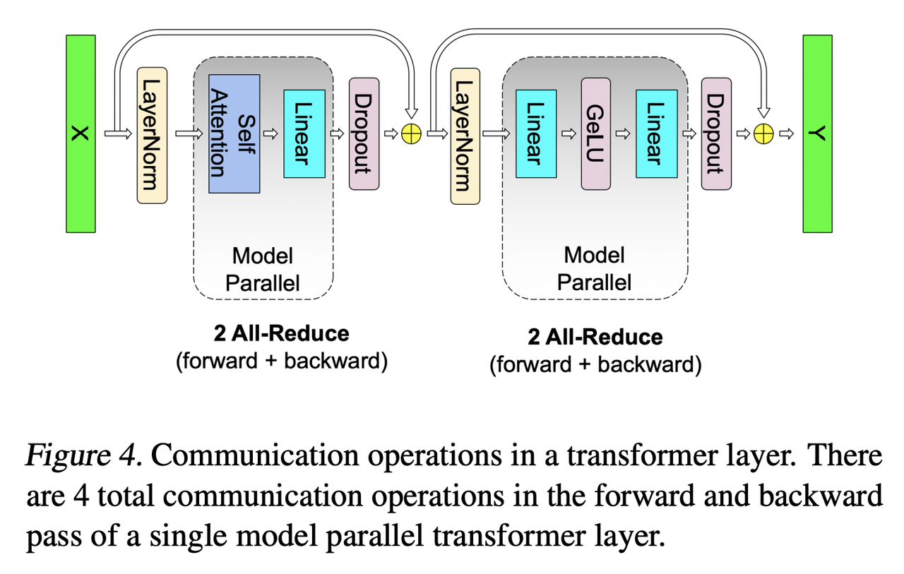
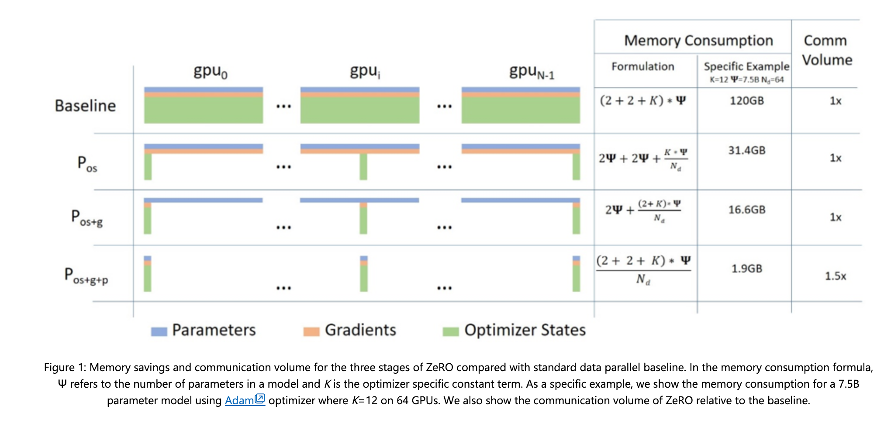
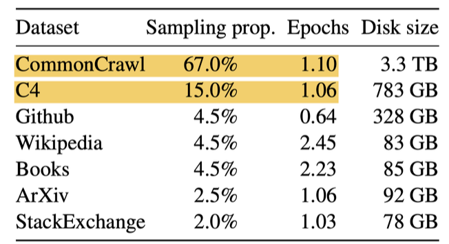

下载本文pdf：[https://github.com/daiwk/collections/blob/master/pdfs/llm_aigc.pdf](https://github.com/daiwk/collections/blob/master/pdfs/llm_aigc.pdf)

各种学习相关代码

[https://github.com/daiwk/llms_new](https://github.com/daiwk/llms_new)


# 从word2v到Transformer

## LSTM

[超生动图解LSTM和GRU，一文读懂循环神经网络！](https://mp.weixin.qq.com/s/vVDAB2U7478yOXUT9ByjFw)


## fasttext&word2vec

注：w2v训练时的内积不是2个emb-in的内积，而是emb-in和emb-out的内积

[fasttext源码解析](https://my.oschina.net/u/3800567/blog/2877570)

+ ```Dictionary::readWord```：空格分割，一次读出来一个word
+ ```Dictionary::add```：每个word求个hash，加进词典时，id就是从0开始的序号，同时记录一下词频
+ ```Dictionary::threshold```：按词频排序，扔掉低频词
+ ```Dictionary::initNgrams```：每个词，加上前缀BOW（<）和后缀（>），然后先扔进这个词的subwords里，然后再调用``` Dictionary::computeSubwords```把这个词的ngrams也扔进它的subwords里

整个词表，是word数+bucket这么大，其中bucket表示可容纳的subwords和wordNgrams的数量，默认200w


[为什么Word2Vec训练中, 需要对负采样权重开3/4次幂？](https://zhuanlan.zhihu.com/p/144563199?utm_id=0)

[Distributed Representations of Words and Phrases and their Compositionality](https://arxiv.org/pdf/1310.4546.pdf)里提到


通过对权重开3/4次幂，可以提升低频词被抽到的概率。在保证高频词容易被抽到的大方向下，通过权重3/4次幂的方式，适当提升低频词、罕见词被抽到的概率。如果不这么做，低频词，罕见词很难被抽到，以至于不被更新到对应的Embedding。

## BPE/WordPiece分词

[【Subword】深入理解NLP Subword算法：BPE、WordPiece、ULM](https://mp.weixin.qq.com/s/U9F8G-OUCb9kunTk_tZYFw)


## Transformer原理

[从三大顶会论文看百变Self-Attention](https://mp.weixin.qq.com/s/R9FoceRsPB3ceqKpnYPvbQ)

[包学包会，这些动图和代码让你一次读懂「自注意力」](https://mp.weixin.qq.com/s/Z0--eLLiFwfSuMvnddKGPQ)

[http://jalammar.github.io/illustrated-transformer/](http://jalammar.github.io/illustrated-transformer/)

[从熵不变性看Attention的Scale操作](https://kexue.fm/archives/8823)

[Transformers Assemble（PART I）](https://mp.weixin.qq.com/s/NZM05zyUkldOwpNIbsOtDQ) 讲了3篇

[Transformers Assemble（PART II）](https://mp.weixin.qq.com/s/JdUVaQ3IyrflHvxIk5jYbQ) 又讲了三篇

### 为什么层次化softmax没人用了

[Transformer 结构中最后一层 softmax 为什么不再使用 层次化softmax了呢？](https://www.zhihu.com/question/310845030/answer/595573391?hb_wx_block=0&utm_source=wechat_session&utm_medium=social&utm_oi=632586637935251456)

主要还是计算资源的问题。

Mikolov发明word2vec的几个版本大概在13-14年前后。那个时候GPU非常少见，印象里面CMU的NLP组没有GPU，Stanford NLP lab只有6块K40。

大规模直接算softmax是在google的14年那篇seq2seq做MT的文章。为了快，把一个softmax并行在4块GPU上，每个GPU负责四分之一。那个年代，大多数NLP组全组都不会有4块GPU。

hierarchical softmax是softmax的近似，suboptimal的。当如今计算资源足够大的时候，当然包括时间和显存 (BERT 和 Elmo 都没有用hierarchical)，hierarchical softmax就逐渐退出了历史舞台。

# 理解内容的仅编码器框架

## BERT

[BERT小学生级上手教程，从原理到上手全有图示，还能直接在线运行](https://mp.weixin.qq.com/s/ltVuXZ4nJh8Cb5X2UhB6tQ)

[BERT源码分析（PART I）](https://mp.weixin.qq.com/s/sSmTQ_cOLyAUV0aV0FkDvw)

[BERT源码分析（PART II）](https://mp.weixin.qq.com/s/1NDxWfBu_csu8qHV2tmmVQ)

[Dive into BERT：语言模型与知识](https://mp.weixin.qq.com/s/NjQtSKY85Np5IodRiKsrvg)

[关于BERT，面试官们都怎么问](https://mp.weixin.qq.com/s/c2PktKruzq_teXm3GAwe1Q)

主要讲了下面3篇：

[Language Models as Knowledge Bases?](https://arxiv.org/abs/1909.01066)

[Linguistic Knowledge and Transferability of Contextual Representations](https://arxiv.org/abs/1903.08855)

[What does BERT learn about the structure of language?](https://hal.inria.fr/hal-02131630/document)


[A Primer in BERTology: What we know about how BERT works](https://arxiv.org/pdf/2002.12327.pdf)

摘要：目前，基于 Transformer 的模型已经广泛应用于自然语言处理中，但我们依然对这些模型的内部工作机制知之甚少。在本文中，来自麻省大学洛威尔分校的研究者对流行的 BERT 模型进行综述，并综合分析了 40 多项分析研究。他们还概览了对模型和训练机制提出的改进，然后描画了未来的研究方向。

[Pre-trained Models for Natural Language Processing: A Survey](https://arxiv.org/abs/2003.08271)


[BERT系列文章汇总导读](https://mp.weixin.qq.com/s/oT2dtmfEQKyrpDTOrpzhWw)

[ALBERT、XLNet，NLP技术发展太快，如何才能跟得上节奏？](https://mp.weixin.qq.com/s/Toth-XKn2WKYkyDw6j5F3A)

[绝对干货！NLP预训练模型：从transformer到albert](https://mp.weixin.qq.com/s/Jgx9eHk9xiSOWEy0Ty3LoA)

[ALBERT一作蓝振忠：预训练模型应用已成熟，ChineseGLUE要对标GLUE基准](https://mp.weixin.qq.com/s/mvkFDy09BdKJC4Cja11PAA)

[有哪些令你印象深刻的魔改Transformer？](https://mp.weixin.qq.com/s/HS2tlT7t18cFytZVIsOXUg)

[BERT模型超酷炫，上手又太难？请查收这份BERT快速入门指南！](https://mp.weixin.qq.com/s/jVSW0KDhaXuaIeOzoPmCJA)


### multi-head att 实现

输入原始的query(即from_tensor)之后, 把```[batch, from_seq, emb]```变成```[?, emb]```，其中```?=batch*from_seq```

```python
from_tensor_2d = reshape_to_matrix(from_tensor)

def reshape_to_matrix(input_tensor):
    """Reshapes a >= rank 2 tensor to a rank 2 tensor (i.e., a matrix)."""
    ndims = input_tensor.shape.ndims
    if ndims < 2:
        raise ValueError("Input tensor must have at least rank 2. Shape = %s" %
            (input_tensor.shape))
    if ndims == 2:
        return input_tensor
    width = input_tensor.shape[-1]
output_tensor = tf.reshape(input_tensor, [-1, width])
    return output_tensor
```

然后再接一个fc，把```[?, emb]```变成```[?, head_num * per_head]```，一般```head_num * per_head=emb```。

```python
query_layer = tf.layers.dense(
        from_tensor_2d,
        num_attention_heads * size_per_head,
        activation=query_act,
        name="query",
        kernel_initializer=create_initializer(initializer_range))
```

因为```?=batch*from_seq```，所以可以直接做如下变换

```python
query_layer = transpose_for_scores(query_layer, batch_size,
        num_attention_heads, from_seq_length,
        size_per_head)
```

实际就是把```?```拆开成```batch, from_seq```，整个变成```[batch, from_seq, head_num, per_head]```，然后做了个 transpose，把1和2互换了下，得到```[batch, head_num, from_seq, per_head]```

```python
def transpose_for_scores(input_tensor, batch_size, num_attention_heads,
        seq_length, width):
    output_tensor = tf.reshape(
            input_tensor, [batch_size, seq_length, num_attention_heads, width])

    output_tensor = tf.transpose(output_tensor, [0, 2, 1, 3])
    return output_tensor
```

然后key也做完全一样的操作(不过处理的是to_tensor，如果是self-attention，那to_tensor=from_tensor), 得到```[batch, head_num, to_seq, per_head]```：

```python
to_tensor_2d = reshape_to_matrix(to_tensor)
key_layer = tf.layers.dense(
        to_tensor_2d,
        num_attention_heads * size_per_head,
        activation=key_act,
        name="key",
        kernel_initializer=create_initializer(initializer_range))

key_layer = transpose_for_scores(key_layer, batch_size, num_attention_heads,
        to_seq_length, size_per_head)
```

然后就算$$QK^T$$了，注意这里对key取了转置，也就是```[batch, head_num, from_seq, per_head]```乘以```[batch, head_num, per_head, to_seq]```，得到的结果是```[batch, head_num, from_seq, to_seq]```：

```python
attention_scores = tf.matmul(query_layer, key_layer, transpose_b=True)
attention_scores = tf.multiply(attention_scores,
    1.0 / math.sqrt(float(size_per_head)))

if attention_mask is not None:
    # `attention_mask` = [B, 1, F, T]
    attention_mask = tf.expand_dims(attention_mask, axis=[1])

    # Since attention_mask is 1.0 for positions we want to attend and 0.0 for
    # masked positions, this operation will create a tensor which is 0.0 for
    # positions we want to attend and -10000.0 for masked positions.
    adder = (1.0 - tf.cast(attention_mask, tf.float32)) * -10000.0

    # Since we are adding it to the raw scores before the softmax, this is
    # effectively the same as removing these entirely.
    attention_scores += adder
attention_probs = tf.nn.softmax(attention_scores)
attention_probs = dropout(attention_probs, attention_probs_dropout_prob)
```

然后看下value的操作：

```python
value_layer = tf.layers.dense(
        to_tensor_2d,
        num_attention_heads * size_per_head,
        activation=value_act,
        name="value",
        kernel_initializer=create_initializer(initializer_range))

# `value_layer` = [batch, to_seq, head_num, per_head]
value_layer = tf.reshape(
            value_layer,
            [batch_size, to_seq_length, num_attention_heads, size_per_head])

# `value_layer` = [batch, head_num, to_seq, per_head]
value_layer = tf.transpose(value_layer, [0, 2, 1, 3])

# `context_layer` = [batch, head_num, from_seq, per_head]
context_layer = tf.matmul(attention_probs, value_layer)

# `context_layer` = [batch, from_seq, head_num, per_head]
context_layer = tf.transpose(context_layer, [0, 2, 1, 3])
```

再确认一点，$$softmax(QK^T)$$是```[batch, head_num, from_seq, to_seq]```，而$$V$$是```[batch, head_num, to_seq, per_head]```，所以context_layer是```[batch, head_num, from_seq, per_head]```

最后，再搞一下，变回```[batch, from_seq, head_num * per_head]```：

```python
if do_return_2d_tensor:
# `context_layer` = [B*F, N*H]
    context_layer = tf.reshape(
        context_layer,
        [batch_size * from_seq_length, num_attention_heads * size_per_head])
else:
# `context_layer` = [B, F, N*H]
    context_layer = tf.reshape(
        context_layer,
        [batch_size, from_seq_length, num_attention_heads * size_per_head])
```

如上过程是$$Concat(head_1, ..., head_h)$$，其中$$head_i = Attention(QW_i^Q, KW_i^K, VW_i^V)$$。包装在了函数```attention_layer```之中，我们注意到原文还有一个大小为$$hd_v \times d_{model}$$的$$W^O$$，也就是大小为$$d_{model}\times d_{model}$$，再看看源码。。也就是说，正常的bert里，```attention_heads```就只有一个元素，然后接了个```hidden_size```的fc，而前面的代码里也提到了```hidden_size```正好就是$$d_{model}$$，所以这就是$$W^O$$。

```python
attention_heads = []
with tf.variable_scope("self"):
    attention_head = attention_layer(xxxxx)
    attention_heads.append(attention_head)
    attention_output = None
    if len(attention_heads) == 1:
        attention_output = attention_heads[0]
    else:
        # In the case where we have other sequences, we just concatenate
        # them to the self-attention head before the projection.
        attention_output = tf.concat(attention_heads, axis=-1)
    # Run a linear projection of `hidden_size` then add a residual
    # with `layer_input`.
    with tf.variable_scope("output"):
        attention_output = tf.layers.dense(
            attention_output,
            hidden_size,
            kernel_initializer=create_initializer(initializer_range))
        attention_output = dropout(attention_output, hidden_dropout_prob)
        attention_output = layer_norm(attention_output + layer_input)

```

关于 mask，可以看看这个[https://juejin.im/post/5b9f1af0e51d450e425eb32d](https://juejin.im/post/5b9f1af0e51d450e425eb32d)

摘抄一下：

什么是padding mask呢？回想一下，我们的每个批次输入序列长度是不一样的！也就是说，我们要对输入序列进行对齐！具体来说，就是给在较短的序列后面填充0。因为这些填充的位置，其实是没什么意义的，所以我们的attention机制不应该把注意力放在这些位置上，所以我们需要进行一些处理。
具体的做法是，把这些位置的值加上一个非常大的负数(可以是负无穷)，这样的话，经过softmax，这些位置的概率就会接近0！

而sequence mask是为了使得decoder不能看见未来的信息。也就是对于一个序列，在time_step为t的时刻，我们的解码输出应该只能依赖于t时刻之前的输出，而不能依赖t之后的输出。因此我们需要想一个办法，把t之后的信息给隐藏起来。
那么具体怎么做呢？也很简单：产生一个上三角矩阵，上三角的值全为1，下三角的值权威0，对角线也是0。把这个矩阵作用在每一个序列上，就可以达到我们的目的啦。

### masked-language-model的实现

[https://github.com/google-research/bert/blob/eedf5716ce1268e56f0a50264a88cafad334ac61/run_pretraining.py#L240](https://github.com/google-research/bert/blob/eedf5716ce1268e56f0a50264a88cafad334ac61/run_pretraining.py#L240)


如下，其中```hidden_size```就是是$$d_{model}$$：

```python
def get_masked_lm_output(bert_config, input_tensor, output_weights, positions,
                         label_ids, label_weights):
  """Get loss and log probs for the masked LM."""
  input_tensor = gather_indexes(input_tensor, positions)

  with tf.variable_scope("cls/predictions"):
    # We apply one more non-linear transformation before the output layer.
    # This matrix is not used after pre-training.
    with tf.variable_scope("transform"):
      input_tensor = tf.layers.dense(
          input_tensor,
          units=bert_config.hidden_size,
          activation=modeling.get_activation(bert_config.hidden_act),
          kernel_initializer=modeling.create_initializer(
              bert_config.initializer_range))
      input_tensor = modeling.layer_norm(input_tensor)

    # The output weights are the same as the input embeddings, but there is
    # an output-only bias for each token.
    output_bias = tf.get_variable(
        "output_bias",
        shape=[bert_config.vocab_size],
        initializer=tf.zeros_initializer())
    logits = tf.matmul(input_tensor, output_weights, transpose_b=True)
    logits = tf.nn.bias_add(logits, output_bias)
    log_probs = tf.nn.log_softmax(logits, axis=-1)

    label_ids = tf.reshape(label_ids, [-1])
    label_weights = tf.reshape(label_weights, [-1])

    one_hot_labels = tf.one_hot(
        label_ids, depth=bert_config.vocab_size, dtype=tf.float32)

    # The `positions` tensor might be zero-padded (if the sequence is too
    # short to have the maximum number of predictions). The `label_weights`
    # tensor has a value of 1.0 for every real prediction and 0.0 for the
    # padding predictions.
    per_example_loss = -tf.reduce_sum(log_probs * one_hot_labels, axis=[-1])
    numerator = tf.reduce_sum(label_weights * per_example_loss)
    denominator = tf.reduce_sum(label_weights) + 1e-5
    loss = numerator / denominator

  return (loss, per_example_loss, log_probs)
```

其中的gather如下：

```python
def gather_indexes(sequence_tensor, positions):
  """Gathers the vectors at the specific positions over a minibatch."""
  sequence_shape = modeling.get_shape_list(sequence_tensor, expected_rank=3)
  batch_size = sequence_shape[0]
  seq_length = sequence_shape[1]
  width = sequence_shape[2]

  flat_offsets = tf.reshape(
      tf.range(0, batch_size, dtype=tf.int32) * seq_length, [-1, 1])
  flat_positions = tf.reshape(positions + flat_offsets, [-1])
  flat_sequence_tensor = tf.reshape(sequence_tensor,
                                    [batch_size * seq_length, width])
  output_tensor = tf.gather(flat_sequence_tensor, flat_positions)
  return output_tensor
```

注意调用时传的是如下参数

```python
    (masked_lm_loss,
     masked_lm_example_loss, masked_lm_log_probs) = get_masked_lm_output(
         bert_config, model.get_sequence_output(), model.get_embedding_table(),
         masked_lm_positions, masked_lm_ids, masked_lm_weights)
```

### BERT的可解释性

[ACL 2019 \| 理解 BERT 每一层都学到了什么](https://mp.weixin.qq.com/s/w2Cwo--GTKp5o8YKRtbl7g)

[What does BERT learn about the structure of language?](https://hal.inria.fr/hal-02131630/document)

探索BERT深层次的表征学习是一个非常有必要的事情，一是这可以帮助我们更加清晰地认识BERT的局限性，从而改进BERT或者搞清楚它的应用范围；二是这有助于探索BERT的可解释性

## 更复杂的BERT

[站在BERT肩膀上的NLP新秀们（PART III）](https://mp.weixin.qq.com/s/CxcyX5V9kBQDW8A4g0uGNA)

[BERT时代与后时代的NLP](https://mp.weixin.qq.com/s/U_pYc5roODcs_VENDoTbiQ)

[美团BERT的探索和实践](https://mp.weixin.qq.com/s/qfluRDWfL40E5Lrp5BdhFw)

[Bert时代的创新（应用篇）：Bert在NLP各领域的应用进展](https://mp.weixin.qq.com/s/dF3PtiISVXadbgaG1rCjnA)

### 中文BERT

#### WWM

[哈工大讯飞联合实验室发布基于全词覆盖的中文BERT预训练模型](https://mp.weixin.qq.com/s?__biz=MzIxMjAzNDY5Mg==&mid=2650794872&idx=1&sn=dccd856283bdd4edcdad08cf75506697&chksm=8f477e93b830f7850e6c0ffe684264f704c6fcc4e126a6300b5ae33916aa676a279206e1e4ce&mpshare=1&scene=1&srcid=0701DAFsQt28gF1hGzH4llaM&pass_ticket=8wChBZeeRNV5mWLFKMXfVyWjwTb94XookbbSJiYpmEClqUrpybiGPpfilXkL5UQN#rd)

[https://github.com/ymcui/Chinese-BERT-wwm](https://github.com/ymcui/Chinese-BERT-wwm)

论文：[Pre-Training with Whole Word Masking for Chinese BERT](https://arxiv.org/abs/1906.08101)

#### ERNIE

参考[中文任务全面超越BERT：百度正式发布NLP预训练模型ERNIE](https://mp.weixin.qq.com/s?__biz=MzA3MzI4MjgzMw==&mid=2650758722&idx=1&sn=6742b0f86982890d78cb3ec3be9865b3&scene=0#wechat_redirect)

[ERNIE: Enhanced Representation through Knowledge Integration](https://arxiv.org/pdf/1904.09223.pdf)

使用entity-level masking和phrase-level masking两种mask方法

输入的每个样本由5个 ';' 分隔的字段组成，数据格式：

+ token_ids
+ sentence_type_ids：两句话，第一句都是0，第二句都是1
+ position_ids
+ seg_labels：分词边界信息: 0表示词首、1表示非词首、-1为占位符, 其对应的词为 CLS 或者 SEP；
+ next_sentence_label

例如：

```shell
1 1048 492 1333 1361 1051 326 2508 5 1803 1827 98 164 133 2777 2696 983 121 4 19 9 634 551 844 85 14 2476 1895 33 13 983 121 23 7 1093 24 46 660 12043 2 1263 6 328 33 121 126 398 276 315 5 63 44 35 25 12043 2;0 0 0 0 0 0 0 0 0 0 0 0 0 0 0 0 0 0 0 0 0 0 0 0 0 0 0 0 0 0 0 0 0 0 0 0 0 0 0 0 1 1 1 1 1 1 1 1 1 1 1 1 1 1 1 1;0 1 2 3 4 5 6 7 8 9 10 11 12 13 14 15 16 17 18 19 20 21 22 23 24 25 26 27 28 29 30 31 32 33 34 35 36 37 38 39 40 41 42 43 44 45 46 47 48 49 50 51 52 53 54 55;-1 0 0 0 0 1 0 1 0 0 1 0 0 1 0 1 0 0 0 0 0 0 1 0 1 0 0 1 0 1 0 0 0 0 1 0 0 0 0 -1 0 0 0 1 0 0 1 0 1 0 0 1 0 1 0 -1;0
```

和bert在mask上的区别：


一个句子的不同level的mask方式：


[ERNIE 2.0: A CONTINUAL PRE-TRAINING FRAMEWORK FOR LANGUAGE UNDERSTANDING](https://arxiv.org/pdf/1907.12412v1.pdf)


### 跨语言

#### XLM

[Massively Multilingual Sentence Embeddings for Zero-Shot Cross-Lingual Transfer and Beyond](https://arxiv.org/abs/1812.10464)，XLM的主要思想还是来自于这篇文章，借用了BERT的框架最后成了XLM。本文提出了LASER（Language-Agnostic SEntence Representations）

XLM：facebook提出[Cross-lingual Language Model Pretraining](https://arxiv.org/abs/1901.07291)，加了language emb

+ 无监督的方法：只依赖单语种数据（monolingual data）
+ 有监督的方法：对平行语料使用新的跨语言loss


[Facebook最新语言模型XLM-R：多项任务刷新SOTA，超越单语BERT](https://mp.weixin.qq.com/s/6oK-gevKLWDwdOy4aI7U7g)

XLM-R

[Unsupervised Cross-lingual Representation Learning at Scale](https://arxiv.org/abs/1911.02116)

来自facebook。针对多种跨语言的传输任务，大规模地对多语言语言模型进行预训练可以显著提高性能。在使用超过 2TB 的已过滤 CommonCrawl 数据的基础上，研究者在 100 种语言上训练了基于 Transformer 的掩模语言模型。该模型被称为 XLM-R，在各种跨语言基准测试中，其性能显著优于多语言 BERT（mBERT），其中 XNLI 的平均准确度为+ 13.8％，MLQA 的平均 F1 得分为+ 12.3％，而 FQ 的平均 F1 得分为+ 2.1％ NER。XLM-R 在低资源语言上表现特别出色，与以前的 XLM 模型相比，斯瓦希里语（Swahili）的 XNLI 准确性提升了 11.8％，乌尔都语（Urdu）的准确性提升了 9.2％。研究者还对获得这些提升所需的关键因素进行了详细的实证评估，包括（1）积极转移和能力稀释；（2）大规模资源资源的高低性能之间的权衡。最后，他们首次展示了在不牺牲每种语言性能的情况下进行多语言建模的可能性。XLM-Ris 在 GLUE 和 XNLI 基准测试中具有强大的单语言模型，因此非常具有竞争力。

#### MASS

[MASS: Masked Sequence to Sequence Pre-training for Language Generation](https://arxiv.org/abs/1905.02450v5)

bert只使用了Transformer的encoder部分，其下游任务也主要是适用于自然语言理解（NLU），对于类似文本摘要、机器翻译、对话应答生成等自然语言生成（NLG）任务显然是不太合适的。MASS 采用了编码器-解码器框架，并尝试在给定部分句子的情况下修复整个句子。如下所示为 MASS 的框架图，其输入句子包含了一些连续的 Token，并且中间会带有一些连续的 Mask，模型的任务是预测出被 Mask 掉的词是什么。相比 BERT 只有编码器，MASS 联合训练编码器与解码器，能获得更适合机器翻译的表征能力。


受到bert的启发，作者们提出联合训练encoder和decoder的模型

训练步骤主要分为两步：

+ Encoder： 输入为被随机mask掉连续部分token的句子，使用Transformer对其进行编码；这样处理的目的是可以使得encoder可以更好地捕获没有被mask掉词语信息用于后续decoder的预测；
+ Decoder： 输入为与encoder同样的句子，但是mask掉的正好和encoder相反，和翻译一样，使用attention机制去训练，但只预测encoder端被mask掉的词。该操作可以迫使decoder预测的时候更依赖于source端的输入而不是前面预测出的token，防止误差传递。

### 更长序列

#### transformer-xl

[Transformer-XL: Attentive Language Models Beyond a Fixed-Length Context](https://arxiv.org/pdf/1901.02860.pdf)


最简单的处理长文本方法：对长文本直接切成多个segment，每个segment独立过transformer，**segment间是没有信息流动的**


transformer-xl的处理方法：参考RNN的**隐藏记忆单元**，对**上一个segment**计算的隐藏状态序列进行**fixed和cached**，并在模型处理下一个新的segment时将其缓存为**可重用的扩展上下文**。

如图，第k+1层的第i个元素，用到了第k层的第i-1, i-2, ...,i - segment_len+1这几个元素，所以**对于最顶层的来讲，实际看到的窗口就更长了**。为此还提出了**相对位置编码**，即使用两个token的**相对距离**代替之前的绝对位置。

此外，[Stabilizing Transformers for Reinforcement Learning](https://arxiv.org/abs/1910.06764)说明了为什么标准的transformer架构很难在强化学习中优化。研究者同时提出了一种架构Gated Transformer-XL(GTrXL)，可以很好地提升transformer架构和变体的稳定性，并加速学习，可以超过LSTM，在多任务学习 DMLab-30 基准上达到 SOTA 的水平。

#### XLNet

[XLNet : 运行机制及和 Bert 的异同比较](https://mp.weixin.qq.com/s/VCCZOKJOhCEjxfnoLSuRKA)

[Transformer-XL与XLNet笔记](https://mp.weixin.qq.com/s/g7I_V5a3Puy9uK11A--Xqw)

[什么是XLNet中的双流自注意力](https://mp.weixin.qq.com/s/9QmhN4KfukCtAxzprKDbAQ)

[20项任务全面碾压BERT，CMU全新XLNet预训练模型屠榜（已开源）](https://mp.weixin.qq.com/s?__biz=MzA3MzI4MjgzMw==&mid=2650764408&idx=1&sn=92196097be1a5f993ef02de0bac8128d&chksm=871ab006b06d3910ec88e57598d6c8b1a38dead073b3f417b793ba71ac4750ae2a8263537fa2&mpshare=1&scene=1&srcid=&pass_ticket=%2BD9Ask8qPVeDCkEHTF8NEBVBQX9YmDDkPy9VdMIfOYJ2VtpyHOOhIYdS3wUnvPjn#rd)

参考[拆解XLNet模型设计，回顾语言表征学习的思想演进](https://mp.weixin.qq.com/s?__biz=MzA3MzI4MjgzMw==&mid=2650765039&idx=3&sn=5f21b702a06b2b3c12c1e5f327c0b744&chksm=871ab291b06d3b87a7b35ff2e69bbaa6863e7737510783f0d7913bc575e759a6662242e6b97a&scene=0&xtrack=1&pass_ticket=6OQo9SLhUprzhz9WVqt5LanZi%2Bu5pLbXWpLouCtQ6gkfTHAGY5Li3M%2BDR0n3drA2#rd)

[他们创造了横扫NLP的XLNet：专访CMU博士杨植麟](https://mp.weixin.qq.com/s?__biz=MzA3MzI4MjgzMw==&mid=2650767073&idx=1&sn=3a1014852f0ba8caaee9fdfadd344503&chksm=871aba9fb06d33891731e38d7ca2010516a73cff72c1569c89962160d0fc15ef0b747f9ff7f5&scene=0&xtrack=1&pass_ticket=Kz97uXi0CH4ceADUC3ocCNkjZjy%2B0DTtVYOM7n%2FmWttTt5YKTC2DQT9lqCel7dDR#rd)

[XLNet: Generalized Autoregressive Pretraining for Language Understanding](https://arxiv.org/pdf/1906.08237.pdf)

代码：[https://github.com/zihangdai/xlnet](https://github.com/zihangdai/xlnet)

+ 自回归（autoregressive, AR）：主要的论文有这几篇：[Semi-supervised sequence learning](https://arxiv.org/abs/1511.01432)、[Deep contextualized word representations](https://arxiv.org/abs/1802.05365)、[Improving language understanding by generative pre-training](https://s3-us-west-2.amazonaws.com/openai-assets/research-covers/language-unsupervised/language_understanding_paper.pdf)。通过一个autoregressive的模型来估计文本语料库的概率分布。也就是给定一个文本序列$$\mathbf{x}=\left(x_{1}, \cdots, x_{T}\right)$$，AR将likelihood因式分解(factorize)成一个前向的乘积$$p(\mathbf{x})=\prod_{t=1}^{T} p\left(x_{t} | \mathbf{x}_{<t}\right)$$，或者是一个后向的乘积$$p(\mathbf{x})=\prod_{t=T}^{1} p\left(x_{t} | \mathbf{x}_{>t}\right)$$。由于 AR 语言模型仅被训练用于编码**单向(uni-directional)语境（前向或后向）**，因而在深度双向语境建模中效果不佳。而下游语言理解任务通常需要双向语境信息，导致 AR 语言建模无法实现有效预训练。
+ 自编码（autoencoding, AE）：相关的预训练模型不会进行明确的密度估计(explicit density estimation)，而是从残缺的(corrupted)输入中**重建原始数据**。例如bert，使用一定比例的```[MASK]```，然后预测被mask掉的是什么东西。由于目标并不是密度估计，所以在重建的时候，可以考虑双向的上下文信息。但存在如下两个问题：
    + **finetune**时的真实数据**缺少**预训练期间使用的```[MASK]```这些**mask信息**，这导致**预训练和微调效果的差异（pretrain-finetune discrepancy）**。
    + 输入中要预测的token是被mask掉的，所以无法像AR那样使用乘积rule来建立联合概率分布。也就是说，给定未mask的 token，BERT**假设预测的token**之间**彼此独立**，这其实是对自然语言中普遍存在的**高阶、长期依赖关系**的一种**过度简化**。

基于这些优缺点，提出了一种泛化的自回归预训练模型XLNet：

+ Permutation Language Model(PLM)：在自回归LM模式下，最大化所有可能的**因式分解顺序**的对数似然，学习双向语境信息；
    + 把原来的```[MASK]```这个token干掉了，转而用attention mask来搞
    + 引入了排列：即原来是1234，可以输入3241，这个时候改一下mask就行
+ 引入了Transformer-XL的主要思路：**相对位置编码**以及**分段RNN机制**，实践已经证明这两点对于长文档任务是很有帮助的


### 更多的任务

#### MT-DNN

[Multi-Task Deep Neural Networks for Natural Language Understanding](https://arxiv.org/abs/1901.11504)

### 其他改进

#### RoBERTa

参考[重回榜首的BERT改进版开源了，千块V100、160GB纯文本的大模型](https://mp.weixin.qq.com/s?__biz=MzA3MzI4MjgzMw==&mid=2650766934&idx=2&sn=54c479dd8e8e69cd9617b9a1962443e1&chksm=871aba28b06d333e0d5dc64754b7280776ba5c17577831077dc5cd2caa4c2335beec3afd8d34&scene=0&xtrack=1&pass_ticket=zAXdHORK5tTx549e9RwAgNcm7bjJrH4ENwbbTYVrAZDqpsE%2Fu1hY63b%2FoRfnZQdM#rd)

[RoBERTa: A Robustly Optimized BERT Pretraining Approach](https://arxiv.org/pdf/1907.11692.pdf)

+ 修改了一些超参
+ 删掉nsp任务
+ 更大的batchsize和学习率


[RoBERTa中文预训练模型，你离中文任务的「SOTA」只差个它](https://mp.weixin.qq.com/s/EKFa40rLQlnEVuu9V7GDmg)

[https://github.com/brightmart/roberta_zh](https://github.com/brightmart/roberta_zh)


#### DeBERTa

[Deberta: Decoding-enhanced bert with disentangled attention](https://arxiv.org/pdf/2006.03654.pdf)

+ disentangled attention mechanism：每个词使用2个向量，$$H$$编码内容，$$P$$编码相对位置，i和j间的attention如下：

$$
\begin{array}{r}
\mathrm{A}_{\mathrm{i}, \mathrm{j}}=\left\{\mathrm{H}_{\mathrm{i}}, \mathrm{P}_{\mathrm{i} \mid \mathrm{j}}\right\} \times\left\{\mathrm{H}_{\mathrm{j}}, \mathrm{P}_{\mathrm{j} \mid \mathrm{i}}\right\}^{\mathrm{T}} \\
=\mathrm{H}_{\mathrm{i}} \mathrm{H}_{\mathrm{j}}^{\mathrm{T}}+\mathrm{H}_{\mathrm{i}} \mathrm{P}_{\mathrm{j} \mid \mathrm{i}}^{\mathrm{T}}+\mathrm{P}_{\mathrm{i} \mid \mathrm{j}} \mathrm{H}_{\mathrm{j}}^{\mathrm{T}}+\mathrm{P}_{\mathrm{i} \mid \mathrm{j}} \mathrm{P}_{\mathrm{j} \mid \mathrm{i}}^{\mathrm{T}}
\end{array}
$$

+ 预训练：使用enhanced mask decoder，把绝对位置信息引入解码层，来预估被mask掉的token
+ finetune：virtual adversarial training

#### ELECTRA

[2019最佳预训练模型：非暴力美学，1/4算力超越RoBERTa](https://mp.weixin.qq.com/s/_R-Bp5lLov-QIoPRl6fFMA)

[ELECTRA: 超越BERT, 19年最佳NLP预训练模型](https://mp.weixin.qq.com/s/fR5OrqxCv0udKdyh6CHOjA)

[ELECTRA: pre-training text encoders as discriminators rather than generators](https://openreview.net/pdf?id=r1xmh1btvb)

使用新的预训练task：RTD(replaced token detection)：

+ 使用一个**生成网络**采样出token，替换一些原有的token
+ 训练一个**判别模型**，预估一个token**是否是被替换的**

RTD比MLM**更sample-efficient**，因为RTD只做二分类，而MLM需要做全词表的softmax

## 更小的BERT

[BERT 瘦身之路：Distillation，Quantization，Pruning](https://mp.weixin.qq.com/s/ir3pLRtIaywsD94wf9npcA)

### albert

[刚刚，Google发布24个小型BERT模型，直接通过MLM损失进行预训练](https://mp.weixin.qq.com/s/s0ysFH4CRvsHY1Gp3b4DPQ)

[ALBERT：用于语言表征自监督学习的轻量级 BERT](https://mp.weixin.qq.com/s/0V-051qkTk9EYiuEWYE3jQ)

[谷歌ALBERT模型V2+中文版来了：之前刷新NLP各大基准，现在GitHub热榜第二](https://mp.weixin.qq.com/s/nusSlw28h4bOlw5hDsc-Iw)

[超小型BERT中文版横空出世！模型只有16M，训练速度提升10倍](https://mp.weixin.qq.com/s/eVlNpejrxdE4ctDTBM-fiA)

[https://github.com/brightmart/albert_zh](https://github.com/brightmart/albert_zh)


[预训练小模型也能拿下13项NLP任务，谷歌ALBERT三大改造登顶GLUE基准](https://mp.weixin.qq.com/s/kvSoDr0E_mvsc7lcLNKmgg)

ALBERT 模型在 GLUE、RACE 和 SQuAD 基准测试上都取得了新的 SOTA 效果，并且参数量还少于 BERT-large。

[ALBERT: a lite bert for self-supervised learning of language representations](https://openreview.net/pdf?id=H1eA7AEtvS)

通过对词嵌入矩阵进行因式分解，再为下游任务共享不同层的所有参数，这样可以大大降低 BERT 的参数量。

还提出了一种新型句间连贯性损失函数，它可以强迫模型学习句间的连贯性表达，从而有利于各种下游 NLP 任务。

ALBERT 通过两个参数削减技术克服了扩展预训练模型面临的主要障碍。

+ 对嵌入参数化进行因式分解：将大的嵌入矩阵分解为两个小的矩阵，从而将隐藏层的大小与词汇嵌入的大小分离开来。这种分离使得隐藏层的增加更加容易，同时不显著增加词汇嵌入的参数量。
+ 跨层参数共享：避免参数量随着网络深度的增加而增加。

两种技术都显著降低了 BERT 的参数量，同时不对其性能造成明显影响，从而提升了参数效率。ALBERT 的配置类似于 BERT-large，但参数量仅为后者的 1/18，训练速度却是后者的 1.7 倍。这些参数削减技术还可以充当某种形式的正则化，可以使训练更加稳定，而且有利于泛化。

为了进一步提升 ALBERT 的性能，还引入了一个自监督损失函数，用于句子级别的预测（SOP）。SOP 主要聚焦于**句间连贯**，用于解决原版 BERT 中下一句预测（NSP）损失低效的问题。

albert_tiny：

input_ids先查word_embeddings(`\(V\times E=21118*128)`)，得到dim=128的表示，再查word_embeddings_2(`\(E\times M =128*312\)`)，得到dim=312的表示。

搞positionembedding时，并不用输入0 1 2...，只需要做一些slice的变换就行了

```python
    with tf.control_dependencies([assert_op]):
      full_position_embeddings = tf.get_variable(
          name=position_embedding_name,
          shape=[max_position_embeddings, width],
          initializer=create_initializer(initializer_range))
      # Since the position embedding table is a learned variable, we create it
      # using a (long) sequence length `max_position_embeddings`. The actual
      # sequence length might be shorter than this, for faster training of
      # tasks that do not have long sequences.
      #    
      # So `full_position_embeddings` is effectively an embedding table
      # for position [0, 1, 2, ..., max_position_embeddings-1], and the current
      # sequence has positions [0, 1, 2, ... seq_length-1], so we can just
      # perform a slice.
      position_embeddings = tf.slice(full_position_embeddings, [0, 0],
                                     [seq_length, -1]) 
      num_dims = len(output.shape.as_list())

      # Only the last two dimensions are relevant (`seq_length` and `width`), so
      # we broadcast among the first dimensions, which is typically just
      # the batch size.
      position_broadcast_shape = [] 
      for _ in range(num_dims - 2):
        position_broadcast_shape.append(1)
      position_broadcast_shape.extend([seq_length, width])
      position_embeddings = tf.reshape(position_embeddings,
                                       position_broadcast_shape)
      output += position_embeddings
```

然后会通过create_attention_mask_from_input_mask把input_ids和input_mask搞一下，得到attention_mask去和attention做mask，主要是算loss啥的，把后面的mask掉不算

### distillbert

参考[小版BERT也能出奇迹：最火的预训练语言库探索小巧之路](https://mp.weixin.qq.com/s/a0d0b1jSm5HxHso9Lz8MSQ)

1.4w个stars。。

[https://huggingface.co/transformers](https://huggingface.co/transformers)

[DistilBERT, a distilled version of BERT: smaller, faster, cheaper and lighter](https://arxiv.org/abs/1910.01108)


### tinybert

[TinyBERT：模型小7倍，速度快8倍，华中科大、华为出品](https://mp.weixin.qq.com/s/VL7TSHmZPKD-xGdOxNmnHw)

[TinyBERT: Distilling BERT for Natural Language Understanding](https://arxiv.org/abs/1909.10351)

提出了一个two-stage learning framework，在pre-training阶段和task-specific阶段都进行distill。

相比baseline，只有28% parameters和31%的inference时间

在glue上，7.5x小，infer上有9.4x快。

[哪吒”出世！华为开源中文版BERT模型](https://mp.weixin.qq.com/s/He6Xujoe5Ieo95Tshx7PnA)

[NEZHA: Neural Contextualized Representation for Chinese Language Understanding](https://arxiv.org/abs/1909.00204)

[https://github.com/huawei-noah/Pretrained-Language-Model](https://github.com/huawei-noah/Pretrained-Language-Model)

[华为诺亚方舟开源哪吒、TinyBERT模型，可直接下载使用](https://mp.weixin.qq.com/s/cqYWllVCgWwGfAL-yX7Dww)


### reformer

[哈希革新Transformer：这篇ICLR高分论文让一块GPU处理64K长度序列](https://mp.weixin.qq.com/s/QklCVuukfElVDBFNxLXNKQ)

[Reformer: The Efficient Transformer](https://openreview.net/forum?id=rkgNKkHtvB)

[https://github.com/google/trax/blob/master/trax/models/research/reformer.py](https://github.com/google/trax/blob/master/trax/models/research/reformer.py)

大型的 Transformer 往往可以在许多任务上实现 sota，但训练这些模型的成本很高，尤其是在序列较长的时候。在 ICLR 的入选论文中，我们发现了一篇由谷歌和伯克利研究者发表的优质论文。文章介绍了两种提高 Transformer 效率的技术，最终的 Reformer 模型和 Transformer 模型在性能上表现相似，并且在长序列中拥有更高的存储效率和更快的速度。论文最终获得了「8，8，6」的高分。在最开始，文章提出了将点乘注意力（dot-product attention）替换为一个使用局部敏感哈希（locality-sensitive hashing）的点乘注意力，将复杂度从 O(L2 ) 变为 O(L log L)，此处 L 指序列的长度。此外，研究者使用可逆残差（reversible residual layers）代替标准残差（standard residuals），这使得存储在训练过程中仅激活一次，而不是 n 次（此处 n 指层数）。最终的 Reformer 模型和 Transformer 模型在性能上表现相同，同时在长序列中拥有更高的存储效率和更快的速度。

[大幅减少GPU显存占用：可逆残差网络(The Reversible Residual Network)](https://mp.weixin.qq.com/s/j6-x9ANF9b3Q1I_os_LJSw)

### LTD-bert

[内存用量1/20，速度加快80倍，腾讯QQ提出全新BERT蒸馏框架，未来将开源](https://mp.weixin.qq.com/s/W668zeWuNsBKV23cVR0zZQ)

### Q-bert

[AAAI 2020 \| 超低精度量化BERT，UC伯克利提出用二阶信息压缩神经网络](https://mp.weixin.qq.com/s/0qBlnsUqI2I-h-pFSgcQig)

[Q-BERT: Hessian Based Ultra Low Precision Quantization of BERT](https://arxiv.org/pdf/1909.05840.pdf)

### Adabert

[推理速度提升29倍，参数少1/10，阿里提出AdaBERT压缩方法](https://mp.weixin.qq.com/s/mObuD4ijUCjnebYIrjvVdw)

[AdaBERT: Task-Adaptive BERT Compression with Differentiable Neural Architecture Search](https://arxiv.org/pdf/2001.04246v1.pdf)


## sentence Transformers

[俄罗斯套娃 (Matryoshka) 嵌入模型概述](https://mp.weixin.qq.com/s/H3LWIs4hBQ-b_XLxICw7Dg)

[Matryoshka representation learning](https://arxiv.org/pdf/2205.13147.pdf)

俄罗斯套娃嵌入模型旨在将**更重要的信息存储在早期的维度中**，将不太重要的信息存储在后面的维度中。俄罗斯套娃嵌入模型的这一特点允许我们截断模型产生的原始 (大) 嵌入，同时仍保留足够的信息以在下游任务上表现良好。


[https://sbert.net/examples/training/matryoshka/README.html](https://sbert.net/examples/training/matryoshka/README.html)

训练时：

```python
from sentence_transformers import SentenceTransformer
from sentence_transformers.losses import CoSENTLoss, MatryoshkaLoss

model = SentenceTransformer("microsoft/mpnet-base")

base_loss = CoSENTLoss(model=model)
loss = MatryoshkaLoss(
    model=model,
    loss=base_loss,
    matryoshka_dims=[768, 512, 256, 128, 64],
    matryoshka_weight=[1, 1, 1, 1, 1],
)

model.fit(
    train_objectives=[(train_dataset, loss)],
    ...,
)
```

预测时

```python
from sentence_transformers import SentenceTransformer
from sentence_transformers.util import cos_sim

model = SentenceTransformer("tomaarsen/mpnet-base-nli-matryoshka")

matryoshka_dim = 64
embeddings = model.encode(
    [
        "The weather is so nice!",
        "It's so sunny outside!",
        "He drove to the stadium.",
    ]
)
embeddings = embeddings[..., :matryoshka_dim] # Shrink the embedding dimensions
print(embeddings.shape)
# => (3, 64)

# Similarity of the first sentence to the other two:
similarities = cos_sim(embeddings[0], embeddings[1:])
print(similarities)
# => tensor([[0.8910, 0.1337]])
```

注意，如果嵌入已经归一化，那么在截断后它们将不再归一化，因此你**可能需要重新归一化**。

```python
from sentence_transformers import SentenceTransformer
from sentence_transformers.util import cos_sim
import torch.nn.functional as F

model = SentenceTransformer("nomic-ai/nomic-embed-text-v1.5", trust_remote_code=True)

matryoshka_dim = 64
embeddings = model.encode(
    [
        "search_query: What is TSNE?",
        "search_document: t-distributed stochastic xxx.",
        "search_document: Amelia Mary Earhart was xxx.",
    ],
    convert_to_tensor=True,
)
# The Nomic team uses a custom architecture, 
# making them recommend Layer Normalization before truncation
embeddings = F.layer_norm(embeddings, normalized_shape=(embeddings.shape[1],))
embeddings[..., :matryoshka_dim] # Shrink the embedding dimensions

similarities = cos_sim(embeddings[0], embeddings[1:])
# => tensor([[0.7154, 0.4468]])
```

# 生成内容的仅解码器or编码+解码器

[AI也能精彩表达：几种经典文本生成模型一览](https://mp.weixin.qq.com/s/GfP76I-BzzQcyLqQJoeXxw)

## GPT


## GPT2

[15亿参数最强通用NLP模型面世！Open AI GPT-2可信度高于所有小模型](https://mp.weixin.qq.com/s/nu2egJuG_yxIVfW9GfdlCw)

中文GPT2

[只需单击三次，让中文GPT-2为你生成定制故事](https://mp.weixin.qq.com/s/FpoSNNKZSQOE2diPvJDHog)

[https://github.com/imcaspar/gpt2-ml](https://github.com/imcaspar/gpt2-ml)

[https://colab.research.google.com/github/imcaspar/gpt2-ml/blob/master/pretrained_model_demo.ipynb](https://colab.research.google.com/github/imcaspar/gpt2-ml/blob/master/pretrained_model_demo.ipynb)


[语言模型秒变API，一文了解如何部署DistilGPT-2](https://mp.weixin.qq.com/s/5B8bN2kplB4t1ctYJjN1zw)

huggingface的distill gpt-2：[https://github.com/huggingface/transformers](https://github.com/huggingface/transformers)

## GPT3

## encoder+decoder的方法

### T5

[谷歌T5模型刷新GLUE榜单，110亿参数量，17项NLP任务新SOTA](https://mp.weixin.qq.com/s/YOMWNV5BMI9hbB6Nr_Qj8w)

[谷歌最新T5模型17项NLP任务霸榜SuperGLUE，110亿参数量！](https://mp.weixin.qq.com/s/rFT37D7p0MiS8XGZM35bYA)

### BART

[多项NLP任务新SOTA，Facebook提出预训练模型BART​](https://mp.weixin.qq.com/s/1-EJ36-lY9YZSLBG5c2aaQ)

[BART: Denoising Sequence-to-Sequence Pre-training for Natural Language Generation, Translation, and Comprehension](https://arxiv.org/pdf/1910.13461.pdf)

自监督方法在大量NLP任务中取得了卓越的成绩。近期研究通过改进masked token的分布（即masked token被预测的顺序）和替换masked token的可用语境，性能获得提升。然而，这些方法通常聚焦于特定类型和任务（如span prediction、生成等），应用较为有限。

Facebook的这项研究提出了新架构BART，它结合双向和自回归Transformer对模型进行预训练。BART是一个适用于序列到序列模型的去噪自编码器，可应用于大量终端任务。预训练包括两个阶段：1）使用任意噪声函数破坏文本；2）学得序列到序列模型来重建原始文本。BART使用基于Tranformer的标准神经机器翻译架构，可泛化BERT、GPT等近期提出的预训练模型。


[新预训练模型CodeBERT出世，编程语言和自然语言都不在话下，哈工大、中山大学、MSRA出品](https://mp.weixin.qq.com/s/wmAu4810wrK2n-pDezAo0w)

# LLM概述

PLM（pretrained language models），即bert等

## LLM简史

+ 2017年的[Learning to generate reviews and discovering sentiment](https://arxiv.org/pdf/1704.01444.pdf)尝试用rnn来实现智能系统
+ 2018年的gpt1：[Improving language understanding by generative pre-training](https://s3-us-west-2.amazonaws.com/openai-assets/research-covers/language-unsupervised/language_understanding_paper.pdf)，生成式预训练（Generative pre-training, gpt），用transformer的decoder，参数量117m（0.1b），无监督预训练和有监督微调。确定对自然语言文本建模的基本原则为**预测下一个单词**。
+ 2019年的gpt2：[Language models are unsupervised multitask learners](https://d4mucfpksywv.cloudfront.net/better-language-models/language_models_are_unsupervised_multitask_learners.pdf)模型结构小改，增加数据，参数量变大为15亿（1.5b），无监督语言建模，**无需使用标记数据进行显式微调**。
    + 参考[The natural language decathlon: Multitask learning as question answering](https://arxiv.org/pdf/1806.08730.pdf)中**多任务求解的概率形式**： $$p(output|input,task)$$ 。
    + 提出“由于特定任务的有监督目标与无监督目标（语言建模）相同，只是在序列的子集上进行评估，因此，无监督目标的全局最小值也是有监督目标的全局最小值”，即每个NLP任务可以看作**世界文本子集的单词预测问题**，如果模型有足够能力来复原世界文本，无监督语言建模可以解决各种问题。
    + 仅无监督与监督微调的SOTA相比效果还是不太行。虽然GPT2模型规模相对较小，但如对话等任务在其基础上做微调还是能拿到很好的效果的，例如[DIALOGPT : Large-scale generative pre-training for conversational response generation](https://arxiv.org/pdf/1911.00536.pdf)、[End-to-end neural pipeline for goal-oriented dialogue systems using GPT-2](https://aclanthology.org/2020.acl-main.54.pdf)
+ 2020年的gpt3：[Language models are few-shot learners](https://arxiv.org/pdf/2005.14165.pdf)，175b（1750亿）参数，当参数量到达千亿时出现了『涌现』现象，发现可以in-context learning（这点在**3.3亿的BERT和15亿的gpt2中看不到**）。**预训练和ICL有相同的语言建模范式**：预训练预测给定上下文条件下的后续文本序列，ICL预测正确的任务解决方案，其可被格式化为给定任务描述和示范下的文本序列。
+ GPT-3的两种改进方法：
    + 使用代码数据训练：GPT-3主要问题是缺乏对复杂任务的推理能力，2021年openai提出了Codex（[Evaluating Large Language Models Trained on Code](https://arxiv.org/pdf/2107.03374.pdf)），在github代码上微调的GPT。[A neural network solves and generates mathematics problems by program synthesis: Calculus, differential equations, linear algebra, and more](https://arxiv.org/pdf/2112.15594.pdf)发现Codex能解决非常困难的编程问题，还能在数学问题上有显著提升。[Text and code embeddings by contrastive pre-training](https://arxiv.org/pdf/2201.10005.pdf)提出了训练文本和代码emb的对比学习，在线性探测分类、文本搜索、代码搜索等任务上有所提升。GPT-3.5就是在基于代码的GPT（code-davinci-002）的基础上开发的。
    + 与人类对齐：2017年openai就在[learning from human preference](https://openai.com/research/learning-from-human-preferences)的博客中提出了应用强化学习来学习由人类标的偏好比较，此后2021年7月openai发表了PPO。2020年GPT-2用RL进行微调，[Deep reinforcement learning from human preferences](https://arxiv.org/pdf/1706.03741.pdf)，[Learning to summarize from human feedback](https://arxiv.org/pdf/2009.01325.pdf)也做了相似工作。2022年提出了RLHF的InstructGPT([Training language models to follow instructions with human feedback](https://arxiv.org/pdf/2203.02155.pdf))，其中的**SFT就对应于常说的指令微调**。在openai的博客[Our approach to alignment research](https://openai.com/blog/our-approach-to-alignment-research)中提出了训练AI系统的3个有前途的方向：**使用人类反馈、协助人类评估、做对齐研究**。
+ 2022年的ChatGPT：用类似InstructGPT的方式进行训练，专门**对对话能力进行优化**，将人类生成的对话（**扮演用户和AI两个角色**）与InstructGPT数据集结合起来**以对话形式生成**。
+ 2023年的GPT-4：将文本输入扩展到**多模态信号**。此外，
    + 提升安全性：在RLHF训练中加入**额外的安全奖励信号**，采用多种干预策略如Anthropic提出的[Red teaming language models to reduce harms: Methods, scaling behaviors, and lessons learned](https://arxiv.org/pdf/2209.07858.pdf)提到的红队评估（read teaming）机制以减轻幻觉、隐私和过度依赖问题。
    + 改进的优化方法：使用**可预测扩展**（predictable scaling）的机制，使用模型训练期间的一小部分计算量**以预测最终性能**。
    + 迭代部署的工程方案：[Lessons learned on language model safety and misuse](https://openai.com/research/language-model-safety-and-misuse)，遵循5阶段的开发和部署生命周期来开发模型和产品。

## LLM列表（持续更新中）

+ 百亿：除了LLaMA（最大650亿）和NLLB（最大545亿），大多数在100亿-200亿之间，通常需要**数百甚至上千**个GPU或TPU。
+ 千亿：OPT、OPT-IML、BLOOM和BLOOMZ与GPT-3(175B)大致相同，GLM有1300亿，Galactica有1200亿，通常需要**数千**个GPU或者TPU。

| ckpt? | 模型 |发布时间 | 大小 | 预训练数据规模 | 硬件 | 训练时间  |
|---|---|---|---|---|---|---|
| Y | [T5](https://arxiv.org/pdf/1910.10683.pdf) | 2019.10| 11B |  1万亿tokens | 1024 TPU v3  |  - |
| N | [GPT-3](https://arxiv.org/pdf/2005.14165.pdf) | 2020.05 | 175B |  3000万亿tokens | -  |  - |
| N | [GShard](https://arxiv.org/pdf/2006.16668.pdf) | 2020.06 | 600B |  1万亿tokens | 2048 TPU v3 | 4天 |
| Y | [mT5](https://arxiv.org/pdf/2010.11934.pdf) | 2020.10 | 13B |  1万亿tokens | -  |  - |
| Y | [PanGu-$$\alpha$$](https://arxiv.org/pdf/2104.12369.pdf) | 2021.04 | 13B |  1.1TB | 2048 Ascend 910 | - |
| Y | [CPM-2](https://arxiv.org/pdf/2106.10715.pdf) | 2021.06 | 198B |  2.6TB | - | - |
| N | [Codex](https://arxiv.org/pdf/2107.03374.pdf) | 2021.07 | 12B |  1000万亿tokens | - | - |
| N | [ERNIE 3.0](https://arxiv.org/pdf/2107.02137.pdf) | 2021.07 | 10B |  3750亿tokens | 384 v100 | - |
| N | [Jurassic-1](https://uploads-ssl.webflow.com/60fd4503684b466578c0d307/61138924626a6981ee09caf6_jurassic_tech_paper.pdf) | 2021.08 | 178B | 3000亿tokens | 800 GPU | - |
| N | [HyperCLOVA](https://arxiv.org/pdf/2109.04650.pdf) | 2021.09 | 82B | 3000亿tokens | 1024 A100 | 13.4天 |
| N | [FLAN](https://arxiv.org/pdf/2109.01652.pdf) | 2021.09 | 137B | - | 128 TPU v3 | 60小时 |
| N | [Yuan 1.0](https://arxiv.org/pdf/2110.04725.pdf) | 2021.10 | 245B | 1800亿tokens | 2128 GPU | - |
| Y | [T0](https://arxiv.org/pdf/2211.01786.pdf) | 2021.10 | 11B | - | 512 TPU v3 | 27小时 |
| N | [Anthropic](https://arxiv.org/pdf/2112.00861.pdf) | 2021.12 | 52B | 4000亿tokens | - | - |
| N | [WebGPT](https://arxiv.org/pdf/2112.09332.pdf) | 2021.12 | 175B |  - | - | - |
| N | [Gopher](https://arxiv.org/pdf/2112.11446.pdf) | 2021.12 | 280B |  3000亿tokens | 4096 TPU v3 | 920小时 |
| N | [ERNIE 3.0 Titan](https://arxiv.org/pdf/2112.12731.pdf) | 2021.12 | 260B |  - | - | - |
| N | [GLaM](https://arxiv.org/pdf/2112.06905.pdf) | 2021.12 | 1200B | 2800亿tokens | 1024 TPU v4 | 574小时 |
| N | [LaMDA](https://arxiv.org/pdf/2201.08239.pdf) | 2022.01 | 137B |  7680亿tokens | 1024 TPU v3 | 57.5天 |
| N | [MT-NLG](https://arxiv.org/pdf/2201.11990.pdf) | 2022.01 | 530B | 2700亿tokens | 4480 80G A100 | - |
| N | [AlphaCode](https://arxiv.org/pdf/2203.07814.pdf) | 2022.02 | 41B | 9670亿tokens | - | - |
| N | [InstructGPT](https://arxiv.org/pdf/2203.02155.pdf) | 2022.03 | 175B |  - | - | - |
| N | [Chinchilla](https://arxiv.org/pdf/2203.15556.pdf) | 2022.03 | 70B | 1.4万亿tokens | - | - |
| Y | [CodeGen](https://arxiv.org/pdf/2203.13474.pdf) | 2022.03 | 16B | 5770亿tokens | - | - |
| Y | [GPT-NeoX-20B](https://arxiv.org/pdf/2204.06745.pdf) | 2022.04 | 20B | 825GB | 96 40G A100 | - |
| Y | [Tk-Instruct](https://arxiv.org/pdf/2204.07705.pdf) | 2022.04 | 11B |  - | 256 TPU v3 | 4小时 |
| N | [PaLM](https://arxiv.org/pdf/2204.02311.pdf) | 2022.04 | 540B | 7800亿tokens | 6144 TPU v4 | - |
| Y | [UL2](https://arxiv.org/pdf/2205.05131.pdf) | 2022.05 | 20B |  825GB | 96 40G A100 | - |
| Y | [OPT](https://arxiv.org/pdf/2205.01068.pdf) | 2022.05 | 175B | 1800亿tokens | 992 80G A100 | - |
| Y | [NLLB](https://arxiv.org/pdf/2207.04672.pdf) | 2022.07 | 54.5B |  - | - | - |
| N | [AlexaTM](https://arxiv.org/pdf/2208.01448.pdf) | 2022.08 | 20B | 1.3万亿tokens | 128 A100 | 120天 |
| N | [Sparrow](https://arxiv.org/pdf/2209.14375.pdf) | 2022.09 | 70B | 64 TPU v3 | - | - |
| N | [WeLM](https://arxiv.org/pdf/2209.10372.pdf) | 2022.09 | 10B | 3000亿tokens | 128 A100 40G | 24天 |
| N | [U-PaLM](https://arxiv.org/pdf/2210.11399.pdf) | 2022.10 | 540B | - | 512 TPU v4 | 5天 |
| N | [Flan-PaLM](https://arxiv.org/pdf/2210.11416.pdf) | 2022.10 | 540B |  - | 512 TPU v4 | 37小时 |
| N | [Flan-U-PaLM](https://arxiv.org/pdf/2210.11416.pdf) | 2022.10 | 540B |  - | - | - |
| Y | [GLM](https://arxiv.org/pdf/2210.02414.pdf) | 2022.10 | 130B | 4000亿tokens | 768 40G A100 | 60天 |
| Y | [Flan-T5](https://arxiv.org/pdf/2210.11416.pdf) | 2022.10 | 11B |  - | - | - |
| Y | [BLOOM](https://arxiv.org/pdf/2211.05100.pdf) | 2022.11 | 176B | 3660亿tokens | 384 80G A100 | 105天 |
| Y | [mT0](https://arxiv.org/pdf/2211.01786.pdf) | 2022.11 | 13B |  - | - | - |
| Y | [Galactica](https://arxiv.org/pdf/2211.09085.pdf) | 2022.11 | 120B | 1060亿tokens | - | - |
| Y | [BLOOMZ](https://arxiv.org/pdf/2211.01786.pdf) | 2022.11 | 176B |  - | - | - |
| Y | [OPT-IML](https://arxiv.org/pdf/2212.12017.pdf) | 2022.12 | 175B |  - | 128 40G A100 | - |
| Y | [LLaMA](https://arxiv.org/pdf/2302.13971.pdf) | 2023.02 | 65B | 1.4万亿tokens | 2048 80G A100 | 21天 |
| N | [GPT-4](https://arxiv.org/pdf/2303.08774.pdf) | 2023.03 | - |  - | - | - |
| Y | [CodeGeeX](https://arxiv.org/pdf/2303.17568.pdf) | 2022.09 | 13B | 8500亿tokens | 1536 Ascend 910 | 60天 |
| N | [PanGU-$$\Sigma$$](https://arxiv.org/pdf/2303.10845.pdf) | 2023.03 | 1085B | 3290亿tokens | 512 Ascend 910 | 100天 |
| Y | [Pythia](https://arxiv.org/pdf/2304.01373.pdf) | 2023.04 | 12B | 3000亿tokens | 256 40G A100 | - |

可以直接把对应的md丢给gpt，叫它导出一个excel，然后就可以自定义排序或者画散点图看了


## LLM数据集

llm中文数据集：[https://juejin.cn/post/7238921093553438779](https://juejin.cn/post/7238921093553438779)

+ Books：
    + [BookCorpus](https://arxiv.org/pdf/1506.06724.pdf)：超过11000本电子书，用于GPT和GPT-2。
    + [Gutenberg](https://www.gutenberg.org/)：超过70000本文学作品，包括小说、散文、诗歌、戏剧、历史、科学、哲学和其他公共领域，用于MT-NLG和LLaMA。
    + Books1和Books2：比BookCorpus大得多，但未公开，用于GPT-3。
+ CommonCrawl：最大的开源网络爬虫数据库之一，**百万亿字节**，有大量噪音和低质信息，需要过滤，有如下4个子集：
    + [C4](https://www.tensorflow.org/datasets/catalog/c4)：包括en（806G，训练T5、LaMDA、Gopher、UL2）、en.noclean（6T）、realnewslike（36G）、webtextlike（17G）、multilingual（38T，训练mT5）。
    + [CC-Stories](https://arxiv.org/pdf/1806.02847.pdf)：31G，内容以故事的形式展示
    + [CC-News](https://arxiv.org/pdf/1907.11692.pdf)：76G
    + [RealNews](https://arxiv.org/pdf/1905.12616.pdf)：120G
+ Reddit Links：Reddit上的帖子，高赞通常比较有用，可以拿来创建高质量数据集。
    + [WebText](https://d4mucfpksywv.cloudfront.net/better-language-models/language_models_are_unsupervised_multitask_learners.pdf)：由Reddit上的高赞链接组成，未公开，对应的开源版是[OpenWebText](https://skylion007.github.io/OpenWebTextCorpus/)。
    + [Pushshift.io](https://arxiv.org/pdf/2001.08435.pdf)：实时更新的数据集，包括Reddit自创建以来的历史数据，有数据存储，也有实用工具，供用户搜索、总结和统计分析。
+ Wikipedia：大部分文章使用写作风格，并支持引用，英语版本用于大多数LLM，如GPT-3、LaMDA、LLaMA，还有多语言版。
+ Code：包括开源许可证的公共代码库（如github）和与代码相关的问答平台（如StackOverflow）,Google公开了[BigQuery](https://cloud.google.com/bigquery?hl=zh-cn)数据集，CodeGen用的BIGQUERY是其的一个子集。
+ 其他：
    + [The Pile](https://arxiv.org/pdf/2101.00027.pdf)有800G，包括书籍、网站、代码、科学论文和社交媒体平台，有22个子集，用于GPT-J(6B)、CodeGen(16B)、Megatron-Turing NLG（530B）。
    + [ROOTS](https://arxiv.org/pdf/2303.03915.pdf)由各种小数据集组成，共1.6T，包括59种语言（自然语言和编程语言），用于BLOOM。

## LLM开源库

+ transformers：huggingface的库
+ [deepspeed](https://github.com/microsoft/DeepSpeed)：微软的库，与pytorch兼容，训练了MT-NLG、BLOOM等模型，包括各种分布式训练优化技术，如**内存优化**（**ZeRO**、**梯度检查点**等）和**管道并行**。
+ megatron-lm：英伟达的库，同样包括各种分布式训练技术，包括**模型和数据并行**、**混合精度**训练和**FlashAttention**。（[Megatron-lm: Training multi-billion parameter language models using model parallelism](https://arxiv.org/pdf/1909.08053.pdf)、[Efficient large-scale language model training on GPU clusters using megatron-lm](https://arxiv.org/pdf/2104.04473.pdf)和[Reducing activation recomputation in large transformer models](https://arxiv.org/pdf/2205.05198.pdf)）
+ [jax](https://github.com/google/jax)：google的库，允许用户在**带有硬件加速（GPU或TPU）**的情况下进行**数组的高效运算**，可以在**各种设备**高效计算，支持**自动微分**和**即时编译**等功能。
+ [colossal-AI](https://arxiv.org/pdf/2110.14883.pdf)：HPC-AI Tech的库，基于pytorch，可以使用[PatrickStar](Patrickstar: Parallel training of pre-trained models via a chunk-based memory management)提出的方法优化异构内存管理，分布了基于LLaMA的[ColossalChat](https://medium.com/pytorch/colossalchat-an-open-source-solution-for-cloning-chatgpt-with-a-complete-rlhf-pipeline-5edf08fb538b)
+ [BMTrain](https://github.com/OpenBMB/BMTrain)：openBMB的库，强调代码简洁、低资源占用和高可用性
+ [FastMoE](Fastmoe: A fast mixture-of-expert training system)：专门用于MoE模型的训练库，基于pytorch，简化了将transformer转换为MoE模型的过程
+ [semantic-kernel](https://github.com/microsoft/semantic-kernel)：微软的开源库


## 一些综述

+ [Foundation Models for Natural Language Processing -- Pre-trained Language Models Integrating Media](https://github.com/daiwk/collections/blob/master/assets/LLM/foundation%20models%20NLP.pdf)
+ [大规模语言模型：从理论到实践](../assets/LLM/LLM-TAP.pdf)，[Pre-trained Models for Natural Language Processing: A Survey](https://arxiv.org/pdf/2003.08271.pdf)邱锡鹏等
+ 人大的大模型综述：[https://github.com/RUCAIBox/LLMSurvey](https://github.com/RUCAIBox/LLMSurvey)，[自己存了一份pdf](https://github.com/daiwk/collections/blob/master/assets/LLM/LLM_Survey_Chinese.pdf)，（**！！！本文大部分内容按这个来组织！！！**）
+ [Talking about large language models](https://arxiv.org/pdf/2212.03551.pdf)
+ [Pre-train, prompt, and predict: A systematic survey of prompting methods in natural language processing](https://arxiv.org/pdf/2107.13586.pdf)，引用数2k+
+ [A comprehensive survey on pretrained foundation models: A history from BERT to chatgpt](https://arxiv.org/pdf/2302.09419.pdf)，唐杰等
+ [Pre-Trained Models: Past, Present and Future](https://arxiv.org/pdf/2106.07139.pdf)
+ [A Comprehensive Survey of AI-Generated Content (AIGC): A History of Generative AI from GAN to ChatGPT](https://arxiv.org/pdf/2303.04226.pdf)
+ [Pretrained Language Models for Text Generation: A Survey](https://arxiv.org/pdf/2105.10311.pdf)
+ [A survey for in-context learning](https://arxiv.org/pdf/2301.00234.pdf)
+ [Towards reasoning in large language models: A survey](https://arxiv.org/pdf/2212.10403.pdf)
+ [Reasoning with language model prompting: A survey](https://arxiv.org/pdf/2212.09597.pdf)
+ [Dense Text Retrieval based on Pretrained Language Models: A Survey](https://arxiv.org/pdf/2211.14876.pdf)
+ [Fine-tune之后的NLP新范式：Prompt越来越火，CMU华人博士后出了篇综述文章](https://zhuanlan.zhihu.com/p/395795968)
+ [如何高效部署大模型？CMU最新万字综述纵览LLM推理MLSys优化技术](https://mp.weixin.qq.com/s/Uue0SxH6W_tI8K4Zb0igLQ)：[Towards Efficient Generative Large Language Model Serving: A Survey from Algorithms to Systems](https://arxiv.org/abs/2312.15234)
+ [一篇对大语言模型（LLMs）进行全面、深入分析的43页综述（Word2Vec作者出品）](https://mp.weixin.qq.com/s/5fbx0lM9V-Q7xYbeDauuHw)==>[Large Language Models: A Survey](https://arxiv.org/pdf/2402.06196.pdf)，[自己存了一份](https://github.com/daiwk/collections/blob/master/assets/LLM/Large%20Language%20Models-%20A%20Survey.pdf)

## 扩展法则

### openai的扩展法则

2020年,openai的[Scaling laws for neural language models](https://arxiv.org/pdf/2001.08361.pdf)通过拟合模型在不同数据大小（2000w到230亿个token）、不同的模型大小（7.68亿到15亿个**非嵌入参数**）的性能，提出了在**计算预算**$$c$$的条件下，$$L$$是用nats表示的交叉熵损失，模型性能与**模型规模**$$N$$、**数据集规模**$$D$$以及**训练计算量**$$C$$间存在如下幂律关系：

$$L(N)=(\frac{N_c}{N})^{\alpha _N}, {\alpha}_N\sim 0.076,N_c\sim 8.8\times 10^{13}$$

$$L(D)=(\frac{D_c}{D})^{\alpha _D}, {\alpha}_D\sim 0.05,N_c\sim 5.4\times 10^{13}$$

$$L(C)=(\frac{C_c}{C})^{\alpha _C}, {\alpha}_C\sim 0.05,C_c\sim 3.1\times 10^{8}$$

其中，$$N_c$$表示非嵌入参数数量，$$D_c$$表示训练token数量,$$C_c$$表示FP-days。

### Chinchilla扩展法则

DeepMind在[Training compute-optimal large language models](https://arxiv.org/pdf/2203.15556.pdf)中提出了Chichilla扩展法则来指导LLM最优计算量的训练。通过变化更大范围的模型大小（7000w到160亿参数）和数据大小（50亿到5000亿个token）进行实验，拟合了如下的扩散法则：

$$
L(N, D)=E+\frac{A}{N^\alpha}+\frac{B}{D^\beta}
$$

其中$$E=1.69,A=406.4,B=410.7,\alpha = 0.34, \beta =0.28$$，通过在约束条件$$C\approx 6ND$$下优化损失$$L(N,D)$$，将计算预算最优地分配给模型大小和数据大小的方法：

$$
N_{o p t}(C)=G\left(\frac{C}{6}\right)^a, \quad D_{o p t}(C)=G^{-1}\left(\frac{C}{6}\right)^b
$$

其中$$a=\frac{\alpha}{\alpha+\beta}$$，$$b=\frac{\beta}{\alpha+\beta}$$，$$G$$是由$$A,B,\alpha,\beta$$计算出的扩展系数。

随着计算预算的增加，

+ openai的扩展法则更偏向于将更大预算分给**模型大小**，因为其对比各模型时使用了固定的训练数据量和学习率等超参，低估了数据量的作用。
+ Chinchilla扩展法则认为**模型大小和数据大小要同比例增加**，即$$a$$和$$b$$取值差不多。因为其在无视模型大小的前提下，发现设置与数据量差不多match的学习率能获得更好的loss。

然而，有一些能力（如涌现）无法根据扩展法则进行预测，只有当模型达到一定规模时才会出现。

## 涌现能力


涌现能力：在小型模型中不存在而在大型模型中产生的能力，当规模达到一定程度时，性能显著提升，超出随机水平（参考
[Emergent Abilities of Large Language Models](https://arxiv.org/pdf/2206.07682.pdf)）。与物理学中的**相变**现象类似（物质从一种相（状态）转变为另一种相的过程，通常伴随着能量的吸收或释放，并且涉及不同的物理性质，例如固体、液体和气体之间的转变）。

[普林斯顿DeepMind用数学证明：LLM不是随机鹦鹉！「规模越大能力越强」有理论根据](https://mp.weixin.qq.com/s/oYYuqbelBfCCSLW4Qo4POA)

[A Theory for Emergence of Complex Skills in Language Models](https://arxiv.org/abs/2307.15936)：


LLM的3种典型涌现能力及其对应代表模型：

### 上下文学习(in-context learning)

GPT-3（[Language models are few-shot learners](https://arxiv.org/pdf/2005.14165.pdf)）提出，只要提供一个自然语言指令和/或几个任务演示，语言模型就能通过完成输入文本的词序列的方式来为测试实例生成预期输出，不用额外的梯度更新。

+ ICL能力小模型不具备：1750亿的GPT-3有ICL能力，但GPT-1和GPT-2无此能力。
+ ICL能力取决于具体下游任务：130亿的GPT-3能在算术任务上有ICL，但1750亿的GPT-3在波斯语QA上无能为力。


### 指令遵循(instruction following)

使用**自然语言描述的混合多任务数据集进行微调（指令微调）**，LLM在**未见过的以指令形式描述的任务**上表现出色，具有更好的泛化能力。例如[Multitask prompted training enables zero-shot task generalization](https://arxiv.org/pdf/2110.08207.pdf)、[Training language models to follow instructions with human feedback](https://arxiv.org/pdf/2203.02155.pdf)、[Finetuned language models are zero-shot learners](https://arxiv.org/pdf/2109.01652.pdf)。

在[Finetuned language models are zero-shot learners](https://arxiv.org/pdf/2109.01652.pdf)的实验中，当模型大小达到680亿时，经过指定微调的LaMDA-PT开始在未见过的任务上显著优于未微调的模型，而80亿或更小的模型则没有这个现象。

在[Scaling instruction-finetuned language models](https://arxiv.org/pdf/2210.11416.pdf)的实验中，PaLM至少在620亿参数上才能在4个评估基准的各种任务上表现良好。


### 逐步推理(multi-step reasoning)

对于涉及多个推理步骤的复杂任务（如数学），可以使用**思维链（Chain-of-Thought, CoT）**提示策略（[Chain of thought prompting elicits reasoning in large language models](https://arxiv.org/pdf/2201.11903.pdf)），让LLM通过**利用中间推理步骤的提示机制**来解决这类任务。

[Chain of thought prompting elicits reasoning in large language models](https://arxiv.org/pdf/2201.11903.pdf)发现，CoT在模型大于600亿的PaLM和LaMBDA变体中能够提升在算术推理基准任务的效果，而当模型大于1000亿时，相比标准提示的优势更明显。

[How does GPT Obtain its Ability? Tracing Emergent Abilities of Language Models to their Sources](https://yaofu.notion.site/How-does-GPT-Obtain-its-Ability-Tracing-Emergent-Abilities-of-Language-Models-to-their-Sources-b9a57ac0fcf74f30a1ab9e3e36fa1dc1)

## LLM关键点

如何让LLM能够**通用**且**有能力**？

### 扩展

更大的模型、数据规模和更多的训练计算，但计算预算是有限的，可以用扩展法更高效地分配计算资源，如Chinchilla在**相同计算预算下增加训练token数**，优于更大模型规模的Gopher，同时需要数据清理。

### 训练

+ 分布式的训练框架：包括DeepSpeed（[Deepspeed: System optimizations enable training deep learning models with over 100 billion parameters](https://dl.acm.org/doi/abs/10.1145/3394486.3406703)）和Megatron-LM（[Megatron-LM: Training Multi-Billion Parameter Language Models Using Model Parallelism](https://arxiv.org/pdf/1909.08053.pdf)和[Efficient large-scale language model training on GPU clusters using megatron-lm](https://arxiv.org/pdf/2104.04473.pdf)）
+ 优化技巧：有助于提升训练稳定性和模型性能，如**重新开始以克服训练损失激增**（[Palm: Scaling language modeling with pathways](https://arxiv.org/pdf/2204.02311.pdf)）和**混合精度训练**（[BLOOM: A 176b-parameter open-access multilingual language model](https://arxiv.org/pdf/2211.05100.pdf)）。

### 能力引导

当LLM执行某些特定任务时，可能不会显式地展示出其通用求解器的能力，**设计合适的任务指令或具体的ICL策略**可以**激发**这种能力，例如

+ 通过**包含中间推理步骤的CoT提示**
+ 使用**自然语言表达的任务描述**，对LLM进行**指令微调**

### 对齐微调

由于预训练语料库包括高质量和低质量的数据，LLM可能生成有毒、偏见甚至有害的内容，要让LLM和人类价值观保持一致，如**有用性、诚实性和无害性**。RLHF相关工作如[Training language models to follow instructions with human feedback](https://cdn.openai.com/papers/Training_language_models_to_follow_instructions_with_human_feedback.pdf)和[Deep reinforcement learning from human preferences](https://arxiv.org/pdf/1706.03741.pdf)能够产生高质量、无害的回答（例如拒绝回答侮辱性问题）。


### 工具操作

LLM本质是基于海量文本语料库进行文本生成训练的，对于不适合以文本形式表达的任务表现不佳（如数字计算），且其能力受限于预训练数据，无法获取最新信息。可以利用外部工具：

+ [Toolformer: Language models can teach themselves to use tools](https://arxiv.org/pdf/2302.04761.pdf)能利用计算器进行准确计算
+ [Webgpt: Browser-assisted question-answering with human feed- back](https://arxiv.org/pdf/2112.09332.pdf)能利用搜索引擎检索未知信息


# 预训练

## 数据收集

### 数据获取

+ 通用文本数据：
    + 网页：例如CommonCrawl，同时需要过滤和处理以提高质量
    + 对话文本：公共对话数据如PushShift.io，对于在线社交媒体的对话数据，可以**转换成树形结构**，每句话与回应其的话相连。多方的对话树可以划分为预训练语料库中的多个子对话。过度引入对话数据可能会有潜在风险（[OPT: open pre-trained transformer language models](https://arxiv.org/pdf/2205.01068.pdf)）：陈述性指令和直接疑问句被错误地认为是对话的开始，导致指令的有效性下降。
    + 书籍：更正式的长文本，利于**学习语言知识**、**建模长期依赖关系**、**生成叙述性和连贯的文本**。
+ 专用文本数据：
    + 多语言文本：BLOOM的预训练语料中包括了46种语言，PaLM包含了122种
    + 科学文本：如arxiv论文、科学教材、数学 网页等，通常需要特定的标记化和预处理。
    + 代码：一是编程问答社区，二是开源代码仅为。对应长距离依赖和准确的执行逻辑，可能是复杂推理能力的来源。将推理任务格式化为代码形式还能帮LLM生成更准确的结果（如[Language models of code are few-shot commonsense learners](https://arxiv.org/pdf/2210.07128.pdf)和[Autoformalization with large language models](https://arxiv.org/pdf/2205.12615.pdf)）

### 数据预处理

+ 质量过滤：有一些基于分类器的方法，例如维基百科的数据为正样本，负采样其他数据训练二分类器，但这种方法会删除方言、口语和社会语言的高质量文本，可能导致有偏、减少多样性。还有启发式的方法，主要包括：
    + 基于语言的过滤：如果该llm主要用于某种语言，可以把其他语言删了
    + 基于度量的过滤：利用生成文本的评估度量（如**perplexity**）来检测和删除不自然的句子
    + 基于统计的过滤：如**标点符号分布**、**符号和单词比例**、**句子长度**等
    + 基于关键词的过滤：删除噪声或无用元素，如**HTML标签**、**超链接**、**模板**、**攻击性词语**等。
+ 去重：[Scaling laws and interpretability of learning from repeated data](https://arxiv.org/pdf/2205.10487.pdf)中发现重复数据会降低多样性，可能导致训练不稳定。下面3个级的去重都很有用
    + 句子级：删掉包含重复单词和短语的句子，因为可能在语言建模中引入**重复模式**（[The curious case of neural text degeneration](https://arxiv.org/pdf/1904.09751.pdf)）(后面的章节会讲)
    + 文档级：通过文档间的表层特征（如n-gram或单词重合率）来删掉重复文档
    + 数据集级：训练集中删掉测试集可能出现的重复文本，防止训练集和评估集间的重叠
+ 隐私去除：删掉可识别个人信息（PII），如基于关键词（姓名、地址、电话号码）识别。另外，[Deduplicating Training Data Mitigates Privacy Risks in Language Models](https://arxiv.org/pdf/2202.06539.pdf)发现LLM在隐私攻击下的脆弱性可能归因于预训练语料中存在**重复PII数据**。
+ 分词：可以直接利用已有分词器，也可以使用专门为预训练语料库设计的分词器，如SentencePiece，而且**BPE**(byte pair encoding)能**确保分词后的信息不会丢失**，但其中的如NFKC([Unicode normalization forms](https://unicode.org/reports/tr15/))的**归一化技术**可能会**降低分词的性能**。

### 预训练语料的重要性

+ 混合来源：不同领域和场景的数据能让LLM有更强大的泛化能力。需要**仔细设置数据分布**，Gopher对数据分布消融，发现增加书籍数据可以提升捕捉长期依赖的能力，增加c4数据集比例可以提升其在c4验证集上的效果，但单独训练过多的某个领域数据会影响LLM在其他领域的泛化能力。
+ 数据量：模型性能方面，**数据大小**也能看到与模型大小类似的**扩展法则**。LLaMA发现，用更多数据训练更长时间，较小的模型也能实现良好性能。
+ 数据质量：Gopher、GLaM和T5都发现，在清理后的数据上训练能提升llm效果。数据的重复可能导致『双下降现象』（[Scaling laws and interpretability of learning from repeated data](https://arxiv.org/pdf/2205.10487.pdf)和[Deep double descent: Where bigger models and more data hurt](https://arxiv.org/pdf/1912.02292.pdf)），甚至会导致训练不稳定。此外，[Scaling laws and interpretability of learning from repeated data](https://arxiv.org/pdf/2205.10487.pdf)还发现，**重复数据会降低LLM从上下文复制的能力**，从而影响**ICL中的泛化能力**。

注：**双下降**指的是随着模型复杂性的增加，可能**loss先下降，然后再升高，最后又下降**：
+ 当模型的复杂性低于数据的复杂性时，增加模型的复杂性可以帮助减少训练误差。
+ 当模型的复杂性超过数据的复杂性时，增加模型的复杂性反而可能导致训练误差增加。这是因为模型开始过拟合数据，捕获数据中的噪声而非实际的模式。
+ 当模型的复杂性远大于数据的复杂性时，训练误差可能再次开始减少。这是因为模型有足够的能力来对数据的噪声进行平滑，同时仍然能够捕获数据的实际模式。


## 架构

### 主流框架

+ **编码器-解码器架构(encoder-decoder)**：标准Transformer，如T5、BART，**只有少数LLLM还用这种结构**，如Flan-T5
+ **因果解码器架构(causual decoder)**：也叫**decoder-only**，**单向注意力掩码**，输入和输出token通过解码器以相同方式进行处理，以GPT系列为代表，现有大部分LLM都是这种架构，如OPT、BLOOM、Gopher等。
+ **前缀解码器架构(prefix decoder)**：修正因果解码器的掩码机制，使其能**对前缀token执行双向注意力**，并且**仅对生成的token执行单向注意力**（和encoder-decoder类似），即[Unified language model pre-training for natural language understanding and generation](https://arxiv.org/pdf/1905.03197.pdf)提出的uni-lm。[What language model architecture and pretraining objective works best for zero-shot generalization?](https://arxiv.org/pdf/2204.05832.pdf)建议不从头开始预训练，而是**继续训练因果编码器，然后将其转换成前缀编码器以加速收敛**。例如U-PaLM从PaLM演化而来，还有GLM-130B也是这种架构。


[https://github.com/microsoft/unilm](https://github.com/microsoft/unilm)

对于这3种架构，都可以用**MoE**进行扩展，每个输入的**一小部分神经网络权重**被**稀疏激活**，如[Switch Transformer](https://arxiv.org/pdf/2101.03961.pdf)和GLaM。[Unified scaling laws for routed language models](https://arxiv.org/pdf/2202.01169.pdf)发现，通过**增加专家数量或总参数大小**，性能会有显著改进。

#### 讨论：为什么现在的LLM都是Decoder only的架构？

&nbsp;

[https://www.zhihu.com/question/588325646/answer/2940298964](https://www.zhihu.com/question/588325646/answer/2940298964)

+ **泛化性能强**：ICML 22的[What language model architecture and pretraining objective works best for zero-shot generalization](https://arxiv.org/pdf/2204.05832.pdf).在最大5B参数量、170B token数据量的规模下做了一些列实验，发现用next token prediction预训练的decoder-only模型在**各种下游任务上zero-shot泛化性能最好**；另外，ACL23的[Why Can GPT Learn In-Context? Language Models Implicitly Perform Gradient Descent as Meta-Optimizers](https://arxiv.org/pdf/2212.10559.pdf)等工作表明，decoder-only模型相当于基于给出的几个示例**隐式地进行梯度下降**，对应的in-context learning泛化能力更强，
+ **秩**的讨论：[Attention is not all you need: pure attention loses rank doubly exponentially with depth](https://arxiv.org/pdf/2103.03404.pdf)的讨论，$$n\times d$$和$$d\times n$$相乘后（$$n\gg d$$）再加上softmax后，秩不超过$$d$$，而decoder-only中有一个下三角矩阵的mask，所以输入的是一个下三角矩阵，而下三角矩阵的行列式是对角线之积，且有softmax，对角线肯定大于0，所以是满秩的(行列式不为0-->矩阵经过变换后不会有一行或者一列全为0-->当前矩阵满秩)
+ 预训练**任务难度**更大：相比encoder-decoder，decoder-only架构里**每个位置能接触到的信息更少**，故难度更高，当模型大小和数据量够的时候，上限更高
+ 隐式学习了**位置信息**：[Transformer Language Models without Positional Encodings Still Learn Positional Information](https://aclanthology.org/2022.findings-emnlp.99.pdf)，encoder里对语序的区分能力较弱，需要结合position encoding，而causual attention隐式地具备了这种建模位置的能力。
+ **工程效率**：支持**复用kv-cache**，对多轮对话更友好，**『DIN的FLOPS』**一节里有讲

### 组件配置

#### 标准化（norm）

&nbsp;

LN(layer norm)能缓解LLM训练不稳定的问题，其位置很重要。


+ 前置LN：最初Transformer使用后置LN，但大多数LLM采用前置LN以实现更稳定的训练，尽管会有一些性能损失([On layer normalization in the transformer architecture](https://arxiv.org/pdf/2002.04745.pdf))。[Sandwich-LN](https://arxiv.org/pdf/2105.13290.pdf)在残差连接前添加额外的LN，虽然能避免数值爆炸，但有时会无法稳定LLM的训练，可能导致训练崩溃（[GLM-130B: an open bilingual pre-trained model](https://arxiv.org/pdf/2210.02414.pdf)）
+ [RMS Norm](https://arxiv.org/pdf/1910.07467.pdf)：训练和性能都不错，在Gopher和Chinchilla里使用
+ [Deep Norm](https://arxiv.org/pdf/2203.00555.pdf)：比LN有更好的训练稳定性，和后标准化一起用在GLM-130B里


此外，**在emb后直接加额外的LN**能提升训练稳定性，但会导致**显著的性能下降**([What language model to train if you have one million GPU hours?](https://arxiv.org/pdf/2210.15424.pdf))，在后来的LLM中**被移除**（[BLOOM: A 176b-parameter open-access multilingual language model](https://arxiv.org/pdf/2211.05100.pdf)）。

#### 激活函数

&nbsp;

FFN中的激活函数：

+ [GeLU](https://arxiv.org/pdf/1606.08415.pdf)：大部分都是这个
+ [GLU(gated linear units)的变体](https://arxiv.org/pdf/2002.05202.pdf)：应用在PaLM和LaMDA等模型中，如SwiGLU和GeGLU有更好的效果，但在FFN中的参数量比GeLU要大50%


原始Transformer中

$$\operatorname{FFN}\left(x, W_1, W_2, b_1, b_2\right)=\max \left(0, x W_1+b_1\right) W_2+b_2$$

T5中把bias干掉了

$$\operatorname{FFN}_{\operatorname{ReLU}}\left(x, W_1, W_2\right)=\max \left(x W_1, 0\right) W_2$$

然后，$\operatorname{GELU}(x)=x \Phi(x)$，同时$\operatorname{Swish}_\beta(x)=x \sigma(\beta x)$，接下来

$$\operatorname{GLU}(x, W, V, b, c)=\sigma(x W+b) \otimes(x V+c)$$
$$\operatorname{Bilinear}(x, W, V, b, c)=(x W+b) \otimes(x V+c)$$
$$\operatorname{ReGLU}(x, W, V, b, c)=\max (0, x W+b) \otimes(x V+c)$$
$$\operatorname{GEGLU}(x, W, V, b, c)=\operatorname{GELU}(x W+b) \otimes(x V+c)$$
$$\operatorname{SwiGLU}(x, W, V, b, c, \beta)=\operatorname{Swish}_\beta(x W+b) \otimes(x V+c)$$

对应起来就是

$$\operatorname{FFN}_{\mathrm{GLU}}\left(x, W, V, W_2\right)=(\sigma(x W) \otimes x V) W_2$$
$$\operatorname{FFN}_{\text {Bilinear }}\left(x, W, V, W_2\right)=(x W \otimes x V) W_2$$
$$\operatorname{FFN}_{\operatorname{ReGLU}}\left(x, W, V, W_2\right)=(\max (0, x W) \otimes x V) W_2$$
$$\operatorname{FFN}_{\text {GEGLU }}\left(x, W, V, W_2\right)=(\operatorname{GELU}(x W) \otimes x V) W_2$$
$$\operatorname{FFN}_{\text {SwiGLU }}\left(x, W, V, W_2\right)=\left(\operatorname{Swish}_1(x W) \otimes x V\right) W_2$$


#### 位置编码

&nbsp;

Transformer的self-attention有转换不变性，故要位置编码以引入绝对或相对位置信息来建模序列。

+ 绝对位置编码：
    + 正弦函数：原始Transformer中使用
    + 可学习的位置编码：LLM中常用
+ 相对位置编码：[Exploring the limits of transfer learning with a unified text-to-text transformer](https://arxiv.org/pdf/1910.10683.pdf)提出，根据**k和q之间的偏移量**生成emb
+ Alibi：[Train short, test long: Attention with linear biases enables input length extrapolation](https://arxiv.org/pdf/2108.12409.pdf)提出，使用**k和q之间距离的惩罚**来给注意力分数加bias，[What language model architecture and pretraining objective works best for zero-shot generalization](https://arxiv.org/pdf/2204.05832.pdf)发现其有更好的**零样本泛化能力**和更强的**外推能力**，能够在**比训练序列更长的序列**上表现良好。
+ RoPE：[Roformer: Enhanced transformer with rotary position embedding](https://arxiv.org/pdf/2104.09864.pdf)提出，**k和q之间的分数用相对位置信息计算**，利于建模长序列，在PaLM、LLaMA、GLM-130B中都有应用。


#### 注意力机制和Bias

+ 稀疏注意力：[Generating long sequences with sparse transformers](https://arxiv.org/pdf/1904.10509.pdf))，**计算复杂度更低**，GPT-3用了
+ FlashAttention：[Flashattention: Fast and memory-efficient exact attention with IO-awareness](https://arxiv.org/pdf/2205.14135.pdf)，考虑显存访问
+ 其他attention：如[Random feature attention](https://arxiv.org/pdf/2103.02143.pdf)、[Big bird: Transformers for longer sequences](https://arxiv.org/pdf/2007.14062.pdf)
+ 移除bias：PaLM和Galactica中将bias删了，能够增加训练稳定性。


#### 小结

##### 归一化位置

&nbsp;

sublayer表示FFN或self-attention模块

| 方法 | 公式 | 
|------|---------------|
| post Norm | $$\operatorname{Norm}(\mathbf{x}+\operatorname{Sulayerb}(\mathbf{x}))$$ |
| pre Norm | $$\mathbf{x}+\operatorname{Sublayer}(\operatorname{Norm}(\mathbf{x}))$$ |
| Sandwich Norm | $$\mathbf{x}+\operatorname{Norm}(\operatorname{Sublayer}(\operatorname{Norm}(\mathbf{x})))$$ |

##### 归一化方法

| 方法 | 公式 | 
|------|---------------|
|Layer Norm| $$\frac{\mathrm{x}-\mu}{\sqrt{\sigma}} \cdot \gamma+\beta, \quad \mu=\frac{1}{d} \sum_{i=1}^d x_i, \quad \sigma=\sqrt{\frac{1}{d} \sum_{i=1}^d(x_i-\mu)^2}$$ |
|RMSNorm| $$\frac{\mathrm{x}}{\operatorname{RMS}(\mathrm{x})} \cdot \gamma, \quad \operatorname{RMS}(\mathbf{x})=\sqrt{\frac{1}{d} \sum_{i=1}^d x_i^2}$$ |
|Deep Norm| $$LayerNorm (\alpha \cdot \mathbf{x}+\operatorname{Sublayer}(\mathbf{x}))$$ |

##### 激活函数

| 方法 | 公式 | 
|------|-----------------------|
|ReLU| $$\operatorname{ReLU}(\mathbf{x})=\max (\mathbf{x}, \mathbf{0})$$ |
| GeLU | $$\operatorname{GeLU}(\mathbf{x})=0.5 \mathrm{x} \otimes[1+\operatorname{erf}(\mathbf{x} / \sqrt{2})], \quad \operatorname{erf}(x)=\frac{2}{\sqrt{\pi}} \int_0^x e^{-t^2} d t$$ |
|Swish | $$\operatorname{Swish}(\mathbf{x})=\mathbf{x} \otimes \operatorname{sigmoid}(\mathbf{x})$$ |
|SwiGLU|$$\operatorname{SwiGLU}\left(\mathbf{x}_1, \mathbf{x}_2\right)=\operatorname{Swish}\left(\mathbf{x}_1\right) \otimes \mathbf{x}_2$$ |
|GeGLU|$$\operatorname{GeGLU}\left(\mathbf{x}_1, \mathbf{x}_2\right)=\operatorname{GeLU}\left(\mathbf{x}_1\right) \otimes \mathbf{x}_2$$|

##### 位置嵌入

+ $$A_{ij}$$：**q和k之间**的**注意力分数**
+ $$r_{i-j}$$：基于**q和k之间偏移**的可学习标量
+ $$\mathbf{R}_{\theta, i-j}$$：旋转角度为$$t\cdot \theta$$的旋转矩阵

| 方法 | 公式 | 
|------|--------------|
|绝对位置编码| $$\mathbf{x}_i=\mathbf{x}_i+\mathbf{p}_i$$ |
|相对位置编码|$$A_{i j}=\mathbf{W}_q \mathbf{x}_i \mathbf{x}_j^T \mathbf{W}_k^T+r_{i-j}$$|
|RoPE|$$A_{i j}=\mathbf{W}_q \mathbf{x}_i \mathbf{R}_{\theta, i-j} \mathbf{x}_j^T \mathbf{W}_k^T$$|
|Alibi|$$A_{i j}=\mathbf{W}_q \mathbf{x}_i \mathbf{R}_{\theta, i-j} \mathbf{x}_j^T \mathbf{W}_k^T A_{i j}=\mathbf{W}_q \mathbf{x}_i \mathbf{x}_j^T \mathbf{W}_k^T-m(i-j)$$|


### 预训练任务

#### 语言建模

&nbsp;

语言建模是**仅解码器LLM**的常见目标，给定token序列$$\mathbf{x}=\left\{x_1, \ldots, x_n\right\}$$，旨在基于序列中前面的token，自回归地预估目标token：

$$
\mathcal{L}_{L M}(\mathbf{x})=\sum_{i=1}^n \log P\left(x_i \mid x_{<i}\right)
$$

**前缀解码器**架构使用的是前缀语言建模任务，其loss**不涉及对前缀内token的预测**，故预训练时**涉及的序列中token较少**，故当预训练token数相同时，前缀语言模型的**性能往往略低**于传统语言模型任务。

另外，自回归的loss：

+ 训练时：是可以并行的，因为每个位置的label是已知的，可以并行算，
+ 预测时：是串行的，因为得预测完了第t个词，才能去预测第t+1个词。

#### 去噪自编码

&nbsp;

DAE是BERT待模型的常见任务，即MLM（masked language model），输入$$\mathbf{x}_{\backslash \tilde{\mathbf{x}}}$$是一些**有随机替换区间的损坏文本**，目标是恢复被替换的token $$\tilde{\mathbf{x}}$$：

$$
\mathcal{L}_{D A E}(\mathbf{x})=\log P\left(\tilde{\mathbf{x}} \mid \mathbf{x}_{\backslash \tilde{\mathbf{x}}}\right)
$$

在T5和GLM-130B中使用，**自回归地恢复替换区间**。

## Transformer的FLOPS和访存带宽

[https://zhuanlan.zhihu.com/p/624740065](https://zhuanlan.zhihu.com/p/624740065)

$$A$$的shape是$$m\times k$$，$$B$$的shape是$$k\times n$$，那么矩阵乘法$$AB$$需要$$m\times k\times n$$次的乘法，也需要同样多次的加法，所以FLOPS是$$2\times m\times k\times n$$

假设batchsize是$$b$$，序列长度$$s$$，原来的emb是$$d$$，即输入的是$$[b,s,d]$$，一般$$d=d_k=d_v=d_q$$，对应的Q、K、V矩阵都是$$s\times d_v$$，有$$head\_num$$个头，每个头的维度$$per\_head\_d=\frac{d}{head\_num}$$

### attention的FLOPS

attention的公式：

$$
\begin{aligned}
&Q=x W_Q, K=x W_K, V=x W_V\\
&x_{\text {out }}=\operatorname{softmax}\left(\frac{Q K^T}{\sqrt{h}}\right) \cdot V \cdot W_o+x
\end{aligned}
$$


+ 计算3个Q、K、V：要算三次$$s\times d$$和$$d\times d_v$$的矩阵乘法，所以是：$$3\times 2\times b\times s\times d\times d_v$$
    + 输入：$$[b, s, d]$$和3个$$[b, d, d_v]$$
    + 输出：$$[b, s, d_v]$$，再把最后一维$$d_v$$拆成$$head\_num$$份，再把中间两维互换一下，得到$$[b, head\_num, s, per\_head\_d]$$
+ 计算Q和K的相似度：要算一次$$s\times d_v$$和$$d_v\times s$$的矩阵乘法，$$2\times b\times s^2\times d_k$$
    + 输入：$$[b, head\_num, s, per\_head\_d]$$和$$[b, head\_num, per\_head\_d, s]$$
    + 输出：$$[b, head\_num, s, s]$$
+ 把相似度用到V上：要算一次$$s\times s$$和$$s\times d_v$$的矩阵乘法，，$$2\times b\times s^2 \times d_v$$
    + 输入：$$[b, head\_num, s, s]$$和$$[b, head\_num, s, per\_head\_d]$$
    + 输出：$$[b, head\_num, s, per\_head\_d]$$
+ 最后过一个线性映射：要算一次$$s\times d_v$$的和$$d_v\times d_v$$的矩阵乘法，$$2\times b\times s\times d_v\times d_v$$
    + 输入：$$[b, s, d_v]$$和$$[d_v, d_v]$$
    + 输出：$$[b, s, d_v]$$

因为$$d_k=d_v=d_q=d$$，单纯计算attention总共就是$$8bsd^2 + 4bs^2d$$

### FFN的FLOPS

FFN的公式：

$$
x=f_{\text {gelu }}\left(x_{\text {out }} W_1\right) W_2+x_{\text {out }}
$$

在原始Transformer中，$$W_1$$的shape是$$[d,4d]$$，$$W_2$$的shape是$$[4d,d]$$，

+ 第一个线性层：$$2\times b\times s\times\ d\times 4d=8\times b\times s\times\ d^2$$
    + 输入：$$[b, s, d]$$和$$[d,4d]$$
    + 输出：$$[b, s, 4d]$$
+ 第二个线性层：$$2\times b\times s\times\ 4d\times d=8\times b\times s\times\ d^2$$
    + 输入：$$[b, s, 4d]$$和$$[4d,d]$$
    + 输出：$$[b, s, d]$$

所以一层Transformer，即attention+FFN的计算量为$$(8bsd^2 + 4bs^2d)+16bsd^2=24bsd^2+4bs^2d$$

有两点需要注意的：

+ 对NLP任务来讲，一般$$d$$是个比较固定的值，如512，而$$s$$变大，效果会更好，所以一般是$$s>d$$，所以复杂度取决于$$s$$的大小。
+ 但有些模型的初始设置不是这样的，例如GPT3的175B模型里，$$s=2048,d=12288$$，当然，算力够的话也可以把$$s$$变大


### DIN的FLOPS

特殊地，对于推荐中的DIN那种，看当前item和历史s个item的相关性，即q的序列长度只有1，不考虑多头，而这其实也是decoder预测下一个词时过一层Transformer的复杂度

已经有3个序列长度为$$s-1$$的QKV的cache，要算第$$s$$个词和这$$s-1$$个词的attention

+ 计算第$$s$$个词的3个Q、K、V：要算三次$1\times d$和$$d\times d_v$$的矩阵乘法，所以是：$$3\times 2\times b\times 1\times d\times d_v$$
    + 输入：$$[b, 1, d]$$和3个$$[b, d, d_v]$$
    + 输出：$$[b, 1, d_v]$$
+ 计算Q和K的相似度：要算一次$$1\times d_v$$和$$d_v\times s$$的矩阵乘法，$$2\times b\times 1\times d_k\times s$$【这里的K是历史$$s-1$$长度的序列拼上当前词，当然对DIN来讲要去掉当前词，这里先忽略这个】
    + 输入：$$[b, 1, d_v]$$和$$[b, d_v, s]$$
    + 输出：$$[b, 1, s]$$
+ 把相似度用到V上：要算一次$$1\times s$$和$$s\times d_v$$的矩阵乘法，，$$2\times b\times 1 \times d_v \times s$$【同样地，这里的V是历史$$s-1$$长度的序列拼上当前词，当然对DIN来讲要去掉当前词，这里先忽略这个】
    + 输入：$$[b, 1, s]$$和$$[b, s, d_v]$$
    + 输出：$$[b, 1, d_v]$$
+ 最后过一个线性映射：要算一次$$1\times d_v$$的和$$d_v\times d_v$$的矩阵乘法，$$2\times b\times 1\times d_v\times d_v$$
    + 输入：$$[b, 1, d_v]$$和$$[d_v, d_v]$$
    + 输出：$$[b, 1, d_v]$$
+ 第一个线性层：$$2\times b\times 1\times\ d\times 4d=8\times b\times 1\times\ d^2$$
    + 输入：$$[b, 1, d]$$和$$[d,4d]$$
    + 输出：$$[b, 1, 4d]$$
+ 第二个线性层：$$2\times b\times 1\times\ 4d\times d=8\times b\times 1\times\ d^2$$
    + 输入：$$[b, 1, 4d]$$和$$[4d,d]$$
    + 输出：$$[b, 1, d]$$

总共是$$6bd^2+2bds+2bds+2bd^2+8bd^2+8bd^2=24bd^2+4bds$$

### Transformer的访存

GPU架构的介绍参考[https://developer.nvidia.com/blog/nvidia-ampere-architecture-in-depth/](https://developer.nvidia.com/blog/nvidia-ampere-architecture-in-depth/)和[https://www.zhihu.com/question/319355296/answer/2193938981](https://www.zhihu.com/question/319355296/answer/2193938981)，GPU对比CPU如下：

+ 任务模式
    + CPU由专为顺序串行处理而优化的几个核心组成
    + GPU则拥有一个由数以千计的更小、更高效的核心（专为同时处理多重任务而设计）组成的大规模并行计算架构。同时CPU相当的一部分时间在执行外设的中断、进程的切换等任务，而GPU有更多的时间并行计算。
+ 功能定位
    + CPU不但要承担计算任务还有承担逻辑控制等任务。
    + GPU在渲染画面时需要同时渲染数以百万记的顶点或三角形，故GPU的设计是可以充分支持并行计算。
+ 系统集成
    + GPU作为一类外插设备，在尺寸、功率、散热、兼容性等方面的限制远远小于CPU，这样可以让GPU有较大的显存和带宽。

以A100为例，整体架构如下



1. PCIE层：通过PCIE接口以外设的方式集成到服务器上。
2. 中间一坨绿色的部分是GPU的计算核心**SM(Streaming Multiprocessor)**，在A100中，一个SM有64个用于计算的Core，共108个SM(图里是GA100,有128个SM)，故共6192个Core。
3. 中间蓝色部分是L2缓存
4. NVLink：**多个GPU间进行通信**的组件，会优化GPU间的通信，提升传输效率。
5. 两侧的HBM2是显存，目前的A100的显存有两种40G and 80G

A100的SM如图所示，


GPU的显存分成两部分：

+ Global Memory：整体架构图中的**两侧HBM2**部分，例如A100 80G就有80G的global memory，**2TB/s带宽**，访问速度比较慢
+ Shared Memory：SM图中**浅蓝色**的L1 Data Cache，例如A100中每个SM中有**192KB**，访问速度比较快

从图中可见，A100的**FP16**有**312T的FLOPS**


以矩阵乘法为例，$$[M, K] \times [K, N] -> [M,N]$$，

+ 计算时间：$$2MKN/FLOPS$$
+ 访存时间为：$$(MN+MK+KN)/memory\_bandwidth$$，因为首先要**读取**$$MK$$和$$NK$$这两个矩阵，然后结果还要**写入**$$MN$$这个矩阵里。假设是fp16，占2bytes，那就还要乘以2

假设$$b=1,s=4096,d=d_k=2048$$，以计算Q和K的相似度为例，对比一下训练和预测时的**计算耗时**和**访存耗时**

+ **训练时**：$$M=4096,N=2048,K=4096$$==>**计算是瓶颈**
    + FLOPS：$$2\times b\times s^2\times d_k=2\times 1\times 4096^2\times 2048=68719476736$$
    + 计算耗时：$$FLOPS/max\_FLOPS=68719476736/(312\times 10^{12})=0.00022s=220\times 10^{-6}s=220us$$
    + 访存耗时：$$(MN+MK+KN)/memory\_bandwidth=2\times (4096\times 2048+4096\times 4096+4096\times 2048)/(2\times 10^{12})=3.35544\times 10^{-5}s=33.544\times 10^{-6}=33.5544us$$

+ **预测时**：$$M=1,N=2048,K=4096$$==>**访存是瓶颈**
    + FLOPS：$$2\times b\times 1\times d_k\times s=2\times 1\times 2048\times 4096=16777216$$ 
    + 计算耗时：$$FLOPS/max\_FLOPS=16777216/(312\times 10^{12})=5.38\times 10^{-8}s=0.0538\times 10^{-6}s=0.0538us$$
    + 访存耗时：$$(MN+MK+KN)/memory\_bandwidth=2\times (1\times 2048+1\times 4096+4096\times 2048)/(2\times 10^{12})=8.3948\times 10^{-6}s=8.3948us$$

一些常见的名词：

+ H2D：host to device，从cpu拷贝到gpu
+ D2H：device to host，从gpu拷贝到cpu

## 模型训练

mfu(Model Flops Utilization)模型算力利用率是分布式训练效率的优化目标。

一个模型定义好之后，前向和反向的**计算量**就是固定（不考虑动态图的话）的，除以**每个step的latency**就是mfu。以nanoGPT中的代码为例：

```python
def estimate_mfu(self, fwdbwd_per_iter, dt):
    """ estimate model flops utilization (MFU) in units of A100 bfloat16 peak FLOPS """
    # first estimate the number of flops we do per iteration.
    # see PaLM paper Appendix B as ref: https://arxiv.org/abs/2204.02311
    N = self.get_num_params()
    cfg = self.config
    L, H, Q, T = cfg.n_layer, cfg.n_head, cfg.n_embd//cfg.n_head, cfg.block_size
    flops_per_token = 6*N + 12*L*H*Q*T
    flops_per_fwdbwd = flops_per_token * T # 计算量（T是序列长度）
    flops_per_iter = flops_per_fwdbwd * fwdbwd_per_iter # 每个step的flops * 每一次更新梯度要多少个step
    # express our flops throughput as ratio of A100 bfloat16 peak flops
    flops_achieved = flops_per_iter * (1.0/dt) # per second 一轮的计算量/一轮的耗时
    flops_promised = 312e12 # A100 GPU bfloat16 peak flops is 312 TFLOPS
    mfu = flops_achieved / flops_promised
    return mfu

##...
def xxx():
    # timing and logging
    t1 = time.time()
    dt = t1 - t0 ## 一次gradient_accumulation_steps后 更新梯度
    t0 = t1
    if iter_num % log_interval == 0 and master_process:
        # get loss as float. note: this is a CPU-GPU sync point
        # scale up to undo the division above, approximating the true total loss
        # (exact would have been a sum)
        lossf = loss.item() * gradient_accumulation_steps
        if local_iter_num >= 5: # let the training loop settle a bit
            mfu = raw_model.estimate_mfu(batch_size * gradient_accumulation_steps, dt)
            running_mfu = mfu if running_mfu == -1.0 else 0.9*running_mfu + 0.1*mfu
        print(f"iter {iter_num}: loss {lossf:.4f}, time {dt*1000:.2f}ms, mfu {running_mfu*100:.2f}%")
    iter_num += 1
    local_iter_num += 1

```

一般分布式训练参数量越多->卡数越多->通信占比越高->MFU越低，所以要优化通信效率。

### 优化设置

+ batchsize：通常用比较大的batchsize，提高训练**稳定性**和**吞吐量**。GPT-3和PaLM在训练时动态增加batshzie，最终达到百万级别，batchsize**从3.2w逐渐增加到320w个token**。
+ 优化器：
    + Adam和[AdamW](https://arxiv.org/pdf/1711.05101v2.pdf)：基于**一阶梯度优化的低阶矩自适应估计**，用于GPT-3等，超参$$\beta_1=0.9, \beta_2=0.95, \epsilon=10^{-8}$$。
    + [Adafactor](https://arxiv.org/pdf/1804.04235.pdf)：在训练过程中节省显存，用于PaLM、T5等，超参$$\beta_1=0.9, \beta_2=1.0-k^{-0.8}$$
+ 学习率：
    + 预热（warm-up）：在训练的**初始0.1%到0.5%**的steps中，用**线性预热策略**逐渐增加学习率到最大值（$$5 \times 10^{-5}$$到$$1 \times 10^{-4}$$之间，GPT-3是$$6 \times 10^{-5}$$）
    + 衰减（decay）：后续steps中**余弦衰减**，逐渐降低到**最大值的约10%**，直到收敛
+ 稳定训练：
    + 权重衰减和梯度裁剪：**权重衰减率**设为0.1，**梯度裁剪阈值**设为1.0
    + 梯度检查点：容易出现loss突增，PaLM和OPT从**发生突增前的一个ckpt重新开始训练**，并**跳过可能有问题的数据**
    + 缩减emb梯度：GLM发现emb的异常梯度通常会导致loss突增，故**缩减emb梯度**以缓解

### 混合精度训练

&nbsp;

#### FP16

&nbsp;

[Mixed precision training](https://arxiv.org/pdf/1710.03740.pdf)提出了用16位float（FP16）训练，减少**内存使用和通信开销**。A100等GPU具有的**FP16计算单元**是**FP32的两倍**，故FP16的计算效率能进一步提高。


+ **推理（预测）**：所有参数都是fp16，相对fp32，存储变成一半，速度提升1倍。
+ **训练**：参数和梯度用**fp32存储**，但是在**计算前**会**转成fp16**，**计算后**再**转回fp32**。主要为了**防止溢出**，loss要乘一个scale，然后在fp16的梯度要除以scale。

以adam优化器为例，对于每1个参数来说，fp16的训练占用20bytes显存，包括

+ fp16的参数：2bytes
+ fp16的梯度：2bytes（其实不一定是必须的，在ZeRO的[论文](https://arxiv.org/pdf/1910.02054v2.pdf)中有分析）
+ 优化器状态（optimizer state）：16bytes
    + fp32参数（4bytes）
    + fp32梯度（4bytes）
    + fp32 variance【历史梯度平方和】（4bytes）
    + fp32 momentum【历史梯度滑动平均】（4bytes）

而在预测时只要存一个fp16的参数(2bytes)就行，所以**预测的显存是训练的1/10**，对应1.3B参数量的gpt2-xl，训练要占用$$20B\times 1.3\times 10^9=26GB$$，预测只要2.6GB

#### BF16

&nbsp;

FP16可能导致**计算精度的损失**从而影响模型性能，BLOOM里用**BF16**(brain floating point)比FP16**分配更多指数位**和**更少的有效位**，在准确性方面更好

[https://blog.csdn.net/orangerfun/article/details/133106913](https://blog.csdn.net/orangerfun/article/details/133106913)


bf16的指数位和fp32一样多

### 可扩展的训练

需要**提高训练吞吐量**和**加载更大模型到显存中**

#### 3D并行

&nbsp;

如下三种并行（数据并行、流水线并行、张量并行）的组合

##### 数据并行（Data Parallelism）

&nbsp;

将**模型参数和优化器状态复制**到多个GPU上，每个GPU只处理分给它的数据，不同GPU算出的梯度进行**聚合**得到batch的梯度，再更新**所有GPU上的模型**。高度可扩展，增加GPU数就能提高训练吞吐。

torch的ddp

```python
from torch.nn.parallel import DistributedDataParallel as DDP

ddp = int(os.environ.get('RANK', -1)) != -1 # is this a ddp run?
if ddp:
    init_process_group(backend=backend)
    ddp_rank = int(os.environ['RANK'])
    ddp_local_rank = int(os.environ['LOCAL_RANK'])
    device = f'cuda:{ddp_local_rank}'
    torch.cuda.set_device(device)
    # this process will do logging, checkpointing etc.
    master_process = ddp_rank == 0
    seed_offset = ddp_rank # each process gets a different seed

# wrap model into DDP container
if ddp:
    model = DDP(model, device_ids=[ddp_local_rank])
```

可以一起搞的技巧——**梯度累积**，当显存不够跑较大的batchsize时，训练效果可能会很差，可以先跑**多个mini-batch的前向和反向**，把梯度累积起来，再**更新一次参数**，在数学上等价于**跑一个较大的batchsize**。

```python
# forward backward update, with optional gradient accumulation to simulate larger batch size
# and using the GradScaler if data type is float16
for micro_step in range(gradient_accumulation_steps):
    if ddp:
        # in DDP training we only need to sync gradients at the last micro step.
        # 最后一个micro step才要sync梯度
        model.require_backward_grad_sync = (micro_step == gradient_accumulation_steps - 1)
    with ctx:
        logits, loss = model(X, Y)
    loss.backward() # 只是计算梯度，并不真的更新
optimizer.step()
optimizer.zero_grad(set_to_none=True)
```

也可以用torch的no_sync()：

```python
ddp = torch.nn.parallel.DistributedDataParallel(model, pg)
with ddp.no_sync():
    for input in inputs:
        ddp(input).backward()  # no synchronization, accumulate grads
ddp(another_input).backward()  # synchronize grads
```

##### 流水线并行（Pipeline Parallelism）

&nbsp;

将LLM的**不同层**分配到多个GPU上，一般Transformer模型中会**将连续的层加载到同一GPU上**，以减少在GPU间传输已计算的隐层状态或梯度的成本。简单的实现会导致**GPU利用率降低**，因为每个GPU要**等前一个完成计算**，导致不必要的**气泡开销**，如下方法可以提高流水线效率：

+ GPipe：[Gpipe: Efficient training of giant neural networks using pipeline parallelism](https://arxiv.org/pdf/1811.06965.pdf)
+ PipeDream：[PipeDream: Fast and Efficient Pipeline Parallel DNN Training](https://arxiv.org/pdf/1806.03377.pdf)，填充多个数据batch+异步梯度更新？看下paper先。。。

###### 1) GPipe

&nbsp;


Gpipe主要思想：

+ 图a：把模型不同layers顺序放在4张卡上，0->3卡流水线前向计算loss，3->0再反向计算gradients
+ 图b：从时间顺序上看，**每张卡有3/4时间是空闲的**，GPU利用率非常低
+ 图c：配合**梯度累积**，多个mini-batch可以同时跑在流水线里面，每张卡则有3/(3+4)的时间空闲（Bubble）

流水线并行的问题是中间有**Bubble**。当卡数$$K$$，梯度累积次数$$M$$，则$$Bubble=(K-1)/(K-1+M)$$

GPT里用[Weight Tying](https://paperswithcode.com/method/weight-tying)提升效果，输入和输出共享vocab embedding

###### 2) 重计算

&nbsp;

重计算(recomputation)是对于pipeline parallelism非常重要的一个优化，最开始在[Training Deep Nets with Sublinear Memory Cost](https://arxiv.org/pdf/1604.06174.pdf)一文中提到，在**flash attention**中也用了。

因为要做pipeline+梯度累积，前向过程中的**激活值**要保存，以留给反向过程使用，保存很多份的激活值对显存造成了很大压力。recomputation(也叫**checkpointing**)用时间来换空间（反向的时候进行一次激活值的重计算），可以缓解显存问题。

pytorch的[实现](https://github.com/pytorch/pytorch/blob/main/torch/utils/checkpoint.py)。大致逻辑是包了一个```autograd.Function```，前向时保存一些inputs/rng_state(RNG state是Random Number Generator state的缩写，**随机数生成器的状态**。在深度学习和其他计算任务中，随机数生成器用于初始化参数、决定正则化技术如dropout的行为，以及在训练过程中选择样本等。RNG状态是指随机数生成器当前的内部状态，它可以用来在需要时重现或恢复特定的随机数序列，确保实验或模型训练的可重复性)，反向时重新计算


##### 张量并行（Tensor Parallelism）

&nbsp;

[Megatron-LM: Training Multi-Billion Parameter Language Models Using Model Parallelism](https://arxiv.org/pdf/1909.08053.pdf)

**分解LLM的张量（参数矩阵）**，例如矩阵乘法$$Y=X A$$，$$A$$可以按列分成两个子矩阵$$A_1$$和$$A_2$$，从而改为$$Y=\left[X A_1, X A_2\right]$$，将$$A_1$$和$$A_2$$**放到不同GPU上**，然后就可能通过跨GPU通信将两个GPU的结果merge。

+ Megatron-LM：能扩展到更高维度的张量
+ Colossal-AI：
    + 为更高维度的张量实现了张量并行，[An efficient 2d method for training super-large deep learning models](https://arxiv.org/pdf/2104.05343.pdf)、[Tesseract: Parallelize the tensor parallelism efficiently](https://arxiv.org/pdf/2105.14500.pdf)和[Maximizing Parallelism in Distributed Training for Huge Neural Networks](https://arxiv.org/pdf/2105.14450.pdf)
    + 特别针对序列数据提出**序列并行**([Sequence Parallelism: Long Sequence Training from System Perspective](https://arxiv.org/pdf/2105.13120.pdf))，详见下一节

参考[https://zhuanlan.zhihu.com/p/622036840](https://zhuanlan.zhihu.com/p/622036840)


原始矩阵乘法是```[m,k], [k, n] -> [m, n]```，有如下两种矩阵分解的等效：

+ **列并行（column parallelism）**：第一个矩阵不变，第二个矩阵**竖着劈成两半**，即$$B=[B_1, B_2]$$
    + ```[m,k], [k, n/2] -> [m, n/2]```
    + ```concat([m, n/2], [m, n/2]) -> [m, n]```
+ **行并行（row parallelism）**：两个矩阵都横着劈成两半，即$$A=\left[\begin{array}{l}A_1 \\A_2\end{array}\right],B=\left[\begin{array}{l}B_1 \\B_2\end{array}\right]$$。从2推广到k，其实就是**split-k算法**，把两个矩阵都分成k个小块，两两相乘后，最后reduce_sum一下。因为每个线程计算的矩阵更小了，开销小，可以通过加大线程数来提升并行效率。
    + ```[m, k/2], [k/2, n] -> [m, n]```
    + ```elemwise_add([m, n], [m, n]) -> [m, n]```

**行并行**还可以扩展到**推荐**里，假设user有k/2维，item也是k/2维，concat在一起，然后过一个k*d的mlp，即```[1,k] * [k, d] -->[1,d]```，那么可以按行并行的方法，拆成2个```[1, k/2]```和```[k/2,d]```相乘，再相加。这样item侧的```[k/2,d]```可以把全库缓存过来，在线实时算user，排序时把对应item向量抽出来，和user加起来就行


megatron对transformer进行了如下优化：

+ MLP第一个nn按**列分割**，第二个nn按**行分割**，中间省了一次通信
+ Attention按照head来分割(类似**列分割**)，后面接的nn按**行分割**，中间也省了一次通信

图里面的通信算子

+ $$f$$是前向identity，反向all-reduce
+ $$g$$是前向all-reduce，反向identity

综合来看，一层transformer layer如下



具体的计算量可以参考[https://colossalai.org/docs/features/1D_tensor_parallel/#introduction](https://colossalai.org/docs/features/1D_tensor_parallel/#introduction)：


#### ZeRO

&nbsp;

[ZeRO: Memory Optimization Towards Training A Trillion Parameter Models](https://arxiv.org/pdf/1910.02054v2.pdf)

fp16那一节中，optimizer state的显存占用，在**前向**和**反向**的时候都**不用**，只有最后**optimizer step**的时候才用。

===>zero的思想：把optimizer state**分shard存在不同的卡上**，只在**最后gather时才用**。

ZeRO（Zero Redundancy Optimizer）在DeepSpeed库中提出，解决**数据并行**中的**内存冗余**问题。数据并行其实并不需要每个GPU都存整个模型、梯度和优化器参数，ZeRO在每个GPU仅保存部分数据，当需要其余数据时从其他GPU检索。3种解决方案：

+ 优化器状态分区：zero1，对显存最大开销的部分进行shard
+ 梯度分区：zero2
+ 参数分区：zero3

前两种方案不会增加通信开销，第三种方案增加约50%通信开销，但能节省和gpu数成比例的内存。




详见官方博客：[ZeRO & DeepSpeed: New system optimizations enable training models with over 100 billion parameters](https://www.microsoft.com/en-us/research/blog/zero-deepspeed-new-system-optimizations-enable-training-models-with-over-100-billion-parameters/)

```python
import deepspeed
import argparse
parser = argparse.ArgumentParser()
parser.add_argument("--local_rank", type=int, default=0)
deepspeed.add_config_arguments(parser)
args = parser.parse_args()

model, optimizer, _, _ = deepspeed.initialize(args=args,
                                              model=model,
                                              model_parameters=model.parameters())
X, Y = get_batch('train')
logits, loss = model(X, Y)
model.backward(loss)
model.step()
```

需要指定deepspeed的配置：

```python
{
  "train_batch_size": 64,
  "gradient_accumulation_steps": 1,
  "optimizer": {
    "type": "Adam",
    "params": {
      "lr": 6e-4,
      "weight_decay": 1e-2,
      "betas": [0.9, 0.95]
    }zer
  },
  "scheduler": {
    "type": "WarmupLR",
    "params": {
        "warmup_min_lr": 6e-5,
        "warmup_max_lr": 6e-4,
        "warmup_num_steps": 2000
    }
  },
  "bf16": {
    "enabled": true
  },
  "zero_optimization": {
    "stage": 1
  }
}
```

启动：

```shell
deepspeed --num_gpus=8 train.py --deepspeed_config xx.json
```

facebook的开源库**FSDP(full sharded data parallel)**([Fairscale: A general purpose modular pytorch library for high performance and large scale training](https://github.com/facebookresearch/fairscale))里基于pytorch实现了类似ZeRO的技术。

```python
from torch.distributed.fsdp import FullyShardedDataParallel as FSDP, ShardingStrategy
model = FSDP(model)  #, sharding_strategy=ShardingStrategy.SHARD_GRAD_OP)
```

还有一些paper也能降低内存，如

[Reducing activation recomputation in large transformer models](https://arxiv.org/pdf/2205.05198.pdf)

[Training deep nets with sublinear memory cost](https://arxiv.org/pdf/1604.06174.pdf)

#### 序列并行

&nbsp;

**序列并行**([Sequence Parallelism: Long Sequence Training from System Perspective](https://arxiv.org/pdf/2105.13120.pdf))，可以进一步分解Transformer的注意力操作。

[Reducing Activation Recomputation in Large Transformer Models](https://arxiv.org/pdf/2205.05198.pdf)这个也是

对比TP：


SP：


#### 综合对比各种并行

&nbsp;

几个缩写：params（p）/gradients(g)/optimizer states(os)/activation(a)

| 并行方法 | 显存效率 | 计算效率 | 限制 | 
|---|---|---|---|
| DP（数据并行） | p/g/os都复制在每张卡上，显存效率很低| 计算和通信可以overlap，如果都在一个minipod内扩展性很好；梯度累积可以提高计算效率| batchsize不能太大，否则模型效果有损；batchsize/dp不能太小，不然打不满tensorcore|
| ZeRO（解决DP的显存冗余） |zero1/2/3把os/g/p分别shard到每张卡上，显存效率很高| 需要做prefetch来减少通信对计算效率的影响| 同DP |
| PP（流水线并行） | 切分p，提高显存效率；a需要存多次，降低显存效率| 通信次数最少，只发生在多层之间的切分点，但是有Bubble| 每个Stage之间需要负载均衡，对模型结构和卡数有限制|
| TP（张量并行） | p/g/os/a被shard在每张卡上，显存效率也很高；有些层如layernorm是复制的，可以用sequence parallel优化| 梯度不需要同步，提高计算效率；每层插入了4次通信，而且是跟计算有依赖的，会降低计算效率；每层的计算量进行了切分，也会降低计算效率| 一般是单机内8卡使用nvlink时用TP |

把神经网络看成是输入$$X$$和权重$$W$$的矩阵乘法$$XW$$，那么，**DP和PP其实是对$$X$$的拆分**，而**TP则是对$$W$$的拆分**

整体对比可以看


一般这么整合：

+ 把机器分成N组，**不同组之间用DP**
+ 一组机器有M台机器，**不同机器之间用PP**
+ 一台机器有K张卡，**不同卡之间用TP**

### 编译优化

pytorch的TorchDynamo

[https://pytorch.org/docs/stable/torch.compiler_deepdive.html](https://pytorch.org/docs/stable/torch.compiler_deepdive.html)

最简单的用法```torch.compile()```


### flash attention

[Flashattention: Fast and memory-efficient exact attention with io-awareness](https://arxiv.org/abs/2205.14135)

FlashAttention其实是对$$softmax(QK^T)V$$的一种加速实现。

一般的实现：需要先 用矩阵$$C$$存$$QK^T$$的结果，然后对$$C$$按行做softmax得到新的$$C$$，再用$$C$$乘以$$V$$得到最后结果。

FlashAttention通过一些特殊技巧，不需要算出$$C$$这个临时变量，通过分块计算，**让临时变量总是可以放在cache里**，从而

+ 减少Global Memory的大小
+ 加速attenttion的计算，因为读cache比访问Global Memory快多了。


## 推理速度优化

### 量化

[ZeroQuant-V2: Exploring Post-training Quantization in LLMs from Comprehensive Study to Low Rank Compensation](https://arxiv.org/pdf/2303.08302.pdf)和[Compression of generative pre- trained language models via quantization](https://arxiv.org/pdf/2203.10705.pdf)

+ int8量化：[LLM.int8(): 8-bit Matrix Multiplication for Transformers at Scale](https://arxiv.org/pdf/2208.07339.pdf)
+ int4量化：GLM中用了

### vLLM

[https://github.com/vllm-project/vllm](https://github.com/vllm-project/vllm)

[Efficient Memory Management for Large Language Model Serving with PagedAttention](https://arxiv.org/pdf/2309.06180.pdf)

# 微调

+ 指令微调（instruct tuning）：增强/解锁LLM的能力，
+ 对齐微调（alignment tuning）：将LLM的行为与为类的价值观或偏好对齐。
+ 高效微调方法：用于模型快速适配

## 指令微调

+ 收集或构建指令格式(instruction-formatted)的实例
+ 使用这些示例进行**有监督微调**

详见综述[Is prompt all you need? no. A comprehensive and broader view of instruction learning](https://arxiv.org/pdf/2303.10475.pdf)

### 构建格式化实例

&nbsp;

指令格式的实例包括一个任务描述（即**指令**）、一对输入输出和少量示例（可选）


#### 格式化已有数据集

&nbsp;

+ **收集来自不同领域（文本摘要、文本分类、翻译等）的实例**来创建有监督的多任务训练数据集。用自然语言的任务描述来格式化这些数据集是很方便的。
+ 使用**人类撰写的任务描述**来增广带标的数据集，通过**解释任务目标**来指导LLM理解任务。
+ 众包平台（如PromptSource）有效地创建、共享和难不同数据集的任务描述
+ 通过指令微调特殊设计的任务描述，**反转**已有实例的输入-输出对，例如“请基于以下答案生成一个问题”，如
+ 利用**启发式任务模板**将大量**无标注的文本**转换为**带标注的实例**。如[Learning instructions with unlabeled data for zero-shot cross-task generalization](https://arxiv.org/pdf/2210.09175.pdf)

#### 格式化人类需求

&nbsp;

来自公共NLP数据集的训练实例虽然进行了格式化，但**任务描述缺乏多样性**或**与人类真实需求不匹配**，故InstructGPT采用真实用户提交给其API的查询作为任务描述。此外，为了丰富任务多样性，通常

+ 标注者为**真实生活中的任务**编写指令，如开放式生成、开放式问答、头脑风暴、聊天等
+ 另一组**标注人员**直接对这些指令进行**回答**
+ 将**指令（采集的用户查询）**和**期望输出（人工编写的答案）**pair对作为一个训练实例

还有一些**半自动化**的方法将**现有实例**输入到LLM中生成多样的任务描述和实例来构建实例，如
+ [Self-instruct: Aligning language model with self generated instructions](https://arxiv.org/pdf/2212.10560.pdf)，引用数好几百
+ [Unnatural instructions: Tuning language models with (almost) no human labor](https://aclanthology.org/2023.acl-long.806.pdf)，meta的论文
+ [Stanford alpaca: An instruction-following llama model](https://crfm.stanford.edu/2023/03/13/alpaca.html)


#### 构建实例的关键

&nbsp;

+ 增加指令：
    + **扩大任务数量**：可以极大提高LLM的泛化能力。但随着任务增加，模型性能最初是连续增长，但**任务数量达到一定水平时，性能基本不提升了**。[Scaling instruction-finetuned language models](https://arxiv.org/pdf/2210.11416.pdf)猜测，一定数量的代表性性任务就能够提供足够充足的知识了。
    + 增强**任务描述的多样性**：从如长度、结构、创造力等方面入手，如[Multitask prompted training enables zero-shot task generalization](https://arxiv.org/pdf/2110.08207.pdf)
    + **每个任务的实例数量**：通常**少量实例**就可以让模型有不错的泛化能力，当某些任务的实例数量进一步增加（至数百个）时可能会**过拟合**。如[Super-NaturalInstructions: Generalization via Declarative Instructions on 1600+ NLP Tasks](https://arxiv.org/pdf/2204.07705.pdf)
+ 设计格式：
    + **任务描述**：LLM理解任务的**最关键部分**
    + **适当数量的示例**：能产生**实质性的改进**，也减轻对指令工程的敏感性。如[Scaling instruction-finetuned language models](https://arxiv.org/pdf/2210.11416.pdf)
    + 指令中的其他部分：如避免事项、原因、建议，**影响很小，甚至有负面影响**，如[Cross-task generalization via natural language crowd- sourcing instructions](https://arxiv.org/pdf/2104.08773.pdf)
    + 包含**推理数据集**的**CoT实例**：[Scaling instruction-finetuned language models](https://arxiv.org/pdf/2210.11416.pdf)和[OPT-IML: scaling language model instruction meta learning through the lens of generalization](https://arxiv.org/pdf/2212.12017.pdf)提到同时用包含和不包含CoT的样本微调，能在各种下游任务取得好的效果，包括需要多级推理能力的任务（常识问答、算术推理）和不需要多级推理的任务（如情感分析和抽取式问答）。

### 指令微调策略

&nbsp;

相比预训练而言，指令微调有多个不同：

+ 训练目标函数：如seq2seq的loss
+ 优化参数设置：更小的batchsize和学习率
+ 平衡数据分布：平衡不同任务间的比例：
    + **实例比例混合策略**（[Exploring the limits of transfer learning with a unified text-to-text transformer](https://arxiv.org/pdf/1910.10683.pdf)），把所有数据集合并，然后从混合数据集中**按比例采样**每种实例。
    + **提高高质量数据集的采样比例**能提升效果，如[Finetuned language models are zero-shot learners](https://arxiv.org/pdf/2109.01652.pdf)的FLAN和[Promptsource: An integrated development environ- ment and repository for natural language prompts](https://arxiv.org/pdf/2202.01279.pdf)的P3。
    + 设置**最大容量**：限制**数据集中能包含的最大实例数**，防止较大数据集挤占整个采样集合，通常设置为几千或几万，如[Exploring the limits of transfer learning with a unified text-to-text transformer](https://arxiv.org/pdf/1910.10683.pdf)和[OPT-IML: scaling language model instruction meta learning through the lens of generalization](https://arxiv.org/pdf/2212.12017.pdf)。
+ 结合指令微调和预训练：
    + 在**指令微调时加入预训练数据**：，如OPT-IML， 可以看成是**对模型的正则化**。
    + **混合预训练数据（纯文本）和指令微调（指令格式）数据**，用多任务方式**从头训练**：[Exploring the limits of transfer learning with a unified text-to-text transformer](https://arxiv.org/pdf/1910.10683.pdf)和[Ext5: Towards extreme multi-task scaling for transfer learning](https://arxiv.org/pdf/2111.10952.pdf)。将指令格式数据集作为预训练语料库的一小部分来预训练，同时获得预训练和指令微调的优势，如GLM-130B和Galactica。

### 指令微调效果

#### 性能改进

&nbsp;

+ 不同规模的模型都能从指令微调中受益，**随着参数规模增加，性能也有提升**。[Multitask prompted training enables zero-shot task generalization](https://arxiv.org/pdf/2110.08207.pdf)发现，**指令微调后的小模型**甚至能比**未经微调的大模型效果更好**
+ 指令微调在**不同模型架构**、**预训练目标**和**模型适配方法**上都有稳定改进效果，由[Scaling instruction-finetuned language models](https://arxiv.org/pdf/2210.11416.pdf)发现
+ 指令微调是**提升现有LM（包括小型PLM）能力**的一个通用方法，同样由[Scaling instruction-finetuned language models](https://arxiv.org/pdf/2210.11416.pdf)发现
+ LLM所需的**指令数据数量明显少于预训练数据**，故指令微调的**成本较低**。

#### 任务泛化性

&nbsp;

+ 赋予LLM**遵循人类指令执行特定任务的能力**（通常被视为一种涌现能力）：[Scaling instruction-finetuned language models](https://arxiv.org/pdf/2210.11416.pdf)发现，指令微调鼓励LLM**理解**用于完成任务的**自然语言指令**，，即**在未见过的任务上也能执行**。
+ 使LLM具有更强的**解决现实世界任务**的能力：指令微调能帮助LLM**缓解一些弱点**（如**生成重复内容**或**补全输入但完不成成相应任务**），由[Scaling instruction-finetuned language models](https://arxiv.org/pdf/2210.11416.pdf)和[Training language models to follow instructions with human feedback](https://cdn.openai.com/papers/Training_language_models_to_follow_instructions_with_human_feedback.pdf)发现。
+ 指令微调后的LLM能**泛化**到**其他语言**的相关任务上：[Crosslingual generalization through multitask finetuning](https://arxiv.org/pdf/2211.01786.pdf)提出的BLOOMZ-P3基于BLOOM在**纯英文**的P3任务集合上进行微调，在多语言的句子实例任务中，相比BLOOM有超过50%的性能提升，同时仅用英文指令就能产生不错效果，**减少针对特定语言的指令工程的工作量**。


## 对齐微调

[Training language models to follow instructions with human feedback](https://cdn.openai.com/papers/Training_language_models_to_follow_instructions_with_human_feedback.pdf)和[Alignment of language agents](https://arxiv.org/pdf/2103.14659.pdf)提出，LLM可能**编造虚假信息**、产生**有害**的、**误导性**的和**有偏见**的表达，因为LLM在预训练时没有考虑人类的价值观或偏好。

[Improving alignment of dialogue agents via targeted human judgements](https://arxiv.org/pdf/2209.14375.pdf)和[Training language models to follow instructions with human feedback](https://cdn.openai.com/papers/Training_language_models_to_follow_instructions_with_human_feedback.pdf)提出了人类对齐，使LLM的行为能够符合人类期望。

[Training language models to follow instructions with human feedback](https://cdn.openai.com/papers/Training_language_models_to_follow_instructions_with_human_feedback.pdf)、[A general language assistant as a laboratory for alignment](https://arxiv.org/pdf/2112.00861.pdf)和[Training a Helpful and Harmless Assistant with Reinforcement Learning from Human Feedback](https://arxiv.org/pdf/2204.05862.pdf)发现，和适配微调（如指令微调）相比，对齐微调要考虑的标准并不同，这可能会在某种程度上**损害LLM的通用能力**，即**对齐税**。

### 对齐的标准

+ **有用性**：以**简洁**且**高效**的方式帮助用户解决任务或回答问题。需要进一步阐明问题时，应该有通过**提出恰当的问题**来**获取额外信息**的能力，并有合适的**敏感**度、**洞察**力和**审慎**度（from [A general language assistant as a laboratory for alignment](https://arxiv.org/pdf/2112.00861.pdf)）。
+ **诚实性**：又称为**正确性**，提供准确内容，传达**适当的不确定性**很重要，**避免任何形式的欺骗或信息误传**。LLM了解其能力和知识水平（**知道自己不知道什么**）。[A general language assistant as a laboratory for alignment](https://arxiv.org/pdf/2112.00861.pdf)）认为，与有用性和无害性相比，诚实性是一个**更客观**的标准，故诚实性对齐**依赖的人力可能更少**。
+ **无害性**：生成的语言不得是冒犯性或者歧视性的，能**检测**到**隐蔽的出于恶意目的的请求**。当**被诱导去执行危险行为**（如犯罪）时，应该**礼貌拒绝**。[Training a Helpful and Harmless Assistant with Reinforcement Learning from Human Feedback](https://arxiv.org/pdf/2204.05862.pdf)提出，某个行为**是否有害**及**有害程度**因**个人**和**社会**而异。

对齐的标准**很主观**，难以直接作为LLM的优化目标。比较有前景的方法是[Red teaming language models to reduce harms: Methods, scaling behaviors, and lessons learned](https://arxiv.org/pdf/2209.07858.pdf)和[Red teaming language models with language models](https://arxiv.org/pdf/2202.03286.pdf)提出的**红队攻防**，用**对抗**的方式**手动**或**自动**地**探测LLM**，使其**生成有害输出**，再**更新模型防止此类输出**。

### 收集人类反馈

#### 选择标注人员

&nbsp;

+ **教育水平要求高**：Sparrow要求本科学历的英国人，[Training a Helpful and Harmless Assistant with Reinforcement Learning from Human Feedback](https://arxiv.org/pdf/2204.05862.pdf)中的高优任务有一半是美国硕士
+ **意图一致性筛选**：InstructGPT通过**标注人员和研究人员**意图一致性来选择标人员。研究者先自己标少量数据，然后衡量自己和标注人员间标的一致性，选择一致性最高的标注人员来进行后续标注。
+ **选择优秀标注者**：[Teaching language models to support answers with verified quotes](https://arxiv.org/pdf/2203.11147.pdf)中，研究人员评估标注人员的表现，选出如高一致性之类的一组优秀标注人员继续合作，[Learning to summarize from human feedback](https://arxiv.org/pdf/2009.01325.pdf)发现，在标注时提供**详细的标注指令**和**实时的指导**是有帮助的。

#### 收集反馈

&nbsp;

+ 基于排序的方法：
    + **只选最佳候选**：[Fine-tuning language models from human preferences](https://arxiv.org/pdf/1909.08593.pdf)和[Recursively summarizing books with human feedback](https://arxiv.org/pdf/2109.10862.pdf)在这种早期工作中，标注人员用比较粗略的方式评估模型生成的结果，如只选择最佳候选。一方面不同人意见不同，另一方面这种方法忽略了没被选中的样本。
    + **elo评分系统**：[Improving alignment of dialogue agents via targeted human judgements](https://arxiv.org/pdf/2209.14375.pdf)和[Training a Helpful and Harmless Assistant with Reinforcement Learning from Human Feedback](https://arxiv.org/pdf/2204.05862.pdf)提出了elo评分系统，两两比较所有候选输出结果，生成一个偏好排序。
+ 基于问题的方法：回答**研究人员设计的特定问题**，这些问题覆盖**不同的对齐标准**以及其他**对LLM的约束**条件。例如WebGPT中，标注人员要回答关于检索到的文档**对回答给定输入是否有帮助**的选择题。
+ 基于规则的方法：
    + Sparrow不仅选择**标注人员挑选的最佳回复**，还设计**一系列规则**来**测试模型生成的回复**是否符合**有用**、**正确**、**无害**的标准，让**标注者**对模型生成的回复**违反规则的程度进行打分**。
    + GPT-4用一组基于GPT-4的**zero-shot分类器**作为**基于规则的奖励模型**，**自动**确定模型生成的**输出是否违反一组人类编写的规则**。

### RLHF

详见RLHF章节

## 高效微调

全量参数都微调成本很大，有更高效的方法，称为**参数高效微调**（**parameter-efficient fine-tuning**）。

### 适配器微调（adapter tuning）

&nbsp;

[Parameter-efficient transfer learning for NLP](https://arxiv.org/pdf/1902.00751.pdf)提出，在Transformer中引入一个**小型神经网络模块**（**适配器**），[LLM-Adapters: An Adapter Family for Parameter-Efficient Fine-Tuning of Large Language Models](https://arxiv.org/pdf/2304.01933.pdf)也提出了瓶颈架构：

+ 将原始特征压缩到**较小维度**（然后进行非线性变换）
+ 恢复到**原始维度**

一般是**串行插入**的方式，集成到**每个Transformer层里**，分别放到**注意力层**和**前馈层之后**。[Towards a unified view of parameter- efficient transfer learning](https://arxiv.org/pdf/2110.04366.pdf)提出了**并行适配器**，即与**注意力层和前馈层并行**。

微调时，**原参数不变**，**仅更新适配器模块参数**。


### 前缀微调（prefix tuning）

&nbsp;

[Prefix-tuning: Optimizing continuous prompts for generation](https://arxiv.org/pdf/2101.00190.pdf)。

+ 在每个**Transformer层前**添加一系列前缀，即一组**可训练的连续向量**。前缀向量具有**任务的特异性**，可以看作**虚拟的token emb**。
+ **重参数化**技巧：
    + 学习一个将**较小矩阵映射到前缀参数矩阵**的**MLP函数**，而不是直接优化前缀，有助于**稳定训练**。
    + 优化后，**舍弃映射函数**，只保留派生的前缀向量以增强与特定任务相关的性能。
    + 由于只训练前缀参数，故能实现参数高效的模型优化

[P-tuning v2: Prompt tuning can be comparable to fine- tuning universally across scales and tasks](https://arxiv.org/pdf/2110.07602.pdf)提出了p-tuning v2，为了自然语言理解在Transformer中引入**逐层提示向量**，还利用**多任务学习**来**联合优化共享的提示**。


### 提示微调（prompt tuning）

&nbsp;

在**输入层**加入**可训练**的**提示向量**，基于离散提示方法（[How can we know what language models know?](https://arxiv.org/pdf/1911.12543.pdf)和[Autoprompt: Eliciting knowledge from lan- guage models with automatically generated prompts](https://arxiv.org/pdf/2010.15980.pdf)），通过包含一组**软提示token**来扩充输入文本，再用扩充后的输入来解决特定的下游任务。将**任务特定的提示emb**与**输入文本的emb**相结合，输入模型中。

+ [GPT understands, too](https://arxiv.org/pdf/2103.10385.pdf)：提出了P-tuning，用**自由形式**来组合**上下文**、**提示**和**目标token**，用**双向LSTM**学习**软提示token的表示**，适用于自然语言理解和生成的架构。
+ [The power of scale for parameter-efficient prompt tuning](https://arxiv.org/pdf/2104.08691.pdf)：提示微调，直接在**输入前**加入**前缀提示**。训练时**只有提示emb**会根据特定任务进行监督学习。这种方法在**输入层**只包含**少量可训练参数**，故其效果**高度依赖底层语言模型的能力**。

### 低秩适配（LoRA）

&nbsp;

[Lora: Low-rank adaptation of large language models](https://arxiv.org/pdf/2106.09685.pdf)通过增加低秩约束来近似每层的更新矩阵，假设参数矩阵$$\mathbf{W} \in \mathbb{R}^{m \times n}$$，一般是

$$
\mathbf{W}=\mathbf{W}+\Delta \mathbf{W}
$$

冻结$$\mathbf{W}$$，通过低秩分解矩阵来近似更新

$$
\Delta \mathbf{W}=\mathbf{A} \cdot \mathbf{B}^{\top}
$$

其中$$\mathbf{A} \in \mathbb{R}^{m \times k}$$和$$\mathbf{B} \in \mathbb{R}^{n \times k}$$是用于任务适配的可训练参数，$$r \ll \min (m, n)$$是**降低后的秩**。

LoRA的优点：

+ 大大**节省内存和存储**（如VRAM，Video Random Access Memory）
+ 可以只**保留一个大型模型副本**，同时**保留多个**用于**适配不同下游任务**的**特定低秩分解矩阵**。

用更有原则的方法设置秩：

+ 基于**重要性分数**的分配：[Adaptive budget allocation for parameter-efficient fine-tuning](https://arxiv.org/pdf/2303.10512.pdf)提出的AdaLoRA
+ **无需搜索**的**最优秩选择**：[Dylora: Parameter efficient tuning of pre-trained models using dynamic search-free low- rank adaptation](https://arxiv.org/pdf/2210.07558.pdf)

### 小结

LoRA已经有广泛的应用，如LLaMA和BLOOM，

+ Alpaca-LoRA：[Instruct-tune llama on consumer hardware](https://github.com/tloen/alpaca-lora)，通过LoRA训练的Alpaca的轻量级微调版本。
+ LLaMA-Adapter：[Llama-adapter: Efficient fine-tuning of language models with zero-init attention](https://arxiv.org/pdf/2303.16199.pdf)将**可学习的提示向量**插入每个Transformer层中，提出**零初始化的注意力**，通过**减轻欠拟合提示向量的影响**以改善训练，还能扩展到**多模态设置**，如视觉问答。

[LLM-Adapters: An Adapter Family for Parameter-Efficient Fine-Tuning of Large Language Models](https://arxiv.org/pdf/2304.01933.pdf)比较了串行适配器微调、并行适配器微调和LoRA，在GPT-J(6B)、BLOOM(7.1B)和LLaMA(7B)上评估：这些方法在**困难任务上效果不如GPT-3.5**，但**在简单任务上表现相当**，**LoRA**表现相对较好且使用的可训练参数明显较少。

huggingface开源了[Peft: State-of-the-art parameter-efficient fine- tuning methods](https://github.com/huggingface/peft)，包括LoRA/AdaLoRA、前缀微调、P-Tuning、提示微调，支持GPT-2和LLaMA，还支持视觉Transformer如ViT和Swin Transformer。

#### lora变种

[DoRA: Weight-Decomposed Low-Rank Adaptation](https://arxiv.org/pdf/2402.09353.pdf)

[https://github.com/catid/dora](https://github.com/catid/dora)

LoRA可以认为是对Finetune微调的一种低秩近似，通过增加Rank，LoRA可以达到类似Finetune的微调效果。因此之前多数研究都把LoRA和Finetune在微调准确性上的差异归结为二者的优化参数量不同。

但经过分析发现，lora的学习模式和FT很不一样，更偏向于大开大合，即**方向**和**幅度**呈很**强的正相关**，可能对**更精细的学习有害**


dora通过同时关注权重更新时的**大小**和**方向变化**，实现了比LoRA**更加接近finetune**微调效果：

+ w拆成magnitude($$norm$$)乘以direction($$1/norm \times w$$)
+ magnitude不变，direction里的$$1/norm$$用lora更新

注意，这里的norm是column-wise的norm，即输入$$d\times k$$的矩阵，**每一列**的元素算一个norm（平方和开根号）得到一个数，最终就是$$1\times k$$的矩阵

```python
# This layer is dropped into your pre-trained PyTorch model where nn.Linear is used
class DoRALayer(nn.Module):
    def __init__(self, d_in, d_out, rank=4, weight=None, bias=None):
        super().__init__()

        if weight is not None:
            self.weight = nn.Parameter(weight, requires_grad=False)
        else:
            self.weight = nn.Parameter(torch.Tensor(d_out, d_in), requires_grad=False)

        if bias is not None:
            self.bias = nn.Parameter(bias, requires_grad=False)
        else:
            self.bias = nn.Parameter(torch.Tensor(d_out), requires_grad=False)

        # m = Magnitude column-wise across output dimension
        self.m = nn.Parameter(self.weight.norm(p=2, dim=0, keepdim=True))
        
        std_dev = 1 / torch.sqrt(torch.tensor(rank).float())
        self.lora_A = nn.Parameter(torch.randn(d_out, rank)*std_dev)
        self.lora_B = nn.Parameter(torch.zeros(rank, d_in))

    def forward(self, x):
        lora = torch.matmul(self.lora_A, self.lora_B)
        adapted = self.weight + lora
        column_norm = adapted.norm(p=2, dim=0, keepdim=True)
        norm_adapted = adapted / column_norm
        calc_weights = self.m * norm_adapted
        return F.linear(x, calc_weights, self.bias)

## 使用
def replace_linear_with_dora(model):
    for name, module in model.named_children():
        if isinstance(module, nn.Linear):
            # Get the input and output dimensions of the current nn.Linear layer
            d_in = module.in_features
            d_out = module.out_features

            # Create a new DoRALayer with the same dimensions
            setattr(model, name, DoRALayer(d_out=d_out, d_in=d_in, weight=module.weight.data.clone(), bias=module.bias.data.clone()))
        else:
            # Recursively apply this function to submodules
            replace_linear_with_dora(module)

```

# 使用

## 上下文学习

GPT-3提出ICL，将**任务描述**和（或）**示范（demonstration）**以**自然语言文本形式**表达。

### 上下文学习形式

+ 以**任务描述**作为开始，从任务数据集中**选择一些样例**作为**示范**。
+ 以特别设计的**模板形式**将它们按照**特定的顺序**组合成**自然语言提示**。
+ 将**测试样例**添加到LLM的输入中以生成输出。

形式化地看，$$D_k=\left\{f\left(x_1, y_1\right), \ldots, f\left(x_k, y_k\right)\right\}$$表示由$$k$$个样例组成的一组示范，$$f\left(x_k, y_k\right)$$表示把第$$k$$个**任务样例转换为自然语言提示**的函数。给定任务描述$$I$$、示范$$D_k$$和新的输入查询$$x_{k+1}$$，LLM生成的输出$$\hat{y}_{k+1}$$如下：

$$
\operatorname{LLM}(I, \underbrace{f\left(x_1, y_1\right), \ldots, f\left(x_k, y_k\right)}_{\text {示范 }}, f(\underbrace{x_{k+1}}_{\text {输入 }}, \underbrace{\_\_\_}_{\text {答案 }})) \rightarrow \hat{y}_{k+1} \text {. }
$$

真实答案$$y_{k+1}$$留白，由LLM预测。

更多的可以参考综述[A survey for in-context learning](https://arxiv.org/pdf/2301.00234.pdf)

**指令微调**可以**提高LLM执行目标任务的ICL能力**，尤其是**零样本场景**（仅使用任务描述）。


### 示范设计

&nbsp;

#### 示范选择

&nbsp;

+ 启发式方法：
    + 基于**knn的检索器**来选择与**查询**语义相关的样例：如[What makes good in-context examples for gpt-3?](https://arxiv.org/pdf/2101.06804.pdf)和[Does GPT-3 generate empathetic dialogues? A novel in-context example selection method and automatic evaluation metric for empathetic dialogue generation](https://aclanthology.org/2022.coling-1.56.pdf)。但只是**针对每个样例单独选择**，而**不是对整个样例集合**进行评估。
    + 基于**多样性**的选择策略：[Diverse demonstrations improve in-context compositional generalization](https://arxiv.org/pdf/2212.06800.pdf)和[Selective annotation makes language mod- els better few-shot learners](https://arxiv.org/pdf/2209.01975.pdf)
    + 同时考虑**相关性**和**多样性**的选择策略：[Complementary Explanations for Effective In-Context Learning](https://arxiv.org/pdf/2211.13892.pdf)
+ 基于LLM的方法：
    + **直接用LLM**来**选择**：[Finding supporting examples for in-context learning](https://arxiv.org/pdf/2302.13539.pdf)：LLM可以直接根据**添加样例后**的**性能提升**评估**每个样例的信息量**，以进行选择。
    + **两阶段检索**：[Learning to retrieve prompts for in-context learning](https://arxiv.org/pdf/2112.08633.pdf)：提出EPR，先用无监督方法召回相似样例，再用密集检索器（用LLM标记的正负样例训练）进行排序。
    + **RL方法**：[Active example selection for in-context learning](https://arxiv.org/pdf/2211.04486.pdf)，将示范选择任务建模为RL问题，**LLM是奖励函数**，为训练策略模型提供反馈。
    + 用**LLM**来**生成**示范：[Chatgpt outperforms crowd-workers for text-annotation tasks](https://arxiv.org/pdf/2303.15056.pdf)发现LLM在文本标方面表现很好，故可以直接将LLM作为**无人工干预**的**示范生成器**，如[Self-generated in-context learning: Leveraging auto-regressive language models as a demonstration generator](https://arxiv.org/pdf/2206.08082.pdf)和[Selective in-context data augmentation for intent detection using pointwise v-information](https://arxiv.org/pdf/2302.05096.pdf)

[An explanation of in-context learning as implicit bayesian inference](https://arxiv.org/pdf/2111.02080.pdf)提到，ICL中选择的示范样例应该包含**足够的有关待解决任务的信息**，并**与测试查询相关**。

#### 示范格式

&nbsp;

将选择的示范进行**整合**以及**格式化**：

+ 用相应的**输入输出对**来**实例化预定义的模板**：[Pre-train, prompt, and predict: A systematic survey of prompting methods in natural language processing](https://arxiv.org/pdf/2107.13586.pdf)
+ 增强LLM的**推理能力**
    + **添加任务描述**：[Scaling instruction-finetuned language models](https://arxiv.org/pdf/2210.11416.pdf) 
    + 通过**CoT提示**：[Chain of thought prompting elicits reasoning in large language models](https://arxiv.org/pdf/2201.11903.pdf)
+ 收集**包含人工编写的任务描述**的**大规模数据集**：[Cross-task generalization via natural language crowd- sourcing instructions](https://arxiv.org/pdf/2104.08773.pdf)，能够提升**已见任务**的性能，也能在一定程度泛化到**未见任务**。
+ **半自动化**方法：[Self-instruct: Aligning language model with self generated instructions](https://arxiv.org/pdf/2212.10560.pdf)使用由**人工编写的任务描述**组成的**种子集合**来指导LLM**为新任务生成任务描述**。
+ **自动生成**高质量的示范格式：
    + **Auto-CoT**：[Automatic chain of thought prompting in large language models](https://arxiv.org/pdf/2210.03493.pdf)使用零样本提示（**let's think step by step**）以生成中间推理步骤
    + **least-to-most提示**：[Least-to-most prompting enables complex reasoning in large language models](https://arxiv.org/pdf/2205.10625.pdf)先询问LLM来**执行问题分解**，再利用LLM**根据已解决的中间答案**依次**解决子问题**。


#### 示范顺序

&nbsp;

LLM有时会被**顺序偏差**影响，例如[Calibrate before use: Improving few-shot performance of language models](https://arxiv.org/pdf/2102.09690.pdf)提出LLM会倾向于**重复示范结尾附近的答案**===>**结尾很重要！！**

+ **启发式**方法：[What makes good in-context examples for gpt-3?](https://arxiv.org/pdf/2101.06804.pdf)根据在emb空间中**示范**与**查询**的**相似度**来排列，相似度越高，**距离结尾越近**。
+ **基于信息论**的方法：
    + [Self-adaptive in-context learning](https://arxiv.org/pdf/2212.10375.pdf)使用**最小化压缩和传输任务标签所需的码长**来整合更多任务信息，需要**额外的标记数据**作为用来**评估**特定示范**顺序性能**的**验证集**。
    + [Fantastically ordered prompts and where to find them: Overcoming few-shot prompt order sensitivity](https://arxiv.org/pdf/2104.08786.pdf)使用**全局**和**局部熵度量**来为不同的示范顺序打分，且为了消除对额外标注数据的需要，这篇文章**从LLM本身采样**来获取验证集。


### 底层机制

#### 预训练如何影响ICL

&nbsp;

+ ICL与**预训练任务设计**：GPT-3发现ICL能力随模型增大而增强，但[Metaicl: Learning to learn in context](https://arxiv.org/pdf/2110.15943.pdf)发现**小规模的PLM**也能通过**特别设计的训练任务**从而表现出强大的ICL能力（例如输入是**任务实例+查询**，**预测标签**），甚至能超越规模更大的模型。
+ ICL与**预训练语料**：
    + [On the effect of pretraining corpora on in-context learning by a large-scale language model](https://arxiv.org/pdf/2204.13509.pdf)发现ICL的性能主要取决于**预训练语料的来源**而非规模
    + [Data Distributional Properties Drive Emergent In-Context Learning in Transformers](https://arxiv.org/pdf/2205.05055.pdf)分析训练数据分布的影响，发现当训练数据可以**被聚类成多个不常见的类**，而**不是均匀分布**时，模型会有ICL能力
    + [An explanation of in-context learning as implicit bayesian inference](https://arxiv.org/pdf/2111.02080.pdf)从理论上解释，认为ICL是在具备**长程连贯性的文档**上进行预训练的产物。


#### LLM如何实现ICL

&nbsp;

+ 将ICL视为**隐式微调**：[Why can GPT learn in-context? language models secretly perform gradient descent as meta-optimizers](https://arxiv.org/pdf/2212.10559.pdf)和[Transformers learn in-context by gradient descent](https://arxiv.org/pdf/2212.07677.pdf)
    + ICL可以看成是通过**前向计算**，LLM生成**关于示范**的**元梯度**，并通过**注意力**机制**隐式**地**梯度下降**。
    + LLM的**某些注意力头**能执行**与ICL能力密切相关**的**任务无关**的**原子操作**（如**复制**、**前缀匹配**等）
+ 将ICL视为**算法学习过程**：[Transformers as algorithms: Generalization and implicit model selection in in-context learning](https://arxiv.org/pdf/2301.07067.pdf)、[What learning algorithm is in-context learning? investigations with linear models](https://arxiv.org/pdf/2211.15661.pdf)，基于这个解释框架，LLM能通过ICL有效地学习简单的线性函数，甚至是如决策树的复杂函数
    + 预训练阶段：LLM本质上通过其参数**对隐式模型进行编码**
    + 前向计算阶段：通过ICL中提供的示例，LLM可以**实现如sgd的学习算法**，或者**直接计算出闭式解**以更新这些模型


## 思维链提示（CoT）

CoT是一种改进的提示策略，旨在提高LLM在**复杂推理任务**中的性能，如算术推理（[Training verifiers to solve math word problems]()、[Are NLP models really able to solve simple math word problems?](https://arxiv.org/pdf/2110.14168.pdf)和[A diverse corpus for evaluating and developing english math word problem solvers](https://arxiv.org/pdf/2106.15772.pdf)）、常识推理（[Commonsenseqa: A question answering challenge targeting commonsense knowledge](https://arxiv.org/pdf/1811.00937.pdf)和[Did aristotle use a laptop? A question answering benchmark with implicit reasoning strategies](https://arxiv.org/pdf/2101.02235.pdf)）、符号推理（[Chain of thought prompting elicits reasoning in large language models](https://arxiv.org/pdf/2201.11903.pdf)）。

ICL**只使用输入输出对**来构造提示，而CoT将最终输出的**中间推理步骤**加入提示。

### 使用CoT的ICL

&nbsp;

一般在小样本和零样本这两种设置下和ICL一起用

#### 小样本思维链

&nbsp;

将每个示范```<输入，输出>```替换为```<输入，CoT，输出>```。小样本CoT可以看成ICL的一种特殊提示，但相比ICL的标准提示，**示范的顺序**对性能**影响相对较小**。

+ **思维链提示设计**：
    + 使用**多样的CoT推理路径**：[Making Large Language Models Better Reasoners with Step-Aware Verifier](https://arxiv.org/pdf/2206.02336.pdf)，对**每个问题**给出**多个推理路径**。
    + 使用具有**复杂推理路径**的提示：[Complexity-based prompting for multi-step reasoning](https://arxiv.org/pdf/2210.00720.pdf)
    + Auto-CoT：上述方法都需要标注CoT，[Automatic chain of thought prompting in large language models](https://arxiv.org/pdf/2210.03493.pdf)利用[Large language models are zero-shot reasoners](https://arxiv.org/pdf/2205.11916.pdf)提出的zero-shot-CoT
        + 通过**特别提示**LLM来生成CoT推理路径（例如“**Let’s think step by step**”）
        + 将训练集里的问题**分成不同簇**，选择**最接近每个簇质心的问题**，就可以代表整个训练集里的问题。

+ **增强的思维链策略**：如何生成多个推理路径，并在得到的答案中寻找一致性
    + **self-consistency**：[Self-consistency improves chain of thought reasoning in language models](https://arxiv.org/pdf/2203.11171.pdf)，在生成CoT和最终答案时新的**解码策略**。先**用LLM生成多个推理路径**，再对所有答案进行**集成**(例如投票)。
    + **更通用的集成框架**：[Rationale-Augmented Ensembles in Language Models](https://arxiv.org/pdf/2207.00747.pdf)发现多样化的推理路径是COT推理性能提高的关键，因此将self-consistency延伸至**提示的集成**。
    + 通过**训练打分模型**来**衡量生成的推理路径的可靠性**，如[On the advance of making language models better reasoners](https://arxiv.org/pdf/2206.02336.pdf)
    + **持续**地**利用LLM自己生成的推理路径**进行训练，如[Star: Self-taught reasoner bootstrapping reason- ing with reasoning](https://arxiv.org/pdf/2203.14465.pdf)和[Large language models can self-improve](https://arxiv.org/pdf/2210.11610.pdf)


#### 零样本思维链

&nbsp;

不在提示中加入人工标注的示范，而是直接生成推理步骤，再利用生成的CoT来得出答案。[Large language models are zero-shot reasoners](https://arxiv.org/pdf/2205.11916.pdf)。

+ 先通过“**Let’s think step by step**”来提示LLM生成步骤
+ 再通过“**Therefore, the answer is**”来提示得到最终答案

这种方法在**模型规模超过一定大小**时可以**显著提高性能**，但在**小规模的模型**中**效果不佳**，即涌现能力。

Flan-T5和Flan-PaLM（[Scaling instruction-finetuned language models](https://arxiv.org/pdf/2210.11416.pdf)）进一步地使用CoT进行指令调整，有效增强了在**未见任务**上的零样本性能。

### 进一步讨论CoT

+ 思维链何时适用于LLM：
+ LLM为何能进行思维链推理：
    + 思维链能力的来源：
    + 提示中组成部分的影响：

# 能力评测

## 基础评测

### 语言生成

#### 语言建模

&nbsp;

#### 条件文本生成

&nbsp;

#### 代码合成

&nbsp;

#### 存在问题

+ 可控生成
+ 专业化生成

### 知识利用

#### 闭卷问答

&nbsp;

#### 开卷问答

&nbsp;

#### 知识补全

&nbsp;

#### 存在问题

+ 幻觉（Hallucination）
+ 知识实时性

### 复杂推理

#### 知识推理

&nbsp;

#### 符号推理

&nbsp;

#### 数学推理

&nbsp;

#### 存在问题

+ 不一致性
+ 数值计算

## 高级评估

### 与人类对齐

### 与外部环境互动

### 工具使用

## 公开基准

+ MMLU：
+ BIG-bench：
+ HELM：

## 比较有用的数据集

### 中文glue

[ChineseGLUE：为中文NLP模型定制的自然语言理解基准](https://mp.weixin.qq.com/s/14XQqFcLG1wMyB2tMABsCA)

[超30亿中文数据首发！首个专为中文NLP打造的GLUE基准发布](https://mp.weixin.qq.com/s/9yxYErAMy9o3BOEDzsgvPw)

[https://github.com/CLUEbenchmark/CLUE](https://github.com/CLUEbenchmark/CLUE)

[https://www.cluebenchmarks.com/](https://www.cluebenchmarks.com/)

[https://github.com/brightmart/nlp_chinese_corpus](https://github.com/brightmart/nlp_chinese_corpus)

[http://thuctc.thunlp.org/#%E4%B8%AD%E6%96%87%E6%96%87%E6%9C%AC%E5%88%86%E7%B1%BB%E6%95%B0%E6%8D%AE%E9%9B%86THUCNews](http://thuctc.thunlp.org/#%E4%B8%AD%E6%96%87%E6%96%87%E6%9C%AC%E5%88%86%E7%B1%BB%E6%95%B0%E6%8D%AE%E9%9B%86THUCNews)

### 中文阅读理解数据集

[首个中文多项选择阅读理解数据集：BERT最好成绩只有68%，86%问题需要先验知识](https://mp.weixin.qq.com/s/Jr8ALNxD1Uw7O8sQdFpX_g)

[Investigating Prior Knowledge for Challenging Chinese Machine Reading Comprehension](https://arxiv.org/abs/1904.09679)

[https://github.com/nlpdata/c3](https://github.com/nlpdata/c3)

### 物理常识推理任务数据集

[PIQA: Reasoning about Physical Commonsense in Natural Language](https://arxiv.org/pdf/1911.11641.pdf)

「在不使用刷子涂眼影的情况下，我应该用棉签还是牙签？」类似这种需要物理世界常识的问题对现今的自然语言理解系统提出了挑战。虽然最近的预训练模型 (如 BERT) 在更抽象的如新闻文章和百科词条这种具有丰富文本信息的领域问答方面取得了进展，但在更现实的领域，由于报导的偏差，文本本质上是有限的，类似于「用牙签涂眼影是一个坏主意」这样的事实很少得到直接报道。人工智能系统能够在不经历物理世界的情况下可靠地回答物理常识问题吗？是否能够捕获有关日常物品的常识知识，包括它们的物理特性、承受能力以及如何操纵它们。

在本文中，研究者介绍了一个关于物理常识推理任务和相应的基准数据集 PIQA（Physical Interaction：Question Answering）进行评估。虽然人类应对这一数据集很容易 (95% 的准确率)，但是大型的预训模型很难 (77%)。作者分析了现有模型所缺乏的知识为未来的研究提供了重要的机遇。

### 常识推理数据集WinoGrande

[WinoGrande: An Adversarial Winograd Schema Challenge at Scale](https://arxiv.org/abs/1907.10641)

研究者提出了 WINOGRANDE，一个有着 44k 个问题的大规模数据集。该数据集在规模和难度上较之前的数据集更大。该数据集的构建包括两个步骤：首先使用众包的方式设计问题，然后使用一个新的 AFLITE 算法缩减系统偏见（systematic bias），使得人类可以察觉到的词汇联想转换成机器可以检测到的嵌入联想（embedding association）。现在最好的 SOTA 模型可以达到的性能是 59.4 – 79.1%，比人脸性能水平（94%）低 15-35%（绝对值）。这种性能波动取决于训练数据量（2% 到 100%）。

本论文荣获了 AAAI 2020 最佳论文奖，文中提出的 WINOGRANDE 是一个很好的迁移学习资源；但同时也说明我们现在高估了模型的常识推理的能力。研究者希望通过这项研究能够让学界重视减少算法的偏见。


### 对话数据集

[谷歌发布世界最大任务型对话数据集SGD，让虚拟助手更智能](https://mp.weixin.qq.com/s/hNghBThK4FX0ON4Ypp2HzQ)

[Towards Scalable Multi-domain Conversational Agents: The Schema-Guided Dialogue Dataset](https://arxiv.org/abs/1909.05855)

### BelleGroup

[https://huggingface.co/BelleGroup](https://huggingface.co/BelleGroup) 里有很多中文的instruct和输出的数据集


# RLHF & InstructGPT

[OpenAI魔改大模型，参数减少100倍！13亿参数InstructGPT碾压GPT-3](https://mp.weixin.qq.com/s/_lsTzx-NbiSmI7KrRXyYZg)

[https://openai.com/blog/deep-reinforcement-learning-from-human-preferences/](https://openai.com/blog/deep-reinforcement-learning-from-human-preferences/)

[Training language models to follow instructions with human feedback](https://cdn.openai.com/papers/Training_language_models_to_follow_instructions_with_human_feedback.pdf)

[https://huggingface.co/blog/zh/rlhf](https://huggingface.co/blog/zh/rlhf)

+ 预训练一个语言模型 (LM) ；
+ 聚合问答数据并训练一个奖励模型 (Reward Model，RM)，也叫偏好模型；
+ 用强化学习 (RL) 方式微调 LM。


## sft


确保任务多样性的情况下，由标注人员编写prompt和一些生成式任务的期望输出。

+ openai：instructGPT使用小版本的GPT-3，并对“更可取”（preferable）的人工生成文本微调
+ Anthropic：1000w-520亿参数的transformer，并按“有用、诚实和无害”的标准在上下文线索上蒸馏原始LM
+ DeepMind：在[Teaching language models to support answers with verified quotes](https://arxiv.org/pdf/2203.11147.pdf)提出的GopherCite模型中，用的是2800亿的模型Gopher([Scaling language models: Methods, analysis & insights from training gopher](https://arxiv.org/pdf/2112.11446.pdf))

## rm


接收一系列文本并返回一个**标量奖励**，数值上对应人的偏好。我们可以用端到端的方式用LM建模，或者用模块化的系统建模 (比如**对输出进行排名**，再**将排名转换为奖励**) 。

+ **模型选择**：RM可以是另一个经过微调的LM，也可以是根据偏好数据从头开始训练的LM。Anthropic 提出了一种特殊的预训练方式，即用**偏好模型预训练** (Preference Model Pretraining，PMP) 来替换一般预训练后的微调过程，PMP**对样本的利用率更高**。
+ **训练文本**：RM 的提示 - 生成对文本是从预定义数据集中采样生成的，并用初始的 LM 给这些提示生成文本。Anthropic 的数据主要是通过 Amazon Mechanical Turk 上的聊天工具生成的，并在 [Hub](https://huggingface.co/datasets/Anthropic/hh-rlhf) 上 可用，而 OpenAI 使用了用户提交给 GPT API 的 prompt。
+ **训练奖励数值**：人工对 LM 生成的回答进行**排名**。起初我们可能会认为应该直接对文本标注分数来训练 RM，但是由于标注者的价值观不同导致这些分数未经过校准并且充满噪音，通过排名可以**比较多个模型各自的输出**并构建更好的规范数据集，这些不同的排名结果将被**归一化**为用于训练的标量奖励值。

目前成功的RLHF使用了和**要对齐的LM**具有**不同大小**的LM：

+ OpenAI：175B的LM和6B的RM
+ Anthropic：使用的 LM 和 RM 从 10B 到 52B 大小不等
+ DeepMind：使用了 70B 的 Chinchilla 模型分别作为 LM 和 RM


## rl


直接微调整个 10B～100B+ 参数的成本过高 ，参考低秩自适应[LoRA](https://arxiv.org/abs/2106.09685)和DeepMind的[Sparrow LM](https://arxiv.org/abs/2209.14375)。目前多个组织找到的可行方案是使用策略梯度强化学习 (Policy Gradient RL) 算法、近端策略优化 (Proximal Policy Optimization，PPO) **微调初始 LM 的部分或全部参数**。

+ 策略 (policy)：一个接受提示并返回一系列文本 (或文本的概率分布) 的 LM
+ 行动空间（action space）： LM 的词表对应的所有词元 (一般在 50k 数量级) 
+ 观察空间 (observation space)： 是可能的输入词元序列，也比较大 (词汇量^输入标记的数量) 
+ 奖励函数：偏好模型和策略转变约束 (Policy shift constraint) 的结合。

ppo确定的奖励函数如下：

+ 提示$$x$$输入初始LM和当前微调的LM，分别得到输出文本$$y_1$$和$$y_2$$
+ 将来自当前策略的文本传给RM得到标量奖励$$r_{\theta}$$
+ 将两个模型的生成文本进行比较计算差异的惩罚项，一般是输出词分布间的KL散度的缩放，即$$r=r_{\theta}-\lambda r_{KL}$$，

惩罚项的好处：
+ 用于惩罚策略在每个训练batch中生成大幅偏离初始模型，以确保模型输出合理连贯的文本。
+ 如果没有这一项，可能导致模型在优化中生成乱码文本，以愚弄奖励模型提供高奖励值。

根据PPO，按当前batch的奖励进行优化。PPO是置信域优化（TRO，Trust Region Optimization）算法，用梯度约束确保更新步骤不会破坏学习过程的稳定性。

DeepMind对Gopher用了类似的奖励设置，但用的是A2C来优化梯度。


### rl流程概述

[https://zhuanlan.zhihu.com/p/635757674](https://zhuanlan.zhihu.com/p/635757674)

[Fine-Tuning Language Models from Human Preferences](https://arxiv.org/pdf/1909.08593.pdf)

[Secrets of RLHF in Large Language Models Part I: PPO](https://arxiv.org/pdf/2307.04964.pdf)


+ Rollout and Evaluation：从prompt库里抽样，使用语言模型生成response，然后使用奖励模型（Reward Model, RM）给出奖励得分。这个得分反映了生成的response的质量，比如它是否符合人类的偏好，是否符合任务的要求等。
+ Make experience：收集了一系列的“经验”，即模型的行为和对应的奖励。这些经验包括了模型生成的response以及对应的奖励得分。这些经验将被用于下一步的优化过程。
+ Optimization：使用收集到的经验来更新模型的参数。具体来说，我们使用PPO算法来调整模型的参数，使得模型生成的response的奖励得分能够增加。PPO算法的一个关键特性是它尝试保持模型的行为不会发生太大的改变，这有助于保证模型的稳定性。

官方代码example

```python
from tqdm import tqdm

for epoch, batch in tqdm(enumerate(ppo_trainer.dataloader)):
    query_tensors = batch["input_ids"]

    #### Get response from SFTModel
    response_tensors = ppo_trainer.generate(query_tensors, **generation_kwargs)
    batch["response"] = [tokenizer.decode(r.squeeze()) for r in response_tensors]

    #### Compute reward score
    texts = [q + r for q, r in zip(batch["query"], batch["response"])]
    pipe_outputs = reward_model(texts)
    rewards = [torch.tensor(output[1]["score"]) for output in pipe_outputs]

    #### Run PPO step
    stats = ppo_trainer.step(query_tensors, response_tensors, rewards)
    ppo_trainer.log_stats(stats, batch, rewards)

#### Save model
ppo_trainer.save_model("my_ppo_model")
```


+ Rollout：根据策略（LM）生成轨迹（文本）。
    + 输入：Batch Prompt、LM
    + 输出：Prompt+Response
+ Evaluate：对生成的轨迹进行评估（RM）。
    + 输入：Prompt+Response、RM
    + 输出：Reward
+ Old Policy Sampling：计算并存储旧策略的概率、价值等值，
    + 输入：Ref_model、Actor、Critic、Prompt+Response
    + 输出：Ref Logprobs、Old Logprobs、Old Values
+ KL Penalty：计算**当前策略**和**原始LM**之间的KL散度，用作对策略改变过快的惩罚项。
    + 输入：Ref Logprobs、Old Logprobs、Reward
    + 输出：Token Reward
+ Generalized Advantage Estimation (GAE)：G。基于old value(shape是(`batch_size`, `response_length`))和reward估计优势函数A，它结合了所有可能的n-step 进行advantage估计
    + 输入：Token Reward、Old Values
    + 输出：Advantages、Returns
+ New Policy Sampling：
    + 输入ref_model、actor、critic，从新的策略中采样概率等信息，
    + 输出new logprobs、new values和logits，供actor loss、critic loss以及entropy loss用。
+ Critic Loss：Critic的目标是估计状态的价值函数，Critic loss就是价值函数预测值和实际回报之间的差距。
    + 输入：New Values、Returns
    + 输出：critic梯度更新
+ Actor Loss：Actor的目标是优化策略，Actor loss就是基于优势函数的策略梯度。
    + 输入：Old Logprobs，New Logprobs、Advantages
    + 输出：actor梯度更新
+ Entropy Loss：为了增加探索性，通常会添加一个基于策略熵的正则项，它鼓励策略保持多样性。
    + 输入：Logits
    + 输出：entropy loss
+ Policykl：这是对策略迭代过程的一个度量，它度量**新策略**和**旧策略**之间的差距。
    + 输入：Old Logprobs、New Logprobs
    + 输出：是否early stop

在PPO中，策略优化的过程涉及到两个策略：一个是"旧的"策略，这是我们在开始每次优化迭代时使用的策略，另一个是"新的"策略，这是我们在优化过程中**不断更新**的策略。

自己整理重画的


### 几个重要的loss

#### actor & actor loss

Actor 是**策略**，它决定文本会被怎么样生成，是从**策略网络**拷贝来的模拟整个智能体在环境中行动的网络。

优势函数表示在给定的状态下采取某个行动比遵循当前策略的期望回报要好多少。

Actor Loss如下，用重要性采样比较在**旧策略**和**新策略**下行动的概率（Old Logprobs，New Logprobs），然后将这个比值（也就是 Importance Sampling 的权重）与**优势函数Advantages**相乘，得到了对 Actor Loss 的一个估计。

$$L=\pi_{new}/\pi_{old} * A$$

```python
# 计算新旧策略下概率的比值
ratio = torch.exp(logprobs - old_logprobs)

# 计算未截断的策略梯度损失
pg_losses = -advantages * ratio

# 计算截断的策略梯度损失
pg_losses2 = -advantages * torch.clamp(ratio, 1.0 - self.config.cliprange,
     1.0 + self.config.cliprange)

# 选择两者中较大的作为最终的策略梯度损失
pg_loss = masked_mean(torch.max(pg_losses, pg_losses2), mask)

# 计算因为截断导致策略梯度损失改变的比例
pg_clipfrac = masked_mean(torch.gt(pg_losses2, pg_losses).double(), mask)
```


#### critic & critic loss

critic是专门用来预测actor轨迹**每一步价值**的网络，actor上加几个线性层能够给每个token预测一个值。任务是估计状态的价值函数，也就是预测从当前状态开始，通过遵循某个策略，期望能得到的总回报。

Critic Loss是最小化它的预测价值与实际回报之间的差距，常用mse

通过最小化Critic Loss，Critic的预测能力会逐渐提升。因为Critic的预测结果会被用来**估计每个行动的优势（Advantage）**，这个优势值又会被用来计算策略的更新（Actor Loss）。

```python
# 将价值函数的预测值裁剪到一个范围内
vpredclipped = clip_by_value(
            vpreds, values - self.config.cliprange_value, values + self.config.cliprange_value
        )

# 计算裁剪前和裁剪后的价值函数损失
vf_losses1 = (vpreds - returns) ** 2
vf_losses2 = (vpredclipped - returns) ** 2

# 最终的价值函数损失是裁剪前和裁剪后损失的最大值的平均值的一半
vf_loss = 0.5 * masked_mean(torch.max(vf_losses1, vf_losses2), mask)

# 计算裁剪操作实际发生的频率
vf_clipfrac = masked_mean(torch.gt(vf_losses2, vf_losses1).double(), mask)
```

#### KL Penalty

用于保证经过强化学习后的模型（新策略actor）不会过于偏离原始预训练模型（ref model）。

```python
# 初始化两个列表来分别存储奖励和非得分奖励
rewards, non_score_rewards = [], []

# 使用 zip 函数并行遍历输入的得分、对数概率、参考模型的对数概率以及mask
for score, logprob, ref_logprob, mask in zip(scores, logprobs, 
        ref_logprobs, masks):
    # 计算 KL 散度，即模型的对数概率与参考模型的对数概率之间的差值
    kl = logprob - ref_logprob

    # 计算非得分奖励，即 KL 散度乘以 KL 控制器值的负值
    non_score_reward = -self.kl_ctl.value * kl
    non_score_rewards.append(non_score_reward)

    # 复制非得分奖励为新的奖励
    reward = non_score_reward.clone()

    # 找到mask中最后一个非零元素的索引，这表示输入序列的实际长度
    last_non_masked_index = mask.nonzero()[-1]

    # 对于最后一个非mask部分的token，其奖励是偏好模型的得分加上 KL 散度
    reward[last_non_masked_index] += score

    # 将计算的奖励添加到奖励列表中
    rewards.append(reward)

# 返回包含所有奖励的张量以及包含所有非得分奖励的张量
return torch.stack(rewards), torch.stack(non_score_rewards)
```

#### GAE

GAE是一种多步优势估计方法。它通过引入一个权衡参数$$\lambda$$，在**单步TD误差**和**多步TD误差**之间进行权衡，从而**减小估计的方差**，提高学习的稳定性。其中$$\sigma _{t+l}$$是时间步$$t+l$$的TD误差。

$$A_t=\sum ^{k-1}_{l=0}(\lambda \eta )^{l}\sigma _{t+l}$$

$$\sigma _{t+l}=r_{t+l+1}+\eta V(s_{t+l+1})-V(s_{t+l})$$

```python
# 从后往前遍历整个生成的序列
for t in reversed(range(gen_len)):
    # 计算下一个状态的价值，如果当前状态已经是最后一个状态，则下一个状态的价值为0
    nextvalues = values[:, t + 1] if t < gen_len - 1 else 0.0

    # 计算 delta，它是奖励加上衰减后的下一个状态的价值，然后减去当前状态的价值
    delta = rewards[:, t] + self.config.gamma * nextvalues - values[:, t]

    # 使用 delta 更新 lastgaelam，这是 GAE 公式的一部分
    lastgaelam = delta + self.config.gamma * self.config.lam * lastgaelam

    # 将计算的优势值添加到优势值列表中
    advantages_reversed.append(lastgaelam)

# 将优势值列表反向并转换为张量
advantages = torch.stack(advantages_reversed[::-1]).transpose(0, 1)

# 计算回报值，它是优势值加上状态值
returns = advantages + values
```

####  entropy loss

一个策略的熵越大，意味着这个策略选择各个动作的概率更加“平均”。在actor的loss里加熵，使得策略的熵尽可能大，从而有更多机会探索可能带来更好奖励的文本轨迹。

```python
entropy = -torch.sum(logits* torch.log(logits + 1e-9), dim=-1).mean()
```

新实现：

```python
    pd = torch.nn.functional.softmax(logits, dim=-1)
    entropy = torch.logsumexp(logits, axis=-1) - torch.sum(pd * logits, axis=-1)
```


#### Policy kl

在PPO中，KL散度被用作一种约束，以确保在优化过程中新策略不会偏离旧策略太远。这是为了防止过度优化，因为过度优化可能会导致策略性能的大幅下降。

我们希望在优化目标函数的同时，满足以下的KL散度约束：

$$KL[\pi_{\theta_{old}}(\cdot|s_t),\pi_{\theta}(\cdot|s_t)]\le \delta $$

在代码中，每个mini batch都会进行early stop的判定，如果计算出的KL散度大于 $$\delta$$，那么就会停止这一轮的优化，以保证新策略不会偏离旧策略太远。

```python
# 计算旧策略和新策略之间的KL散度
policykl = masked_mean(old_logprobs - logprobs, mask) 
# old_logprobs 是旧策略下行为的概率的对数，logprobs 是新策略下的对数概率
# masked_mean 函数计算差异（old_logprobs - logprobs）的平均值，
# 但只考虑mask中对应元素为True的元素

# 检查计算出的KL散度（policykl）是否大于目标KL散度（self.config.target_kl）的1.5倍
if policykl > 1.5 * self.config.target_kl: 
    self.optimizer.zero_grad()  
    # 如果实际的KL散度超过了目标的1.5倍，那么策略改变过多，这步的梯度也不更新了。
    early_stop = True  
    # 并设置early_stop标志为True，表示应提前停止优化，以防止策略从旧策略进一步偏离
```


### 两个采样

#### Old Policy Sampling（无bp）

是**make experience**的过程，计算并**存储**旧策略的概率、价值等值，来为后面更新的过程服务。

+ Old Logprobs：从“旧的”策略[即在这个batch数据中初始的LM（initial actor）]中计算每个token在旧的策略下的概率Old Logprobs。
+ Old Values：旧策略中每个**时间步**（每个token的预测结果）的价值，这个值由critic网络进行预测，critic网络就是需要这个值的原因是advantage的计算依赖于Old Values。
+ Ref Logprobs：最最原始的LM对于每个时间步的概率预测，一般就是**固定不变的gpt3**，计算这个值的目的是限制actor的更新，防止其偏离原始gpt3太远，他的实现在下一个步骤中。

```python
all_logprobs, _, values, masks = self.batched_forward_pass(self.model, queries, 
    responses, model_inputs)
ref_logprobs, _, _, _ = self.batched_forward_pass(self.ref_model, queries, 
    responses, model_inputs)
```

#### New Policy Sampling（有bp）

在**新的策略**（更新后的actor）下对轨迹（文本）计算概率的过程，计算Actor Loss，即策略梯度的损失。

Old Logprobs是一次性一个batch的数据计算的，这是因为在一个batch中旧策略都是不变的；而New Logprobs是一个mini batch计算一次，这是因为新策略每个mini batch变一次。


### 开源rlhf库

[https://iclr-blog-track.github.io/2022/03/25/ppo-implementation-details/](https://iclr-blog-track.github.io/2022/03/25/ppo-implementation-details/)

[影响PPO算法性能的10个关键技巧（附PPO算法简洁Pytorch实现）](https://zhuanlan.zhihu.com/p/512327050)

#### openai的lm-human-preferences(gpt2的finetune)

[https://github.com/openai/lm-human-preferences](https://github.com/openai/lm-human-preferences)

#### huggingface的TRL

[https://github.com/huggingface/trl](https://github.com/huggingface/trl)
 

#### CarperAI的trlx

[https://github.com/CarperAI/trlx](https://github.com/CarperAI/trlx)

#### allenai的RL4LMs

[https://github.com/allenai/RL4LMs](https://github.com/allenai/RL4LMs)


# LLM常见难题

## 重复生成

[https://www.zhihu.com/question/616130636](https://www.zhihu.com/question/616130636)

[https://mp.weixin.qq.com/s/cSwWapqFhxu9zafzPUeVEw](https://mp.weixin.qq.com/s/cSwWapqFhxu9zafzPUeVEw)


## 长上下文

[LLM长上下文的问题](https://mp.weixin.qq.com/s/5e5HtxJrxNuhsVxrKsL2gA)

以中文为例，大部分模型每个token对应的中文字数都>1.5个字，所以200k的token就对应30w字的上下文

对长文本的几个要求：

+ 在文本比较长的时候，还能保证通顺，**ppl要足够低**
+ 能attention到前面提过的细节，**不能自我矛盾**

注意：如果训练时是2k长度的语料，而推理设定8k窗口，那么PPL会急剧上升，因为

+ RoPE不能很好地处理没有训练过的**位置编码**
+ 推理时**注意力机制**所处理的token数量远超训练时的数量，导致注意力机制的崩坏

### 两阶段训练方式

+ 直接输入连续长文本（如书籍）
+ 多个中等文本拼接，再通过attention mask来限制各段文本之间注意力，让它们可以在各自的位置上各训各的，互不干扰。甚至实际上即使不做attention mask，效果也挺好。

如果简单地增加长度，例如从4k变到32k，长度增加8倍，为了加速计算需要缓存中间结果（如QK的结果是$$s^2$$的空间复杂度），所以显存会扩大$$8^2=64$$倍。一般的做法是2阶段：

+ 第一阶段：用2k或者4k训练一个基础模型，让模型学好**文本内容**和**短位置关系**
+ 第二阶段：用**比第一阶段小的数据量优化**模型在**长上下文的效果**，具体做法见下节

### 针对位置编码的插值类方法

#### 线性插值

&nbsp;

[Extending Context Window of Large Language Models via Positional Interpolation](https://arxiv.org/pdf/2306.15595.pdf)

#### NTK-Aware Interpolation

&nbsp;

#### NTK-by-parts

&nbsp;

#### Dynamically NTK Scaled RoPE

&nbsp;

### 针对attention score的缩放方法

#### YaRN

&nbsp;

#### logn

&nbsp;

### lossless long context

[专访月之暗面杨植麟：lossless long context is everything](https://mp.weixin.qq.com/s/UMY0qZsCGh87KnW4wjfvoA)


# Claude系列

## Claude3

[全球最强大模型一夜易主，GPT-4时代终结！Claude 3提前狙击GPT-5，3秒读懂万字论文理解力接近人类](https://mp.weixin.qq.com/s/WqQWS-hiQ1i1Ve6IPH3djw)

[The Claude 3 Model Family: Opus, Sonnet, Haiku](https://www-cdn.anthropic.com/de8ba9b01c9ab7cbabf5c33b80b7bbc618857627/Model_Card_Claude_3.pdf)

+ 对齐：使用Constitutional AI([Constitutional AI: Harmlessness from AI Feedback](https://arxiv.org/pdf/2212.08073.pdf))， explicitly specifying rules and principles based on sources like the UN Declaration of Human Rights.
+ 基于Collective Constitutional AI([Collective Constitutional AI: Aligning a Language Model with Public Input](https://www.anthropic.com/news/collective-constitutional-ai-aligning-a-language-model-with-public-input))，added an additional principle to Claude’s constitution to encourage respect for disability rights
+ 公开了部分RHLF数据：[https://huggingface.co/datasets/Anthropic/hh-rlhf](https://huggingface.co/datasets/Anthropic/hh-rlhf)，对应的论文是[Training a Helpful and Harmless Assistant with Reinforcement Learning from Human Feedback](https://arxiv.org/pdf/2204.05862.pdf)

# llama系列

## llama

[LLaMA: Open and Efficient Foundation Language Models](https://arxiv.org/abs/2302.13971)


参考代码：
[https://github.com/huggingface/transformers/blob/main/src/transformers/models/llama/modeling_llama.py](https://github.com/huggingface/transformers/blob/main/src/transformers/models/llama/modeling_llama.py)

之前的工作考虑的是在训练预算有限的前提下，如何提升模型性能（2022年deepmind的[Training Compute-Optimal Large Language Models](https://arxiv.org/pdf/2203.15556.pdf)的Chinchilla）,llama考虑在预测时的预算。例如chinchilla是一个10b的模型在200b的token上训练，但其实一个7b的模型当用了1T的token后，性能仍在提升。LLama-13b比gpt3在大多数benchmark上好，但size只有1/10，在一个GPU上就能跑。

llama只用公开数据训练，而Chinchilla、PaLM、GPT-3都有自己的未公开数据集。其他的OPT、GPT-NeoX、BLOOM、GLM虽然也只用公开数据集，但打不过PaLM-62B或者Chinchilla

### 预训练数据

+ English CommonCrawl(67%)：使用CCNet pipeline，去重、用fasttext把非英文的页面删了，用n-gram把低质内容删了。此外，还训了一个线性模型，对页面进行分类：作为维基百科的引用 vs 随机采样的页面，最后把不属于引用这个类别的页面删了
+ C4(15%)：与CCNet类似，主要区别在质量过滤是基于启发式的规则，如标点符号的存在，或者词数和句子数
+ github(4.5%)：使用Google BigQuery里的公开github数据集，只用Apache、BSD和MIT证书的。低质判断是启发式规则，如字母数字占比、行的长度等，用正则删掉head等样式，最终以文件粒度进行去重。
+ wikipedia(4.5%)：2022年6-8月的数据，包括20种语言
+ Gutenberg and Books3(4.5%)：两个书籍数据集，对有90%以上内容重复的书籍做去重。
+ Arxiv(2.5%)：拿原始的tex文件，删掉first section之前的东西，还有一些注释、宏
+ Stack Exchange(2%)：高质量的问答网站，按答案的分数排序



tokenizer：BPE，使用sentencepiece的实现。将所有numbers切成单个数字，回退到字节去处理未知的utf8字符（fallback to bytes to decompose unknown UTF-8 characters）

总共有1.4T的token，对大部分训练数据，每个token在训练时只用了一次，除了维基和book大概用了两次。

附：gpt4说：当我们说"一个token只训练一次"，我们其实是在说在一个epoch（一个完整遍历训练集的过程）中，我们只遍历一次完整的数据集。如果一个特定的token在数据集中出现多次，那么在一个epoch中，这个token就会被用来训练模型多次。


### 网络结构

+ pre-normalization(gpt3)：提升训练**稳定性**，对每个子层的输入做norm，而非输出。此外，使用的是RMSNorm函数([Root mean square layer normalization](https://arxiv.org/abs/1910.07467))
+ SwiGLU激活函数(PaLM)：[Glu variants improve trans- former](https://arxiv.org/abs/2002.05202)，把PaLM里的$$4d$$改了$$2/34d$$
+ Rotary embeddings(GPTNeo)：删掉原来的绝对位置编码，加上rotary positional embedding(RoPE)，网络的每一层都加，参考[Roformer: En- hanced transformer with rotary position embedding](https://arxiv.org/pdf/2104.09864.pdf)

优化器：AdamW，cosine学习率schedule，最终学习率是最大学习率的10%。0.1的weight decay和1.0的gradient cliping，使用2000steps的warmup

### 训练加速

+ 对causal multi-head attention加速：实现在[http://github.com/facebookresearch/xformers](http://github.com/facebookresearch/xformers)中，降低内存使用和运行时间，参考[self-attention does not need $$o(n^2)$$ memory](https://arxiv.org/pdf/2112.05682.pdf)，以及[Flashattention: Fast and memory-efficient exact attention with io-awareness](https://arxiv.org/abs/2205.14135)。思想是
    + 不存储attention weights
    + 不计算被mask的key/query得分
+ 减少xxx：

### 衍生：Alpaca

[Alpaca: A Strong, Replicable Instruction-Following Model](https://crfm.stanford.edu/2023/03/13/alpaca.html?trk=cndc-detail)

在 LLaMA 模型的基础上的一个著名的项目是Stanford的羊驼（Alpaca）模型，有70亿（7b）参数，**没有使用RLHF**，而是使用**监督学习**的方法。其数据集是通过查询基于 GPT-3 的 text-davinci-003 模型的结果，得到的52k的指令-输出对（instruction-output pairs）。因此，Alpaca 本质上使用的是一种弱监督（weakly supervised）或以知识蒸馏（knowledge-distillation-flavored）为主的微调。可以理解为是『用 LLM 来训练 LLM』，或者称之为『用 AI 来训练 AI』。


## llama2

[Llama 2: Open Foundation and Fine-Tuned Chat Models](https://arxiv.org/abs/2307.09288)

[https://zhuanlan.zhihu.com/p/636784644](https://zhuanlan.zhihu.com/p/636784644)


# gemini系列

## Gemini 1.0

[Gemini: a family of highly capable multimodal models](https://arxiv.org/pdf/2312.11805.pdf)


## Gemini 1.5

[谷歌Gemini 1.5深夜爆炸上线，史诗级多模态硬刚GPT-5！最强MoE首破100万极限上下文纪录](https://mp.weixin.qq.com/s?__biz=MzI3MTA0MTk1MA==&mid=2652444347&idx=1&sn=51ae7e3e100e24fd49b0f75924e74695&chksm=f093b48285369da37b6148803e41fb272c51c013bc31ac1ba6b09672ff1efd38269af1192b53&scene=132&exptype=timeline_recommend_article_extendread_samebiz#wechat_redirect)

[Gemini 1.5: Unlocking multimodal understanding across millions of tokens of context](https://storage.googleapis.com/deepmind-media/gemini/gemini_v1_5_report.pdf)

### 更大的上下文窗口

此前的SOTA模型能处理**20万(200K)**的token，Gemini 1.5能稳定处理**100万(1M)**的token（极限为**1000万(10M)**的token），能够处理11小时的音频、1小时的视频、超过3w行的代码库、超过70w个单词


## gemma

[https://blog.google/technology/developers/gemma-open-models/](https://blog.google/technology/developers/gemma-open-models/)

[Gemma: Open Models Based on Gemini Research and Technology](https://storage.googleapis.com/deepmind-media/gemma/gemma-report.pdf)


### 架构&训练方法

+ moe：
    + 


# grok

[马斯克开源Grok-1：3140亿参数迄今最大，权重架构全开放，磁力下载](https://mp.weixin.qq.com/s/hvt5zwoazDx26KOaKuTs_w)

[https://github.com/xai-org/grok-1](https://github.com/xai-org/grok-1)

[马斯克发布Grok 1.5！ 编码和数学能力大幅提升](https://mp.weixin.qq.com/s/QwM1uk61o1DMpe5EPq9giQ)

+ 上下文窗口提升16倍，达到128k
+ 不使用通用的Python语言+Pytorch框架，采用分布式训练架构，使用Rust、JAX+Kubernetes构建。
+ 提出了自定义训练协调器，可自动检测到有问题的节点，然后剔除。
+ 优化了checkpointing、数据加载和训练重启等流程，最大限度地减少故障停机时间。

# 多智能体

[https://zhuanlan.zhihu.com/p/656676717](https://zhuanlan.zhihu.com/p/656676717)

# 一些其他比较重要的工作

## 几篇出现频率比较高的论文

[Scaling instruction-finetuned language models](https://arxiv.org/pdf/2210.11416.pdf) 引用数800+

[How can we know what language models know?](https://arxiv.org/pdf/1911.12543.pdf) 引用数800+

[Chain of thought prompting elicits reasoning in large language models](https://arxiv.org/pdf/2201.11903.pdf)引用1800+

## Anthropic的一些工作

[Training a Helpful and Harmless Assistant with Reinforcement Learning from Human Feedback](https://arxiv.org/pdf/2204.05862.pdf)

[Studying Large Language Model Generalization with Influence Functions](https://arxiv.org/pdf/2308.03296.pdf)

[Measuring Faithfulness in Chain-of-Thought Reasoning](https://www-files.anthropic.com/production/files/measuring-faithfulness-in-chain-of-thought-reasoning.pdf)


## ChatGLM

ACL22 [GLM: General Language Model Pretraining with Autoregressive Blank Infilling](https://arxiv.org/abs/2103.10360)

iclr23 [GLM-130B: An Open Bilingual Pre-trained Model](https://arxiv.org/abs/2210.02414)


# 训练&预测架构

## pathways

[Pathways: Asynchronous Distributed Dataflow for ML](https://arxiv.org/pdf/2203.12533.pdf)

下载了，[pdf](../assets/LLM/pathways.pdf)

这个回答分析得不错
[https://www.zhihu.com/question/524596983/answer/2420225275](https://www.zhihu.com/question/524596983/answer/2420225275)

### Google的大规模稀疏模型设计

[DESIGNING EFFECTIVE SPARSE EXPERT MODELS](https://arxiv.org/pdf/2202.08906.pdf)

代码：[https://github.com/tensorflow/mesh/blob/master/mesh_tensorflow/transformer/moe.py](https://github.com/tensorflow/mesh/blob/master/mesh_tensorflow/transformer/moe.py)

## megatron-lm

[https://zhuanlan.zhihu.com/p/646406772](https://zhuanlan.zhihu.com/p/646406772)

## deepspeed

[https://zhuanlan.zhihu.com/p/343570325](https://zhuanlan.zhihu.com/p/343570325)


## ray-llm

[https://github.com/ray-project/ray/releases/tag/ray-2.4.0](https://github.com/ray-project/ray/releases/tag/ray-2.4.0)

## medusa-llm

decoder的并行化： [https://zhuanlan.zhihu.com/p/368592551](https://zhuanlan.zhihu.com/p/368592551)


[https://sites.google.com/view/medusa-llm](https://sites.google.com/view/medusa-llm)

用了tree-attention


# 多模态（图像）

[【IEEE Fellow何晓东&邓力】多模态智能论文综述：表示学习，信息融合与应用，259篇文献带你了解AI热点技](https://mp.weixin.qq.com/s/EMWpBP5iB1Qrleo3XNjbuQ)

[Multimodal Intelligence: Representation  Learning, Information Fusion, and Applications](https://arxiv.org/abs/1911.03977)

[BERT在多模态领域中的应用](https://mp.weixin.qq.com/s/THxlQX2MPXua0_N0Ug0EWA)


## vilbert

[ViLBERT: Pretraining Task-Agnostic Visiolinguistic Representations for Vision-and-Language Tasks](https://arxiv.org/pdf/1908.02265.pdf)

研究人员提出了一种名为 ViLBERT（图文 BERT）模型。这是一个可以学习任务未知的、图像内容和自然语言联合表征的模型。研究人员将流行的 BERT 架构扩展成一个 multi-modal two-stream 模型上。在这个模型上，模型用两个分开的流处理图像和文本输入，但他们彼此用联合注意力层交互。研究人员在两个代理任务上，使用 Conceptual Captions 数据集（数据集很大，而且是自动收集的数据）预训练这个模型，然后将模型秦阿姨到多个建立好的图像-文本任务上。这些任务包括图像问答、图像常识推理、引述表达、指称成分，以及基于捕捉的图像提取。这些只需要在基本架构上进行微小的补充。研究人员观察到，相比现有的针对任务的特定模型，新模型在这些任务上都有了相助的性能提升——在每个任务上都取得了 SOTA。

## VLbert

Visual-Linguistic BERT，简称 VL-BERT

[微软亚研提出VL-BERT：通用的视觉-语言预训练模型](https://mp.weixin.qq.com/s/RaYwdMXT0UKN8_bni-DpWw)

此预训练过程可以显著提高下游的视觉-语言任务的效果，包含视觉常识推理、视觉问答与引用表达式理解等。值得一提的是，在视觉常识推理排行榜中，VL-BERT 取得了当前单模型的最好效果。

[VL-BERT: Pre-training of Generic Visual-Linguistic Representations](https://arxiv.org/abs/1908.08530)

之前的视觉-语言模型分别使用计算机视觉或自然语言处理领域中的预训练模型进行初始化，但如果目标任务数据量不足，模型容易过拟合从而损失性能。并且对于不同的视觉-语言任务，其网络架构一般是经过特殊设计的，由此很难通过视觉-语言联合预训练的过程帮助下游任务。

VL-BERT 的主干网络使用 TransformerAttention 模块，并将视觉与语言嵌入特征作为输入，其中输入的每个元素是来自句子中的单词、或图像中的感兴趣区域（Region of Interests，简称 RoIs）。在模型训练的过程中，每个元素均可以根据其内容、位置、类别等信息自适应地聚合来自所有其他元素的信息。在堆叠多层 TransformerAttention 模块后，其特征表示即具有更为丰富的聚合与对齐视觉和语言线索的能力。

为了更好地建模通用的视觉-语言表示，作者在大规模视觉-语言语料库中对 VL-BERT 进行了预训练。采用的预训练数据集为图像标题生成数据集，Conceptual Captions，其中包含了大约 330 万个图像标题对。

VL-BERT 的预训练主要采用三个任务：
+ 屏蔽语言模型（Masked Language Modeling），即随机屏蔽掉语句中的一些词，并预测当前位置的词是什么；
+ 屏蔽 RoI 分类（MaskedRoIClassification），即随机屏蔽掉视觉输入中的一些 RoIs，并预测此空间位置对应 RoI 的所属类别；
+ 图像标题关联预测（Sentence-Image Relationship Prediction），即预测图像与标题是否属于同一对。

在预训练结束后，使用微调来进行下游任务的训练。本文中主要在三个视觉-语言下游任务中进行微调，即视觉常识推理（VisualCommonsenseReasoning）、视觉问答（VisualQuestionAnswering）与引用表达式理解（ReferringExpressionComprehension），下面将分别介绍。

视觉常识推理任务即给定图片与相关问题，机器不仅需要回答问题，还需要提供理由来证明答案的正确性。此任务（Q->AR）被分解为两个子任务，即视觉问答（Q->A，给定图片与问题，输出正确答案），以及视觉推理（QA->R，给定图片、问题与答案，输出正确的理由）。

## BEiT系列


### BEiT

[BEIT: BERT Pre-Training of Image Transformers](https://arxiv.org/pdf/2106.08254.pdf)

### BEiT v2

[BEIT V2: Masked Image Modeling with Vector-Quantized Visual Tokenizers](https://arxiv.org/pdf/2208.06366.pdf)

### BEiT v3

[Image as a Foreign Language: BEIT Pretraining for All Vision and Vision-Language Tasks](https://arxiv.org/pdf/2208.10442.pdf)

## ViT&Swin-Transformer

[SwinTransformer与Vit细节总结](https://blog.csdn.net/taoqick/article/details/131362590)

[An Image is Worth 16x16 Words: Transformers for Image Recognition at Scale](https://arxiv.org/pdf/2010.11929.pdf)

对于一张$$224\times 224\times 3$$的图像，假设每个patch是$$16\times 16$$，那就分成$$\frac{224\times 224}{16\times 16}=196$$个patch(即$$seq\_length=196$$)，每个patch的维度是$$16\times 16\times 3=768$$，最后加上```[CLS]```这个token，就是$$seq\_length=197$$。

## stable diffusion

[High-Resolution Image Synthesis with Latent Diffusion Models](https://arxiv.org/abs/2112.10752)


+ 输入图像，经过编码器得到z，z通过前向扩散不断加噪声得到$$z_T$$（正向扩散）
+ 输入条件，经过条件编码器(原文是BERT，到了DALL-E2就改成CLIP了)得到$$\tau_\theta$$
+ $$z_T$$在$$\tau_\theta$$的指导下不断去噪（反向扩散），得到新的$$z$$，再通过解码器得到最终生成的图像

其中的正向扩散和反向扩散一般用U-Net

代码库：[https://github.com/CompVis/latent-diffusion/tree/main](https://github.com/CompVis/latent-diffusion/tree/main)

粗略看了下代码，带condition的训练原理大概是训练语料中有图+文本（例如imagenet的class_label，这里可以映射到一个classid也可以直接拿明文），然后condition和图片一起作为输入去训练auto-eocnder和ldm

在```/latent-diffusion/ldm/data/imagenet.py```这个代码里，把class_label加进来了

```python
    def _load(self):
        with open(self.txt_filelist, "r") as f:
            self.relpaths = f.read().splitlines()
            l1 = len(self.relpaths)
            self.relpaths = self._filter_relpaths(self.relpaths)
            print("Removed {} files from filelist during filtering.".format(l1 - len(self.relpaths)))

        self.synsets = [p.split("/")[0] for p in self.relpaths]
        self.abspaths = [os.path.join(self.datadir, p) for p in self.relpaths]

        unique_synsets = np.unique(self.synsets)
        class_dict = dict((synset, i) for i, synset in enumerate(unique_synsets))
        if not self.keep_orig_class_label:
            self.class_labels = [class_dict[s] for s in self.synsets]
        else:
            self.class_labels = [self.synset2idx[s] for s in self.synsets]

        with open(self.human_dict, "r") as f:
            human_dict = f.read().splitlines()
            human_dict = dict(line.split(maxsplit=1) for line in human_dict)

        self.human_labels = [human_dict[s] for s in self.synsets]

        labels = {
            "relpath": np.array(self.relpaths),
            "synsets": np.array(self.synsets),
            "class_label": np.array(self.class_labels),
            "human_label": np.array(self.human_labels),
        }

        if self.process_images:
            self.size = retrieve(self.config, "size", default=256)
            self.data = ImagePaths(self.abspaths,
                                   labels=labels,
                                   size=self.size,
                                   random_crop=self.random_crop,
                                   )
        else:
            self.data = self.abspaths
```

## stable diffusion 3

[Stable Diffusion 3论文终于发布，架构细节大揭秘，对复现Sora有帮助？](https://mp.weixin.qq.com/s/mH6IzExPPBpX8YTwxlP6dA)

## DALL-E系列

DALL-E3：

[Improving Image Generation with Better Captions](https://cdn.openai.com/papers/dall-e-3.pdf)

现有的文本->图像模型面临的一个基本问题是：训练数据集中的文本-图像pair对中的**文本质量较差**。

+ 学习一个图像文本生成器，可以生成详细、准确的图像描述
+ 将此文本生成器应用到数据集以生成更详细的文本
+ 在改进的数据集上训练文本 - 图像模型


## PALM-E

[PaLM-E: An Embodied Multimodal Language Model](https://arxiv.org/abs/2303.03378)

## InstantID

[InstantID: Zero-shot Identity-Preserving Generation in Seconds](https://arxiv.org/pdf/2401.07519.pdf)

[https://github.com/InstantID/InstantID](https://github.com/InstantID/InstantID)

[小红书开源「InstantID」效果炸裂，迅速蹿上Github热榜](https://baijiahao.baidu.com/s?id=1789680663845556585&wfr=spider&for=pc)

用户只需上传一张照片，就能轻松定制出多种风格的 AI 写真


# 多模态（视频）


## videobert


[通过未标记视频进行跨模态时间表征学习](https://mp.weixin.qq.com/s/5qC70NoTBQ95vjI4cGl66g)

[VideoBERT: A Joint Model for Video and Language Representation Learning](https://arxiv.org/abs/1904.01766)，VideoBert模型。


## SORA

[OpenAI首个AI视频模型炸裂登场，彻底端掉行业饭碗！60秒一镜到底惊人，世界模型真来了？](https://mp.weixin.qq.com/s/93z4Ta91yLv7PB1pnBM9mg)

[https://openai.com/sora](https://openai.com/sora)

[https://openai.com/research/video-generation-models-as-world-simulators](https://openai.com/research/video-generation-models-as-world-simulators)

[一锤降维！解密OpenAI超级视频模型Sora技术报告，虚拟世界涌现了](https://mp.weixin.qq.com/s/ODsebK3fEc-adRDwRVDhQA)

[Sora爆火48小时：杨立昆揭秘论文，参数量或仅30亿](https://new.qq.com/rain/a/20240217A05YVR00)

[微软37页论文逆向工程Sora，得到了哪些结论？](https://mp.weixin.qq.com/s/5-pySWU40omjBowsV2WCKA)

[Sora: A Review on Background, Technology, Limitations, and Opportunities of Large Vision Models](https://arxiv.org/pdf/2402.17177.pdf)

整体感觉：

+ latent diffusion的隐空间
+ vit和swin transformer的patch

### 现有方法

现有的视频生成方法大多只能用于少数分类的视频、比较短的视频，或者固定长度的视频。

+ recurrent networks
  + 2015年的[Unsupervised learning of video representations using lstms](https://arxiv.org/pdf/1502.04681.pdf)
  + 2017年的[Recurrent environment simulators](https://arxiv.org/pdf/1704.02254.pdf)
  + 2018年的[World models](https://arxiv.org/pdf/1803.10122.pdf)
+ generative adversarial networks
  + 2016年的[Generating videos with scene dynamics](https://arxiv.org/pdf/1609.02612.pdf)
  + 2018年的[Mocogan: Decomposing motion and content for video generation](https://arxiv.org/pdf/1707.04993.pdf)
  + 2019年的[Adversarial video generation on complex datasets](https://arxiv.org/pdf/1907.06571.pdf)
  + 2022年的[Generating long videos of dynamic scenes](https://arxiv.org/pdf/2206.03429.pdf)
+ autoregressive transformers
  + 2021年的[Videogpt: Video generation using vq-vae and transformers]((https://arxiv.org/pdf/2104.10157.pdf))
  + 2022年的[Nüwa: Visual synthesis pre-training for neural visual world creation](https://arxiv.org/pdf/2111.12417.pdf)
+ diffusion models
  + 2022年的[Imagen video: High definition video generation with diffusion models](https://arxiv.org/pdf/2210.02303.pdf)
  + 2023年的[Align your latents: High-resolution video synthesis with latent diffusion models](https://arxiv.org/pdf/2304.08818.pdf)
  
前两类太古老了，sora把后面两个（autogressive transformers和diffusion models）结合在一起了，而且能同时处理不同时长、分辨率的**视频和图像**

### 将视频转成spacetime latent patches

#### Vivit

&nbsp;

[Vivit: A video vision transformer](https://arxiv.org/pdf/2103.15691.pdf)

整体受ViT的启发


先分patch，再分别过时间的transformer（temporal transformer）和空间的transformer（spatial transformer）


具体的分patch方式如上图

#### latent空间上的patch

&nbsp;


参考stable-diffusion，即[High-Resolution Image Synthesis with Latent Diffusion Models](https://arxiv.org/abs/2112.10752)，把patch切分改成在latent空间上进行

+ 将视频映射成**隐空间**(latent space)的表示
+ 把隐空间的表示切分成**spacetime patches**

其实类似的思想已经有不少工作了

+ VideoGPT：[Videogpt: Video generation using vq-vae and transformers](https://arxiv.org/pdf/2104.10157.pdf)，结合了VQ-VAE，而且是自回归的transformer
+ magvit：[MAGVIT: Masked Generative Video Transformer](https://arxiv.org/pdf/2212.05199.pdf)
+ magvitv2：[Language Model Beats Diffusion -- Tokenizer is Key to Visual Generation](https://arxiv.org/pdf/2310.05737.pdf)，[语言模型战胜扩散模型！谷歌提出MAGVIT-v2：视频和图像生成上实现双SOTA！](https://blog.csdn.net/amusi1994/article/details/133917909)

预估时，可以通过在一个合适大小的grid里排列随机初始化的patches（we can control the size of generated videos by arranging randomly-initialized patches in an appropriately-sized grid.）来控制生成视频的大小。估计是参考了下面这篇：

论文参考了这个[Patch n'Pack: NaViT, a Vision Transformer for any Aspect Ratio and Resolution](https://arxiv.org/pdf/2307.06304.pdf)，可以使下面提到的DiT适应各种分辨率/持续时间/宽高比。

#### 几种视频token方式的对比

&nbsp;

claude-2-100k的回答。。

+ [MAGVIT: Masked Generative Video Transformer](https://arxiv.org/pdf/2212.05199.pdf)：使用了3D向量量化(3D VQ)自动编码器来将视频量化为离散token
  + 设视频$$V$$有$$T$$帧，其形状为$$T \times H \times W \times 3$$。
  + 3D VQ编码器$$f_T$$会把视频量化为一个token序列$$z$$,其中$$z\in Z^T$$,$$Z$$是码本,$$T$$是token序列长度。
  + 3D VQ解码器$$f^{-1}_T$$则可以从latent token $$z$$重构回视频像素。
+ [Genie: Generative Interactive Environments](https://arxiv.org/pdf/2402.15391.pdf)：使用了2D向量量化(2D VQ)方法
  + 每一帧图像I先通过一个2D VQ编码器f编码为一个token序列$$z$$,其中$$z\in Z^N$$,$$Z$$是2D码本。
  + 然后,对时间序列上的token $$z_1, z_2,..., z_T$$应用一个1D卷积网络,以捕获时间信息。
  + 再通过2D VQ解码器$$f^{-1}$$解码回每一帧图像。
+ [Vivit: A video vision transformer](https://arxiv.org/pdf/2103.15691.pdf)：使用tubelet-embedding
  + 均匀地在时间轴上抽样$$n_t$$个帧,然后把每帧处理成$$n_h \times n_w$$个patch,最终把所有patch连接起来


### Diffusion Transformer

[Scalable diffusion models with transformers](https://arxiv.org/pdf/2212.09748.pdf)提出了DiT，替换stable diffusion中的u-net


**DiT=VAE编码器+ ViT + DDPM + VAE解码器**

sora是一个扩散模型，输入加了噪声的patches，还可以加上一些如text prompt的条件，预测原本『干净』的patches。

之前的做法大多将视频全裁成相同长度和大小的，例如4s的$$256\times 256$$，sora可以直接用原始视频

### 语言理解

参考DALL-E3 ([Improving Image Generation with Better Captions](https://cdn.openai.com/papers/dall-e-3.pdf))，训练了一个highly descriptive的视频描述生成器，拿这个生成器给训练集中的所有视频重新生成描述，再拿来训练。

此外，还用上了GPT，将用户输入的短的prompt改写成更长更详细的视频描述用于生成。

### 使用图像/视频作为prompt

+ **图像转动画**：可以让静止的图像动起来
+ **扩展视频**：可以对视频进行扩展（extend），在时间轴上向前或者向后进行延展（比如同样是一个石头落地，能生成4个视频，每个视频里的石头从不同的地方飞过来，落在同一个地面上）
+ **编辑视频**：输入视频和一个文本prompt，能够对视频进行编辑，例如把场景从沙漠替换成树林，类似[Sdedit: Guided image synthesis and editing with stochastic differential equations](https://arxiv.org/pdf/2108.01073.pdf)
+ **连接视频**：输入两个看似毫不相关的视频，能通过很自然的方式把这两个视频衔接在一起

### 生成图像

 图像就是一帧的视频，可以通过在时间范围为一帧的空间grid中排列高斯噪声patches（arranging patches of Gaussian noise in a spatial grid with a temporal extent of one frame）来生成图像，同样能生成不同分辨率的图像，最多$$2048\times 2048$$

### 涌现的模拟能力

+ **3D一致性**：随着镜头的移动，视频中的人物或物体在3d空间中能在移动中保持一致
+ **Long-range coherence and object permanence（远程连贯性和物体持久性）**：sora能对短期和长期依赖关系进行建模，例如：
  + 可以保留人物体，即使它们被遮挡或离开当前帧。
  + 可以在单个样本中生成同一角色的多个镜头，并在整个视频中保持其外观的不变
+ **与世界交互**：例如画家可以在画布上留下新的笔触，并随着时间的推移而持续存在，人吃东西能留下齿痕
+ **模拟数字世界**：可以同时通过基本策略控制《我的世界》中的玩家，同时以高保真度渲染世界及其动态，只需要在prompt里提到“我的世界”的标题就可以实现。

### 存在的问题

+ 不能准确地模拟许多基本相互作用的物理过程，例如玻璃破碎。
+ 其他交互（例如吃食物）并不总是会产生对象状态的正确变化，例如长时间样本中出现的不连贯性或对象的自发出现。

## open-sora

[没等来OpenAI，等来了Open-Sora全面开源](https://mp.weixin.qq.com/s/vdr1WBCQVr9aS6bJYcdlRA)

### 模型架构

详见：[https://github.com/hpcaitech/Open-Sora/blob/main/docs/report_v1.md](https://github.com/hpcaitech/Open-Sora/blob/main/docs/report_v1.md)

#### VAE部分

&nbsp;

sora用了spatial-temporal VAE来降低temporal的维度，但并没有开源且高质量的spatial-temporal VAE：

+ [MAGVIT](https://github.com/google-research/magvit)：的$$4\times 4\times 4$$的VAE并没有开源
+ [VideoGPT](https://github.com/wilson1yan/VideoGPT)：的$$2\times 4\times 4$$的VAE在实验中效果不好

因此，使用[https://huggingface.co/stabilityai/sd-vae-ft-mse-original](https://huggingface.co/stabilityai/sd-vae-ft-mse-original)的2D VAE

对于24fps的1min视频，有$$24\times 60=1440$$帧，用4倍的VAE下采样和2倍的patch size下采样，有大约$$1440\times \approx 1.5M$$的token。对这些token算全部的attention的计算开销很大，所以参考[Latte: Latent Diffusion Transformer for Video Generation](https://arxiv.org/pdf/2401.03048v1.pdf)(代码[https://github.com/Vchitect/Latte](https://github.com/Vchitect/Latte))的方案，使用**spatial-temporal attention**来减小计算量。

以下是latte的4个变种


STDiT(sequential)和latte的变种3类似，STDiT(parallel)和latte的变种4类似，在$$16\times 256\times 256$$的视频上，发现效果如下，最终采用了STDiT(sequential)。

$$
DiT (full) > STDiT (Sequential) > STDiT (Parallel) \approx Latte
$$


#### 生成部分

&nbsp;

[PixArt-α: Fast Training of Diffusion Transformer for Photorealistic Text-to-Image Synthesis](https://arxiv.org/pdf/2310.00426.pdf)使用**T5作为条件**的**DiT**结构，能生成高质量的图像。用PixArt-α对模型初始化，并对**插入的temperal attentioin**用0初始化，能够让模型一开始就保留图片生成的能力。插入的attention让参数量从580M涨到了724M。


#### 训练

&nbsp;

参考PixArt-α和Stable Video Diffusioin([Stable Video Diffusion: Scaling Latent Video Diffusion Models to Large Datasets](https://arxiv.org/pdf/2311.15127.pdf))，采用了progressive的训练策略：

+ 大规模图像预训练：前面提到的，直接使用[https://huggingface.co/stabilityai/sd-vae-ft-mse-original](https://huggingface.co/stabilityai/sd-vae-ft-mse-original)的2D VAE
+ 大规模视频预训练：在质量相对差的366K的预训练数据集(HD-VG-130M数据集)上训练$$16\times 256\times 256$$，这里的16指的是16帧
+ 高质量视频数据微调：在高质量的20K的数据集(Pexels数据集)上训练$$16\times 256\times 256$$、$$16\times 512\times 512$$和$$64\times 512\times 512$$。

由于使用了scaled position embedding，这个策略极大地减少了训练消耗。此外，对于16帧的训练，每3帧降采样一次，对于64帧的训练每2帧降采样一次。

数据标注方法：抽取3帧，然后设计prompt，用LLaVA生成高质量的标题：


+ 学习率：1e-4太大了，改成了2e-5
+ **batchsize比较大**的时候，**fp16比bf16更不稳定**，而且可能导致生成错误，所以对于$$64\times 512\times 512$$使用**bf16**

提供了便捷的视频数据预处理脚本，可以轻松地在自己的数据集上快速生成训练所需的视频 / 文本对，包括公开视频数据集下载，长视频根据镜头连续性分割为短视频片段，使用开源LLaVA生成精细的提示词。

## MORA

[Sora不开源，微软给你开源！全球最接近Sora视频模型诞生，12秒生成效果逼真炸裂](https://mp.weixin.qq.com/s/GkJwyVFVwxih-ZQWWBIuNg)

[复刻Sora的通用视频生成能力，开源多智能体框架Mora来了](https://mp.weixin.qq.com/s/JbiwVtEuKvIjb8hBi0Laxg)

[Mora: Enabling Generalist Video Generation via A Multi-Agent Framework](https://arxiv.org/pdf/2403.13248.pdf)

# 世界模型

[怒斥Sora之后，LeCun放出「视觉世界模型」论文，揭示AI学习物理世界的关键​](https://mp.weixin.qq.com/s/KY-bTD-bxdB3Q-q97Gv7fg)

# LLM与推荐结合

## 综述

[https://github.com/nancheng58/Awesome-LLM4RS-Papers](https://github.com/nancheng58/Awesome-LLM4RS-Papers)

[A Survey on Large Language Models for Recommendation](https://arxiv.org/pdf/2305.19860.pdf)
[How Can Recommender Systems Benefit from Large Language Models: A Survey](https://arxiv.org/pdf/2306.05817.pdf)
[Recommender Systems in the Era of Large Language Models (LLMs)](https://arxiv.org/pdf/2307.02046.pdf)

中科大LDS实验室的tutorial：[XadC3O-large-language-models-for-recommendation-tutorial-slides.pdf](https://github.com/daiwk/collections/blob/master/assets/XadC3O-large-language-models-for-recommendation-tutorial-slides.pdf)

对应的datafun talk：[当"狂飙"的大模型撞上推荐系统](https://mp.weixin.qq.com/s/rBGq7rDMK5Vxad5qUmK3nw)

生成式推荐综述：

[Large Language Models for Generative Recommendation: A Survey and Visionary Discussions](https://arxiv.org/pdf/2309.01157.pdf)

## DSI

参考知乎：[https://zhuanlan.zhihu.com/p/470182510](https://zhuanlan.zhihu.com/p/470182510)

参考[Transformer memory as a differentiable search index](https://proceedings.neurips.cc/paper_files/paper/2022/file/892840a6123b5ec99ebaab8be1530fba-Paper-Conference.pdf)，提出的可微搜索索引（differentiable search index, **DSI**），拆成两个阶段：

+ indexing：建立**文档**和**doc_id**的**一一映射**
+ retrieval：根据query生成候选doc_ids

### Indexing方法

+ Inputs2Target：即doc_tokens->doc_id
+ Target2Inputs：即doc_id->doc_tokens
+ bidirectional：同时用上两面两个任务，并且在开始时加一个前缀，表明任务的方向
+ span corruption：参考T5（[Exploring the limits of transfer learning with a unified text-to-text transformer](https://arxiv.org/pdf/1910.10683.pdf)），将doc_id当做前缀和doc_tokens拼起来，2个好处：
    + 在索引时进行通用的预训练
    + 实现doc_id作为去噪目标和输入的平衡

### 文档的表示

+ Direct Indexing：直接用文档的前L个单词当做文档的表示，并且保留单词的顺序。
+ Set Indexing：去掉文档中的重复的单词及停用词，然后和Direct Indexing一样的处理。
+ Inverted Index：随机对文档中的连续的k个单词（一个文档块）进行采样，并将它们与doc_id相关联

### doc_id的表示

+ 非结构化的原子标识符：直接对所有的文档使用一个随机但互不相同的的整数标识。假设一共有N篇文档需要检索，假设原来解码器输出有V个单词，现在有V+N个单词。
+ 朴素的结构化字符串标识符：也使用一个随机的整数，但将这个整数当做一个字符串输出，用受限的beam search搜索前k个文档，因为需要保证**输出的是数字**。
+ 语义结构化的标识符：先用BERT产出每个doc的emb，然后**递归10-means**，第一次得到0-9作为第1个数字，第二次的0-9作为第2个数字，可以得到一个树，文档的最终标识符就是从根节点到当前结点的路径对应的编号组合。只要一个节点的文档数大于$$c=100$$，就继续分裂，当叶子的文档数小于c时，每个文档随机分配一个1到$$c-1$$的id，拼到doc_id的最后。

### 训练方法

&nbsp;

用seq2seq，即**teacher forcing+交叉熵**，有如下两种方式：

+ 先对indexing进行预训练（memorization），再进行**将query映射为docid**的微调
+ 用多任务的方式**同时进行**，两个任务用**不同的标识符**，这样做效果会好很多

后来有一篇[Bridging the Gap Between Indexing and Retrieval for Differentiable Search Index with Query Generation](https://arxiv.org/pdf/2206.10128.pdf)，对应的github：[https://github.com/ArvinZhuang/DSI-QG](https://github.com/ArvinZhuang/DSI-QG)，他也同时尝试复现DSI：[https://github.com/ArvinZhuang/DSI-transformers](https://github.com/ArvinZhuang/DSI-transformers)，主要有如下两个地方：

+ 准备数据，doc_id

```python
class IndexingTrainDataset(Dataset):
    def __init__(
            self,
            path_to_data,
            max_length: int,
            cache_dir: str,
            tokenizer: PreTrainedTokenizer,
    ):
        self.train_data = datasets.load_dataset(
            'json',
            data_files=path_to_data,
            ignore_verifications=False,
            cache_dir=cache_dir
        )['train']

        self.max_length = max_length
        self.tokenizer = tokenizer
        self.total_len = len(self.train_data)


    def __len__(self):
        return self.total_len

    def __getitem__(self, item):
        data = self.train_data[item]

        input_ids = self.tokenizer(data['text'],
                                   return_tensors="pt",
                                   truncation='only_first',
                                   max_length=self.max_length).input_ids[0]
        return input_ids, str(data['text_id'])


@dataclass
class IndexingCollator(DataCollatorWithPadding):
    def __call__(self, features):
        input_ids = [{'input_ids': x[0]} for x in features]
        docids = [x[1] for x in features]
        inputs = super().__call__(input_ids)

        # label是doc_id
        labels = self.tokenizer(
            docids, padding="longest", return_tensors="pt"
        ).input_ids

        # replace padding token id's of the labels by -100 
        # according to https://huggingface.co/docs/transformers/model_doc/t5#training
        labels[labels == self.tokenizer.pad_token_id] = -100
        inputs['labels'] = labels
        return inputs

```

+ 训练和预测

```python
class IndexingTrainer(Trainer):
    def __init__(self, restrict_decode_vocab, **kwds):
        super().__init__(**kwds)
        self.restrict_decode_vocab = restrict_decode_vocab

    def compute_loss(self, model, inputs, return_outputs=False):
        ## 输入文章，预测doc_id
        loss = model(input_ids=inputs['input_ids'], 
            attention_mask=inputs['attention_mask'], labels=inputs['labels']).loss
        if return_outputs:
            return loss, [None, None]  # fake outputs
        return loss

    def prediction_step(
            self,
            model: nn.Module,
            inputs: Dict[str, Union[torch.Tensor, Any]],
            prediction_loss_only: bool,
            ignore_keys: Optional[List[str]] = None,
    ) -> Tuple[Optional[torch.Tensor], Optional[torch.Tensor], Optional[torch.Tensor]]:
        model.eval()
        # eval_loss = super().prediction_step(model, inputs, True, ignore_keys)[0]
        with torch.no_grad():
            # greedy search
            doc_ids = model.generate(
                inputs['input_ids'].to(self.args.device),
                max_length=20,
                prefix_allowed_tokens_fn=self.restrict_decode_vocab,
                early_stopping=True,)
        return (None, doc_ids, inputs['labels'])
```

+ 对解码空间的限制：

```python
    # docid generation constrain, we only generate integer docids.
    SPIECE_UNDERLINE = "_"
    INT_TOKEN_IDS = []
    for token, id in tokenizer.get_vocab().items():
        if token[0] == SPIECE_UNDERLINE:
            if token[1:].isdigit():
                INT_TOKEN_IDS.append(id)
        if token == SPIECE_UNDERLINE:
            INT_TOKEN_IDS.append(id)
        elif token.isdigit():
            INT_TOKEN_IDS.append(id)
    INT_TOKEN_IDS.append(tokenizer.eos_token_id)

    def restrict_decode_vocab(batch_idx, prefix_beam):
        return INT_TOKEN_IDS
```

## vq-vae & rq-vae

### vq-vae

[Neural discrete representation learning](https://proceedings.neurips.cc/paper_files/paper/2017/file/7a98af17e63a0ac09ce2e96d03992fbc-Paper.pdf)

[https://github.com/zalandoresearch/pytorch-vq-vae](https://github.com/zalandoresearch/pytorch-vq-vae)

用在推荐：

[Learning Vector-Quantized Item Representation for Transferable Sequential Recommenders](https://arxiv.org/pdf/2210.12316.pdf)

[https://github.com/RUCAIBox/VQ-Rec](https://github.com/RUCAIBox/VQ-Rec)

### rq-vae

[Autoregressive Image Generation using Residual Quantization](https://arxiv.org/pdf/2203.01941.pdf)


## TIGER

[Recommender Systems with Generative Retrieval](https://arxiv.org/pdf/2305.05065.pdf)

序列推荐的一些paper：

+ [Session-based recommendations with recurrent neural networks](https://arxiv.org/pdf/1511.06939.pdf)
+ [Neural attentive session-based recommendation](https://arxiv.org/pdf/1711.04725.pdf)
+ [Next item recommendation with self-attention](https://arxiv.org/pdf/1808.06414.pdf)
+ [Self-attentive sequential recommendation](https://arxiv.org/pdf/1808.09781.pdf)-->SASRec
+ [Bert4rec: Sequential recommendation with bidirectional encoder representations from transformer](https://arxiv.org/pdf/1904.06690.pdf)
+ [Transformers4rec: Bridging the gap between nlp and sequential/session-based recommendation](https://scontent-sjc3-1.xx.fbcdn.net/v/t39.8562-6/246721374_422204999475172_9039387325224382577_n.pdf?_nc_cat=104&ccb=1-7&_nc_sid=e280be&_nc_ohc=pSC1QwlGTzIAX-yb9Ax&_nc_ht=scontent-sjc3-1.xx&oh=00_AfApZwRSd9KDBf4b-uGHf3bSS_SsZoRqhYS-lJRZltT97A&oe=6606DDFA)
+ [S3-rec: Self-supervised learning for sequential recommendation with mutual information maximization](https://arxiv.org/pdf/2008.07873.pdf)

TIGER(Transformer Index for GEnerative Recommenders)


## HSTU

[如何评价Meta最新推荐论文: 生成式推荐打败深度分层架构推荐？](https://mp.weixin.qq.com/s/MeH2drBIBML5OSfCujIJ0Q)

[Actions Speak Louder than Words: Trillion-Parameter Sequential Transducers for Generative Recommendations](https://arxiv.org/pdf/2402.17152.pdf)

### 背景

&nbsp;

大规模推荐系统依赖高基数(high cardinality)、异质特性(heterogeneous features)，每天要处理上百亿用户行为数据。将推荐系统重新定义为生成模型框架内的序列转化任务，提出HSTU(Hierarchical Sequential Transduction Unit)，专为高基数、非稳态的流式推荐数据设计。

+ 在公开数据集比基线NDCG+65.8%
+ 在8192的序列长度上的处理速度比基于flash attention2的transformer快5.3-15.2倍。
+ 1.5万亿（1.5 trillion）参数，线上ab测试指标+12.4%

在[Breaking the curse of quality saturation with user-centric ranking](https://arxiv.org/pdf/2305.15333.pdf)中提到了NCE（normalized cross-entropy）指标：

$$
\operatorname{NCE}(p, y)=\frac{\operatorname{CrossEntropy}(p, y)}{\operatorname{Entropy}(y)}
$$


可以发现，对于一个预训练好的模型来说，随着时间的变化，NCE的变化是很剧烈的，即数据分布是会漂移的，并不像nlp/cv一样有ground truth，所以传统推荐模型其实很难达到比较好的scaling能力。


需要克服的3个挑战：

+ 推荐系统中的特征**缺少显式的结构**。序列建模（bert4rec、S3-rec等）在小规模数据集上效果不错，但工业界则需要**异构特征**（高基数的id、交叉特征、统计特征、历史点击率等）。
+ 推荐系统使用**十亿规模的动态词表**，而nlp用的是10w的静态词表，要对上万候选进行target-aware操作（din、Cold等），训练和推理的代价很高。
+ 大规模序列模型的计算成本是瓶颈。GPT-3在300B token的数据集上用上千个GPU训练1-2个月，而在推荐场景一天就有十亿级的活跃用户和十亿级的候选进行交互，用户序列在极端情况下有近10w（[Twin: Two- stage interest network for lifelong user behavior modeling in ctr prediction at kuaishou](https://arxiv.org/pdf/2302.02352.pdf)），所以推荐系统每天要处理的tokens数量甚至比语言模型1-2个月处理的数量要大几个数量级

本文将**用户action**看成一个新的模态，2个主要的insights：

+ 给定一个新的特征空间，核心的召回排序任务能被直接转换成生成式模型问题(序列直推任务，sequential transduction tasks)
+ 这种范式能够系统性地解决传统推荐中的特征冗余、计算冗余、推理冗余，提升效率

### Sequential Transduction Tasks

&nbsp;

transductive learning（直推式学习） vs inductive learning（归纳式学习）[https://www.zhihu.com/question/68275921/answer/529156908](https://www.zhihu.com/question/68275921/answer/529156908)：

+ 归纳式学习：训练只使用训练集，不使用测试集，训出的模型对测试集做预测，如监督学习。
+ 直推式学习：训练时使用训练集，还使用测试集的特征，但不使用测试集的label，

#### 异构特征的统一表示

&nbsp;

+ 稀疏特征：itemid、类目、城市、语言、社区等
    + 先选出**最长**的时间序列作为**主时间序列**，例如用户的交互序列。
    + 剩下的特征随时间变化较慢，如关注作者的属性。对于连续出现的片段（consecutive segment），**只保留最开始的入口**，这样对于主时间序列而言，并不会增加太多的序列长度。
+ 数值型特征：这里指的是序列特征里**每个item的统计特征**，比如用户在时刻t对某个item的ctr。直接删了，因为DIN里提到随着序列长度增加，**target-aware**的序列建模方式能够捕捉到这种数值性特征


假设用户消费了9个item，

+ 绿色的有7个时间步，全保留，作为主序列；
+ 蓝色的有7个时间步，但只有G0和G1两种取值，所以对于连续的G0只保留第0个(出现在t1)，扔到主序列的最前面去，连续的G1也只保留第0个（出现在t8），插到主序列最后一个的前面
+ 黄色的全是H0，第0个出现在t7，所以保留t7，往主序列t8前面插入
+ 将数值型特征替换为target-aware的cross attention得到causal-masked的特征
+ 通过t0、t1、t2（**包括t2**）的特征生成t2的样本，以此类推

#### 召回和排序的重定义

&nbsp;

输入token序列$$x_0, x_1, \ldots, x_{n-1}$$，输出的token序列$$y_0, y_1, \ldots, y_{n-1}$$是通过mask序列$$m_0, m_1, \ldots, m_{n-1}\left(m_i \in\{0,1\}\right)$$得到的。

token对应的动态、非稳态词表是$$\mathbb{X}$$，用户交互的内容是$$\mathbb{X}_c \subseteq \mathbb{X}$$

+ 召回：预估$$p\left(x_{i+1} \mid u_i\right)$$，通过时间步i的用户特征预估$$x_{i+1} \in \mathbb{X}_c$$，一般是直接选择$$\arg \max _{x \in \mathbb{X}_c} p\left(x \mid u_i\right)$$来最大化**特定的reward**，和标准的自回归有两个不同：
    + $$x_i,y_i$$的label并不一定是$$x_{i+1}$$，因为用户可以对$$x_{i+1}$$是负反馈
    + $$y_i$$可能是比如人口属性等（因为是merge的序列，可能把城市之类的merge进来当做一个时间步），这个时候$$y_i$$未定义的，要把它mask掉，即$$m_i=0$$
+ 排序：推荐中的排序需要在尽量早的阶段进行target-aware的交互，而标准的自回归这种交互往往比较迟，例如在encoder的输出才用上了softmax。因此，设计了一种**target-aware的cross-attention**
    + 把action和x穿插起来得到新序列$$x_0, a_0, x_1, a_1, \ldots, x_{n-1}, a_{n-1}$$
        + 对于action的位置，$$m_i=0$$
        + 对于content位置，使用一个小的nn将预估值转换成多任务的预估值（**感觉是输入0-n，第n项保留$$x_n$$，mask掉$$a_n$$，拿$$x_n$$去多目标地预估用户会用哪个action**）

#### 生成式训练

&nbsp;

假设用户$$i$$有$$n_i$$个token，那么训练的复杂度就是$$\sum_i n_i\left(n_i^2 d+n_i d_{f f} d\right)$$，其中：

+ $$n_i^2 d$$是self-attention的复杂度，通过flash attention可以达到$$O(n^2)$$
+ $$n_i d_{f f} d$$是FFN的复杂度
+ 因为要自回归地算，可以理解为batch_size也是$$n_i$$，加一个下三角的mask，所以在$$\sum$$里还要乘一个$$n_i$$

假设$$N=\max _i n_i$$，那复杂度就是$$O\left(N^3 d+N^2 d^2\right)$$，太巨大了

但其实可以发现（这段是自己的理解），假设序列长度9，要预测第4个的时候，4-9的输入是mask掉的，但他们还是要进行后面的attention+ffn计算，其实是很浪费资源的，所以如上面“**异构特征的统一表示**”小节的那个图（生成主序列和辅助序列）所示，该模型直接只吐出x=x1-x3,y=x4作为训练样本就行了，这样既省掉了4-9的无用计算，也更便于并行（相比不拆batch的自回归）

假设采样第$$i$$个用户的概率是$$s_u\left(n_i\right)$$，那么总的训练消耗就是

$$
\sum_i s_u\left(n_i\right) n_i\left(n_i^2 d+n_i d^2\right)
$$

如果设置$$s_u\left(n_i\right)=1/n_i$$，那消耗就降到了$$O\left(N^2 d+N d^2\right)$$。而在工业界中要实现这种采样其实很简单，在用户请求或者session结束的时候吐出训练样本就有$$\hat{s_u}\left(n_i\right) \propto 1 / n_i$$了

### 生成式推荐中的高性能自注意力编码器

&nbsp;


HSTU的单层包括3个部分：

$$
\text{pointwise\ projection:} U(X), V(X), Q(X), K(X)=\operatorname{Split}\left(\phi_1\left(f_1(X)\right)\right)
$$

$$
\text{spatial\ aggregation:} A(X) V(X)=\phi_2\left(Q(X) K(X)^T+\operatorname{rab}^{p, t}\right) V(X)
$$

$$
\text{pointwise\ transformation:} Y(X)=f_2(\operatorname{Norm}(A(X) V(X)) \odot U(X))
$$

其中，

+ $$f_i(x)$$是MLP，$$f_i(X)=W_i(X)+b_i$$
+ $$\phi_1$$和$$\phi_2$$是激活函数，都是SiLU([Sigmoid-weighted linear units for neural network function approximation in reinforcement learning](https://arxiv.org/pdf/1702.03118.pdf))，其实就是Swish，即$$f(x)=x \cdot \sigma(x)$$
+ $${rab}^{p, t}$$是relative attention bias，考虑了位置$$p$$和时间$$t$$(参考T5论文，[Exploring the limits of transfer learning with a unified text-to-text transformer](https://arxiv.org/pdf/1910.10683.pdf))

DLRM的3部分：

+ 特征抽取：常见的基础版本是离散特征pooling，高级版本是din。HSTU本来就能做这种target-aware的attention
+ 特征交互：常见的使用FMs、DCNv2、DHEN([DHEN: A Deep and Hierarchical Ensemble Network for Large-Scale Click-Through Rate Prediction](https://arxiv.org/pdf/2203.11014.pdf)，引入残差连接)。HSTU通过$$\operatorname{Norm}(A(X) V(X)) \odot U(X)$$来实现，将attention pooled后的结果直接和其他特征算element-wise product。
    + 这个做法受[Neural collaborative filtering vs. matrix factorization revisited](https://arxiv.org/pdf/2005.09683.pdf)和[Revisiting neural retrieval on accelerators](https://arxiv.org/pdf/2306.04039.pdf)的启发，用MLP来近似点积是很困难的。原因大概是nn需要调超参和足够的训练数据，在线算得又慢，而且本来内积效果就不错了，nn能带来的边际收益其实不明确。
    + 因为$$U(X)$$已经用过SiLU了，所以$$\operatorname{Norm}(A(X) V(X)) \odot U(X)$$可以看成是SwiGLU的变种（参考[Glu variants improve transformer](https://arxiv.org/pdf/2002.05202.pdf)），因为前面在对比LLM激活函数时讲了，$$\operatorname{SwiGLU}\left(\mathbf{x}_1, \mathbf{x}_2\right)=\operatorname{Swish}\left(\mathbf{x}_1\right) \otimes \mathbf{x}_2$$
+ 表示转换：常见的如MoE、PLE等，主要思想就是对不同人群用特定的子网络。HSTU里的element-wise product也能达到MoE中的门控操作，只是可能有一个正则化因子的区别。


#### pointwise聚合的注意力

&nbsp;

用的是pointwise聚合的注意力，而不是transformer里的softmax，主要有如下两点考虑：

+ 推荐中item的**强度**信息很重要，softmax会让这种强度失真，导致在预估（如时长）不准；如果只需要预估序，那其实softmax也可以，但推荐要**同时预估序和值**，所以要删掉softmax。
+ 虽然softmax对噪声有鲁棒性，但不太适用于流式setting下的非稳态词表。做了一个模拟流式数据的实验，发现只去掉relative attention bias比relative attention bias并加上softmax会好得多

| Architecture              | HR @10 | HR @50 |
|---------------------------|--------|--------|
| Transformers              | .0442  | .2025  |
| HSTU ($$-rab^{p,t}$$, Softmax) | .0617  | .2496  |
| HSTU ($$-rab^{p,t}$$)          | .0893  | .3170  |

#### 增加稀疏性

&nbsp;

使用了一种高效的attention kernel的GPU算子，类似FlashAttention，能够将**融合连续的矩阵操作**（fuse back-to-back GEMMs），但能够
进行fully raggified（可能是不规则，即序列长度可变的？？）的attention计算，本质是将attention计算转换为**不同大小的分组GEMMs**。因此，HSTU变成了memory-bound，并且能够以$$\Theta\left(\sum_i n_i^2 d_{q k}^2 R^{-1}\right)$$进行scale，其中，$$n_i$$是样本$$i$$的序列长度，$$d_{qk}$$是attention的维度，$$R$$是寄存器的大小。

受[Deep networks with stochastic depth]()启发，提出了SL(stochastic length)来增加用户历史序列的稀疏性，推荐系统中的用户行为往往有周期性，并且以不同形式呈现，因此引入稀疏性可以在效果不怎么损失的情况下显著减少encoder的代价，可以scale为$$\Theta\left(\sum_i n_i^2\right)$$

定义$$\Gamma(n, L)$$为一个函数，从原序列$$x_0, \ldots, x_{n-1}$$中选出长度为$$L$$的子序列，具体方案如下：

$$
\begin{aligned}
& x_0, \ldots, x_{n_i-1} \text { if } n_i \leq N^{\alpha / 2} \\
& \Gamma\left(n_i, N^{\alpha / 2}\right) \text { if } n_i>N^{\alpha / 2}, \text { w/ probability } 1-N^\alpha / n_i^2 \\
& x_0, \ldots, x_{n_i-1} \text { if } n_i>N^{\alpha / 2}, \text { w/ probability } N^\alpha / n_i^2 \\
&
\end{aligned}
$$

即：

+ $$n_i \leq N^{\alpha / 2}$$时，保留原始序列
+ $$n_i>N^{\alpha / 2}$$时，有$$N^\alpha / n_i^2 < 1$$：
    + 以$$1-N^\alpha / n_i^2$$的概率只保留$$N^{\alpha / 2}$$长度的子序列
    + 以$$N^\alpha / n_i^2$$的概率保留原始序列

对于$$\alpha \in(1,2]$$，原来的attention相关的复杂度是$$O\left(N^2 d\right)$$，现在可以降低到$$O\left({N^{\alpha /2}}^2 d\right)=O\left(N^\alpha d\right)$$。

其中的$$\Gamma(n, L)$$经过离线实验（原文附录D里），采用了feature-weighted sampler，即以$$1-f_{n, i} /\left(\sum_{j=1}^L f_{j, i}\right)$$的概率进行采样，其中$$f_i=t_n-t_i$$表示用户和item $$x_i$$交互的时间和当前的时间差。

对稀疏性的改善如下，其中稀疏性指的是$$1-avg\_seq\_len/max\_seq\_len$$，越大表示短序列越多，即越稀疏($$\alpha=2$$表示不SL，即直接使用原序列)：

| Alpha ($$\alpha$$) | seq_len=1,024 | seq_len=2,048 | seq_len=4,096 | seq_len=8,192 |
|-----------|-------|-------|-------|-------|
| 1.6       | 71.5% | 76.1% | 80.5% | 84.4% |
| 1.7       | 56.1% | 63.6% | 69.8% | 75.6% |
| 1.8       | 40.2% | 45.3% | 54.1% | 66.4% |
| 1.9       | 17.2% | 21.0% | 36.3% | 64.1% |
| 2.0       | 3.1%  | 6.6%  | 29.1% | 64.1% |

#### 最小化激活值的内存使用

&nbsp;

在推荐系统中，**大的batchsize**很重要：

+ 训练吞吐：[Software-hardware co-design for fast and scalable training of deep learning recommendation model](https://arxiv.org/pdf/2104.05158.pdf)一文说的
+ 模型质量：[Mixed negative sampling for learning two-tower neural networks in recommendations](https://storage.googleapis.com/gweb-research2023-media/pubtools/pdf/b9f4e78a8830fe5afcf2f0452862fb3c0d6584ea.pdf)、[A simple framework for contrastive learning of visual representations](https://proceedings.mlr.press/v119/chen20j/chen20j.pdf)和[Revisiting neural retrieval on accelerators](https://arxiv.org/pdf/2306.04039.pdf)

因此激活函数的内存占用就成为了主要的scaling瓶颈，这一点和llm不一样，llm一般是用小batchsize，并且内存主要由网络参数占据。HSTU设计了如下方式来减少激活函数的内存占用：

+ 把attention外的linear layers从6减小到2，同时使用elementwise gating来降低MLP的计算（[Transformer Quality in Linear Time](https://arxiv.org/pdf/2202.10447.pdf)和[Efficiently modeling long sequences with structured state spaces](https://arxiv.org/pdf/2111.00396.pdf)）。第一篇对应的结构如下：


假设$$d$$是embed size，$$h$$是head数，$$d_{q k}$$是attention的dim，$$d_{ff}$$是ffn的hidden size，

+ 将一些计算融合成一个op，包括$$\phi_1\left(f_1(\cdot)\right)$$、layer_norm、optional dropout和输出MLP，将每一层的激活的内存占用减小到了$$2 d+2 d+4 h d_{q k}+4 h d_v+2 h d_v=14 d$$（以bf16计算，一个参数2字节）---没懂

自己的理解：layer_norm要存均值+方差，所以要$$2d\times 2bytes$$，所以上面式子就是，U($$2d$$)，V($$2d$$)，Q和K($$4hd_{qk}$$)，QKV的norm(因为有均值和方差，所以是$$4hd_v$$)，QKV($$2hd_v$$)

对比transformer，在attention后用了ffn和dropout，假设中间状态是$$3hd_v$$，那么ffn包括layer_norm、linear、激活、linear、dropout，中间状态占用的就是$$2 d+4 d_{f f}+2 d+1 d=4 d+4 d_{f f}$$，一般来说，$$h d_v \geq d$$，$$d_{f f}=4 d$$，

自己的理解：输入x($$2d$$)，linear($$2d_{ff}$$)，linear($$2d$$)，dropout(约等于$$1d$$)，layernorm一般是发生在最开始吧，所以应该是第一个$$2d$$改成$$4d$$吧，感觉不是在linear那里变成$$4d_{ff}$$。。

然后，加上输入的input和input的layer_norm($$4d$$)，和qkv的映射，总的激活状态是$$33d$$---没懂

所以HSTU的设计能够让scaling达到大于两倍的更深的layers(14d vs 33d)

此外，词表中的id占用了极大的内存，对于10b的词表，512维的emb，Adam优化器，用fp32来存储emb和优化器状态要60TB的内存，因此，

+ 使用**row-wise的AdamW**优化器（[Training highly multiclass classifiers](https://www.jmlr.org/papers/volume15/gupta14a/gupta14a.pdf)和[FBGEMM: Enabling High-Performance Low-Precision Deep Learning Inference](https://arxiv.org/pdf/2101.05615.pdf)）
+ 将优化器状态存在DRAM里，从而每一个float在HBM的占用从12bytes降低到2bytes

#### cost-amortization(摊销)的预估scale up 

&nbsp;

对于召回来说，已经有很多加速方法了，例如MIPS的ANN加速，或者OTM等的beam search方法。

对于排序而言，提出了M-FALCON(Microbatched-Fast Attention Leveraging Cacheable OperatioNs)，用于对$$m$$个候选，序列长度为$$n$$的输入进行预估

+ 并行计算$$b_m$$个候选，修改attention masks和$$rab^{p,t}$$ bias，使得这$$b_m$$个候选的attention操作是完全一样的。从而将cross-attention的计算从$$O\left(b_m n^2 d\right)$$缩减到了$$O\left(\left(n+b_m\right)^2 d\right)=O(n^2d)$$，因为$$b_m$$相比$$n$$要小得多
+ (可选)将$$m$$个候选分成$$\left\lceil m / b_m\right\rceil$$个microbatches，每个batch有$$b_m$$个候选，从而在如下两个场合利用KV caching([Efficiently scaling transformer inference](https://arxiv.org/pdf/2211.05102.pdf))：
    + 前向pass中，用于降低消耗
    + requests之间，降低长尾耗时

#### 其他

&nbsp;

发现了scaling-law：


## Wukong

[Wukong: Towards a Scaling Law for Large-Scale Recommendation](https://arxiv.org/pdf/2403.02545.pdf)


## P5

[Recommendation as Language Processing (RLP):A Unified Pretrain, Personalized Prompt & Predict Paradigm (P5)](https://arxiv.org/pdf/2203.13366.pdf)

## llm vs ID

[推荐系统范式之争，LLM vs. ID？](https://mp.weixin.qq.com/s/7pQ891pnp_BM7qH7ROiWwg)

[Exploring the Upper Limits of Text-Based Collaborative Filtering Using Large Language Models: Discoveries and Insights](http://arxiv.org/abs/2305.11700)


[知乎的讨论](https://www.zhihu.com/question/630016669/answer/3380909598)

SIGIR2023 \| ID vs 模态: 推荐系统ID范式有望被颠覆？

[Where to Go Next for Recommender Systems? ID- vs. Modality-based Recommender Models Revisited](https://arxiv.org/abs/2303.13835)

[https://github.com/westlake-repl/IDvs.MoRec](https://github.com/westlake-repl/IDvs.MoRec)

[对应的ppt](https://github.com/westlake-repl/MicroLens/blob/master/MicroLens_DeepMind_Talk.pdf)

## 其他

[WWW 2024 | 工业界大模型在搜广推场景应用](https://zhuanlan.zhihu.com/p/686259205)

+ baidu：[Representation Learning with Large Language Models for Recommendation](https://arxiv.org/pdf/2310.15950.pdf)
+ huawei：[ReLLa: Retrieval-enhanced Large Language Models for Lifelong Sequential Behavior Comprehension in Recommendation](https://arxiv.org/pdf/2308.11131.pdf)
+ microsoft：[Knowledge-Augmented Large Language Models for Personalized Contextual Query Suggestion](https://arxiv.org/pdf/2311.06318.pdf)
+ 阿里：[Modeling User Viewing Flow using Large Language Models for Article Recommendation](https://arxiv.org/pdf/2311.07619.pdf)
+ linkedin：[Collaborative Large Language Model for Recommender Systems](https://arxiv.org/pdf/2311.01343.pdf)

[ClickPrompt: CTR Models are Strong Prompt Generators for Adapting Language Models to CTR Prediction](https://arxiv.org/pdf/2310.09234.pdf)

[SIGIR'24 \| 打破长度障碍：LLM增强的长文本用户行为CTR预测](https://mp.weixin.qq.com/s/h0p1QrapTGxOonccxNVNuQ)

[Breaking the Length Barrier: LLM-Enhanced CTR Prediction in Long Textual User Behaviors](https://arxiv.org/pdf/2403.19347.pdf)

# 新的架构

## Mamba

## Hawk & Griffin

[RNN效率媲美Transformer，谷歌新架构两连发：同等规模强于Mamba](https://mp.weixin.qq.com/s/RtAZiEzjRWgqQw3yu3lvcg)

# 个性化搜索

随便找一篇[Denoising Attention for Query-aware User Modeling in Personalized Search](https://arxiv.org/pdf/2308.15968.pdf)，来看看它的参考文献：

学术界：

+ [A Transformer-based Embedding Model for Personalized Product Search](https://arxiv.org/pdf/2005.08936.pdf)，sigir20
+ [Learning a Fine-Grained Review-based Transformer Model for Personalized Product Search](https://arxiv.org/pdf/2004.09424.pdf)，sigir21
+ [RLPer: A Reinforcement Learning Model for Personalized Search](http://playbigdata.ruc.edu.cn/dou/publication/2020_WWW_RLPer.pdf)，www20


工业界：

+ [A Zero Attention Model for Personalized Product Search](https://arxiv.org/pdf/1908.11322.pdf)，CIKM19，亚马逊
+ [Real-time Personalization using Embeddings for Search Ranking at Airbnb](https://github.com/daiwk/collections/blob/master/assets/airbnb-kdd18.pdf)，KDD18，airbnb
+ [End-to-End Deep Attentive Personalized Item Retrieval for Online Content-sharing Platforms](https://dl.acm.org/doi/pdf/10.1145/3366423.3380051)，www20，Google
+ [Towards Personalized and Semantic Retrieval: An End-to-End Solution for E-commerce Search via Embedding Learning](https://arxiv.org/pdf/2006.02282.pdf)，sigir20，京东
+ [Personalized Query Suggestions](https://guoweiwei.github.io/files/personalized-query-suggestion.pdf)，sigir20，LinkedIn
+ [A GNN-based Multi-task Learning Framework for Personalized Video Search](https://eprints.whiterose.ac.uk/181816/1/GNNVideoSearch_WSDM2022.pdf)，WSDM22，百度


## q-i双塔的改进

### 引入location+social

[Embedding-based Retrieval in Facebook Search](https://arxiv.org/pdf/2006.11632.pdf)，KDD20

q-d双塔结构，在两个塔的最底层均加入：

+ location：用户所处地理位置，如城市
+ social：facebook是社交网络，通过另一个基于graph的模型训练得到的user和item emb，直接加进来

### 引入用户行为序列

[Encoding History with Context-aware Representation Learning for Personalized Search](http://playbigdata.ruc.edu.cn/dou/publication/2020_sigir_context_ps.pdf)，sigir20，人大，提出HTPS


把用户历史的q-d pair对和当前query一起，过短期transformer和长期transformer得到输出$$q^l$$。


把$$q^l$$加上[mask]，过transoformer得到预估的intent $$q^p$$

然后将$$q^l$$和$$q^p$$通过gate nn融合得到最终的context-aware的query表示$$q^f$$

最终doc和query的打分包括两部分，通过$$\phi$$（一个MLP，激活是tanh）进行融合：

$$
p(d \mid q, H)=\phi\left(p(d, q), p\left(d, q^H\right)\right)
$$

+ $$p(d, q)$$：q和d的语义相似度，可以用正常的nlp模型得到
+ $$p\left(d, q^H\right)$$：q和d的个性化得分，公式如下，其中$$s^R$$是cos：

$$
p\left(d, q^H\right)=\phi\left(s^R\left(q^s, d^w\right), s^R\left(q^l, d^w\right), s^R\left(q^p, d^w\right), s^R\left(q^f, d^w\right)\right)
$$

有两个loss：

+ pred loss：预估intent，即下一个query，拿$$q^p$$与下一个query中各个词向量的avg算cos
+ rank loss：依据$$p(d \mid q, H)$$算lambda rank的pairwise loss

### 三塔+gnn邻居+mtl

[A GNN-based Multi-task Learning Framework for Personalized Video Search](https://eprints.whiterose.ac.uk/181816/1/GNNVideoSearch_WSDM2022.pdf)，WSDM22，百度，提出MGNN-PVS

现有的PSM(g personalized search methods)大多使用用户反馈（如点击）进行训练，缺点：

+ 反馈信号大部分表达的是吸引力而非相关性
+ 用户的历史信号比较稀疏，很难学好PSM

两张二部图：u-q和q-d


3个塔：

+ user：
    + user自己
    + 一跳邻居（u->q）的q
    + 二跳邻居（u->q->u）的u
+ query：
    + query自己
    + 一跳邻居（q->d）的doc
    + 二跳邻居（q->d->q）的query
+ doc：
    + doc自己的title向量（训练query-正title-负title的triplet loss）和video向量（训练video-正query-负query的triplet loss）
    + 二跳邻居（d->q->d）的doc

两个task：

+ ctr预估：u和q拼一起过nn得到个性化的q，再和d过nn得到的向量算内积，得到预估值，用交叉熵
+ 相关性预估：q过另一个nn，d过另一个nn，内积，用mse

# RAG

[Retrieval-Augmented Generation for Large Language Models: A Survey](https://arxiv.org/pdf/2312.10997.pdf)

# 其他

## 一些比较好的模型

### 文本匹配

大多是基于sentence-bert的，m3e-base在电商语料上试过，效果不错

[https://huggingface.co/moka-ai/m3e-base](https://huggingface.co/moka-ai/m3e-base)

[https://huggingface.co/shibing624/text2vec-base-chinese](https://huggingface.co/shibing624/text2vec-base-chinese)

## RETRO Transformer

[参数量仅为4%，性能媲美GPT-3：开发者图解DeepMind的RETRO](https://baijiahao.baidu.com/s?id=1721015293574115195&wfr=spider&for=pc)

[http://jalammar.github.io/illustrated-retrieval-transformer/](http://jalammar.github.io/illustrated-retrieval-transformer/)

[Improving language models by retrieving from trillions of tokens](https://arxiv.org/abs/2112.04426)

## WebGPT

[WebGPT: Browser-assisted question-answering with human feedback](https://arxiv.org/abs/2112.09332)

[https://openai.com/blog/webgpt/](https://openai.com/blog/webgpt/)

## 本地知识库

[https://github.com/chatchat-space/Langchain-Chatchat](https://github.com/chatchat-space/Langchain-Chatchat)

## llm应用合辑

+ ChatGPT聚合站：[https://hokex.com](https://hokex.com)
+ 游戏生成站：[https://latitude.io/](https://latitude.io/)
+ 家庭作业辅助站：[https://ontimeai.com/](https://ontimeai.com/)
+ 文字转语音站：[https://www.resemble.ai/](https://www.resemble.ai/)
+ 艺术作画站：[https://starryai.com/](https://starryai.com/)
+ logo制作站：[https://www.logoai.com/](https://www.logoai.com/)
+ ai写作站：[https://www.getconch.ai/](https://www.getconch.ai/)
+ 音乐制作站：[https://soundraw.io/](https://soundraw.io/)
+ 声音模拟站：[https://fakeyou.com/](https://fakeyou.com/)
+ 一句话生成一段视频：[https://runwayml.com/](https://runwayml.com/)
+ 文字转语音：[https://murf.ai/](https://runwayml.com/)

## nanogpt

简化版的gpt，
tiktoken：gpt2中使用的开源分词工具，比huggingface的tokenizer快得多

```python
import tiktoken
enc = tiktoken.get_encoding("gpt2")

# 字节对编码过程，我的输出是[31373, 995]
encoding_res = enc.encode("hello world")
print(encoding_res)

# 字节对解码过程，解码结果：hello world
raw_text = enc.decode(encoding_res)
print(raw_text)
```

## 达摩院大模型技术交流

[https://developer.aliyun.com/live/248332](https://developer.aliyun.com/live/248332)

ppt：[链接](https://pan.baidu.com/s/1tbckFpa8W8qJ5yRw9yvJ9A#list/path=%2F) 密码：5yyf


## 回译

通过单语数据提升 NMT 模型最高效的方法之一是回译（back-translation）。如果我们的目标是训练一个英语到德语的翻译模型，那么可以首先训练一个从德语到英语的翻译模型，并利用该模型翻译所有的单语德语数据。然后基于原始的英语到德语数据，再加上新生成的数据，我们就能训练一个英语到德语的最终模型。

[Understanding Back-Translation at Scale](https://arxiv.org/pdf/1808.09381v2.pdf)
