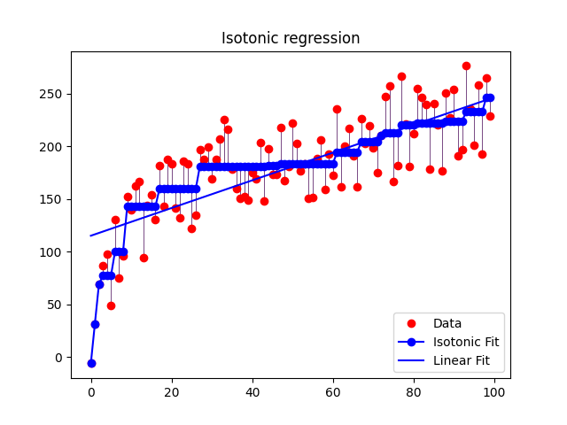

## CTR预估

### 传统ctr

[https://daiwk.github.io/posts/dl-traditional-ctr-models.html](https://daiwk.github.io/posts/dl-traditional-ctr-models.html)

### lr for ctr

[Simple and scalable response prediction for display advertising](https://people.csail.mit.edu/romer/papers/TISTRespPredAds.pdf)

[Online Models for Content Optimization](https://www.researchgate.net/publication/221618458_Online_Models_for_Content_Optimization)

### gbdt for ctr

gbdt基础知识：

[https://zhuanlan.zhihu.com/p/86263786](https://zhuanlan.zhihu.com/p/86263786)

bagging全称叫bootstrap aggregating，每个基学习器都会对训练集进行有放回抽样得到子训练集，比较著名的采样法为0.632自助法。每个基学习器基于不同子训练集进行训练，并综合所有基学习器的预测值得到最终的预测结果。bagging常用的综合方法是投票法，票数最多的类别为预测类别。

boosting训练过程为阶梯状，基模型的训练是有顺序的，每个基模型都会在前一个基模型学习的基础上进行学习，最终综合所有基模型的预测值产生最终的预测结果，用的比较多的综合方式为加权法。

stacking是先用全部数据训练好基模型，然后每个基模型都对每个训练样本进行的预测，其预测值将作为训练样本的特征值，最终会得到新的训练样本，然后基于新的训练样本进行训练得到模型，然后得到最终预测结果。

bagging和stacking中的基模型为强模型（偏差低，方差高），而boosting中的基模型为弱模型（偏差高，方差低）。

bagging的特点：

+ 整体模型的期望等于基模型的期望，这也就意味着整体模型的偏差和基模型的偏差近似。
+ 整体模型的方差小于等于基模型的方差，当且仅当相关性为1时取等号，随着基模型数量增多，整体模型的方差减少，从而防止过拟合的能力增强，模型的准确度得到提高。

所以，bagging中的基模型一定要为强模型，如果bagging使用弱模型则会导致整体模型的偏差提高，而准确度降低。

boosting的特点：

+ 整体模型的方差等于基模型的方差，如果基模型不是弱模型，其方差相对较大，这将导致整体模型的方差很大，即无法达到防止过拟合的效果。因此，boosting框架中的基模型必须为弱模型。
+ boosting框架中采用基于贪心策略的前向加法，整体模型的期望由基模型的期望累加而成，所以随着基模型数的增多，整体模型的期望值增加，整体模型的准确度提高。

gbdt与Adaboost对比

相同：

+ 都是boosting，使用弱分类器；
+ 都使用前向分布算法；

不同：

+ 迭代思路不同：adaboost是通过提升错分数据点的权重来弥补模型的不足（利用错分样本），而GBDT是通过算梯度来弥补模型的不足（利用残差）；
+ 损失函数不同：adaBoost采用的是指数损失，GBDT使用的是绝对损失或者Huber损失函数；

[Learning the click-through rate for rare/new ads from similar ads](https://www.researchgate.net/publication/221299556_Learning_the_click-through_rate_for_rarenew_ads_from_similar_ads)

[Using boosted trees for click-through rate prediction for sponsored search](https://www.researchgate.net/publication/254463616_Using_boosted_trees_for_click-through_rate_prediction_for_sponsored_search)

[Improving Ad Relevance in Sponsored Search](https://www.researchgate.net/publication/221520094_Improving_Ad_Relevance_in_Sponsored_Search)

[Stochastic Gradient Boosted Distributed Decision Trees](../assets/gbdt-Stochastic%20Gradient%20Boosted%20Distributed%20Decision%20Trees.pdf)

[https://zhuanlan.zhihu.com/p/148050748](https://zhuanlan.zhihu.com/p/148050748)

### 深度学习ctr

[https://daiwk.github.io/posts/dl-dl-ctr-models.html](https://daiwk.github.io/posts/dl-dl-ctr-models.html)

### ctr特征

[稠密特征加入CTR预估模型的方法汇总](https://mp.weixin.qq.com/s/xhxBbSYva4g9wUvQ5RIdVA)

### HugeCTR

点击率预估的训练传统上存在着几个困扰着广大开发者的问题：巨大的哈希表（Embedding Table），较少的矩阵计算，大量的数据吞吐。

HugeCTR 是首个全部解决以上问题的开源 GPU 训练框架，与现有 CPU 和混合 CPU / GPU 解决方案相比，它的速度提高了 12 倍至 44 倍。HugeCTR 是一种端到端训练解决方案，其所有计算都在 GPU 上执行，而 CPU 仅用于 I / O。GPU 哈希表支持动态缩放。它利用 MPI 进行多节点训练，以支持任意大的嵌入尺寸。它还还支持混合精度训练，在 Volta GPU 及其后续版本上可以利用 Tensor cores 进一步加速。

[如何解决点击率预估？英伟达专家详解HugeCTR训练框架（二）](https://mp.weixin.qq.com/s/14ETFLjojsP7Aop4_THVKQ)

[Merlin HugeCTR 分级参数服务器简介](https://mp.weixin.qq.com/s/bfnQ3glPYA0sAgZlntTDUw)

### 阿里妈妈CTR

[阿里妈妈点击率预估中的长期兴趣建模](https://mp.weixin.qq.com/s/RQ1iBs8ftvNR0_xB7X8Erg)

### 凤巢

大规模深度学习广告系统的分布式分层GPU参数服务器

[Distributed Hierarchical GPU Parameter Server for Massive Scale Deep Learning Ads Systems](https://arxiv.org/pdf/2003.05622.pdf)

### cvr

ecpc：用户给定一个粗粒度出价，模型可以在一定的范围内调价
ocpc：完全以模型出价为准

delay feedback
[https://zhuanlan.zhihu.com/p/555950153](https://zhuanlan.zhihu.com/p/555950153)

### 时长预估

快手kdd 2022

[Deconfounding Duration Bias in Watch-time Prediction for Video Recommendation](https://arxiv.org/pdf/2206.06003.pdf)

### APG

APG: 面向CTR预估的自适应参数生成网络

摘要：目前基于深度学习的CTR预估模型（即 Deep CTR Models）被广泛的应用于各个应用中。传统的 Deep CTR Models 的学习模式是相对静态的，即所有的样本共享相同的网络参数。然而，由于不同样本的特征分布不尽相同，这样一种静态方式很难刻画出不同样本的特性，从而限制了模型的表达能力，导致次优解。在本文中，我们提出了一个高效率、高效果的通用模块，称为自适应参数生成网络(APG)。其可以基于不同的样本，动态的为CTR模型生成不同的模型参数。大量的实验表明，APG 能够被应用于各种 CTR 模型，并且显著的提升模型效果，同时能节省38.7%的时间开销和96.6%的存储。APG 已在阿里巴巴搜索广告系统部署上线，并获得3%的点击率增长和1%的广告收入增长。

[APG: Adaptive Parameter Generation Network for Click-Through Rate Prediction](https://arxiv.org/abs/2203.16218)

### 保序回归

参考[https://zhuanlan.zhihu.com/p/88623159](https://zhuanlan.zhihu.com/p/88623159)的代码，能画出下面的图

对于二分类问题，参考[https://zhuanlan.zhihu.com/p/101766505](https://zhuanlan.zhihu.com/p/101766505)

对lr+gbdt的负采样校准的方法

[Practical Lessons from Predicting Clicks on Ads at Facebook](https://scontent-itm1-1.xx.fbcdn.net/v/t39.8562-6/240842589_204052295113548_74168590424110542_n.pdf?_nc_cat=109&ccb=1-7&_nc_sid=ad8a9d&_nc_ohc=GSRnP2abLiwAX8Hp1xi&_nc_ht=scontent-itm1-1.xx&oh=00_AfCVWcm3VWKykwQMPU9lJxZk4WP9rJP1PJE_aIeLILLIHA&oe=641F3A4A)

