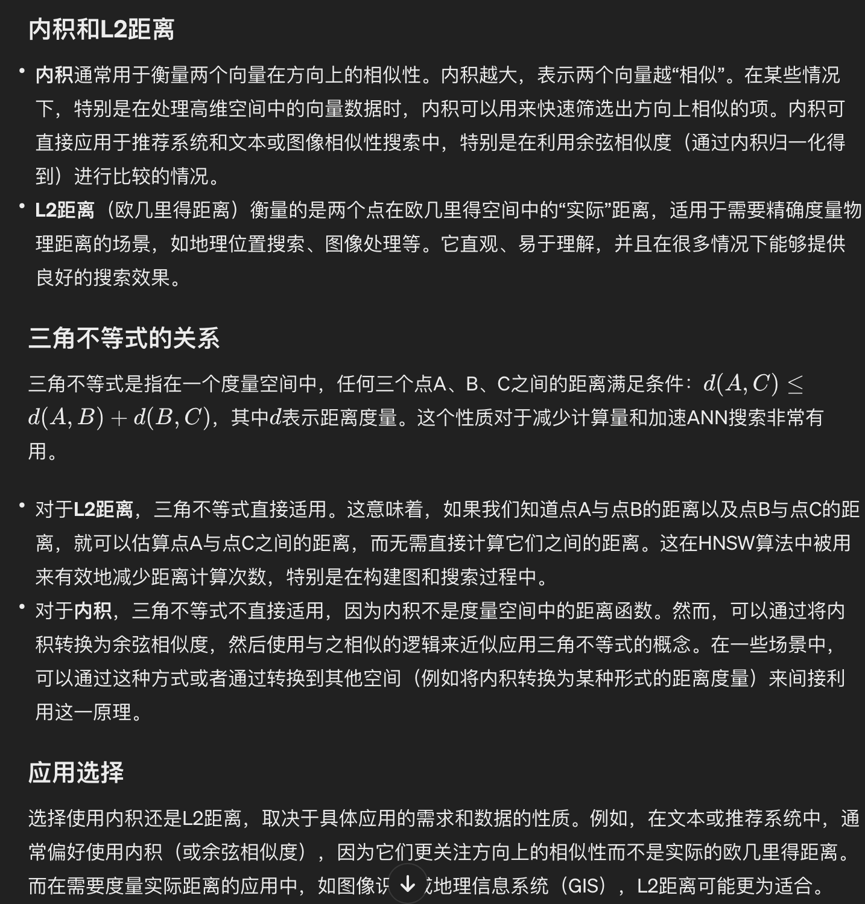
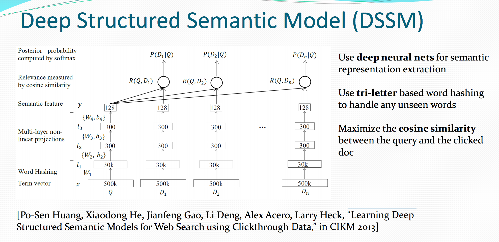
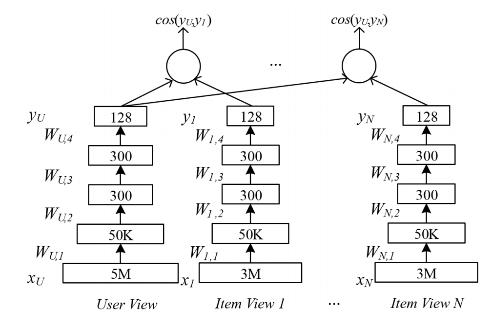
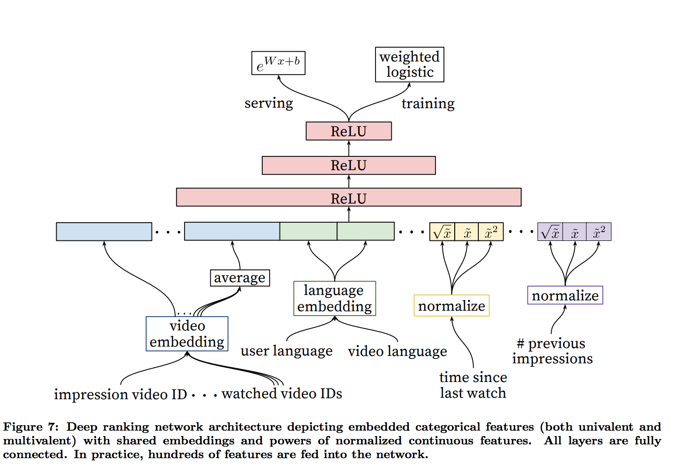
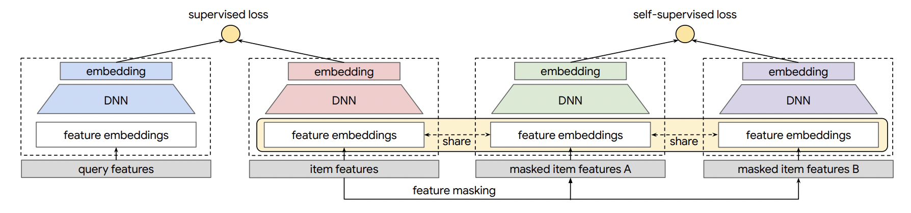
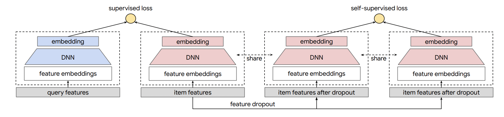
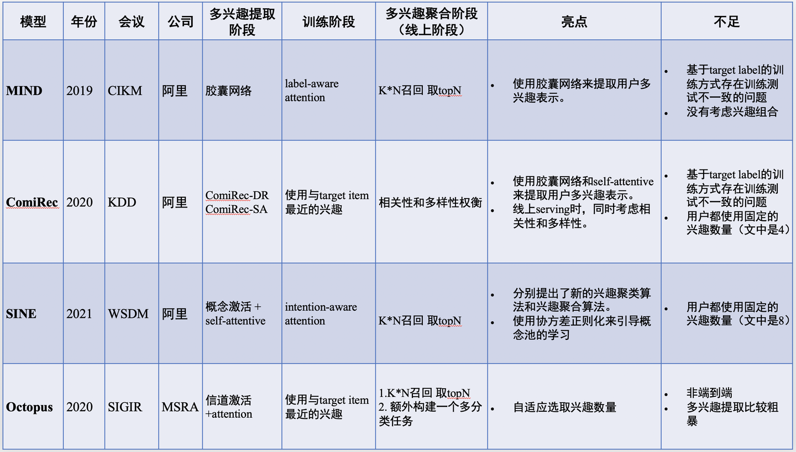
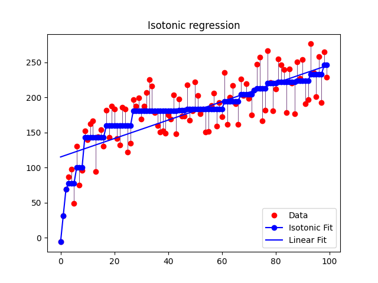
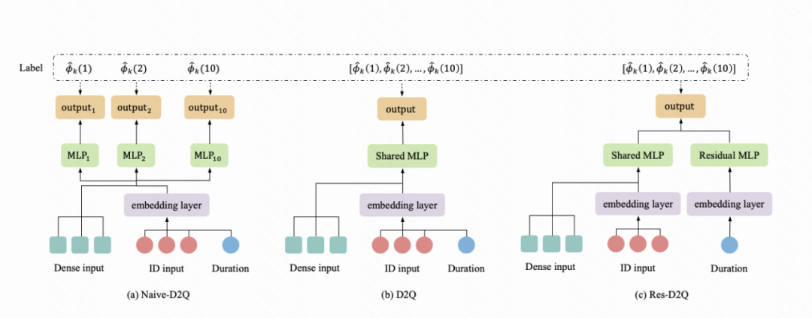

# 推荐系统整体梳理

[https://daiwk.github.io/posts/links-navigation-recommender-system.html](https://daiwk.github.io/posts/links-navigation-recommender-system.html)

[https://github.com/Doragd/Algorithm-Practice-in-Industry](https://github.com/Doragd/Algorithm-Practice-in-Industry)

王喆的机器学习笔记系列：

[https://github.com/wzhe06/Reco-papers](https://github.com/wzhe06/Reco-papers)

[https://github.com/wzhe06/Ad-papers](https://github.com/wzhe06/Ad-papers)

深度学习传送门系列：

[https://github.com/imsheridan/DeepRec](https://github.com/imsheridan/DeepRec)

推荐系统遇上深度学习系列：

链接: [https://pan.baidu.com/s/1jZkJ2d9WckbZL48aGFudOA](https://pan.baidu.com/s/1jZkJ2d9WckbZL48aGFudOA)  密码:kme3

[推荐系统技术演进趋势：召回->排序->重排](https://mp.weixin.qq.com/s/pCbwOEdEfAPSLGToAFXWOQ)

[推荐系统的发展与2019最新论文回顾](https://mp.weixin.qq.com/s/C6e8Pn9IoKCMuQshh_u6Xw)

[深度推荐系统2019年度阅读收藏清单](https://mp.weixin.qq.com/s/u6r5FiPbfVF31Q38OIn6xA)

[推荐工业界实战角度详解TensorFlow中Wide & Deep源码（三）](https://mp.weixin.qq.com/s/ur7xwdY86KlWU3qpmqUcog)

# 特征、样本、数据流

[浅谈微视推荐系统中的特征工程](https://mp.weixin.qq.com/s/NqVP0ksfLiRLSGkuWxiz5A)

[推荐系统之数据与特征工程](https://mp.weixin.qq.com/s/FbIO1C4Xt2WIdIln9SY8Ug)

[稠密特征加入CTR预估模型的方法汇总](https://mp.weixin.qq.com/s/xhxBbSYva4g9wUvQ5RIdVA)

# 预估架构

## HugeCTR

点击率预估的训练传统上存在着几个困扰着广大开发者的问题：巨大的哈希表（Embedding Table），较少的矩阵计算，大量的数据吞吐。

HugeCTR 是首个全部解决以上问题的开源 GPU 训练框架，与现有 CPU 和混合 CPU / GPU 解决方案相比，它的速度提高了 12 倍至 44 倍。HugeCTR 是一种端到端训练解决方案，其所有计算都在 GPU 上执行，而 CPU 仅用于 I / O。GPU 哈希表支持动态缩放。它利用 MPI 进行多节点训练，以支持任意大的嵌入尺寸。它还还支持混合精度训练，在 Volta GPU 及其后续版本上可以利用 Tensor cores 进一步加速。

[如何解决点击率预估？英伟达专家详解HugeCTR训练框架（二）](https://mp.weixin.qq.com/s/14ETFLjojsP7Aop4_THVKQ)

[Merlin HugeCTR 分级参数服务器简介](https://mp.weixin.qq.com/s/bfnQ3glPYA0sAgZlntTDUw)

## BOX
大规模深度学习广告系统的分布式分层GPU参数服务器

[Distributed Hierarchical GPU Parameter Server for Massive Scale Deep Learning Ads Systems](https://arxiv.org/pdf/2003.05622.pdf)

# 索引架构

## ANN索引

annoy hnsw faiss pq

## 暴力召回ANN加速

[https://kexue.fm/archives/9336](https://kexue.fm/archives/9336)

大致思想，CUR分解：query和item的MxN打分矩阵，分解成F(Mxk1), G(k1xk2), H(k2xN)三个矩阵

+ Mxk1矩阵：原矩阵里搞k1列出来，即选出k1个种子item，得到F
+ k2xN矩阵：原矩阵里搞k2列出来，即选出k2个种子query，得到H
+ k1xk2矩阵：即矩阵1和矩阵2求交集，比如矩阵1是抽的第1,23,54列出来，矩阵2是抽的第4,80行出来，那交集元素就是(1,4),(1,80),(23,4),(23,80),(54,4),(54,80)这6个点，构成k1xk2矩阵，然后算一下伪逆得到G

建索引：
+ 挑出种子query，和所有item两两计算相似度，得到H矩阵
+ 挑出种子item，和种子query两两计算相似度，再算伪逆，得到G矩阵
+ 计算G*H，存起来

检索：
+ 输入的query和k1个种子item算一下相似度，得到1xk1的矩阵q
+ q和G*H相乘，就能得到q和每个item的相似度了
  + 【这步可以ann化】：GH就是k1*N，按列来看，就是N个k1维向量，相当于N个item向量，扔到annlib里去就行了，而输入的q也是一个k1维向量，就可以ann了

# 召回

[360展示广告召回系统的演进](https://mp.weixin.qq.com/s/QqWGdVGVxSComuJT1SDo0Q)

[推荐场景中深度召回模型的演化过程](https://mp.weixin.qq.com/s/AHuXCH1Z6gKoIkR5MGgLkg)

[https://github.com/imsheridan/DeepRec/tree/master/Match](https://github.com/imsheridan/DeepRec/tree/master/Match)

[精准推荐的秘术：阿里解耦域适应无偏召回模型详解](https://mp.weixin.qq.com/s/0Cbc3aAYTeFqLDutLBXJmA?notreplace=true)对应[Co-training Disentangled Domain Adaptation Network for Leveraging Popularity Bias in Recommenders](https://ir.webis.de/anthology/2022.sigirconf_conference-2022.10/)


[谈谈文本匹配和多轮检索](https://mp.weixin.qq.com/s/uoEX0TjJZmyquNch5Wikvg)

[搜索中的深度匹配模型](https://mp.weixin.qq.com/s/lcyw_kHNxPB-DUfNzTaj5g)

## 内积、余弦和L2



给定a，找到和它最像的b

$$
ab=||a||cos\theta ||b||
$$

如果用内积，会找$$cos\theta ||b||$$最大的b出来，可能是夹角小，也可能是模大的b，所以可能偏热门

## DSSM

参考[Modeling Interestingness with Deep Neural Networks](https://www.microsoft.com/en-us/research/wp-content/uploads/2014/10/604_Paper.pdf)

对应的ppt：
[ppt](../assets/Modeling Interestingness with Deep Neural Networks_ppt.pdf)

### 2013年CIKM的dssm

[Learning Deep Structured Semantic Models for Web Search using Clickthrough Data](https://www.microsoft.com/en-us/research/wp-content/uploads/2016/02/cikm2013_DSSM_fullversion.pdf)

相当于一个q，和每个d分别算cos。

$$
R(Q,D)=cosine(y_Q,y_D)=\frac{y_Q^Ty_D}{\left \| y_Q \right \|\left \| y_D \right \|}
$$

所以given Q点击D的概率就是：

$$
P(D|Q)=\frac{exp(\gamma R(Q,D))}{\sum _{D'\in \textbf{D}}exp(\gamma R(Q,D'))}
$$

其中的$$\gamma$$是平滑因子。这里的$$\textbf{D}$$是需要rank的Documents的集合，理想情况肯定是全集了。实际上定义$$(Q,D^+)$$为一个query和点击文档的pair对，通过一个$$D^+$$和N个随机选的未点击的文档$$D_j^-,j=1,...,N$$近似。

所以训练时，在训练集上，给定query，有点击doc的概率最大化就是我们的目标(其中的$$\Lambda$$是网络参数)：

$$
L(\Lambda)=-\log \prod _{(Q,D^+)}P(D^+|Q)
$$

Word Hashing：例如，一个英文单词是”good”，那么会先在头尾各补上一个”#”，处理成”#good#”，然后拆成n-gram（假设n=3，也就是tri-gram，那就是”#go”，“goo”，”ood”，”od#”这么多个”新”词）。这样，可以把原来500k的词典缩到300k，可以有效缓解词典太大的问题，而且因为英文就26个字母，这样做也解决了新单词的OOV问题。



[https://blog.csdn.net/zjrn1027/article/details/80170966](https://blog.csdn.net/zjrn1027/article/details/80170966)

相似度衡量可以使用cos，而最终的loss可以用hinge loss：

设置一个margin $$m$$，query $$V_Q$$，正样本$$V_{A^+}$$，负样本$$V_{A^-}$$，如果**正负样本的相似度之差**小于边界值，那就还需要优化，如果**已经大于等于边界值**了，说明**模型已经能区分**了，所以用hinge loss：

$$
L=max(0, m - (cos(V_Q,V_{A^+} - cos(V_Q, V_{A^-}))))
$$

tf算cos

```python
    def getCosineSimilarity(q, a):
        q1 = tf.sqrt(tf.reduce_sum(tf.multiply(q, q), 1))
        a1 = tf.sqrt(tf.reduce_sum(tf.multiply(a, a), 1))
        mul = tf.reduce_sum(tf.multiply(q, a), 1)
        cosSim = tf.div(mul, tf.multiply(q1, a1))
        return cosSim
```

tf算hinge

```python
    def getLoss(trueCosSim, falseCosSim, margin):
        zero = tf.fill(tf.shape(trueCosSim), 0.0)
        tfMargin = tf.fill(tf.shape(trueCosSim), margin)
        with tf.name_scope("loss"):
            losses = tf.maximum(zero, tf.subtract(tfMargin, tf.subtract(trueCosSim, falseCosSim)))
            loss = tf.reduce_sum(losses)
        return loss
```

使用

```python
        self.trueCosSim = self.getCosineSimilarity(question2, trueAnswer2)
        self.falseCosSim = self.getCosineSimilarity(question2, falseAnswer2)
        self.loss = self.getLoss(self.trueCosSim, self.falseCosSim, self.margin)
```

### multiview dssm

[A Multi-View Deep Learning Approach for Cross Domain User Modeling in Recommendation Systems](https://www.microsoft.com/en-us/research/wp-content/uploads/2016/02/frp1159-songA.pdf)

[https://blog.csdn.net/shine19930820/article/details/78810984](https://blog.csdn.net/shine19930820/article/details/78810984)

现在很多公司都不仅仅只有一个产品，而是有**多个产品线**。比如微软可能就有搜索、新闻、appstore、xbox等产品，如果将用户在这些产品上的行为（反馈）统一在一起训练一个深度学习网络，就能很好的解决**单个产品上**（用户）**冷启动、稀疏**等问题。

#### 概述

&nbsp;



一个产品线就是一个view，一条训练样本只有user+1个view，其他view置0。

总体的优化目标是保证在所有视图上user和正向反馈的item的相似度大于随机选取的无反馈或者负向反馈的相似度，并且越大越好。

$$
p=\underset{W_u,W_1,...W_v}{argmax}\sum ^N_{j=1}\frac{exp(\alpha _a cos(Y_u,Y_{a,j})}{\sum _{X'\in R^{d_a}}exp(\alpha cos(Y_u,f_a(X',W_a)))}
$$

其中的$$f_i(X_i,W_i)$$是$$X_i$$到$$Y_i$$的变换。有一个用户view，加上$$v$$个辅助(auxiliary)的item view。$$X_i\in R^{d_i}$$，即每个view有自己的特征空间。对于第$$j$$条样本，它只有第$$i$$个auxiliary view是有值的，其他view都是0。

tf代码：[https://github.com/InsaneLife/dssm/blob/master/multi_view_dssm_v3.py](https://github.com/InsaneLife/dssm/blob/master/multi_view_dssm_v3.py)

### 降维

#### top features

&nbsp;

对于user features，选取top-k最频繁的features。并通过TF-IDF过滤掉最常用的特征。

#### k means

&nbsp;

kmeans的公式如下：

$$
\underset{C_1,...,C_k}{argmin}\sum ^N _{i=1} \min _{C_j\in \{C_1,...,C_k\}}distance(X_i,C_j)
$$

通过K-means对相似的特征群分组为同一个cluster并生成新的特征，共生成k个新特征。生成的特征向量$$Y_i$$是一个$$K$$维的向量，第$$i$$维是第$$i$$个cluster中features的出现数。

具体地，使用一个长度为$$U$$的vector $$f_i$$，$$U$$是训练集中的用户数，$$f_i(j)$$表示用户$$i$$有feature $$j$$的次数。将每个$$f_i$$进行归一化。这样，对于每一个用户向量$$f_i$$，可以产生它的降维了的用户向量$$Y_i$$（假设feature $$a$$分配给了cluster $$Cls(a)$$，$$1\le Cls(a)\le K$$）：

$$
Y_i(j)=\sum _{a:X_i(a)>0 \& Cls(a) = j}f_i(a)
$$

想要抽出reasonable的feature数目，需要比较大的cluster数$$K$$。因为如果cluster数比较少，那一个cluster里就会有非常多的用户feature，很难学到有用的pattern。在本文中，设置$$K=10000$$，平均每个cluster里大概有350个feature。因为cluster数比较大，所以用mr版的kmeans。

#### Local sensitive Hashing

&nbsp;

通过一个随机的矩阵将数据映射到低维向量空间上，并且**保持原始空间上的pairwis cos距离**在**新的空间上**仍然获得**保留**。

原始矩阵$$d$$维，降到$$k$$维，所以对应的矩阵是$$A\in R^{d\times k}$$。所以$$A$$中有$$k$$个映射，每个映射$$A_i$$都将$$X$$映射到$$Y_i$$，输出的$$Y_i\in R^k$$。计算方式如下：

$$
Y_i=\left\{\begin{matrix}
1,&if\ A_iX\ge 0\\ 
0,&else
\end{matrix}\right.
$$

计算$$X_1$$，$$X_2$$的cos相似度是$$cos(\frac{H(Y_1,Y_2)}{k}\pi)$$，其中，$$X_1,X_2\in R^d$$。$$H(Y_1,Y_2)$$是LSH输出向量的汉明距离。为了保持cos相似度的高准确率，需要把$$k$$设得比较大，这里和k-means一样，$$k=10000$$。

因为对每个向量算LSH是相互独立的，所以这一步是可以高度并行化的。但是，在我们的case里，有10000的$$k$$，有3.5M的$$d$$，所以相当于要把包括了$$3.5M\times 10^4$$个服从$$N(0,1)$$浮点数的$$A$$存到每个节点的内存里，也就是300G的内存消耗，这是肯定不行的。有很多解决方法，大部分方法是生成一个sparse的矩阵$$A$$【kdd06的[Very sparse random projections](https://web.stanford.edu/~hastie/Papers/Ping/KDD06_rp.pdf)】。

而本文用了[Online Generation of Locality Sensitive Hash Signatures](https://pdfs.semanticscholar.org/db21/730d2e0e2aa1f148a5411ea23ae7ceea574a.pdf)里提到的pooling trick。

保存一个size是$$m$$的pool $$B$$，每个元素是从$$N(0,1)$$中随机出来的浮点数，m远小于transition matrix $$A$$的size。要获取$$A_{ij}$$的一条记录，就是使用关于$$i,j$$的一致性hash的方法在$$B$$中找到一个index，然后查出它的值。在本文中，设置$$m=1000000$$，将单节点的内存损耗从100G缩减到10M，可以直接用mr搞啦。

#### 减少训练样本数

&nbsp;

每个用户在每个域都有大量的日志数据，将每个用户在每个域只选取一个user-item对，具体为用户特征-用户在**此域**喜欢的所有item的**平均分数**。

## YoutubeDNN

[https://daiwk.github.io/posts/dl-youtube-video-recommendation.html](https://daiwk.github.io/posts/dl-youtube-video-recommendation.html)

参考[http://www.sohu.com/a/155797861_465975](http://www.sohu.com/a/155797861_465975)

参考[https://zhuanlan.zhihu.com/p/25343518](https://zhuanlan.zhihu.com/p/25343518)

[Deep neural networks for youtube recommendations](https://static.googleusercontent.com/media/research.google.com/zh-CN//pubs/archive/45530.pdf)

YouTube是世界上最大的视频上传、分享和发现网站，YouTube推荐系统为超过10亿用户从不断增长的视频库中推荐个性化的内容。整个系统由两个神经网络组成：**候选生成网络**和**排序网络**。候选生成网络从**百万量级**的视频库中生成**上百个**候选，排序网络对候选进行打分排序，输出**排名最高的数十个结果**。

### 候选生成网络（Candidate Generation Network）

候选生成网络将推荐问题建模为一个**类别数极大的多分类问题**：对于一个Youtube用户，使用其观看历史（视频ID）、搜索词记录（search tokens）、人口学信息（如地理位置、用户登录设备）、二值特征（如性别，是否登录）和连续特征（如用户年龄）等，对视频库中所有视频进行多分类，得到每一类别的分类结果（即每一个视频的推荐概率），最终输出概率较高的几百个视频。===>即，【使用**用户特征**，对所有视频进行分类，得到**和这个用户最相关的几百个候选结果。**】

将推荐看成分类问题，用户$$U$$在上下文$$C$$中，选择视频$$i$$的概率是：

$$
P(w_t=i|U,C)=\frac{e^{v_iu}}{\sum _{j\in V}e^{v_ju}}
$$

其中，$$v_i\in R^N$$是第i个视频的emb，$$u\in R^N$$是用户的emb，两个emb都是N维的，这里看起来是用内积$$v_iu$$把它们变成一个数。

由于视频有百万量级，所以做这么一个超大规模的分类，需要，并且使用的是到的样本**通过importance sampling进行负采样**(参考[On using very large target vocabulary for neural machine translation](http://www.aclweb.org/anthology/P15-1001))。对每一个example而言，他的cross-entropy是在true label和采样的负类中求min。在实践中，采样了数千个负类，比传统的softmax有将近100倍的速度提升。

另一种做法是hierarchical softmax(参考[Hierarchical probabilistic neural network language model](https://www.iro.umontreal.ca/~lisa/pointeurs/hierarchical-nnlm-aistats05.pdf))，但实践中效果没那么好。因为在hsoftmax中，遍历树里的每一个节点时，会引入对经常是毫无联系的类别的分辨，使得分类问题变得更困难以至于效果变差。

在线serving时，由于低延迟的要求，需要有对类别数是sublinear的时间复杂度的近邻检索方法，之前youtube的系统使用的是hashing的方法，即[Label partitioning for sublinear ranking](http://www.thespermwhale.com/jaseweston/papers/label_partitioner.pdf)。因为在线的时候，softmax的输出没啥用，所以打分问题就变成了一个在点积的空间上进行最近邻检索的问题，有很多通用库可以用，例如基于LSH的ann算法：[ An Investigation of Practical Approximate Nearest Neighbor Algorithms](http://papers.nips.cc/paper/2666-an-investigation-of-practical-approximate-nearest-neighbor-algorithms.pdf)。

注：

item-embedding也可以参考[https://zhuanlan.zhihu.com/p/24339183?refer=deeplearning-surfing](https://zhuanlan.zhihu.com/p/24339183?refer=deeplearning-surfing)里说的[Item2vec: Neural Item Embedding for Collaborative Filtering](https://arxiv.org/abs/1603.04259)的想法，把item视为word，用户的行为序列视为一个集合，item间的共现为正样本，并按照item的频率分布进行负样本采样，相似度的计算还只是利用到了item共现信息，缺点是：忽略了user行为序列信息; 没有建模用户对不同item的喜欢程度高低。

### Modeling Expected Watch Time

训练用的是logistic regression加上cross-entropy，

假设第i个正样本的播放时长是$$T_i$$，使用weighted logistic regression，将正样本的权重设为播放时长，而负样本的权重设为1，这样，假设总共有N个样本，有k个被点击了，就相当于有了$$\sum T_i$$个正样本，N-k个负样本。所以odds（注：一个事件的几率odds指该事件发生与不发生的概率比值）就是正样本数/负样本数=$$\frac{\sum T_i}{N-k}$$。

而实际中，点击率P很低，也就是k很小，而播放时长的期望是$$E(T)=\frac{\sum T_i}{N}$$，所以$$E(T)$$约等于$$E(T)(1+P)$$，约等于odds，即$$\frac{\sum T_i}{N-k}$$

最后在inference的serving中，直接使用$$e^{Wx+b}$$来产出odds，从而近似expected watch time。

参考[https://en.wikipedia.org/wiki/Logistic_regression](https://en.wikipedia.org/wiki/Logistic_regression)

odds是平均时长，训练时输入给sigmoid的是logit，

$$
wx+b = logit = log odds
$$

所以，infer的时候：

$$
E(T) = odds = e ^{logit} = e ^{log odds} = e^{wx+b}
$$

参考tf的weighted sigmoid：```weighted_cross_entropy_with_logits```: [https://www.tensorflow.org/api_docs/python/tf/nn/weighted_cross_entropy_with_logits](https://www.tensorflow.org/api_docs/python/tf/nn/weighted_cross_entropy_with_logits)

正常的sigmoid：

```python
labels * -log(sigmoid(logits)) +
    (1 - labels) * -log(1 - sigmoid(logits))
```

weighted sigmoid只对正样本加权：

```python
labels * -log(sigmoid(logits)) * pos_weight +
    (1 - labels) * -log(1 - sigmoid(logits))
```



### 代码实现

[https://github.com/ogerhsou/Youtube-Recommendation-Tensorflow/blob/master/youtube_recommendation.py](https://github.com/ogerhsou/Youtube-Recommendation-Tensorflow/blob/master/youtube_recommendation.py)

关于数据集：

[https://github.com/ogerhsou/Youtube-Recommendation-Tensorflow/commit/e92bac1b8b5deb0e93e996b490561baaea60bae8](https://github.com/ogerhsou/Youtube-Recommendation-Tensorflow/commit/e92bac1b8b5deb0e93e996b490561baaea60bae8)

使用的是[https://github.com/facebookresearch/fastText/blob/master/classification-example.sh](https://github.com/facebookresearch/fastText/blob/master/classification-example.sh)

在init_data函数中，给每个__label__xx编了个号，如：

```shell
__label__6 0
__label__12 1
__label__14 2
__label__7 3
```

然后read_data的时候，y就用这个编号来表示（假装是时长）：

```python
y.append(label_dict[line[0]])
```

而使用的是nce_loss(参考[https://daiwk.github.io/posts/knowledge-tf-usage.html#tfnnnceloss](https://daiwk.github.io/posts/knowledge-tf-usage.html#tfnnnceloss))：

```python
ce_weights = tf.Variable(
    tf.truncated_normal([n_classes, n_hidden_1],
                        stddev=1.0 / math.sqrt(n_hidden_1)))
nce_biases = tf.Variable(tf.zeros([n_classes]))

loss = tf.reduce_mean(tf.nn.nce_loss(weights=nce_weights,
                     biases=nce_biases,
                     labels=y_batch,
                     inputs=pred,
                     num_sampled=10,
                     num_classes=n_classes))

cost = tf.reduce_sum(loss) / batch_size
optimizer = tf.train.AdamOptimizer(learning_rate=learning_rate).minimize(cost)
out_layer = tf.matmul(pred, tf.transpose(nce_weights)) + nce_biases
```


## 采样

batch内shuffle采样（有放回）

[On Sampling Strategies for Neural Network-based Collaborative Filtering](https://arxiv.org/pdf/1706.07881.pdf)

[浅谈个性化推荐系统中的非采样学习](https://mp.weixin.qq.com/s/OGLJx-1tGYYuLWFricfRKg)

[Sampling-Bias-Corrected Neural Modeling for Large Corpus Item Recommendations](https://dl.acm.org/doi/10.1145/3298689.3346996)

[https://www.tensorflow.org/extras/candidate_sampling.pdf](https://www.tensorflow.org/extras/candidate_sampling.pdf)

下载了一份：[https://github.com/daiwk/collections/blob/master/assets/candidate_sampling.pdf](https://github.com/daiwk/collections/blob/master/assets/candidate_sampling.pdf)

[推荐系统遇上深度学习(七十二)-[谷歌]采样修正的双塔模型](https://www.lizenghai.com/archives/38343.html)

## 召回常用Loss

[表示学习中的7大损失函数梳理](https://mp.weixin.qq.com/s/XN-ugqsziXDjj1Ax8EJD0A)

### Contrastive Loss


### Triplet Loss

### InfoNce Loss

[Self-supervised Learning for Large-scale Item Recommendations](https://arxiv.org/pdf/2007.12865.pdf)

v3有两个图：[https://arxiv.org/pdf/2007.12865v3.pdf](https://arxiv.org/pdf/2007.12865v3.pdf)






### Focal Loss


### Circle Loss

### qalign

[Spherical Graph Embedding for Item Retrieval in Recommendation System](https://dl.acm.org/doi/abs/10.1145/3511808.3557704)

[自己下载了](../assets/Q-align.pdf)

代码：[https://github.com/WNQzhu/Q-align](https://github.com/WNQzhu/Q-align)

自己的注释：[https://github.com/daiwk/llms_new/blob/main/demos/qalign.py](https://github.com/daiwk/llms_new/blob/main/demos/qalign.py)


假设$$N_K(u)$$是节点$$u$$的$$K$$跳邻居，那么目标函数是最大化这些邻居的概率，即

$$\max _f \sum_{u \in \mathcal{V}} \log \operatorname{Pr}\left(N_K(u) \mid f(u)\right)$$


## 突破双塔

### TDM->JTM

[下一代深度召回与索引联合优化算法JTM](https://mp.weixin.qq.com/s/heiy74_QriwxpZRyTUEgPg)

### 二向箔

xx

### DR

[字节最新复杂召回模型，提出深度检索DR框架解决超大规模推荐系统中的匹配问题](https://cloud.tencent.com/developer/article/1698045)

[Deep Retrieval: An End-to-End Learnable Structure Model for Large-Scale Recommendations](https://arxiv.org/abs/2007.07203)

## 多兴趣召回

[推荐系统 多兴趣召回论文解读](https://zhuanlan.zhihu.com/p/404281900)




## transformer+召回

ICLR2020 cmu+google：

[Pre-training Tasks for Embedding-based Large-scale Retrieval](https://arxiv.org/abs/2002.03932)


# 粗排

## COLD

## CAN

## poly-encoder

[https://zhuanlan.zhihu.com/p/119444637](https://zhuanlan.zhihu.com/p/119444637)


# 精排

## 传统ctr

[https://daiwk.github.io/posts/dl-traditional-ctr-models.html](https://daiwk.github.io/posts/dl-traditional-ctr-models.html)


### lr for ctr

[Simple and scalable response prediction for display advertising](https://people.csail.mit.edu/romer/papers/TISTRespPredAds.pdf)

[Online Models for Content Optimization](https://www.researchgate.net/publication/221618458_Online_Models_for_Content_Optimization)

### gbdt for ctr

gbdt基础知识：

[https://zhuanlan.zhihu.com/p/86263786](https://zhuanlan.zhihu.com/p/86263786)

bagging全称叫bootstrap aggregating，每个基学习器都会对训练集进行有放回抽样得到子训练集，比较著名的采样法为0.632自助法。每个基学习器基于不同子训练集进行训练，并综合所有基学习器的预测值得到最终的预测结果。bagging常用的综合方法是投票法，票数最多的类别为预测类别。

boosting训练过程为阶梯状，基模型的训练是有顺序的，每个基模型都会在前一个基模型学习的基础上进行学习，最终综合所有基模型的预测值产生最终的预测结果，用的比较多的综合方式为加权法。

stacking是先用全部数据训练好基模型，然后每个基模型都对每个训练样本进行的预测，其预测值将作为训练样本的特征值，最终会得到新的训练样本，然后基于新的训练样本进行训练得到模型，然后得到最终预测结果。

bagging和stacking中的基模型为强模型（偏差低，方差高），而boosting中的基模型为弱模型（偏差高，方差低）。

bagging的特点：

+ 整体模型的期望等于基模型的期望，这也就意味着整体模型的偏差和基模型的偏差近似。
+ 整体模型的方差小于等于基模型的方差，当且仅当相关性为1时取等号，随着基模型数量增多，整体模型的方差减少，从而防止过拟合的能力增强，模型的准确度得到提高。

所以，bagging中的基模型一定要为强模型，如果bagging使用弱模型则会导致整体模型的偏差提高，而准确度降低。

boosting的特点：

+ 整体模型的方差等于基模型的方差，如果基模型不是弱模型，其方差相对较大，这将导致整体模型的方差很大，即无法达到防止过拟合的效果。因此，boosting框架中的基模型必须为弱模型。
+ boosting框架中采用基于贪心策略的前向加法，整体模型的期望由基模型的期望累加而成，所以随着基模型数的增多，整体模型的期望值增加，整体模型的准确度提高。


gbdt与Adaboost对比

相同：

+ 都是boosting，使用弱分类器；
+ 都使用前向分布算法；

不同：

+ 迭代思路不同：adaboost是通过提升错分数据点的权重来弥补模型的不足（利用错分样本），而GBDT是通过算梯度来弥补模型的不足（利用残差）；
+ 损失函数不同：adaBoost采用的是指数损失，GBDT使用的是绝对损失或者Huber损失函数；

[Learning the click-through rate for rare/new ads from similar ads](https://www.researchgate.net/publication/221299556_Learning_the_click-through_rate_for_rarenew_ads_from_similar_ads)

[Using boosted trees for click-through rate prediction for sponsored search](https://www.researchgate.net/publication/254463616_Using_boosted_trees_for_click-through_rate_prediction_for_sponsored_search)

[Improving Ad Relevance in Sponsored Search](https://www.researchgate.net/publication/221520094_Improving_Ad_Relevance_in_Sponsored_Search)

[Stochastic Gradient Boosted Distributed Decision Trees](../assets/gbdt-Stochastic%20Gradient%20Boosted%20Distributed%20Decision%20Trees.pdf)

[https://zhuanlan.zhihu.com/p/148050748](https://zhuanlan.zhihu.com/p/148050748)

## 深度学习ctr

[https://daiwk.github.io/posts/dl-dl-ctr-models.html](https://daiwk.github.io/posts/dl-dl-ctr-models.html)


## 序列建模

[一文看懂序列推荐建模的最新进展与挑战](https://mp.weixin.qq.com/s/RQ1iBs8ftvNR0_xB7X8Erg)

[从MLP到Self-Attention，一文总览用户行为序列推荐模型](https://mp.weixin.qq.com/s/aMqh79_jjgSCn1StuCvyRw)

[Transformer在推荐模型中的应用总结](https://zhuanlan.zhihu.com/p/85825460)


[阿里妈妈点击率预估中的长期兴趣建模](https://mp.weixin.qq.com/s/RQ1iBs8ftvNR0_xB7X8Erg)

[DCN V2：Google提出改进版DCN，用于大规模排序系统中的特征交叉学习(附代码)](https://zhuanlan.zhihu.com/p/353223660)


## 保序回归

参考[https://zhuanlan.zhihu.com/p/88623159](https://zhuanlan.zhihu.com/p/88623159)的代码，能画出下面的图



对于二分类问题，参考[https://zhuanlan.zhihu.com/p/101766505](https://zhuanlan.zhihu.com/p/101766505)

对lr+gbdt的负采样校准的方法

[Practical Lessons from Predicting Clicks on Ads at Facebook](https://scontent-itm1-1.xx.fbcdn.net/v/t39.8562-6/240842589_204052295113548_74168590424110542_n.pdf?_nc_cat=109&ccb=1-7&_nc_sid=ad8a9d&_nc_ohc=GSRnP2abLiwAX8Hp1xi&_nc_ht=scontent-itm1-1.xx&oh=00_AfCVWcm3VWKykwQMPU9lJxZk4WP9rJP1PJE_aIeLILLIHA&oe=641F3A4A)


## cvr预估

ecpc：用户给定一个粗粒度出价，模型可以在一定的范围内调价
ocpc：完全以模型出价为准

delay feedback
[https://zhuanlan.zhihu.com/p/555950153](https://zhuanlan.zhihu.com/p/555950153)


## 时长预估

快手kdd 2022

[Deconfounding Duration Bias in Watch-time Prediction for Video Recommendation](https://arxiv.org/pdf/2206.06003.pdf)

[短视频推荐视频时长bias问题](https://cloud.tencent.com/developer/article/2141921)

拿物理时长（duration）分桶

D2Q 算法的具体做法如下：

+ 统计训练样本的 duration 分布，得到等频分桶分位点；
+ 将样本按照等频分桶分位点分成 k 个相互独立的分桶 $$D_k$$；
+ 对不同 duration 分桶的样本，在组内统计时长分位数作为 label，得到 Duration-Aware Watchtime-Distribution label；
+ 分别在上述的分桶上训练时长预估模型 $$f_k$$；



+ 图a：M个网络完全独立，分别学习各自的label，不共享特征 embedding，特征 embedding 空间随着分桶维度扩大线性增加，存储、训练的资源开销随之增加，实现成本较高，不符合工业界场景的要求；
+ 图b：M个网络共享底层特征，如果采用多输出的训练方式，则 batch 内样本分布不均的问题会导致子塔训练不稳定，收敛到局部最优。**单塔单输出**的训练方式在实际训练时效果稳定，收敛速度较快，是 D2Q 实现的基线版本。
+ 图c：单塔单输出模型中引入 Duration bias 模块，用于建模不同分桶下的样本差异（Res-D2Q），离线训练指标得到进一步的提升。


论文使用 XAUC、XGAUC 以及 MAE 等指标对时长回归效果进行评估。MAE 表示短视频预估时长与观看时长 label 的误差绝对值，表示模型回归精度，是回归任务的常用评估指标。

+ XAUC：将测试集中的样本两两组合，若组合的标签和预估值的序一致则为正序，否则为逆序，XAUC 是正序对数与总组合数的比值；
+ XGAUC：用户维度计算的 XAUC。

由于推荐系统主要优化候选集的排序，评估指标 XAUC 能够更加直观的反映预估时长序的好坏，与论文的优化目标更加适配。


# 多目标

## 多目标+推荐综述

[Multi-task多任务模型在推荐算法中应用总结1](https://zhuanlan.zhihu.com/p/78762586)

[Multi-task多任务学习在推荐算法中应用(2）](https://zhuanlan.zhihu.com/p/91285359)

[多任务学习在推荐算法中的应用](https://mp.weixin.qq.com/s/-SHLp26oGDDp9HG-23cetg)

## 阿里多目标

[阿里提出多目标优化全新算法框架，同时提升电商GMV和CTR](https://mp.weixin.qq.com/s/JXW--wzpaFwRHSSvZEA0mg)

## Youtube多目标——MMoE

[YouTube 多目标排序系统：如何推荐接下来收看的视频](https://mp.weixin.qq.com/s/0vZqCswErlggD6S52GnYVA)

[https://daiwk.github.io/posts/dl-youtube-multitask.html](https://daiwk.github.io/posts/dl-youtube-multitask.html)

## CGC

cgc参考paddle代码：[cgc_demo.py](../assets/cgc_dir/cgc_demo.py)

# 多场景

## APG

APG: 面向CTR预估的自适应参数生成网络

摘要：目前基于深度学习的CTR预估模型（即 Deep CTR Models）被广泛的应用于各个应用中。传统的 Deep CTR Models 的学习模式是相对静态的，即所有的样本共享相同的网络参数。然而，由于不同样本的特征分布不尽相同，这样一种静态方式很难刻画出不同样本的特性，从而限制了模型的表达能力，导致次优解。在本文中，我们提出了一个高效率、高效果的通用模块，称为自适应参数生成网络(APG)。其可以基于不同的样本，动态的为CTR模型生成不同的模型参数。大量的实验表明，APG 能够被应用于各种 CTR 模型，并且显著的提升模型效果，同时能节省38.7%的时间开销和96.6%的存储。APG 已在阿里巴巴搜索广告系统部署上线，并获得3%的点击率增长和1%的广告收入增长。

[APG: Adaptive Parameter Generation Network for Click-Through Rate Prediction](https://arxiv.org/abs/2203.16218)


# item冷启

poso 

[Personalized Cold Start Modules for Large-scale Recommender Systems](https://arxiv.org/abs/2108.04690)

[https://zhuanlan.zhihu.com/p/534056942](https://zhuanlan.zhihu.com/p/534056942)

# 用户冷启

## PeterRec

[仅需少量视频观看数据，即可精准推断用户习惯：腾讯、谷歌、中科大团队提出迁移学习架构PeterRec](https://mp.weixin.qq.com/s/PmVhAthYxiUspWic5Klpog)

[Parameter-Efficient Transfer from Sequential Behaviors for User Modeling and Recommendation](https://arxiv.org/pdf/2001.04253.pdf)

[https://github.com/fajieyuan/sigir2020_peterrec](https://github.com/fajieyuan/sigir2020_peterrec)

搞一个pretrain-finetune的架构，学好一套用户的表示，可以给各种下游任务用。

采用如下方式：

+ **无监督**地学习用户表示：使用**序列模型**，**预测**用户的**下一次点击**。为了能建模**超长**的u-i交互序列，使用类似NextItNet（[A Simple Convolutional Generative Network for Next Item Recommendation](https://arxiv.org/pdf/1808.05163.pdf)）的模型
+ 使用预训练好的模型去**有监督**地finetune下游任务
+ 在各个下游任务间，想要尽可能共享更多的网络参数：参考learning to learn，即一个网络的大部分参数可以其他参数来预测（一层里95%的参数可以通过剩下的5%的参数来预测）。文章提出了model patch(模型补丁)，每个模型补丁的参数量不到原始预训练模型里的卷积层参数的10%。通过加入模型补丁，不仅可以保留原来的预训练参数，还可以更好地适应下游任务。模型补丁有串行和并行两种加入方式。

序列推荐模型:

+ RNN：强序列依赖
+ CNN：可并行，能比RNN叠更多层，所以准确率更高。难以建模长序列是因为卷积核一般都比较小（如3x3），但可以通过空洞(dilated)卷积来解决，可以使用不变的卷积核，指数级地扩充表示域。
+ 纯attention：可并行，例如SASRec（[Self-attentive sequential recommendation](https://arxiv.org/abs/1808.09781)）。但因为时间和存储消耗是序列长度的平方的复杂度。

考虑到用户的点击序列往往成百上千，所以使用类似NextItNet的casual卷积，以及类似GRec（[Future Data Helps Training: Modeling Future Contexts for Session-based Recommendation](https://arxiv.org/abs/1906.04473)）的双向encoder的这种non-casual卷积。

与推荐系统现有的transfer learning对比：

+ DUPN：
  + 训练的时候就有多个loss。如果没有相应的loss和data，学好的用户表示效果就会很差。而本文只有一个loss，却能用在多个task上，所以算是一种multi-domain learning([Efficient parametrization of multi-domain deep neural networks](https://arxiv.org/abs/1803.10082))
  + DUPN在用户和item特征上需要很多特征工程，并没有显式地对用户的行为序列建模
  + DUPN要么finetune所有参数，要么只finetune最后一个分类层。PeterRec则是对网络的一小部分进行finetune，效果并不比全finetune差，比只finetune最后一个分类层要好很多

+ CoNet：杨强提出的[Conet: Collaborative cross networks for cross-domain recommendation](https://arxiv.org/abs/1804.06769)
  + cross-domain用于推荐的一个网络。同时训练2个目标函数，一个表示source网络，一个表示target网络。
  + pretrain+finetune效果不一定好，取决于预训练的方式、用户表示的表达能力、预训练的数据质量等

预训练时没有\[TCL\]，fintune时加上。

+ 原domain$$S$$：有大量用户交互行为的图文或视频推荐。一条样本包括$$\left(u, x^{u}\right) \in \mathcal{S}$$，其中，$$x^{u}=\left\{x_{1}^{u}, \ldots, x_{n}^{u}\right\}\left(x_{i}^{u} \in X\right)$$表示用户的点击历史
+ 目标domain$$T$$：可以是用户label很少的一些预测任务。例如用户可能喜欢的item、用户性别、用户年龄分桶等。一条样本包括$$(u, y) \in \mathcal{T}$$，其中$$y \in \mathcal{Y}$$是一个有监督的标签。

# GNN+推荐

[https://zhuanlan.zhihu.com/p/323302898](https://zhuanlan.zhihu.com/p/323302898)

[Graph Neural Networks in Recommender Systems: A Survey](https://arxiv.org/pdf/2011.02260.pdf)

[Graph Neural Networks for Recommender Systems: Challenges, Methods, and Directions](https://arxiv.org/pdf/2109.12843.pdf)

[https://daiwk.github.io/posts/dl-graph-representations.html](https://daiwk.github.io/posts/dl-graph-representations.html)

# bias v.s. debias

[推荐系统炼丹笔记：推荐系统Bias大全 \| Debias方法综述](https://blog.csdn.net/m0_52122378/article/details/110950122)

## position bias

[搜索、推荐业务中 - position bias的工业界、学术界 发展历程 - 系列1(共计2)](https://zhuanlan.zhihu.com/p/79904391)

[推荐系统遇上深度学习(七十一)-\[华为\]一种消除CTR预估中位置偏置的框架](https://www.jianshu.com/p/37768b399cd8)

[PAL: A Position-bias Aware Learning Framework for CTR Prediction in Live Recommender Systems](https://dl.acm.org/citation.cfm?id=3347033)

[推荐系统之Position-Bias建模](https://mp.weixin.qq.com/s/as8MWJZ2SAVZedx2v02fmA)


# 工业界的一些推荐应用

## dlrm

[Facebook深度个性化推荐系统经验总结(阿里内部分享PPT))](https://mp.weixin.qq.com/s/_LBSM_E0tNqVgLhLtULmUQ)


## instagram推荐系统

[Facebook首次揭秘：超过10亿用户使用的Instagram推荐算法是怎样炼成的？](https://mp.weixin.qq.com/s/LTFOw1jSgMogANT8gmCTpw)

[https://venturebeat.com/2019/11/25/facebook-details-the-ai-technology-behind-instagram-explore/](https://venturebeat.com/2019/11/25/facebook-details-the-ai-technology-behind-instagram-explore/)

[Instagram个性化推荐工程中三个关键技术是什么？](https://mp.weixin.qq.com/s/yBmISlPeRB9-mKv2-Dv6LQ)

## 微信读书推荐系统

[微信读书怎么给你做推荐的？](https://mp.weixin.qq.com/s/TcxI-XSjj7UtHvx3xC55jg)

## youtube推荐梳理

[一文总览近年来YouTube推荐系统算法梳理](https://mp.weixin.qq.com/s/hj2ecwfrwCfvrafnsNiP-g)

# 其他

## 混合推荐架构

[混合推荐系统就是多个推荐系统“大杂烩”吗?](https://mp.weixin.qq.com/s/-OwxXZmbjrcpDtH-hWN-oQ)

## 认知推荐

[NeurIPS 2019 \| 从感知跃升到认知，这是阿里在认知智能推荐领域的探索与应用](https://mp.weixin.qq.com/s/MzF-UT5Hm071bTUTZpKDGw)

[Learning Disentangled Representations for Recommendation](https://arxiv.org/pdf/1910.14238.pdf)


