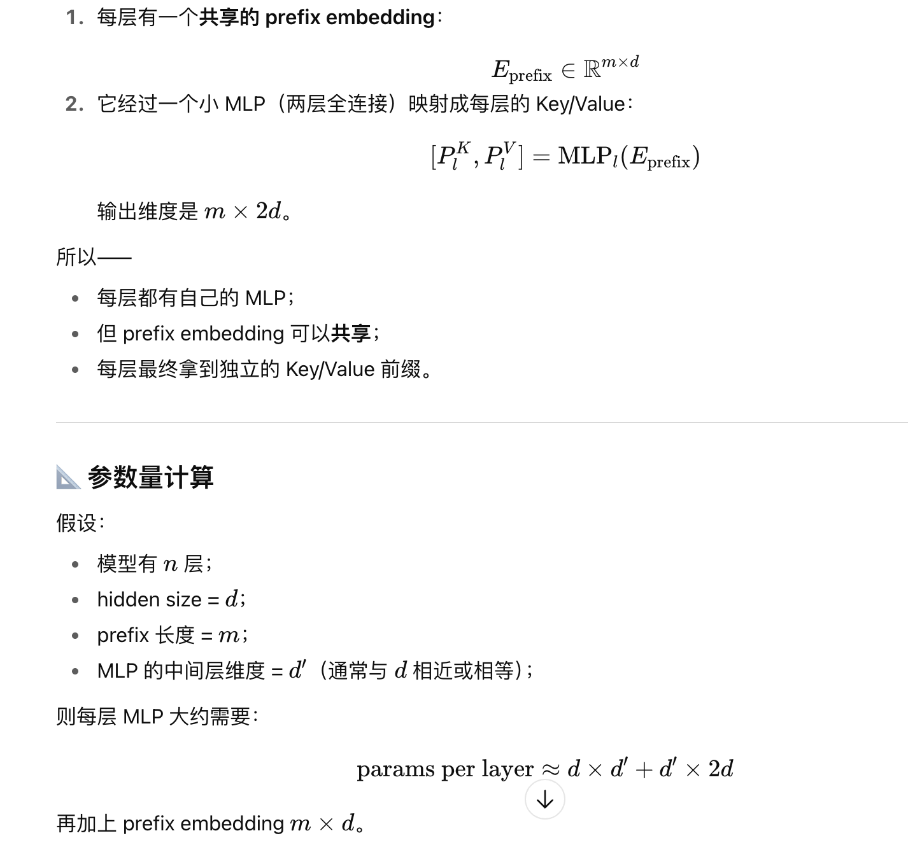
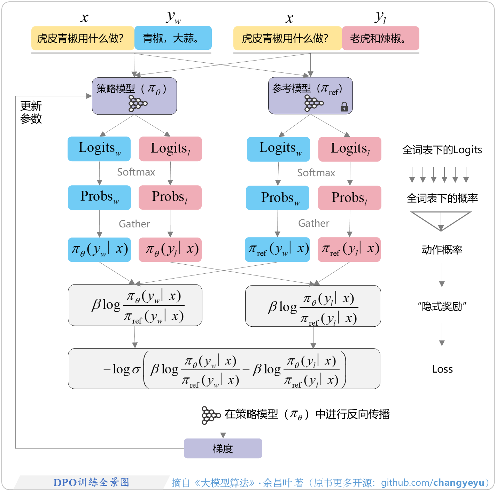
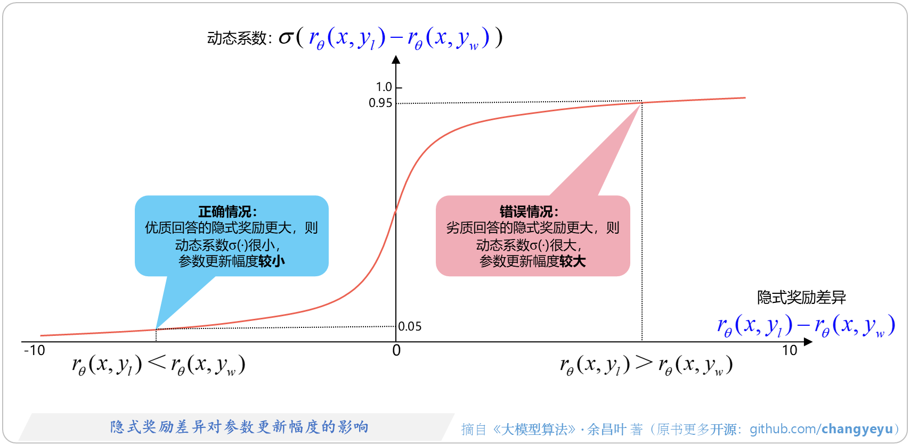
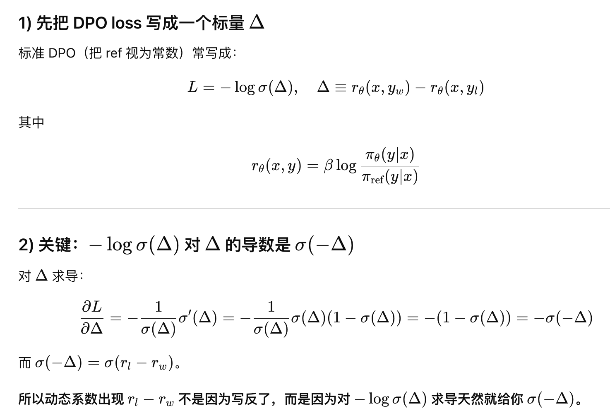

参考[https://github.com/changyeyu/LLM-RL-Visualized](https://github.com/changyeyu/LLM-RL-Visualized)，对应的书《大模型算法：强化学习、微调与对齐》）

# 概述

llm训练时的teacher forcing机制：生成第i个token的输入：
+ 推理时：是模型生成的第0到第i-1的序列
+ 训练时：训练数据中实际的token序列

例如输入的是12345，输入1的时候生成了8，那要预测3的时候，输入的就是18；而训练时输入的还是12

# SFT

## lora

+ lora的核心思想：微调前后模型的参数差异具有低秩性，所以可以用A和B两个矩阵来表示，这两个矩阵的秩是$$lora_{rank}$$
+ A一般是随机初始化，**B用0初始化**或者用很小的随机数初始化，为了保证在训练初期，lora不会对原始输出造成太大扰动
+ 参数$$lora_{alpha}$$用于缩放Lora输出，即$$W_{merge}=W+A*B*lora_{alpha}/lora_{rank}$$
+ 学习率一般开始的时候比较小，后面可以再调整，不过如果lora_alpha较大，可以适当减小学习率
+ 在推理的时候，可以先进行融合，其实就是算好$$W_{merge}$$，推理的时候直接用

## prefix-tuning

大概是在prompt的最前面加若干个虚拟token，然后这部分有自己的参数（最开始的emb，还有后面的k和v，这里的k和v都是2个mlp，先映射到小一点的d'，再映射到d），总的可训练参数量参考：

## sft loss与logsoftmax

+ LM head：从hidden dim映射到vocab size
+ 计算时label是shift得到的(左移一位，因为要预测next item)
+ 正常是先过LM head，算出logit矩阵，然后每个位置对所有词表里的词算softmax得到p，再去算交叉熵（只有label那个字有log(p)），所以就是log(softmax(x))
+ prompt没有loss，只有response有loss，假设response长度为k，假设第i个位置对应的label是j，那交叉熵是$$-1/k\sum_{i=1}^{k} log(p_ij)$$

对于response里的第i个词来说，词表大小为$$n$$，$$x_{max}=max(x_0,x_1,...,x_n)$$，下式第三行就是第二行分子分母同时乘$$e^{-x_{max}}$$

$$
\begin{aligned}
\operatorname{LogSoftmax}\left(x_i\right) & =\log \left(\operatorname{Softmax}\left(x_i\right)\right) \\
& =\log \left(\mathrm{e}^{x_i} / \sum_{j=0}^n \mathrm{e}^{x_j}\right) \\
& =\log \left(\mathrm{e}^{\left(x_i-x_{\text {max }}\right)} / \sum_{j=0}^n \mathrm{e}^{\left(x_j-x_{\text {max }}\right)}\right) \\
& =\left(x_i-x_{\text {max }}\right)-\log \left(\sum_{j=0}^n \mathrm{e}^{\left(x_j-x_{\text {max }}\right)}\right)
\end{aligned}
$$

这个简化有2个好处：

+ 减少计算量：例如除法、少量对数
+ 数值稳定：上式是log-sum-exp技巧，减掉max可以避免溢出

另外还有一个常用名词logprobs（log probabilities），即logsoftmax的结果，因为softmax是0到1，所以logprobs取值范围是负无穷到0

## 如何减小SFT引入的幻觉

sft阶段引入的新知识越多，幻觉发生率也越高

模型主要通过预训练来获取知识，sft主要是用来教会模型如何更有效地利用这些知识。

所以，新知识应该在预训练阶段或者基于预训练模型继续预训练（CPT），再用sft进行优化

另外，sft选哪个版本的开源模型作为基础模型也有讲究：

+ 需要加一堆新知识进行深度微调时，选base版本，因为base版本未指令微调，更有通用性
+ 任务与现有指令任务类似（通用对话、开放域问答等），且指令数据不多，选指令微调版本（-instruct或者-chat）

# 一些常用的参数

+ temperature：**控制不同词的概率差距**。当调小时，x/T变大，然后经过exp会指数放大，这样高logit的会变得更巨大，词的差距会被拉大，所以模型的输出会更稳定，输出结果更确定；反之不同词的差距更小，输出更多样
+ top-p：**控制长尾词的概率阈值**。top cummulative probability，是一个门槛，即从第一名往下数，累加后的概率大于p时，把后面的词扔掉，剩下的词再softmax，并去采样。调低会去掉长尾，输出稳定；调高会放低门槛，输出多样

temperature和top-p虽然原理不同，但均是越大越多样，适用创作等场景；越小越稳定，适用于代码、数学

# DPO

DPO（direct preference optimization）是监督学习，不是强化学习，loss如下

$$
\begin{aligned}
& \mathcal{L}_{\mathrm{DPO}}\left(\pi_\theta ; \pi_{\mathrm{ref}}\right) \\
& =-\mathbb{E}_{\left(x, y_{\mathrm{w}}, y_1\right) \sim \mathcal{D}}\left[\log \sigma\left(r\left(x, y_{\mathrm{w}}\right)-r\left(x, y_1\right)\right)\right] \\
& =-\mathbb{E}_{\left(x, y_{\mathrm{w}}, y_1\right) \sim \mathcal{D}}[\log \sigma(\underbrace{\beta \log \frac{\pi_\theta\left(y_{\mathrm{w}} \mid x\right)}{\pi_{\text {ref }}\left(y_{\mathrm{w}} \mid x\right)}}_{\text {优质回答的隐式奖励}\uparrow }-\underbrace{\beta \log \frac{\pi_\theta\left(y_1 \mid x\right)}{\pi_{\text {ref }}\left(y_1 \mid x\right)}}_{\text {劣质回答的隐式奖励 } \downarrow})]
\end{aligned}
$$

其中，

+ $$r$$是策略模型和参考模型的比值，即一个隐式的奖励模型，$$r_{\theta}(x,y)=\beta log \frac{\pi_{\theta}(y|x)}{\pi_{ref}(y|x)}$$
+ 策略模型是复制的sft模型，参考模型一般也是复制sft模型，有些时候可以选一个更复杂的模型，但要注意两者的kl散度和训练数据分布不要差太多

## DPO流程

+ concat：将$$x$$和$$y_w$$与$$y_l$$分别concat，作为策略模型和参考模型的输入（实际会将三者concat一起）
+ gather：算完logit和softmax后，再把y部分的拿出来，算出隐式奖励，再算Loss

## beta作用

在RLHF中，$$\beta$$和最终奖励$$=r(x,y)$$、最终奖励$$=r_{\phi}(x,y)$$的关系如下，

$$
r(x,y)=r_{\phi}(x,y)-\beta (log \pi _{\theta}(y|x)-log \pi _{ref}(y|x))
$$

+ $$\beta$$很小时，策略模型和偏好数据分布更接近，
+ $$\beta$$很大时，策略模型和参考模型更接近

在DPO中，

+ $$\beta$$很小时，KL惩罚力度很小，策略模型有更多自由度去探索，策略模型和偏好数据分布更接近
+ $$\beta$$很大时，KL惩罚力度很大，策略模型始终要兼顾和参考模型的距离，策略模型和参考模型更接近

## DPO的效果

对无害性有很大提升，对基础能力基本无影响（MMLU等）

## DPO的梯度

$$
\nabla_\theta \mathcal{L}_{\mathrm{DPO}}\left(\pi_\theta ; \pi_{\mathrm{ref}}\right)=-\beta \mathbb{E}_{\left(x, y_{\mathrm{w}}, y_l\right) \sim \mathcal{D}}[\underbrace{\sigma\left(r_\theta\left(x, y_l\right)-r_\theta\left(x, y_{\mathrm{w}}\right)\right)}_{\text {动态系数 }}[\underbrace{\nabla_\theta \log \pi_\theta\left(y_{\mathrm{w}} \mid x\right)}_{\text {优质回答的概率 } \uparrow}-\underbrace{\nabla_\theta \log \pi_\theta\left(y_l \mid x\right)}_{\text {劣质回答的概率 } \downarrow}]]
$$

+ 增加优势回答出现的概率，降低劣势回答出现的概率
+ 动态系数：优势答案和劣势答案的隐式奖励差异（注意$$r_{\theta}(x,y)=\beta log \frac{\pi_{\theta}(y|x)}{\pi_{ref}(y|x)}$$），如下图：
    + $$r_{\theta}(x,y_l)<r_{\theta}(x,y_w))$$时：隐式奖励模型能正确地给优质回答较高评分，图中左侧，说明已经学得比较好了，梯度比较小
    + $$r_{\theta}(x,y_l)>r_{\theta}(x,y_w))$$时：隐式奖励模型不太行，图中右侧，要加强梯度

解释：

