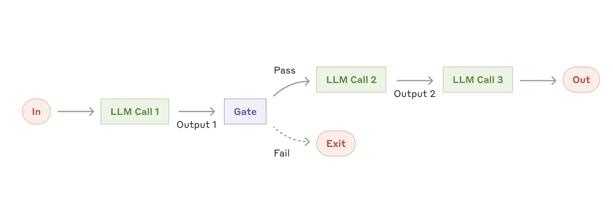

# prompt engineering

[万字长文总结提示词技巧！新加坡首届GPT-4提示工程大赛冠军最新分享](https://mp.weixin.qq.com/s/AWnQL3forAP-gB7e2ZEXdQ) 提出了CO-STAR框架

[高能干货分享，有关提示词工程的一切都在这份教程里](https://mp.weixin.qq.com/s/RaIzHtRIShIcpXydRE6kQg)

[https://github.com/NirDiamant/Prompt_Engineering](https://github.com/NirDiamant/Prompt_Engineering)

[吴恩达：四个步骤，让大模型变得更好](https://mp.weixin.qq.com/s/ackyt5d2kqdzMy0-Ma_ElA)

[Can Generalist Foundation Models Outcompete Special-Purpose Tuning? Case Study in Medicine](https://arxiv.org/pdf/2311.16452)

让gpt4生成cot和答案的模板

看着是借助GPT4+COT+RAG+投票

+ 拿一坨question得到他们的向量，并按照上图的模板让gpt生成COT和答案，人工判断，对的存进知识库里
+ 预测阶段：
    + 拿测试question的向量从知识库里查出5个最像(cos距离)的(q, cot, answer)作为context
    + 循环5次：
        shuffle测试question的答案选项，让LLM回答
    + 对生成的答案投票，选票数最多的

## APE

[还在人工炼丹？自动提示工程指南来了，还带从头实现](https://mp.weixin.qq.com/s/TxzkRUPhsiqtLhCyrIsQrQ)

[https://github.com/marshmellow77/automated-prompt-engineering-from-scratch](https://github.com/marshmellow77/automated-prompt-engineering-from-scratch)

## PAS

[还在死磕AI咒语？北大-百川搞了个自动提示工程系统PAS](https://mp.weixin.qq.com/s/2etnB3hbRtOCth1notqyBQ)

[PAS: Data-Efficient Plug-and-Play Prompt Augmentation System](https://arxiv.org/abs/2407.06027)

## ell

[OpenAI前研究者发布提示词工程框架ell，升级版LangChain，支持版本控制和多模态](https://mp.weixin.qq.com/s/LaNbu4bVrWLG3ueopFTj5g)

[https://github.com/MadcowD/ell](https://github.com/MadcowD/ell)

## 一些实践

[gpt-4.1官方](https://www.xiaohongshu.com/explore/67fe98c1000000001d01477b?app_platform=ios&app_version=8.79&share_from_user_hidden=true&xsec_source=app_share&type=normal&xsec_token=CBD6_QqRzI70CObFc2ZlGE4OyHkXfEAyuQpTgGllA2rLs=&author_share=1&xhsshare=WeixinSession&shareRedId=ODY2NUg4NE82NzUyOTgwNjY0OTc1STdO&apptime=1744847767&share_id=c452a695f467408c903e213ccf9f8d41)

# 多智能体

[《综述：全新大语言模型驱动的Agent》——4.5万字详细解读复旦NLP和米哈游最新Agent Survey](https://zhuanlan.zhihu.com/p/656676717)

[Agent > GPT5？吴恩达最新演讲：四种 Agent 设计范式（通俗易懂版）](https://mp.weixin.qq.com/s/6sh39yEO4YGZI-BGPjJnCg)

## JAT

[告别偏科，能玩转多模态、多任务、多领域的强化智能体终于来了](https://mp.weixin.qq.com/s/2GBB-w7hBf6equtqD8V0Lg)

[Jack of All Trades, Master of Some, a Multi-Purpose Transformer Agent](https://arxiv.org/pdf/2402.09844)

[https://github.com/huggingface/jat](https://github.com/huggingface/jat)

[https://huggingface.co/datasets/jat-project/jat-dataset](https://huggingface.co/datasets/jat-project/jat-dataset)

输入的序列元素是observations, actions, 和rewards的交替组合：

$$
\left[\phi\left(s_0, 0.0\right), \phi\left(a_0\right), \phi\left(s_1, r_1\right), \phi\left(a_1\right), \ldots\right]
$$

依据不同输入的数据类型，使用不同网络处理：

+ 图像：用CNN。
+ 连续向量：用线性层
+ 离散值：用线性投影层

预测任务：根据所有先前的观察和动作嵌入来预测下一个动作嵌入。

序列的构造方法：

+ 和文本相关的任务：用 GPT-2 的分词策略，将文本转换为一个整数序列，然后emb lookup映射到一个嵌入向量序列。
+ 和图像有关的任务：用ViT，将图像切割成小块后，通过线性层转换为嵌入向量序列。
+ 最终再将图像和文本的向量序列拼接在一起，形成一个统一的序列，输入到 Transformer 中。

## ReadAgent

[「有效上下文」提升20倍！DeepMind发布ReadAgent框架](https://mp.weixin.qq.com/s/xXJqJeqf8mzP9VW9kLIdgQ)

## 多模态agent

[一文详解多模态智能体（LMAs）最新进展（核心组件/分类/评估/应用）](https://mp.weixin.qq.com/s/lucGhu5-IPjIKbZ2o1q-PQ)

[Large Multimodal Agents: A Survey](https://arxiv.org/pdf/2402.15116)

[https://github.com/jun0wanan/awesome-large-multimodal-agents](https://github.com/jun0wanan/awesome-large-multimodal-agents)

## OpenDevin

[OpenDevin出技术报告了，大模型Agent开发者必读](https://mp.weixin.qq.com/s/tfREoiwjfCZauisCE3PpvQ)

[OpenDevin: An Open Platform for AI Software Developers as Generalist Agents](https://arxiv.org/pdf/2407.16741)

## autogpt

[GitHub星标超16万，爆火AutoGPT进阶版来了：定制节点、多智能体协同](https://mp.weixin.qq.com/s/dBL47yYoVNkyPoPG8pcLLA)

[https://github.com/Significant-Gravitas/AutoGPT](https://github.com/Significant-Gravitas/AutoGPT)

## DAAG

[三「模」联盟，谷歌DeepMind缔造终身学习智能体！](https://mp.weixin.qq.com/s/P-x8EDrfd1ydCnPP8MYu6g)

[Diffusion Augmented Agents: A Framework for Efficient Exploration and Transfer Learning](https://arxiv.org/pdf/2407.20798)

## VARP

[GPT-4o能玩《黑神话》！精英怪胜率超人类，无强化学习纯大模型方案](https://mp.weixin.qq.com/s/veHSbBxPIqRexG0OWtg4pw)

[Can VLMs Play Action Role-Playing Games? Take Black Myth Wukong as a Study Case](https://arxiv.org/abs/2409.12889)

## MARL

[北大领衔，多智能体强化学习研究登上Nature子刊](https://mp.weixin.qq.com/s/_67dbIMDjktMEw4QYiIAUA)

[Efficient and scalable reinforcement learning for large-scale network control](https://www.nature.com/articles/s42256-024-00879-7)

## MMRole

[与「李白」赏图赋诗，同「猴哥」直面天命，人大高瓴提出MMRole多模态角色扮演](https://mp.weixin.qq.com/s/I8gyDv9K8uhB3EXF_2_zVw)

[MMRole: A Comprehensive Framework for Developing and Evaluating Multimodal Role-Playing Agents](https://arxiv.org/abs/2408.04203)

[https://github.com/YanqiDai/MMRole](https://github.com/YanqiDai/MMRole)

## Swarm

[OpenAI今天Open了一下：开源多智能体框架Swarm](https://mp.weixin.qq.com/s/3-iKztrTuRURUGtles4-xA)

[https://github.com/openai/swarm](https://github.com/openai/swarm)

## agent-as-a-judge

[卷起来！让智能体评估智能体，Meta发布Agent-as-a-Judge](https://mp.weixin.qq.com/s/YX1cmIMDonUiosSg24boUQ)

[Agent-as-a-Judge: Evaluate Agents with Agents](https://arxiv.org/pdf/2410.10934)

[https://github.com/metauto-ai/agent-as-a-judge](https://github.com/metauto-ai/agent-as-a-judge)

## Hammer

[哪个模型擅长调用工具？这个7B模型跻身工具调用综合榜单第一](https://mp.weixin.qq.com/s/YsjjaTdDNWsoLXhr7mGOpQ)

[Hammer: Robust Function-Calling for On-Device Language Models via Function Masking](https://arxiv.org/abs/2410.04587)

[https://huggingface.co/MadeAgents](https://huggingface.co/MadeAgents)

[https://github.com/MadeAgents/Hammer](https://github.com/MadeAgents/Hammer)

## AgentOccam

[不靠更复杂的策略，仅凭和大模型训练对齐，零样本零经验单LLM调用，成为网络任务智能体新SOTA](https://mp.weixin.qq.com/s/UvNCUVBbH9TqfbEdoB7mTA)

[AgentOccam: A Simple Yet Strong Baseline for LLM-Based Web Agents](https://arxiv.org/abs/2410.13825)

## 苏格拉底学习

[DeepMind用语言游戏让大模型学AlphaGo自我博弈，数据限制不存在了](https://mp.weixin.qq.com/s/EC5QdHcasev8JpTp-OKLKQ)

[Boundless Socratic Learning with Language Games](https://arxiv.org/abs/2411.16905)

## 从个人模拟到社会模拟

[智能体模拟《西部世界》一样的社会，复旦大学等出了篇系统综述](https://mp.weixin.qq.com/s/Uy_NYkDGp9CqmO2j9XOfCA)

[From Individual to Society: A Survey on Social Simulation Driven by Large Language Model-based Agents](https://arxiv.org/abs/2412.03563)

## MetaGPT

ICLR2024

+ [MetaGPT: Meta Programming for A Multi-Agent Collaborative Framework](https://arxiv.org/pdf/2308.00352)
+ [Data Interpreter: An LLM Agent For Data Science](https://arxiv.org/abs/2402.18679)
+ [AFlow: Automating Agentic Workflow Generation](https://arxiv.org/abs/2410.10762)

4w+的stars了

[https://github.com/geekan/MetaGPT](https://github.com/geekan/MetaGPT)

## insight-V

[多智能体架构Insight-V来了！突破长链视觉推理瓶颈](https://mp.weixin.qq.com/s/-8TvvTDa7zeEUlzcbtuPWg)

[Insight-V: Exploring Long-Chain Visual Reasoning with Multimodal Large Language Models](https://arxiv.org/abs/2411.14432)

[https://github.com/dongyh20/Insight-V](https://github.com/dongyh20/Insight-V)

## 世界经济论坛的agent报告

[Navigating the AI Frontier: A Primer on the Evolution and Impact of AI Agents](https://reports.weforum.org/docs/WEF_Navigating_the_AI_Frontier_2024.pdf)

## Claude: building effective agents(MCP)

[Claude 官方发布《Agent 构建指南》，附 PDF 下载](https://mp.weixin.qq.com/s/hqNcLv3pKgZdqpGxAPlt2A)

[https://www.anthropic.com/research/building-effective-agents](https://www.anthropic.com/research/building-effective-agents)

Agent 系统分为两大类：

+ 工作流 (Workflows) ：
    + 特点：通过预定义的代码路径来编排 LLM 和工具的系统。更像是一个精心设计的流程，每一步都清晰可控。
    + 场景：当任务非常明确，而且可以分解成一系列固定的步骤时，就像流水线上的工作一样，用“工作流程”就足够了。
+ 智能体 (Agents)：
    + 特点：由 LLM 动态地指导自身流程和工具使用的系统。更像是一个自主的决策者，能够根据环境反馈灵活调整行动。
    + 场景：当任务需要很大的灵活性，而且需要模型自己做决策时，就像一个需要随机应变的指挥官，这时候“智能体”就更适合。

现有的框架：
+ LangGraph（LangChain 的工具）：就像一套功能强大的乐高套件，可以用来搭建各种复杂的 Agent 系统。[https://langchain-ai.github.io/langgraph/](https://langchain-ai.github.io/langgraph/)
+ Amazon Bedrock 的 AI Agent 框架：就像一个专业的工具箱，提供了各种构建 Agent 系统的工具和组件。[https://aws.amazon.com/cn/bedrock/agents/](https://aws.amazon.com/cn/bedrock/agents/)
+ Rivet（拖放式 GUI LLM 工作流构建器）：就像一个可视化编辑器，可以通过拖拽的方式来构建 LLM 的工作流程，非常方便。[https://rivet.ironcladapp.com/](https://rivet.ironcladapp.com/)
+ Vellum（复杂工作流的构建和测试工具）：就像一个高级的实验室，可以用来构建和测试复杂的工作流程。[https://www.vellum.ai/](https://www.vellum.ai/)

### 基石：augmented LLM

通过**检索、工具和记忆**等机制扩展大语言模型的能力，这样大语言模型能够主动运用这些能力来生成自己的搜索查询、选择合适的工具，并决定保留哪些信息。

Anthropic有一个上下文协议（Model Context Protocol，MCP），允许开发者通过简单的客户端实现与不断增长的第三方工具生态系统集成，参考[https://www.anthropic.com/news/model-context-protocol](https://www.anthropic.com/news/model-context-protocol)

[openai也妥协了，全面拥抱MCP!](https://mp.weixin.qq.com/s/R8kp1WiegAgIXM2ufLf0ZQ)

### workflow

+ prompt chaining：将一个任务分解成一系列步骤，其中的每个LLM的调用都会处理前一个调用的输出，可以在任何中间步骤中添加程序化的检查（见图中的“门控 Gate”），以确保流程仍在正轨上，即有一个失败就exit

+ Routing：将不同类型的客户服务查询（一般问题、退款请求、技术支持）导向不同的下游流程、提示和工具，例如将简单/常见的问题路由到较小的模型（如Claude 3.5 Haiku），将困难/不常见的问题路由到功能更强大的模型（如Claude 3.5 Sonnet），以优化成本和速度。

+ Parallelization：同时执行多个任务，并通过程序化方式整合结果。适用：
    + 分段处理：
        + 构建安全防护机制，一个模型实例负责处理用户查询，而另一个模型实例负责筛选不当内容或请求。
        + 自动化评估模型性能，每个模型调用负责评估模型在给定提示下的不同性能指标。
    + 多重投票：
        + 对代码进行漏洞审查，多个不同的提示分别审查代码，并在发现问题时进行标记。
        + 评估内容是否不当，多个提示从不同角度进行评估，或采用不同的投票阈值来平衡误报和漏报。

+ Orchestrator-workers（协调者-工作者模式）：一个中央LLM会**动态地分解任务**，并将这些子任务分配给不同的工作者模型，最后再整合所有工作者的结果。适用：
    + 需要对**多个文件**进行复杂修改的编码产品。
    + 需要从**多个来源**收集并分析信息以寻找相关内容的搜索任务。

+ Evaluator-optimizer：一个LLM负责调用**生成**响应，而另一个LLM调用则在一个**循环**中提供**评估和反馈**。适用：
    + 文学翻译，比如翻译模型**最初**可能无法捕捉到的细微差别，但评估器模型可以提供有用的评审意见。
    + 需要进行**多轮**搜索和分析以收集全面信息的复杂搜索任务，评估器可以用来决定是否需要进一步搜索。

### Agents
**
当LLM在理解复杂输入、推理规划、可靠使用工具和从错误中恢复等关键能力上成熟时，智能体可以处理开放式问题，无需预先定义步骤，并能根据环境反馈**自主决策**。在特定节点或遇到困难时暂停的功能，以便引入人工干预或反馈。

## google ai agents白皮书

[https://github.com/daiwk/collections/blob/master/assets/google-ai-agents-whitepaper.pdf](https://github.com/daiwk/collections/blob/master/assets/google-ai-agents-whitepaper.pdf)

## stanford的agent综述

[Agent AI: Surveying the Horizons of Multimodal Interaction](https://arxiv.org/pdf/2401.03568)

## 李宏毅的agent课

[台大李宏毅2025 AI Agent新课来了！](https://mp.weixin.qq.com/s/d5FnSATz3tPfCOu2a53uKQ)

[https://www.youtube.com/watch?v=M2Yg1kwPpts](https://www.youtube.com/watch?v=M2Yg1kwPpts)

[ppt](https://docs.google.com/presentation/d/1kTxukwlmx2Sc9H7aGPTiNiPdk4zN_NoH)

## google的A2A

[最新：Google 牵头搞了个 A2A，以后不同家的 AI 都能“加好友”了](https://mp.weixin.qq.com/s/fha3Yf-yK5D3JZ0bIX1tyw)

[5000字长文带你看懂，Agent世界里的A2A、MCP协议到底是个啥。](https://mp.weixin.qq.com/s/hr7wvpz-KRllwQkiKYf0Tg)

A2A协议是对 Anthropic 公司模型上下文协议 (MCP) 的补充，后者为智能体提供了有用的工具和上下文。A2A则更侧重于智能体之间的交互与协作

A2A促进了客户端 (client)智能体和远程 (remote)智能体之间的通信。客户端智能体负责制定和传达任务，远程智能体则负责执行这些任务以提供信息或采取行动。

这个交互过程包含几个关键能力：

+ 能力发现 (Capability discovery): 智能体可以通过JSON格式的Agent Card来宣告自身能力。这使得客户端智能体能找到最适合执行某项任务的远程智能体，并发起A2A通信。
+ 任务管理 (Task management): 通信围绕任务完成进行。协议定义了具有生命周期的任务 (task)对象。任务可以是即时完成的，也可以是长时运行的。任务的输出被称为工件 (artifact)
+ 协作 (Collaboration): 智能体之间可以发送消息，以沟通上下文、回复、工件或用户指令
+ 用户体验协商 (User experience negotiation): 每条消息包含parts，即完整的内容片段（如生成的图像）。每个部分都有指定的内容类型，允许客户端和远程智能体协商所需格式，并明确协商用户的UI能力（例如是否支持iframe、视频、Web表单等）。

## 字节的DeerFlow

[字节跳动开源了一款 Deep Research 项目](https://mp.weixin.qq.com/s/Le7Ic9FgcwAkQeHDuorXMw)

[https://github.com/bytedance/deer-flow](https://github.com/bytedance/deer-flow)

## MASLab

[统一20+多智能体方法，MASLab震撼发布](https://mp.weixin.qq.com/s/4LzUYNyuHZhcsTd0RN-fwQ)

[MASLab: A Unified and Comprehensive Codebase for LLM-based Multi-Agent Systems](https://arxiv.org/pdf/2505.16988)

[https://github.com/MASWorks/MASLab](https://github.com/MASWorks/MASLab)

## WebSailor

[开源Agent新标杆：通义WebSailor多榜夺魁，挑战OpenAI高难度Agent基准BrowseComp](https://mp.weixin.qq.com/s/duSIfK2vAbGowdrwEQCFaQ)

[WebSailor: Navigating Super-human Reasoning for Web Agent](https://arxiv.org/abs/2507.02592)

[https://github.com/Alibaba-NLP/WebAgent](https://github.com/Alibaba-NLP/WebAgent)

## WebShaper

[通义实验室大火的 WebAgent 续作：全开源模型方案超过GPT4.1 , 收获开源SOTA](https://mp.weixin.qq.com/s/p6ug9H4N_hbQkUQE-BTnKw?scene=1)

[WebShaper: Agentically Data Synthesizing via Information-Seeking Formalization](https://arxiv.org/abs/2507.15061)

## Reflection和Reflexion

[从零构建能自我优化的AI Agent：Reflection和Reflexion机制对比详解与实现](https://mp.weixin.qq.com/s/Y9m_fmohARH8l_xN3MDxPg)

# RAG

[Retrieval-Augmented Generation for Large Language Models: A Survey](https://arxiv.org/pdf/2312.10997.pdf)

[RAG全链路的关键模块解析](https://mp.weixin.qq.com/s/kNjOgfQs6yErNtRg6wFA3g)

[Retrieval-Augmented Generation for Knowledge-Intensive NLP Tasks](https://proceedings.neurips.cc/paper/2020/file/6b493230205f780e1bc26945df7481e5-Paper.pdf)

[Meta提出全新文档级嵌入框架，利用LLM来增强信息检索能力](https://mp.weixin.qq.com/s/RCRHjrW6jF167HG169aFwg)

[LLM-Augmented Retrieval: Enhancing Retrieval Models Through Language Models and Doc-Level Embedding](https://arxiv.org/pdf/2404.05825.pdf)

## RankRAG

[RAG微调Llama 3竟超越GPT-4！英伟达GaTech华人学者提出RankRAG框架](https://mp.weixin.qq.com/s/87qeqDSwtitYsruH_2Jdww)

[RankRAG: Unifying Context Ranking with Retrieval-Augmented Generation in LLMs](https://arxiv.org/pdf/2407.02485)

## graphRAG

[微软开源的GraphRAG爆火，Github Star量破万，生成式AI进入知识图谱时代？](https://mp.weixin.qq.com/s/BX93FvDzW7WVLK66V2usBw)

[https://github.com/microsoft/graphrag](https://github.com/microsoft/graphrag)

[From Local to Global: A Graph RAG Approach to Query-Focused Summarization](https://arxiv.org/pdf/2404.16130)

## RAGChecker

[给RAG系统做一次全面「体检」，亚马逊开源RAGChecker诊断工具](https://mp.weixin.qq.com/s/x4o7BinnwvTsOa2_hegcrQ)

[RAGCHECKER: A Fine-grained Framework for Diagnosing Retrieval-Augmented Generation](https://arxiv.org/pdf/2408.08067)

[https://github.com/amazon-science/RAGChecker](https://github.com/amazon-science/RAGChecker)

## TAG

[表格增强生成TAG登场：解锁AI自然语言与数据库的完美结合](https://mp.weixin.qq.com/s/6gkPA-xc7GsltM1Ywui_XQ)

## Storm

[斯坦福开源学术研究神器STORM再进化，AI智能体像人一样进行圆桌讨论](https://mp.weixin.qq.com/s/-NY8Xw8ihIFgUwy4LFLMgA)

[Into the Unknown Unknowns: Engaged Human Learning through Participation in Language Model Agent Conversations](https://www.arxiv.org/pdf/2408.15232)

[https://github.com/stanford-oval/storm](https://github.com/stanford-oval/storm)

[https://storm.genie.stanford.edu/](https://storm.genie.stanford.edu/)

## Block-atttention RAG

[RAG新突破：块状注意力机制实现超低延迟检索增强](https://mp.weixin.qq.com/s/yv2iIpaJTi4g4nhZG1WLZw)

[Block-Attention for Efficient RAG](https://arxiv.org/pdf/2409.15355)

## 2024 rags

[RAG七十二式：2024年度RAG清单](https://mp.weixin.qq.com/s/icIduUFsJxOka4orKM2pCw)

## RAG的知识冲突

[深度解析RAG大模型知识冲突，清华西湖大学港中文联合发布](https://mp.weixin.qq.com/s/y9-DwgNb3Yftgf_Ulf6yDQ)

[Knowledge Conflicts for LLMs: A Survey](https://arxiv.org/pdf/2403.08319)

## myscaledb

[长文本杀不死RAG：SQL+向量驱动大模型和大数据新范式，MyScale AI数据库正式开源](https://mp.weixin.qq.com/s/JvyKnEbdOSb1fTwhiQTO5A)

[https://github.com/myscale/myscaledb](https://github.com/myscale/myscaledb)

## 多模态RAG

[多模态RAG技术：从语义抽取到VLM](https://mp.weixin.qq.com/s/VyW6xXHt39o5FTD6JkpcuA)

# agentic AI

## Agentic概述

[再见AI Agents，你好Agentic AI！](https://mp.weixin.qq.com/s/5_pjJLo5zDCwygcgM4A6xQ)

[AI Agents vs. Agentic AI: A Conceptual Taxonomy, Applications and Challenges](https://arxiv.org/pdf/2505.10468)

+ 定义：AI Agents是执行特定任务的自主软件程序，而Agentic AI是多个AI代理协作以实现复杂目标的系统。
+ 自主性水平：AI Agents在其特定任务内具有高自主性，而Agentic AI具有更高的自主性，能够管理多步骤、复杂的任务。
+ 任务复杂性：AI Agents通常处理单一、特定的任务，而Agentic AI处理需要协作的复杂、多步骤任务。
+ 协作：AI Agents独立运行，而Agentic AI涉及多智能体协作和信息共享。
+ 学习和适应能力：AI Agents在特定领域内学习和适应，而Agentic AI在更广泛的范围和环境中学习和适应。

## agent memory

[xhs1](https://www.xiaohongshu.com/explore/68e90ac90000000007039cb3?app_platform=ios&app_version=9.3.2&share_from_user_hidden=true&xsec_source=app_share&type=normal&xsec_token=CBXwEkYmO4oy_8n6sVsd5Co6N0ULnvl_pmqbfGDXi3XGc=&author_share=1&xhsshare=WeixinSession&shareRedId=ODY2NUg4NE82NzUyOTgwNjY0OTc1STdO&apptime=1760269969&share_id=2089ba404e074d68a4c0d758f10d3382)

[xhs2](https://www.xiaohongshu.com/explore/68e6710500000000030135b8?app_platform=ios&app_version=9.3.2&share_from_user_hidden=true&xsec_source=app_share&type=normal&xsec_token=CBEA5bPsV063NH-ZLUjnJW70iFxIzGlOxiPyQ6hfj-YDQ=&author_share=1&xhsshare=WeixinSession&shareRedId=ODY2NUg4NE82NzUyOTgwNjY0OTc1STdO&apptime=1760270342&share_id=35e4062f470f4c3fbb54b35890a683ab)

## 自我进化系列：AlphaEvolve

[LSTM之父22年前构想将成真？一周内AI「自我进化」论文集中发布，新趋势涌现？](https://mp.weixin.qq.com/s/0PPw4t2YCwu-7zrxpjglcA)

[打破56年数学铁律！谷歌AlphaEvolve自我进化实现算法效率狂飙，堪比AlphaGo“神之一手”](https://mp.weixin.qq.com/s/1bDOTjyuBRfR2cW8WrZNDQ)

[AlphaEvolve: A coding agent for scientific and algorithmic discovery](https://storage.googleapis.com/deepmind-media/DeepMind.com/Blog/alphaevolve-a-gemini-powered-coding-agent-for-designing-advanced-algorithms/AlphaEvolve.pdf)

## 自我进化系列：Darwin Gödel Machine

[Darwin Gödel Machine: Open-Ended Evolution of Self-Improving Agents](https://arxiv.org/a/2505.22954)

哥德尔机：Jürgen Schmidhuber数十年前提出的构想，让AI通过重写自身代码（包括负责学习的代码）来实现自我改进。当它在数学上证明存在更优策略时，它会通过递归地重写自身代码来优化问题解决方案，因此成为元学习（即「学会学习」）领域的核心概念。虽然理论上的哥德尔机能确保可证明的良性自我修改，但其实现依赖于一个不切实际的假设：AI必须能**在数学上证明代码修改会带来净效益才会实施变更**。

DGM利用达尔文进化等开放式算法的原理，逐步构建起一个**不断扩增的智能体库**。该系统通过交替执行自我修改与下游任务评估的方式，**持续创建新智能体**并对其进行评分。

## 自我进化系列：SRT

[Can Large Reasoning Models Self-Train?](https://arxiv.org/a/2505.21444)

[https://github.com/tajwarfahim/srt](https://github.com/tajwarfahim/srt)

自我奖励训练（Self-Rewarded Training，SRT）。该方法在强化学习训练期间，通过模型生成的多个解决方案之间的一致性来评估正确性，从而在没有标注数据的情况下提供自监督信号。

## 自我进化系列：MM-UPT

[Unsupervised Post-Training for Multi-Modal LLM Reasoning via GRPO](https://arxiv.org/a/2505.22453)

[https://github.com/waltonfuture/MM-UPT](https://github.com/waltonfuture/MM-UPT)

在完全无监督场景下，通过强化学习框架 GRPO 实现多模态大模型的持续自我改进。无需任何外部监督信号或真实答案，使得模型可以基于自身的「共识」行为进行强化学习，从而实现持续的性能提升。

+ 强化学习中的GRPO提供了稳定高效的在线策略优化能力；
+ 多数投票可以在无标签数据上为模型输出生成伪标签，驱动自我优化。

流程：

+ 给定一张图片和一个问题，模型生成多个候选回答；
+ 使用多数投票选出出现频率最高的回答，作为当前输入的「伪标签」；
+ 使用这个「伪标签」来计算 reward，引导模型根据 GRPO 策略更新；

## 自我进化系列：SEAL

[LLM已能自我更新权重，自适应、知识整合能力大幅提升，AI醒了？](https://mp.weixin.qq.com/s/WvC7kX1_XfNO218YAa8g)

[Self-Adapting Language Models](https://arxiv.org/pdf/2506.10943)

[https://github.com/Continual-Intelligence/SEAL](https://github.com/Continual-Intelligence/SEAL)

一个包含两个嵌套循环的算法：

+ 外部RL循环：生成候选的自编辑(self edit, SE)
+ 内部更新循环：使用生成的自编辑通过梯度下降更新模型

## ReasoningBank

[「微调已死」再添筹码，谷歌扩展AI自我进化范式，成功经验与失败教训双向学习](https://mp.weixin.qq.com/s/EFFtMwU5asva_IzY2sS79A)

[ReasoningBank: Scaling Agent Self-Evolving with Reasoning Memory](https://arxiv.org/pdf/2509.25140)

用于智能体系统的创新记忆框架，从智能体自身判断的成功和失败经验中提炼并组织记忆项，无需真实标签。

## Agentic Context Engineering

[微调已死？Agentic上下文工程登场，无需微调实现模型进化](https://mp.weixin.qq.com/s/f-1h0Q-QKOWghJb7Fmrvtw)

[Agentic Context Engineering: Evolving Contexts for Self-Improving Language Models](https://www.arxiv.org/abs/2510.04618)

## Early Experience

[刚刚，Meta风雨飘摇中发了篇重量级论文，作者几乎全是华人](https://mp.weixin.qq.com/s/jjnYRgGbkWItYnj6jL6_iQ)

[Agent Learning via Early Experience](https://arxiv.org/abs/2510.08558)

# context engineering

## 概述

[季逸超亲述Manus构建之谜，一文读懂AI智能体的上下文工程](https://mp.weixin.qq.com/s/vbf9_4xorAGTu5nuExk9jA?scene=1)

[囊括1400+论文！大语言模型上下文工程全面综述：框架、系统与挑战](https://mp.weixin.qq.com/s/625oe8K3gZrbtMrZgbHe7w)

[A Survey of Context Engineering for Large Language Models](https://arxiv.org/a/2507.13334)

