# 线性代数(linear algebra)

[MIT Gilbert Strang系列视频](https://www.bilibili.com/video/BV1rH4y1N7BW/?spm_id_from=333.788.videopod.episodes&vd_source=1ae2f94a63a5ab75ddbbb426fa107515&p=3)

## 方程组的几何解释

如下的二元一次方程组，可以写成矩阵的形式，$$A$$是系数矩阵，$$\mathbf{x}$$是未知数列向量，$$b$$是结果向量

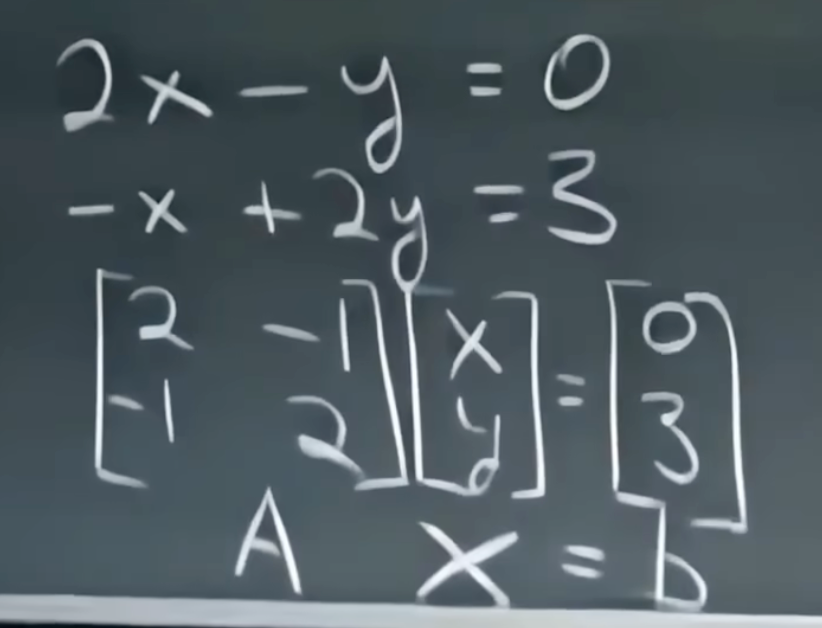

行图像：就是2条直线求交点

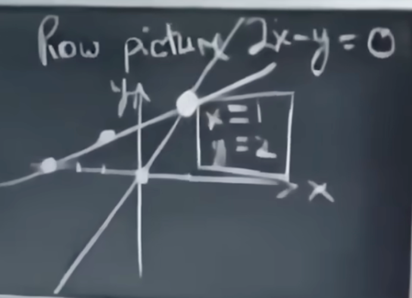

列图像：求解两个列向量的线性组合

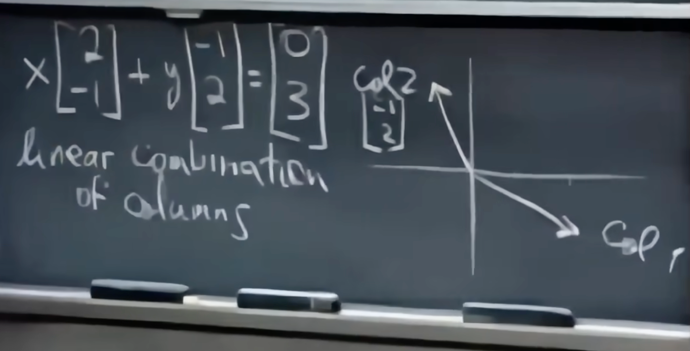

col1和col2的线性组合，要得到$$[0,3]$$这个向量。我们已经知道答案是$$[1,2]$$，所以从col1的尾部，画一个2倍col长度的向量，得到一个点，从原点连过来刚好就是$$[0,3]$$这个向量

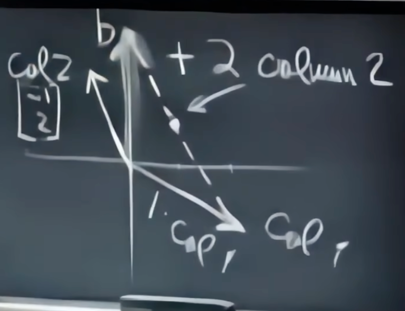

注意，向量平移，结果还是它本身，即上面从col1尾部画向量那一步

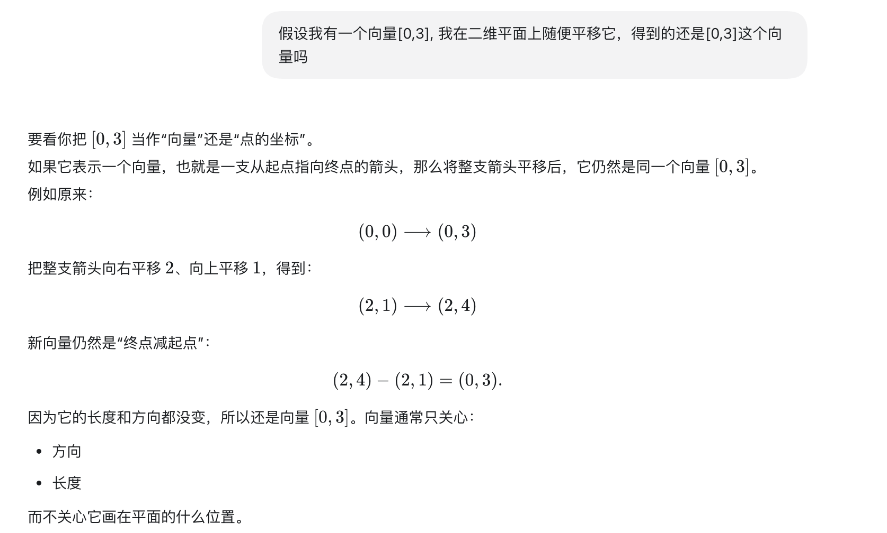

如果是三元方程组，从行图像的角度来讲，那就是3个平面，前2个相交是一条直线，和第3个再相交就是一个点

从列图像来讲，就更简单一点了，还是3个向量的线性组合，只不过换成了3维空间

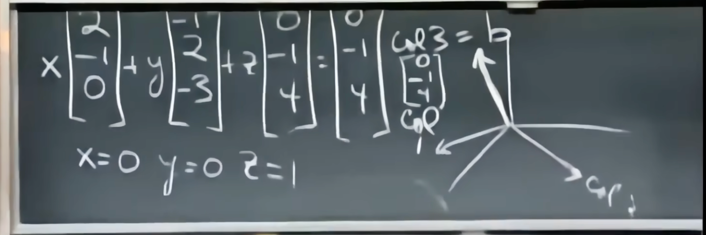

对于任意一个$$b$$，是否都能求解$$Ax=b$$？(如果有，消元法就能求解)

这个问题就转化成，列向量的线性组合是否可以覆盖整个3维空间？

答案：对于可逆矩阵（非奇异矩阵），可以；如果3个列向量在同一平面上，不行，这种情况叫奇异矩阵(不可逆)

矩阵乘向量的列视角：$$Ax$$是$$A$$各列的线性组合
 
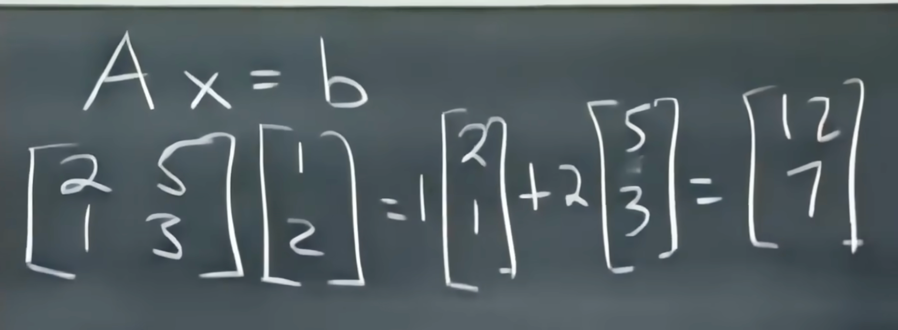

## 矩阵消元

先选中第1行第1列为主元（pivot），其所在的行不变，乘以一个消元系数（图中的3），然后被第2行减掉（即$$R_2 \leftarrow R_2-3 R_1$$），让第2行的pivot对应的元素变成0；然后对第3行也这么做

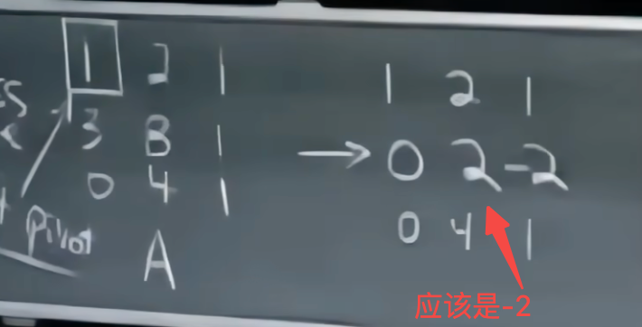

然后第2行第2列为主元，消掉第3行

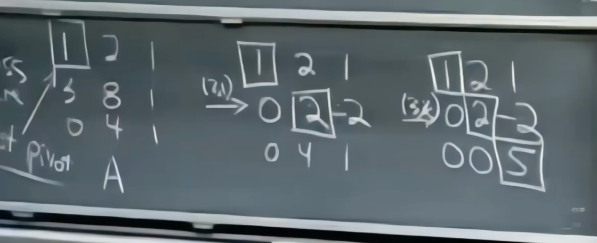

这样矩阵消元最后得到的就是一个**上三角矩阵**（左下角全0，右上角非0），这是计算机中最常见的运算，人们在想各种加速方法。

另外矩阵的行列式正好等于主元的积

注意，主元不能是0，这个矩阵很好，刚好主元都没有0。特殊情况：

1. 第1个主元是0，不代表不行，可以交换矩阵的行再继续 
2. 但如果下面的元素也全是0，那就没法交换了，消元就失效了

接下来把b拼进去（增广矩阵），然后一起消元，就可以得到下图

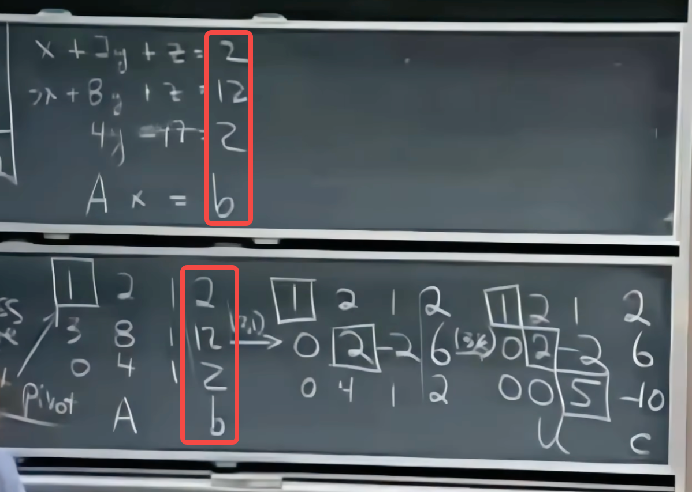

然后还原成方程组，发现第3行只有z，那么从下往上依次求解z、y、x就行了（代入，substitution）

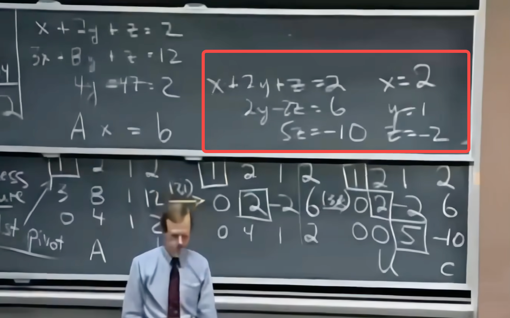

向量乘以矩阵的行视角：向量的每个元素对矩阵每一行的线性组合

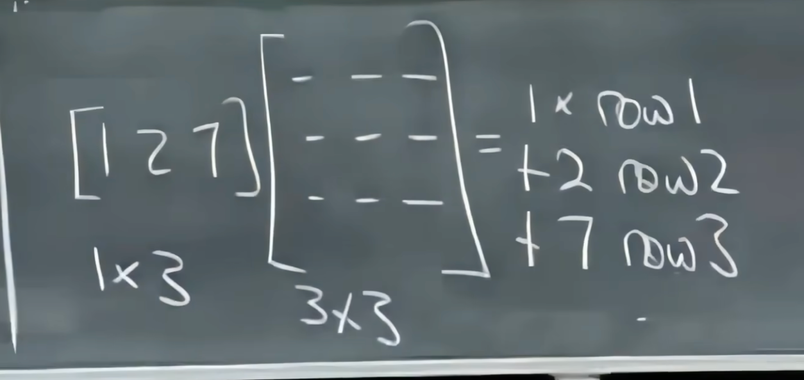
 
接下来从矩阵的视角来理解消元，目标是找到一个矩阵，使得原矩阵第2行变成它减掉3倍的第1行，然后第1和第3行不变：

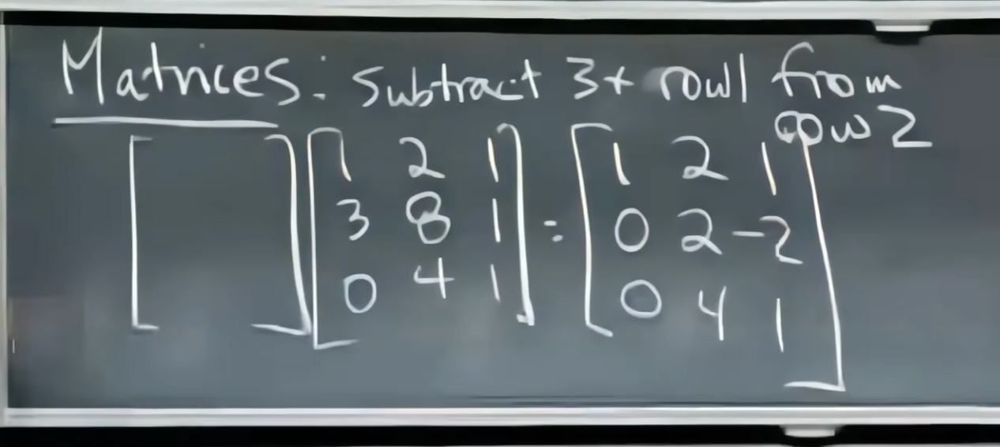

第1行是1 0 0，因为只要右边的第一行，别的不要；第3行是0 0 1，因为只要第3行；第2行是-3 1 0，因为第一行的-3倍，加上行2行原始值；这个矩阵叫$$E_{21}$$，因为是要把第2行第1列变成0

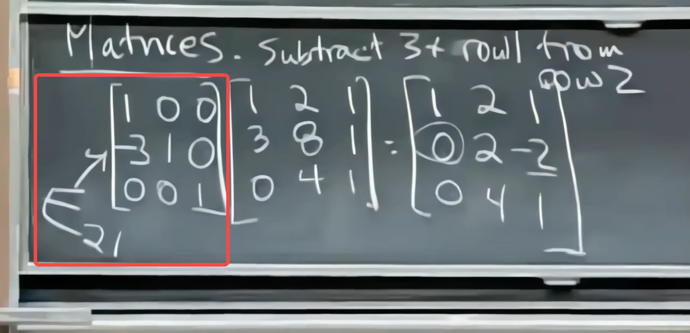

同理，第3行减掉2倍的第2行，就得到下图

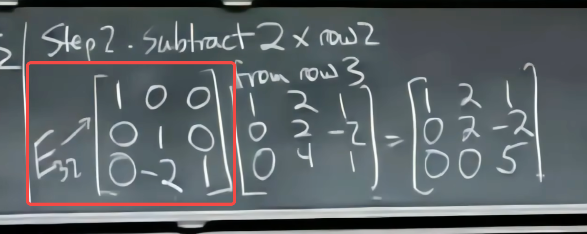

最终就有$$E_{32}(E_{21}A)=U$$，但如何一次性从$$A$$到$$U$$？结合律(associative law)：$$(E_{32}E_{21})A=U$$

置换矩阵（permutation matrix）：交换两行的位置，可以看到就是个类似单位矩阵的东西

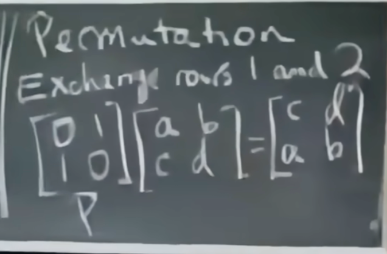

但如果要交换列呢？P矩阵要放右边：

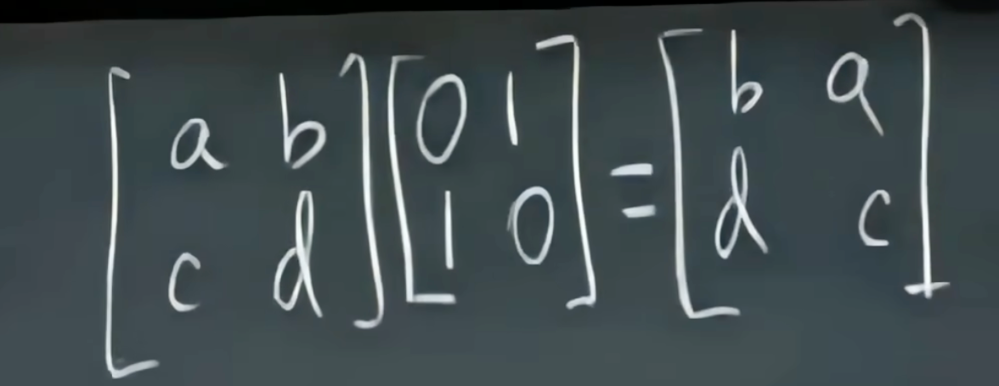

倒回来看那个$$E_{21}A=U$$，如果我想变回去，即把U变回A，那就是$$?E_{21}A=A$$，即$$?E_{21}=I$$，其实就是求逆。因为我们$$E{21}$$是第2行减去第1行的3倍，那其实就是逆向操作，即第2行不变，加回第1行的3倍就行了，不要第3行

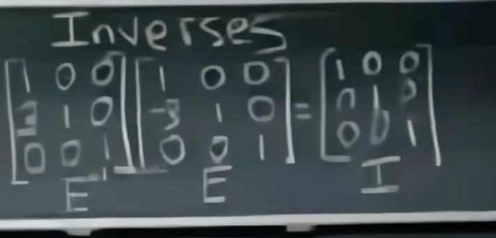

## 矩阵乘法

一些有趣的性质：$$AB=C$$

+ 列的角度：

矩阵$$B$$有好几列，取其中一列出来，这列的每个元素作为权重，去和$$A$$里每一列相乘，再相加，就得到$$C$$的这一列（就是**对A中所有列的线性组合**）

$$
A
\begin{bmatrix}
x\\y\\z
\end{bmatrix}=
x(A\text{第1列})
+y(A\text{第2列})
+z(A\text{第3列})
$$

$$
(AB)_{:,j}=\sum _k b_{kj}A_{:,k}
$$

+ 行的角度：

矩阵$$A$$有好几行，取其中一行出来，这行的每个元素作为权重，去和$$B$$里每一行相乘，再相加，就得到$$C$$的这一行（就是**对B中所有行的线性组合**）

$$

\begin{bmatrix}
x&y&z
\end{bmatrix}
B=
x(B\text{第1行})
+y(B\text{第2行})
+z(B\text{第3行})
$$

$$
(AB)_{i,:}=\sum _k a_{ik} B_{k,:}
$$

+ 外积的角度

$$A$$的第$$k$$列乘以$$B$$的第$$k$$行，得到一个外积矩阵，再把所有外积矩阵加起来。

$$
AB=\sum _k A_{:,k} B_{k,:}
$$

+ 分块乘法

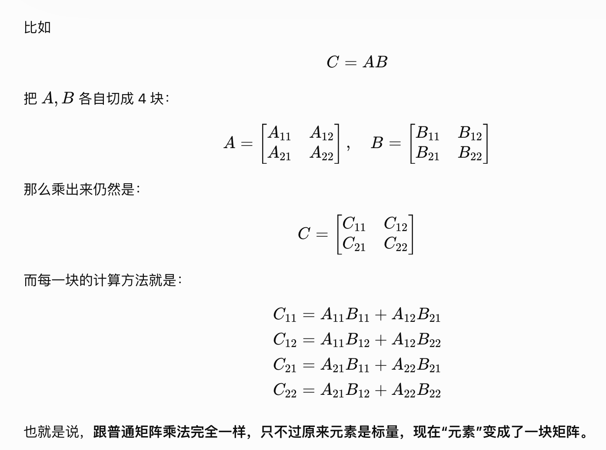

## 矩阵逆

方阵的左逆=右逆，非方阵没这个性质，因为shape不一样
可逆、非奇异

行列式=0的矩阵(奇异矩阵)没有逆

$$
A=\begin{bmatrix}
1&2\\
3&6\\
\end{bmatrix}
$$

这个矩阵没有逆

解释1：因为这两列是平行的，不论如何线性组合都是平行于$$\begin{bmatrix}
1\\
3\\
\end{bmatrix}$$那条线的，没法和$$\begin{bmatrix}
1\\
0\\
\end{bmatrix}$$有交点

解释2：如果能够找到一个非0向量$$x$$，使得$$Ax=0$$，那么$$A$$没有逆。证明：

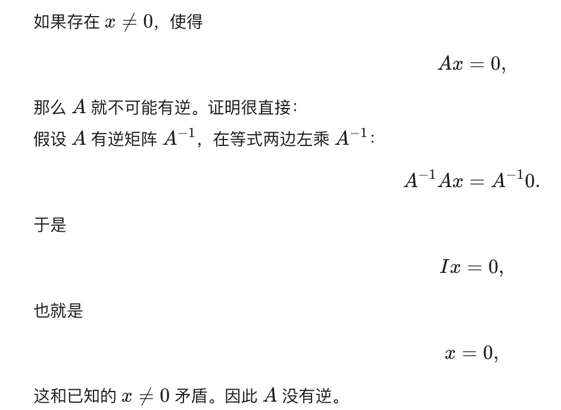

==>不可逆矩阵、奇异矩阵，其列能通过线性组合得到0

如何求逆？高斯-若尔当（Gauss-Jordan）消元法：同时求解2个方程组

增广矩阵的思想，把单位矩阵增广进去，然后进行消元，把左边变成单位矩阵，而右边就变成了逆矩阵

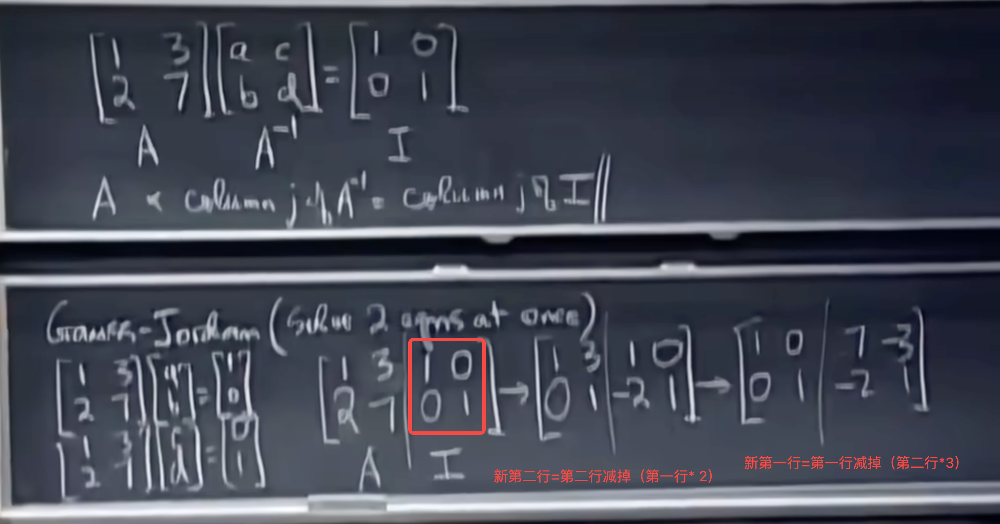

为什么？如上消了2次，总的消元矩阵假设是$$$$E$$

$$E[A I] = [I E]$$, 而$$EA=I$$，说明$$E=A^{-1}$$，所以最右边那个矩阵就是$$A^{-1}$$

# LLM+math

## mathscale

[【LLM-数学】MathScale 用于数学推理的指令调优扩展方法](https://mp.weixin.qq.com/s/tQUIGdViMZTb_9NNh3b3RQ)

[MathScale: Scaling Instruction Tuning for Mathematical Reasoning](https://arxiv.org/pdf/2403.02884.pdf)

## AlphaGeometry

[奥数能力金牌级：DeepMind几何推理模型登上Nature，代码开源，菲尔兹奖得主点赞](https://mp.weixin.qq.com/s?__biz=MzA3MzI4MjgzMw==&mid=2650904746&idx=1&sn=d39a3d92078cecbd29bd0fc82560d1da&chksm=84e45cd4b393d5c24747f163fa0338761690447904a1a654aacf2344d7a16d36dfa2ac3ccdb0&scene=21#wechat_redirect)提出了AlphaGeometry

## AlphaProof & AlphaGeometry 2

[谷歌AI拿下IMO奥数银牌，数学推理模型AlphaProof面世，强化学习 is so back](https://mp.weixin.qq.com/s/LNzbyf0w412BIz71sROyzw)提出AlphaProof和AlphaGeometry 2

## WE-Math基准

[真相了！大模型解数学题和人类真不一样：死记硬背、知识欠缺明显，GPT-4o表现最佳](https://mp.weixin.qq.com/s/uU1lZV0Ymj31cmZryhffyQ)

[WE-MATH: Does Your Large Multimodal Model Achieve Human-like Mathematical Reasoning?](https://arxiv.org/pdf/2407.01284)

[https://github.com/We-Math/We-Math](https://github.com/We-Math/We-Math)

[https://huggingface.co/datasets/We-Math/We-Math](https://huggingface.co/datasets/We-Math/We-Math)

## case-based or rule-based

[ICML 2024｜Transformer究竟如何推理？基于样例还是基于规则](https://mp.weixin.qq.com/s/aVRiGW3xU_LpvxZzjDpwzQ)

[Case-Based or Rule-Based: How Do Transformers Do the Math?](https://arxiv.org/pdf/2402.17709)

[https://github.com/GraphPKU/Case_or_Rule](https://github.com/GraphPKU/Case_or_Rule)

# AlphaProof(nature)

[Olympiad-level formal mathematical reasoning with reinforcement learning](https://www.nature.com/articles/s41586-025-09833-y)

[代码](https://github.com/daiwk/collections/blob/master/assets/alphaproof_pseudocode.py)，从[https://www.nature.com/articles/s41586-025-09833-y](https://www.nature.com/articles/s41586-025-09833-y)这里的Supplementary Data下载

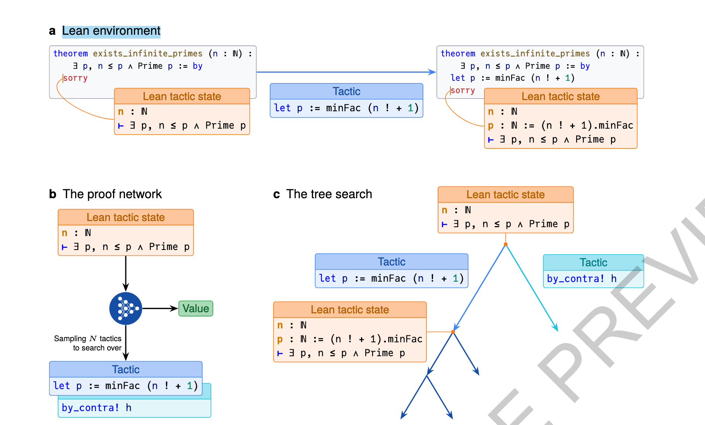

+ 状态：Lean prover的逻辑状态，即Lean tactic state，表示已经建立的假设，和剩下的目标
+ 环境：给定一个状态，和agent采取的动作，输出下一个状态
+ 动作：一个证明的中间步骤，是一段文本，例如“a=2,b=2a,==>b=4”
+ episode结束条件：证明完成or预算花完（例如超时）
+ reward：每个tactic的reward都是-1，因为要鼓励用更少的步骤完成证明，即到达终点的分支路径最短

prover agent是把dnn和alphazero的搜索算法相结合：

+ proof network：是一个3B的encoder-decoder transformer，输入Lean tactic state，输出2个东西：
    + policy：下一步要尝试的N个动作
    + value：当前**状态**的价值，即从此刻到episode结束时的每步reward之和
+ tree search：和alphazero类似，使用AND-OR tree structure将证明拆成多个独立的子目标(类似[Hypertree proof search for neural theorem proving](https://arxiv.org/pdf/2205.11491))，采样使用的progressive sampling

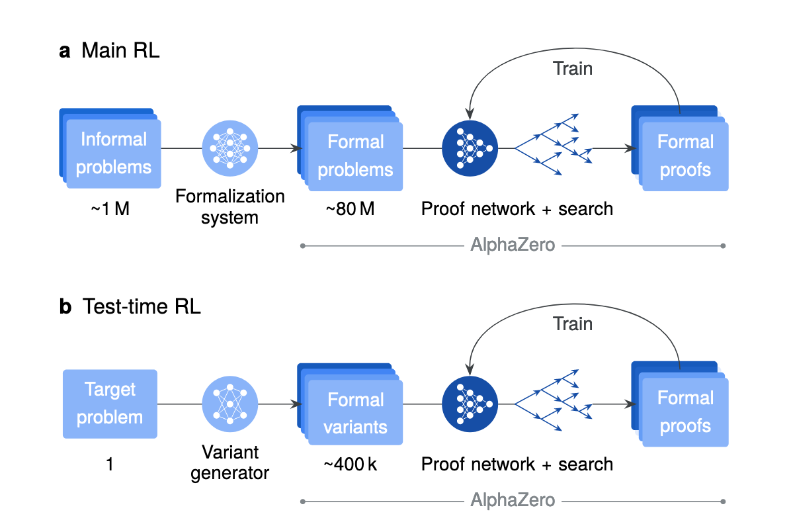

+ 预训练：proof network在大概300 billion tokens的代码和数学语料通过next token prediction预训练
+ SFT：在300k的人类用matlab标注的证明语料(state-tactic pairs)上sft，
+ main RL：
    + 用gemini的LLM搞了一个自动形式化（formalization）的系统，将大概1M的非形式化的问题形式化成了80M的问题
    + proof network+tree search和Lean环境交互，生成形式化的证明和反证（disproof），然后用Alphazero的方式基于得到的经验去RL训练
+ inference：
    + 首先参考Alphazero，增加tree search的预算，例如产生更多的搜索路径
    + 如果增加了搜索路径还不够，那就用Test-time RL（TTRL）：
        + 给定一个问题，variant generator生成其变种（例如简化或者泛化）
        + 基于这些变种去进行RL训练
