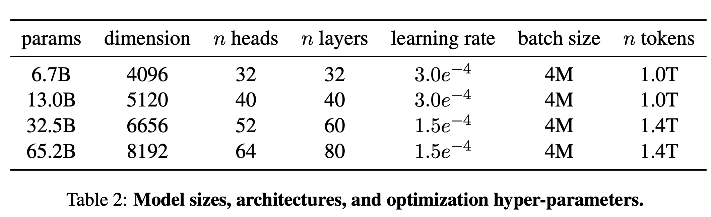

# 大模型与AIGC

## 小结

+ gpt1：transformer的decoder，参数量117m（0.1b）
+ gpt2：模型结构小改，增加数据，参数量变大（1.5b）
+ gpt3：175b（1750亿）参数，当参数量到达千亿时出现了『涌现』现象，发现可以in-context learning
+ Instructgpt：RLHF（sft-->rm-->ppo）
+ gpt3.5：据说基本上等于instructgpt
+ gpt4：没公开细节，但听说效果很好，用起来也确实比3.5要好

## llm应用合辑

+ ChatGPT聚合站：[https://hokex.com](https://hokex.com)
+ 游戏生成站：[https://latitude.io/](https://latitude.io/)
+ 家庭作业辅助站：[https://ontimeai.com/](https://ontimeai.com/)
+ 文字转语音站：[https://www.resemble.ai/](https://www.resemble.ai/)
+ 艺术作画站：[https://starryai.com/](https://starryai.com/)
+ logo制作站：[https://www.logoai.com/](https://www.logoai.com/)
+ ai写作站：[https://www.getconch.ai/](https://www.getconch.ai/)
+ 音乐制作站：[https://soundraw.io/](https://soundraw.io/)
+ 声音模拟站：[https://fakeyou.com/](https://fakeyou.com/)
+ 一句话生成一段视频：[https://runwayml.com/](https://runwayml.com/)
+ 文字转语音：[https://murf.ai/](https://runwayml.com/)

## LLM+推荐

[推荐系统范式之争，LLM vs. ID？](https://mp.weixin.qq.com/s/7pQ891pnp_BM7qH7ROiWwg)

## NLP大模型

### InstructGPT

[OpenAI魔改大模型，参数减少100倍！13亿参数InstructGPT碾压GPT-3](https://mp.weixin.qq.com/s/_lsTzx-NbiSmI7KrRXyYZg)

[https://openai.com/blog/deep-reinforcement-learning-from-human-preferences/](https://openai.com/blog/deep-reinforcement-learning-from-human-preferences/)

[Training language models to follow instructions with human feedback](https://cdn.openai.com/papers/Training_language_models_to_follow_instructions_with_human_feedback.pdf)

### Anthropic

[Training a Helpful and Harmless Assistant with Reinforcement Learning from Human Feedback](https://arxiv.org/pdf/2204.05862.pdf)

[Studying Large Language Model Generalization with Influence Functions](https://arxiv.org/pdf/2308.03296.pdf)

[Measuring Faithfulness in Chain-of-Thought Reasoning](https://www-files.anthropic.com/production/files/measuring-faithfulness-in-chain-of-thought-reasoning.pdf)

### llama

[LLaMA: Open and Efficient Foundation Language Models](https://arxiv.org/abs/2302.13971)

之前的工作考虑的是在训练预算有限的前提下，如何提升模型性能（2022年deepmind的[Training Compute-Optimal Large Language Models](https://arxiv.org/pdf/2203.15556.pdf)的Chinchilla）,llama考虑在预测时的预算。例如chinchilla是一个10b的模型在200b的token上训练，但其实一个7b的模型当用了1T的token后，性能仍在提升。LLama-13b比gpt3在大多数benchmark上好，但size只有1/10，在一个GPU上就能跑。

llama只用公开数据训练，而Chinchilla、PaLM、GPT-3都有自己的未公开数据集。其他的OPT、GPT-NeoX、BLOOM、GLM虽然也只用公开数据集，但打不过PaLM-62B或者Chinchilla

#### 预训练数据

+ English CommonCrawl(67%)：使用CCNet pipeline，去重、用fasttext把非英文的页面删了，用n-gram把低质内容删了。此外，还训了一个线性模型，对页面进行分类：作为维基百科的引用 vs 随机采样的页面，最后把不属于引用这个类别的页面删了
+ C4(15%)：与CCNet类似，主要区别在质量过滤是基于启发式的规则，如标点符号的存在，或者词数和句子数
+ github(4.5%)：使用Google BigQuery里的公开github数据集，只用Apache、BSD和MIT证书的。低质判断是启发式规则，如字母数字占比、行的长度等，用正则删掉head等样式，最终以文件粒度进行去重。
+ wikipedia(4.5%)：2022年6-8月的数据，包括20种语言
+ Gutenberg and Books3(4.5%)：两个书籍数据集，对有90%以上内容重复的书籍做去重。
+ Arxiv(2.5%)：拿原始的tex文件，删掉first section之前的东西，还有一些注释、宏
+ Stack Exchange(2%)：高质量的问答网站，按答案的分数排序

tokenizer：BPE，使用sentencepiece的实现。将所有numbers切成单个数字，回退到字节去处理未知的utf8字符（fallback to bytes to decompose unknown UTF-8 characters）

总共有1.4T的token，对大部分训练数据，每个token在训练时只用了一次，除了维基和book大概用了两次。

附：gpt4说：当我们说"一个token只训练一次"，我们其实是在说在一个epoch（一个完整遍历训练集的过程）中，我们只遍历一次完整的数据集。如果一个特定的token在数据集中出现多次，那么在一个epoch中，这个token就会被用来训练模型多次。

#### 网络结构

+ pre-normalization(gpt3)：提升训练**稳定性**，对每个子层的输入做norm，而非输出。此外，使用的是RMSNorm函数([Root mean square layer normalization](https://arxiv.org/abs/1910.07467))
+ SwiGLU激活函数(PaLM)：[Glu variants improve trans- former](https://arxiv.org/abs/2002.05202)，把PaLM里的$$4d$$改了$$2/34d$$
+ Rotary embeddings(GPTNeo)：删掉原来的绝对位置编码，加上rotary positional embedding(RoPE)，网络的每一层都加，参考[Roformer: En- hanced transformer with rotary position embedding](https://arxiv.org/pdf/2104.09864.pdf)

优化器：AdamW，cosine学习率schedule，最终学习率是最大学习率的10%。0.1的weight decay和1.0的gradient cliping，使用2000steps的warmup

#### 训练加速

+ 对causal multi-head attention加速：实现在[http://github.com/facebookresearch/xformers](http://github.com/facebookresearch/xformers)中，降低内存使用和运行时间，参考[self-attention does not need $$o(n^2)$$ memory](https://arxiv.org/pdf/2112.05682.pdf)，以及[Flashattention: Fast and memory-efficient exact attention with io-awareness](https://arxiv.org/abs/2205.14135)。思想是
    + 不存储attention weights
    + 不计算被mask的key/query得分
+ 减少xxx：

### llama2

[Llama 2: Open Foundation and Fine-Tuned Chat Models](https://arxiv.org/abs/2307.09288)

[https://zhuanlan.zhihu.com/p/636784644](https://zhuanlan.zhihu.com/p/636784644)

### ChatGLM

ACL22 [GLM: General Language Model Pretraining with Autoregressive Blank Infilling](https://arxiv.org/abs/2103.10360)

iclr23 [GLM-130B: An Open Bilingual Pre-trained Model](https://arxiv.org/abs/2210.02414)

### PALM-E

[PaLM-E: An Embodied Multimodal Language Model](https://arxiv.org/abs/2303.03378)

### 达摩院大模型技术交流

[https://developer.aliyun.com/live/248332](https://developer.aliyun.com/live/248332)

ppt：[链接](https://pan.baidu.com/s/1tbckFpa8W8qJ5yRw9yvJ9A#list/path=%2F) 密码：5yyf

### Google的大规模稀疏模型设计

[DESIGNING EFFECTIVE SPARSE EXPERT MODELS](https://arxiv.org/pdf/2202.08906.pdf)

代码：[https://github.com/tensorflow/mesh/blob/master/mesh_tensorflow/transformer/moe.py](https://github.com/tensorflow/mesh/blob/master/mesh_tensorflow/transformer/moe.py)

### RETRO Transformer

[参数量仅为4%，性能媲美GPT-3：开发者图解DeepMind的RETRO](https://baijiahao.baidu.com/s?id=1721015293574115195&wfr=spider&for=pc)

[http://jalammar.github.io/illustrated-retrieval-transformer/](http://jalammar.github.io/illustrated-retrieval-transformer/)

[Improving language models by retrieving from trillions of tokens](https://arxiv.org/abs/2112.04426)

### WebGPT

[WebGPT: Browser-assisted question-answering with human feedback](https://arxiv.org/abs/2112.09332)

[https://openai.com/blog/webgpt/](https://openai.com/blog/webgpt/)

### prompt

[Fine-tune之后的NLP新范式：Prompt越来越火，CMU华人博士后出了篇综述文章](https://zhuanlan.zhihu.com/p/395795968)

### ray-llm

[https://github.com/ray-project/ray/releases/tag/ray-2.4.0](https://github.com/ray-project/ray/releases/tag/ray-2.4.0)

### llm相关汇总

llm中文数据集

[https://juejin.cn/post/7238921093553438779](https://juejin.cn/post/7238921093553438779)

简单综述

[https://juejin.cn/post/7240022931078004797](https://juejin.cn/post/7240022931078004797)

### llm for rec

[Recommendation as Language Processing (RLP):A Unified Pretrain, Personalized Prompt & Predict Paradigm (P5)](https://arxiv.org/pdf/2203.13366.pdf)

## CV大模型

### stable diffusion

[High-Resolution Image Synthesis with Latent Diffusion Models](https://arxiv.org/abs/2112.10752)

输入图像，经过编码器得到z，z通过前向扩散不断加噪声得到$$z_T$$（正向扩散）

输入条件，经过条件编码器（原文是BERT，到了DALL-E2就改成CLIP了)得到$$\tau_\theta$$

$$z_T$$在$$\tau_\theta$$的指导下不断去噪（反向扩散），得到新的z，再通过解码器得到最终生成的图像

## 多模态

[【IEEE Fellow何晓东&邓力】多模态智能论文综述：表示学习，信息融合与应用，259篇文献带你了解AI热点技](https://mp.weixin.qq.com/s/EMWpBP5iB1Qrleo3XNjbuQ)

[Multimodal Intelligence: Representation  Learning, Information Fusion, and Applications](https://arxiv.org/abs/1911.03977)

[BERT在多模态领域中的应用](https://mp.weixin.qq.com/s/THxlQX2MPXua0_N0Ug0EWA)

CV领域：VisualBert, Unicoder-VL, VL-Bert, ViLBERT, LXMERT。

CLIP
