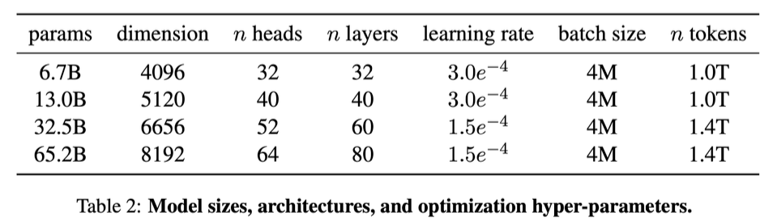
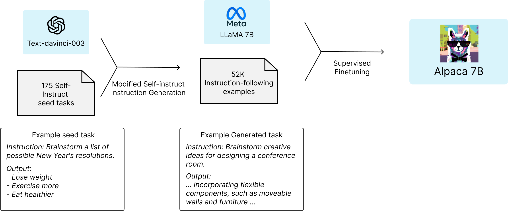

下载本文pdf：[https://github.com/daiwk/collections/blob/master/pdfs/llm_aigc.pdf](https://github.com/daiwk/collections/blob/master/pdfs/llm_aigc.pdf)

各种学习相关代码

[https://github.com/daiwk/llms](https://github.com/daiwk/llms)

# 概述


## LLM简史

+ 2017年的[Learning to generate reviews and discovering sentiment](https://arxiv.org/pdf/1704.01444.pdf)尝试用rnn来实现智能系统
+ 2018年的gpt1：[Improving language understanding by generative pre-training](https://s3-us-west-2.amazonaws.com/openai-assets/research-covers/language-unsupervised/language_understanding_paper.pdf)，生成式预训练（Generative pre-training, gpt），用transformer的decoder，参数量117m（0.1b），无监督预训练和有监督微调。确定对自然语言文本建模的基本原则为**预测下一个单词**。
+ 2019年的gpt2：[Language models are unsupervised multitask learners](https://d4mucfpksywv.cloudfront.net/better-language-models/language_models_are_unsupervised_multitask_learners.pdf)模型结构小改，增加数据，参数量变大为15亿（1.5b），无监督语言建模，**无需使用标记数据进行显式微调**。
    + 参考[The natural language decathlon: Multitask learning as question answering](https://arxiv.org/pdf/1806.08730.pdf)中**多任务求解的概率形式**： $$p(output|input,task)$$ 。
    + 提出“由于特定任务的有监督目标与无监督目标（语言建模）相同，只是在序列的子集上进行评估，因此，无监督目标的全局最小值也是有监督目标的全局最小值”，即每个NLP任务可以看作**世界文本子集的单词预测问题**，如果模型有足够能力来复原世界文本，无监督语言建模可以解决各种问题。
    + 仅无监督与监督微调的SOTA相比效果还是不太行。虽然GPT2模型规模相对较小，但如对话等任务在其基础上做微调还是能拿到很好的效果的，例如[DIALOGPT : Large-scale generative pre-training for conversational response generation](https://arxiv.org/pdf/1911.00536.pdf)、[End-to-end neural pipeline for goal-oriented dialogue systems using GPT-2](https://aclanthology.org/2020.acl-main.54.pdf)
+ 2020年的gpt3：[Language models are few-shot learners](https://arxiv.org/pdf/2005.14165.pdf)，175b（1750亿）参数，当参数量到达千亿时出现了『涌现』现象，发现可以in-context learning（这点在**3.3亿的BERT和15亿的gpt2中看不到**）。**预训练和ICL有相同的语言建模范式**：预训练预测给定上下文条件下的后续文本序列，ICL预测正确的任务解决方案，其可被格式化为给定任务描述和示范下的文本序列。
+ GPT-3的两种改进方法：
    + 使用代码数据训练：GPT-3主要问题是缺乏对复杂任务的推理能力，2021年openai提出了Codex（[Evaluating Large Language Models Trained on Code](https://arxiv.org/pdf/2107.03374.pdf)），在github代码上微调的GPT。[A neural network solves and generates mathematics problems by program synthesis: Calculus, differential equations, linear algebra, and more](https://arxiv.org/pdf/2112.15594.pdf)发现Codex能解决非常困难的编程问题，还能在数学问题上有显著提升。[Text and code embeddings by contrastive pre-training](https://arxiv.org/pdf/2201.10005.pdf)提出了训练文本和代码emb的对比学习，在线性探测分类、文本搜索、代码搜索等任务上有所提升。GPT-3.5就是在基于代码的GPT（code-davinci-002）的基础上开发的。
    + 与人类对齐：2017年openai就在[learning from human preference](https://openai.com/research/learning-from-human-preferences)的博客中提出了应用强化学习来学习由人类标的偏好比较，此后2021年7月openai发表了PPO。2020年GPT-2用RL进行微调，[Deep reinforcement learning from human preferences](https://arxiv.org/pdf/1706.03741.pdf)，[Learning to summarize from human feedback](https://arxiv.org/pdf/2009.01325.pdf)也做了相似工作。2022年提出了RLHF的InstructGPT([Training language models to follow instructions with human feedback](https://arxiv.org/pdf/2203.02155.pdf))，其中的**SFT就对应于常说的指令微调**。在openai的博客[Our approach to alignment research](https://openai.com/blog/our-approach-to-alignment-research)中提出了训练AI系统的3个有前途的方向：**使用人类反馈、协助人类评估、做对齐研究**。
+ 2022年的ChatGPT：用类似InstructGPT的方式进行训练，专门**对对话能力进行优化**，将人类生成的对话（**扮演用户和AI两个角色**）与InstructGPT数据集结合起来**以对话形式生成**。
+ 2023年的GPT-4：将文本输入扩展到**多模态信号**。此外，
    + 提升安全性：在RLHF训练中加入**额外的安全奖励信号**，采用多种干预策略如Anthropic提出的[Red teaming language models to reduce harms: Methods, scaling behaviors, and lessons learned](https://arxiv.org/pdf/2209.07858.pdf)提到的红队评估（read teaming）机制以减轻幻觉、隐私和过度依赖问题。
    + 改进的优化方法：使用**可预测扩展**（predictable scaling）的机制，使用模型训练期间的一小部分计算量**以预测最终性能**。
    + 迭代部署的工程方案：[Lessons learned on language model safety and misuse](https://openai.com/research/language-model-safety-and-misuse)，遵循5阶段的开发和部署生命周期来开发模型和产品。

## LLM列表（持续更新中）

+ 百亿：除了LLaMA（最大650亿）和NLLB（最大545亿），大多数在100亿-200亿之间，通常需要**数百甚至上千**个GPU或TPU。
+ 千亿：OPT、OPT-IML、BLOOM和BLOOMZ与GPT-3(175B)大致相同，GLM有1300亿，Galactica有1200亿，通常需要**数千**个GPU或者TPU。

| ckpt? | 模型 |发布时间 | 大小 | 预训练数据规模 | 硬件 | 训练时间  |
|---|---|---|---|---|---|---|
| Y | [T5](https://arxiv.org/pdf/1910.10683.pdf) | 2019.10| 11B |  1万亿tokens | 1024 TPU v3  |  - |
| N | [GPT-3](https://arxiv.org/pdf/2005.14165.pdf) | 2020.05 | 175B |  3000万亿tokens | -  |  - |
| N | [GShard](https://arxiv.org/pdf/2006.16668.pdf) | 2020.06 | 600B |  1万亿tokens | 2048 TPU v3 | 4天 |
| Y | [mT5](https://arxiv.org/pdf/2010.11934.pdf) | 2020.10 | 13B |  1万亿tokens | -  |  - |
| Y | [PanGu-$$\alpha$$](https://arxiv.org/pdf/2104.12369.pdf) | 2021.04 | 13B |  1.1TB | 2048 Ascend 910 | - |
| Y | [CPM-2](https://arxiv.org/pdf/2106.10715.pdf) | 2021.06 | 198B |  2.6TB | - | - |
| N | [Codex](https://arxiv.org/pdf/2107.03374.pdf) | 2021.07 | 12B |  1000万亿tokens | - | - |
| N | [ERNIE 3.0](https://arxiv.org/pdf/2107.02137.pdf) | 2021.07 | 10B |  3750亿tokens | 384 v100 | - |
| N | [Jurassic-1](https://uploads-ssl.webflow.com/60fd4503684b466578c0d307/61138924626a6981ee09caf6_jurassic_tech_paper.pdf) | 2021.08 | 178B | 3000亿tokens | 800 GPU | - |
| N | [HyperCLOVA](https://arxiv.org/pdf/2109.04650.pdf) | 2021.09 | 82B | 3000亿tokens | 1024 A100 | 13.4天 |
| N | [FLAN](https://arxiv.org/pdf/2109.01652.pdf) | 2021.09 | 137B | - | 128 TPU v3 | 60小时 |
| N | [Yuan 1.0](https://arxiv.org/pdf/2110.04725.pdf) | 2021.10 | 245B | 1800亿tokens | 2128 GPU | - |
| Y | [T0](https://arxiv.org/pdf/2211.01786.pdf) | 2021.10 | 11B | - | 512 TPU v3 | 27小时 |
| N | [Anthropic](https://arxiv.org/pdf/2112.00861.pdf) | 2021.12 | 52B | 4000亿tokens | - | - |
| N | [WebGPT](https://arxiv.org/pdf/2112.09332.pdf) | 2021.12 | 175B |  - | - | - |
| N | [Gopher](https://arxiv.org/pdf/2112.11446.pdf) | 2021.12 | 280B |  3000亿tokens | 4096 TPU v3 | 920小时 |
| N | [ERNIE 3.0 Titan](https://arxiv.org/pdf/2112.12731.pdf) | 2021.12 | 260B |  - | - | - |
| N | [GLaM](https://arxiv.org/pdf/2112.06905.pdf) | 2021.12 | 1200B | 2800亿tokens | 1024 TPU v4 | 574小时 |
| N | [LaMDA](https://arxiv.org/pdf/2201.08239.pdf) | 2022.01 | 137B |  7680亿tokens | 1024 TPU v3 | 57.5天 |
| N | [MT-NLG](https://arxiv.org/pdf/2201.11990.pdf) | 2022.01 | 530B | 2700亿tokens | 4480 80G A100 | - |
| N | [AlphaCode](https://arxiv.org/pdf/2203.07814.pdf) | 2022.02 | 41B | 9670亿tokens | - | - |
| N | [InstructGPT](https://arxiv.org/pdf/2203.02155.pdf) | 2022.03 | 175B |  - | - | - |
| N | [Chinchilla](https://arxiv.org/pdf/2203.15556.pdf) | 2022.03 | 70B | 1.4万亿tokens | - | - |
| Y | [CodeGen](https://arxiv.org/pdf/2203.13474.pdf) | 2022.03 | 16B | 5770亿tokens | - | - |
| Y | [GPT-NeoX-20B](https://arxiv.org/pdf/2204.06745.pdf) | 2022.04 | 20B | 825GB | 96 40G A100 | - |
| Y | [Tk-Instruct](https://arxiv.org/pdf/2204.07705.pdf) | 2022.04 | 11B |  - | 256 TPU v3 | 4小时 |
| N | [PaLM](https://arxiv.org/pdf/2204.02311.pdf) | 2022.04 | 540B | 7800亿tokens | 6144 TPU v4 | - |
| Y | [UL2](https://arxiv.org/pdf/2205.05131.pdf) | 2022.05 | 20B |  825GB | 96 40G A100 | - |
| Y | [OPT](https://arxiv.org/pdf/2205.01068.pdf) | 2022.05 | 175B | 1800亿tokens | 992 80G A100 | - |
| Y | [NLLB](https://arxiv.org/pdf/2207.04672.pdf) | 2022.07 | 54.5B |  - | - | - |
| N | [AlexaTM](https://arxiv.org/pdf/2208.01448.pdf) | 2022.08 | 20B | 1.3万亿tokens | 128 A100 | 120天 |
| N | [Sparrow](https://arxiv.org/pdf/2209.14375.pdf) | 2022.09 | 70B | 64 TPU v3 | - | - |
| N | [WeLM](https://arxiv.org/pdf/2209.10372.pdf) | 2022.09 | 10B | 3000亿tokens | 128 A100 40G | 24天 |
| N | [U-PaLM](https://arxiv.org/pdf/2210.11399.pdf) | 2022.10 | 540B | - | 512 TPU v4 | 5天 |
| N | [Flan-PaLM](https://arxiv.org/pdf/2210.11416.pdf) | 2022.10 | 540B |  - | 512 TPU v4 | 37小时 |
| N | [Flan-U-PaLM](https://arxiv.org/pdf/2210.11416.pdf) | 2022.10 | 540B |  - | - | - |
| Y | [GLM](https://arxiv.org/pdf/2210.02414.pdf) | 2022.10 | 130B | 4000亿tokens | 768 40G A100 | 60天 |
| Y | [Flan-T5](https://arxiv.org/pdf/2210.11416.pdf) | 2022.10 | 11B |  - | - | - |
| Y | [BLOOM](https://arxiv.org/pdf/2211.05100.pdf) | 2022.11 | 176B | 3660亿tokens | 384 80G A100 | 105天 |
| Y | [mT0](https://arxiv.org/pdf/2211.01786.pdf) | 2022.11 | 13B |  - | - | - |
| Y | [Galactica](https://arxiv.org/pdf/2211.09085.pdf) | 2022.11 | 120B | 1060亿tokens | - | - |
| Y | [BLOOMZ](https://arxiv.org/pdf/2211.01786.pdf) | 2022.11 | 176B |  - | - | - |
| Y | [OPT-IML](https://arxiv.org/pdf/2212.12017.pdf) | 2022.12 | 175B |  - | 128 40G A100 | - |
| Y | [LLaMA](https://arxiv.org/pdf/2302.13971.pdf) | 2023.02 | 65B | 1.4万亿tokens | 2048 80G A100 | 21天 |
| N | [GPT-4](https://arxiv.org/pdf/2303.08774.pdf) | 2023.03 | - |  - | - | - |
| Y | [CodeGeeX](https://arxiv.org/pdf/2303.17568.pdf) | 2022.09 | 13B | 8500亿tokens | 1536 Ascend 910 | 60天 |
| N | [PanGU-$$\Sigma$$](https://arxiv.org/pdf/2303.10845.pdf) | 2023.03 | 1085B | 3290亿tokens | 512 Ascend 910 | 100天 |
| Y | [Pythia](https://arxiv.org/pdf/2304.01373.pdf) | 2023.04 | 12B | 3000亿tokens | 256 40G A100 | - |

可以直接把对应的md丢给gpt，叫它导出一个excel，然后就可以自定义排序或者画散点图看了


## LLM数据集

llm中文数据集：[https://juejin.cn/post/7238921093553438779](https://juejin.cn/post/7238921093553438779)

+ Books：
    + [BookCorpus](https://arxiv.org/pdf/1506.06724.pdf)：超过11000本电子书，用于GPT和GPT-2。
    + [Gutenberg](https://www.gutenberg.org/)：超过70000本文学作品，包括小说、散文、诗歌、戏剧、历史、科学、哲学和其他公共领域，用于MT-NLG和LLaMA。
    + Books1和Books2：比BookCorpus大得多，但未公开，用于GPT-3。
+ CommonCrawl：最大的开源网络爬虫数据库之一，**百万亿字节**，有大量噪音和低质信息，需要过滤，有如下4个子集：
    + [C4](https://www.tensorflow.org/datasets/catalog/c4)：包括en（806G，训练T5、LaMDA、Gopher、UL2）、en.noclean（6T）、realnewslike（36G）、webtextlike（17G）、multilingual（38T，训练mT5）。
    + [CC-Stories](https://arxiv.org/pdf/1806.02847.pdf)：31G，内容以故事的形式展示
    + [CC-News](https://arxiv.org/pdf/1907.11692.pdf)：76G
    + [RealNews](https://arxiv.org/pdf/1905.12616.pdf)：120G
+ Reddit Links：Reddit上的帖子，高赞通常比较有用，可以拿来创建高质量数据集。
    + [WebText](https://d4mucfpksywv.cloudfront.net/better-language-models/language_models_are_unsupervised_multitask_learners.pdf)：由Reddit上的高赞链接组成，未公开，对应的开源版是[OpenWebText](https://skylion007.github.io/OpenWebTextCorpus/)。
    + [Pushshift.io](https://arxiv.org/pdf/2001.08435.pdf)：实时更新的数据集，包括Reddit自创建以来的历史数据，有数据存储，也有实用工具，供用户搜索、总结和统计分析。
+ Wikipedia：大部分文章使用写作风格，并支持引用，英语版本用于大多数LLM，如GPT-3、LaMDA、LLaMA，还有多语言版。
+ Code：包括开源许可证的公共代码库（如github）和与代码相关的问答平台（如StackOverflow）,Google公开了[BigQuery](https://cloud.google.com/bigquery?hl=zh-cn)数据集，CodeGen用的BIGQUERY是其的一个子集。
+ 其他：
    + [The Pile](https://arxiv.org/pdf/2101.00027.pdf)有800G，包括书籍、网站、代码、科学论文和社交媒体平台，有22个子集，用于GPT-J(6B)、CodeGen(16B)、Megatron-Turing NLG（530B）。
    + [ROOTS](https://arxiv.org/pdf/2303.03915.pdf)由各种小数据集组成，共1.6T，包括59种语言（自然语言和编程语言），用于BLOOM。

## LLM开源库

+ transformers：huggingface的库
+ [deepspeed](https://github.com/microsoft/DeepSpeed)：微软的库，与pytorch兼容，训练了MT-NLG、BLOOM等模型，包括各种分布式训练优化技术，如**内存优化**（**ZeRO**、**梯度检查点**等）和**管道并行**。
+ megatron-lm：英伟达的库，同样包括各种分布式训练技术，包括**模型和数据并行**、**混合精度**训练和**FlashAttention**。（[Megatron-lm: Training multi-billion parameter language models using model parallelism](https://arxiv.org/pdf/1909.08053.pdf)、[Efficient large-scale language model training on GPU clusters using megatron-lm](https://arxiv.org/pdf/2104.04473.pdf)和[Reducing activation recomputation in large transformer models](https://arxiv.org/pdf/2205.05198.pdf)）
+ [jax](https://github.com/google/jax)：google的库，允许用户在**带有硬件加速（GPU或TPU）**的情况下进行**数组的高效运算**，可以在**各种设备**高效计算，支持**自动微分**和**即时编译**等功能。
+ [colossal-AI](https://arxiv.org/pdf/2110.14883.pdf)：HPC-AI Tech的库，基于pytorch，可以使用[PatrickStar](Patrickstar: Parallel training of pre-trained models via a chunk-based memory management)提出的方法优化异构内存管理，分布了基于LLaMA的[ColossalChat](https://medium.com/pytorch/colossalchat-an-open-source-solution-for-cloning-chatgpt-with-a-complete-rlhf-pipeline-5edf08fb538b)
+ [BMTrain](https://github.com/OpenBMB/BMTrain)：openBMB的库，强调代码简洁、低资源占用和高可用性
+ [FastMoE](Fastmoe: A fast mixture-of-expert training system)：专门用于MoE模型的训练库，基于pytorch，简化了将transformer转换为MoE模型的过程


## 一些综述

+ [Foundation Models for Natural Language Processing -- Pre-trained Language Models Integrating Media](../assets/LLM/foundation%20models%20NLP.pdf)
+ [大规模语言模型：从理论到实践](../assets/LLM/LLM-TAP.pdf)，[Pre-trained Models for Natural Language Processing: A Survey](https://arxiv.org/pdf/2003.08271.pdf)邱锡鹏等
+ 人大的大模型综述：[https://github.com/RUCAIBox/LLMSurvey](https://github.com/RUCAIBox/LLMSurvey)，[自己存了一份pdf](../assets/LLM/LLM_Survey_Chinese.pdf)，（**！！！本章大部分内容按这个来组织！！！**）
+ [Talking about large language models](https://arxiv.org/pdf/2212.03551.pdf)
+ [Pre-train, prompt, and predict: A systematic survey of prompting methods in natural language processing](https://arxiv.org/pdf/2107.13586.pdf)，引用数2k+
+ [A comprehensive survey on pretrained foundation models: A history from BERT to chatgpt](https://arxiv.org/pdf/2302.09419.pdf)，唐杰等
+ [Pre-Trained Models: Past, Present and Future](https://arxiv.org/pdf/2106.07139.pdf)
+ [A Comprehensive Survey of AI-Generated Content (AIGC): A History of Generative AI from GAN to ChatGPT](https://arxiv.org/pdf/2303.04226.pdf)
+ [Pretrained Language Models for Text Generation: A Survey](https://arxiv.org/pdf/2105.10311.pdf)
+ [A survey for in-context learning](https://arxiv.org/pdf/2301.00234.pdf)
+ [Towards reasoning in large language models: A survey](https://arxiv.org/pdf/2212.10403.pdf)
+ [Reasoning with language model prompting: A survey](https://arxiv.org/pdf/2212.09597.pdf)
+ [Dense Text Retrieval based on Pretrained Language Models: A Survey](https://arxiv.org/pdf/2211.14876.pdf)
+ [Fine-tune之后的NLP新范式：Prompt越来越火，CMU华人博士后出了篇综述文章](https://zhuanlan.zhihu.com/p/395795968)

## 扩展法则

### openai的扩展法则

2020年,openai的[Scaling laws for neural language models](https://arxiv.org/pdf/2001.08361.pdf)通过拟合模型在不同数据大小（2000w到230亿个token）、不同的模型大小（7.68亿到15亿个**非嵌入参数**）的性能，提出了在**计算预算**$$c$$的条件下，$$L$$是用nats表示的交叉熵损失，模型性能与**模型规模**$$N$$、**数据集规模**$$D$$以及**训练计算量**$$C$$间存在如下幂律关系：

$$L(N)=(\frac{N_c}{N})^{\alpha _N}, {\alpha}_N\sim 0.076,N_c\sim 8.8\times 10^{13}$$

$$L(D)=(\frac{D_c}{D})^{\alpha _D}, {\alpha}_D\sim 0.05,N_c\sim 5.4\times 10^{13}$$

$$L(C)=(\frac{C_c}{C})^{\alpha _C}, {\alpha}_C\sim 0.05,C_c\sim 3.1\times 10^{8}$$

其中，$$N_c$$表示非嵌入参数数量，$$D_c$$表示训练token数量,$$C_c$$表示FP-days。

### Chinchilla扩展法则

DeepMind在[Training compute-optimal large language models](https://arxiv.org/pdf/2203.15556.pdf)中提出了Chichilla扩展法则来指导LLM最优计算量的训练。通过变化更大范围的模型大小（7000w到160亿参数）和数据大小（50亿到5000亿个token）进行实验，拟合了如下的扩散法则：

$$
L(N, D)=E+\frac{A}{N^\alpha}+\frac{B}{D^\beta}
$$

其中$$E=1.69,A=406.4,B=410.7,\alpha = 0.34, \beta =0.28$$，通过在约束条件$$C\approx 6ND$$下优化损失$$L(N,D)$$，将计算预算最优地分配给模型大小和数据大小的方法：

$$
N_{o p t}(C)=G\left(\frac{C}{6}\right)^a, \quad D_{o p t}(C)=G^{-1}\left(\frac{C}{6}\right)^b
$$

其中$$a=\frac{\alpha}{\alpha+\beta}$$，$$b=\frac{\beta}{\alpha+\beta}$$，$$G$$是由$$A,B,\alpha,\beta$$计算出的扩展系数。

随着计算预算的增加，

+ openai的扩展法则更偏向于将更大预算分给**模型大小**，因为其对比各模型时使用了固定的训练数据量和学习率等超参，低估了数据量的作用。
+ Chinchilla扩展法则认为**模型大小和数据大小要同比例增加**，即$$a$$和$$b$$取值差不多。因为其在无视模型大小的前提下，发现设置与数据量差不多match的学习率能获得更好的loss。

然而，有一些能力（如涌现）无法根据扩展法则进行预测，只有当模型达到一定规模时才会出现。

## 涌现能力

涌现能力：在小型模型中不存在而在大型模型中产生的能力，当规模达到一定程度时，性能显著提升，超出随机水平（参考
[Emergent Abilities of Large Language Models](https://arxiv.org/pdf/2206.07682.pdf)）。与物理学中的**相变**现象类似（物质从一种相（状态）转变为另一种相的过程，通常伴随着能量的吸收或释放，并且涉及不同的物理性质，例如固体、液体和气体之间的转变）。


LLM的3种典型涌现能力及其对应代表模型：

### 上下文学习

GPT-3（[Language models are few-shot learners](https://arxiv.org/pdf/2005.14165.pdf)）提出，只要提供一个自然语言指令和/或几个任务演示，语言模型就能通过完成输入文本的词序列的方式来为测试实例生成预期输出，不用额外的梯度更新。

+ ICL能力小模型不具备：1750亿的GPT-3有ICL能力，但GPT-1和GPT-2无此能力。
+ ICL能力取决于具体下游任务：130亿的GPT-3能在算术任务上有ICL，但1750亿的GPT-3在波斯语QA上无能为力。


### 指令遵循

使用**自然语言描述的混合多任务数据集进行微调（指令微调）**，LLM在**未见过的以指令形式描述的任务**上表现出色，具有更好的泛化能力。例如[Multitask prompted training enables zero-shot task generalization](https://arxiv.org/pdf/2110.08207.pdf)、[Training language models to follow instructions with human feedback](https://arxiv.org/pdf/2203.02155.pdf)、[Finetuned language models are zero-shot learners](https://arxiv.org/pdf/2109.01652.pdf)。

在[Finetuned language models are zero-shot learners](https://arxiv.org/pdf/2109.01652.pdf)的实验中，当模型大小达到680亿时，经过指定微调的LaMDA-PT开始在未见过的任务上显著优于未微调的模型，而80亿或更小的模型则没有这个现象。

在[Scaling instruction-finetuned language models](https://arxiv.org/pdf/2210.11416.pdf)的实验中，PaLM至少在620亿参数上才能在4个评估基准的各种任务上表现良好。


### 逐步推理

对于涉及多个推理步骤的复杂任务（如数学），可以使用**思维链（Chain-of-Thought, CoT）**提示策略（[Chain of thought prompting elicits reasoning in large language models](https://arxiv.org/pdf/2201.11903.pdf)），让LLM通过**利用中间推理步骤的提示机制**来解决这类任务。

[Chain of thought prompting elicits reasoning in large language models](https://arxiv.org/pdf/2201.11903.pdf)发现，CoT在模型大于600亿的PaLM和LaMBDA变体中能够提升在算术推理基准任务的效果，而当模型大于1000亿时，相比标准提示的优势更明显。

[How does GPT Obtain its Ability? Tracing Emergent Abilities of Language Models to their Sources](https://yaofu.notion.site/How-does-GPT-Obtain-its-Ability-Tracing-Emergent-Abilities-of-Language-Models-to-their-Sources-b9a57ac0fcf74f30a1ab9e3e36fa1dc1)

## LLM关键点

如何让LLM能够**通用**且**有能力**？

### 扩展

更大的模型、数据规模和更多的训练计算，但计算预算是有限的，可以用扩展法更高效地分配计算资源，如Chinchilla在**相同计算预算下增加训练token数**，优于更大模型规模的Gopher，同时需要数据清理。

### 训练

+ 分布式的训练框架：包括DeepSpeed（[Deepspeed: System optimizations enable training deep learning models with over 100 billion parameters](https://dl.acm.org/doi/abs/10.1145/3394486.3406703)）和Megatron-LM（[Megatron-LM: Training Multi-Billion Parameter Language Models Using Model Parallelism](https://arxiv.org/pdf/1909.08053.pdf)和[Efficient large-scale language model training on GPU clusters using megatron-lm](https://arxiv.org/pdf/2104.04473.pdf)）
+ 优化技巧：有助于提升训练稳定性和模型性能，如**重新开始以克服训练损失激增**（[Palm: Scaling language modeling with pathways](https://arxiv.org/pdf/2204.02311.pdf)）和**混合精度训练**（[BLOOM: A 176b-parameter open-access multilingual language model](https://arxiv.org/pdf/2211.05100.pdf)）。

### 能力引导

当LLM执行某些特定任务时，可能不会显式地展示出其通用求解器的能力，**设计合适的任务指令或具体的ICL策略**可以**激发**这种能力，例如

+ 通过**包含中间推理步骤的CoT提示**
+ 使用**自然语言表达的任务描述**，对LLM进行**指令微调**

### 对齐微调

由于预训练语料库包括高质量和低质量的数据，LLM可能生成有毒、偏见甚至有害的内容，要让LLM和人类价值观保持一致，如**有用性、诚实性和无害性**。RLHF相关工作如[Training language models to follow instructions with human feedback](https://cdn.openai.com/papers/Training_language_models_to_follow_instructions_with_human_feedback.pdf)和[Deep reinforcement learning from human preferences](https://arxiv.org/pdf/1706.03741.pdf)能够产生高质量、无害的回答（例如拒绝回答侮辱性问题）。


### 工具操作

LLM本质是基于海量文本语料库进行文本生成训练的，对于不适合以文本形式表达的任务表现不佳（如数字计算），且其能力受限于预训练数据，无法获取最新信息。可以利用外部工具：

+ [Toolformer: Language models can teach themselves to use tools](https://arxiv.org/pdf/2302.04761.pdf)能利用计算器进行准确计算
+ [Webgpt: Browser-assisted question-answering with human feed- back](https://arxiv.org/pdf/2112.09332.pdf)能利用搜索引擎检索未知信息


# 预训练

## 数据收集

### 数据获取

+ 通用文本数据：
    + 网页：例如CommonCrawl，同时需要过滤和处理以提高质量
    + 对话文本：公共对话数据如PushShift.io，对于在线社交媒体的对话数据，可以**转换成树形结构**，每句话与回应其的话相连。多方的对话树可以划分为预训练语料库中的多个子对话。过度引入对话数据可能会有潜在风险（[OPT: open pre-trained transformer language models](https://arxiv.org/pdf/2205.01068.pdf)）：陈述性指令和直接疑问句被错误地认为是对话的开始，导致指令的有效性下降。
    + 书籍：更正式的长文本，利于**学习语言知识**、**建模长期依赖关系**、**生成叙述性和连贯的文本**。
+ 专用文本数据：
    + 多语言文本：BLOOM的预训练语料中包括了46种语言，PaLM包含了122种
    + 科学文本：如arxiv论文、科学教材、数学 网页等，通常需要特定的标记化和预处理。
    + 代码：一是编程问答社区，二是开源代码仅为。对应长距离依赖和准确的执行逻辑，可能是复杂推理能力的来源。将推理任务格式化为代码形式还能帮LLM生成更准确的结果（如[Language models of code are few-shot commonsense learners](https://arxiv.org/pdf/2210.07128.pdf)和[Autoformalization with large language models](https://arxiv.org/pdf/2205.12615.pdf)）

### 数据预处理

+ 质量过滤：有一些基于分类器的方法，例如维基百科的数据为正样本，负采样其他数据训练二分类器，但这种方法会删除方言、口语和社会语言的高质量文本，可能导致有偏、减少多样性。还有启发式的方法，主要包括：
    + 基于语言的过滤：如果该llm主要用于某种语言，可以把其他语言删了
    + 基于度量的过滤：利用生成文本的评估度量（如**perplexity**）来检测和删除不自然的句子
    + 基于统计的过滤：如**标点符号分布**、**符号和单词比例**、**句子长度**等
    + 基于关键词的过滤：删除噪声或无用元素，如**HTML标签**、**超链接**、**模板**、**攻击性词语**等。
+ 去重：[Scaling laws and interpretability of learning from repeated data](https://arxiv.org/pdf/2205.10487.pdf)中发现重复数据会降低多样性，可能导致训练不稳定。下面3个级的去重都很有用
    + 句子级：删掉包含重复单词和短语的句子，因为可能在语言建模中引入**重复模式**（[The curious case of neural text degeneration](https://arxiv.org/pdf/1904.09751.pdf)）(后面的章节会讲)
    + 文档级：通过文档间的表层特征（如n-gram或单词重合率）来删掉重复文档
    + 数据集级：训练集中删掉测试集可能出现的重复文本，防止训练集和评估集间的重叠
+ 隐私去除：删掉可识别个人信息（PII），如基于关键词（姓名、地址、电话号码）识别。另外，[Deduplicating Training Data Mitigates Privacy Risks in Language Models](https://arxiv.org/pdf/2202.06539.pdf)发现LLM在隐私攻击下的脆弱性可能归因于预训练语料中存在**重复PII数据**。
+ 分词：可以直接利用已有分词器，也可以使用专门为预训练语料库设计的分词器，如SentencePiece，而且**BPE**(byte pair encoding)能**确保分词后的信息不会丢失**，但其中的如NFKC([Unicode normalization forms](https://unicode.org/reports/tr15/))的**归一化技术**可能会**降低分词的性能**。

### 预训练语料的重要性

+ 混合来源：不同领域和场景的数据能让LLM有更强大的泛化能力。需要**仔细设置数据分布**，Gopher对数据分布消融，发现增加书籍数据可以提升捕捉长期依赖的能力，增加c4数据集比例可以提升其在c4验证集上的效果，但单独训练过多的某个领域数据会影响LLM在其他领域的泛化能力。
+ 数据量：模型性能方面，**数据大小**也能看到与模型大小类似的**扩展法则**。LLaMA发现，用更多数据训练更长时间，较小的模型也能实现良好性能。
+ 数据质量：Gopher、GLaM和T5都发现，在清理后的数据上训练能提升llm效果。数据的重复可能导致『双下降现象』（[Scaling laws and interpretability of learning from repeated data](https://arxiv.org/pdf/2205.10487.pdf)和[Deep double descent: Where bigger models and more data hurt](https://arxiv.org/pdf/1912.02292.pdf)），甚至会导致训练不稳定。此外，[Scaling laws and interpretability of learning from repeated data](https://arxiv.org/pdf/2205.10487.pdf)还发现，**重复数据会降低LLM从上下文复制的能力**，从而影响**ICL中的泛化能力**。

注：**双下降**指的是随着模型复杂性的增加，可能**loss先下降，然后再升高，最后又下降**：
+ 当模型的复杂性低于数据的复杂性时，增加模型的复杂性可以帮助减少训练误差。
+ 当模型的复杂性超过数据的复杂性时，增加模型的复杂性反而可能导致训练误差增加。这是因为模型开始过拟合数据，捕获数据中的噪声而非实际的模式。
+ 当模型的复杂性远大于数据的复杂性时，训练误差可能再次开始减少。这是因为模型有足够的能力来对数据的噪声进行平滑，同时仍然能够捕获数据的实际模式。


## 架构

### 主流框架

+ 编码器-解码器架构：标准Transformer，如T5、BART，**只有少数LLLM还用这种结构**，如Flan-T5
+ 因果解码器架构：**单向注意力掩码**，输入和输出token通过解码器以相同方式进行处理，以GPT系列为代表，现有大部分LLM都是这种架构，如OPT、BLOOM、Gopher等。
+ 前缀解码器架构：修正因果解码器的掩码机制，使其能**对前缀token执行双向注意力**，并且**仅对生成的token执行单向注意力**（和encoder-decoder类似），即[Unified language model pre-training for natural language understanding and generation](https://arxiv.org/pdf/1905.03197.pdf)提出的uni-lm。[What language model architecture and pretraining objective works best for zero-shot generalization?](https://arxiv.org/pdf/2204.05832.pdf)建议不从头开始预训练，而是**继续训练因果编码器，然后将其转换成前缀编码器以加速收敛**。例如U-PaLM从PaLM演化而来，还有GLM-130B也是这种架构。


对于这3种架构，都可以用**MoE**进行扩展，每个输入的**一小部分神经网络权重**被**稀疏激活**，如[Switch Transformer](https://arxiv.org/pdf/2101.03961.pdf)和GLaM。[Unified scaling laws for routed language models](https://arxiv.org/pdf/2202.01169.pdf)发现，通过**增加专家数量或总参数大小**，性能会有显著改进。

### 组件配置

#### 标准化（norm）


LN(layer norm)能缓解LLM训练不稳定的问题，其位置很重要。


+ 前置LN：最初Transformer使用后置LN，但大多数LLM采用前置LN以实现更稳定的训练，尽管会有一些性能损失([On layer normalization in the transformer architecture](https://arxiv.org/pdf/2002.04745.pdf))。[Sandwich-LN](https://arxiv.org/pdf/2105.13290.pdf)在残差连接前添加额外的LN，虽然能避免数值爆炸，但有时会无法稳定LLM的训练，可能导致训练崩溃（[GLM-130B: an open bilingual pre-trained model](https://arxiv.org/pdf/2210.02414.pdf)）
+ [RMS Norm](https://arxiv.org/pdf/1910.07467.pdf)：训练和性能都不错，在Gopher和Chinchilla里使用
+ [Deep Norm](https://arxiv.org/pdf/2203.00555.pdf)：比LN有更好的训练稳定性，和后标准化一起用在GLM-130B里


此外，**在emb后直接加额外的LN**能提升训练稳定性，但会导致**显著的性能下降**([What language model to train if you have one million GPU hours?](https://arxiv.org/pdf/2210.15424.pdf))，在后来的LLM中**被移除**（[BLOOM: A 176b-parameter open-access multilingual language model](https://arxiv.org/pdf/2211.05100.pdf)）。

#### 激活函数

<br>

FFN中的激活函数：

+ [GeLU](https://arxiv.org/pdf/1606.08415.pdf)：大部分都是这个
+ [GLU(gated linear units)的变体](https://arxiv.org/pdf/2002.05202.pdf)：应用在PaLM和LaMDA等模型中，如SwiGLU和GeGLU有更好的效果，但在FFN中的参数量比GeLU要大50%


原始Transformer中

$$\operatorname{FFN}\left(x, W_1, W_2, b_1, b_2\right)=\max \left(0, x W_1+b_1\right) W_2+b_2$$

T5中把bias干掉了

$$\operatorname{FFN}_{\operatorname{ReLU}}\left(x, W_1, W_2\right)=\max \left(x W_1, 0\right) W_2$$

然后，$\operatorname{GELU}(x)=x \Phi(x)$，同时$\operatorname{Swish}_\beta(x)=x \sigma(\beta x)$，接下来

$$\operatorname{GLU}(x, W, V, b, c)=\sigma(x W+b) \otimes(x V+c)$$
$$\operatorname{Bilinear}(x, W, V, b, c)=(x W+b) \otimes(x V+c)$$
$$\operatorname{ReGLU}(x, W, V, b, c)=\max (0, x W+b) \otimes(x V+c)$$
$$\operatorname{GEGLU}(x, W, V, b, c)=\operatorname{GELU}(x W+b) \otimes(x V+c)$$
$$\operatorname{SwiGLU}(x, W, V, b, c, \beta)=\operatorname{Swish}_\beta(x W+b) \otimes(x V+c)$$

对应起来就是

$$\operatorname{FFN}_{\mathrm{GLU}}\left(x, W, V, W_2\right)=(\sigma(x W) \otimes x V) W_2$$
$$\operatorname{FFN}_{\text {Bilinear }}\left(x, W, V, W_2\right)=(x W \otimes x V) W_2$$
$$\operatorname{FFN}_{\operatorname{ReGLU}}\left(x, W, V, W_2\right)=(\max (0, x W) \otimes x V) W_2$$
$$\operatorname{FFN}_{\text {GEGLU }}\left(x, W, V, W_2\right)=(\operatorname{GELU}(x W) \otimes x V) W_2$$
$$\operatorname{FFN}_{\text {SwiGLU }}\left(x, W, V, W_2\right)=\left(\operatorname{Swish}_1(x W) \otimes x V\right) W_2$$


#### 位置编码

&nbsp;

Transformer的self-attention有转换不变性，故要位置编码以引入绝对或相对位置信息来建模序列。

+ 绝对位置编码：
    + 正弦函数：原始Transformer中使用
    + 可学习的位置编码：LLM中常用
+ 相对位置编码：[Exploring the limits of transfer learning with a unified text-to-text transformer](https://arxiv.org/pdf/1910.10683.pdf)提出，根据**k和q之间的偏移量**生成emb
+ Alibi：[Train short, test long: Attention with linear biases enables input length extrapolation](https://arxiv.org/pdf/2108.12409.pdf)提出，使用**k和q之间距离的惩罚**来给注意力分数加bias，[What language model architecture and pretraining objective works best for zero-shot generalization](https://arxiv.org/pdf/2204.05832.pdf)发现其有更好的**零样本泛化能力**和更强的**外推能力**，能够在**比训练序列更长的序列**上表现良好。
+ RoPE：[Roformer: Enhanced transformer with rotary position embedding](https://arxiv.org/pdf/2104.09864.pdf)提出，**k和q之间的分数用相对位置信息计算**，利于建模长序列，在PaLM、LLaMA、GLM-130B中都有应用。


#### 注意力机制和Bias

+ 稀疏注意力：[Generating long sequences with sparse transformers](https://arxiv.org/pdf/1904.10509.pdf))，**计算复杂度更低**，GPT-3用了
+ FlashAttention：[Flashattention: Fast and memory-efficient exact attention with IO-awareness](https://arxiv.org/pdf/2205.14135.pdf)，考虑显存访问
+ 其他attention：如[Random feature attention](https://arxiv.org/pdf/2103.02143.pdf)、[Big bird: Transformers for longer sequences](https://arxiv.org/pdf/2007.14062.pdf)
+ 移除bias：PaLM和Galactica中将bias删了，能够增加训练稳定性。


#### 小结

##### 归一化位置


sublayer表示FFN或self-attention模块

| 方法 | 公式 | 
|---|---|
| post Norm | $\operatorname{Norm}(\mathbf{x}+\operatorname{Sulayerb}(\mathbf{x}))$ |
| pre Norm | $\mathbf{x}+\operatorname{Sublayer}(\operatorname{Norm}(\mathbf{x}))$ |
| Sandwich Norm | $\mathbf{x}+\operatorname{Norm}(\operatorname{Sublayer}(\operatorname{Norm}(\mathbf{x})))$ |

##### 归一化方法

| 方法 | 公式 | 
|---|---|
|Layer Norm| $\frac{\mathrm{x}-\mu}{\sqrt{\sigma}} \cdot \gamma+\beta, \quad \mu=\frac{1}{d} \sum_{i=1}^d x_i, \quad \sigma=\sqrt{\frac{1}{d} \sum_{i=1}^d(x_i-\mu)^2}$ |
|RMSNorm| $\frac{\mathrm{x}}{\operatorname{RMS}(\mathrm{x})} \cdot \gamma, \quad \operatorname{RMS}(\mathbf{x})=\sqrt{\frac{1}{d} \sum_{i=1}^d x_i^2}$ |
|Deep Norm| $LayerNorm (\alpha \cdot \mathbf{x}+\operatorname{Sublayer}(\mathbf{x}))$ |

##### 激活函数

| 方法 | 公式 | 
|---|---|
|ReLU| $\operatorname{ReLU}(\mathbf{x})=\max (\mathbf{x}, \mathbf{0})$ |
| GeLU | $\operatorname{GeLU}(\mathbf{x})=0.5 \mathrm{x} \otimes[1+\operatorname{erf}(\mathbf{x} / \sqrt{2})], \quad \operatorname{erf}(x)=\frac{2}{\sqrt{\pi}} \int_0^x e^{-t^2} d t$ |
|Swish | $\operatorname{Swish}(\mathbf{x})=\mathbf{x} \otimes \operatorname{sigmoid}(\mathbf{x})$ |
|SwiGLU|$\operatorname{SwiGLU}\left(\mathbf{x}_1, \mathbf{x}_2\right)=\operatorname{Swish}\left(\mathbf{x}_1\right) \otimes \mathbf{x}_2$ |
|GeGLU|$\operatorname{GeGLU}\left(\mathbf{x}_1, \mathbf{x}_2\right)=\operatorname{GeLU}\left(\mathbf{x}_1\right) \otimes \mathbf{x}_2$|

##### 位置嵌入

+ $A_{ij}$：**q和k之间**的**注意力分数**
+ $r_{i-j}$：基于**q和k之间偏移**的可学习标量
+ $R_{\theta,t}$：旋转角度为$t\dot \theta$的旋转矩阵

| 方法 | 公式 | 
|---|---|
|绝对位置编码| $\mathbf{x}_i=\mathbf{x}_i+\mathbf{p}_i$ |
|相对位置编码|$A_{i j}=\mathbf{W}_q \mathbf{x}_i \mathbf{x}_j^T \mathbf{W}_k^T+r_{i-j}$|
|RoPE|$A_{i j}=\mathbf{W}_q \mathbf{x}_i \mathbf{R}_{\theta, i-j} \mathbf{x}_j^T \mathbf{W}_k^T$|
|Alibi|$A_{i j}=\mathbf{W}_q \mathbf{x}_i \mathbf{R}_{\theta, i-j} \mathbf{x}_j^T \mathbf{W}_k^T A_{i j}=\mathbf{W}_q \mathbf{x}_i \mathbf{x}_j^T \mathbf{W}_k^T-m(i-j)$|

### 预训练任务

+ 语言建模：
+ 去噪自编码：

## 模型训练

### 优化设置

+ 批量训练：
+ 学习率：
+ 优化器：
+ 稳定训练：

### 可扩展的训练

+ 3D并行
    + 数据并行
    + 流水线并行
    + 张量并行
+ ZeRO
+ 混合精度训练

# 微调

## 指令微调

### 构建格式化实例

+ 格式化已有数据集：
+ 格式化人类需求：

构建实例的关键：
+ 增加指令：
+ 设计格式：

### 指令微调策略

+ 平衡数据分布：
+ 结合指令微调和训练：

### 指令微调效果

+ 性能改进：
+ 任务泛化性：

## 对齐微调

### 对齐的标准

+ 有用性：
+ 诚实性：
+ 无害性：

### 收集人类反馈

+ 选择标注人员：
+ 收集反馈：
    + 基于排序的方法：
    + 基于问题的方法：
    + 基于规则的方法：

### RLHF

详见RLHF章节，这里简单讲下


## 高效微调

+ 适配器（adapter）微调：
+ 前缀微调：
+ 提示微调：
+ 低秩适配（LoRA）：


# 使用

## 上下文学习

### 上下文学习形式

### 示范设计

+ 示范选择
    + 启发式方法：
    + 基于LLM的方法：
+ 示范格式：
+ 示范顺序：

#### 底层机制

+ 预训练如何影响ICL：
+ LLM如何实现ICL：

## 思维链提示

+ 小样本思维链
    + 思维链提示设计：
    + 增强的思维链策略：
+ 零样本思维链

进一步讨论

+ 思维链何时适用于LLM：
+ LLM为何能进行思维链推理：
    + 思维链能力的来源：
    + 提示中组成部分的影响：

# 能力评测

## 基础评测

### 语言生成

#### 语言建模

#### 条件文本生成

#### 代码合成

#### 存在问题

+ 可控生成
+ 专业化生成

### 知识利用

#### 闭卷问答

#### 开卷问答

#### 知识补全

#### 存在问题

+ 幻觉（Hallucination）
+ 知识实时性

### 复杂推理

#### 知识推理

#### 符号推理

#### 数学推理

#### 存在问题

+ 不一致性
+ 数值计算

## 高级评估

### 与人类对齐

### 与外部环境互动

### 工具使用

## 公开基准

+ MMLU：
+ BIG-bench：
+ HELM：


# RLHF & instructGPT

[OpenAI魔改大模型，参数减少100倍！13亿参数InstructGPT碾压GPT-3](https://mp.weixin.qq.com/s/_lsTzx-NbiSmI7KrRXyYZg)

[https://openai.com/blog/deep-reinforcement-learning-from-human-preferences/](https://openai.com/blog/deep-reinforcement-learning-from-human-preferences/)

[Training language models to follow instructions with human feedback](https://cdn.openai.com/papers/Training_language_models_to_follow_instructions_with_human_feedback.pdf)

[https://huggingface.co/blog/zh/rlhf](https://huggingface.co/blog/zh/rlhf)

+ 预训练一个语言模型 (LM) ；
+ 聚合问答数据并训练一个奖励模型 (Reward Model，RM)，也叫偏好模型；
+ 用强化学习 (RL) 方式微调 LM。


## sft


+ openai：instructGPT使用小版本的GPT-3，并对“更可取”（preferable）的人工生成文本微调
+ Anthropic：1000w-520亿参数的transformer，并按“有用、诚实和无害”的标准在上下文线索上蒸馏原始LM
+ DeepMind：2800亿的模型Gopher

## rm


接收一系列文本并返回一个标量奖励，数值上对应人的偏好。我们可以用端到端的方式用 LM 建模，或者用模块化的系统建模 (比如对输出进行排名，再将排名转换为奖励) 。

+ **模型选择**：RM 可以是另一个经过微调的 LM，也可以是根据偏好数据从头开始训练的 LM。Anthropic 提出了一种特殊的预训练方式，即用偏好模型预训练 (Preference Model Pretraining，PMP) 来替换一般预训练后的微调过程。因为前者被认为对样本数据的利用率更高。
+ **训练文本**：RM 的提示 - 生成对文本是从预定义数据集中采样生成的，并用初始的 LM 给这些提示生成文本。Anthropic 的数据主要是通过 Amazon Mechanical Turk 上的聊天工具生成的，并在 [Hub](https://huggingface.co/datasets/Anthropic/hh-rlhf) 上 可用，而 OpenAI 使用了用户提交给 GPT API 的 prompt。
+ **训练奖励数值**：人工对 LM 生成的回答进行排名。起初我们可能会认为应该直接对文本标注分数来训练 RM，但是由于标注者的价值观不同导致这些分数未经过校准并且充满噪音，通过排名可以比较多个模型的输出并构建更好的规范数据集，这些不同的排名结果将被归一化为用于训练的标量奖励值。

目前成功的 RLHF 系统使用了和生成模型具有 不同 大小的 LM，OpenAI 使用了 175B 的 LM 和 6B 的 RM，Anthropic 使用的 LM 和 RM 从 10B 到 52B 大小不等，DeepMind 使用了 70B 的 Chinchilla 模型分别作为 LM 和 RM


## rl


直接微调整个 10B～100B+ 参数的成本过高 ，参考低秩自适应[LoRA](https://arxiv.org/abs/2106.09685)和DeepMind的[Sparrow LM](https://arxiv.org/abs/2209.14375)。目前多个组织找到的可行方案是使用策略梯度强化学习 (Policy Gradient RL) 算法、近端策略优化 (Proximal Policy Optimization，PPO) **微调初始 LM 的部分或全部参数**。

+ 策略 (policy)：一个接受提示并返回一系列文本 (或文本的概率分布) 的 LM
+ 行动空间（action space）： LM 的词表对应的所有词元 (一般在 50k 数量级) 
+ 观察空间 (observation space)： 是可能的输入词元序列，也比较大 (词汇量^输入标记的数量) 
+ 奖励函数：偏好模型和策略转变约束 (Policy shift constraint) 的结合。

ppo确定的奖励函数如下：

+ 提示$$x$$输入初始LM和当前微调的LM，分别得到输出文本$$y_1$$和$$y_2$$
+ 将来自当前策略的文本传给RM得到标量奖励$$r_{\theta}$$
+ 将两个模型的生成文本进行比较计算差异的惩罚项，一般是输出词分布间的KL散度的缩放，即$$r=r_{\theta}-\lambda r_{KL}$$，

惩罚项的好处：
+ 用于惩罚策略在每个训练batch中生成大幅偏离初始模型，以确保模型输出合理连贯的文本。
+ 如果没有这一项，可能导致模型在优化中生成乱码文本，以愚弄奖励模型提供高奖励值。

根据PPO，按当前batch的奖励进行优化。PPO是置信域优化（TRO，Trust Region Optimization）算法，用梯度约束确保更新步骤不会破坏学习过程的稳定性。

DeepMind对Gopher用了类似的奖励设置，但用的是A2C来优化梯度。


### rl流程概述

[https://zhuanlan.zhihu.com/p/635757674](https://zhuanlan.zhihu.com/p/635757674)

[Fine-Tuning Language Models from Human Preferences](https://arxiv.org/pdf/1909.08593.pdf)

[Secrets of RLHF in Large Language Models Part I: PPO](https://arxiv.org/pdf/2307.04964.pdf)


+ Rollout and Evaluation：从prompt库里抽样，使用语言模型生成response，然后使用奖励模型（Reward Model, RM）给出奖励得分。这个得分反映了生成的response的质量，比如它是否符合人类的偏好，是否符合任务的要求等。
+ Make experience：收集了一系列的“经验”，即模型的行为和对应的奖励。这些经验包括了模型生成的response以及对应的奖励得分。这些经验将被用于下一步的优化过程。
+ Optimization：使用收集到的经验来更新模型的参数。具体来说，我们使用PPO算法来调整模型的参数，使得模型生成的response的奖励得分能够增加。PPO算法的一个关键特性是它尝试保持模型的行为不会发生太大的改变，这有助于保证模型的稳定性。

官方代码example

```python
from tqdm import tqdm

for epoch, batch in tqdm(enumerate(ppo_trainer.dataloader)):
    query_tensors = batch["input_ids"]

    #### Get response from SFTModel
    response_tensors = ppo_trainer.generate(query_tensors, **generation_kwargs)
    batch["response"] = [tokenizer.decode(r.squeeze()) for r in response_tensors]

    #### Compute reward score
    texts = [q + r for q, r in zip(batch["query"], batch["response"])]
    pipe_outputs = reward_model(texts)
    rewards = [torch.tensor(output[1]["score"]) for output in pipe_outputs]

    #### Run PPO step
    stats = ppo_trainer.step(query_tensors, response_tensors, rewards)
    ppo_trainer.log_stats(stats, batch, rewards)

#### Save model
ppo_trainer.save_model("my_ppo_model")
```


+ Rollout：根据策略（LM）生成轨迹（文本）。
    + 输入：Batch Prompt、LM
    + 输出：Prompt+Response
+ Evaluate：对生成的轨迹进行评估（RM）。
    + 输入：Prompt+Response、RM
    + 输出：Reward
+ Old Policy Sampling：计算并存储旧策略的概率、价值等值，
    + 输入：Ref_model、Actor、Critic、Prompt+Response
    + 输出：Ref Logprobs、Old Logprobs、Old Values
+ KL Penalty：计算**当前策略**和**原始LM**之间的KL散度，用作对策略改变过快的惩罚项。
    + 输入：Ref Logprobs、Old Logprobs、Reward
    + 输出：Token Reward
+ Generalized Advantage Estimation (GAE)：G。基于old value(shape是(`batch_size`, `response_length`))和reward估计优势函数A，它结合了所有可能的n-step 进行advantage估计
    + 输入：Token Reward、Old Values
    + 输出：Advantages、Returns
+ New Policy Sampling：
    + 输入ref_model、actor、critic，从新的策略中采样概率等信息，
    + 输出new logprobs、new values和logits，供actor loss、critic loss以及entropy loss用。
+ Critic Loss：Critic的目标是估计状态的价值函数，Critic loss就是价值函数预测值和实际回报之间的差距。
    + 输入：New Values、Returns
    + 输出：critic梯度更新
+ Actor Loss：Actor的目标是优化策略，Actor loss就是基于优势函数的策略梯度。
    + 输入：Old Logprobs，New Logprobs、Advantages
    + 输出：actor梯度更新
+ Entropy Loss：为了增加探索性，通常会添加一个基于策略熵的正则项，它鼓励策略保持多样性。
    + 输入：Logits
    + 输出：entropy loss
+ Policykl：这是对策略迭代过程的一个度量，它度量**新策略**和**旧策略**之间的差距。
    + 输入：Old Logprobs、New Logprobs
    + 输出：是否early stop

在PPO中，策略优化的过程涉及到两个策略：一个是"旧的"策略，这是我们在开始每次优化迭代时使用的策略，另一个是"新的"策略，这是我们在优化过程中**不断更新**的策略。

自己整理重画的


### 几个重要的loss

#### actor & actor loss

Actor 是**策略**，它决定文本会被怎么样生成，是从**策略网络**拷贝来的模拟整个智能体在环境中行动的网络。

优势函数表示在给定的状态下采取某个行动比遵循当前策略的期望回报要好多少。

Actor Loss如下，用重要性采样比较在**旧策略**和**新策略**下行动的概率（Old Logprobs，New Logprobs），然后将这个比值（也就是 Importance Sampling 的权重）与**优势函数Advantages**相乘，得到了对 Actor Loss 的一个估计。

$$L=\pi_{new}/\pi_{old} * A$$

```python
# 计算新旧策略下概率的比值
ratio = torch.exp(logprobs - old_logprobs)

# 计算未截断的策略梯度损失
pg_losses = -advantages * ratio

# 计算截断的策略梯度损失
pg_losses2 = -advantages * torch.clamp(ratio, 1.0 - self.config.cliprange,
     1.0 + self.config.cliprange)

# 选择两者中较大的作为最终的策略梯度损失
pg_loss = masked_mean(torch.max(pg_losses, pg_losses2), mask)

# 计算因为截断导致策略梯度损失改变的比例
pg_clipfrac = masked_mean(torch.gt(pg_losses2, pg_losses).double(), mask)
```


#### critic & critic loss

critic是专门用来预测actor轨迹**每一步价值**的网络，actor上加几个线性层能够给每个token预测一个值。任务是估计状态的价值函数，也就是预测从当前状态开始，通过遵循某个策略，期望能得到的总回报。

Critic Loss是最小化它的预测价值与实际回报之间的差距，常用mse

通过最小化Critic Loss，Critic的预测能力会逐渐提升。因为Critic的预测结果会被用来**估计每个行动的优势（Advantage）**，这个优势值又会被用来计算策略的更新（Actor Loss）。

```python
# 将价值函数的预测值裁剪到一个范围内
vpredclipped = clip_by_value(
            vpreds, values - self.config.cliprange_value, values + self.config.cliprange_value
        )

# 计算裁剪前和裁剪后的价值函数损失
vf_losses1 = (vpreds - returns) ** 2
vf_losses2 = (vpredclipped - returns) ** 2

# 最终的价值函数损失是裁剪前和裁剪后损失的最大值的平均值的一半
vf_loss = 0.5 * masked_mean(torch.max(vf_losses1, vf_losses2), mask)

# 计算裁剪操作实际发生的频率
vf_clipfrac = masked_mean(torch.gt(vf_losses2, vf_losses1).double(), mask)
```

#### KL Penalty

用于保证经过强化学习后的模型（新策略actor）不会过于偏离原始预训练模型（ref model）。

```python
# 初始化两个列表来分别存储奖励和非得分奖励
rewards, non_score_rewards = [], []

# 使用 zip 函数并行遍历输入的得分、对数概率、参考模型的对数概率以及mask
for score, logprob, ref_logprob, mask in zip(scores, logprobs, 
        ref_logprobs, masks):
    # 计算 KL 散度，即模型的对数概率与参考模型的对数概率之间的差值
    kl = logprob - ref_logprob

    # 计算非得分奖励，即 KL 散度乘以 KL 控制器值的负值
    non_score_reward = -self.kl_ctl.value * kl
    non_score_rewards.append(non_score_reward)

    # 复制非得分奖励为新的奖励
    reward = non_score_reward.clone()

    # 找到mask中最后一个非零元素的索引，这表示输入序列的实际长度
    last_non_masked_index = mask.nonzero()[-1]

    # 对于最后一个非mask部分的token，其奖励是偏好模型的得分加上 KL 散度
    reward[last_non_masked_index] += score

    # 将计算的奖励添加到奖励列表中
    rewards.append(reward)

# 返回包含所有奖励的张量以及包含所有非得分奖励的张量
return torch.stack(rewards), torch.stack(non_score_rewards)
```

#### GAE

GAE是一种多步优势估计方法。它通过引入一个权衡参数$$\lambda$$，在**单步TD误差**和**多步TD误差**之间进行权衡，从而**减小估计的方差**，提高学习的稳定性。其中$$\sigma _{t+l}$$是时间步$$t+l$$的TD误差。

$$A_t=\sum ^{k-1}_{l=0}(\lambda \eta )^{l}\sigma _{t+l}$$

$$\sigma _{t+l}=r_{t+l+1}+\eta V(s_{t+l+1})-V(s_{t+l})$$

```python
# 从后往前遍历整个生成的序列
for t in reversed(range(gen_len)):
    # 计算下一个状态的价值，如果当前状态已经是最后一个状态，则下一个状态的价值为0
    nextvalues = values[:, t + 1] if t < gen_len - 1 else 0.0

    # 计算 delta，它是奖励加上衰减后的下一个状态的价值，然后减去当前状态的价值
    delta = rewards[:, t] + self.config.gamma * nextvalues - values[:, t]

    # 使用 delta 更新 lastgaelam，这是 GAE 公式的一部分
    lastgaelam = delta + self.config.gamma * self.config.lam * lastgaelam

    # 将计算的优势值添加到优势值列表中
    advantages_reversed.append(lastgaelam)

# 将优势值列表反向并转换为张量
advantages = torch.stack(advantages_reversed[::-1]).transpose(0, 1)

# 计算回报值，它是优势值加上状态值
returns = advantages + values
```

####  entropy loss

一个策略的熵越大，意味着这个策略选择各个动作的概率更加“平均”。在actor的loss里加熵，使得策略的熵尽可能大，从而有更多机会探索可能带来更好奖励的文本轨迹。

```python
entropy = -torch.sum(logits* torch.log(logits + 1e-9), dim=-1).mean()
```

新实现：

```python
    pd = torch.nn.functional.softmax(logits, dim=-1)
    entropy = torch.logsumexp(logits, axis=-1) - torch.sum(pd * logits, axis=-1)
```


#### Policy kl

在PPO中，KL散度被用作一种约束，以确保在优化过程中新策略不会偏离旧策略太远。这是为了防止过度优化，因为过度优化可能会导致策略性能的大幅下降。

我们希望在优化目标函数的同时，满足以下的KL散度约束：

$$KL[\pi_{\theta_{old}}(\cdot|s_t),\pi_{\theta}(\cdot|s_t)]\le \delta $$

在代码中，每个mini batch都会进行early stop的判定，如果计算出的KL散度大于 $$\delta$$，那么就会停止这一轮的优化，以保证新策略不会偏离旧策略太远。

```python
# 计算旧策略和新策略之间的KL散度
policykl = masked_mean(old_logprobs - logprobs, mask) 
# old_logprobs 是旧策略下行为的概率的对数，logprobs 是新策略下的对数概率
# masked_mean 函数计算差异（old_logprobs - logprobs）的平均值，
# 但只考虑mask中对应元素为True的元素

# 检查计算出的KL散度（policykl）是否大于目标KL散度（self.config.target_kl）的1.5倍
if policykl > 1.5 * self.config.target_kl: 
    self.optimizer.zero_grad()  
    # 如果实际的KL散度超过了目标的1.5倍，那么策略改变过多，这步的梯度也不更新了。
    early_stop = True  
    # 并设置early_stop标志为True，表示应提前停止优化，以防止策略从旧策略进一步偏离
```


### 两个采样

#### Old Policy Sampling（无bp）

是**make experience**的过程，计算并**存储**旧策略的概率、价值等值，来为后面更新的过程服务。

+ Old Logprobs：从“旧的”策略[即在这个batch数据中初始的LM（initial actor）]中计算每个token在旧的策略下的概率Old Logprobs。
+ Old Values：旧策略中每个**时间步**（每个token的预测结果）的价值，这个值由critic网络进行预测，critic网络就是需要这个值的原因是advantage的计算依赖于Old Values。
+ Ref Logprobs：最最原始的LM对于每个时间步的概率预测，一般就是**固定不变的gpt3**，计算这个值的目的是限制actor的更新，防止其偏离原始gpt3太远，他的实现在下一个步骤中。

```python
all_logprobs, _, values, masks = self.batched_forward_pass(self.model, queries, 
    responses, model_inputs)
ref_logprobs, _, _, _ = self.batched_forward_pass(self.ref_model, queries, 
    responses, model_inputs)
```

#### New Policy Sampling（有bp）

在**新的策略**（更新后的actor）下对轨迹（文本）计算概率的过程，计算Actor Loss，即策略梯度的损失。

Old Logprobs是一次性一个batch的数据计算的，这是因为在一个batch中旧策略都是不变的；而New Logprobs是一个mini batch计算一次，这是因为新策略每个mini batch变一次。


### 开源rlhf库

#### openai的lm-human-preferences(gpt2的finetune)

[https://github.com/openai/lm-human-preferences](https://github.com/openai/lm-human-preferences)

#### huggingface的TRL

[https://github.com/huggingface/trl](https://github.com/huggingface/trl)
 

#### CarperAI的trlx

[https://github.com/CarperAI/trlx](https://github.com/CarperAI/trlx)

#### allenai的RL4LMs

[https://github.com/allenai/RL4LMs](https://github.com/allenai/RL4LMs)


# llama

[LLaMA: Open and Efficient Foundation Language Models](https://arxiv.org/abs/2302.13971)


参考代码：
[https://github.com/huggingface/transformers/blob/main/src/transformers/models/llama/modeling_llama.py](https://github.com/huggingface/transformers/blob/main/src/transformers/models/llama/modeling_llama.py)

之前的工作考虑的是在训练预算有限的前提下，如何提升模型性能（2022年deepmind的[Training Compute-Optimal Large Language Models](https://arxiv.org/pdf/2203.15556.pdf)的Chinchilla）,llama考虑在预测时的预算。例如chinchilla是一个10b的模型在200b的token上训练，但其实一个7b的模型当用了1T的token后，性能仍在提升。LLama-13b比gpt3在大多数benchmark上好，但size只有1/10，在一个GPU上就能跑。

llama只用公开数据训练，而Chinchilla、PaLM、GPT-3都有自己的未公开数据集。其他的OPT、GPT-NeoX、BLOOM、GLM虽然也只用公开数据集，但打不过PaLM-62B或者Chinchilla

## 预训练数据

+ English CommonCrawl(67%)：使用CCNet pipeline，去重、用fasttext把非英文的页面删了，用n-gram把低质内容删了。此外，还训了一个线性模型，对页面进行分类：作为维基百科的引用 vs 随机采样的页面，最后把不属于引用这个类别的页面删了
+ C4(15%)：与CCNet类似，主要区别在质量过滤是基于启发式的规则，如标点符号的存在，或者词数和句子数
+ github(4.5%)：使用Google BigQuery里的公开github数据集，只用Apache、BSD和MIT证书的。低质判断是启发式规则，如字母数字占比、行的长度等，用正则删掉head等样式，最终以文件粒度进行去重。
+ wikipedia(4.5%)：2022年6-8月的数据，包括20种语言
+ Gutenberg and Books3(4.5%)：两个书籍数据集，对有90%以上内容重复的书籍做去重。
+ Arxiv(2.5%)：拿原始的tex文件，删掉first section之前的东西，还有一些注释、宏
+ Stack Exchange(2%)：高质量的问答网站，按答案的分数排序


tokenizer：BPE，使用sentencepiece的实现。将所有numbers切成单个数字，回退到字节去处理未知的utf8字符（fallback to bytes to decompose unknown UTF-8 characters）

总共有1.4T的token，对大部分训练数据，每个token在训练时只用了一次，除了维基和book大概用了两次。

附：gpt4说：当我们说"一个token只训练一次"，我们其实是在说在一个epoch（一个完整遍历训练集的过程）中，我们只遍历一次完整的数据集。如果一个特定的token在数据集中出现多次，那么在一个epoch中，这个token就会被用来训练模型多次。




## 网络结构

+ pre-normalization(gpt3)：提升训练**稳定性**，对每个子层的输入做norm，而非输出。此外，使用的是RMSNorm函数([Root mean square layer normalization](https://arxiv.org/abs/1910.07467))
+ SwiGLU激活函数(PaLM)：[Glu variants improve trans- former](https://arxiv.org/abs/2002.05202)，把PaLM里的$$4d$$改了$$2/34d$$
+ Rotary embeddings(GPTNeo)：删掉原来的绝对位置编码，加上rotary positional embedding(RoPE)，网络的每一层都加，参考[Roformer: En- hanced transformer with rotary position embedding](https://arxiv.org/pdf/2104.09864.pdf)

优化器：AdamW，cosine学习率schedule，最终学习率是最大学习率的10%。0.1的weight decay和1.0的gradient cliping，使用2000steps的warmup

## 训练加速

+ 对causal multi-head attention加速：实现在[http://github.com/facebookresearch/xformers](http://github.com/facebookresearch/xformers)中，降低内存使用和运行时间，参考[self-attention does not need $$o(n^2)$$ memory](https://arxiv.org/pdf/2112.05682.pdf)，以及[Flashattention: Fast and memory-efficient exact attention with io-awareness](https://arxiv.org/abs/2205.14135)。思想是
    + 不存储attention weights
    + 不计算被mask的key/query得分
+ 减少xxx：

## 衍生：Alpaca

[Alpaca: A Strong, Replicable Instruction-Following Model](https://crfm.stanford.edu/2023/03/13/alpaca.html?trk=cndc-detail)

在 LLaMA 模型的基础上的一个著名的项目是Stanford的羊驼（Alpaca）模型，有70亿（7b）参数，**没有使用RLHF**，而是使用**监督学习**的方法。其数据集是通过查询基于 GPT-3 的 text-davinci-003 模型的结果，得到的52k的指令-输出对（instruction-output pairs）。因此，Alpaca 本质上使用的是一种弱监督（weakly supervised）或以知识蒸馏（knowledge-distillation-flavored）为主的微调。可以理解为是『用 LLM 来训练 LLM』，或者称之为『用 AI 来训练 AI』。



# llama2

[Llama 2: Open Foundation and Fine-Tuned Chat Models](https://arxiv.org/abs/2307.09288)


[https://zhuanlan.zhihu.com/p/636784644](https://zhuanlan.zhihu.com/p/636784644)


# Anthropic的一些工作

[Training a Helpful and Harmless Assistant with Reinforcement Learning from Human Feedback](https://arxiv.org/pdf/2204.05862.pdf)

[Studying Large Language Model Generalization with Influence Functions](https://arxiv.org/pdf/2308.03296.pdf)

[Measuring Faithfulness in Chain-of-Thought Reasoning](https://www-files.anthropic.com/production/files/measuring-faithfulness-in-chain-of-thought-reasoning.pdf)


# ChatGLM

ACL22 [GLM: General Language Model Pretraining with Autoregressive Blank Infilling](https://arxiv.org/abs/2103.10360)

iclr23 [GLM-130B: An Open Bilingual Pre-trained Model](https://arxiv.org/abs/2210.02414)


# PALM-E

[【IEEE Fellow何晓东&邓力】多模态智能论文综述：表示学习，信息融合与应用，259篇文献带你了解AI热点技](https://mp.weixin.qq.com/s/EMWpBP5iB1Qrleo3XNjbuQ)

[Multimodal Intelligence: Representation  Learning, Information Fusion, and Applications](https://arxiv.org/abs/1911.03977)

[BERT在多模态领域中的应用](https://mp.weixin.qq.com/s/THxlQX2MPXua0_N0Ug0EWA)

CV领域：VisualBert, Unicoder-VL, VL-Bert, ViLBERT, LXMERT。

CLIP


[PaLM-E: An Embodied Multimodal Language Model](https://arxiv.org/abs/2303.03378)


# pathways

[Pathways: Asynchronous Distributed Dataflow for ML](https://arxiv.org/pdf/2203.12533.pdf)

下载了，[pdf](../assets/LLM/pathways.pdf)

这个回答分析得不错
[https://www.zhihu.com/question/524596983/answer/2420225275](https://www.zhihu.com/question/524596983/answer/2420225275)

## Google的大规模稀疏模型设计

[DESIGNING EFFECTIVE SPARSE EXPERT MODELS](https://arxiv.org/pdf/2202.08906.pdf)

代码：[https://github.com/tensorflow/mesh/blob/master/mesh_tensorflow/transformer/moe.py](https://github.com/tensorflow/mesh/blob/master/mesh_tensorflow/transformer/moe.py)


# megatron-lm

[https://zhuanlan.zhihu.com/p/646406772](https://zhuanlan.zhihu.com/p/646406772)

# deepspeed

[https://zhuanlan.zhihu.com/p/343570325](https://zhuanlan.zhihu.com/p/343570325)


# ray-llm

[https://github.com/ray-project/ray/releases/tag/ray-2.4.0](https://github.com/ray-project/ray/releases/tag/ray-2.4.0)

# medusa-llm


decoder的并行化： [https://zhuanlan.zhihu.com/p/368592551](https://zhuanlan.zhihu.com/p/368592551)


[https://sites.google.com/view/medusa-llm](https://sites.google.com/view/medusa-llm)

用了tree-attention


# 大模型的一些现象 

## 重复生成

[https://www.zhihu.com/question/616130636](https://www.zhihu.com/question/616130636)

[https://mp.weixin.qq.com/s/cSwWapqFhxu9zafzPUeVEw](https://mp.weixin.qq.com/s/cSwWapqFhxu9zafzPUeVEw)


# stable diffusion

[High-Resolution Image Synthesis with Latent Diffusion Models](https://arxiv.org/abs/2112.10752)


输入图像，经过编码器得到z，z通过前向扩散不断加噪声得到$$z_T$$（正向扩散）

输入条件，经过条件编码器(原文是BERT，到了DALL-E2就改成CLIP了)得到$$\tau_\theta$$

$$z_T$$在$$\tau_\theta$$的指导下不断去噪（反向扩散），得到新的z，再通过解码器得到最终生成的图像


# LLM+推荐

## 综述


[https://github.com/nancheng58/Awesome-LLM4RS-Papers](https://github.com/nancheng58/Awesome-LLM4RS-Papers)


## P5

[Recommendation as Language Processing (RLP):A Unified Pretrain, Personalized Prompt & Predict Paradigm (P5)](https://arxiv.org/pdf/2203.13366.pdf)

## llm vs ID


[推荐系统范式之争，LLM vs. ID？](https://mp.weixin.qq.com/s/7pQ891pnp_BM7qH7ROiWwg)

# 其他

## 公开资源

### 模型


## RETRO Transformer

[参数量仅为4%，性能媲美GPT-3：开发者图解DeepMind的RETRO](https://baijiahao.baidu.com/s?id=1721015293574115195&wfr=spider&for=pc)

[http://jalammar.github.io/illustrated-retrieval-transformer/](http://jalammar.github.io/illustrated-retrieval-transformer/)

[Improving language models by retrieving from trillions of tokens](https://arxiv.org/abs/2112.04426)

## WebGPT

[WebGPT: Browser-assisted question-answering with human feedback](https://arxiv.org/abs/2112.09332)

[https://openai.com/blog/webgpt/](https://openai.com/blog/webgpt/)

## llm应用合辑

+ ChatGPT聚合站：[https://hokex.com](https://hokex.com)
+ 游戏生成站：[https://latitude.io/](https://latitude.io/)
+ 家庭作业辅助站：[https://ontimeai.com/](https://ontimeai.com/)
+ 文字转语音站：[https://www.resemble.ai/](https://www.resemble.ai/)
+ 艺术作画站：[https://starryai.com/](https://starryai.com/)
+ logo制作站：[https://www.logoai.com/](https://www.logoai.com/)
+ ai写作站：[https://www.getconch.ai/](https://www.getconch.ai/)
+ 音乐制作站：[https://soundraw.io/](https://soundraw.io/)
+ 声音模拟站：[https://fakeyou.com/](https://fakeyou.com/)
+ 一句话生成一段视频：[https://runwayml.com/](https://runwayml.com/)
+ 文字转语音：[https://murf.ai/](https://runwayml.com/)

## nanogpt

简化版的gpt，
tiktoken：gpt2中使用的开源分词工具，比huggingface的tokenizer快得多

```python
import tiktoken
enc = tiktoken.get_encoding("gpt2")

# 字节对编码过程，我的输出是[31373, 995]
encoding_res = enc.encode("hello world")
print(encoding_res)

# 字节对解码过程，解码结果：hello world
raw_text = enc.decode(encoding_res)
print(raw_text)
```

## 达摩院大模型技术交流

[https://developer.aliyun.com/live/248332](https://developer.aliyun.com/live/248332)

ppt：[链接](https://pan.baidu.com/s/1tbckFpa8W8qJ5yRw9yvJ9A#list/path=%2F) 密码：5yyf
