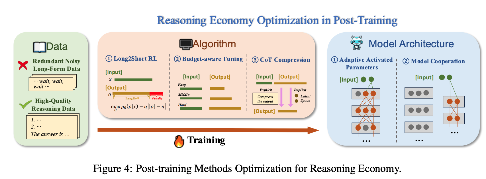
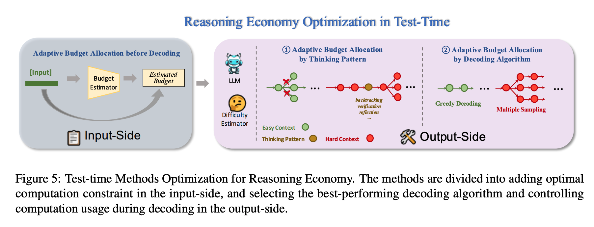

两篇关于高效reasoning的综述：

# reasoning economy

[Harnessing the Reasoning Economy A Survey of Efficient Reasoning for Large Language Models](https://arxiv.org/pdf/2503.24377)

+ 数据：
  + 干掉冗余、噪声、太长的数据
  + 保留高质量数据
+ 算法：
  + Long2Short RL：惩罚过长的输出
  + budget-aware tuning：简单问题输出短，复杂问题输出长
  + CoT Compression：显式/隐式压缩CoT
+ 模型：
  + adaptive Activated Parameters：类似稀疏激活
  + Model Cooperation：搞2个模型，简单问题走简单模型，复杂问题走复杂模型

+ 输入侧：解码之前进行自适应预算分配
  + 对输入进行成本预估
+ 输出侧：
  + thinking pattern的自适应预算分配：简单问题直接剪枝，复杂问题需要回溯+验证+反思
  + 解码算法的自适应预算分配：简单问题贪心解码，复杂问题多一些采样

# Stop Overthinking

[Stop Overthinking: A Survey on Efficient Reasoning for Large Language Models](https://arxiv.org/pdf/2503.16419)

+ model：
  + length reward：RL时加上新的reward，鼓励答案正确且cot短的
  + variable-length cot reasoning data：构造不同长度cot的数据集，然后sft
+ reasoning-output：
  + latent reasoning：将reasoning steps压缩成latent表示
  + dynamic reasoning：reasoning的过程改成投机采样、拒绝采样、tree-of-thoughts等方式
+ input prompt：
  + length prompts：let's use less than k tokens
  + routing by difficulty：训一个小模型，决定简单问题不思考，困难问题再思考
