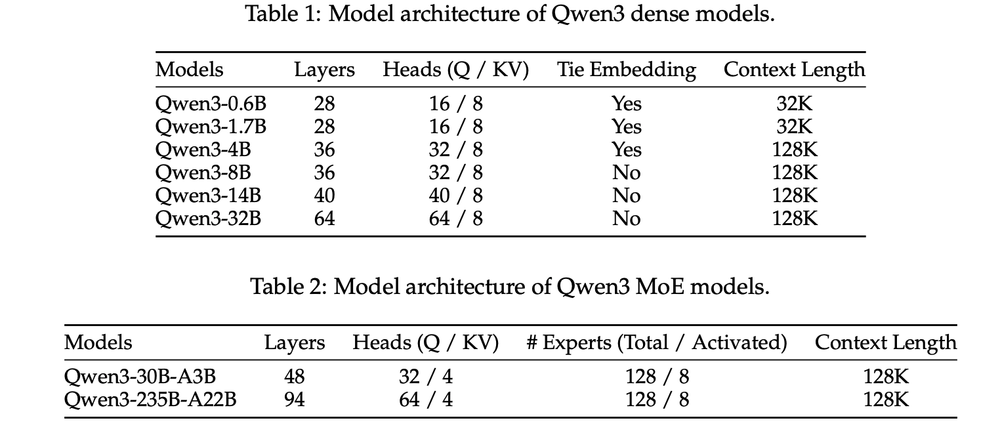
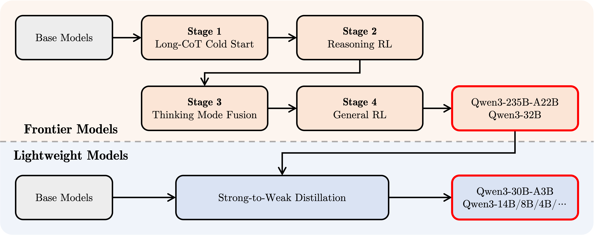
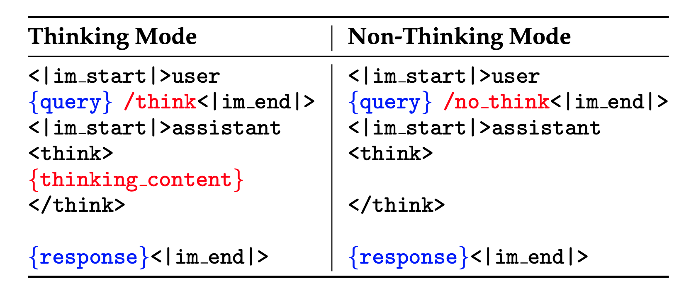

# Qwen3

[猛击OpenAI o1、DeepSeek-R1！刚刚，阿里Qwen3登顶全球开源模型王座，深夜爆火](https://mp.weixin.qq.com/s/gvWJMfy2ah4IHqyO-tP8MA)

[Qwen3：思深，行速](https://mp.weixin.qq.com/s/OvobsCPW0IwxeSm8pljv-A)

[Qwen3技术报告英中对照版.pdf](https://mp.weixin.qq.com/s/WJiW35ICxT7ox1-lGnqLIg)

[Qwen3 Technical Report](https://github.com/QwenLM/Qwen3/blob/main/Qwen3_Technical_Report.pdf)

[https://github.com/QwenLM/Qwen3](https://github.com/QwenLM/Qwen3)

[Qwen3技术报告首次全公开！“混合推理模型”是这样炼成的](https://mp.weixin.qq.com/s/VvugM54Z14mxGV-OOaVuwQ)

开源了两个MoE模型的权重：

+ Qwen3-235B-A22B：拥有2350多亿总参数和220多亿激活参数
+ Qwen3-30B-A3B：拥有约300亿总参数和30亿激活参数

此外，还有6个Dense模型：Qwen3-32B、Qwen3-14B、Qwen3-8B、Qwen3-4B、Qwen3-1.7B和Qwen3-0.6B

## 网络结构

tokenizer用的是Qwen的，即BBPE（byte-level byte-pair encoding），词表大小是151,669

dense架构和Qwen2.5类似，

+ 有GQA、SwiGLU、Rope和pre-normalization的RMSNorm等，
+ 删掉了Qwen2中的QKV-bias
+ 引入QK-Norm，保证训练稳定

MoE架构：

+ 类似Qwen2.5-MoE，实现了DeepseekMoE的细粒度的专家切分
+ 有128个专家，激活8个
+ 不同于Qwen2.5-MoE，没有共享专家
+ 使用global-batch load balancing loss来鼓励专家更专业化(specialization)，参考[Demons in the detail: On implementing load balancing loss for training specialized mixture-of-expert models](https://arxiv.org/abs/2501.11873)

注：其中的tie embedding指的是输入的emb和输出的emb共享




## 预训练

数据：

+ 数据规模：Qwen2.5是在18万亿个token上进行预训练的，而Qwen3使用的数据量几乎是其两倍，达到了约36万亿(36T)个token，涵盖了119种语言和方言。
+ 合成数据：
    + 先使用Qwen2.5-VL对大量类似PDF的文档进行文本识别。再利用Qwen2.5对识别出的文本进行优化以提升其质量。获得了额外的总量达数万亿tokens 的高质量文本。
    + 使用Qwen2.5、Qwen2.5-Math和Qwen2.5-Coder等模型合成了多种形式的文本token，包括教材、问答对、指令和代码片段等，覆盖数十个领域，总量达到数万亿tokens。

预训练过程分为三个阶段。

+ general stage：各Qwen3的模型都在超过30T个token上进行了预训练，序列长度为**4K token**，为模型提供了基本的语言技能和通用知识。
+ reasoning stage：通过增加如STEM(science/technology/engineering/mathematics)、编程和推理任务的数据比例来改进数据集，在这额外的5T个token上进行了预训练。
+ long context stage：使用高质量的长上下文数据将序列长度扩展到**32K token**，确保模型能够有效地处理更长的输入。
    + 数据集里有75%的长度是16384到32768之间，剩下的25%是4096到16384之间
    + 通过ABF技巧([Effective long-context scaling of foundation models](https://arxiv.org/abs/2309.16039))，将RoPE的base频率从10000增加到1000000
    + 使用YARN（[YaRN: Efficient context window extension of large language models](https://arxiv.org/abs/2309.00071)）和DCA(Dual Chunk Attention, [Training-free long-context scaling of large language models](https://arxiv.org/abs/2402.17463))，在推理阶段的序列长度capacity达到了4倍的增加

预训练效果：

+ Qwen3 Dense基础模型的整体性能与参数更多的Qwen2.5基础模型相当：Qwen3-1.7B/4B/8B/14B/32B-Base分别与Qwen2.5-3B/7B/14B/32B/72B-Base表现相当。特别是在STEM、编码和推理等领域，Qwen3 Dense基础模型的表现甚至超过了更大规模的Qwen2.5模型。
+ Qwen3 MoE基础模型在仅使用10%激活参数的情况下，达到了与Qwen2.5 Dense基础模型相似的性能，带来了训练和推理成本的显著节省。

## 后训练



四阶段：

### stage1: Long-CoT cold start

&nbsp;

使用多样的的长思维链数据对模型进行微调，涵盖了数学、代码、逻辑推理和STEM问题等多种任务和领域。每条样本都有验证过的reference答案或者是基于代码的测试用例。

+ query filter：
    + 用Qwen2.5-72B-Instruct来判断并过滤那些不容易验证的query，例如一些包括多个子问题的query，或者通用的文本生成。
    + 过滤掉了Qwen2.5-72B-Instruct不需要CoT reasoning就能正确回答的那些query。确保只有那些需要更深reasoning的复杂问题才保留下来
    + 为每个query通过Qwen2.5-72B-Instruct标注了领域，确保数据集里每种领域的分布比较平衡。
+ response filter：用QwQ-32B为每个query生成N个候选responses，当QwQ-32B一直没法生成正确解法时，人工介入来评估。对于pass@N为正的query，进一步地过滤掉如下几类回答：
    + 最终答案错误
    + 包含大量重复内容
    + 明显只是猜测、缺乏充分推理支撑
    + 思路过程与总结结论不一致
    + 存在语言混用或风格突变问题的
    + 疑似过于接近潜在的验证集内容

精挑细选出一小部分来训练，目标是在**不过度追求中间推理准确性**的前提下，先建立模型的**基础推理模式**。可以确保模型的潜力不会被早期训练限制住，从而为后续的RL阶段提供更大的优化空间和灵活性。为达成这一目标，建议在该准备阶段**尽量减少训练样本数量和训练步数**。

### stage2: Reasoning RL

&nbsp;

重点是大规模强化学习，利用基于规则的奖励来增强模型的探索和钻研能力。query-verifer的pair数据必须满足4个条件：

+ 没在cold start阶段用过
+ 对cold start模型来说是可学习的
+ 尽可能有挑战性
+ 包括了很多子领域

最终收集了3995个pair对，用GRPO训练。用大的batchsize，每个query有很多的rollouts，再加上off-policy的训练来提升采样效率，对训练都是有益的。同时，通过控制模型的entropy的稳定增加，以平衡探索和利用，对稳定训练非常重要。

### stage3: Thinking Mode Fusion

&nbsp;

在一份包括长思维链数据和常用的指令微调数据的组合数据上对模型进行微调，**将非思考模式整合到思考模型中**。确保了推理和快速响应能力的无缝结合。

+ sft数据构造：
    + 思考数据：拿stage1的query，用stage2的模型通过拒绝采样产出，保证sft不会让stage2的模型变差
    + 非思考数据：涵盖了很多tasks，例如代码、数学、指令遵循、多语言任务、创意写作、问答、角色扮演。此外，还用自动生成的checklists来评估非思考数据的回答质量
    + 为了增加在小语种上的效果，特地增加了翻译任务的占比
+ chat template设计：non-thinking模式里直接把```<think>```和```</think>```间置空。为了实现默认是thinking模式，当用户query没有```/think```时，也加了一些thinking模式的样本。对于多轮会话，在用户query里随机插入```/think```或者```/no_think```，让模型根据最后一个flag来产出回答。



+ thinking预算：一旦模型学会了在non-thinking和thinking模式进行回复时，自发地产生了一种能力：能够基于不完整的thiking来产出结果。这也是实现thinking预算控制的基础。当thiking的长度达到一个用户定义的阈值后，会手动停止thking模式，并插入一个instrunction：```Considering the limited time by the user, I have to give the solution based on the thinking directly now.\n</think>.\n\n```，然后模型就会自己输出回答了。值得注意的是，这种能力并非通过显式训练获得，而是应用思考模式融合后自然涌现出的结果。

[https://muellerzr.github.io/til/end_thinking.html](https://muellerzr.github.io/til/end_thinking.html)

可以参考这个来直接改logit，大概意思是假设生成了k个token，设置了最多思考m个token，那```</think>```这个token的logit乘以$1+\frac{m}{k}$，如果超预算了，直接把这个token的概率改成0，并把其他所有token的概率改成-inf，相当于强制输出这个token。。

### stage4: General RL

&nbsp;

建立了一个复杂的奖励系统，覆盖超过20种不同的任务，每项任务都配有定制化的评分标准。提升如下几个能力：

+ 指令遵循：模型准确地解释并遵循用户指令，包括内容、格式、长度、结构化输出等，与用户预期对齐
+ 模版遵循：遵循特定的格式要求，例如thinking和non-thinking模式、用设计好的token（```<think>```和```</think>```）来区分thinking和回复
+ 偏好对齐：对于开放性的问题，提升模型的helpfulness、engagement和style，提供更自然和令人满意的用户体验
+ Agent能力：工具调用，在rl rollout期间，模型能够与真实环境进行完整的多轮交互，并且得到执行反馈，从而提升long-horizon决策任务上的性能和稳定性
+ 特殊场景能力：例如RAG任务，设计reward，鼓励产生准确且符合上下文的答案，从而减小幻觉的风险

3种奖励机制：

+ 基于规则的奖励：有助于产出高准确率的答案，缓解reward hacking
+ 带参考答案的基于模型的奖励（Model-based Reward with Reference Answer）：对每个query给出一个参考答案，并用Qwen2.5-72B-Instruct基于这个参考答案对模型输出进行打分。相比规则reward更灵活，且能支持更多样的任务。
+ 不带参考答案的基于模型的奖励：利用人类偏好数据，训练一个reward model，对模型回答输出一个scalar。能够适用于更多类型的query。

### strong-to-weak蒸馏

&nbsp;

包括5个密集模型（Qwen3-0.6B、1.7B、4B、8B和14B）以及一个MoE模型（Qwen3-30B-A3B），蒸馏过程主要分为两个阶段：

+ **Off-policy蒸馏(即teacher产出样本)**：结合教师模型在 ```/think```和```/no_think```两种模式下生成的输出，用于对学生模型进行回应蒸馏。有助于轻量级学生模型掌握基本的推理能力，并学会在不同思考模式之间切换。
+ **On-policy蒸馏（即student产出样本）**：学生模型基于**当前策略**生成回应序列用于微调。我们对提示词进行采样，学生模型以 `/think` 或 `/no_think` 模式生成回应。随后，通过将其输出logits与教师模型（Qwen3-32B或Qwen3-235B-A22B）对齐，最小化两者之间的KL散度，从而对学生模型进行微调。
