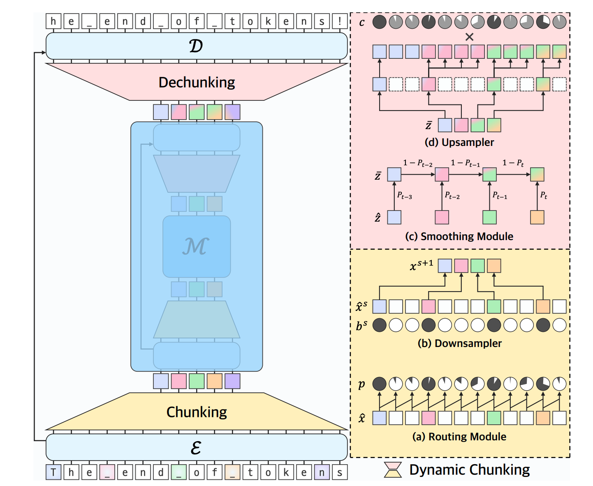
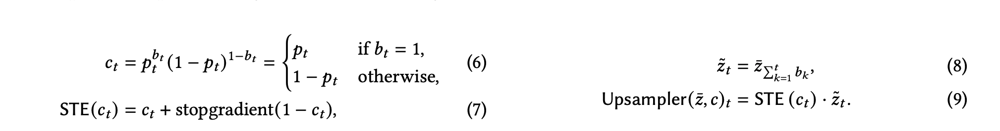

分层架构，假设输入有m个字

+ encoder + chunking：其中chunking模块包括两部分
    + routing module：通过相似度评分预测相邻元素之间的边界，可以理解为把原始输入分成k个词（chunk）
    + downsampler：基于边界进行下采样，即将每个边界词产出一个向量，共k个
+ 主网络：
+ dechunking + decoder：其中dechunking模块包括两部分：
    + smoothing module：将离散的chunk转化成插值的表示，用的是指数滑动平均（EMA），所以图里看着有点渐变的那个样子
    + upsampler：基于边界还原成m个字，用到了ste（Straight-Through Estimator）的技巧来保证训练稳定：
        + 前向：1和soomthing的输出z相乘
        + 反向：routing的输出p处理一下得到c（如果是边界那就是p，不是边界就用1-p，所以图中c和p有的一样，有的是“互补”的），和soomthing的输出z来相乘，其实就是保证有连续的梯度

