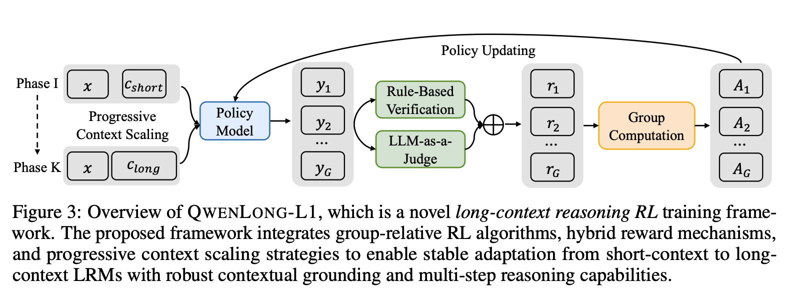

[QwenLong-L1: Towards Long-Context Large Reasoning Models with Reinforcement Learning](https://www.arxiv.org/abs/2505.17667)

长上下文推理强化学习范式中的两个核心挑战：

+ 次优的训练效率：
    + 奖励收敛较慢
    + 模型输出熵的显著降低，限制了优化过程中的探索行为。
+ 不稳定的优化过程
    + KL散度突刺较多
    + 这是由于较长的输出长度和不均匀的输入长度导致方差变大，导致策略更新不稳定。

QwenLong-L1：

+ 渐进式上下文扩展：
    + 监督微调预热（Warm-Up Supervised Fine-Tuning）：使用蒸馏的长上下文推理数据来sft模型，为RL获取稳定的初始策略，降低训练过程中的不稳定。 
    + 课程引导的分阶段强化学习（Curriculum-Guided Phased Reinforcement Learning）：将强化学习训练分为两阶段，每阶段仅训练当前长度区间的样本，避免混合长度导致的优化冲突。
        + 阶段1：输入长度20K
        + 阶段2：扩展至60K，逐步适应长上下文。
    + 难度感知的回顾采样（Difficulty-Aware Retrospective Sampling）：根据样本平均奖励动态计算难度，低奖励样本（高难度）被优先保留至后续阶段。阶段2训练时，包含阶段1的高难度样本，强制模型持续探索复杂case。 
+ 混合奖励机制：
    + 规则奖励：与标准答案严格匹配，确保答案格式正确性，防止 Reward Hacking。
    + 模型评判：用Qwen2.5-1.5B-Instruct作为轻量级评判模型，评估预测答案和标准答案之间语义等价性。
    + 组合策略：取规则与模型评判的最大值，兼顾精确性与答案多样性。
