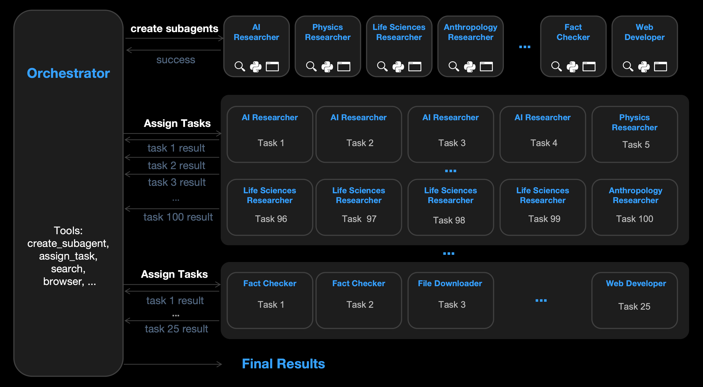

[Kimi 发布并开源 K2.5 模型，带来全新视觉理解、代码和 Agent 集群能力](https://mp.weixin.qq.com/s/Bhn43P1GnGXsvsh5MnN47Q)

原生的多模态架构设计，同时支持视觉与文本输入、思考与非思考模式、对话与Agent任务。

首次引入了「Agent 集群」(Agent Swarm)能力，经过并行智能体强化学习 (Parallel-Agent Reinforcement Learning, PARL) 训练，能够自主管理多达100个子智能体的智能体群，执行多达1500个协调步骤的并行工作流程，而无需预定义角色或手工设计的工作流程。

PARL使用可训练的orchestrator（编排/协调器）agent将任务分解为可并行化的子任务，每个子任务由动态实例化的frozen subagents执行。与顺序执行agents相比，并发运行这些子任务可显著降低端到端延迟。

由于独立运行的子智能体提供的反馈存在延迟、稀疏和非平稳性，训练一个可靠的并行orchestrator极具挑战性。常见的故障模式是串行崩溃，即orchestrator尽管具备并行能力，却默认执行单智能体任务。为了解决这个问题，PARL采用了分阶段奖励塑造(staged reward shaping)，在训练初期鼓励并行性，并逐步将重点转移到任务成功上。reward如下，

$$
R_t=\lambda_{\text {aux }}(e) \cdot \underbrace{r_{\text {parallel }}}_{\text {instantiation reward }}+\left(1-\lambda_{\text {aux }}(e)\right) \cdot \underbrace{(\mathbb{I}[\text { success }] \cdot Q(\tau))}_{\text {task-level outcome }}
$$

+ $\lambda_{\text {aux }}(e)$在训练中从0.1退火到0
+ 早期，辅助奖励$r_{\text {parallel }}$激励subagents的实例化和并发执行，从而促进对并行调度空间的探索
+ 随着训练的进行，优化方向转向端到端任务质量$Q(\tau)$，防止出现名义上启用并行但实际上却不启用并行的退化解决方案

为了进一步促使并行策略的出现，我们引入了一个**计算瓶颈**，使得顺序执行变得不切实际。即不计算总步数，而是使用Critical Steps(关键步数)来评估性能，是一个受并行计算中关键路径(critical path)启发的、面向延迟的指标。根据此指标，只有当生成更多子任务能够缩短关键路径时，生成更多子任务才有帮助：

$$
\text { CriticalSteps }=\sum_{t=1}^T\left(S_{\operatorname{main}}^{(t)}+\max _i S_{\mathrm{sub}, i}^{(t)}\right)
$$

+ $S_{\text {main }}^{(t)}$记录orchestration开销
+ $\max _i S_{\mathrm{sub}, i}^{(t)}$反映每个阶段中最慢的subagent