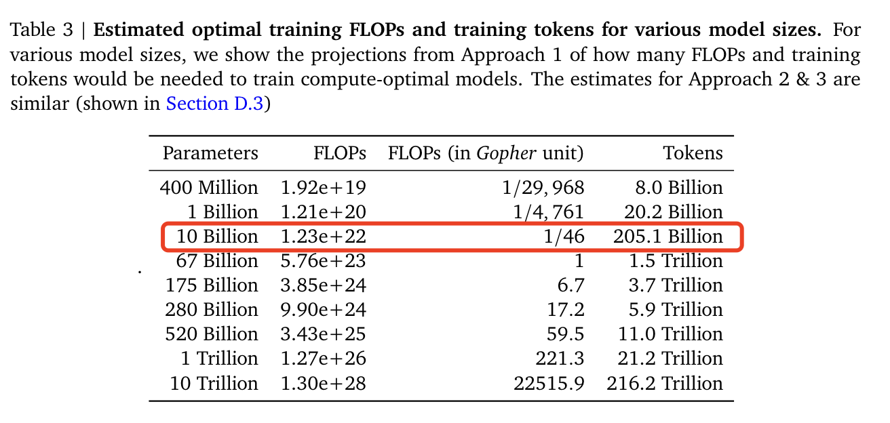

# openai的扩展法则

2020年,openai的[Scaling laws for neural language models](https://arxiv.org/pdf/2001.08361.pdf)通过拟合模型在不同数据大小（2000w到230亿个token）、不同的模型大小（7.68亿到15亿个**非嵌入参数**）的性能，提出了在**计算预算**$c$的条件下，$L$是用nats(信息量的单位，底数为e的ln，即交叉熵是用的ln，不是log2)表示的交叉熵损失，模型性能与**模型规模**$N$、**数据集规模**$D$以及**训练计算量**$C$间存在如下幂律关系：

$$L(N)=(\frac{N_c}{N})^{\alpha _N}, {\alpha}_N\sim 0.076,N_c\sim 8.8\times 10^{13}$$

$$L(D)=(\frac{D_c}{D})^{\alpha _D}, {\alpha}_D\sim 0.095,D_c\sim 5.4\times 10^{13}$$

$$L(C)=(\frac{C_c}{C})^{\alpha _C}, {\alpha}_C\sim 0.05,C_c\sim 3.1\times 10^{8}$$

其中，$N_c$表示非嵌入参数数量，$D_c$表示训练token数量，$C_c$表示PF-days，其中$1 PF-days = 10^{15}\times 86400=8.64\times 10^{19}$浮点数运算。

[Go Wider Instead of Deeper](https://arxiv.org/pdf/2107.11817)说了，transformer效果的提升**不在于计算量的变大**，而应该在于通过**提升模型的hidden dim**来增加模型参数量

# Chinchilla扩展法则

DeepMind在[Training compute-optimal large language models](https://arxiv.org/pdf/2203.15556.pdf)中提出了Chichilla扩展法则来指导LLM**最优计算量**的训练。通过变化更大范围的模型大小（7000w到160亿参数）和数据大小（50亿到5000亿个token）进行实验，拟合了如下的扩展法则：

$$
L(N, D)=E+\frac{A}{N^\alpha}+\frac{B}{D^\beta}
$$

其中$E=1.69,A=406.4,B=410.7,\alpha = 0.34, \beta =0.28$，通过在约束条件$C\approx 6ND$下优化损失$L(N,D)$，将计算预算最优地分配给模型大小和数据大小的方法：

$$
N_{o p t}(C)=G\left(\frac{C}{6}\right)^a, \quad D_{o p t}(C)=G^{-1}\left(\frac{C}{6}\right)^b
$$

其中$a=\frac{\alpha}{\alpha+\beta}$，$b=\frac{\beta}{\alpha+\beta}$，$G$是由$A,B,\alpha,\beta$计算出的扩展系数。

随着计算预算的增加，

+ openai的扩展法则更偏向于将更大预算分给**模型大小**，因为其对比各模型时使用了固定的训练数据量和学习率等超参，低估了数据量的作用。每增加10倍的计算量，应该让数据集大小增加为约1.8倍，模型参数量增加为约5.5倍。即**模型参数量更加的重要**。
+ Chinchilla扩展法则认为**模型大小和数据大小要同比例增加**，即$a$和$b$取值差不多。因为其在无视模型大小的前提下，发现设置与数据量差不多match的学习率能获得更好的loss。每增加10倍的计算量，应该让数据集大小增加为约3.16倍，模型参数量也增加为约3.16倍。即**数据集大小和模型参数量一样重要**。

然而，有一些能力（如涌现）无法根据扩展法则进行预测，只有当模型达到一定规模时才会出现。

飘红的就是常见的10B模型，大概要205B的token来训练，能达到**计算最优点**，当然**并不一定是loss最小的点**，这个可以参考llama3的现象

