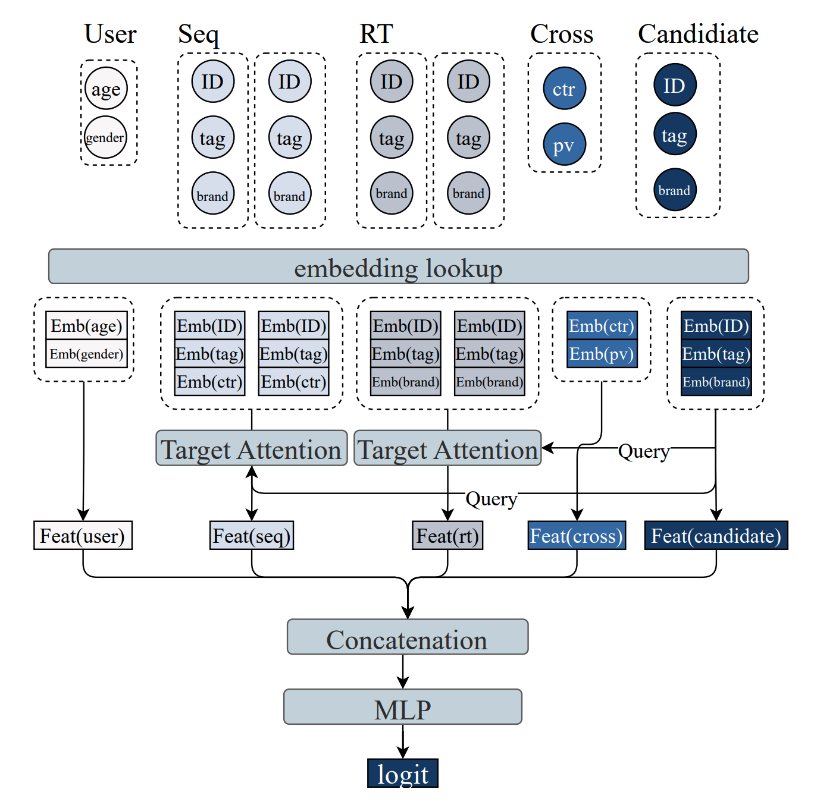
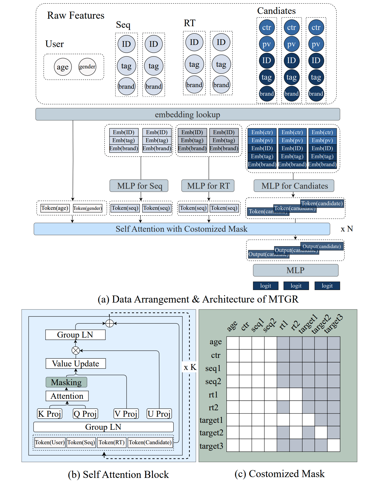

[MTGR: Industrial-Scale Generative Recommendation Framework in Meituan](https://www.arxiv.org/pdf/2505.18654v2)

听说是替换了精排

传统模型：



其中：

+ seq：用户的长期历史序列，静态的
+ rt：用户的实时序列，动态的
+ cross：历史与当前item交叉后的ctr/cvr



+ 人口属性组成若干个token放在最前面
+ 然后放静态序列seq
+ 然后放rt序列，注意这里是由近及远地排列，即先发生rt2再发生rt1
+ 最后放若干个target（把cross放到candidate里了），也是由近及远地排列
+ 堆叠若干层hstu后得到target1、2、3的预估logit

mask规则（深色是mask，白色可见）：

+ 人口属性和静态序列都是可见的
+ rt序列未来的看不到现在的，即rt2看不到rt1
+ 3个target：
    + 相互之间仅自己可见
    + 由于发生时间可能夹杂在rt1和rt2之间，所以需要按时间戳来决定它们对rt1和2的mask，例如图中的：
        + 先有target3：但target3比rt2还早，所以它看不到rt1、rt2
        + 再有target2：但target2在rt2和rt1之间，所以它看得到rt2，看不到rt1
        + 最后有target1：且target1发生在rt2和rt1之后，所以它看得以rt2和rt1

总结一下事件的发生顺序：

```python
seq2->seq1->target3->rt2->target2->rt1->target1
```