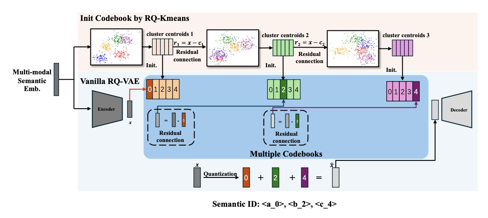
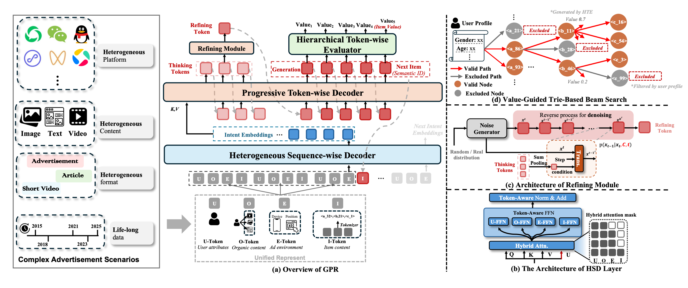

[GPR: Towards a Generative Pre-trained One-Model Paradigm for Large-Scale Advertising Recommendation](https://arxiv.org/pdf/2511.10138)

先用RQ-Kmeans得到一个高质量的码本，然后拿这个去初始化，然后再走正常的RQ-VAE，还在encoder里加了个残差，可以使训练更稳定&提升码本利用率

+ decoder输入的一个token包含4部分，u-token(user属性)、O-token(organic content，应该是体裁/场景之类的东西)、E-token（环境，例如设备、位置等）、I-token（item内容，用RQ-Kmeans+生成的sid表示），然后有如图的attn mask，decoder里会搞个token-aware FFN
+ decoder的最后一个输出emb，先输出几个thinking tokens，并通过refining module(类似扩散模型)，最终产出一个refine token
+ 拿这个refine token去生成下一个sid，生成的过程是value-guided trie-based beam search，这里的value是HTE（Hierarchical
Token-wise Evaluator）的预估分，HTE通过如下方法训练

+ 预训练:用mtp的方式
+ value-aware finetuning：不同action有不同value(例如展现=1，点击=2，转化=4)，对mtp每个token的loss加权
+ RL：把训好的gpr部署在生产环境和模拟环境里（定期同步），
    + 模拟环境中：用GPR产出k=40个item，然后请求该环境中的精排和后链路拿到打分，算一个融合分当成reward，这个其实是最细的那一级sid的reward
    + 考虑流行度等因素把这个item粒度的reward细拆到每一级的sid上，同时训练HTE来给出每个value的预估，并和reward算loss

还搞了Anticipatory Request Rehearsal (ARR)，来避免模型过拟合到历史数据上，即自己构造数据去请求模型得到样本，U-token复用，O-token拿用户最近的一个场景/体裁，E-token实时请求最新的，不同活跃度用户的构造频率不同