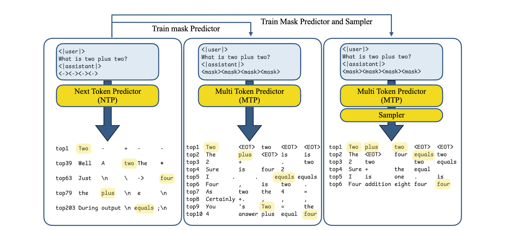
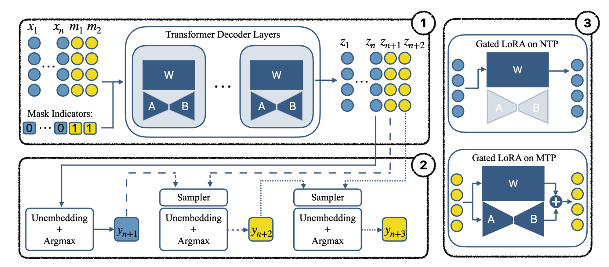
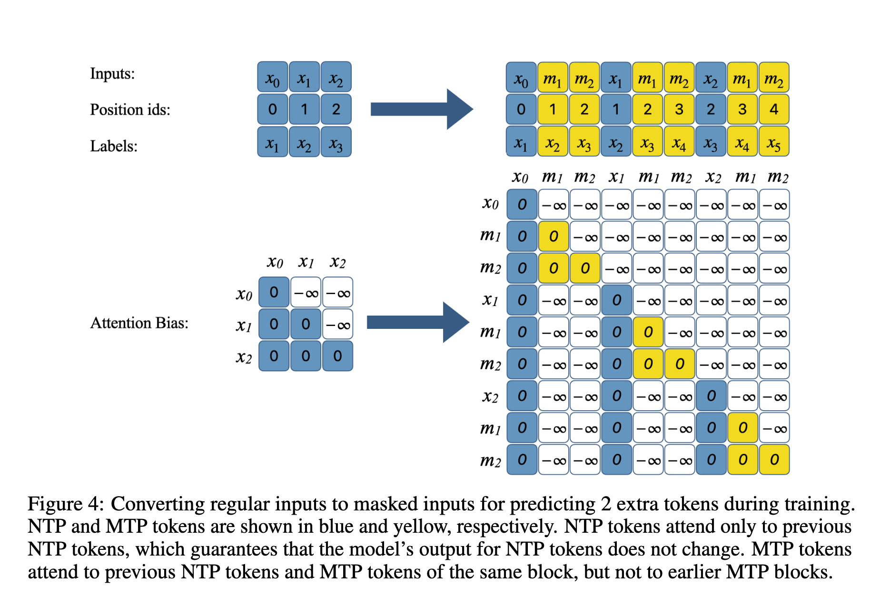
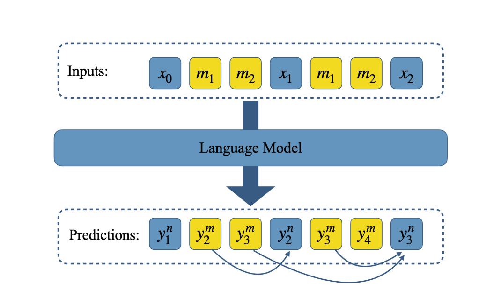

[Your LLM Knows the Future: Uncovering Its Multi-Token Prediction Potential](https://arxiv.org/pdf/2507.11851)



+ 原来的llm，ntp的话，如果在assistant后面给出4个placeholder(图中的```<->```)，其实能在top200里找得到最终答案，说明模型隐式地知道未来
+ 通过mask来finetue一个mtp的版本，能在top10里找到答案
+ 再加一个sampler能进一步提升



+ 在序列的最后加入$k$个不同的mask tokens，$[m_1,..,m_k]$（图中的黄色部分），和原序列拼在一起得到$X_m=\left[x_1, \ldots, x_n, m_1, \ldots, m_k\right]$，通过decoder模型输出的emb是$z_1,z_2,...,z_n,z_{n+1}, ...,z_{n+k}$
+ $y_{n+1}$还是通过自回归+unembedding（就是一个矩阵$W\in R^{V\times d}$，把emb映射回词表$p_n=Wz_n, z_n\in R^d$）+argmax预估的，而在生成m的预估即$y_{n+2}$到$y_{n+k}$时则会再加上一个sampler（其实就是输入有上一次采样出来的$y_{n-1}$和当前的$z_{n}$，过一个MLP再去和W乘）
+ gated LoRA adaptation：就是一个lora，但是对NTP（即输入x预测下一个x）并不生效，只对输入m走MTP的时候生效。MTP不仅更新lora的A和B，还更新sampler



假设输入3个x，预估2个m，划分为3个block:$[x_0,m_1,m_2],[x_1,m_1,m_2],[x_2,m_1,m_2]$，mask的原则如下：

+ NTP：每个x只能看到左边的x，看不到右边的x，而且是跨block的，即$x_2$能看到前2个block里的$x_1$和$x_0$
+ MTP：能看到当前block左边的m，看不到前面block里的m



一致性loss：如图，m1其实是模拟的x1，所以他的输出也要和x1的输出去对齐，m2同理

其中的随机采样细节看着有点复杂，还要再看下论文

