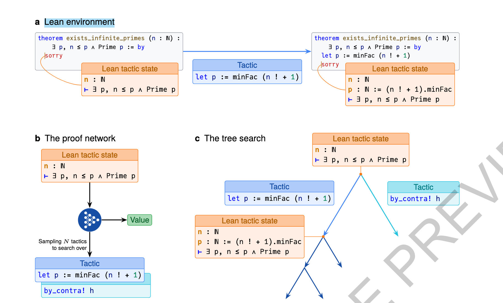

## AlphaProof(nature)

[Olympiad-level formal mathematical reasoning with reinforcement learning](https://www.nature.com/articles/s41586-025-09833-y)

+ 状态：Lean prover的逻辑状态，即Lean tactic state，表示已经建立的假设，和剩下的目标
+ 环境：给定一个状态，和agent采取的动作，输出下一个状态
+ 动作：一个证明的中间步骤，是一段文本，例如“a=2,b=2a,==>b=4”
+ episode结束条件：证明完成or预算花完（例如超时）
+ reward：每个tactic的reward都是-1，因为要鼓励用更少的步骤完成证明，即到达终点的分支路径最短

prover agent是把dnn和alphazero的搜索算法相结合：

+ proof network：是一个3B的encoder-decoder transformer，输入Lean tactic state，输出2个东西：
    + policy：下一步要尝试的N个动作
    + value：当前**状态**的价值，即从此刻到episode结束时的每步reward之和
+ tree search：和alphazero类似，使用AND-OR tree structure将证明拆成多个独立的子目标(类似[Hypertree proof search for neural theorem proving](https://arxiv.org/pdf/2205.11491))，采样使用的progressive sampling

+ 预训练：proof network在大概300 billion tokens的代码和数学语料通过next token prediction预训练
+ SFT：在300k的人类用matlab标注的证明语料(state-tactic pairs)上sft，
+ main RL：
    + 用gemini的LLM搞了一个自动形式化（formalization）的系统，将大概1M的非形式化的问题形式化成了80M的问题
    + proof network+tree search和Lean环境交互，生成形式化的证明和反证（disproof），然后用Alphazero的方式基于得到的经验去RL训练
+ inference：
    + 首先参考Alphazero，增加tree search的预算，例如产生更多的搜索路径
    + 如果增加了搜索路径还不够，那就用Test-time RL（TTRL）：
        + 给定一个问题，variant generator生成其变种（例如简化或者泛化）
        + 基于这些变种去进行RL训练
