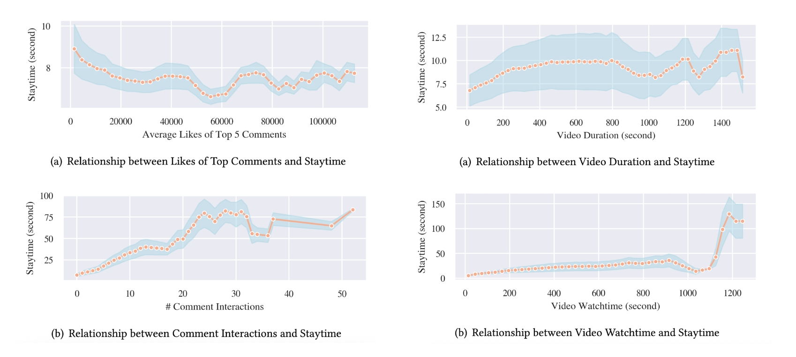
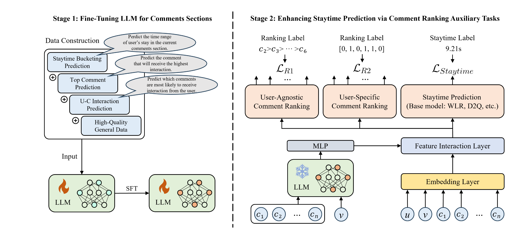

WWW Companion 25，[Comment Staytime Prediction with LLM-enhanced Comment Understanding](https://arxiv.org/pdf/2504.01602)

[https://github.com/lyingCS/LCU](https://github.com/lyingCS/LCU)

用户在一个视频上的的staytime=视频观看时长+评论区时长

用户在评论区的staytime和如下几个因素的关系（后面两个和本文关系不大）：

+ top评论的平均点赞数：点赞数越多，评论区的staytime越短，说明在比较不成熟的评论区，用户需要滑动更多来找到他们喜欢的评论，反之用户则更容易在头部评论里找到喜欢的
+ 评论的用户互动数（点赞/回复）：互动数越多，评论区的staytime越长，说明用户更有沉浸感
+ 视频物理时长：物理时长更长的视频，评论区的staytime更长
+ 视频观看时长：视频观看时长更长的视频，评论区的staytime更长，且在1000到1200s处有一个突增

两阶段：

+ 训练LLM：基于如下3个任务sft一个LLM
    + staytime分桶预估：给定用户历史行为，预估用户在评论区的staytime
    + top评论预估：给定一些评论，预估哪个评论的互动数最高
    + 用户-评论互动预估：给定一些评论，基于用户历史行为预估用户最有可能对哪些评论互动
+ LLM集成到推荐系统中并增加辅助loss
    + 用户无关的评论排序：给定评论list，给出评论热度的排序
    + 用户相关的评论排序：给定用户+评论list，预估用户对哪些评论会有互动
