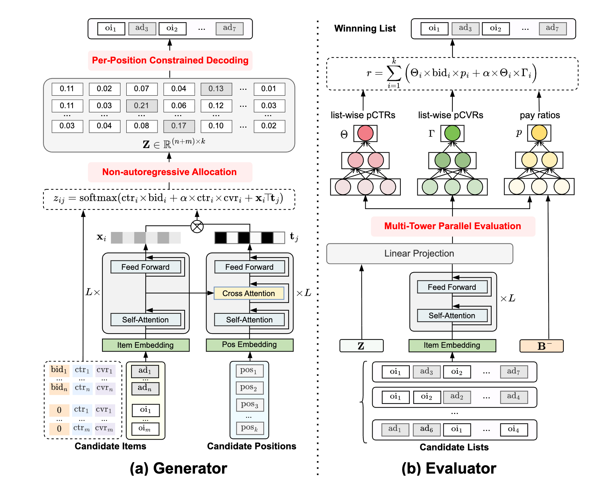

[NGA: Non-autoregressive Generative Auction with Global Externalities for Advertising Systems](https://arxiv.org/pdf/2506.05685)

美团的生成式广告混排

$bid_i$是广告主的出价，$p_i$是payment，可以理解为计费，即广告主实际出的钱，一般要求$p_i\le bid_i$，平台的目标如下：

$$
\max _{\mathcal{M}} \mathbb{E}_{a \in \mathcal{A}}[\operatorname{Rev}+\alpha \cdot \operatorname{Ord}]=\mathbb{E}_{a \in \mathcal{A}}\left(\sum_{i=1}^k p_i \cdot \operatorname{ctr}_i+\alpha \cdot \operatorname{ctr}_i \cdot \operatorname{cvr}_i\right),
$$

n个广告（图中的ad），m个自然结果（图中的oi，没有bid），最终的list长度为k

generator部分：

+ m+n个item emb过几层网络，k个pos emb过几层网络，中间二者会进行cross attention(快手的[Non-autoregressive Generative Models for Reranking Recommendation](https://arxiv.org/pdf/2402.06871)，即item当成k/v，pos当成query)，得到$(m+n)\times d$的x和$k\times d$的t
+ x和t矩阵乘得到一个$m+n\times k$的矩阵，再和每个item的ctr/bid/cvr一起算出一个融合分并过softmax（这个softmax是保证当前item在所有位置上的概率和是1）得到z
+ per-persition受限解码：根据各种业务规则，选择每个位置z最高的item，类似beam search，生成多个候选list，每个list有k个item

evaluator部分：

+ 输入generator产出的若干个list、对应的每个item的预估分Z、还有一个self-exclusion bidding profile $B^{-}$(即当前list里，除了自己以外，其他k-1个item的bid)
+ 上述输入经过3个网络，得到当前list的预估cvr $\Gamma \in \mathbb{R}^{k \times 1}$、预估ctr $\Theta \in \mathbb{R}^{k \times 1}$、预估payment $\boldsymbol{p} \in \mathbb{R}^{k \times 1}$（这个的输入包括了$B^{-}$），$\operatorname{pay}_i=\operatorname{bid}_i \times p_i$

$$
\begin{aligned}
& \Theta=\operatorname{Tower}\left(X_{\text {list }} ; Z\right) \\
& \Gamma=\operatorname{Tower}\left(X_{\text {list }} ; Z\right) \\
& \boldsymbol{p}=\operatorname{Tower}\left(X_{\text {list }} ; Z ; B^{-}\right)
\end{aligned}
$$

+ 最终算出来的list得分如下：

$$
R=\sum_{i=1}^k\left(\Theta_i \times \operatorname{bid}_i \times p_i+\alpha \times \Theta_i \times \Gamma_i\right)
$$