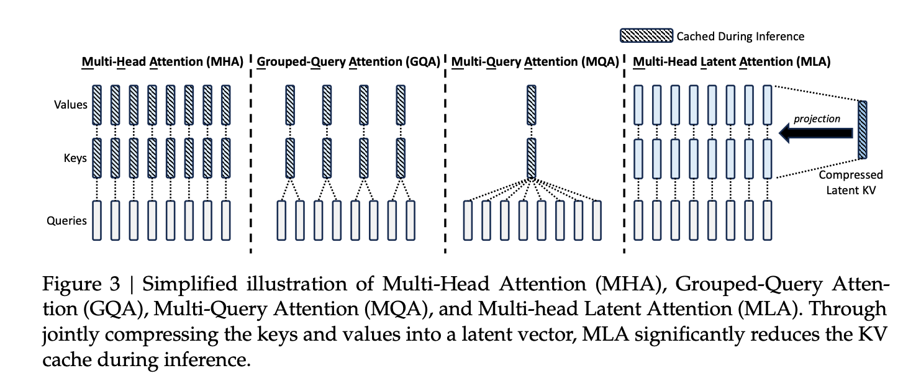
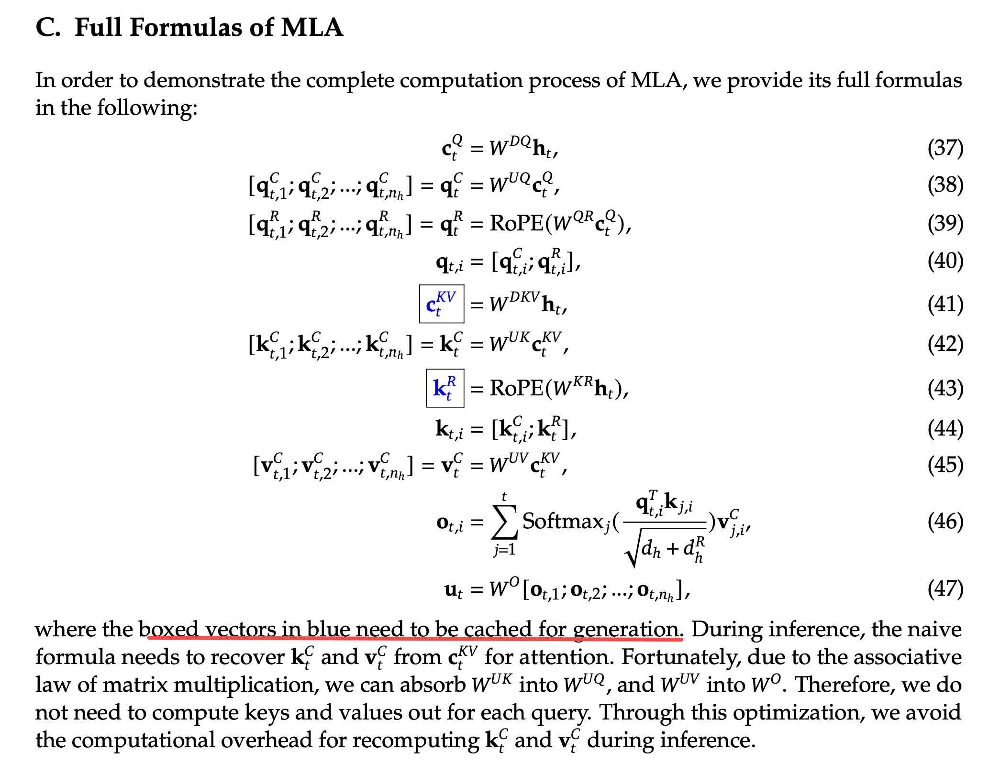

输入第$t$个token $h_t$，分别经过一个$W^Q$、$W^K$和$W^V$得到$d$维的$q_t=W^Qh_t$、$k_t=W^Kh_t$和$v_t=W^Vh_t$，split成$n_h$份，每份的dim是$d_h=d/n_h$，**每一份就是图里的一条竖线**

+ MHA(Multi-head Attention)：每个head各自算注意力，再拼接
+ GQA(Grouped-Query Attention)：出自[GQA: Training Generalized Multi-Query Transformer Models from Multi-Head Checkpoints](https://arxiv.org/pdf/2305.13245)，将所有Head分为$g$个组（g可以整除h），**每组共享**同一对K、V
+ MQA(Multi-Query Attention)：出自[Fast Transformer Decoding: One Write-Head is All You Need](https://arxiv.org/pdf/1911.02150)，让**所有Attention Head共享同一个K、V**
+ MHA(Multi-head Latent Attention)：
    + 降维：输入的$h_t$先过一个$W^{DKV}\in R^{d_c\times d}$，得到$c_t^{KV}=W^{DKV}h_t$，其中$d_c\ll d$
    + 升维：$k^C_t=W^{UK}c_t^{KV}$，$v^C_t=W^{UV}c_t^{KV}$，其中$W^{UK}\in R^{d\times d_c}$，$W^{UV}\in R^{d\times d_c}$
    + 同时对q也降维，不过是降到$d'_c$，$c^Q_t=W^{DQ}h_t$，$q^C_t=W^{UQ}c_t^Q$，其中$c^Q_t\in R^{d'_c}$，$W^{UQ}\in R^{d_hn_h\times d'_c}$
    + 为了兼容RoPE，
        + $q^R_t=RoPE(W^{QR}c^Q_t)$，其中$W^{QR}\in R^{d^R_hn_h\times d'_c}$，再split成$n_h$份：$[q^R_{t,1};q^R_{t,2};...;q^R_{t,n_h}]$，每一份的dim是$d^R_h$
        + $k^R_t=RoPE(W^{KR}h_t)$
        + $q_{t,i}=[q^C_{t,i};q^R_{t,i}]$，$k_{t,i}=[k^C_{t,i};k^R_t]$，维度都是$d_h+d^R_h$，
        + 再拿这个q和k去算attn，$o_{t,i}=\sum ^t_{j=1}softmax_j(\frac{q^T_{t,i}k_{j,i}}{\sqrt {d_h+d^R_h}})v^C_{j,i}$
        + $u_t=W^O[o_{t,1};o_{t,2};...;o_{t,n_h}]$

| attn | KV Cache per Token | Capability |
|-------|---------------------------------|-------|
| MHA | $2n_hd_hl$ | Strong   |
| GQA | $2n_gd_hl$ | Moderate  |
| MQA | $2d_hl$  | Weak  |
| MLA | $(d_c + d_h^R)l \approx \tfrac{9}{2}d_hl$ | Stronger |

最终在计算时，需要cache的是图中的蓝色部分，所以是$(d_c + d_h^R)l$，在Deepseek-v2中，设置$d_c=4d_h, d^R_h=d_h/2$

