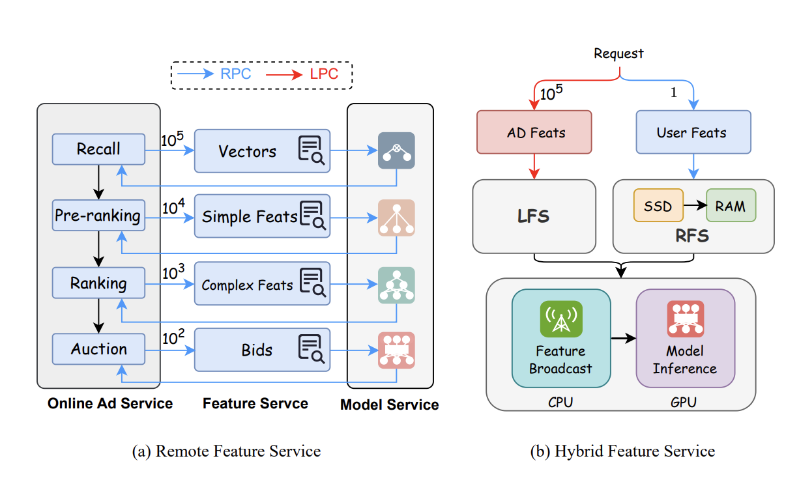
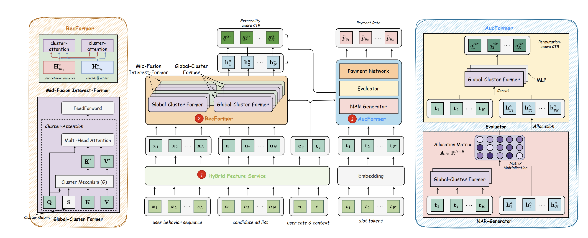

+ 传统的特征抽取服务如左图，每个阶段都会rpc请求对应特征
+ hfs：user侧只取一次，item侧只保留类别型特征，干掉交叉特征，全库取一次

+ 输入：user长度为L的序列、user和context特征、全库N个候选、最终的K个广告位（slot）
+ recformer
    + Global Cluster Former(GCF)：聚类版本的self-attention，通过一个可学习的聚类矩阵将序列长度从$N$（候选10w量级，用户序列千级别）压缩到$N_c$（大概100），作为新的K和V，再去和原始的Q(长度为$N$)做attention，算完后长度还是$N$
    + Mid-fusion Interest-Former(MIF)：用户序列和候选序列一起算cluster attention，即互相算一个target attention
    + 因为是mid-fusion，所以就是比如先2层gcf，再一层mif，这样堆叠
    + 最终输出N个候选的表示，和user emb concat一起，过mlp得到预估ctr
+ aucformer
    + Non-autoregressive generator(NAR-generator)：$N$个候选$H_{ad}\in R^{N\times d}$，$K$个广告位$T\in R^{K\times d}$，相乘得到分配矩阵$A=H_{ad}T^T\in R^{N\times K}$，结合出价$b$得到广告$i$在位置$k$上的概率：$\mathrm{z}_{i ; k}=\operatorname{Softmax}\left(\left[e^{w_z} \times \hat{q}_j^{\mathrm{ctr}} \times b_j+\mathbf{A}_{j, k}\right]_{j=1}^K\right)_i$）。推理的时候每个slot取得分最高的广告（根据先后顺序去重）
    + Permutation-aware evaluator：把前面选出来的K个广告的emb，和K个slot的emb，通过GCF+MLP（同样最后会和user emb concat一起，过mlp）得到K个位置的考虑了位置信息和外部信息（user emb）的预估ctr
    + Payment network：K个广告的emb，evaluator输出的预估ctr，以及除了当前广告外其他K-1个广告的bid，concat起来过mlp，得到最后的预估转化率

训练：

+ 预训练：除了计算正常下发曝光的K个Item, 还会基于流行度采样$N_s$个样本用于计算整体的损失
+ 后训练：
    + 训练RM：permutation-aware evaluator当做奖励模型，只用曝光样本训练
    + RL：基于RM，计算整个list的奖励，看着有点像vcg的东西
    + 优化Payment network：引入拉格朗日乘子进行优化
