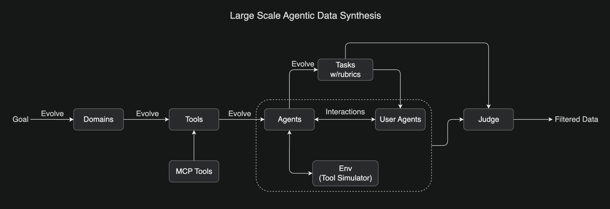

# 模型结构

[https://huggingface.co/moonshotai/Kimi-K2-Instruct](https://huggingface.co/moonshotai/Kimi-K2-Instruct)

| 项目                             | 值                      |
|---------------------------|----------------------|
| 总参数量               | 1T                          |
| 激活参数量             | 32B                         |
| 层数   | 61                          |
| Dense层数           | 1                           |
| Attention Hidden Dimension       | 7168                        |
| MoE Hidden Dimension (每个 Expert) | 2048                      |
| Attention Head数        | 64                          |
| 专家数                | 384                         |
| 每个token选择的专家数       | 8                           |
| 共享专家数         | 1                           |
| Vocabulary Size                  | 160K                        |
| Context Length                   | 128K                        |
| Attention              | MLA                         |
| 激活函数              | SwiGLU                      |

# MuonClip优化器

[月之暗面开源改进版Muon优化器，算力需求比AdamW锐减48%，DeepSeek也适用](https://mp.weixin.qq.com/s/E65ULmjlK7Lv81dqvAubcQ)

原始muon：[https://github.com/KellerJordan/Muon](https://github.com/KellerJordan/Muon)

[Muon is Scalable for LLM Training](https://github.com/MoonshotAI/Moonlight/blob/master/Moonlight.pdf)

[https://github.com/MoonshotAI/Moonlight](https://github.com/MoonshotAI/Moonlight)

K2的架构和deepseek-v3类似，为了更好地scale up：

+ 减小了head数以提升长上下文的效率
+ 增加MoE的稀疏度以提升token效率

但scale up的挑战就是attention logit的爆炸带来的训练不稳定，现有的例如logit的soft capping和q-k norm还不够。因此，对Muon优化器引入了qk-clip，即在Muon更新之后，对q和k的映射矩阵直接rescale，从而在源头上控制attention logits的scale，

$$
\begin{gathered}
q_i=\eta^\alpha W_q x_i \\
k_i=\eta^{1-\alpha} W_k x_i
\end{gathered}
$$

其中$\alpha$是一个超参，对应的attention logit就变成了：

$$
\left(\eta^\alpha q_i\right)^{\top}\left(\eta^{1-\alpha} k_j\right)=\eta q_i^{\top} k_j
$$

而$\eta$是每个step后，根据这个step里的最大attention logit来设置的，$t$是一个提前设置好的阈值

$$
\eta=\min \left(\frac{t}{\max _{i, j}\left(q_i^{\top} k_j\right)}, 1\right)
$$

这种方法使得K2没有logit爆炸，且能保持下游任务的性能，在15.5T的tokens上稳定训练，没有loss spike

# Agentic能力

+ 大规模Agentic Tool Use数据合成：参考ACEBench，开发了一个pipeline，可以大规模模拟真实世界的工具使用场景。覆盖数百领域、数千工具（包括MCP）。所有任务都基于评分标准（rubric），agent和user agent还有环境（工具模拟器）进行交互，通过llm进行judge，最终筛选出一个高质量的数据集。

+ 通用强化学习：

可验证任务的如数学和编程竞赛，而撰写研究报告则是不可验证的任务。这个通用强化学习系统还采用自我判断(self-judging)机制，让模型充当自身的critic，为不可验证任务提供可扩展的、基于评分标准(rubric)的反馈。

同时，使用可验证奖励的on-policy rollout来持续更新critic，使critic不断提高其在最新policy上的评估准确性。可以看成是一种利用可验证奖励来改进不可验证奖励估计的方法。