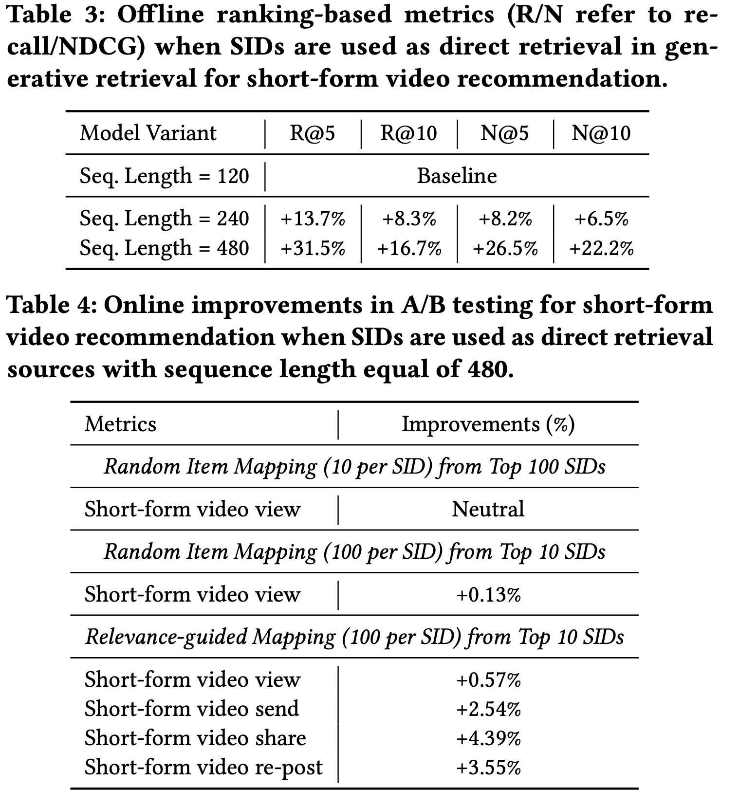

[Semantic IDs for Recommender Systems at Snapchat: Use Cases, Technical Challenges, and Design Choices](https://arxiv.org/pdf/2604.03949)

# RQ-VAE回顾

encoder把输入的d维向量映射成n维，有L级code，每一级有K个取值，第0个codebook的第0个sid code就是

$$
\operatorname{sid}_0=\underset{c \in\{0,1, \ldots, K-1\}}{\arg \max }\left\|\mathbf{h}_i^0 \cdot \mathbf{C}_0[c]\right\|_{\mathrm{F}}, \text { with } \mathbf{h}_i^0=\operatorname{Enc}\left(\phi\left(x_i\right)\right)
$$

然后第l个code如下，其中$\mathbf{h}_i^l=\mathbf{h}_i^{l-1}-\mathbf{C}_{l-1}\left[\operatorname{sid}_{l-1}\right]$

$$
\operatorname{sid}_l=\underset{c \in\{0,1, \ldots, K-1\}}{\arg \max }\left\|\mathbf{h}_i^l \cdot \mathbf{C}_l[c]\right\|_{\mathrm{F}}
$$

最终再decode回去就是

$$
\hat{\mathbf{h}}_i=\operatorname{Dec}\left(\sum_{l \in\{0, \ldots, L-1\}} \mathrm{C}_l\left[\operatorname{sid}_l\right]\right)
$$

有2个loss，一个是重建loss，一个是commitment loss（拉近h和c的距离）

# 挑战

挑战1：码本坍塌（Codebook Collapse）：模型只利用了码本的一小部分，设计了2种方式：

+ STE（straight-through estimator）：直接更新整个码本，原始RQ-VAE是只更新argmax出来的那个code，这种稀疏更新方式很依赖码本的初始化。最原始的VQ-VAE论文([Neural Discrete Representation Learning](https://proceedings.neurips.cc/paper_files/paper/2017/file/7a98af17e63a0ac09ce2e96d03992fbc-Paper.pdf))里也用到了，另外[https://www.daiwk.net/1.2.llm_intro#h-net](https://www.daiwk.net/1.2.llm_intro#h-net)这里也有。STE如下，其中$\operatorname{sim}\left(\mathbf{h}_i^l, \mathbf{C}_l\right) \in \mathcal{R}^K$表示cos相似度

$$
\hat{\mathbf{h}}_i=\operatorname{Dec}\left(\sum_{l \in\{0, \ldots, L-1\}} \mathrm{C}_l\left[\operatorname{sid}_l\right]+\operatorname{sim}\left(\mathbf{h}_i^l, \mathbf{C}_l\right) \cdot \mathbf{C}_l-\operatorname{sg}\left[\operatorname{sim}\left(\mathbf{h}_i^l, \mathbf{C}_l\right) \cdot \mathbf{C}_l\right]\right)
$$

+ 基于多个embed来源来学习sid：例如图片emb、文本emb、meta数据对应的emb等，多个emb进行merge：

$$
\mathbf{h}_i=\sum_{m \in M} \operatorname{Enc}_m\left(x_m\right) \text { and } \hat{\mathbf{h}_{i, m}}=\operatorname{Dec}_m\left(\sum_{l \in\{0, \ldots, L-1\}} \mathrm{C}_l\left[\operatorname{sid}_l\right]\right)
$$

挑战2：SID-to-Item Resolution：同一个sid对应的一堆item如何消歧

+ 基于启发式方法的代码内消歧：其实就是加一些人工规则排序，例如后验/新鲜度等
+ 考虑检索深度而非广度：方案a只取少量的top sid，每个sid拉很多item出来；方案b取很多sid，每个sid只拉一点item出来，方案a效果更好

# 在线实验

+ sid作为辅助特征：
    + 广告排序：item文本信息过qwen得到emb，再搞成sid丢给精排
    + 好友推荐和搜索排序：用[GraphHash: Graph Clustering Enables Parameter Efficiency in Recommender Systems](https://arxiv.org/pdf/2412.17245)搞了个基于模块度的Louvain方法做社区发现，将uid映射成多级社区的id表示（类似sid），当成特征加进排序模型
+ sid做GR召回：在之前的文章[Generative Recommendation with Semantic IDs: A Practitioner's Handbook](https://arxiv.org/pdf/2507.22224)里讲了模型细节，效果如下：拉长序列指标有涨，前面讲的方案a比方案b更好，启发式的规则排序能带来业务指标收益

+ sid质量评估：uniqueness表示unique used SIDs / total number of items，其实就是衡量sid冲突严重程度的指标。发现这个值和recall@k并不是完全正相关，比较低的时候有这个趋势，但达到一定阈值的时候，uniqueness继续涨，recall@k基本平了