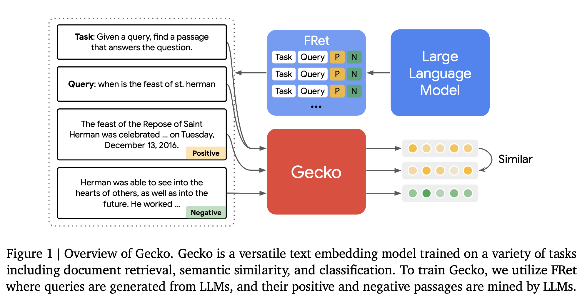
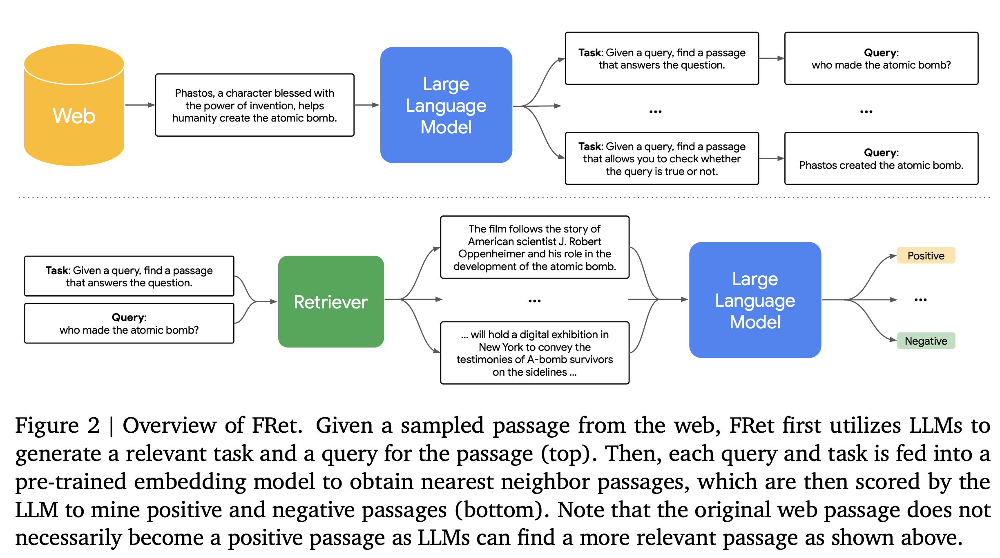

## Gecko

[谷歌DeepMind发布Gecko：专攻检索，与大7倍模型相抗衡](https://mp.weixin.qq.com/s/5e_Py_Xm0RsmP1YMcikpaQ)

[Gecko: Versatile Text Embeddings Distilled from Large Language Models](https://arxiv.org/pdf/2403.20327.pdf)



主要包括两阶段：

+ pre-finetuning：类似[Large dual encoders are generalizable retrievers](https://arxiv.org/pdf/2112.07899)，自监督
+ finetuning：2-step llm distillation，提出了一个FRet数据集（Few-shot Prompted Retrieval dataset）

### Pre-finetuning

&nbsp;

2个数据集：

+ 大型社区qa数据集：[Large dual encoders are generalizable retrievers](https://arxiv.org/pdf/2112.07899)中的来自网上论坛和qa网站的问答pair对
+ 去各种网站上爬了title-body的pair对，因为[Text Embeddings by Weakly-Supervised Contrastive Pre-training](https://arxiv.org/pdf/2212.03533)发现这种自然出现的pair对对于pre-finetuning embedding模型很有用

pre-finetuning的目标是让模型看到大量的多样性语料，对于一个预训练的语言模型$\mathcal{M}$，长度为$n$的句子对应的contextual向量$\mathbf{W} \in \mathbb{R}^{n \times d}$，对于任务特征$t$，数据集$\mathcal{D}_{\text {pre }}=\left\{\left(q_i, p_i\right)\right\}_{i=1}^N$，得到的向量如下：

$$
\begin{aligned}
\mathbf{q}_i & =\text { mean\_pool }_{|t|+\left|q_i\right|}\left[\mathcal{M}\left(t \oplus q_i\right) \in \mathbb{R}^{\left(|t|+\left|q_i\right|\right) \times d}\right] \in \mathbb{R}^d \\
\mathbf{p}_i & =\text { mean\_pool }_{\left|p_i\right|}\left[\mathcal{M}\left(p_i\right) \in \mathbb{R}^{\left|p_i\right| \times d}\right] \in \mathbb{R}^d
\end{aligned}
$$

对于batchsize为$B$的样本来说，inbatch负例，$\operatorname{sim}(\mathbf{x}, \mathbf{y})=\frac{\mathbf{x}^{\top} \mathbf{y}}{\|\mathbf{x}\| \cdot \cdot\|\mathbf{y}\|}$，其loss如下：

$$
\mathcal{L}_{\text {pre }}=\frac{1}{B} \sum_{i=1}^B\left[-\log \frac{e^{\operatorname{sim}\left(\mathbf{q}_i, \mathbf{p}_i\right) / \tau}}{\sum_{j=1}^B e^{\operatorname{sim}\left(\mathbf{q}_i, \mathbf{p}_j\right) / \tau}}\right]
$$

在这个阶段没有用hard负例，用了能适配设备的最大batchsize，这是[Towards General Text Embeddings with Multi-stage Contrastive Learning](https://arxiv.org/pdf/2308.03281)和[Text embeddings by weakly-supervised contrastive pre-training](https://arxiv.org/pdf/2212.03533)里的经验。


### FRet



#### LLM-based Diverse Query Generation 

&nbsp;

从web语料$\text { C }$中抽出一个段落$p_{\text {seed }}$，$\mathbb{P}_{\mathrm{QG}}$是一个固定的few-shot的prompt，让LLM生成任务描述和这个task的query

$$
\operatorname{LLM}\left(\mathbb{P}_{\mathrm{QG}}, p_{\text {seed }}\right) \rightarrow(t, q)
$$

生成的任务t例如：

+ question answering：```Given a query, find a passage that has the answer to the query```
+ fact checking：```Given a query, find a passage that allows you to check whether the query is true or not```

为了保证多样性：

+ 网页库本身就有很多的topic和很多的写作风格
+ 在prompt里加多样的任务描述，来让模型生成的query保证多样性。

#### LLM-based Positive and Negative Mining

&nbsp;

对于某个query $q$，之前的工作一般会直接把输入的段落$p_{\text {seed }}$当成正样本，但实践中发现$p_{\text {seed }}$一般比较长，而生成的query一般只关注其中一小部分，所以可能在整个语料库中有比$p_{\text {seed }}$更准确的答案。因此，通过如下方法构造了一个FRet数据集：

+ 先把$p_{\text {seed }}$当成正样本，in-batch负例训一个embedding模型。
+ 用这个模型从文档库中检索出top N的相似段落$P=\left\{p^{(1)}, \ldots, p^{(N)}\right\}$
+ 用生成query的LLM给这N个文档排序，有两种排序方法：
    + query likelihood：参考[Improving passage retrieval with zero-shot question generation](https://arxiv.org/pdf/2204.07496)，给定段落$p$，衡量query $q$的likelihood，$\mathrm{QL}(q, p)=\operatorname{LLM}\left(q \mid p, \mathbb{P}_{\mathrm{QL}}\right)$，其中的prompt参考[PaRaDe: Passage Ranking using Demonstrations with Large Language Models](https://arxiv.org/pdf/2310.14408)包括了判断query likelihood的指令，以及一些相关query+段落的few-shot。基本思想是：**如果q和p高度相关，那么从p生成q的概率应该很高**。
    + relevance classification：参考[Beyond yes and no: Improving zero-shot llm rankers via scoring fine-grained relevance labels](https://arxiv.org/pdf/2310.14122)，给定query $q$和段落$p$后，衡量特定相关性label的log likelihood：$\operatorname{RC}(q, p)=\operatorname{LLM}\left(\text { label } \mid q, p, \mathbb{P}_{\mathrm{RC}}\right)$。基本思想是：**让LLM直接判断q和p的相关程度,并输出一个相关性标签**。
+ 通过标准的Reciprocal Rank Fusion（RRF，倒数融合，[Reciprocal rank fusion outperforms condorcet and individual rank learning methods](https://plg.uwaterloo.ca/~gvcormac/cormacksigir09-rrf.pdf)）方法得到rank函数，对上面两个方法的排序结果merge：$R(q, p)=1 / r_{\mathrm{QL}}(q, p)+1 / r_{\mathrm{RC}}(q, p)$...其实就是rankindex
+ 基于得分筛选样本：
    + 正样本：$p^{+}=\underset{p \in P}{\arg \max } R(q, p)=p_1$
    + hard负例：排名第$N$位的样本$p_N$，也可以从除了第1个外的N-1个里随机sample

### Unified Fine-tuning Mixture

&nbsp;

除了FRet，还融合了多个公开数据集：

+ Natural Questions：[Natural Questions: A Benchmark for Question Answering Research](https://aclanthology.org/Q19-1026.pdf)
+ HotpotQA：[Hotpotqa: A dataset for diverse, explainable multi-hop question answering](https://arxiv.org/pdf/1809.09600)
+ FEVER：[Fever: a large-scale dataset for fact extraction and verification](https://arxiv.org/pdf/1803.05355)
+ MedMCQA：[Medmcqa: A large-scale multi-subject multi-choice dataset for medical domain question answering](https://arxiv.org/pdf/2203.14371)
+ SNLI：[A large annotated corpus for learning natural language inference](https://arxiv.org/pdf/1508.05326)
+ MNLI：[A broad-coverage challenge corpus for sentence understanding through inference](https://arxiv.org/pdf/1704.05426)
+ MIRACL：多语言的数据集[Miracl: A multilingual retrieval dataset covering 18 diverse languages](https://direct.mit.edu/tacl/article/doi/10.1162/tacl_a_00595/117438/MIRACL-A-Multilingual-Retrieval-Dataset-Covering)
+ huggingface上的一些分类数据集

将这些数据集处理成一个统一的格式，发现不同的任务对prompt的格式敏感程度不同，，非对称任务（如BEIR）对格式更敏感，而对称任务的性能相对稳定。

+ 对称格式（Symmetric Formatting）：输入和目标使用相同的格式。
    + 输入：task: {task} | query: {input}
    + 目标：task: {task} | query: {target}
+ 非对称格式（Asymmetric Formatting）：输入和目标使用不同的格式。
    + 输入：task: {task} | query: {input}
    + 目标：title: {title} | text: {target}

参考[One Embedder, Any Task: Instruction-Finetuned Text Embeddings](https://aclanthology.org/2023.findings-acl.71.pdf)，对于每个文本$x$，找到另一个同样label是$y$的样本当成正样本$x^{+}$，随机找一个label不是$y$的当作负样本$x^{-}$。

实践中，在一个batch中，同一个$x^+$可能出现overlap，会造成in-batch negatives中的false negative问题。参考[poe的回复](https://poe.com/s/XHJyRAAOc9ZAuQu5yz2p)，即同一个mini-batch中假设有(x1, x1+, x1-) 和 (x2, x2+, x2-)，可能出现x1+ 与 x2 或 x2+ 相同或非常相似的情况。那么：

+ 对于x1来说，x1+是正例。
+ 但是如果x1+ 与 x2 相同或非常相似，模型可能会错误地认为x1+应该与x2区分开来，因为x2是另一个样本的输入。
+ 或者如果x1+ 与 x2+ 相同或非常相似，模型可能会混淆应该如何处理这个重叠的样本。

因为在理想情况下，x1+应该只是x1的正例，而不应该被视为任何其他样本的负例。但由于重叠，模型可能错误地将x1+视为x2或其他样本的负例。解决方法，给每个三元组分配唯一的id，让模型专注于在给定x的情况下，区分x+和x-。

有$M$个数据集$\left[\mathcal{D}^{(1)}, \ldots, \mathcal{D}^{(M)}\right]$，每个数据集是$\mathcal{D}^{(m)}=\left\{\left(t_i, q_i, p_i^{+}, p_i^{-}\right)\right\}_{i=1}^N$，$t$是任务描述，给定一个batch_size=B的batch，同batch里的其他query可以看成[SamToNe: Improving Contrastive Loss for Dual Encoder Retrieval Models with Same Tower Negatives](https://arxiv.org/pdf/2306.02516)中说的same-tower negative（对同模态的效果比较好，例如这边都是query）：

$$
\mathcal{L}_{\text {main }}=\frac{1}{B} \sum_{i=1}^B\left[-\log \frac{e^{\operatorname{sim}\left(\mathbf{q}_i \mathbf{p}_i^{+}\right) / \tau}}{\sum_{j=1}^B\left(e^{\operatorname{sim}\left(\mathbf{q}_i \mathbf{p}_j^{+}\right) / \tau}+\mathbb{1}_{[j \neq i]} e^{\operatorname{sim}\left(\mathbf{q}_i, \mathbf{q}_j\right) / \tau}\right)+e^{\operatorname{sim}\left(\mathbf{q}_i \mathbf{P}_i^{-}\right) / \tau}}\right]
$$

同时还参考[Matryoshka representation learning](https://arxiv.org/pdf/2205.13147)的俄罗斯套娃加了一个MRL的loss，让模型适配不同的dim，gecko是768和256的dim


